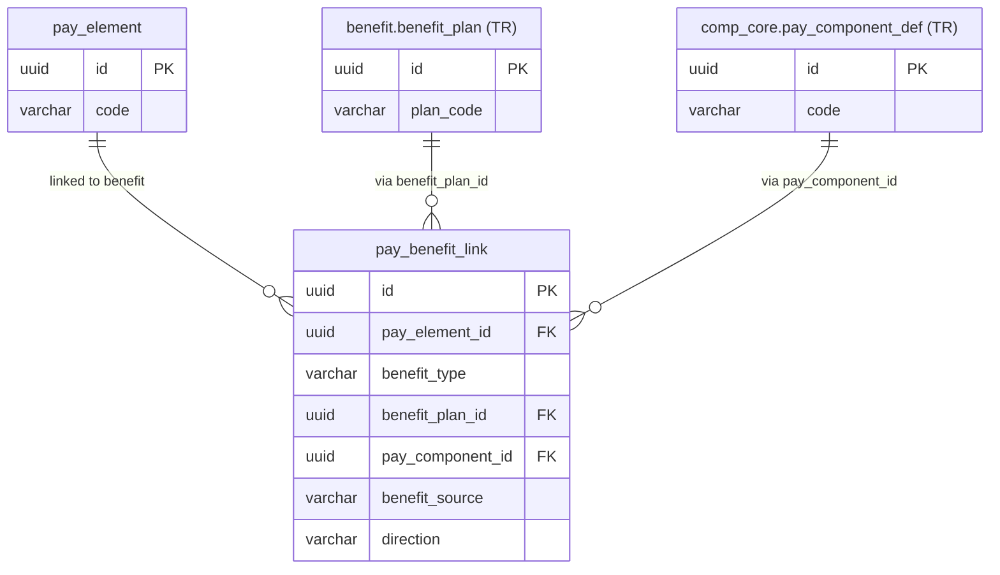

# pay_benefit_link — Liên kết Element với Chính sách Phúc lợi (Benefit Link)

> **Schema:** `pay_master.pay_benefit_link`
> **DDD Classification:** Value Object
> **Changed:** JUL 2025 (initial) | 07Apr2026 (Change 41: explicit FK columns `benefit_plan_id`, `pay_component_id`, `benefit_source`) | 13Apr2026 (Change 46: add `direction`, `is_active`, `description`)


---

## 1. Config những gì?

`pay_benefit_link` mapping giữa `pay_element` và benefit/compensation policies trong module TR. Khi một benefit (bảo hiểm sức khỏe, xe công ty, laptop) ảnh hưởng đến payroll — tạo taxable benefit hoặc tạo deduction phí bảo hiểm — link này cho engine biết element nào tương ứng với benefit nào.

> **Ví dụ use cases:**
> - Benefit premium employee đóng → `BENEFIT_PREMIUM` element link với `benefit.benefit_plan`
> - Compensation component → `COMP_ALLOWANCE` element link với `comp_core.pay_component_def`
> - Custom external policy → dùng `benefit_policy_code` (backward compat)

### Fields — Sau Change 41

| Field | Type | Ý nghĩa | Ví dụ |
|-------|------|---------|-------|
| `pay_element_id` | uuid FK NOT NULL | Element phía payroll | FK → `pay_master.pay_element` |
| `benefit_type` | varchar(30) NOT NULL | Loại link | Xem enum |
| `benefit_plan_id` | uuid FK | FK tường minh → `benefit.benefit_plan` | Dùng khi target là benefit plan |
| `pay_component_id` | uuid FK | FK tường minh → `comp_core.pay_component_def` | Dùng khi target là comp component |
| `benefit_source` | varchar(30) | Discriminator cho FK nào đang dùng | `BENEFIT_PLAN`, `PAY_COMPONENT`, `CUSTOM` |
| `benefit_policy_code` | varchar(50) | Soft ref cho external/custom policy (nullable sau Change 41) | `EXT_HEALTH_VIP_2024` |
| `direction` | varchar(20) NOT NULL | Hướng tác động vào payroll | **NEW 13Apr2026** — xem enum |
| `valid_from` | date NOT NULL | Thời điểm link bắt đầu hiệu lực | `2024-01-01` |
| `valid_to` | date | Thời điểm kết thúc, `NULL` = đang active | `null` |
| `is_active` | boolean | Operational flag | **NEW 13Apr2026** |
| `description` | text | Mô tả link | **NEW 13Apr2026** |


---

## 2. Enum

### `benefit_type`

| Giá trị | Ý nghĩa |
|---------|---------|
| `HEALTH_INSURANCE` | Bảo hiểm sức khỏe (nâng cao) |
| `LIFE_INSURANCE` | Bảo hiểm nhân thọ nhóm |
| `PENSION` | Quỹ hưu trí bổ sung |
| `STOCK_OPTION` | Quyền chọn cổ phiếu |
| `CAR_ALLOWANCE` | Phụ cấp xe công ty / xe BH |
| `MEAL_SUBSIDY` | Trợ cấp ăn ca (qua benefit plan) |
| `EDUCATION_AID` | Học phí hỗ trợ |
| `COMPENSATION_COMPONENT` | Component từ comp module |

### `direction` — Hướng tác động payroll

| Giá trị | Ý nghĩa | Ví dụ |
|---------|---------|-------|
| `ADDS_TO_GROSS` | Benefit làm tăng gross taxable | Company car benefit tính vào thu nhập chịu thuế |
| `ADDS_DEDUCTION` | Benefit tạo ra khấu trừ từ lương NLĐ | Phí bảo hiểm sức khỏe NLĐ đóng |
| `EMPLOYER_ONLY` | Chỉ ảnh hưởng chi phí chủ SD, không ảnh hưởng net NLĐ | Công ty đóng 100% phí bảo hiểm |
| `INFORMATION_ONLY` | Chỉ hiển thị trên phiếu lương, không tính toán | Giá trị benefit thông tin |

---

## 3. Business Rules

| BR | Mô tả |
|----|-------|
| **BR-PR-BL01** | **Application constraint:** ít nhất 1 trong 3 (`benefit_plan_id`, `pay_component_id`, `benefit_policy_code`) phải NOT NULL. DB không enforce — application validates khi save. |
| **BR-PR-BL02** | `benefit_source` phải match FK được dùng: nếu `benefit_plan_id ≠ null → benefit_source = BENEFIT_PLAN`; nếu `pay_component_id ≠ null → benefit_source = PAY_COMPONENT`; nếu cả 2 null → `benefit_source = CUSTOM`. |
| **BR-PR-BL03** | `benefit_policy_code` giữ lại (nullable) cho backward compat và external policies không có FK trong hệ thống. Không dùng khi đã có `benefit_plan_id` hoặc `pay_component_id`. |
| **BR-PR-BL04** | `direction = ADDS_TO_GROSS` → engine cộng giá trị benefit vào taxable income. Thường dùng cho benefits in-kind (non-cash benefits theo TT78/2014). |
| **BR-PR-BL05** | `direction = ADDS_DEDUCTION` → engine tạo deduction entry với amount = benefit premium amount. Phải link với `pay_deduction_policy` qua element. |

---

## 4. Quan hệ với các entity khác



---

## 5. Ví dụ thực tế

### Ví dụ 1: Bảo hiểm sức khỏe nâng cao — NLĐ đóng phí

```json
{
  "pay_element_id": "<DED_HEALTH_INS_PREMIUM_UUID>",
  "benefit_type": "HEALTH_INSURANCE",
  "benefit_plan_id": "<HEALTH_PREMIUM_VN_PLAN_UUID>",
  "pay_component_id": null,
  "benefit_source": "BENEFIT_PLAN",
  "benefit_policy_code": null,
  "direction": "ADDS_DEDUCTION",
  "description": "Employee đóng 1% gross phí bảo hiểm sức khỏe nâng cao. Link với benefit.benefit_plan để tính premium amount."
}
```

---

### Ví dụ 2: Xe công ty — benefit in-kind chịu thuế

```json
{
  "pay_element_id": "<CAR_BENEFIT_TAXABLE_UUID>",
  "benefit_type": "CAR_ALLOWANCE",
  "benefit_plan_id": "<COMPANY_CAR_PLAN_UUID>",
  "pay_component_id": null,
  "benefit_source": "BENEFIT_PLAN",
  "benefit_policy_code": null,
  "direction": "ADDS_TO_GROSS",
  "description": "Giá trị sử dụng xe công ty được tính vào thu nhập chịu thuế TNCN. Theo TT78/2014."
}
```

---

### Ví dụ 3: Compensation component → payroll element

```json
{
  "pay_element_id": "<RESPONSIBILITY_ALLOWANCE_UUID>",
  "benefit_type": "COMPENSATION_COMPONENT",
  "benefit_plan_id": null,
  "pay_component_id": "<RESPONSIBILITY_COMP_DEF_UUID>",
  "benefit_source": "PAY_COMPONENT",
  "benefit_policy_code": null,
  "direction": "ADDS_TO_GROSS",
  "description": "Phụ cấp trách nhiệm từ comp_core.pay_component_def → element payroll tương ứng."
}
```

---

### Ví dụ 4: External policy — backward compat

```json
{
  "pay_element_id": "<PENSION_EE_UUID>",
  "benefit_type": "PENSION",
  "benefit_plan_id": null,
  "pay_component_id": null,
  "benefit_source": "CUSTOM",
  "benefit_policy_code": "EXT_PENSION_MANULIFE_2020",
  "direction": "ADDS_DEDUCTION",
  "description": "Legacy: Manulife pension plan chưa import vào benefit.benefit_plan. Giữ soft ref."
}
```

---

## 6. Query Patterns

```sql
-- Tất cả elements có benefit link (để render benefit section trên payslip)
SELECT pe.code, pe.name, pbl.benefit_type, pbl.direction,
       pbl.benefit_source,
       bp.plan_code AS benefit_plan_code,
       pcd.code AS comp_component_code
FROM pay_master.pay_benefit_link pbl
JOIN pay_master.pay_element pe ON pe.id = pbl.pay_element_id
LEFT JOIN benefit.benefit_plan bp ON bp.id = pbl.benefit_plan_id
LEFT JOIN comp_core.pay_component_def pcd ON pcd.id = pbl.pay_component_id
WHERE pbl.is_active = TRUE
  AND pe.is_current_flag = TRUE
ORDER BY pbl.benefit_type;

-- Links với deduction direction (phí NLĐ đóng)
SELECT pe.code, pbl.benefit_type, pbl.benefit_plan_id
FROM pay_master.pay_benefit_link pbl
JOIN pay_master.pay_element pe ON pe.id = pbl.pay_element_id
WHERE pbl.direction = 'ADDS_DEDUCTION'
  AND pbl.is_active = TRUE;
```

---

## 7. Design Notes

> [!NOTE]
> **`benefit_source` discriminator pattern:** `pay_benefit_link` dùng discriminator (`benefit_source`) thay vì polymorphic FK để biết reference đang dùng cột nào. Partial indexes trên `benefit_plan_id` và `pay_component_id` WHERE NOT NULL đảm bảo lookup performance.

> [!NOTE]
> **Cross-module boundary:** `benefit_plan_id` FK → TR module. Referential integrity đảm bảo benefit plan tồn tại. Tuy nhiên giá trị premium amount vẫn do TR module tính — engine pull qua `input_source_config` từ benefit module.

> [!WARNING]
> **`benefit_policy_code` (CUSTOM)** không có referential integrity — soft ref thuần túy. Cần implement application-level validation để tránh orphan links. Migrate sang explicit FK khi benefit plan được tạo trong hệ thống.
