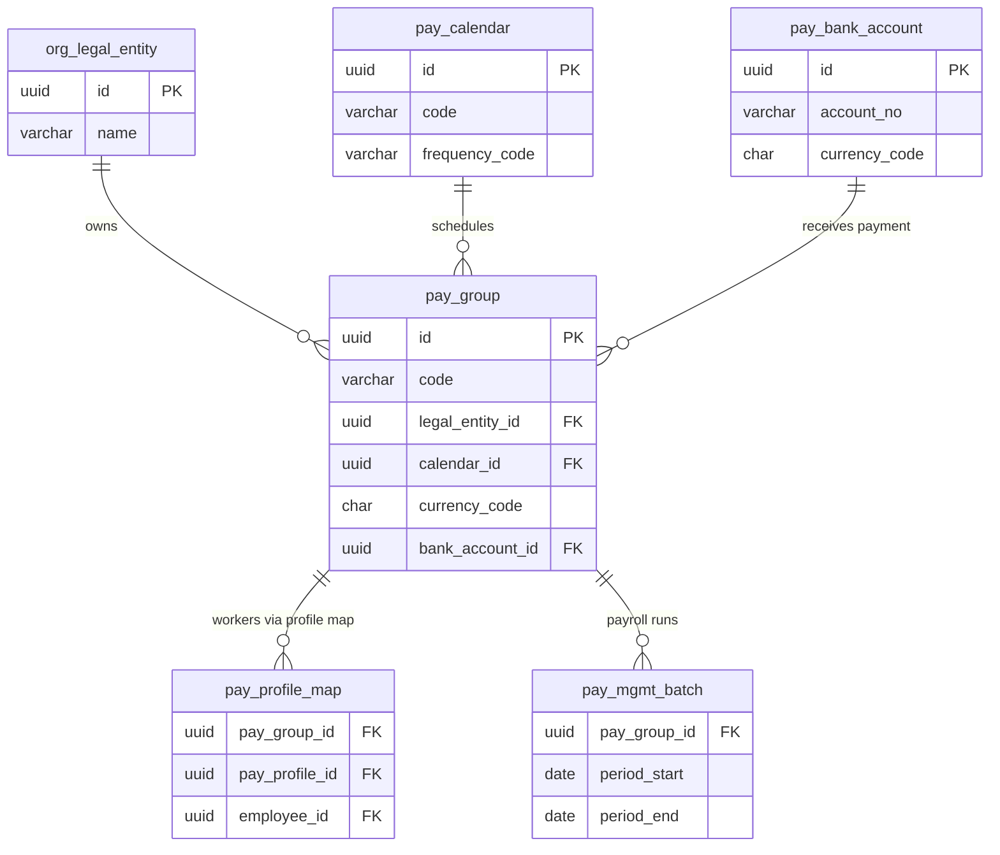

# pay_group — Nhóm Lương (Pay Group)

> **Schema:** `pay_master.pay_group`
> **DDD Classification:** Aggregate Root
> **SCD-2:** `effective_start_date / effective_end_date / is_current_flag`
> **Changed:** JUL 2025 (initial) | JUL 2025 (`market_id` thay thế market string)

---

## 1. Config những gì?

`pay_group` nhóm các workers trong cùng Legal Entity, cùng lịch lương, cùng đồng tiền, và cùng tài khoản ngân hàng chi lương. Đây là **đơn vị cơ sở để tổ chức payroll batch run** — mỗi run thường xử lý theo pay_group.

> **Phân biệt:**
> - `pay_group` = **WHO** và **WHERE** (nhóm nào, LE nào, ngân hàng nào)
> - `pay_profile` = **HOW** (tính lương theo phương pháp gì)
> - `pay_calendar` = **WHEN** (lịch trình cut-off, pay date)

### Nhóm 1 — Định danh & Phạm vi

| Field | Type | Ý nghĩa | Ví dụ |
|-------|------|---------|-------|
| `code` | varchar(50) UNIQUE | Mã nhóm lương | `PG_VN_OFFICE_HCM`, `PG_VN_FACTORY_DN`, `PG_SG_ALL` |
| `name` | varchar(100) | Tên hiển thị | `Nhóm lương – Văn phòng HCM`, `Nhóm lương – Nhà máy Đà Nẵng` |
| `legal_entity_id` | uuid FK | LE sở hữu nhóm lương | FK → `org_legal.entity` (NOT NULL) |
| `market_id` | uuid FK | Market áp dụng | FK → `common.talent_market` |

### Nhóm 2 — Cấu hình lương

| Field | Type | Ý nghĩa | Ví dụ |
|-------|------|---------|-------|
| `calendar_id` | uuid FK | Lịch lương của nhóm | FK → `pay_master.pay_calendar` (NOT NULL) |
| `currency_code` | char(3) | Đồng tiền chi lương | `VND`, `USD`, `SGD` |
| `bank_account_id` | uuid FK | Tài khoản ngân hàng chi lương. `NULL` = chưa cấu hình (cash/manual) | FK → `pay_bank.bank_account` |
| `metadata` | jsonb | Thông tin bổ sung | `{"cost_center": "CC-HCM-001"}` |

---

## 2. Business Rules

| BR | Mô tả |
|----|-------|
| **BR-PR-PG01** | `legal_entity_id` bắt buộc NOT NULL — pay_group luôn thuộc về 1 LE cụ thể. Không có concept "global pay group". |
| **BR-PR-PG02** | `currency_code` phải nhất quán với `pay_calendar.default_currency` của calendar được gắn. Nếu khác → cảnh báo (có thể intentional cho multi-currency payroll). |
| **BR-PR-PG03** | `bank_account_id = NULL` → acceptible với cash payment groups. Nhưng trước khi confirm payroll run, phải có bank account configured (hoặc payment_method = CASH được chấp nhận). |
| **BR-PR-PG04** | Payroll batch run (`pay_mgmt.batch`) được tổ chức theo `pay_group_id`. Mỗi run chạy cho 1 pay_group. |
| **BR-PR-PG05** | Workers được assign vào pay_group thông qua `pay_profile_map.pay_group_id`. 1 worker chỉ thuộc 1 pay_group tại 1 thời điểm. |
| **BR-PR-PG06** | Khi LE thay đổi bank account → tạo SCD-2 record mới cho pay_group với `bank_account_id` mới. Payroll runs đã confirm trước đó vẫn reference bank account cũ qua `payment_batch`. |

---

## 3. Quan hệ với các entity khác



---

## 4. Ví dụ thực tế (VN Context)

### Scenario: Công ty có 3 nhóm lương tại VN

```
VN Legal Entity (LE_VN)
├── PG_VN_OFFICE_HCM     — Văn phòng HCM, lương tháng, VND, Vietcombank
├── PG_VN_FACTORY_BINH_DUONG — Nhà máy Bình Dương, lương tháng, VND, Vietinbank
└── PG_VN_EXPAT_ALL      — Nhân sự nước ngoài, lương tháng, USD, Citibank
```

### Ví dụ 1: Pay group văn phòng HCM

```json
{
  "code": "PG_VN_OFFICE_HCM",
  "name": "Nhóm lương – Văn phòng HCM",
  "legal_entity_id": "<LE_VN_UUID>",
  "market_id": "<MARKET_VN_UUID>",
  "calendar_id": "<CAL_VN_MONTHLY_STD_UUID>",
  "currency_code": "VND",
  "bank_account_id": "<VCB_LE_VN_UUID>",
  "metadata": {
    "cost_center": "CC-HCM-ADMIN",
    "department_codes": ["HR", "FINANCE", "IT", "MARKETING"],
    "headcount_approx": 250
  },
  "effective_start_date": "2024-01-01"
}
```

---

### Ví dụ 2: Pay group nhà máy

```json
{
  "code": "PG_VN_FACTORY_BD",
  "name": "Nhóm lương – Nhà máy Bình Dương",
  "legal_entity_id": "<LE_VN_UUID>",
  "market_id": "<MARKET_VN_UUID>",
  "calendar_id": "<CAL_VN_MONTHLY_STD_UUID>",
  "currency_code": "VND",
  "bank_account_id": "<VIETIN_BD_UUID>",
  "metadata": {
    "cost_center": "CC-BD-PRODUCTION",
    "shift_types": ["MORNING", "EVENING", "NIGHT"],
    "headcount_approx": 1200
  },
  "effective_start_date": "2024-01-01"
}
```

---

### Ví dụ 3: Pay group expat — USD payroll

```json
{
  "code": "PG_VN_EXPAT",
  "name": "Nhóm lương – Nhân sự quốc tế (USD)",
  "legal_entity_id": "<LE_VN_UUID>",
  "market_id": "<MARKET_VN_UUID>",
  "calendar_id": "<CAL_VN_MONTHLY_STD_UUID>",
  "currency_code": "USD",
  "bank_account_id": "<CITI_USD_UUID>",
  "metadata": {
    "note": "Lương USD chuyển khoản, sau đó quy đổi VND để đóng BHXH",
    "forex_rule": "VN_ECB_RATE_MONTHLY"
  },
  "effective_start_date": "2024-01-01"
}
```
> Expat nhận lương USD nhưng vẫn đóng BHXH theo VND (nếu đủ điều kiện).
> `forex_rule` trong metadata → application dùng để quy đổi khi tính BHXH base.

---

## 5. Query Patterns thường gặp

```sql
-- Tất cả pay groups của 1 LE
SELECT code, name, currency_code,
       pc.name AS calendar_name, pc.frequency_code
FROM pay_master.pay_group pg
JOIN pay_master.pay_calendar pc ON pc.id = pg.calendar_id
WHERE pg.legal_entity_id = :le_id
  AND pg.is_current_flag = TRUE
ORDER BY pg.code;

-- Số workers trong mỗi pay group (qua profile_map)
SELECT pg.code, pg.name, COUNT(ppm.employee_id) AS worker_count
FROM pay_master.pay_group pg
LEFT JOIN pay_master.pay_profile_map ppm
  ON ppm.pay_group_id = pg.id
  AND ppm.is_current_flag = TRUE
  AND (ppm.period_end IS NULL OR ppm.period_end >= CURRENT_DATE)
WHERE pg.is_current_flag = TRUE
GROUP BY pg.id, pg.code, pg.name
ORDER BY worker_count DESC;

-- Pay group nào chưa có bank account? (cần setup trước payroll run)
SELECT code, name, currency_code
FROM pay_master.pay_group
WHERE bank_account_id IS NULL
  AND is_current_flag = TRUE;
```

---

## 6. Design Notes

> [!IMPORTANT]
> **pay_group ≠ org_unit/department:** Pay group là đơn vị kỹ thuật cho payroll processing, không phải cấu trúc tổ chức. 1 pay_group có thể chứa workers từ nhiều departments. Nhóm theo lịch lương + ngân hàng + currency là tiêu chí chính.

> [!NOTE]
> **Multi-currency trong 1 LE:** Nếu LE có cả nhân viên VND và expat USD → tạo 2 pay_groups riêng. Mỗi group có calendar, currency, bank_account riêng. Payroll system chạy từng group độc lập.
