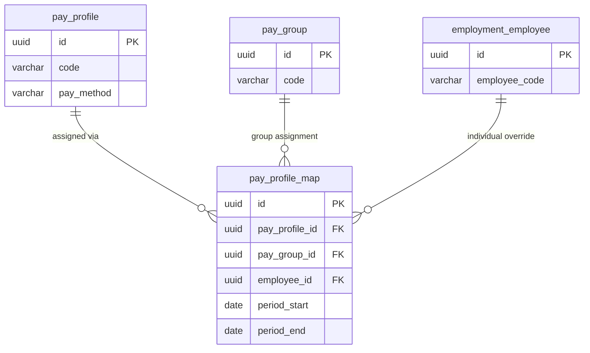

# pay_profile_map — Gán Worker vào Profile (Profile Assignment)

> **Schema:** `pay_master.pay_profile_map`
> **DDD Classification:** Assignment Entity
> **SCD-2:** `effective_start_date / effective_end_date / is_current_flag`
> **Changed:** JUL 2025 (NEW — Optional assignment table)

---

## 1. Config những gì?

`pay_profile_map` là bảng gán `pay_profile` vào `pay_group` hoặc trực tiếp vào từng `employee`. Đây là bảng **assignment** — không chứa business logic, chỉ định ai/nhóm nào dùng profile nào, trong khoảng thời gian nào.

> **Hai mức gán:**
> 1. **Group-level:** `pay_group_id ≠ null, employee_id = null` → Toàn bộ workers trong pay_group dùng profile này
> 2. **Individual-level:** `employee_id ≠ null, pay_group_id = null` → Override riêng cho 1 employee (CEO, expat đặc biệt)

### Fields

| Field | Type | Ý nghĩa | Ví dụ |
|-------|------|---------|-------|
| `pay_profile_id` | uuid FK NOT NULL | Profile được gán | FK → `pay_master.pay_profile` |
| `pay_group_id` | uuid FK | Pay group target (null nếu individual) | FK → `pay_master.pay_group` |
| `employee_id` | uuid FK | Employee target (null nếu group) | FK → `employment.employee` |
| `period_start` | date | Ngày bắt đầu áp dụng (business period) | `2024-01-01` |
| `period_end` | date | Ngày kết thúc. `NULL` = đang active | `null` |
| `metadata` | jsonb | Thông tin bổ sung (lý do override...) | `{"reason": "Thử việc 2 tháng"}` |
| `effective_start_date` | date | SCD-2: ngày record có hiệu lực | |
| `effective_end_date` | date | SCD-2: ngày record hết hiệu lực | |
| `is_current_flag` | boolean | SCD-2: bản ghi hiện tại? | |

---

## 2. Business Rules

| BR | Mô tả |
|----|-------|
| **BR-PR-PPM01** | `pay_group_id XOR employee_id` — phải có đúng 1 trong 2 (application enforced). Cả 2 null hoặc cả 2 not null đều không hợp lệ. |
| **BR-PR-PPM02** | **Individual override wins:** Nếu employee vừa thuộc pay_group (có group mapping) vừa có individual mapping → individual mapping được ưu tiên. Engine resolve: kiểm tra `employee_id` first, fallback về `pay_group_id`. |
| **BR-PR-PPM03** | 1 employee chỉ có 1 active individual mapping tại 1 thời điểm. Không được có 2 records với cùng `employee_id` mà `period` overlapping. |
| **BR-PR-PPM04** | 1 pay_group chỉ có 1 active group mapping tại 1 thời điểm với cùng `pay_profile`. Nếu muốn đổi profile → close record cũ → tạo record mới. |
| **BR-PR-PPM05** | `period_start / period_end` = business period (khi hiệu lực về mặt nghiệp vụ). `effective_start/end` = SCD-2 (khi record được tạo/thay thế trong DB). Thường giống nhau nhưng có thể khác khi retroactive assignment. |
| **BR-PR-PPM06** | Khi employee chuyển từ thử việc ([PROBATION profile]) sang chính thức ([MONTHLY_OFFICE profile]) → close record cũ `period_end = ngày chuyển - 1` → tạo record mới `period_start = ngày chuyển`. |

---

## 3. Quan hệ với các entity khác



**Resolution logic trong payroll engine:**
```
Given: employee E thuộc pay_group G

1. Query: pay_profile_map WHERE employee_id = E.id AND period active
   → Found? Use this profile (individual override wins)

2. Query: pay_profile_map WHERE pay_group_id = G.id AND period active
   → Found? Use this profile (group default)

3. Neither found? → Config error, exclude worker from run with warning
```

---

## 4. Ví dụ thực tế (VN Context)

### Ví dụ 1: Group assignment — toàn bộ văn phòng HCM

```json
{
  "pay_profile_id": "<MONTHLY_OFFICE_VN_UUID>",
  "pay_group_id": "<PG_VN_OFFICE_HCM_UUID>",
  "employee_id": null,
  "period_start": "2024-01-01",
  "period_end": null,
  "metadata": null,
  "effective_start_date": "2024-01-01"
}
```
> Toàn bộ 250 nhân viên văn phòng HCM dùng `MONTHLY_OFFICE_VN` profile. Chỉ cần 1 record thay vì 250 records.

---

### Ví dụ 2: Individual override — CEO dùng profile đặc biệt

```json
{
  "pay_profile_id": "<SENIOR_EXEC_VN_UUID>",
  "pay_group_id": null,
  "employee_id": "<CEO_EMP_UUID>",
  "period_start": "2024-01-01",
  "period_end": null,
  "metadata": {
    "reason": "C-level executive profile — custom rounding và payment method",
    "approved_by": "Board Resolution BR-2024-001"
  }
}
```
> CEO thuộc `PG_VN_OFFICE_HCM` (group mapping: profile MONTHLY_OFFICE_VN) nhưng có individual override sang `SENIOR_EXEC_VN`. Engine sẽ dùng `SENIOR_EXEC_VN` cho CEO.

---

### Ví dụ 3: Thử việc → Chính thức — timeline assignment

```
Nhân viên A (emp_id: EMP-2024-0055)

Record 1 (thử việc):
  pay_profile_id: PROBATION_VN
  employee_id: EMP-2024-0055
  period_start: 2024-04-01
  period_end: 2024-05-31  ← close khi hết thử việc
  is_current_flag: FALSE

Record 2 (chính thức):
  pay_profile_id: MONTHLY_OFFICE_VN
  employee_id: EMP-2024-0055
  period_start: 2024-06-01
  period_end: null  ← đang active
  is_current_flag: TRUE
```

> **Tháng 5/2024:** Engine tìm thấy Record 1 (`period_end = 31/05 ≥ 01/05`) → dùng `PROBATION_VN`.
> **Tháng 6/2024:** Engine tìm thấy Record 2 (`period_start = 01/06 ≤ payroll date`) → dùng `MONTHLY_OFFICE_VN`.

---

### Ví dụ 4: Tạm thời đổi profile (parental leave return)

```json
{
  "pay_profile_id": "<PART_TIME_RETURN_VN_UUID>",
  "employee_id": "<EMP_UUID>",
  "period_start": "2024-09-01",
  "period_end": "2024-11-30",
  "metadata": {
    "reason": "Nhân viên làm part-time 3 tháng sau thai sản (BLLĐ Điều 155)"
  }
}
```

---

## 5. Query Patterns thường gặp

```sql
-- Profile hiện tại của 1 employee (ưu tiên individual over group)
SELECT pp.code, pp.name, pp.pay_method,
       CASE WHEN ppm.employee_id IS NOT NULL THEN 'INDIVIDUAL' ELSE 'GROUP' END AS assignment_type
FROM pay_master.pay_profile_map ppm
JOIN pay_master.pay_profile pp ON pp.id = ppm.pay_profile_id
WHERE (ppm.employee_id = :employee_id
       OR ppm.pay_group_id = (
           SELECT pay_group_id FROM pay_master.pay_profile_map
           WHERE pay_group_id IN (SELECT id FROM pay_master.pay_group WHERE legal_entity_id = :le_id)
             AND is_current_flag = TRUE LIMIT 1  -- simplified
       ))
  AND ppm.is_current_flag = TRUE
  AND ppm.period_start <= :payroll_date
  AND (ppm.period_end IS NULL OR ppm.period_end >= :payroll_date)
ORDER BY ppm.employee_id NULLS LAST   -- individual first
LIMIT 1;

-- Tất cả workers trong 1 pay_group với profile hiện tại
SELECT e.employee_code, pp.code AS profile_code,
       CASE WHEN ppm.employee_id IS NOT NULL THEN 'OVERRIDE' ELSE 'GROUP' END AS source
FROM employment.employee e
-- Group level mapping
JOIN pay_master.pay_profile_map group_ppm
  ON group_ppm.pay_group_id = :group_id
  AND group_ppm.is_current_flag = TRUE
  AND group_ppm.period_end IS NULL
-- Check for override
LEFT JOIN pay_master.pay_profile_map ind_ppm
  ON ind_ppm.employee_id = e.id
  AND ind_ppm.is_current_flag = TRUE
  AND ind_ppm.period_end IS NULL
JOIN pay_master.pay_profile pp
  ON pp.id = COALESCE(ind_ppm.pay_profile_id, group_ppm.pay_profile_id)
ORDER BY e.employee_code;

-- Workers chưa có profile assignment (cần action trước payroll run)
SELECT e.employee_code, e.first_name, e.last_name
FROM employment.employee e
WHERE NOT EXISTS (
  SELECT 1 FROM pay_master.pay_profile_map ppm
  WHERE (ppm.employee_id = e.id OR ppm.pay_group_id = :target_group_id)
    AND ppm.is_current_flag = TRUE
    AND (ppm.period_end IS NULL OR ppm.period_end >= CURRENT_DATE)
)
AND e.employment_status = 'ACTIVE';
```

---

## 6. Design Notes

> [!IMPORTANT]
> **`pay_group_id XOR employee_id`** là constraint nghiệp vụ quan trọng, không được DB enforce bằng CHECK constraint thông thường. Application layer **bắt buộc** validate trước save. Query pattern cũng phải xử lý cả 2 trường hợp (xem Query section).

> [!NOTE]
> **SCD-2 vs period_start/end — 2 chiều thời gian:** `period_start/end` = "khi nào profile được áp dụng trong thực tế" (business time). `effective_start/end` = "khi nào record này được tạo/sửa trong DB" (system time). Quan trọng cho retroactive payroll corrections.

> [!NOTE]
> **Bulk group assignment là default pattern:** Hầu hết công ty gán profile theo pay_group (1 record cho cả nhóm). Individual override chỉ dùng cho exception — CEO, expat đặc thù, workers trong transition (thử việc, thai sản). Tránh lạm dụng individual override vì làm phức tạp quản lý.
