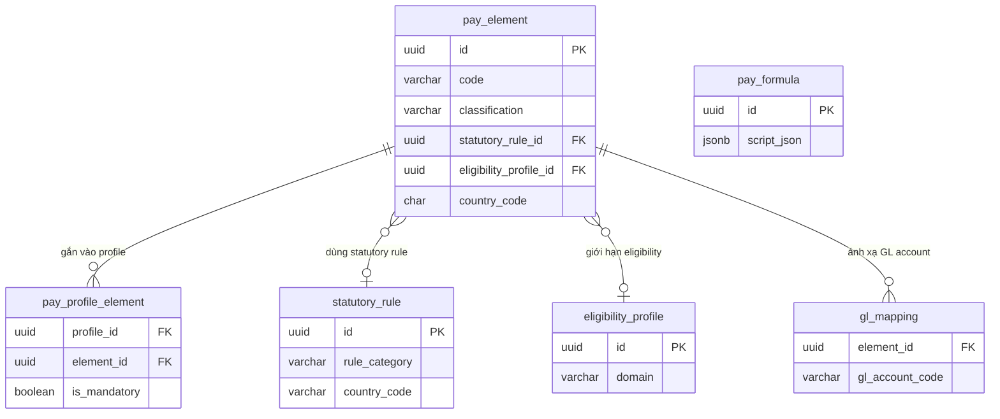

# pay_element — Phần tử lương (Payroll Element)

> **Schema:** `pay_master.pay_element`
> **DDD Classification:** Aggregate Root
> **SCD-2:** `effective_start_date / effective_end_date / is_current_flag`
> **Changed:** JUL 2025 (initial) | 26Mar2026 (eligibility + multi-country scoping)

---

## 1. Config những gì?

`pay_element` là đơn vị nguyên tử của bảng lương — mỗi khoản thu nhập, khấu trừ, hay thuế được đại diện bởi 1 element. Tất cả các entity khác (pay_profile, pay_result, input_value) đều reference về đây.

### Nhóm 1 — Định danh & Phân loại

| Field | Type | Ý nghĩa | Ví dụ |
|-------|------|---------|-------|
| `code` | varchar(50) UNIQUE | Mã định danh duy nhất của element | `BASIC_SALARY`, `BHXH_EE`, `PIT_WITHHOLD` |
| `name` | varchar(100) | Tên hiển thị | `Lương cơ bản`, `BHXH nhân viên đóng`, `Thuế TNCN` |
| `classification` | varchar(35) | Loại phần tử lương | Xem enum bên dưới |
| `unit` | varchar(10) | Đơn vị tính | `AMOUNT` (VND) hoặc `HOURS` |
| `description` | text | Mô tả chi tiết | Tùy chọn |
| `priority_order` | smallint | Thứ tự tính toán trong run | `1` = tính trước; OT nên tính sau BASIC |

### Nhóm 2 — Hành vi tính toán

| Field | Type | Ý nghĩa | Ví dụ |
|-------|------|---------|-------|
| `input_required` | boolean | Engine phải nhận input thủ công hoặc từ TA? | `true` với OT hours; `false` với BASIC_SALARY (formula tự tính) |
| `formula_json` | jsonb | Công thức tính default của element | `{"ref": "PAY_FORMULA_CODE"}` hoặc inline logic |
| `taxable_flag` | boolean | Khoản này có chịu thuế TNCN không? | `true` với BASIC; `false` với trợ cấp sức khỏe |
| `pre_tax_flag` | boolean | Tính trước hay sau thuế? | `true` với BHXH/BHYT (khấu trừ trước khi tính TNCN) |
| `statutory_rule_id` | uuid FK | Link đến statutory_rule nếu có công thức pháp định | BHXH → `VN_SI_2025` |
| `gl_account_code` | varchar(50) | Tài khoản kế toán mặc định | `622001` (chi phí nhân công trực tiếp) |

### Nhóm 3 — Phạm vi áp dụng (Multi-country)

| Field | Type | Ý nghĩa | Ví dụ |
|-------|------|---------|-------|
| `country_code` | char(2) | ISO country. `NULL` = global element | `VN`, `SG`, `NULL` |
| `config_scope_id` | uuid FK | Phase 2: scope group nâng cao (cross-country LE) | FK → `comp_core.config_scope` |
| `eligibility_profile_id` | uuid FK | Ai được áp dụng element này? | FK → `eligibility.eligibility_profile` (domain=`PAYROLL`) |

---

## 2. Enum & Giá trị mặc định

### `classification` — Loại element

| Giá trị | Ý nghĩa | Ảnh hưởng |
|---------|---------|-----------|
| `EARNING` | Khoản thu nhập (cộng vào gross) | Lương cơ bản, phụ cấp, OT pay, bonus |
| `DEDUCTION` | Khoản khấu trừ (trừ khỏi gross/net) | BHXH, BHYT, BHTN, công đoàn phí |
| `TAX` | Thuế (trừ khỏi net) | Thuế TNCN (PIT) |
| `EMPLOYER_CONTRIBUTION` | Đóng góp chủ SDLĐ (không ảnh hưởng net NLĐ) | BHXH SDLĐ 17.5% |
| `INFORMATION` | Thông tin tham chiếu, không vào tổng | Số ngày công chuẩn, số phụ thuộc |

### `unit`

| Giá trị | Khi nào dùng |
|---------|-------------|
| `AMOUNT` | Mọi element tính theo tiền (VND) |
| `HOURS` | Element tracking giờ công (dùng cho input collection) |

### Defaults

| Field | Default | Lý do |
|-------|---------|-------|
| `input_required` | `false` | Đa số elements tự tính qua formula |
| `taxable_flag` | `true` | Default: chịu thuế — admin phải chủ động mark exempt |
| `pre_tax_flag` | `true` | Default: xử lý trước thuế (BHXH pattern) |
| `is_current_flag` | `true` | SCD-2 flag |

---

## 3. Business Rules

| BR | Mô tả |
|----|-------|
| **BR-PR-E01** | Mỗi `code` phải unique toàn hệ thống. Nếu same element nhưng khác `country_code`, vẫn dùng `code` khác nhau (ví dụ: `BHXH_EE_VN`, `CPF_EE_SG`). |
| **BR-PR-E02** | `pre_tax_flag = true` → engine phải tính element này TRƯỚC khi tính PIT. Thứ tự: BHXH/BHYT/BHTN (pre-tax) → PIT → net. |
| **BR-PR-E03** | `taxable_flag = false` → amount này không được cộng vào `taxable_gross` khi tính PIT. Ví dụ: trợ cấp sức khỏe theo quy định pháp luật, tiền ăn ≤ 730k/tháng (TT78/2014). |
| **BR-PR-E04** | `statutory_rule_id` không NULL → formula của element phải gọi `statutory_rule.formula_json` để tính. Không được hard-code tỷ lệ trực tiếp trong element. |
| **BR-PR-E05** | `eligibility_profile_id` không NULL → chỉ những worker nằm trong eligibility profile này mới có element xuất hiện trong payroll run. Null = tất cả workers trong profile. |
| **BR-PR-E06** | `country_code = NULL` → element dùng được ở mọi quốc gia (global). Nếu có cả global element và country-specific element cùng tính cùng 1 thứ → country-specific có precedence. |
| **BR-PR-E07** | `priority_order` quyết định thứ tự trong calculation DAG. Elements cùng priority có thể tính song song. EARNING trước DEDUCTION theo convention (dù engine dùng DAG). |

---

## 4. Quan hệ với các entity khác



**Upstream (nhận data từ):**
- `common.talent_market` — scope market
- `eligibility.eligibility_profile` — WHO được nhận element này

**Downstream (được dùng bởi):**
- `pay_profile_element` — gắn element vào profile
- `pay_engine.input_value` — engine nhận input cho element
- `pay_engine.result` — engine ghi kết quả tính toán
- `pay_master.gl_mapping` — mapping GL account
- `pay_master.termination_pay_config` — final pay element list
- `pay_master.pay_benefit_link` — link element với benefit policy

---

## 5. Ví dụ thực tế (VN Context)

### Ví dụ 1: EARNING — Lương cơ bản tháng

```json
{
  "code": "BASIC_SALARY",
  "name": "Lương cơ bản",
  "classification": "EARNING",
  "unit": "AMOUNT",
  "input_required": false,
  "formula_json": { "ref": "FML_MONTHLY_PRORATE" },
  "taxable_flag": true,
  "pre_tax_flag": false,
  "priority_order": 10,
  "statutory_rule_id": null,
  "country_code": null,
  "gl_account_code": "622001",
  "effective_start_date": "2024-01-01"
}
```
> Lương cơ bản không có statutory rule riêng — tính theo `pay_formula` proration. Áp dụng toàn cầu (`country_code = null`).

---

### Ví dụ 2: DEDUCTION — BHXH nhân viên (8%, pre-tax)

```json
{
  "code": "BHXH_EE_VN",
  "name": "BHXH nhân viên đóng (8%)",
  "classification": "DEDUCTION",
  "unit": "AMOUNT",
  "input_required": false,
  "formula_json": null,
  "taxable_flag": false,
  "pre_tax_flag": true,
  "priority_order": 20,
  "statutory_rule_id": "<uuid của VN_SI_2025>",
  "country_code": "VN",
  "gl_account_code": "3383",
  "effective_start_date": "2025-01-01"
}
```
> `pre_tax_flag = true` → khấu trừ BHXH trước khi tính thu nhập tính thuế TNCN.
> `statutory_rule_id` → engine đọc `VN_SI_2025.formula_json` để lấy rate 8% và trần lương 20× lương cơ sở.

---

### Ví dụ 3: TAX — Thuế TNCN (PIT)

```json
{
  "code": "PIT_WITHHOLD_VN",
  "name": "Thuế TNCN khấu trừ tại nguồn",
  "classification": "TAX",
  "unit": "AMOUNT",
  "input_required": false,
  "taxable_flag": false,
  "pre_tax_flag": false,
  "priority_order": 90,
  "statutory_rule_id": "<uuid của VN_PIT_2025>",
  "country_code": "VN",
  "gl_account_code": "3335",
  "effective_start_date": "2025-01-01"
}
```
> `priority_order = 90` → tính sau cùng, sau tất cả EARNING và pre-tax DEDUCTION.
> Bảng thuế lũy tiến 7 bậc được lưu trong `VN_PIT_2025.formula_json`.

---

### Ví dụ 4: EARNING — OT Weekday (nhập từ TA)

```json
{
  "code": "OT_WEEKDAY_PAY",
  "name": "Lương OT ngày thường",
  "classification": "EARNING",
  "unit": "AMOUNT",
  "input_required": true,
  "formula_json": { "ref": "FML_OT_WEEKDAY" },
  "taxable_flag": true,
  "pre_tax_flag": false,
  "priority_order": 15,
  "statutory_rule_id": "<uuid của VN_OT_MULT_2019>",
  "country_code": "VN"
}
```
> `input_required = true` → engine gọi `input_source_config` để pull `OT_WEEKDAY_HOURS` từ TA module trước khi tính.
> `formula_json → FML_OT_WEEKDAY`: `{"lang":"MVEL","content":"ot_hours * hourly_rate * ot_multiplier"}`

---

## 6. Query Patterns thường gặp

```sql
-- Lấy tất cả EARNING elements đang active cho VN
SELECT code, name, taxable_flag, statutory_rule_id
FROM pay_master.pay_element
WHERE classification = 'EARNING'
  AND (country_code = 'VN' OR country_code IS NULL)
  AND is_current_flag = TRUE
ORDER BY priority_order;

-- Lấy elements có pre_tax (để xác định thứ tự tính trước PIT)
SELECT code, name, priority_order
FROM pay_master.pay_element
WHERE pre_tax_flag = TRUE
  AND classification = 'DEDUCTION'
  AND is_current_flag = TRUE
ORDER BY priority_order;

-- Cross-ref: Element nào được gắn vào 1 specific profile?
SELECT pe.code, pe.name, ppe.is_mandatory, ppe.priority_order
FROM pay_master.pay_profile_element ppe
JOIN pay_master.pay_element pe ON pe.id = ppe.element_id
WHERE ppe.profile_id = :profile_id
  AND ppe.is_active = TRUE
ORDER BY ppe.priority_order;
```

---

## 7. Design Notes

> [!NOTE]
> **formula_json vs pay_formula:** `pay_element.formula_json` là default formula của element (có thể là inline hoặc `{"ref":"FML_CODE"}`). `pay_profile_element.override_formula_json` cho phép profile override formula này. Engine ưu tiên: profile override > element default.

> [!IMPORTANT]
> **Không hard-code tỷ lệ BHXH/PIT trong formula_json.** Luôn link qua `statutory_rule_id` để khi pháp luật thay đổi chỉ cần update 1 chỗ (statutory_rule record mới với SCD-2).

> [!NOTE]
> **Global vs country-specific lookup:** Khi engine load elements cho 1 worker, query: `WHERE country_code = :worker_country OR country_code IS NULL`. Nếu trùng code → country-specific wins. Admin không được tạo 2 elements cùng `code` khác `country_code` trừ khi có lý do rõ ràng.
