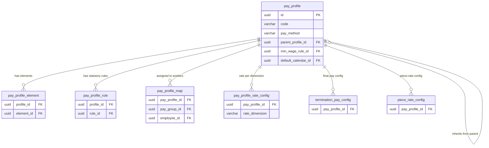

# pay_profile — Hồ sơ Lương (Pay Profile)

> **Schema:** `pay_master.pay_profile`
> **DDD Classification:** Aggregate Root
> **SCD-2:** `effective_start_date / effective_end_date / is_current_flag`
> **Changed:** JUL 2025 (initial) | 27Mar2026 (AQ-02 Option C — Rich Relational Schema, explicit columns + join tables)

---

## 1. Config những gì?

`pay_profile` là **bundle cấu hình trung tâm** cho một nhóm workers. Thay vì cấu hình lương riêng lẻ từng người, HR định nghĩa một tập quy tắc (phương pháp trả lương, làm tròn, proration, currency...) vào 1 profile và gán nhiều workers vào cùng profile đó.

> **Pattern:** `pay_group` xác định AI trong nhóm lương (LE + calendar + bank). `pay_profile` xác định HOW tính lương cho nhóm đó.

### Nhóm 1 — Định danh & Trạng thái

| Field | Type | Ý nghĩa | Ví dụ |
|-------|------|---------|-------|
| `code` | varchar(50) UNIQUE | Mã profile | `MONTHLY_OFFICE_VN`, `HOURLY_FACTORY_HCM`, `PIECE_RATE_GARMENT` |
| `name` | varchar(100) | Tên hiển thị | `Lương tháng văn phòng VN`, `Lương giờ nhà máy HCM` |
| `legal_entity_id` | uuid FK | LE áp dụng. `NULL` = dùng chung nhiều LE | FK → `org_legal.entity` |
| `market_id` | uuid FK | Market áp dụng | FK → `common.talent_market` |
| `status_code` | varchar(20) | Trạng thái | `ACTIVE`, `INACTIVE`, `DRAFT` |
| `parent_profile_id` | uuid FK self-ref | Profile cha cho kế thừa cấu hình | `MONTHLY_BASE_VN` → parent của `MONTHLY_MANAGER_VN` |
| `description` | text | Mô tả | Tùy chọn |

### Nhóm 2 — Phương thức tính lương

| Field | Type | Ý nghĩa | Ví dụ |
|-------|------|---------|-------|
| `pay_method` | varchar(30) NOT NULL | Cách tính lương cơ bản | Xem enum bên dưới |
| `grade_step_mode` | varchar(25) | Chỉ dùng khi `pay_method = GRADE_STEP` | `TABLE_LOOKUP` hoặc `COEFFICIENT_FORMULA` |
| `pay_scale_table_code` | varchar(50) | FK mềm → `TR.grade_ladder.code` | `THANG_BANG_LUONG_A`, `VN_GOV_SCALE_2024` |
| `proration_method` | varchar(20) NOT NULL | Cách tính lương tháng lẻ ngày | `WORK_DAYS`, `CALENDAR_DAYS`, `NONE` |
| `rounding_method` | varchar(20) NOT NULL | Cách làm tròn tính toán | `ROUND_HALF_UP`, `ROUND_DOWN` |

### Nhóm 3 — Thanh toán & Currency

| Field | Type | Ý nghĩa | Ví dụ |
|-------|------|---------|-------|
| `payment_method` | varchar(20) NOT NULL | Hình thức trả lương | `BANK_TRANSFER`, `CASH`, `CHECK`, `WALLET` |
| `default_currency` | char(3) | Override currency. `NULL` = kế thừa từ `pay_group` | `VND`, `USD` |
| `min_wage_rule_id` | uuid FK | Lương tối thiểu vùng áp dụng cho profile | FK → `statutory_rule` (rule_category=TAX, code=`VN_MIN_WAGE_2025`) |
| `default_calendar_id` | uuid FK | Calendar mặc định nếu không override bởi `pay_group` | FK → `pay_master.pay_calendar` |

---

## 2. Enum & Giá trị mặc định

### `pay_method` — Phương thức tính lương

| Giá trị | Ý nghĩa | Áp dụng cho |
|---------|---------|------------|
| `MONTHLY_SALARY` | Lương tháng cố định | Văn phòng, quản lý |
| `HOURLY` | Lương theo giờ | Công nhân thời vụ, part-time |
| `PIECE_RATE` | Lương sản phẩm/khoán | Dệt may, lắp ráp điện tử |
| `GRADE_STEP` | Ngạch bậc (bảng lương) | Viên chức, DNNN, SOE |
| `TASK_BASED` | Theo nhiệm vụ/dự án | Freelancer, gig worker |

### `grade_step_mode` (chỉ cho `GRADE_STEP`)

| Giá trị | Công thức | Dùng khi |
|---------|-----------|----------|
| `TABLE_LOOKUP` | `salary = TR.grade_ladder_step.step_amount` | Doanh nghiệp tư nhân (bảng lương cụ thể) |
| `COEFFICIENT_FORMULA` | `salary = TR.grade_ladder_step.coefficient × statutory_rule(VN_LUONG_CO_SO)` | Viên chức nhà nước, hệ số nhân lương cơ sở |

### `proration_method`

| Giá trị | Công thức | Khi nào dùng |
|---------|-----------|-------------|
| `WORK_DAYS` | `salary × (actual_work_days / standard_work_days)` | Phổ biến tại VN (26 ngày/tháng) |
| `CALENDAR_DAYS` | `salary × (actual_days / total_calendar_days)` | Một số công ty nước ngoài |
| `NONE` | Không prorate (trả đủ tháng) | Thử việc, hợp đồng theo gói |

### `rounding_method`

| Giá trị | Ví dụ (8,750,320 VND) | Khi nào dùng |
|---------|----------------------|-------------|
| `ROUND_HALF_UP` | 8,750,000 (làm tròn 1000) | Phổ biến nhất |
| `ROUND_DOWN` | 8,750,000 | Bảo thủ (không bao giờ trả dư) |
| `ROUND_UP` | 8,751,000 | Thiên vị NLĐ |
| `ROUND_NEAREST` | 8,750,000 | Standard math |

### Defaults

| Field | Default |
|-------|---------|
| `pay_method` | `MONTHLY_SALARY` |
| `proration_method` | `WORK_DAYS` |
| `rounding_method` | `ROUND_HALF_UP` |
| `payment_method` | `BANK_TRANSFER` |
| `status_code` | `ACTIVE` |

---

## 3. Business Rules

| BR | Mô tả |
|----|-------|
| **BR-PR-PP01** | `grade_step_mode` và `pay_scale_table_code` chỉ có ý nghĩa khi `pay_method = GRADE_STEP`. Engine bỏ qua nếu `pay_method ≠ GRADE_STEP`. |
| **BR-PR-PP02** | Profile kế thừa (`parent_profile_id ≠ null`): child inherits tất cả fields từ parent trừ khi child override. Engine đọc theo chain (child → parent → grandparent). Không được có circular inheritance. |
| **BR-PR-PP03** | `default_currency` = `NULL` → inherit từ `pay_group.currency_code`. Nếu cả 2 đều null → lỗi cấu hình. |
| **BR-PR-PP04** | `min_wage_rule_id` bắt buộc cho profiles áp dụng `PIECE_RATE` hoặc `HOURLY` tại VN (BLLĐ 2019, Điều 91 — không được trả thấp hơn lương tối thiểu vùng). |
| **BR-PR-PP05** | Elements và statutory rules không cấu hình trực tiếp trên profile. Phải dùng join tables: `pay_profile_element` và `pay_profile_rule`. |
| **BR-PR-PP06** | Worker assignment vào profile được quản lý qua `pay_profile_map`. Một worker chỉ có 1 active profile tại 1 thời điểm (SCD-2 enforced). |

---

## 4. Quan hệ với các entity khác



---

## 5. Ví dụ thực tế (VN Context)

### Ví dụ 1: Profile lương tháng văn phòng — phổ biến nhất

```json
{
  "code": "MONTHLY_OFFICE_VN",
  "name": "Lương tháng – Nhân viên văn phòng VN",
  "legal_entity_id": "<LE_VIET_NAM_UUID>",
  "market_id": "<MARKET_VN_UUID>",
  "status_code": "ACTIVE",
  "parent_profile_id": null,
  "pay_method": "MONTHLY_SALARY",
  "grade_step_mode": null,
  "proration_method": "WORK_DAYS",
  "rounding_method": "ROUND_HALF_UP",
  "payment_method": "BANK_TRANSFER",
  "default_currency": "VND",
  "min_wage_rule_id": "<VN_MIN_WAGE_2025_UUID>",
  "effective_start_date": "2024-01-01"
}
```
> Elements gắn vào profile này: `BASIC_SALARY`, `BHXH_EE_VN`, `BHYT_EE_VN`, `BHTN_EE_VN`, `PIT_WITHHOLD_VN`
> Rules gắn vào profile: `VN_SI_2025` (execution_order=1), `VN_PIT_2025` (execution_order=2)

---

### Ví dụ 2: Profile lương sản phẩm — may mặc HCM

```json
{
  "code": "PIECE_RATE_GARMENT_HCM",
  "name": "Lương sản phẩm – Công nhân may HCM",
  "parent_profile_id": "<MONTHLY_OFFICE_VN_UUID>",
  "pay_method": "PIECE_RATE",
  "proration_method": "NONE",
  "payment_method": "BANK_TRANSFER",
  "default_currency": "VND",
  "min_wage_rule_id": "<VN_MIN_WAGE_2025_UUID>",
  "effective_start_date": "2024-01-01"
}
```
> Kế thừa `rounding_method`, `payment_method` từ parent.
> `piece_rate_config` cần được tạo riêng cho profile này với product codes (SHIRT, PANTS...).
> `min_wage_rule_id` bắt buộc vì `PIECE_RATE` — phải ensure `total_piece_pay ≥ min_wage_region`.

---

### Ví dụ 3: Profile ngạch bậc — viên chức nhà nước

```json
{
  "code": "GRADE_STEP_CIVIL_VN",
  "name": "Ngạch bậc – Viên chức hành chính",
  "pay_method": "GRADE_STEP",
  "grade_step_mode": "COEFFICIENT_FORMULA",
  "pay_scale_table_code": "VN_THANG_LUONG_VIEN_CHUC",
  "proration_method": "CALENDAR_DAYS",
  "rounding_method": "ROUND_DOWN",
  "default_currency": "VND",
  "min_wage_rule_id": "<VN_MIN_WAGE_2025_UUID>",
  "effective_start_date": "2024-07-01"
}
```
> `COEFFICIENT_FORMULA`: `salary = TR.grade_ladder_step.coefficient × 2,340,000` (lương cơ sở 2024)
> Khi lương cơ sở thay đổi → update `statutory_rule(VN_LUONG_CO_SO)` mới; không cần update từng worker.

---

## 6. Query Patterns thường gặp

```sql
-- Lấy tất cả active profiles với pay_method
SELECT code, name, pay_method, proration_method, payment_method
FROM pay_master.pay_profile
WHERE status_code = 'ACTIVE'
  AND is_current_flag = TRUE
ORDER BY pay_method, code;

-- Profile tree (kế thừa)
WITH RECURSIVE profile_tree AS (
  SELECT id, code, name, parent_profile_id, 0 AS depth
  FROM pay_master.pay_profile
  WHERE parent_profile_id IS NULL AND is_current_flag = TRUE
  UNION ALL
  SELECT p.id, p.code, p.name, p.parent_profile_id, pt.depth + 1
  FROM pay_master.pay_profile p
  JOIN profile_tree pt ON p.parent_profile_id = pt.id
  WHERE p.is_current_flag = TRUE
)
SELECT * FROM profile_tree ORDER BY depth, code;

-- Profile của 1 employee tại thời điểm hiện tại
SELECT pp.code, pp.name, pp.pay_method
FROM pay_master.pay_profile_map ppm
JOIN pay_master.pay_profile pp ON pp.id = ppm.pay_profile_id
WHERE ppm.employee_id = :employee_id
  AND ppm.is_current_flag = TRUE
  AND ppm.period_start <= CURRENT_DATE
  AND (ppm.period_end IS NULL OR ppm.period_end >= CURRENT_DATE);
```

---

## 7. Design Notes

> [!IMPORTANT]
> **Profile không chứa config trực tiếp cho elements/rules.** Dùng join tables: `pay_profile_element` (element bindings) và `pay_profile_rule` (statutory rule bindings). Profile chỉ là "header" — config chi tiết nằm ở join tables.

> [!NOTE]
> **Profile inheritance:** Khi child profile cần override 1 field, chỉ set field đó trên child. Engine merge: child fields > parent fields. Fields `null` trên child = kế thừa parent. Circular inheritance sẽ gây stack overflow — application layer phải validate trước save.

> [!NOTE]
> **pay_scale_table_code là soft reference:** `pay_scale_table_code` reference đến `TR.grade_ladder.code` nhưng không có FK cứng (cross-module boundary). Application phải validate tồn tại khi save. Domain boundary: TR owns bảng hệ số/mức lương; PR tính lương thực tế từ đó.
