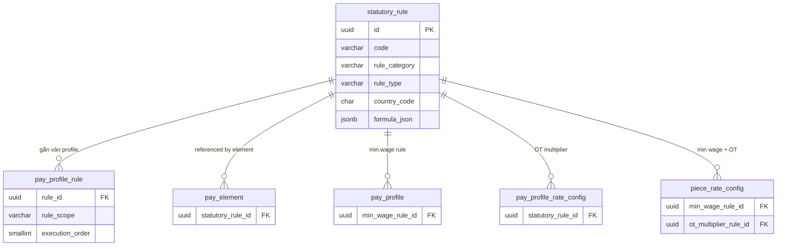

# statutory_rule — Quy tắc Pháp định (Statutory Rule)

> **Schema:** `pay_master.statutory_rule`
> **DDD Classification:** Aggregate Root
> **SCD-2:** `effective_start_date / effective_end_date / is_current_flag`
> **Changed:** JUL 2025 (initial) | 27Mar2026 (ADR Option D — enriched, single authority cho statutory rules)

---

## 1. Config những gì?

`statutory_rule` là **Single Authority** cho tất cả quy tắc tính toán có nguồn gốc pháp lý trong Payroll. Scope được giới hạn ở `TAX | SOCIAL_INSURANCE | OVERTIME | GROSS_TO_NET`.

> **Domain boundary quan trọng:** TR module chỉ giữ HR-policy rules (PRORATION, ROUNDING, FOREX). Mọi quy tắc có nguồn gốc từ luật lao động/thuế đều thuộc PR.

### Nhóm 1 — Định danh & Phân loại

| Field | Type | Ý nghĩa | Ví dụ |
|-------|------|---------|-------|
| `code` | varchar(50) UNIQUE | Mã quy tắc | `VN_PIT_2025`, `VN_SI_2025`, `VN_OT_MULT_2019` |
| `name` | varchar(255) | Tên quy tắc | `Thuế TNCN Việt Nam 2025` |
| `rule_category` | varchar(30) NOT NULL | Loại quy tắc | Xem enum bên dưới |
| `rule_type` | varchar(30) NOT NULL | Kỹ thuật tính toán | Xem enum bên dưới |
| `market_id` | uuid FK | Market áp dụng | FK → `common.talent_market` |

### Nhóm 2 — Phạm vi pháp lý

| Field | Type | Ý nghĩa | Ví dụ |
|-------|------|---------|-------|
| `country_code` | char(2) | ISO country. `NULL` = global | `VN`, `SG`, `NULL` |
| `jurisdiction` | varchar(50) | Vùng/tỉnh nếu có (VN: không phân tỉnh) | `HCMC`, `HANOI`, `null` |
| `legal_reference` | text | Trích dẫn căn cứ pháp lý | `Điều 107, BLLĐ 2019` |
| `description` | text | Mô tả quy tắc | Tùy chọn |

### Nhóm 3 — Logic tính toán

| Field | Type | Ý nghĩa | Ví dụ |
|-------|------|---------|-------|
| `formula_json` | jsonb | Data hoặc script tính toán thực tế | Xem ví dụ bên dưới |
| `valid_from` | date | Ngày có hiệu lực của quy định pháp luật | `2025-01-01` |
| `valid_to` | date | Ngày hết hiệu lực | `null` (đang hiệu lực) |
| `is_active` | boolean | Có được dùng không? | `true` |

---

## 2. Enum & Giá trị mặc định

### `rule_category` — Loại quy tắc pháp định

| Giá trị | Scope | Ví dụ |
|---------|-------|-------|
| `TAX` | Thuế TNCN, thuế môn bài | `VN_PIT_2025`, `VN_MIN_WAGE_REGION_1` |
| `SOCIAL_INSURANCE` | BHXH, BHYT, BHTN | `VN_SI_2025` (rates + trần lương) |
| `OVERTIME` | Hệ số OT theo luật | `VN_OT_MULT_2019` (1.5/2.0/3.0) |
| `GROSS_TO_NET` | Pipeline tính lương net | Rule orchestrating toàn bộ G2N pipeline |

### `rule_type` — Kỹ thuật cài đặt formula_json

| Giá trị | Ý nghĩa | Dùng cho |
|---------|---------|----------|
| `FORMULA` | Groovy/MVEL expression | BHXH rate × base salary |
| `LOOKUP_TABLE` | Bảng tra cứu JSON | Bảng lương tối thiểu theo vùng |
| `CONDITIONAL` | If-else logic nhiều nhánh | Hệ số OT ngày thường vs ngày lễ |
| `RATE_TABLE` | Bảng tỷ lệ flat | CPF rates theo tuổi (SG) |
| `PROGRESSIVE` | Lũy tiến (bậc thang) | Bảng thuế TNCN 7 bậc VN |

### Defaults

| Field | Default | Ghi chú |
|-------|---------|---------|
| `rule_type` | `FORMULA` | Phổ biến nhất |
| `is_active` | `true` | |
| `is_current_flag` | `true` | SCD-2 |

---

## 3. Business Rules

| BR | Mô tả |
|----|-------|
| **BR-PR-SR01** | `rule_category` phải thuộc `{TAX, SOCIAL_INSURANCE, OVERTIME, GROSS_TO_NET}`. Mọi HR-policy rule (PRORATION, ROUNDING...) thuộc TR module (`comp_core.calculation_rule_def`). |
| **BR-PR-SR02** | Khi pháp luật thay đổi rate/bracket, KHÔNG update record cũ. Tạo SCD-2 record mới với `effective_start_date` = ngày áp dụng. Record cũ giữ nguyên để audit. |
| **BR-PR-SR03** | `legal_reference` bắt buộc điền cho mọi rule có `country_code IS NOT NULL`. Thiếu legal_reference = warning trong validation. |
| **BR-PR-SR04** | `valid_from / valid_to` là khoảng pháp luật (khi luật được ban hành). `effective_start/end` là SCD-2 khi nào record được dùng trong hệ thống. Có thể khác nhau (delay triển khai). |
| **BR-PR-SR05** | OT cap enforcement (`max 40h/tháng`, `200/300h/năm` — BLLĐ Điều 107) là responsibility của **TA module** (timesheet validation). `statutory_rule` chỉ lưu OT multipliers, không enforce thời gian. Payroll chỉ light-check qua `validation_rule`. |
| **BR-PR-SR06** | Payroll engine không được đọc formula từ TR domain hay hard-code tỷ lệ. Single source of truth = `statutory_rule.formula_json`. |

---

## 4. Quan hệ với các entity khác



---

## 5. Ví dụ thực tế (VN Context)

### Ví dụ 1: PROGRESSIVE — Thuế TNCN VN 2025

```json
{
  "code": "VN_PIT_2025",
  "name": "Thuế TNCN Việt Nam 2025 (lũy tiến 7 bậc)",
  "rule_category": "TAX",
  "rule_type": "PROGRESSIVE",
  "country_code": "VN",
  "legal_reference": "Điều 22, Luật Thuế TNCN số 04/2007/QH12, sửa đổi Luật 26/2012/QH13",
  "valid_from": "2013-07-01",
  "valid_to": null,
  "formula_json": {
    "personal_deduction": 11000000,
    "dependent_deduction": 4400000,
    "brackets": [
      { "from": 0,         "to": 5000000,   "rate": 0.05, "quick_deduct": 0 },
      { "from": 5000000,   "to": 10000000,  "rate": 0.10, "quick_deduct": 250000 },
      { "from": 10000000,  "to": 18000000,  "rate": 0.15, "quick_deduct": 750000 },
      { "from": 18000000,  "to": 32000000,  "rate": 0.20, "quick_deduct": 1650000 },
      { "from": 32000000,  "to": 52000000,  "rate": 0.25, "quick_deduct": 3250000 },
      { "from": 52000000,  "to": 80000000,  "rate": 0.30, "quick_deduct": 5850000 },
      { "from": 80000000,  "to": null,      "rate": 0.35, "quick_deduct": 9850000 }
    ]
  },
  "effective_start_date": "2025-01-01"
}
```
> **Cách tính nhanh:** `PIT = taxable_income × rate - quick_deduct`
> `taxable_income = gross - BHXH - BHYT - BHTN - personal_deduction - (dep_count × dependent_deduction)`

---

### Ví dụ 2: RATE_TABLE — BHXH/BHYT/BHTN 2025

```json
{
  "code": "VN_SI_2025",
  "name": "BHXH, BHYT, BHTN Việt Nam 2025",
  "rule_category": "SOCIAL_INSURANCE",
  "rule_type": "RATE_TABLE",
  "country_code": "VN",
  "legal_reference": "Luật BHXH 58/2014/QH13; Nghị định 58/2020/NĐ-CP; QĐ 595/QĐ-BHXH",
  "valid_from": "2025-01-01",
  "formula_json": {
    "salary_ceiling_factor": 20,
    "base_salary_reference": "VN_LUONG_CO_SO_2024",
    "employee": {
      "bhxh_rate": 0.08,
      "bhyt_rate": 0.015,
      "bhtn_rate": 0.01,
      "total_rate": 0.105
    },
    "employer": {
      "bhxh_rate": 0.175,
      "bhyt_rate": 0.03,
      "bhtn_rate": 0.01,
      "bhtai_nan_rate": 0.005,
      "total_rate": 0.22
    },
    "note": "Trần đóng BHXH/BHTN = 20 × lương cơ sở (1.8tr × 20 = 36tr). BHYT không có trần."
  },
  "effective_start_date": "2025-01-01"
}
```

---

### Ví dụ 3: CONDITIONAL — Hệ số OT theo BLLĐ 2019

```json
{
  "code": "VN_OT_MULT_2019",
  "name": "Hệ số OT theo BLLĐ 2019",
  "rule_category": "OVERTIME",
  "rule_type": "CONDITIONAL",
  "country_code": "VN",
  "legal_reference": "Điều 98, BLLĐ 2019 (Luật số 45/2019/QH14)",
  "valid_from": "2021-01-01",
  "formula_json": {
    "multipliers": {
      "OT_WEEKDAY":  1.5,
      "OT_WEEKEND":  2.0,
      "OT_HOLIDAY":  3.0,
      "NIGHT_SHIFT_PREMIUM": 0.30
    },
    "cap_check": "TA_RESPONSIBILITY",
    "note": "OT cap (40h/tháng, 200h/năm) là TA responsibility. PR chỉ light-check."
  },
  "effective_start_date": "2021-01-01"
}
```

---

### Ví dụ 4: LOOKUP_TABLE — Lương tối thiểu vùng 2025

```json
{
  "code": "VN_MIN_WAGE_2025",
  "name": "Lương tối thiểu vùng 2025",
  "rule_category": "TAX",
  "rule_type": "LOOKUP_TABLE",
  "country_code": "VN",
  "legal_reference": "Nghị định 74/2024/NĐ-CP (có hiệu lực 01/07/2024)",
  "valid_from": "2024-07-01",
  "formula_json": {
    "regions": {
      "VUNG_1": 4960000,
      "VUNG_2": 4410000,
      "VUNG_3": 3860000,
      "VUNG_4": 3450000
    },
    "note": "Áp dụng cho piece-rate workers: nếu total < min_wage_region → substitute + flag exception"
  }
}
```

---

## 6. Query Patterns thường gặp

```sql
-- Lấy tất cả statutory rules đang active cho VN
SELECT code, name, rule_category, rule_type, valid_from
FROM pay_master.statutory_rule
WHERE (country_code = 'VN' OR country_code IS NULL)
  AND is_active = TRUE
  AND is_current_flag = TRUE
ORDER BY rule_category, code;

-- Lấy statutory rules gắn vào 1 profile (qua join table)
SELECT sr.code, sr.rule_category, ppr.rule_scope, ppr.execution_order
FROM pay_master.pay_profile_rule ppr
JOIN pay_master.statutory_rule sr ON sr.id = ppr.rule_id
WHERE ppr.profile_id = :profile_id
  AND ppr.is_active = TRUE
ORDER BY ppr.execution_order;

-- Lịch sử các phiên bản của 1 rule (SCD-2)
SELECT code, name, valid_from, effective_start_date, effective_end_date
FROM pay_master.statutory_rule
WHERE code = 'VN_SI_2025'
ORDER BY effective_start_date DESC;
```

---

## 7. Design Notes

> [!IMPORTANT]
> **Domain Boundary (ADR 27Mar2026):** `statutory_rule` chỉ chứa rules có nguồn từ luật pháp. Rules HR-policy tự đặt ra (PRORATION, ROUNDING, FOREX) thuộc `comp_core.calculation_rule_def` trong TR module. Cross-boundary violation = bug.

> [!NOTE]
> **OT Cap là TA responsibility:** `VN_OT_MULT_2019` lưu multiplier (1.5/2.0/3.0), **không** enforce cap 40h/tháng. Cap enforcement = TA timesheet validation. Payroll chỉ dùng `pay_master.validation_rule` để light-check cuối kỳ.

> [!NOTE]
> **Tỷ lệ BHXH có thể thay đổi:** Khi Nhà nước thay đổi tỷ lệ (ví dụ giảm BHXH đợt COVID), tạo record `VN_SI_2025b` mới với `effective_start_date` = ngày mới. Record cũ vẫn có trong history. Engine luôn dùng bản `is_current_flag = TRUE` tại thời điểm payroll period.
