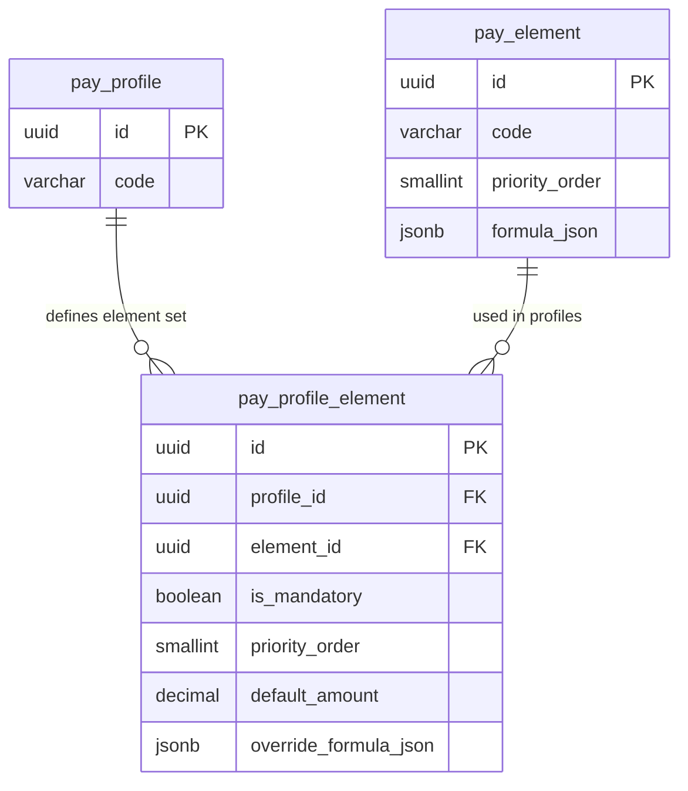

# pay_profile_element — Gắn kết Element vào Profile

> **Schema:** `pay_master.pay_profile_element`
> **DDD Classification:** Entity (join table với business logic)
> **Changed:** 27Mar2026 (NEW — AQ-02 Option C join table)

---

## 1. Config những gì?

`pay_profile_element` là bảng N:N binding giữa `pay_profile` và `pay_element`. Nó không chỉ đơn thuần là join table — nó cho phép **cấu hình per-profile** cho từng element: priority riêng, amount mặc định riêng, và formula override riêng.

> **Nguyên lý:** `pay_element` định nghĩa element ở mức _global_ (classification, unit, default formula). `pay_profile_element` định nghĩa cách element đó được _áp dụng cụ thể_ trong một profile.

### Nhóm 1 — Binding

| Field | Type | Ý nghĩa | Ví dụ |
|-------|------|---------|-------|
| `profile_id` | uuid FK NOT NULL | Profile chứa element | FK → `pay_master.pay_profile` |
| `element_id` | uuid FK NOT NULL | Element được gắn | FK → `pay_master.pay_element` |
| `is_mandatory` | boolean | Element có bắt buộc trong mọi payroll run không? | `true` với BASIC_SALARY; `false` với OVERTIME |
| `is_active` | boolean | Có đang được dùng không? | `true` |

### Nhóm 2 — Profile-level Overrides

| Field | Type | Ý nghĩa | Ví dụ |
|-------|------|---------|-------|
| `priority_order` | smallint | Override `pay_element.priority_order` cho riêng profile này. `NULL` = dùng element default | `5` (tính sớm hơn default) |
| `default_amount` | decimal(18,2) | Giá trị mặc định của element trong profile. `NULL` = không có default, phải có input hoặc formula | `50000` (uniform allowance cho tất cả workers trong profile) |
| `override_formula_json` | jsonb | Formula thay thế cho riêng profile này. `NULL` = dùng `pay_element.formula_json` | `{"ref": "FML_MANAGER_BONUS"}` |

### Nhóm 3 — Versioning

| Field | Type | Ý nghĩa |
|-------|------|---------|
| `effective_start_date` | date | Ngày binding có hiệu lực |
| `effective_end_date` | date | Ngày binding hết hiệu lực. `NULL` = đang active |

---

## 2. Business Rules

| BR | Mô tả |
|----|-------|
| **BR-PR-PPE01** | Unique constraint: `(profile_id, element_id)` — mỗi element chỉ được gắn 1 lần vào 1 profile. Nếu cần override khác nhau theo thời gian, dùng `effective_start/end`. |
| **BR-PR-PPE02** | `is_mandatory = true` → engine **bắt buộc** include element trong payroll run cho profile này, kể cả khi không có input value. Nếu không có input và không có formula → lỗi. |
| **BR-PR-PPE03** | `override_formula_json ≠ null` → engine dùng formula này **thay thế** `pay_element.formula_json`. Ưu tiên: `pay_profile_element.override_formula_json` > `pay_element.formula_json`. |
| **BR-PR-PPE04** | `default_amount ≠ null` → nếu engine không tìm thấy input value và formula là null, dùng `default_amount` làm kết quả. Đây là fallback cuối cùng. |
| **BR-PR-PPE05** | `priority_order = null` → engine dùng `pay_element.priority_order`. Nếu cả 2 đều null → element tính sau cùng trong nhóm (không xác định). |
| **BR-PR-PPE06** | Xóa element khỏi profile: KHÔNG nên hard-delete. Set `is_active = false` và `effective_end_date = today`. Audit trail được giữ nguyên. |

---

## 3. Quan hệ với các entity khác



**Formula resolution priority (engine logic):**
```
1. pay_profile_element.override_formula_json  (profile-specific)
2. pay_element.formula_json                   (global default)
3. pay_profile_element.default_amount         (fallback amount)
4. pay_engine.input_value                     (manual/TA input)
```

---

## 4. Ví dụ thực tế (VN Context)

### Ví dụ 1: Elements cho profile văn phòng — mandatory core set

| element_id | Element Code | is_mandatory | priority_order | default_amount | override_formula_json |
|------------|-------------|:---:|:-:|:-:|:-:|
| ... | `BASIC_SALARY` | ✅ | 10 | null | null |
| ... | `MEAL_ALLOWANCE` | ✅ | 20 | 730,000 | null |
| ... | `BHXH_EE_VN` | ✅ | 30 | null | null |
| ... | `BHYT_EE_VN` | ✅ | 31 | null | null |
| ... | `BHTN_EE_VN` | ✅ | 32 | null | null |
| ... | `PIT_WITHHOLD_VN` | ✅ | 90 | null | null |
| ... | `OT_WEEKDAY_PAY` | ❌ | null | null | null |
| ... | `TRANSPORT_ALLOWANCE` | ❌ | 25 | 500,000 | null |

> `MEAL_ALLOWANCE.default_amount = 730,000` — tất cả workers trong profile nhận đều 730k/tháng (mức miễn thuế TT78/2014). Không cần input thủ công.
> `OT_WEEKDAY_PAY` không mandatory — chỉ include khi có OT hours từ TA.

---

### Ví dụ 2: Profile manager — override formula TRANSPORT cao hơn

```json
{
  "profile_id": "<MONTHLY_MANAGER_VN_UUID>",
  "element_id": "<TRANSPORT_ALLOWANCE_UUID>",
  "is_mandatory": true,
  "priority_order": 25,
  "default_amount": null,
  "override_formula_json": {
    "lang": "MVEL",
    "content": "manager_grade >= 3 ? 1500000 : 800000"
  },
  "effective_start_date": "2024-01-01"
}
```
> Manager profile override formula để tính transport allowance theo grade (1.5tr vs 800k). Element `TRANSPORT_ALLOWANCE` global formula vẫn là `500000` cho non-manager profiles.

---

### Ví dụ 3: Thêm element mới theo thời gian (pandemic support)

```json
{
  "profile_id": "<MONTHLY_OFFICE_VN_UUID>",
  "element_id": "<COVID_SUPPORT_2021_UUID>",
  "is_mandatory": false,
  "default_amount": 1000000,
  "effective_start_date": "2021-06-01",
  "effective_end_date": "2021-12-31",
  "is_active": false
}
```
> Element support COVID chỉ áp dụng tháng 6–12/2021. Sau đó `is_active = false`, giữ audit trail.

---

## 5. Query Patterns thường gặp

```sql
-- Lấy tất cả elements mandatory của 1 profile (để setup payroll run)
SELECT pe.code, pe.name, pe.classification, ppe.priority_order, ppe.default_amount
FROM pay_master.pay_profile_element ppe
JOIN pay_master.pay_element pe ON pe.id = ppe.element_id
WHERE ppe.profile_id = :profile_id
  AND ppe.is_mandatory = TRUE
  AND ppe.is_active = TRUE
ORDER BY COALESCE(ppe.priority_order, pe.priority_order, 999);

-- Element nào có override formula trong profile?
SELECT pe.code, ppe.override_formula_json
FROM pay_master.pay_profile_element ppe
JOIN pay_master.pay_element pe ON pe.id = ppe.element_id
WHERE ppe.profile_id = :profile_id
  AND ppe.override_formula_json IS NOT NULL
  AND ppe.is_active = TRUE;

-- Profile nào đang dùng element X? (reverse lookup)
SELECT pp.code, pp.name, ppe.is_mandatory, ppe.priority_order
FROM pay_master.pay_profile_element ppe
JOIN pay_master.pay_profile pp ON pp.id = ppe.profile_id
WHERE ppe.element_id = :element_id
  AND ppe.is_active = TRUE
  AND pp.status_code = 'ACTIVE';
```

---

## 6. Design Notes

> [!NOTE]
> **Join table với business logic:** `pay_profile_element` không chỉ là mapping thuần túy — nó chứa `is_mandatory`, `priority_order`, `default_amount`, `override_formula_json`. Đây là một Entity thực sự, không phải pure join table.

> [!NOTE]
> **Formula override dùng `{"ref": "FML_CODE"}` hoặc inline:** Override formula có thể reference một `pay_formula` record (`{"ref": "FML_MANAGER_BONUS"}`) hoặc inline expression (`{"lang":"MVEL","content":"...expr..."}`). Cả hai đều hợp lệ — engine resolve tương tự nhau.
