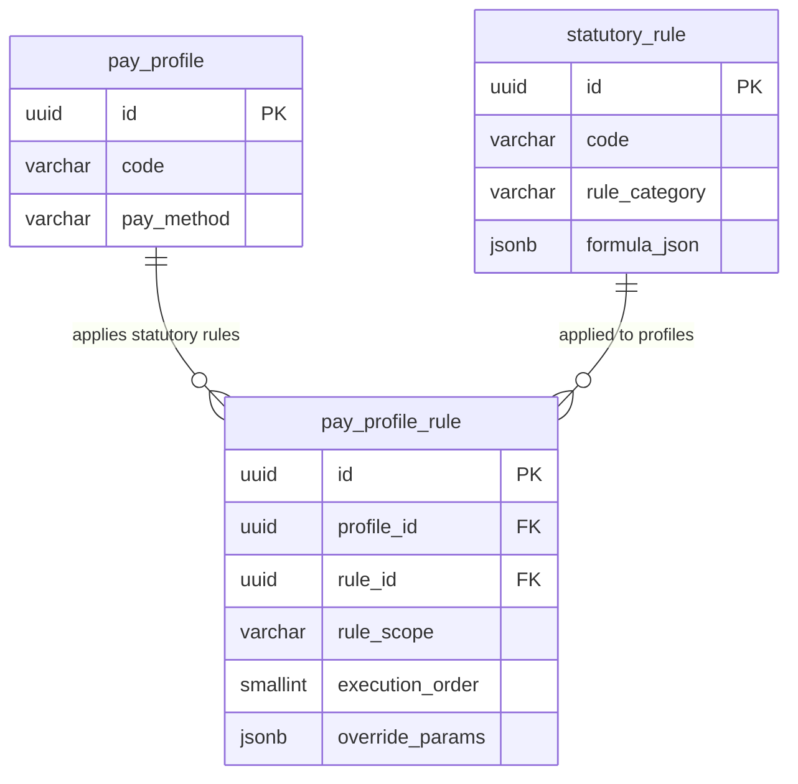

# pay_profile_rule — Gắn kết Statutory Rule vào Profile

> **Schema:** `pay_master.pay_profile_rule`
> **DDD Classification:** Entity (join table với business logic)
> **Changed:** 27Mar2026 (NEW — AQ-02 Option C join table)

---

## 1. Config những gì?

`pay_profile_rule` là bảng N:N binding giữa `pay_profile` và `pay_master.statutory_rule`. Nó xác định **những quy tắc pháp định nào áp dụng cho profile này** và **thứ tự thực thi** khi engine tính lương.

> **Tại sao cần join table thay vì FK trực tiếp?** Vì 1 profile cần nhiều statutory rules (SI + PIT + OT), và mỗi rule có `execution_order` riêng (tính SI trước PIT) và `override_params` riêng (ví dụ: profile đặc biệt có bracket thuế khác).

### Nhóm 1 — Binding & Thứ tự thực thi

| Field | Type | Ý nghĩa | Ví dụ |
|-------|------|---------|-------|
| `profile_id` | uuid FK NOT NULL | Profile áp dụng rule | FK → `pay_master.pay_profile` |
| `rule_id` | uuid FK NOT NULL | Statutory rule được gắn | FK → `pay_master.statutory_rule` |
| `rule_scope` | varchar(30) NOT NULL | Loại rule — align với `statutory_rule.rule_category` | `TAX`, `SOCIAL_INSURANCE`, `OVERTIME`, `GROSS_TO_NET` |
| `execution_order` | smallint | Thứ tự tính toán (ascending) | `1` = SI, `2` = PIT, `3` = full G2N pipeline |
| `is_active` | boolean | Có đang được dùng không? | `true` |

### Nhóm 2 — Profile-level Override

| Field | Type | Ý nghĩa | Ví dụ |
|-------|------|---------|-------|
| `override_params` | jsonb | Tham số override cho profile này (null = dùng rule default) | `{"bhxh_exempt": true}` cho expat profile |

---

## 2. Enum & Giá trị mặc định

### `rule_scope` — align với `statutory_rule.rule_category`

| Giá trị | Rule áp dụng | execution_order convention |
|---------|-------------|--------------------------|
| `SOCIAL_INSURANCE` | BHXH/BHYT/BHTN — tính trước, pre-tax | `1` |
| `TAX` | PIT — tính sau SI, trên taxable gross | `2` |
| `OVERTIME` | OT rate multipliers | `5` (tính sau earnings) |
| `GROSS_TO_NET` | Full pipeline orchestration | `10` (tính sau tất cả) |

### Defaults

| Field | Default |
|-------|---------|
| `execution_order` | `0` |
| `is_active` | `true` |

### Override params — cấu trúc gợi ý theo rule_scope

```jsonc
// SOCIAL_INSURANCE override — expat exempt BHXH
{ "bhxh_exempt": true, "bhyt_exempt": false, "bhtn_exempt": true }

// TAX override — expatriate flat rate
{ "tax_regime": "FLAT_RATE", "flat_rate": 0.20 }

// OVERTIME override — không có OT holiday (DNNN)
{ "exclude_ot_holiday": true }
```

---

## 3. Business Rules

| BR | Mô tả |
|----|-------|
| **BR-PR-PPR01** | Unique constraint: `(profile_id, rule_id)` — mỗi statutory rule chỉ được gắn 1 lần vào 1 profile. |
| **BR-PR-PPR02** | `execution_order` quyết định thứ tự engine thực thi. Convention: `SOCIAL_INSURANCE` < `TAX` < `GROSS_TO_NET`. Không được có 2 rules cùng `execution_order` trong cùng profile trừ khi chúng có thể chạy song song (cùng scope không phụ thuộc nhau). |
| **BR-PR-PPR03** | `override_params ≠ null` → engine merge params này vào `statutory_rule.formula_json` trước khi evaluate. Schema của override_params phải tương thích với formula_json của rule tương ứng — application layer validates. |
| **BR-PR-PPR04** | `rule_scope` phải khớp `statutory_rule.rule_category` của rule được gắn. Ví dụ: không được gắn rule có `rule_category = TAX` với `rule_scope = SOCIAL_INSURANCE`. |
| **BR-PR-PPR05** | Profile PIECE_RATE bắt buộc có `SOCIAL_INSURANCE` rule binding. Thiếu SI rule = cảnh báo validation trước payroll run. |
| **BR-PR-PPR06** | Expat profile thường có `override_params` để exempt BHXH/BHTN nhưng vẫn đóng BHYT theo Nghị định 146/2018/NĐ-CP. |

---

## 4. Quan hệ với các entity khác



**Execution flow trong payroll engine:**
```
1. Load profile → get pay_profile_rule list sorted by execution_order
2. For each rule (ascending order):
   a. Load statutory_rule.formula_json
   b. Merge override_params (if not null)
   c. Execute rule against current calculation context
   d. Update context (balances, tax amounts, etc.)
3. Final result = net pay
```

---

## 5. Ví dụ thực tế (VN Context)

### Ví dụ 1: Standard VN office profile — 3 rules, 3 execution orders

| rule_id | Rule Code | rule_scope | execution_order | override_params |
|---------|-----------|:----------:|:---------------:|:---------------:|
| ... | `VN_SI_2025` | `SOCIAL_INSURANCE` | 1 | `null` |
| ... | `VN_PIT_2025` | `TAX` | 2 | `null` |
| ... | `VN_G2N_PIPELINE` | `GROSS_TO_NET` | 10 | `null` |

> **Execution:** Engine tính BHXH/BHYT/BHTN trước → lấy số tiền pre-tax deductions → tính taxable income → apply lũy tiến 7 bậc TNCN → tính net pay.

---

### Ví dụ 2: Expat profile — exempt BHXH/BHTN, flat 20% PIT

```json
[
  {
    "profile_id": "<EXPAT_PROFILE_UUID>",
    "rule_id": "<VN_SI_2025_UUID>",
    "rule_scope": "SOCIAL_INSURANCE",
    "execution_order": 1,
    "override_params": {
      "bhxh_exempt": true,
      "bhtn_exempt": true,
      "bhyt_exempt": false,
      "note": "Expat > 3 tháng: đóng BHYT theo NĐ 146/2018. Exempt BHXH/BHTN."
    }
  },
  {
    "profile_id": "<EXPAT_PROFILE_UUID>",
    "rule_id": "<VN_PIT_2025_UUID>",
    "rule_scope": "TAX",
    "execution_order": 2,
    "override_params": {
      "tax_regime": "FLAT_RATE",
      "flat_rate": 0.20,
      "note": "Cá nhân không cư trú: flat 20% PIT (Điều 18, Luật Thuế TNCN)"
    }
  }
]
```

---

### Ví dụ 3: Factory hourly profile — thêm OT rule

```json
[
  {
    "profile_id": "<HOURLY_FACTORY_UUID>",
    "rule_id": "<VN_SI_2025_UUID>",
    "rule_scope": "SOCIAL_INSURANCE",
    "execution_order": 1,
    "override_params": null
  },
  {
    "profile_id": "<HOURLY_FACTORY_UUID>",
    "rule_id": "<VN_OT_MULT_2019_UUID>",
    "rule_scope": "OVERTIME",
    "execution_order": 5,
    "override_params": {
      "include_night_premium": true,
      "night_premium_rate": 0.30,
      "note": "Nhà máy 3 ca: thêm phụ cấp ca đêm 30% (BLLĐ Điều 98 khoản 2)"
    }
  },
  {
    "profile_id": "<HOURLY_FACTORY_UUID>",
    "rule_id": "<VN_PIT_2025_UUID>",
    "rule_scope": "TAX",
    "execution_order": 2,
    "override_params": null
  }
]
```

---

## 6. Query Patterns thường gặp

```sql
-- Lấy tất cả statutory rules của profile, sorted by execution_order
SELECT sr.code, sr.rule_category, sr.rule_type,
       ppr.rule_scope, ppr.execution_order, ppr.override_params
FROM pay_master.pay_profile_rule ppr
JOIN pay_master.statutory_rule sr ON sr.id = ppr.rule_id
WHERE ppr.profile_id = :profile_id
  AND ppr.is_active = TRUE
  AND sr.is_current_flag = TRUE
ORDER BY ppr.execution_order;

-- Profile nào đang dùng rule VN_PIT_2025? (impact analysis khi update PIT)
SELECT pp.code, pp.name, ppr.execution_order, ppr.override_params
FROM pay_master.pay_profile_rule ppr
JOIN pay_master.pay_profile pp ON pp.id = ppr.profile_id
JOIN pay_master.statutory_rule sr ON sr.id = ppr.rule_id
WHERE sr.code = 'VN_PIT_2025'
  AND ppr.is_active = TRUE
  AND pp.status_code = 'ACTIVE';

-- Profiles thiếu SI rule (validation trước payroll run)
SELECT pp.code, pp.name
FROM pay_master.pay_profile pp
WHERE pp.status_code = 'ACTIVE'
  AND pp.is_current_flag = TRUE
  AND NOT EXISTS (
    SELECT 1 FROM pay_master.pay_profile_rule ppr
    WHERE ppr.profile_id = pp.id
      AND ppr.rule_scope = 'SOCIAL_INSURANCE'
      AND ppr.is_active = TRUE
  );
```

---

## 7. Design Notes

> [!IMPORTANT]
> **execution_order là sequence number, không phải priority:** `execution_order = 1` nghĩa là tính đầu tiên, không phải quan trọng nhất. Convention chuẩn: `1=SI`, `2=TAX`, `5=OT`, `10=GROSS_TO_NET`. Admin phải đảm bảo SI tính trước TAX vì taxable income = gross - SI deductions.

> [!NOTE]
> **override_params không có DB schema validation:** Application layer phải validate `override_params` tương thích với `statutory_rule.formula_json` khi save. Engine sẽ merge params trước khi execute — params không hợp lệ có thể gây lỗi runtime.

> [!NOTE]
> **Một rule có thể gắn vào nhiều profiles:** `VN_SI_2025` thường gắn vào mọi VN profile (office, factory, expat — nhưng expat có override). Khi SI rate thay đổi, chỉ update 1 `statutory_rule` record (SCD-2) — tất cả profiles tự động dùng version mới.
