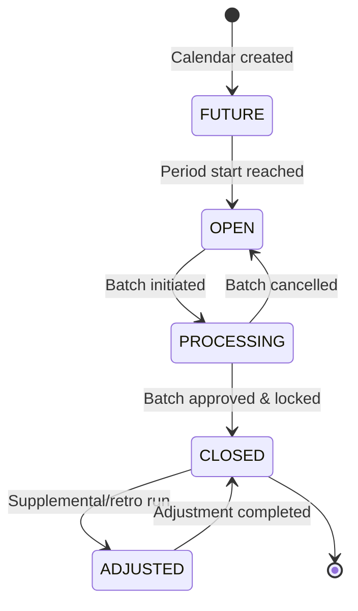
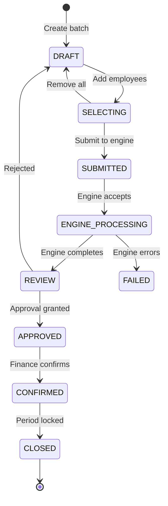
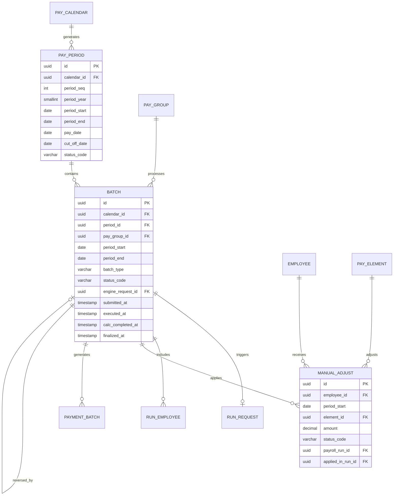
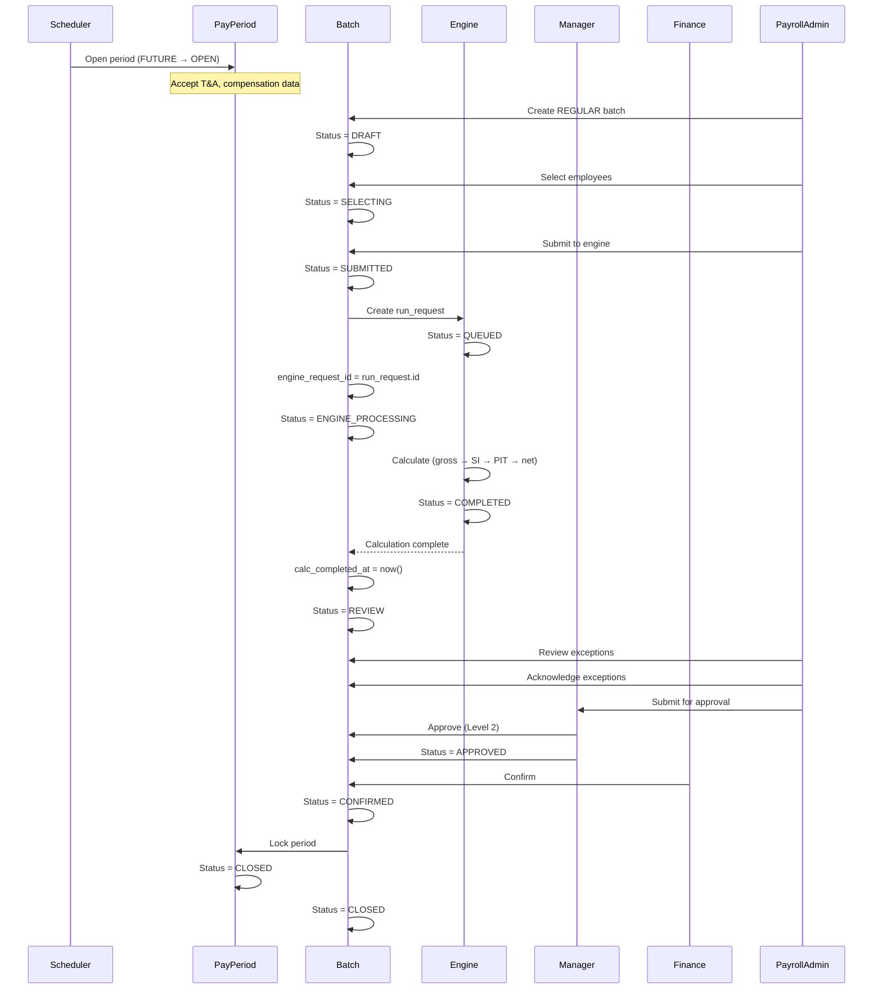
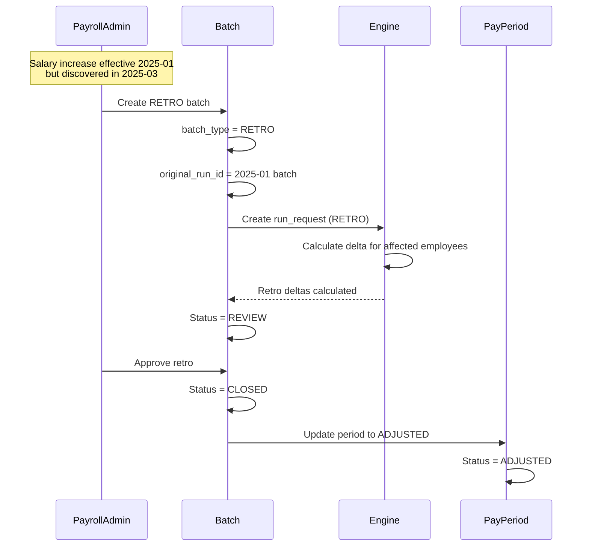
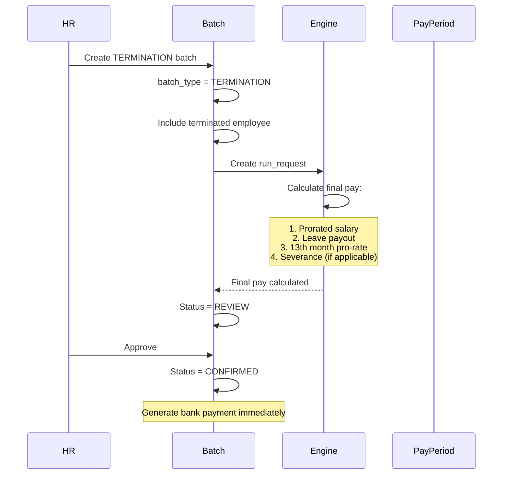

# Pay Mgmt Schema — Orchestration Layer

**Schema**: `pay_mgmt`  
**Bounded Context**: BC-03 Payroll Execution (Orchestration part)  
**Tables**: 3  
**Last Updated**: 27Mar2026

---

## Overview

`pay_mgmt` là **orchestration layer** của Payroll module — quản lý lifecycle của payroll processing: period management, batch orchestration, approval workflow.

**Key Characteristics**:
- **3 tables** — smallest schema in PR
- **MIGRATED from V3** `pay_run` schema
- **Separation of concerns**: Orchestration vs Calculation
- **Explicit period tracking**: `pay_period` materializes calendar_json
- **Engine interface**: `batch.engine_request_id → pay_engine.run_request`

---

## 1. Schema Structure

```
pay_mgmt
│
├── pay_period          # Aggregate Root: Explicit payroll period
├── batch               # Aggregate Root: Payroll execution instance
└── manual_adjust       # Entity: Manual adjustments
```

**Migration Map (V3 → V4)**:
- `pay_run.batch` → `pay_mgmt.batch` (enhanced)
- `pay_run.manual_adjust` → `pay_mgmt.manual_adjust` (FK updated)
- `pay_run.batch_approval` → **DEPRECATED** (→ Temporal workflow)

---

## 2. Core Aggregates

### 2.1 pay_period

**Type**: Aggregate Root  
**Purpose**: Explicit payroll period with lifecycle tracking

```sql
Table pay_mgmt.pay_period {
  id              uuid [pk]
  calendar_id     uuid [ref: > pay_master.pay_calendar.id, not null]
  period_seq      int [not null]                     -- 1, 2, ..., 12
  period_year     smallint [not null]                -- 2025
  period_start    date [not null]
  period_end      date [not null]
  pay_date        date [not null]
  cut_off_date    date [null]
  status_code     varchar(20) [not null, default: 'FUTURE']
  -- FUTURE | OPEN | PROCESSING | CLOSED | ADJUSTED
  closed_at       timestamp [null]
  closed_by       uuid [ref: > employment.employee.id, null]
  metadata        jsonb [null]
  created_at      timestamp [default: `now()`]
  updated_at      timestamp [null]
  
  Indexes {
    (calendar_id, period_year, period_seq) [unique]
    (calendar_id, status_code)
    (period_start, period_end)
    (status_code)
  }
}
```

**Lifecycle State Machine**:



**Status Definitions**:

| Status | Meaning | Allowed Actions |
|--------|---------|-----------------|
| **FUTURE** | Period not yet started | View only |
| **OPEN** | Period active, receiving data | Import T&A, Dry Run, Simulation |
| **PROCESSING** | Batch running | View status, Cancel |
| **CLOSED** | Approved and locked | View results, Generate reports |
| **ADJUSTED** | Has supplemental/retro runs | View adjustments |

**Purpose**:
- Replace implicit `calendar_json` periods with explicit records
- Track period lifecycle (for UI status indicators)
- Support retroactive adjustments tracking

**Example**:
```
Period: 2025-03
- calendar_id: VN-MONTHLY-2025
- period_seq: 3
- period_start: 2025-03-01
- period_end: 2025-03-31
- cut_off_date: 2025-03-25
- pay_date: 2025-04-01
- status_code: OPEN
```

---

### 2.2 batch

**Type**: Aggregate Root  
**Purpose**: Payroll execution instance (orchestration)

```sql
Table pay_mgmt.batch {
  id              uuid [pk]
  calendar_id     uuid [ref: > pay_master.pay_calendar.id, not null]
  period_id       uuid [ref: > pay_mgmt.pay_period.id, null]
  pay_group_id    uuid [ref: > pay_master.pay_group.id, null]
  period_start    date [not null]
  period_end      date [not null]
  
  batch_type      varchar(20) [not null]
  -- REGULAR | SUPPLEMENTAL | RETRO | QUICKPAY | TERMINATION
  
  run_label       varchar(100)
  
  status_code     varchar(20) [not null, default: 'DRAFT']
  -- DRAFT | SELECTING | SUBMITTED | ENGINE_PROCESSING | REVIEW | APPROVED | CONFIRMED | CLOSED
  
  -- Engine interface
  engine_request_id uuid [ref: > pay_engine.run_request.id, null]
  
  -- Retro / Reversal
  original_run_id         uuid [ref: > pay_mgmt.batch.id, null]
  reversed_by_run_id      uuid [ref: > pay_mgmt.batch.id, null]
  
  -- Lifecycle timestamps
  submitted_at            timestamp [null]
  executed_at             timestamp [null]
  calc_completed_at       timestamp [null]
  finalized_at            timestamp [null]
  costed_flag             bool [default: false]
  
  metadata        jsonb [null]
  created_at      timestamp [default: `now()`]
  created_by      varchar(100)
  updated_at      timestamp [null]
  updated_by      varchar(100)
  
  Indexes {
    (calendar_id, period_start, batch_type)
    (period_id)
    (pay_group_id)
    (status_code)
    (engine_request_id)
  }
}
```

**Batch Types**:

| Type | Purpose | Example |
|------|---------|---------|
| **REGULAR** | Normal monthly payroll | Monthly salary run |
| **SUPPLEMENTAL** | Additional payments | Mid-month bonus |
| **RETRO** | Retroactive adjustments | Backdated salary increase |
| **QUICKPAY** | Immediate payment | Termination final pay |
| **TERMINATION** | Final pay on termination | Resignation, RIF |

**Status Lifecycle**:



**Status Definitions**:

| Status | Owner | Actions |
|--------|-------|---------|
| **DRAFT** | Payroll Admin | Add/remove employees, configure inputs |
| **SELECTING** | Payroll Admin | Select employees to include |
| **SUBMITTED** | System | Waiting for engine to accept |
| **ENGINE_PROCESSING** | Engine | Calculation in progress |
| **REVIEW** | Payroll Admin/Manager | Review results, acknowledge exceptions |
| **APPROVED** | Manager/Finance | Approval workflow complete |
| **CONFIRMED** | Finance | Ready for payment |
| **CLOSED** | System | Period locked, immutable |

**Key Changes from V3**:
1. **RESTORED** `pay_group_id` (was deprecated) — for explicit group context
2. **NEW** `period_id` — link to explicit pay_period
3. **NEW** `engine_request_id` — interface to calculation engine
4. **EXPANDED** `status_code` — separate orchestration states from engine states
5. **NEW** `submitted_at`, `calc_completed_at` — fine-grained timestamps
6. **NEW** `batch_type` values: `QUICKPAY`, `TERMINATION`

---

### 2.3 manual_adjust

**Type**: Entity  
**Purpose**: Track manual adjustments (loans, corrections, overrides)

```sql
Table pay_mgmt.manual_adjust {
  id                 uuid [pk]
  employee_id        uuid [ref: > employment.employee.id, not null]
  
  period_start       date
  period_end         date [null]
  
  element_id         uuid [ref: > pay_master.pay_element.id, not null]
  amount             decimal(18,2)
  reason             text
  status_code        varchar(20)               -- PENDING | APPLIED
  
  -- FK to pay_mgmt.batch (V4: updated from pay_run.batch)
  payroll_run_id     uuid [ref: > pay_mgmt.batch.id, null]
  applied_in_run_id  uuid [ref: > pay_mgmt.batch.id, null]
  
  metadata           jsonb [null]
  created_by         uuid [ref: > employment.employee.id]
  created_at         timestamp [default: `now()`]
  updated_at         timestamp [null]
  
  Indexes {
    (employee_id, status_code)
  }
}
```

**Use Cases**:
- Loan repayment deduction
- Overpayment correction
- Manual bonus/allowance
- Garnishment setup

**Lifecycle**:
```
PENDING → APPLIED (when batch runs and includes this adjustment)
```

---

## 3. Deprecated: batch_approval

**Note**: `pay_mgmt.batch_approval` was designed for approval tracking but **DEPRECATED in favor of Temporal workflow**.

**Reason**: Approval chains, escalation, delegation, timeout are better handled by Temporal workflow engine rather than database state.

**Migration Path**:
- Approval orchestration → Temporal workflow
- State tracking remains on `batch.status_code`
- Temporal updates `batch.status_code` via activity/signal

---

## 4. ERD — Pay Mgmt Schema



---

## 5. Lifecycle Flows

### 5.1 Regular Monthly Payroll Flow



---

### 5.2 Retroactive Adjustment Flow



---

### 5.3 Termination Final Pay Flow



---

## 6. Key Business Rules

| Rule ID | Summary | Table |
|---------|---------|-------|
| BR-080 | PayPeriod state machine (OPEN → CLOSED) | pay_period |
| BR-081 | Batch state machine (DRAFT → CLOSED) | batch |
| BR-082 | Multi-level approval workflow | batch (via Temporal) |
| BR-083 | Approval SLA (configurable) | batch |
| BR-084 | Retroactive adjustment (up to 12 closed periods) | batch (batch_type=RETRO) |
| BR-085 | Production batch approved → period locked | batch + pay_period |
| BR-086 | Off-cycle batch types | batch (batch_type) |

---

## 7. Query Patterns

### 7.1 Get Active Period for Calendar

```sql
SELECT pp.*
FROM pay_mgmt.pay_period pp
WHERE pp.calendar_id = :calendar_id
  AND pp.status_code IN ('OPEN', 'PROCESSING')
ORDER BY pp.period_start DESC
LIMIT 1;
```

### 7.2 Get Batch Status

```sql
SELECT 
    b.id,
    b.batch_type,
    b.status_code,
    b.engine_request_id,
    b.submitted_at,
    b.executed_at,
    b.calc_completed_at,
    COUNT(re.id) as employee_count
FROM pay_mgmt.batch b
LEFT JOIN pay_engine.run_employee re ON b.id = re.batch_id
WHERE b.id = :batch_id
GROUP BY b.id;
```

### 7.3 Get Pending Manual Adjustments for Employee

```sql
SELECT ma.*, pe.code as element_code, pe.name as element_name
FROM pay_mgmt.manual_adjust ma
JOIN pay_master.pay_element pe ON ma.element_id = pe.id
WHERE ma.employee_id = :employee_id
  AND ma.status_code = 'PENDING'
ORDER BY ma.created_at;
```

---

## 8. Integration Points

### 8.1 Inbound

| Source | Trigger | Action |
|--------|---------|--------|
| Payroll Admin | Create batch | Insert into `batch` (status=DRAFT) |
| Scheduler | Period open | Update `pay_period.status_code = OPEN` |
| Temporal | Approval complete | Update `batch.status_code = APPROVED` |

### 8.2 Outbound

| Target | Event | Payload |
|--------|-------|---------|
| `pay_engine.run_request` | Batch submitted | batch_id, parameters_json |
| `pay_bank.payment_batch` | Batch confirmed | batch_id, bank_account_id |
| `pay_audit.audit_log` | Status change | batch_id, action, actor |

---

## 9. Differences from V3

| Aspect | V3 (`pay_run.batch`) | V4 (`pay_mgmt.batch`) |
|--------|---------------------|----------------------|
| Schema | `pay_run` | `pay_mgmt` |
| Period tracking | Implicit (calendar_json) | Explicit (`period_id` FK) |
| Engine interface | None (embedded) | `engine_request_id` FK |
| Status codes | INIT \| CALC \| REVIEW \| CONFIRM \| CLOSED | DRAFT \| SELECTING \| SUBMITTED \| ENGINE_PROCESSING \| REVIEW \| APPROVED \| CONFIRMED \| CLOSED |
| Batch types | REGULAR \| SUPPLEMENTAL \| RETRO | + QUICKPAY \| TERMINATION |
| Timestamps | executed_at, finalized_at | + submitted_at, calc_completed_at |
| Approval tracking | In-table (`batch_approval`) | External (Temporal workflow) |

---

*[Previous: Pay Master Schema](./02-pay-master-schema.md) · [Next: Pay Engine Schema →](./04-pay-engine-schema.md)*