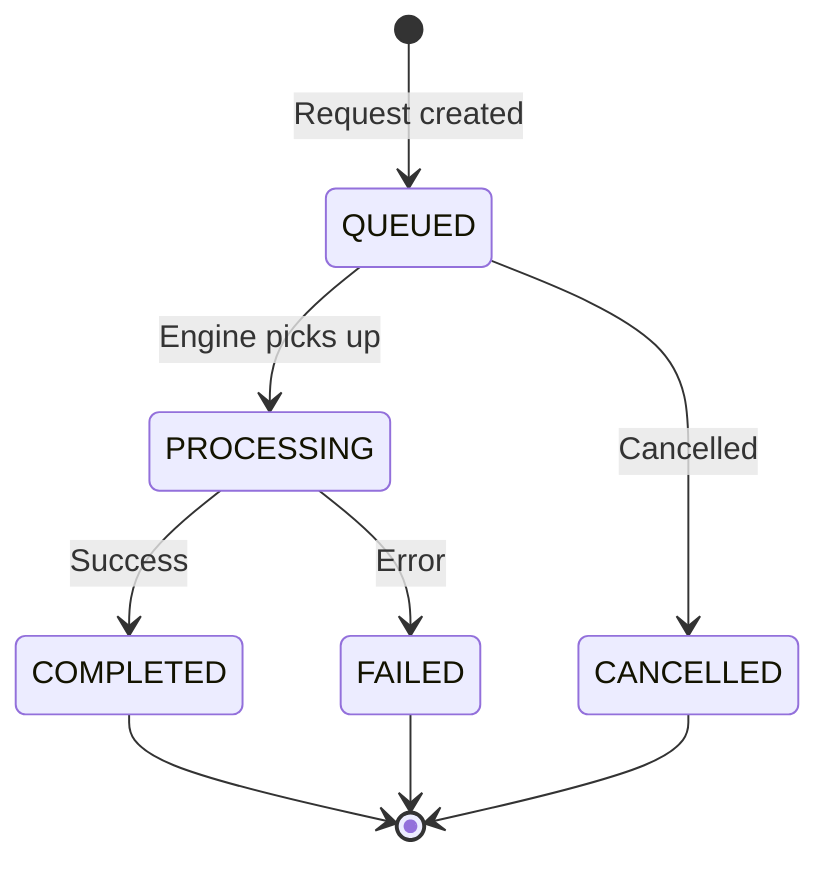
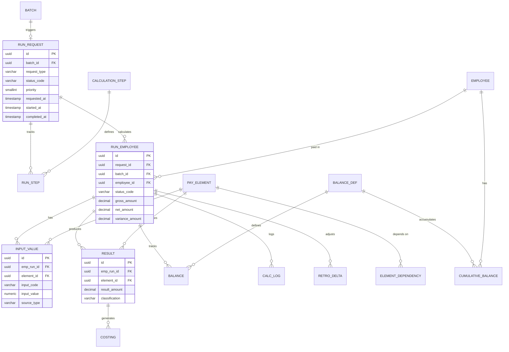
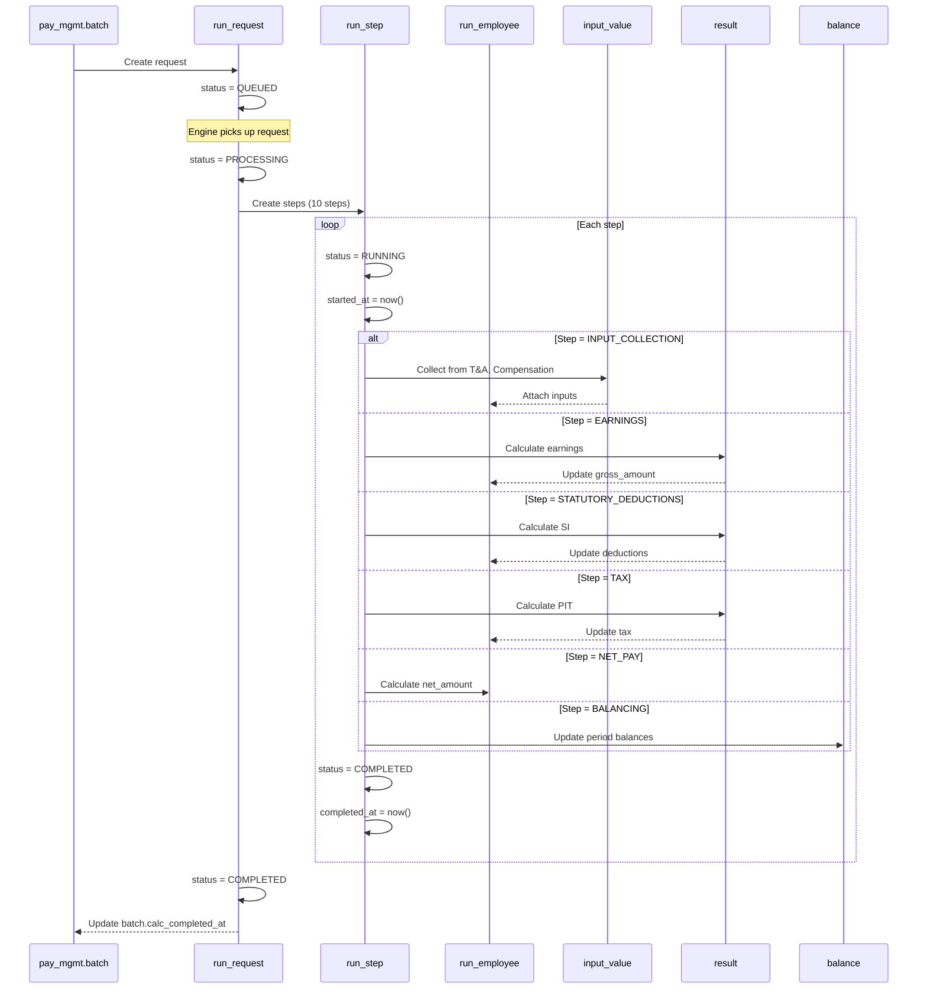

# Pay Engine Schema — Calculation Layer

**Schema**: `pay_engine`  
**Bounded Context**: BC-03 Payroll Execution (Calculation part)  
**Tables**: 12  
**Last Updated**: 27Mar2026

---

## Overview

`pay_engine` là **calculation layer** của Payroll module — thực hiện tính toán lương, lưu trữ kết quả, balances, logs.

**Key Characteristics**:
- **12 tables** — largest operational schema
- **MIGRATED from V3** `pay_run` schema
- **Engine interface**: `run_request` là contract giữa pay_mgmt và pay_engine
- **Step-by-step tracking**: `run_step` tracks calculation pipeline
- **Performance optimization**: `cumulative_balance` persists YTD/QTD/LTD

---

## 1. Schema Structure

```
pay_engine
│
├── EXECUTION (3 tables)
│   ├── run_request          # Aggregate Root: Engine interface contract
│   ├── calculation_step     # Reference: Calculation steps config
│   └── run_step             # Entity: Per-run step execution tracking
│
├── EMPLOYEE DATA (2 tables)
│   ├── run_employee         # Aggregate Root: Per-worker calculation record
│   └── input_value          # Entity: Input values (hours, amounts, rates)
│
├── RESULTS (3 tables)
│   ├── result               # Entity: Calculated amounts per element
│   ├── balance              # Entity: Period balance values
│   └── cumulative_balance   # Entity: YTD/QTD/LTD accumulated balances
│
├── RETRO & LOG (2 tables)
│   ├── retro_delta          # Entity: Retroactive adjustments delta
│   └── calc_log             # Entity: Detailed calculation log
│
└── SUPPORT (2 tables)
    ├── costing              # Entity: GL costing entries
    ├── element_dependency   # Reference: Calculation order graph
    └── input_source_config  # Reference: Automated input collection config
```

---

## 2. Execution Layer

### 2.1 run_request

**Type**: Aggregate Root  
**Purpose**: Engine interface contract between pay_mgmt and pay_engine

```sql
Table pay_engine.run_request {
  id              uuid [pk]
  batch_id        uuid [ref: > pay_mgmt.batch.id, not null]
  request_type    varchar(20) [not null]
  -- CALCULATE | VALIDATE | COSTING | RETRO | QUICKPAY | REVERSAL
  
  status_code     varchar(20) [not null, default: 'QUEUED']
  -- QUEUED | PROCESSING | COMPLETED | FAILED | CANCELLED
  priority        smallint [default: 5]       -- 1 (high) → 10 (low)
  
  parameters_json jsonb [null]               -- Override settings, filters
  employee_count  int [null]
  
  engine_version  varchar(20) [null]
  requested_by    uuid [not null]
  requested_at    timestamp [not null, default: `now()`]
  started_at      timestamp [null]
  completed_at    timestamp [null]
  
  error_count     int [default: 0]
  warning_count   int [default: 0]
  error_summary   text [null]
  
  metadata        jsonb [null]
  
  Indexes {
    (batch_id)
    (status_code, priority)
    (requested_at)
    (request_type, status_code)
  }
}
```

**Purpose**:
- Decouple orchestration (pay_mgmt) from calculation (pay_engine)
- Enable microservice deployment (engine can be separate service)
- Track engine execution lifecycle

**Lifecycle**:



**Request Types**:

| Type | Purpose |
|------|---------|
| **CALCULATE** | Full payroll calculation |
| **VALIDATE** | Pre-validation only (no results) |
| **COSTING** | GL costing calculation |
| **RETRO** | Retroactive adjustment calculation |
| **QUICKPAY** | Immediate payment calculation |
| **REVERSAL** | Reverse previous run |

---

### 2.2 calculation_step

**Type**: Reference Table  
**Purpose**: Define calculation pipeline steps

```sql
Table pay_engine.calculation_step {
  code            varchar(30) [pk]
  -- INPUT_COLLECTION | PRE_CALC | EARNINGS | STATUTORY_DEDUCTIONS | VOLUNTARY_DEDUCTIONS | TAX | NET_PAY | POST_CALC | BALANCING | COSTING
  
  name            varchar(100) [not null]
  sequence        smallint [not null]        -- Execution order
  description     text [null]
  is_active       boolean [default: true]
  is_mandatory    boolean [default: true]
  
  Indexes {
    (sequence)
    (is_active)
  }
}
```

**Standard Pipeline**:

| Seq | Code | Description |
|-----|------|-------------|
| 1 | INPUT_COLLECTION | Gather inputs from T&A, compensation |
| 2 | PRE_CALC | Pre-calculation validations |
| 3 | EARNINGS | Calculate earnings (base, OT, allowances) |
| 4 | STATUTORY_DEDUCTIONS | Calculate SI (BHXH, BHYT, BHTN) |
| 5 | VOLUNTARY_DEDUCTIONS | Calculate voluntary deductions |
| 6 | TAX | Calculate PIT |
| 7 | NET_PAY | Calculate net salary |
| 8 | POST_CALC | Post-calculation checks (min wage, negative net) |
| 9 | BALANCING | Update cumulative balances |
| 10 | COSTING | Generate GL costing entries |

---

### 2.3 run_step

**Type**: Entity  
**Purpose**: Track execution of each step per run

```sql
Table pay_engine.run_step {
  id              uuid [pk]
  request_id      uuid [ref: > pay_engine.run_request.id, not null]
  step_code       varchar(30) [ref: > pay_engine.calculation_step.code, not null]
  status_code     varchar(20) [not null, default: 'PENDING']
  -- PENDING | RUNNING | COMPLETED | FAILED | SKIPPED
  started_at      timestamp [null]
  completed_at    timestamp [null]
  record_count    int [default: 0]
  error_count     int [default: 0]
  duration_ms     bigint [null]              -- Execution time in ms
  error_detail    text [null]
  
  Indexes {
    (request_id, step_code) [unique]
    (request_id, status_code)
  }
}
```

**Purpose**:
- Provide visibility into calculation progress
- Enable performance monitoring (per-step duration)
- Support debugging (error_detail)

**Example**:
```
Run: 2025-03 monthly payroll
Steps:
1. INPUT_COLLECTION   → COMPLETED (5000 records, 1200ms)
2. PRE_CALC           → COMPLETED (0 errors, 300ms)
3. EARNINGS           → COMPLETED (5000 records, 15000ms)
4. STATUTORY_DEDUCTIONS → COMPLETED (5000 records, 8000ms)
5. VOLUNTARY_DEDUCTIONS → COMPLETED (120 records, 500ms)
6. TAX                → COMPLETED (5000 records, 10000ms)
7. NET_PAY            → COMPLETED (5000 records, 500ms)
8. POST_CALC          → COMPLETED (3 exceptions flagged, 400ms)
9. BALANCING          → COMPLETED (20000 balances updated, 2000ms)
10. COSTING           → COMPLETED (15000 entries, 3000ms)
```

---

## 3. Employee Data Layer

### 3.1 run_employee

**Type**: Aggregate Root  
**Purpose**: Per-worker calculation record

```sql
Table pay_engine.run_employee {
  id              uuid [pk]
  request_id      uuid [ref: > pay_engine.run_request.id, null]
  batch_id        uuid [ref: > pay_mgmt.batch.id, not null]
  employee_id     uuid [ref: > employment.employee.id, not null]
  assignment_id   uuid [ref: > employment.assignment.id, null]   -- Multi-assignment
  pay_group_id    uuid [ref: > pay_master.pay_group.id, null]
  
  status_code     varchar(20) [not null]
  -- SELECTED | CALC_OK | WARNINGS | ERROR | EXCLUDED
  
  gross_amount    decimal(18,2) [null]
  net_amount      decimal(18,2) [null]
  currency_code   char(3) [not null]
  
  -- Comparison with previous period (NEW 27Mar2026)
  prev_gross_amount decimal(18,2) [null]
  prev_net_amount   decimal(18,2) [null]
  variance_amount   decimal(18,2) [null]
  variance_flag     boolean [default: false]
  
  error_message   text [null]
  metadata        jsonb [null]
  
  Indexes {
    (request_id, employee_id) [unique]
    (batch_id, employee_id)
    (status_code)
    (assignment_id)
    (variance_flag) [where: "variance_flag = true"]
  }
}
```

**Status Definitions**:

| Status | Meaning |
|--------|---------|
| **SELECTED** | Employee selected for calculation, not yet processed |
| **CALC_OK** | Calculation completed successfully |
| **WARNINGS** | Calculation completed with warnings (logged) |
| **ERROR** | Calculation failed (error_message contains details) |
| **EXCLUDED** | Employee excluded from calculation (manual/eligibility) |

**Variance Detection**:
- `prev_gross_amount`, `prev_net_amount` from previous period's `run_employee`
- `variance_amount = current_net - prev_net`
- `variance_flag = true` if `ABS(variance_amount) > threshold`

---

### 3.2 input_value

**Type**: Entity  
**Purpose**: Input values for calculation

```sql
Table pay_engine.input_value {
  id            uuid [pk]
  emp_run_id    uuid [ref: > pay_engine.run_employee.id, not null]
  element_id    uuid [ref: > pay_master.pay_element.id, not null]
  input_code    varchar(50) [not null]       -- RATE | HOURS | AMOUNT
  input_value   numeric(18,2) [not null]
  source_ref    varchar(50) [null]           -- TA_123, MAN_ADJ_9
  source_type   varchar(30) [not null]       -- TimeAttendance | Absence | ManualAdjust
  unit          varchar(10) [null]
  metadata      jsonb [null]
  
  Indexes {
    (emp_run_id, element_id)
    (source_type)
  }
}
```

**Source Types**:

| Source | Description |
|--------|-------------|
| **TimeAttendance** | From TA module (work hours, OT hours) |
| **Absence** | From TA module (leave days, unpaid leave) |
| **Compensation** | From TR module (base salary, allowances) |
| **Benefits** | From Benefits module (premiums) |
| **ManualAdjust** | Manual adjustment from pay_mgmt |
| **ManualInput** | Direct input in payroll UI |

**Example**:
```
Employee: Nguyen Van A
Inputs:
- BASE_SALARY: 25000000 (source: Compensation, ref: COMP_SNAP_123)
- WORK_DAYS: 22 (source: TimeAttendance, ref: TA_PERIOD_202503)
- OT_HOURS_WEEKDAY: 8 (source: TimeAttendance, ref: TA_TIMESHEET_456)
- LOAN_REPAYMENT: 2000000 (source: ManualAdjust, ref: MAN_ADJ_9)
```

---

## 4. Results Layer

### 4.1 result

**Type**: Entity  
**Purpose**: Calculated amounts per element

```sql
Table pay_engine.result {
  id            uuid [pk]
  emp_run_id    uuid [ref: > pay_engine.run_employee.id, not null]
  element_id    uuid [ref: > pay_master.pay_element.id, not null]
  result_amount decimal(18,2) [not null]
  currency_code char(3) [not null]
  classification varchar(20) [not null]
  -- EARNING | DEDUCTION | TAX | EMPLOYER_CONTRIBUTION | INFORMATIONAL
  metadata      jsonb [null]
  
  Indexes {
    (emp_run_id, element_id)
    (classification)
  }
}
```

**Example**:
```
Employee: Nguyen Van A
Results:
- BASE_SALARY: 25000000 (EARNING)
- OVERTIME_WEEKDAY: 1454545 (EARNING)
- BHXH_EMPLOYEE: 2000000 (TAX)
- BHYT_EMPLOYEE: 375000 (TAX)
- BHTN_EMPLOYEE: 250000 (TAX)
- PIT: 2850000 (TAX)
- LOAN_REPAYMENT: 2000000 (DEDUCTION)
- NET_SALARY: 19600000 (EARNING)
```

---

### 4.2 balance

**Type**: Entity  
**Purpose**: Period balance values

```sql
Table pay_engine.balance {
  id            uuid [pk]
  emp_run_id    uuid [ref: > pay_engine.run_employee.id, not null]
  balance_id    uuid [ref: > pay_master.balance_def.id, not null]
  balance_value decimal(18,2) [not null]
  
  Indexes {
    (emp_run_id, balance_id)
  }
}
```

**Purpose**:
- Store per-period balance snapshots
- Used for reporting (YTD summary, payslip)
- Source for cumulative_balance updates

---

### 4.3 cumulative_balance

**Type**: Entity  
**Purpose**: Persistent YTD/QTD/LTD balances

```sql
Table pay_engine.cumulative_balance {
  id              uuid [pk]
  employee_id     uuid [ref: > employment.employee.id, not null]
  balance_def_id  uuid [ref: > pay_master.balance_def.id, not null]
  balance_type    varchar(10) [not null]    -- QTD | YTD | LTD
  period_year     smallint [not null]
  period_quarter  smallint [null]           -- For QTD, NULL for YTD/LTD
  balance_value   decimal(18,2) [not null, default: 0]
  currency_code   char(3) [not null]
  last_updated_by_run_id uuid [ref: > pay_engine.run_request.id, null]
  last_updated_at timestamp [null]
  
  Indexes {
    (employee_id, balance_def_id, balance_type, period_year) [unique]
    (employee_id, period_year)
    (balance_type, period_year)
  }
}
```

**Purpose**:
- **Performance optimization**: Avoid re-aggregating from `balance` each time
- Persist aggregated YTD/QTD values
- Update incrementally after each run

**Example**:
```
Employee: Nguyen Van A
Balance: GROSS_YTD
- period_year: 2025
- balance_value: 75000000 (Jan + Feb + Mar)
- last_updated_by_run_id: RUN_2025_03
- last_updated_at: 2025-03-28 10:00:00
```

---

## 5. Retro & Log Layer

### 5.1 retro_delta

**Type**: Entity  
**Purpose**: Track retroactive adjustment deltas

```sql
Table pay_engine.retro_delta {
  id            uuid [pk]
  emp_run_id    uuid [ref: > pay_engine.run_employee.id, not null]
  orig_batch_id uuid [ref: > pay_mgmt.batch.id, not null]
  element_id    uuid [ref: > pay_master.pay_element.id, not null]
  delta_amount  decimal(18,2) [not null]
  currency_code char(3) [not null]
  metadata      jsonb [null]
  
  Indexes {
    (emp_run_id, element_id)
    (orig_batch_id)
  }
}
```

**Purpose**:
- Record delta between recalculated amount and original amount
- Used for audit trail and reporting
- Applied in current period as RETRO_ADJUSTMENT element

---

### 5.2 calc_log

**Type**: Entity  
**Purpose**: Detailed calculation log

```sql
Table pay_engine.calc_log {
  id            uuid [pk]
  emp_run_id    uuid [ref: > pay_engine.run_employee.id, not null]
  step_label    varchar(50) [not null]       -- PRE_BAL, OT_RULE, TAX
  message       text [not null]
  payload_json  jsonb [null]
  logged_at     timestamp [default: `now()`]
  
  Indexes {
    (emp_run_id, step_label)
    (logged_at)
  }
}
```

**Purpose**:
- Full audit trail of calculation steps
- Reproducibility: same inputs + same formula version = same log
- Debugging: identify where calculation diverged

**Example**:
```json
{
  "step": "BHXH_EMPLOYEE",
  "input": {
    "si_basis": 25000000,
    "ceiling": 46800000,
    "rate": 0.08
  },
  "output": {
    "amount": 2000000
  },
  "formula_version": "VN_SI_2025_V1"
}
```

---

## 6. Support Layer

### 6.1 costing

**Type**: Entity  
**Purpose**: GL costing entries

```sql
Table pay_engine.costing {
  id            uuid [pk]
  result_id     uuid [ref: > pay_engine.result.id, not null]
  account_code  varchar(50) [not null]       -- GL account
  dr_cr         char(1) [not null]           -- D (Debit) | C (Credit)
  amount        decimal(18,2) [not null]
  currency_code char(3) [not null]
  segment_json  jsonb [null]                 -- Cost center, project, etc.
  
  Indexes {
    (result_id)
    (account_code)
  }
}
```

**Purpose**:
- Generate GL journal entries from results
- Support VAS/IFRS accounting
- Cost center allocation

**Example**:
```
Result: BASE_SALARY 25000000
Costing entries:
- TK 642 (Debit) 25000000 — Salary expense
- TK 334 (Credit) 25000000 — Payable to employees
```

---

### 6.2 element_dependency

**Type**: Reference Table  
**Purpose**: Define calculation order graph

```sql
Table pay_engine.element_dependency {
  id                    uuid [pk]
  element_id            uuid [ref: > pay_master.pay_element.id, not null]
  depends_on_element_id uuid [ref: > pay_master.pay_element.id, not null]
  dependency_type       varchar(20) [not null]
  -- REQUIRES_OUTPUT | USES_BALANCE | SEQUENCED_AFTER
  description           text [null]
  is_active             boolean [default: true]
  
  Indexes {
    (element_id, depends_on_element_id) [unique]
    (depends_on_element_id)
    (dependency_type)
  }
}
```

**Purpose**:
- Build Directed Acyclic Graph (DAG) for calculation order
- Ensure correct dependency resolution
- Example: PIT depends on GROSS_SALARY and SI_EMPLOYEE

**Example**:
```
PIT depends on:
- GROSS_SALARY (REQUIRES_OUTPUT)
- BHXH_EMPLOYEE (REQUIRES_OUTPUT)
- BHYT_EMPLOYEE (REQUIRES_OUTPUT)
- BHTN_EMPLOYEE (REQUIRES_OUTPUT)
```

---

### 6.3 input_source_config

**Type**: Reference Table  
**Purpose**: Configure automated input collection

```sql
Table pay_engine.input_source_config {
  id              uuid [pk]
  source_module   varchar(30) [not null]
  -- TIME_ATTENDANCE | ABSENCE | COMPENSATION | BENEFITS | MANUAL
  source_type     varchar(50) [not null]
  -- TIMESHEET | LEAVE_DEDUCTION | COMP_BASIS_CHANGE | BENEFIT_PREMIUM
  target_element_id uuid [ref: > pay_master.pay_element.id, not null]
  mapping_json    jsonb [null]
  is_active       boolean [default: true]
  priority        smallint [default: 0]
  description     text [null]
  metadata        jsonb [null]
  
  Indexes {
    (source_module, source_type, target_element_id) [unique]
    (target_element_id)
  }
}
```

**Purpose**:
- Automate input collection from external modules
- Map source data to input codes
- Reduce manual data entry

**Example**:
```json
{
  "source_module": "TIME_ATTENDANCE",
  "source_type": "TIMESHEET",
  "target_element_id": "OT_HOURS_WEEKDAY",
  "mapping": {
    "source_field": "ot_weekday_hours",
    "input_code": "HOURS"
  }
}
```

---

## 7. ERD — Pay Engine Schema



---

## 8. Calculation Flow



---

## 9. Key Business Rules

| Rule ID | Summary | Table(s) |
|---------|---------|----------|
| BR-033 | Split-period SI calculation | run_step (STATUTORY_DEDUCTIONS) |
| BR-047 | Monthly PIT computed directly | result (TAX) |
| BR-048 | Annual PIT settlement | cumulative_balance |
| BR-060 | Deduction priority order | element_dependency |
| BR-061 | Net = Gross − SI − PIT − Deductions | run_employee |
| BR-062 | Rounding per PayProfile | result |
| BR-063 | Negative net: flag exception | run_employee (variance_flag) |
| BR-101 | CompensationSnapshot immutability | input_value (source: Compensation) |
| BR-102 | PayrollResult immutability after period lock | result (no update/delete) |
| BR-103 | SHA-256 integrity hash | (stored in pay_audit) |

---

## 10. Query Patterns

### 10.1 Get Employee Results

```sql
SELECT 
    pe.code as element_code,
    pe.name as element_name,
    pe.classification,
    r.result_amount,
    r.currency_code
FROM pay_engine.result r
JOIN pay_master.pay_element pe ON r.element_id = pe.id
WHERE r.emp_run_id = :emp_run_id
ORDER BY pe.classification, pe.priority_order;
```

### 10.2 Get YTD Balance

```sql
SELECT 
    bd.code as balance_code,
    bd.name as balance_name,
    cb.balance_value,
    cb.currency_code
FROM pay_engine.cumulative_balance cb
JOIN pay_master.balance_def bd ON cb.balance_def_id = bd.id
WHERE cb.employee_id = :employee_id
  AND cb.balance_type = 'YTD'
  AND cb.period_year = :year;
```

### 10.3 Get Calculation Log

```sql
SELECT 
    cl.step_label,
    cl.message,
    cl.payload_json,
    cl.logged_at
FROM pay_engine.calc_log cl
WHERE cl.emp_run_id = :emp_run_id
ORDER BY cl.logged_at;
```

---

## 11. Differences from V3

| Aspect | V3 (`pay_run`) | V4 (`pay_engine`) |
|--------|---------------|-------------------|
| Schema | `pay_run` | `pay_engine` |
| Engine interface | None (embedded) | `run_request` (explicit contract) |
| Step tracking | None | `run_step` (per-step visibility) |
| Cumulative balance | Calculated on-demand | `cumulative_balance` (persisted) |
| Element dependency | Hardcoded | `element_dependency` (configurable graph) |
| Input automation | Manual | `input_source_config` (automated mapping) |
| Variance detection | None | `variance_flag` (automatic flagging) |
| Multi-assignment | Single assignment | `assignment_id` FK |

---

*[Previous: Pay Mgmt Schema](./03-pay-mgmt-schema.md) · [Next: Support Schemas →](./05-support-schemas.md)*