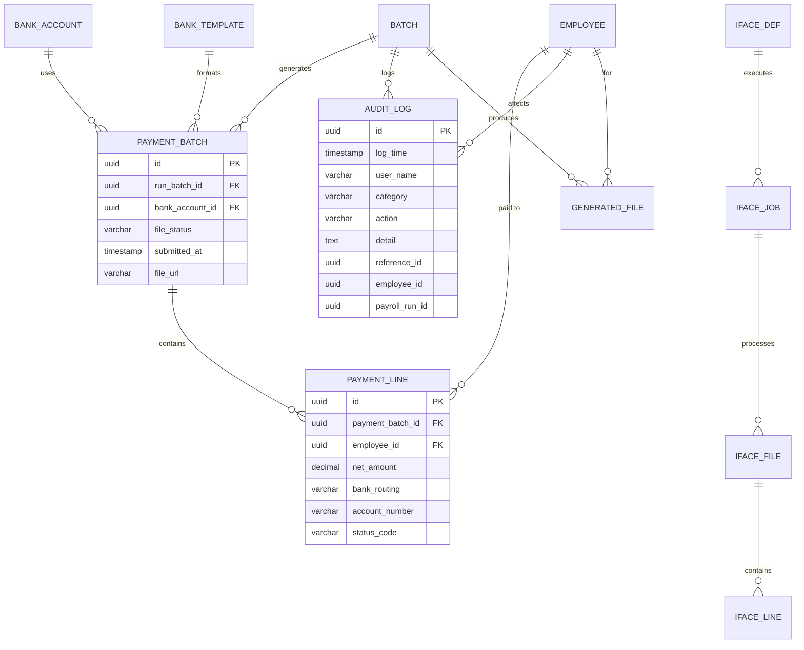
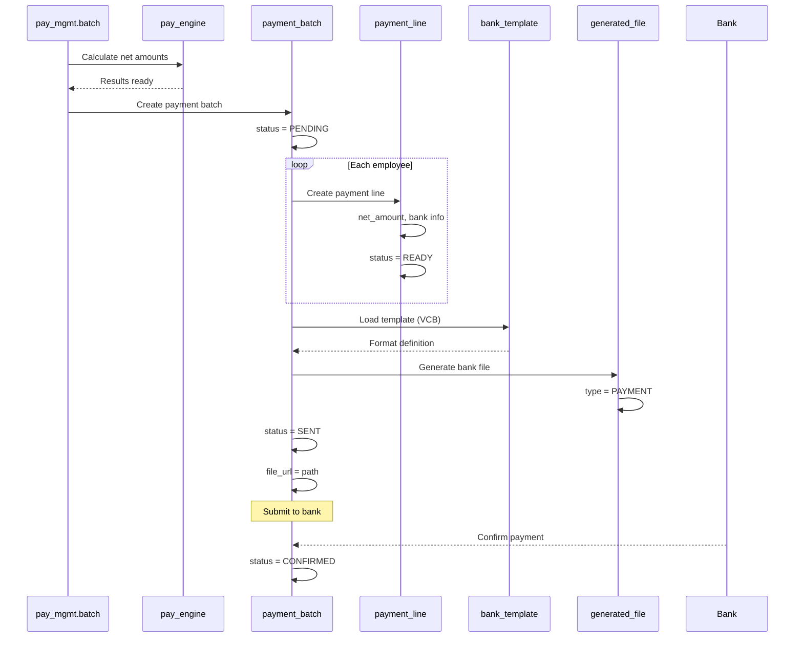
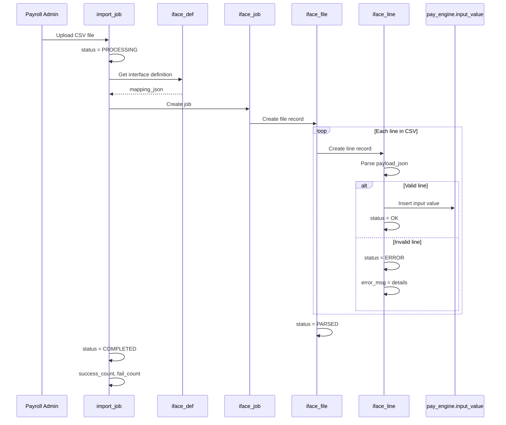

# Support Schemas — Gateway, Bank, Audit & Supplemental

**Schemas**: `pay_gateway`, `pay_bank`, `pay_audit` + supplemental tables  
**Bounded Contexts**: BC-04 Payment Output, BC-07 Audit Trail  
**Tables**: 4 + 3 + 1 + 4 = 12  
**Last Updated**: 27Mar2026

---

## Overview

Các schemas hỗ trợ phục vụ các chức năng:
- **pay_gateway**: Integration layer (inbound/outbound interfaces)
- **pay_bank**: Payment layer (bank payment files)
- **pay_audit**: Audit trail (immutable operation logs)
- **Supplemental tables**: Import tracking, file management, templates

---

## 1. pay_gateway Schema (4 tables)

**Purpose**: Integration layer — manage inbound/outbound file/API interfaces

```
pay_gateway
│
├── iface_def          # Interface definition
├── iface_job          # Job execution instance
├── iface_file         # File instance
└── iface_line         # Line-level processing status
```

### 1.1 iface_def

**Type**: Aggregate Root  
**Purpose**: Define interface configuration

```sql
Table pay_gateway.iface_def {
  id            uuid [pk]
  code          varchar(50) [unique]
  name          varchar(100)
  direction     varchar(10)           -- IN | OUT
  file_type     varchar(10)           -- CSV | JSON | API
  mapping_json  jsonb                 -- Field mapping rules
  schedule_json jsonb [null]          -- Schedule config
  is_active     boolean [default:true]
}
```

**Examples**:
```
Inbound interfaces:
- TA_TIMESHEET_IMPORT (IN, CSV) — Import T&A timesheet data
- COMP_BASIS_IMPORT (IN, CSV) — Import compensation basis changes
- BENEFIT_PREMIUM_IMPORT (IN, JSON) — Import benefit premiums

Outbound interfaces:
- BANK_PAYMENT_FILE (OUT, CSV) — Generate bank payment file
- TAX_REPORT_EXPORT (OUT, XML) — Generate tax report XML
- GL_JOURNAL_EXPORT (OUT, JSON) — Export GL journal entries
```

---

### 1.2 iface_job

**Type**: Entity  
**Purpose**: Track interface job execution

```sql
Table pay_gateway.iface_job {
  id            uuid [pk]
  iface_id      uuid [ref: > pay_gateway.iface_def.id]
  run_time      timestamp [default: `now()`]
  status_code   varchar(20)           -- STARTED | DONE | ERROR
  metadata      jsonb
}
```

**Purpose**: Track when interface jobs run, their status, and results

---

### 1.3 iface_file

**Type**: Entity  
**Purpose**: Track individual file processing

```sql
Table pay_gateway.iface_file {
  id            uuid [pk]
  job_id        uuid [ref: > pay_gateway.iface_job.id]
  file_name     varchar(255)
  file_dt       timestamp
  status_code   varchar(20)           -- RECEIVED | PARSED | SENT | ERROR
  processed_at  timestamp [null]
  metadata      jsonb
}
```

**Status Flow**:
```
RECEIVED → PARSED → SENT (for outbound)
RECEIVED → PARSED → (for inbound, data loaded)
```

---

### 1.4 iface_line

**Type**: Entity  
**Purpose**: Track line-level processing

```sql
Table pay_gateway.iface_line {
  id            uuid [pk]
  file_id       uuid [ref: > pay_gateway.iface_file.id]
  line_num      int
  payload_json  jsonb
  status_code   varchar(20)           -- OK | ERROR
  error_msg     text [null]
}
```

**Purpose**: Detailed error tracking per line in file

---

## 2. pay_bank Schema (3 tables)

**Purpose**: Payment layer — manage bank payment files and instructions

```
pay_bank
│
├── bank_account       # Company bank accounts
├── payment_batch      # Payment file batch
└── payment_line       # Per-employee payment instruction
```

### 2.1 bank_account

**Type**: Aggregate Root  
**Purpose**: Company bank account configuration

```sql
Table pay_bank.bank_account {
  id              uuid [pk]
  legal_entity_id uuid [ref: > org_legal.entity.id]
  bank_name       varchar(100)
  account_no      varchar(50)
  currency_code   char(3)
  metadata        jsonb
}
```

**Purpose**: Define bank accounts for payroll disbursement

**Example**:
```
Bank Account: VCB-001
- legal_entity_id: VNG Corp
- bank_name: Vietcombank
- account_no: 0011001234567
- currency_code: VND
```

---

### 2.2 payment_batch

**Type**: Entity  
**Purpose**: Payment file batch

```sql
Table pay_bank.payment_batch {
  id              uuid [pk]
  run_batch_id    uuid [ref: > pay_mgmt.batch.id]
  bank_account_id uuid [ref: > pay_bank.bank_account.id]
  file_status     varchar(20)         -- PENDING | SENT | CONFIRMED
  submitted_at    timestamp [null]
  file_url        varchar(255) [null]
  metadata        jsonb
}
```

**Purpose**: Track payment file generation and submission

**Status Flow**:
```
PENDING → SENT → CONFIRMED (by bank response)
```

---

### 2.3 payment_line

**Type**: Entity  
**Purpose**: Per-employee payment instruction

```sql
Table pay_bank.payment_line {
  id              uuid [pk]
  payment_batch_id uuid [ref: > pay_bank.payment_batch.id]
  employee_id     uuid [ref: > employment.employee.id]
  net_amount      decimal(18,2)
  bank_routing    varchar(20) [null]
  account_number  varchar(30) [null]
  status_code     varchar(20)         -- READY | SENT | FAIL
  metadata        jsonb
}
```

**Purpose**: Individual payment records for bank file

**Status**:
- READY: Prepared for bank file
- SENT: Included in bank file sent to bank
- FAIL: Payment failed (insufficient funds, wrong account, etc.)

---

## 3. pay_audit Schema (1 table)

**Purpose**: Audit trail — immutable operation logs

### 3.1 audit_log

**Type**: Aggregate Root  
**Purpose**: Immutable audit log

```sql
Table pay_audit.audit_log {
  id                uuid [pk]
  log_time          timestamp [default: `now()`]
  user_name         varchar(100)
  category          varchar(20)         -- CONFIG | PROFILE | INPUT | RUN
  action            varchar(30)         -- CREATE | UPDATE | DELETE | CALCULATE
  detail            text
  reference_id      uuid [null]         -- ID of affected object
  employee_id       uuid [null]         -- Employee affected
  payroll_run_id    uuid [null]         -- Batch affected
  
  Indexes {
    (category, log_time)
    (employee_id)
    (payroll_run_id)
  }
}
```

**Categories**:
- **CONFIG**: Configuration changes (PayElement, StatutoryRule)
- **PROFILE**: Profile changes (PayProfile, bindings)
- **INPUT**: Input data changes (manual adjustments)
- **RUN**: Payroll run events (batch status changes)

**Actions**:
- CREATE, UPDATE, DELETE — CRUD operations
- CALCULATE — Payroll calculation
- APPROVE, REJECT — Approval workflow
- LOCK, UNLOCK — Period locking

**Immutable**: Insert-only, no update/delete

**Retention**: 7-year minimum per Accounting Law 88/2015/QH13

---

## 4. Supplemental Tables (4 tables)

**Location**: Root level (no schema)

```
├── import_job              # CSV import tracking
├── generated_file          # Output file management
├── bank_template           # Bank file format templates
└── tax_report_template     # Tax report format templates
```

### 4.1 import_job

**Type**: Aggregate Root  
**Purpose**: Track CSV import jobs

```sql
Table import_job {
  id                      uuid [pk]
  file_name               varchar(255)
  pay_group_code          varchar(50) [null]
  period_start            date [null]
  period_end              date [null]
  total_records           int
  success_count           int
  fail_count              int
  status                  varchar(20)   -- PROCESSING | COMPLETED | ERROR
  submitted_by            varchar(100)
  submitted_at            timestamp
  completed_at            timestamp [null]
}
```

**Purpose**: Track manual CSV imports for payroll input data

---

### 4.2 generated_file

**Type**: Entity  
**Purpose**: Manage generated output files

```sql
Table generated_file {
  id                      uuid [pk]
  type                    varchar(20)   -- PAYMENT | TAX_REPORT | PAYSLIP
  payroll_run_id          uuid [ref: > pay_mgmt.batch.id]
  employee_id             uuid [null]   -- For PAYSLIP
  file_name               varchar(255)
  file_path               varchar(512)
  generated_at            timestamp
  expires_at              timestamp [null]
  status                  varchar(35]
}
```

**Purpose**: Track generated files (payslips, bank files, tax reports)

**Types**:
- **PAYMENT**: Bank payment file
- **TAX_REPORT**: Tax report XML/PDF
- **PAYSLIP**: Individual payslip PDF

---

### 4.3 bank_template

**Type**: Reference Table  
**Purpose**: Bank file format templates

```sql
Table bank_template {
  code                    varchar(20) [pk]  -- VCB, VIETIN, CITI
  name                    varchar(100)
  format                  varchar(10)       -- CSV | TXT
  delimiter               varchar(5) [null]
  columns_json            jsonb             -- Column definitions
  effective_start_date    date
  effective_end_date      date
  current_flag            bool
}
```

**Purpose**: Define bank-specific file formats

**Example**:
```json
{
  "columns": [
    {"name": "AccountNumber", "position": 1, "length": 20},
    {"name": "Amount", "position": 2, "length": 15, "format": "DECIMAL"},
    {"name": "Description", "position": 3, "length": 100}
  ],
  "header": true,
  "footer": false
}
```

---

### 4.4 tax_report_template

**Type**: Reference Table  
**Purpose**: Tax report format templates

```sql
Table tax_report_template {
  code                    varchar(20) [pk]  -- 05QTT_TNCN, 02KK
  country_code            varchar(3)
  format                  varchar(10)       -- PDF | XML
  template_blob           bytea
  effective_start_date    date
  effective_end_date      date
  current_flag            bool
}
```

**Purpose**: Define tax report templates per regulatory requirements

**Examples**:
- **05QTT_TNCN**: Vietnam PIT annual settlement form
- **02KK**: Quarterly PIT declaration
- **D02-LT**: BHXH monthly contribution list

---

## 5. ERD — Support Schemas



---

## 6. Integration Flow

### 6.1 Payment File Generation



---

### 6.2 Import Flow



---

## 7. Key Business Rules

| Rule ID | Summary | Table |
|---------|---------|-------|
| BR-100 | Legal entity isolation | All tables with legal_entity_id |
| BR-102 | PayrollResult immutability | audit_log (insert-only) |
| BR-103 | SHA-256 integrity hash | (stored in audit_log metadata) |
| BR-104 | Nightly integrity verification | audit_log (category=RUN, action=VERIFY) |

---

## 8. Query Patterns

### 8.1 Get Audit Log for Batch

```sql
SELECT 
    al.log_time,
    al.user_name,
    al.category,
    al.action,
    al.detail
FROM pay_audit.audit_log al
WHERE al.payroll_run_id = :batch_id
ORDER BY al.log_time;
```

### 8.2 Get Payment Status for Employee

```sql
SELECT 
    pb.id as batch_id,
    pb.file_status,
    pl.net_amount,
    pl.status_code,
    pb.submitted_at
FROM pay_bank.payment_batch pb
JOIN pay_bank.payment_line pl ON pb.id = pl.payment_batch_id
WHERE pl.employee_id = :employee_id
  AND pb.run_batch_id = :batch_id;
```

### 8.3 Get Import Errors

```sql
SELECT 
    ij.file_name,
    il.line_num,
    il.error_msg,
    il.payload_json
FROM import_job ij
JOIN pay_gateway.iface_job job ON ij.id = job.id
JOIN pay_gateway.iface_file f ON job.id = f.job_id
JOIN pay_gateway.iface_line il ON f.id = il.file_id
WHERE ij.id = :import_job_id
  AND il.status_code = 'ERROR'
ORDER BY il.line_num;
```

---

## 9. Retention & Compliance

### 9.1 Retention Policy

| Data Type | Retention | Legal Basis |
|-----------|-----------|-------------|
| `pay_audit.audit_log` | 7 years minimum | Accounting Law 88/2015/QH13 |
| `pay_engine.result` | 7 years minimum | Tax regulations |
| `pay_engine.calc_log` | 3 years | Internal audit |
| `generated_file` (PAYSLIP) | 7 years | Labor Code |
| `generated_file` (TAX_REPORT) | 5 years | Tax regulations |

### 9.2 Data Archival Strategy

**Hot Data** (0-1 year):
- Keep in production database
- Full indexing for fast queries

**Warm Data** (1-3 years):
- Move to archive tables (separate tablespace)
- Reduced indexing

**Cold Data** (3-7+ years):
- Export to object storage (S3, Azure Blob)
- Database retains metadata only

**Partitioning**:
```sql
-- Partition by period_year
CREATE TABLE pay_engine.result_archive_2025 
    PARTITION OF pay_engine.result
    FOR VALUES FROM (2025) TO (2026);
```

---

*[Previous: Pay Engine Schema](./04-pay-engine-schema.md) · [Next: Data Flow Diagrams →](./06-data-flow-diagrams.md)*