# Data Flow Diagrams — Payroll Execution Lifecycle

**Purpose**: Visualize data flow through Payroll V4 model  
**Last Updated**: 27Mar2026

---

## Overview

Tài liệu này minh họa data flow qua các schema trong Payroll V4:
- **Monthly Payroll Flow**: Regular payroll processing
- **Retroactive Adjustment Flow**: Backdated changes
- **Termination Final Pay Flow**: Off-cycle payment
- **Data Integration Flow**: Inbound from CO/TA/TR

---

## 1. Monthly Payroll Flow

### 1.1 High-Level Flow

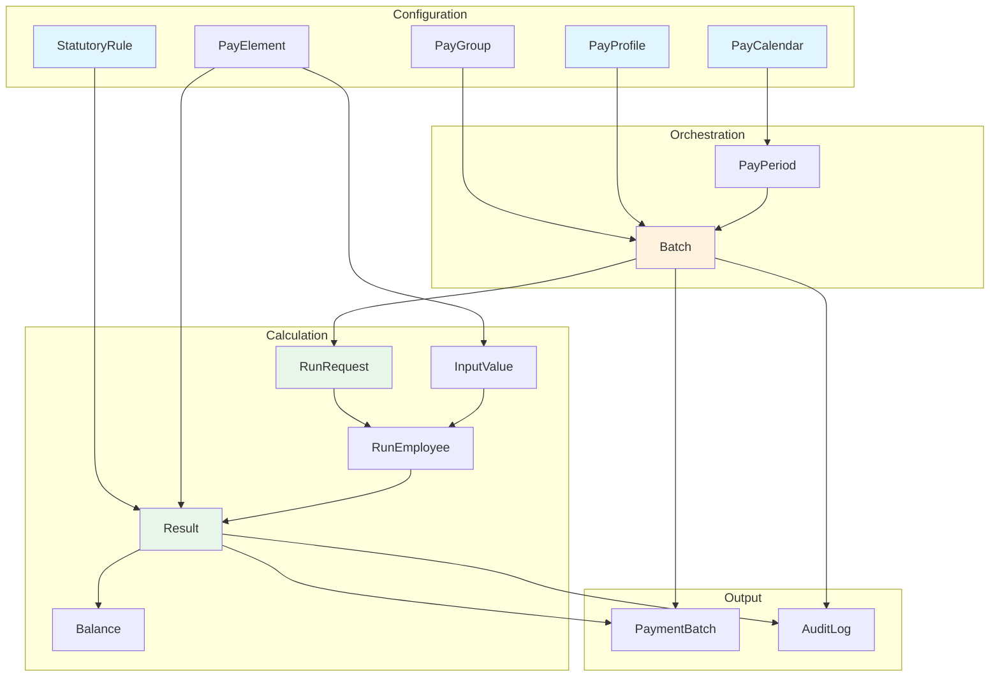

### 1.2 Detailed Sequence Flow

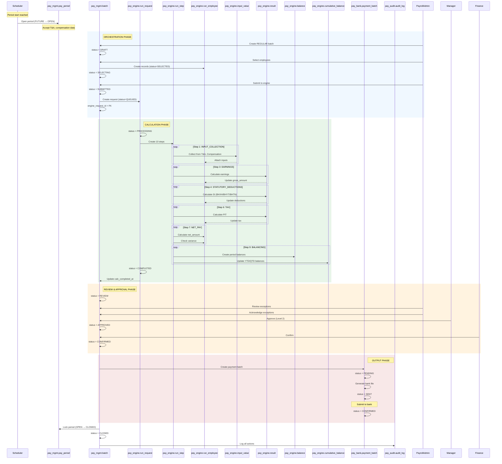

---

## 2. Configuration Lookup Flow

### 2.1 PayProfile Resolution

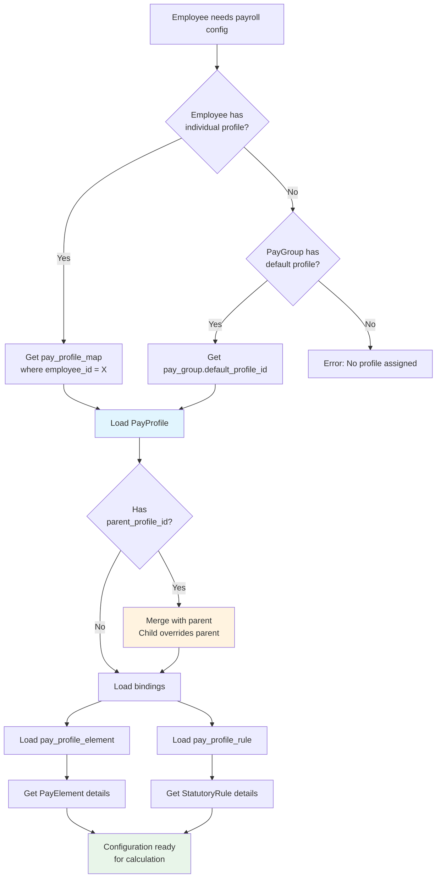

### 2.2 Rate Lookup (3-Layer)

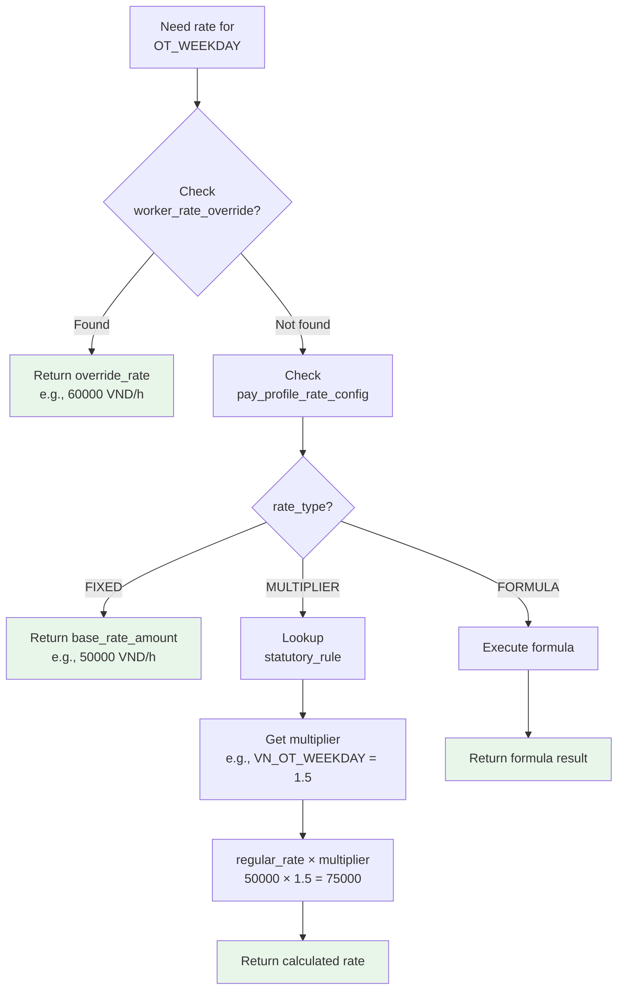

---

## 3. Calculation Pipeline

### 3.1 Calculation Steps

```mermaid
flowchart LR
    START[Start Calculation] --> S1[1. INPUT_COLLECTION]
    S1 --> S2[2. PRE_CALC]
    S2 --> S3[3. EARNINGS]
    S3 --> S4[4. STATUTORY_DEDUCTIONS]
    S4 --> S5[5. VOLUNTARY_DEDUCTIONS]
    S5 --> S6[6. TAX]
    S6 --> S7[7. NET_PAY]
    S7 --> S8[8. POST_CALC]
    S8 --> S9[9. BALANCING]
    S9 --> S10[10. COSTING]
    S10 --> END[Complete]
    
    style S3 fill:#e8f5e9
    style S4 fill:#fff3e0
    style S6 fill:#ffebee
    style S7 fill:#e1f5fe
```

### 3.2 Gross-to-Net Calculation

```mermaid
flowchart TD
    INPUTS[Inputs:<br/>- Base Salary<br/>- Work Days<br/>- OT Hours<br/>- Allowances] --> GROSS[Calculate Gross]
    
    GROSS --> GROSS_DET[Gross =<br/>Base Salary + OT + Allowances]
    
    GROSS_DET --> SI_BASIS[Calculate SI Basis]
    
    SI_BASIS --> SI_DET[SI Basis =<br/>Sum of elements where<br/>si_basis_inclusion = INCLUDED]
    
    SI_DET --> SI_CALC[Calculate SI]
    
    SI_CALC --> SI_EMP[BHXH Employee = 8%<br/>BHYT Employee = 1.5%<br/>BHTN Employee = 1%]
    
    SI_EMP --> TAXABLE[Calculate Taxable Income]
    
    TAXABLE --> TAX_DET[Taxable = Gross - SI - Deductions<br/>- Personal (11M) - Dependents (4.4M each)]
    
    TAX_DET --> PIT[Calculate PIT]
    
    PIT --> PIT_DET[PIT = Progressive tax<br/>7 brackets: 5% - 35%]
    
    PIT_DET --> NET[Calculate Net]
    
    NET --> NET_DET[Net = Gross - SI - PIT - Deductions]
    
    NET_DET --> CHECK{Net < 0?}
    
    CHECK -->|Yes| EXCEPTION[Flag NEGATIVE_NET<br/>exception]
    CHECK -->|No| MIN_WAGE{Net < Min Wage?}
    
    MIN_WAGE -->|Yes| EXCEPTION2[Flag MIN_WAGE_VIOLATION<br/>exception]
    MIN_WAGE -->|No| DONE[Calculation Complete]
    
    EXCEPTION --> ACK[Acknowledge exception]
    EXCEPTION2 --> ACK
    ACK --> DONE
    
    style GROSS fill:#e8f5e9
    style SI_CALC fill:#fff3e0
    style PIT fill:#ffebee
    style NET fill:#e1f5fe
```

---

## 4. Retroactive Adjustment Flow

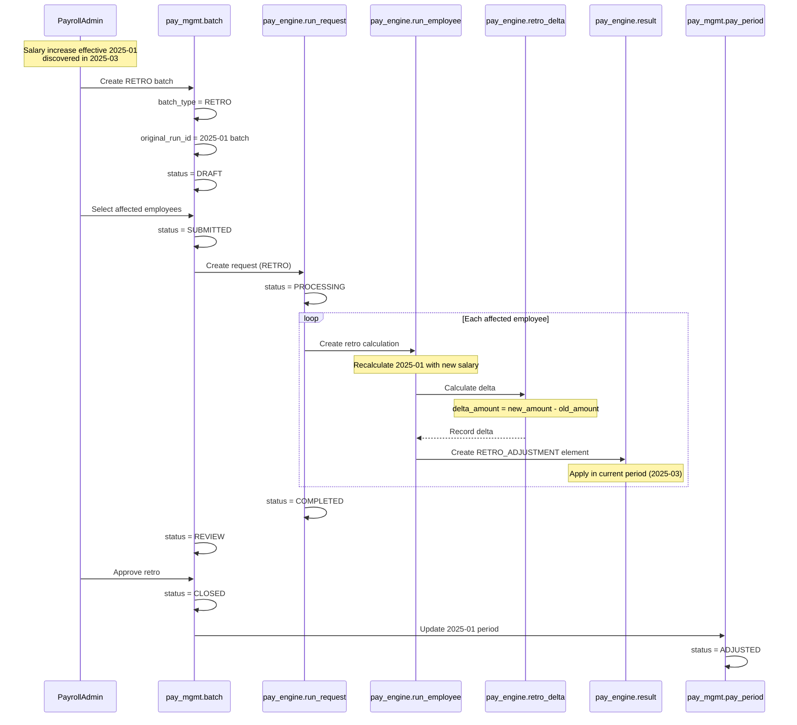

---

## 5. Termination Final Pay Flow

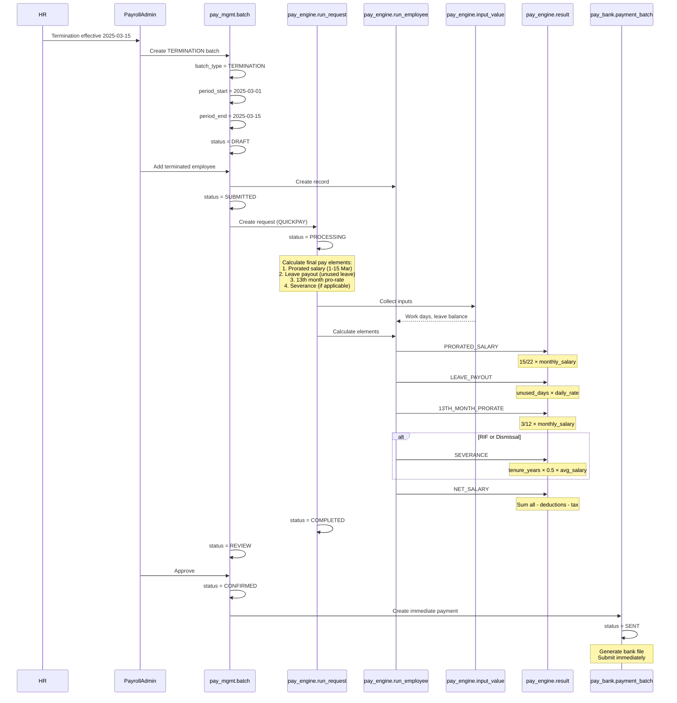

---

## 6. Data Integration Flow

### 6.1 Inbound Data Collection

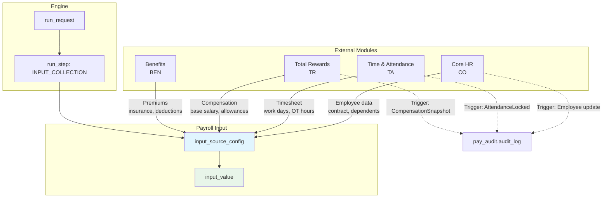

### 6.2 Outbound Data Distribution

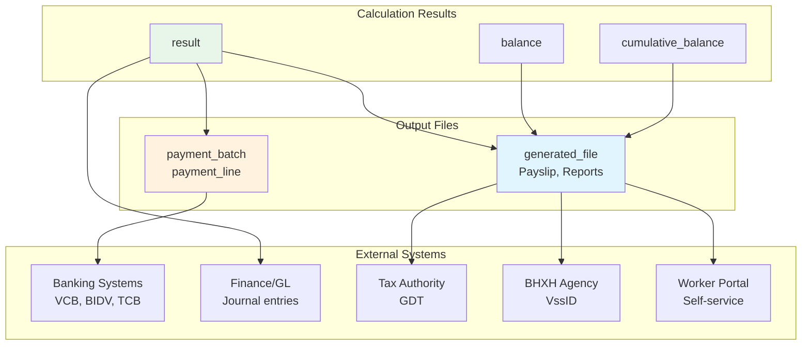

---

## 7. Exception Handling Flow

### 7.1 Negative Net Salary

```mermaid
flowchart TD
    START[Calculate Net] --> CHECK{Net < 0?}
    
    CHECK -->|No| DONE[Continue]
    CHECK -->|Yes| FLAG[Flag NEGATIVE_NET<br/>exception]
    
    FLAG --> HALT[Halt employee from<br/>payment file]
    
    HALT --> REVIEW[Payroll Admin reviews]
    
    REVIEW --> OPTIONS{Resolution?}
    
    OPTIONS -->|Waive deduction| WAIVE[Waive partial deduction<br/>Requires Finance approval]
    OPTIONS -->|Recover next period| RECOVER[Mark as recoverable<br/>Add to next period]
    OPTIONS -->|Structural (no work)| ZERO[Set net = 0<br/>No payment]
    
    WAIVE --> ADJUST[Adjust calculation]
    RECOVER --> SCHEDULE[Schedule recovery]
    ZERO --> FINALIZE[Finalize with net = 0]
    
    ADJUST --> ACK[Acknowledge exception]
    SCHEDULE --> ACK
    FINALIZE --> ACK
    
    ACK --> RESUME[Resume batch processing]
    
    style FLAG fill:#ffebee
    style HALT fill:#fff3e0
    style ACK fill:#e8f5e9
```

### 7.2 Missing Statutory Rule

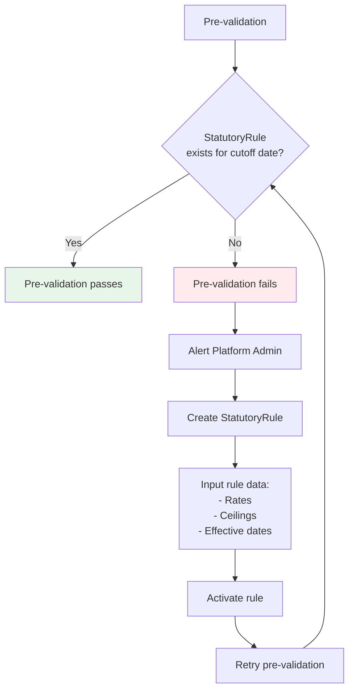

---

## 8. Audit Trail Flow

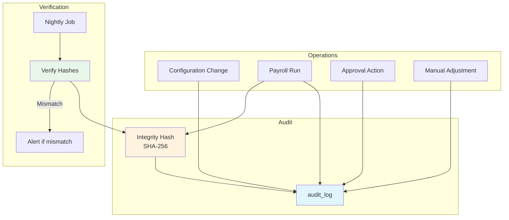

---

## 9. Key Data Entities Flow

### 9.1 Entity Lifecycle

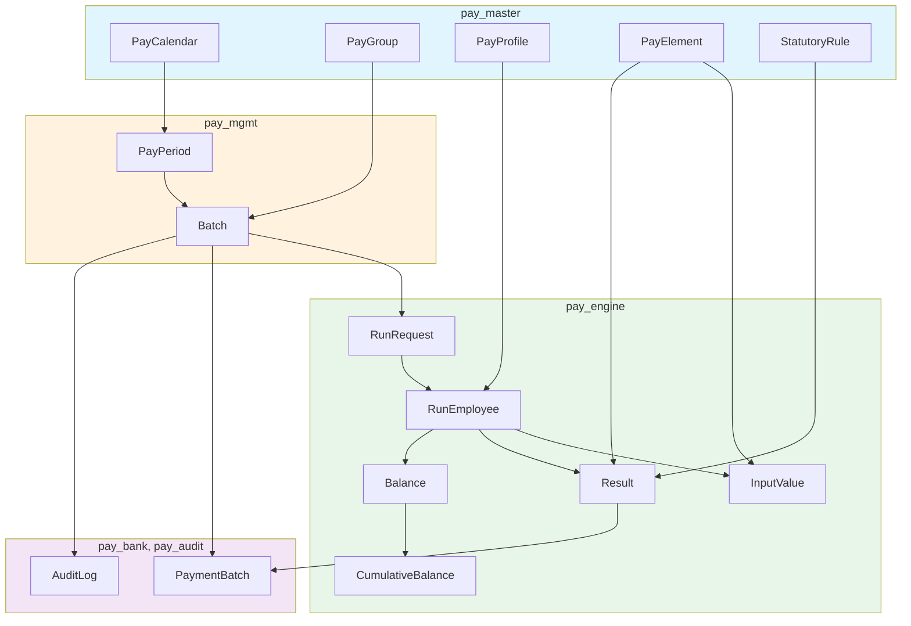

---

## 10. Summary

### Key Flow Patterns

| Flow | Trigger | Duration | Key Tables |
|------|---------|----------|------------|
| **Monthly Payroll** | Scheduler (cutoff) | ~2-4 hours | batch, run_employee, result, balance |
| **Retroactive Adjustment** | Payroll Admin | ~30 min | batch (RETRO), retro_delta, result |
| **Termination Pay** | HR termination action | ~15 min | batch (TERMINATION), result |
| **Import Data** | Payroll Admin upload | ~5-10 min | import_job, iface_*, input_value |
| **Generate Payment** | Batch approval | ~10 min | payment_batch, payment_line |

### Performance Targets

| Operation | Target | Optimization |
|-----------|--------|--------------|
| Calculate 10,000 employees | < 5 min | Parallel KieSessions |
| Import 50,000 lines | < 2 min | Batch insert |
| Generate payment file | < 30 sec | Streaming write |
| Query YTD balance | < 100 ms | cumulative_balance table |

---

*[Previous: Support Schemas](./05-support-schemas.md) · [Back to README](./00-README.md)*