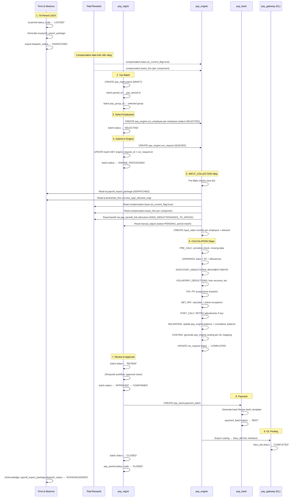

# Integration Blueprint — Payroll V4

**Purpose**: Tài liệu định nghĩa chính thức các data contract và data flow cross-module cho Payroll V4  
**Scope**: Core → Payroll, Time & Absence → Payroll, Total Rewards → Payroll  
**Status**: v1.0 — 14Apr2026  
**Related**: [06-data-flow-diagrams.md](./06-data-flow-diagrams.md) | [08-todo-cross-module-changes.md](./08-todo-cross-module-changes.md)

---

## 1. Overview

Payroll Engine nhận data từ 3 upstream modules. Mỗi luồng có một data contract rõ ràng, được enforce qua `pay_engine.input_source_config`.

```
Core HR (CO)          ──→  [pay_master.pay_calendar, pay_group, statutory_rule]
                           (configuration, không phải transaction data)

Time & Absence (TA)   ──→  [ta.payroll_export_package]
                           ──via──  [ta.time_type_element_map]
                           ──→  [pay_engine.input_value (TIME_ATTENDANCE)]

Total Rewards (TR)    ──→  [compensation.basis / basis_line]
                           ──via──  [pay_engine.input_source_config COMPENSATION]
                           ──→  [pay_engine.input_value (COMPENSATION)]

                      ──→  [benefit.benefit_plan × pay_master.pay_benefit_link]
                           ──→  [pay_engine.input_value (BENEFITS)]

Payroll Engine (PR)   ──→  [pay_engine.result, pay_engine.balance]
                           ──→  [pay_bank.payment_batch]
                           ──→  [pay_gateway (GL, Tax, BHXH)]
```

---

## 2. Pre-Conditions (Payroll Run Pre-flight Checks)

Trước khi engine bắt đầu **INPUT_COLLECTION**, các điều kiện sau **BẮT BUỘC** phải thỏa mãn:

| # | Check | Source | Failure Action |
|---|-------|--------|----------------|
| 1 | `ta.period.status_code = 'LOCKED'` | `pay_mgmt.pay_period.ta_period_id` | Block run: "TA period chưa LOCKED" |
| 2 | `ta.payroll_export_package.dispatch_status = 'DISPATCHED'` | `ta.payroll_export_package WHERE period_id = ta_period_id` | Block run: "TA export chưa dispatched" |
| 3 | `pay_master.statutory_rule` tồn tại cho period_end | `SELECT count(*) FROM statutory_rule WHERE effective_start ≤ period_end` | Block run: "Không tìm thấy statutory rule" |
| 4 | `compensation.basis IS NOT NULL` cho tất cả employees trong batch | Engine query per employee | Warning: "Thiếu compensation cho N employees" |
| 5 | `pay_mgmt.pay_period.status_code = 'OPEN'` | `pay_mgmt.pay_period.id = batch.period_id` | Block run: "Period không ở trạng thái OPEN" |

---

## 3. Flow 1: Regular Monthly Payroll Run

### 3.1 Sequence



### 3.2 Manual Adjustment Update (PENDING → APPLIED)

Sau khi engine chạy xong:
```sql
UPDATE pay_mgmt.manual_adjust
SET status_code = 'APPLIED', applied_in_run_id = :batch_id
WHERE status_code = 'PENDING'
  AND element_id IN (SELECT element_id FROM pay_engine.input_value WHERE emp_run_id IN (:run_employee_ids))
  AND (period_start, period_end) OVERLAPS (:period_start, :period_end);
```

---

## 4. Flow 2: TA → Payroll Data Contract

### 4.1 TA Export Package Contract

| Field | Type | Description | Payroll Usage |
|-------|------|-------------|---------------|
| `period_id` | uuid → `ta.period` | Kỳ TA | Match với `pay_mgmt.pay_period.ta_period_id` |
| `employee_id` | uuid → `employment.employee` | Nhân viên | Match với `pay_engine.run_employee.employee_id` |
| `total_regular_hours` | decimal | Giờ làm bình thường | `input_value(REGULAR_WORK, HOURS)` |
| `total_overtime_hours` | decimal | Tổng OT | Phân tách theo day_type (xem §4.2) |
| `total_leave_days` | decimal | Ngày nghỉ phép có phê duyệt | `input_value(UNPAID_LEAVE, LEAVE_DAYS)` |
| `total_comp_hours` | decimal | Giờ TOIL / comp time | `input_value(COMP_TIME, HOURS)` |
| `night_work_hours` | decimal | Giờ làm đêm (22:00-06:00) | `input_value(NIGHT_PREMIUM, HOURS)` |
| `dispatch_status` | varchar | PENDING → DISPATCHED | Engine chỉ đọc khi DISPATCHED |
| `checksum` | varchar | SHA-256 của data | Engine verify integrity |

### 4.2 OT Hours Breakdown via time_type_element_map

```
ta.timesheet_line (per employee × work_date)
  ↓ JOIN ta.generated_roster ON (employee_id, work_date) → day_type
  ↓ GROUP BY employee_id, day_type
  ↓ JOIN ta.time_type_element_map ON (time_type = 'OT', day_type)
  ↓
pay_engine.input_value:
  - (REGULAR_WORK,  HOURS, day_type=WORKDAY)   → element: REGULAR_HOURS
  - (OT_PAY,        HOURS, day_type=WORKDAY)   → element: OT_WEEKDAY  (rate 1.5x)
  - (OT_PAY,        HOURS, day_type=OFF)       → element: OT_WEEKEND  (rate 2.0x)
  - (OT_PAY,        HOURS, day_type=HOLIDAY)   → element: OT_HOLIDAY  (rate 3.0x)
  - (NIGHT_PREMIUM, HOURS, any)                → element: NIGHT_ALLOW (rate 1.3x)
```

### 4.3 TA Period Synchronization

```
ta.period.status_code lifecycle:
  OPEN → CLOSING → LOCKED → ARCHIVED

pay_mgmt.pay_period.status_code lifecycle:
  FUTURE → OPEN → PROCESSING → CLOSED → ADJUSTED

Dependency:
  ta.period MUST BE 'LOCKED' before pay_mgmt.pay_period can move to 'PROCESSING'
  (enforced by engine pre-flight check via pay_period.ta_period_id FK)
```

---

## 5. Flow 3: TR → Payroll Data Contract

### 5.1 Base Salary (COMPENSATION module)

```
compensation.basis (per employee, is_current_flag=true)
├── basis_amount: 15,000,000 VND
├── frequency_code: MONTHLY
└── effective_start_date: 2026-01-01

input_source_config (COMPENSATION, COMP_BASIS_CHANGE, target=BASIC_SALARY):
  mapping_json.value_field = "basis_amount"
  mapping_json.proration   = true

→ pay_engine.input_value:
  (emp_run_id, element=BASIC_SALARY, input_code=AMOUNT, input_value=15000000)
```

**Mid-period salary change (proration):**
```
Employee có 2 compensation.basis records trong tháng:
  Record A: basis_amount=14,000,000 | effective: 01/04 → 15/04
  Record B: basis_amount=16,000,000 | effective: 16/04 → ...

Engine tính:
  full_period_amount = 15,000,000 (new rate cho toàn kỳ — reference)
  Part A: 14,000,000 × (15/30) = 7,000,000
  Part B: 16,000,000 × (15/30) = 8,000,000
  result_amount      = 15,000,000
  proration_factor   = 1.0 (tổng hợp)
  → Result lưu 2 rows hoặc 1 row tổng hợp (per implementation decision)
```

### 5.2 Components / Allowances (via basis_line)

```
compensation.basis_line (per employee × component):
  - pay_component_def_id → MEAL_ALLOWANCE | amount: 500,000
  - pay_component_def_id → TRANSPORT      | amount: 300,000

input_source_config (COMPENSATION, COMP_BASIS_CHANGE, target=MEAL_ALLOWANCE_ELEMENT):
  mapping_json: { "source_table": "compensation.basis_line",
                  "filter": {"pay_component_def_id": "<MEAL_UUID>"},
                  "value_field": "amount" }

→ pay_engine.input_value:
  (emp_run_id, element=MEAL_ALLOWANCE, input_code=AMOUNT, input_value=500000)
```

> ⚠️ **GAP-PR-001**: Mapping `pay_component_def` → `pay_element` hiện dùng `mapping_json` config.
> Xem [08-todo-cross-module-changes.md § GAP-PR-001](./08-todo-cross-module-changes.md)

### 5.3 Benefits (via pay_benefit_link)

```
pay_master.pay_benefit_link:
  benefit_plan_id → BHYT_EXTRA | pay_element_id → BHYT_EXTRA_EE | direction: ADDS_DEDUCTION
  benefit_plan_id → MEAL_SUB   | pay_element_id → MEAL_SUBSIDY   | direction: ADDS_TO_GROSS

Engine filters: direction IN ('ADDS_TO_GROSS', 'ADDS_DEDUCTION')
→ pay_engine.input_value:
  (emp_run_id, element=BHYT_EXTRA_EE,  input_code=AMOUNT, source_type=BENEFITS)
  (emp_run_id, element=MEAL_SUBSIDY,   input_code=AMOUNT, source_type=BENEFITS)
```

---

## 6. Flow 4: Termination Final Pay

### 6.1 Termination Data Contract

```
HR marks termination:
  employment.employee.termination_date = 2026-03-15

TA calculates leave balance:
  absence.termination_balance_record:
    employment_id = ...
    unused_annual_days = 5.5
    payroll_deduction_amount = 5.5 × daily_rate

payroll_engine.input_source_config (ABSENCE, TERMINATION_LEAVE_BALANCE):
  mapping_json: {
    "source_table": "absence.termination_balance_record",
    "value_field": "payroll_deduction_amount",
    "input_code": "AMOUNT",
    "batch_type_filter": ["TERMINATION"]
  }
  target_element_id → LEAVE_PAYOUT

pay_master.termination_pay_config:
  termination_type: RESIGNATION | DISMISSAL | EXPIRY
  element_id: SEVERANCE | LEAVE_PAYOUT | 13TH_MONTH_PRO

→ pay_engine.result:
  PRORATED_SALARY (15/22 working days)
  LEAVE_PAYOUT    (5.5 days × daily_rate)
  13TH_PRORATE    (3/12 of annual bonus)
  [SEVERANCE]     (only if DISMISSAL/EXPIRY)
```

---

## 7. Outbound Data Contracts

### 7.1 GL Posting (via pay_gateway)

```
pay_engine.costing (per result):
  result_id → pay_engine.result
  account_code = "622001" (from pay_master.gl_mapping)
  dr_cr = 'D'
  amount = 15,000,000

→ pay_gateway.iface_def (GL_POSTING):
  iface_job.status: QUEUED → PROCESSING → COMPLETED
  Accounting system reads: journal_entry (D: 622001, C: 334, amount: 15M)
```

### 7.2 Bank Payment (via pay_bank)

```
pay_bank.payment_batch → pay_bank.payment_line (per employee):
  bank_account_id → pay_bank.bank_account
  amount = run_employee.net_amount

pay_bank.bank_template:
  code = "VCB" | format = "CSV" | columns_json defines column order

→ Generated file: pay_gateway.generated_file (type=PAYMENT)
→ Submitted to bank via banking API or SFTP
```

### 7.3 Payslip (via generated_file)

```
pay_engine.result (all elements for employee × run)
  + pay_engine.balance (period balances: BHXH YTD, PIT YTD)
  + pay_engine.cumulative_balance (YTD totals)

→ payslip_template.template_json (rendering config)
→ pay_gateway.generated_file (type=PAYSLIP, employee_id=X)
→ Worker Self-Service Portal reads from generated_file.file_path
```

---

## 8. Canonical Source Type Reference

| `source_type` value | Module | Source Table | input_code | Notes |
|-------------------|--------|-------------|----------|-------|
| `TIME_ATTENDANCE` | TA | `ta.timesheet_line` / `ta.payroll_export_package` | HOURS | Regular, OT, Night |
| `ABSENCE` | TA | `absence.leave_request` | LEAVE_DAYS | Approved leaves only |
| `ABSENCE` | TA | `absence.termination_balance_record` | AMOUNT | TERMINATION batch only |
| `COMPENSATION` | TR | `compensation.basis` | AMOUNT | Base salary |
| `COMPENSATION` | TR | `compensation.basis_line` | AMOUNT | Per component |
| `BENEFITS` | TR | `total_rewards.employee_reward_summary` | AMOUNT | Premium deductions |
| `MANUAL` | PR | `pay_mgmt.manual_adjust` | AMOUNT | HR overrides |
| `PRODUCTION` | External | ERP/MES system | PIECE_QTY | Piece-rate factories |

> ⚠️ **Phải dùng chính xác giá trị trong cột `source_type value`**  
> Không dùng: "TA", "TimeAttendance", "ta", "time_attendance"  
> Enforcement: app-layer service layer validation trước khi INSERT vào `pay_engine.input_value`

---

## 9. Error Handling & Recovery

| Error | Detection | Resolution |
|-------|-----------|------------|
| TA period not LOCKED | Pre-flight check | Notify TA admin to lock period |
| Missing compensation.basis | INPUT_COLLECTION | Engine warning; manual_adjust or skip employee |
| OT map not found in time_type_element_map | INPUT_COLLECTION | Engine ERROR; add mapping first |
| Negative net pay | NET_PAY step | validation_rule RESULT_CHECK triggers flag; admin resolves |
| Costing sum ≠ result_amount | COSTING step | Engine block; GL team must fix gl_mapping |
| Bank file generation fails | OUTPUT phase | Re-generate from generated_file config; no re-calculation needed |

---

## 10. Versioning & Change Management

| Document | Version | Changes |
|----------|---------|---------|
| Integration Blueprint v1.0 | 14Apr2026 | Initial creation |
| `5.Payroll.V4.dbml` | v4.3 | Changes 48-57 |
| `CHANGELOG.md` | — | [14Apr2026] entry |

**Cross-module changes pending (not in this document):**  
See [08-todo-cross-module-changes.md](./08-todo-cross-module-changes.md)

---

*[Previous: Data Flow Diagrams](./06-data-flow-diagrams.md) · [Next: Cross-Module TODO](./08-todo-cross-module-changes.md) · [Back to README](./00-README.md)*
