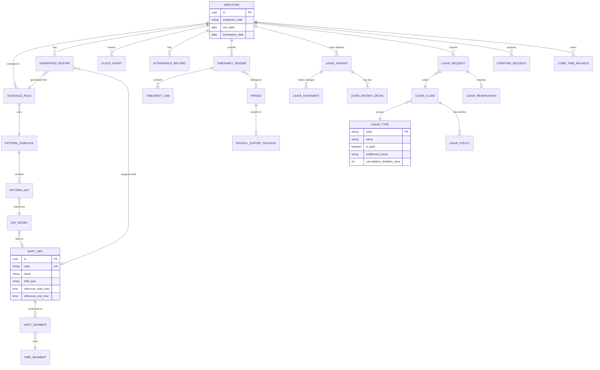

# Time & Absence Module - Database Design Overview

**Version:** 5.2  
**Last Updated:** 2026-04-01  
**Source:** TA-database-design-v5.dbml

---

## Executive Summary

Time & Absence (TA) module quản lý toàn bộ thời gian làm việc của nhân viên, bao gồm:
- **Scheduling**: Lên lịch làm việc với kiến trúc 6-Level Hierarchical độc đáo
- **Attendance**: Theo dõi chấm công, tính overtime, quản lý timesheet
- **Absence**: Quản lý nghỉ phép với immutable ledger và FEFO reservation
- **Shared Services**: Period management, holiday calendar, approval workflow

### Key Differentiators

1. **6-Level Hierarchical Scheduling** - Không phải flat schedule, mà build từ atomic blocks
2. **Immutable Ledger Pattern (ADR-TA-001)** - Mọi balance change đều append-only
3. **FEFO Reservation** - First-Expired-First-Out cho leave balance consumption
4. **Vietnam Labor Code Compliance** - Built-in compliance với VLC 2019

---

## Bounded Contexts

TA module được chia thành 4 bounded contexts:

```
┌─────────────────────────────────────────────────────────────┐
│                     Employee Central (External)             │
│                  Upstream - Employee Events                 │
└────────────────────┬────────────────────────────────────────┘
                     │ EmployeeHired/Terminated/Transferred
                     │
         ┌───────────▼──────────┐
         │   ta.shared          │
         │  Shared Services     │
         │  - Period            │
         │  - Holiday Calendar  │
         │  - Approval Workflow │
         └───┬───────────┬──────┘
             │           │
    ┌────────▼──┐   ┌───▼──────────┐
    │ta.scheduling│   │ta.attendance │
    │ Scheduling  │   │ Attendance   │
    │ - 6-Level   │   │ - Punch      │
    │   Hierarchy │   │ - Timesheet  │
    │ - Roster    │   │ - Overtime   │
    └──────┬──────┘   └───┬──────────┘
           │              │
           │    ┌─────────▼────────┐
           │    │  ta.absence      │
           │    │  Absence Mgmt    │
           │    │  - Leave Balance │
           │    │  - FEFO Ledger   │
           │    │  - Accrual       │
           │    └─────────┬────────┘
           │              │
           └──────┬───────┘
                  │
         ┌────────▼────────────┐
         │  Payroll Module     │
         │  (External)         │
         │  PayrollExport      │
         └─────────────────────┘
```

### Context Summary

| Context | Tables | Responsibility | Key Entities |
|---------|--------|----------------|--------------|
| **ta.scheduling** | 10 | Quản lý lịch làm việc theo 6-level hierarchy | TimeSegment, Shift, DayModel, Pattern, ScheduleRule, Roster |
| **ta.attendance** | 11 | Chấm công, timesheet, overtime, comp time | ClockEvent, AttendanceRecord, Timesheet, OvertimeRequest, CompTimeBalance |
| **ta.absence** | 15 | Quản lý nghỉ phép, balance tracking, accrual | LeaveType, LeaveClass, LeavePolicy, LeaveInstant, LeaveMovement, LeaveRequest |
| **ta.shared** | 4 | Shared services dùng chung | Period, HolidayCalendar, HolidayDate, TimeTypeElementMap |

---

## High-Level Entity Relationship



---

## Architecture Principles

### 1. Immutable Ledger (ADR-TA-001)

**Principle:** Mọi thay đổi balance đều được ghi nhận trong immutable ledger.

**Applies to:**
- `LeaveMovement` - Leave balance changes
- `ClockEvent` - Punch records (append-only)

**Benefits:**
- Full audit trail
- Balance computed from event stream
- No UPDATE/DELETE on ledger tables

### 2. Idempotent Operations

**Principle:** Batch operations phải idempotent - chạy lại không tạo duplicate.

**Applies to:**
- `LeaveAccrualRun` - One completed run per plan per period
- `PayrollExportPackage` - One export per period

### 3. FEFO Reservation

**Principle:** Leave balance consumed theo First-Expired-First-Out.

**Implementation:**
- `LeaveInstantDetail` tracks lots with expiry dates
- `LeaveReservationLine` links reservations to specific lots
- Ensures carried-over leave used before current-year leave

### 4. Vietnam Labor Code Compliance

Built-in enforcement:
- **Article 113**: Annual leave minimum 14 days (5→9 years: 15 days, etc.)
- **Article 107**: OT caps (daily 4h, monthly 40h, annual 200-300h)
- **Article 98**: OT rates (weekday 150%, weekend 200%, holiday 300%)
- **Article 109**: Minimum 8-hour rest between shifts

---

## Core Workflows

### Workflow 1: Schedule Generation

```
1. HR creates TIME_SEGMENTs (atomic units)
2. HR composes SHIFTs from segments
3. HR defines DAY_MODELs (Work/Off/Holiday)
4. HR creates PATTERN_TEMPLATEs (cycle of days)
5. HR assigns SCHEDULE_RULE (Pattern + Calendar + Rotation)
6. System generates GENERATED_ROSTER (1 row per employee per day)
```

### Workflow 2: Punch → Timesheet

```
1. Employee CLOCK_IN (via mobile/kiosk)
2. System validates geofence (if enabled)
3. Employee CLOCK_OUT
4. System creates ATTENDANCE_RECORD
5. System calculates worked hours + OT
6. System populates TIMESHEET_LINE
7. Employee reviews and submits TIMESHEET_HEADER
8. Manager approves
9. Period closes → PAYROLL_EXPORT
```

### Workflow 3: Leave Request

```
1. Employee submits LEAVE_REQUEST
2. System validates balance availability
3. System creates LEAVE_RESERVATION (FEFO)
4. System routes to approval workflow
5. Manager approves/rejects
6. On approval: Reservation → USE movement on leave start
7. On rejection: Reservation released
8. Balance updated via LEAVE_MOVEMENT
```

### Workflow 4: Overtime Request

```
1. Employee/Manager submits OVERTIME_REQUEST
2. System checks OT caps (daily/monthly/annual)
3. System applies skip-level routing if manager's own OT
4. Manager approves with cap visibility
5. System tracks in OvertimeBank
6. If comp time elected: Credit COMP_TIME_BALANCE
7. Comp time expiry tracked and enforced
```

---

## Data Volume Estimates

| Entity | Est. Records (1000 employees) | Growth Pattern |
|--------|-------------------------------|----------------|
| `GeneratedRoster` | ~365,000/year (1 emp × 365 days) | Linear with employees |
| `ClockEvent` | ~730,000/year (2 punches/day/emp) | Linear with employees |
| `TimesheetHeader` | ~12,000/year (1 month/emp) | Linear with employees |
| `LeaveRequest` | ~3,000-5,000/year (~3-5 requests/emp) | Moderate growth |
| `LeaveMovement` | ~15,000-20,000/year (3-4x requests) | Linear with transactions |
| `OvertimeRequest` | ~2,000-4,000/year | Variable by industry |

---

## Key Design Decisions

### Decision 1: 6-Level Hierarchical Scheduling

**Why:** Flat schedule model không scale với:
- 24/7 rotating shifts
- Offshore 14/14 patterns
- Multi-crew rotations

**Alternative Considered:** Direct assignment (traditional) - rejected due to maintenance burden

### Decision 2: Append-Only Ledger for Balances

**Why:** Compliance requirement - full audit trail of every balance change

**Alternative Considered:** Stored balance with delta records - rejected due to reconciliation complexity

### Decision 3: FEFO Reservation

**Why:** Prevent employees from losing carried-over leave to expiry

**Alternative Considered:** FIFO - rejected because doesn't optimize for expiry

### Decision 4: Temporal Workflow for Approvals

**Why:** Multi-level approval with escalation requires state management

**Alternative Considered:** Simple status field - rejected for complex scenarios

---

## Integration Points

### Upstream Dependencies

| System | Event | TA Action |
|--------|-------|-----------|
| Employee Central | `EmployeeHired` | Create leave instant, assign schedule |
| Employee Central | `EmployeeTerminated` | Create termination balance record |
| Employee Central | `EmployeeTransferred` | Re-evaluate policies |
| Biometric Provider | `BiometricAuthEvent` | Create punch with token only |

### Downstream Dependencies

| System | Event | TA Output |
|--------|-------|-----------|
| Payroll Module | `PeriodClosed` | `PayrollExportPackage` |
| Analytics Platform | All domain events | Event stream |

---

## Module Statistics

| Metric | Count |
|--------|-------|
| Total Tables | 40 |
| Enums | 19 |
| Bounded Contexts | 4 |
| Domain Events | 54 |
| Business Rules | 22+ |
| Vietnam Labor Code References | 7 articles |

---

## Document Navigation

| Document | Content |
|----------|---------|
| [00-overview.md](./00-overview.md) | This document - Architecture overview |
| [01-scheduling-model.md](./01-scheduling-model.md) | 6-Level Scheduling deep dive |
| [02-attendance-model.md](./02-attendance-model.md) | Attendance & Timesheet |
| [03-absence-model.md](./03-absence-model.md) | Leave Management |
| [04-shared-model.md](./04-shared-model.md) | Shared Services |
| [05-entity-reference.md](./05-entity-reference.md) | Technical Entity Reference with samples |
| [06-erd-diagrams.md](./06-erd-diagrams.md) | Complete ERD collection |
| [07-workflow-diagrams.md](./07-workflow-diagrams.md) | State machines & workflows |
| [08-data-examples.md](./08-data-examples.md) | Complete data scenarios |

---

## Next Steps

1. **Understand Scheduling**: Read [01-scheduling-model.md](./01-scheduling-model.md) for the 6-level architecture
2. **Understand Attendance**: Read [02-attendance-model.md](./02-attendance-model.md) for punch-to-payroll flow
3. **Understand Absence**: Read [03-absence-model.md](./03-absence-model.md) for leave management
4. **Reference Entities**: Use [05-entity-reference.md](./05-entity-reference.md) as technical dictionary
5. **View Examples**: Check [08-data-examples.md](./08-data-examples.md) for realistic scenarios

---

*Source: TA-database-design-v5.dbml (v5.2, 2026-04-01)*