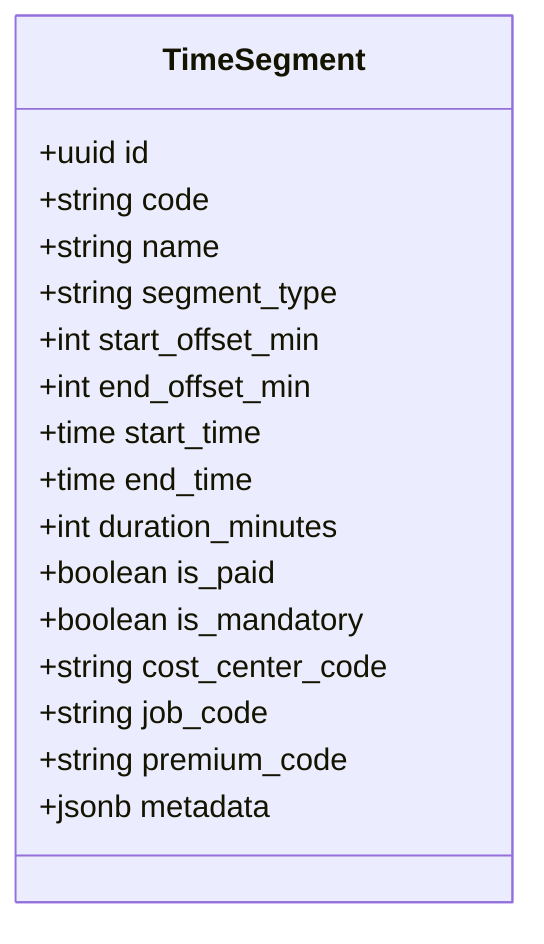
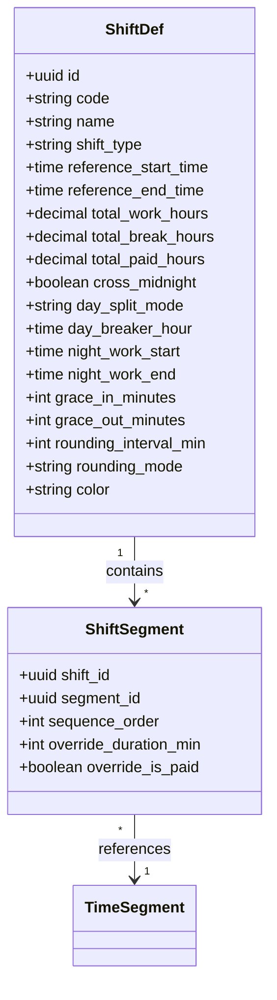
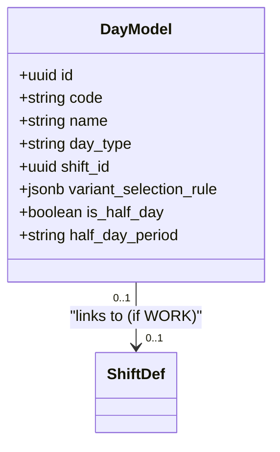
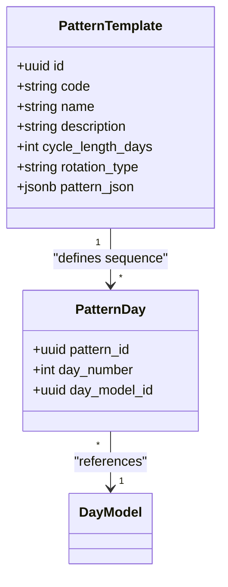
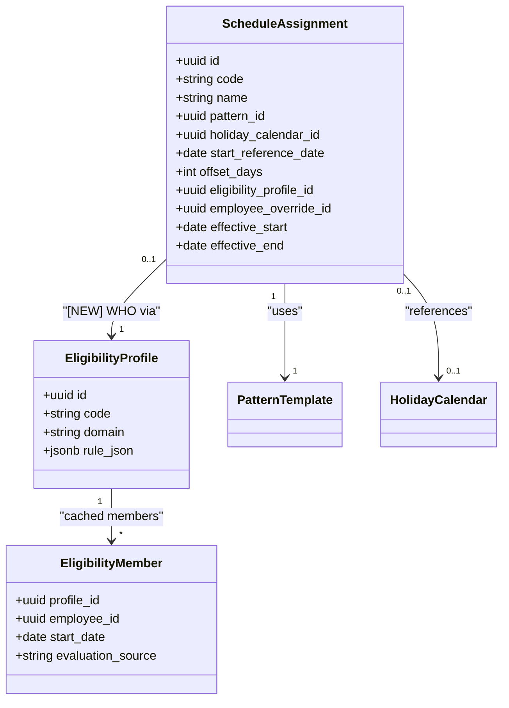
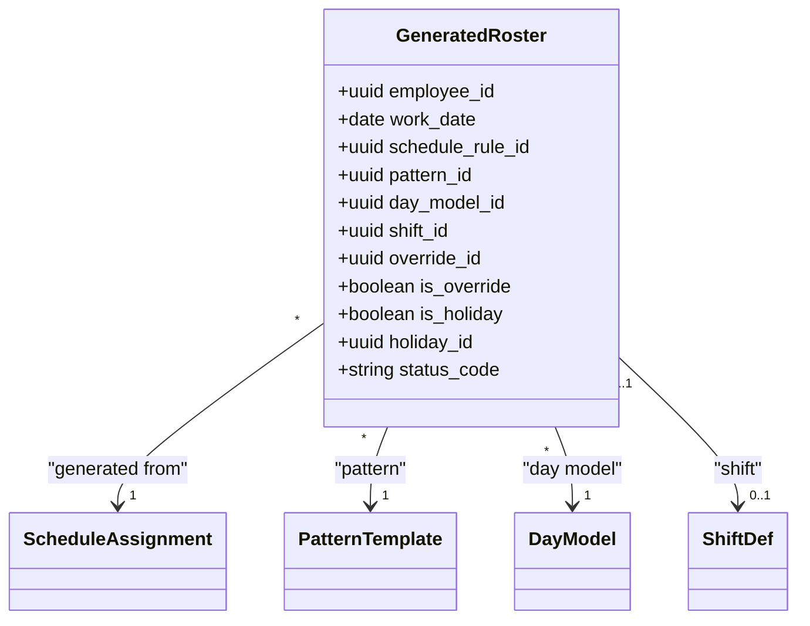

# Scheduling Model - 6-Level Hierarchical Architecture

**Bounded Context:** `ta.scheduling`  
**Tables:** 10  
**Last Updated:** 2026-04-01

---

## Overview

Scheduling model sử dụng **6-Level Hierarchical Architecture** - một differentiator quan trọng của xTalent TA module. Thay vì tạo lịch trực tiếp cho từng nhân viên (flat model), chúng ta build lịch từ các atomic blocks và compose lên dần.

### Why 6-Level Hierarchy?

| Problem with Flat Model | 6-Level Solution |
|------------------------|------------------|
| Tạo lịch thủ công từng tuần | Cấu hình 1 lần, auto-generate |
| Copy-paste khi thêm nhân viên | Assign vào rule, roster tự sinh |
| Thay đổi shift → update từng người | Thay đổi ShiftDefinition → tất cả update |
| Không handle rotating crews | Rotation offset native support |
| Không có audit trail | Full lineage từng roster entry |

---

## The 6 Levels

```
Level 1: TimeSegment      ← Atomic unit (WORK, BREAK, MEAL, TRANSFER, STANDBY, TRAINING)
    ↓ compose
Level 2: ShiftDefinition  ← Combination of segments = 1 shift
    ↓ link
Level 3: DayModel         ← What happens on 1 day (WORK / OFF / HOLIDAY)
    ↓ sequence
Level 4: PatternTemplate  ← Repeating cycle of days (5x8, 4on-4off, 14/14)
    ↓ configure
Level 5: ScheduleRule     ← Pattern + Calendar + Rotation → WHO gets WHICH
    ↓ generate
Level 6: GeneratedRoster  ← Materialized: 1 row per employee per day
```

---

## Level 1: Time Segment

### Business Purpose

**TimeSegment** là đơn vị atomic nhất của thời gian làm việc. Nó định nghĩa một khoảng thời gian cụ thể với attributes.

### Entity Structure



### Segment Types

| Type | Description | Paid Default | Count Attendance | Count OT Base | Use Case |
|------|-------------|:---:|:---:|:---:|----------|
| `WORK` | Productive work time | ✅ | ✅ | ✅ | Main work periods |
| `BREAK` | Short rest period (< 30 min) | ❌ | ❌ | ❌ | Coffee breaks, rest periods |
| `MEAL` | Meal break (≥ 30 min) | ❌ | ❌ | ❌ | Lunch, dinner breaks |
| `TRANSFER` | Paid travel between work sites | ✅ | ✅ | ✅ | Field work, multi-site |
| `STANDBY` | On-call / standby duty; rate via `premium_code` | ✅* | ⚠️ Policy | ❌ | Manufacturing watch, healthcare on-call |
| `TRAINING` | Training, education, onboarding; costing to L&D | ✅ | ✅ | ❌ | Safety training, orientation |

> **STANDBY**: Paid but at reduced/flat rate defined by `premium_code` (e.g., `STANDBY_RATE`). Exempt from geofence validation. If employee is called to active duty during standby, the active time is logged as a WORK segment with applicable OT rate.
>
> **TRAINING**: Excluded from OT base. `cost_center_code` should reference the Training/L&D cost center, not the Production cost center.

**Modeling patterns for other use cases (no additional type needed):**

| Use Case | Pattern |
|----------|---------|
| Shift handover | `WORK` + `premium_code = "HANDOVER"` |
| Prep / Setup time | `WORK` + `premium_code = "PREP"` |
| Unpaid travel (home → site) | `TRANSFER` + `is_paid = false` |
| Medical check during shift | `WORK` + `premium_code = "HEALTH_CHECK"` |

### Timing Definition

TimeSegment có thể được định nghĩa theo 2 cách:

**1. Relative (Offset from shift start):**
```json
{
  "segment_type": "WORK",
  "start_offset_min": 0,
  "end_offset_min": 240,
  "duration_minutes": 240,
  "is_paid": true
}
```
→ 4 giờ làm việc đầu tiên của ca

**2. Absolute (Fixed time):**
```json
{
  "segment_type": "MEAL",
  "start_time": "12:00:00",
  "end_time": "13:00:00",
  "duration_minutes": 60,
  "is_paid": false
}
```
→ Nghỉ trưa cố định 12:00-13:00

### Sample Data

```json
{
  "id": "550e8400-e29b-41d4-a716-446655440001",
  "code": "WORK_MORNING",
  "name": "Work Morning Session",
  "segment_type": "WORK",
  "start_offset_min": 0,
  "end_offset_min": 240,
  "duration_minutes": 240,
  "is_paid": true,
  "is_mandatory": true,
  "premium_code": null,
  "metadata": {}
}
```

```json
{
  "id": "550e8400-e29b-41d4-a716-446655440002",
  "code": "LUNCH_BREAK",
  "name": "Lunch Break",
  "segment_type": "MEAL",
  "start_offset_min": 240,
  "end_offset_min": 300,
  "duration_minutes": 60,
  "is_paid": false,
  "is_mandatory": true,
  "metadata": {}
}
```

```json
{
  "id": "550e8400-e29b-41d4-a716-446655440003",
  "code": "NIGHT_PREMIUM",
  "name": "Night Shift Premium",
  "segment_type": "WORK",
  "start_offset_min": 0,
  "end_offset_min": 480,
  "duration_minutes": 480,
  "is_paid": true,
  "is_mandatory": true,
  "premium_code": "NIGHT_DIFF",
  "metadata": {}
}
```

```json
{
  "id": "550e8400-e29b-41d4-a716-446655440004",
  "code": "ONCALL_NIGHT",
  "name": "On-Call Night Standby",
  "segment_type": "STANDBY",
  "start_time": "22:00:00",
  "end_time": "06:00:00",
  "duration_minutes": 480,
  "is_paid": true,
  "is_mandatory": true,
  "premium_code": "STANDBY_RATE",
  "counts_toward_ot": false,
  "geofence_exempt": true,
  "metadata": {}
}
```

```json
{
  "id": "550e8400-e29b-41d4-a716-446655440005",
  "code": "ORIENTATION",
  "name": "New Employee Orientation",
  "segment_type": "TRAINING",
  "start_offset_min": 0,
  "end_offset_min": 480,
  "duration_minutes": 480,
  "is_paid": true,
  "is_mandatory": true,
  "premium_code": null,
  "counts_toward_ot": false,
  "cost_center_code": "CC-LND-001",
  "metadata": {}
}
```

---

## Level 2: Shift Definition

### Business Purpose

**ShiftDefinition** là composition của nhiều TimeSegments tạo thành một ca làm việc hoàn chỉnh.

### Entity Structure



### Shift Types

| Type | Description | Grace Periods? | Use Case |
|------|-------------|:--------------:|----------|
| `ELAPSED` | Fixed schedule | ❌ | Office, manufacturing |
| `PUNCH` | Flexible, based on actual clock times | ✅ | Retail, warehouse |
| `FLEX` | Core hours + flexible start/end | ✅ | Tech companies, creative |

### Shift Attributes

**For ELAPSED shifts:**
- `reference_start_time`, `reference_end_time` — Fixed schedule boundaries
- `cross_midnight` — Flags shift as spanning two calendar dates (e.g., 22:00 → 06:00)

**Day Breaker / Shift Boundary (v5.8 — Change 34):**
`cross_midnight=true` alone is insufficient. Use `day_split_mode` to control hour attribution:

| day_split_mode | Behavior | Khi dùng |
|---------------|---------|----------|
| `ANCHOR_START` *(default)* | All hours → shift start date | Ca đêm flat-rate (bảo vệ, kho) |
| `ANCHOR_END` | All hours → shift end date | Ca y tế (trực về sáng, tính ngày hôm sau) |
| `SPLIT_MIDNIGHT` | Split at 00:00, each portion to its date | Nhà máy cần đúng OT rate ngày lễ |
| `SPLIT_AT_HOUR` | Split at `day_breaker_hour` | Site dùng 04:00 làm ranh giới ngày |

`night_work_start` / `night_work_end`: Xác định khung giờ đêm để tính phụ cấp ca đêm. Default 22:00–06:00 (VLC 2019 Điều 105 — phụ cấp tối thiểu 30%).

**For PUNCH shifts:**
- `grace_in_minutes` — Tolerance for late arrival
- `grace_out_minutes` — Tolerance for early departure
- `rounding_interval_min` — Time rounding (default: 15 min)
- `rounding_mode` — NEAREST, UP, DOWN

### Sample Data

**ELAPSED Shift (Office Day Shift):**
```json
{
  "id": "550e8400-e29b-41d4-a716-446655440010",
  "code": "DAY_SHIFT_8H",
  "name": "Day Shift 8 Hours",
  "shift_type": "ELAPSED",
  "reference_start_time": "08:00:00",
  "reference_end_time": "17:00:00",
  "total_work_hours": 8.00,
  "total_break_hours": 1.00,
  "total_paid_hours": 8.00,
  "cross_midnight": false,
  "color": "#4A90E2"
}
```

**PUNCH Shift (Retail Flexible):**
```json
{
  "id": "550e8400-e29b-41d4-a716-446655440011",
  "code": "RETAIL_FLEX",
  "name": "Retail Flexible Shift",
  "shift_type": "PUNCH",
  "total_work_hours": 8.00,
  "grace_in_minutes": 10,
  "grace_out_minutes": 10,
  "rounding_interval_min": 15,
  "rounding_mode": "NEAREST",
  "color": "#7ED321"
}
```

**Overnight Shift (with Day Breaker config):**
```json
{
  "id": "550e8400-e29b-41d4-a716-446655440012",
  "code": "NIGHT_SHIFT",
  "name": "Night Shift",
  "shift_type": "ELAPSED",
  "reference_start_time": "22:00:00",
  "reference_end_time": "06:00:00",
  "total_work_hours": 8.00,
  "cross_midnight": true,
  "day_split_mode": "SPLIT_MIDNIGHT",
  "day_breaker_hour": null,
  "night_work_start": "22:00:00",
  "night_work_end": "06:00:00",
  "color": "#9013FE"
}
```

*Comment: `day_split_mode=SPLIT_MIDNIGHT` → 2h (22:00–00:00) tính cho ngày bắt đầu, 6h (00:00–06:00) tính cho ngày tiếp theo. Payroll engine dùng `night_work_start/end` để tách và tính phụ cấp 30%.*

**On-Call Medical Shift (cross-midnight, ANCHOR_END):**
```json
{
  "id": "550e8400-e29b-41d4-a716-446655440013",
  "code": "ONCALL_MEDICAL",
  "name": "On-Call Medical Shift",
  "shift_type": "ELAPSED",
  "reference_start_time": "19:00:00",
  "reference_end_time": "07:00:00",
  "total_work_hours": 12.00,
  "cross_midnight": true,
  "day_split_mode": "ANCHOR_END",
  "night_work_start": "22:00:00",
  "night_work_end": "06:00:00",
  "color": "#E74C3C"
}
```

*Comment: Ca trực bắt đầu 19:00 ngày 07, kết thúc 07:00 ngày 08. `ANCHOR_END` → toàn bộ 12h tính cho ngày 08 (ngày bác sĩ "về"). `night_work_start/end` tách 8h từ 22:00–06:00 để tính phụ cấp đêm.*

### Shift Breaks (ta.shift_break)

Shift breaks được tách riêng để dễ quản lý:

```json
{
  "id": "550e8400-e29b-41d4-a716-446655440020",
  "shift_def_id": "550e8400-e29b-41d4-a716-446655440010",
  "name": "Lunch Break",
  "start_offset_hours": 4.0,
  "duration_hours": 1.0,
  "is_paid": false,
  "is_mandatory": true
}
```

---

## Level 3: Day Model

### Business Purpose

**DayModel** định nghĩa điều gì xảy ra trong một ngày - là ngày làm việc, ngày nghỉ, hay ngày lễ.

### Entity Structure



### Day Types

| Type | Shift? | Description |
|------|:------:|-------------|
| `WORK` | ✅ | Regular work day |
| `OFF` | ❌ | Rest day (weekend) |
| `HOLIDAY` | ❌ | Public/company holiday |
| `HALF_DAY` | ✅ | Half-day work |

### Sample Data

```json
{
  "id": "550e8400-e29b-41d4-a716-446655440030",
  "code": "WORK_DAY",
  "name": "Standard Work Day",
  "day_type": "WORK",
  "shift_id": "550e8400-e29b-41d4-a716-446655440010",
  "is_half_day": false
}
```

```json
{
  "id": "550e8400-e29b-41d4-a716-446655440031",
  "code": "OFF_DAY",
  "name": "Rest Day",
  "day_type": "OFF",
  "shift_id": null,
  "is_half_day": false
}
```

```json
{
  "id": "550e8400-e29b-41d4-a716-446655440032",
  "code": "HOLIDAY_DAY",
  "name": "Public Holiday",
  "day_type": "HOLIDAY",
  "shift_id": null,
  "variant_selection_rule": {
    "holiday_class_handling": "OVERRIDE_TO_OFF"
  }
}
```

```json
{
  "id": "550e8400-e29b-41d4-a716-446655440033",
  "code": "HALF_DAY_AM",
  "name": "Half Day Morning",
  "day_type": "HALF_DAY",
  "shift_id": "550e8400-e29b-41d4-a716-446655440010",
  "is_half_day": true,
  "half_day_period": "MORNING"
}
```

---

## Level 4: Pattern Template

### Business Purpose

**PatternTemplate** định nghĩa một chu kỳ lặp lại của các DayModels.

### Entity Structure



### Rotation Types

| Type | Description |
|------|-------------|
| `FIXED` | Same pattern for everyone |
| `ROTATING` | Pattern rotates with offset for different crews |

### Common Patterns

| Pattern | Cycle | Structure | Industry |
|---------|:-----:|-----------|----------|
| **5x8** | 7 days | Work×5 + Off×2 | Office |
| **4on-4off** | 8 days | Work×4 + Off×4 | Security, hospitals |
| **2-2-3** | 7 days | Work×2 + Off×2 + Work×3 | Retail, call center |
| **3-shift rotation** | 21 days | Day×7 + Off×7 + Evening×7 | Manufacturing 24/7 |
| **14/14 offshore** | 28 days | Work×14 + Off×14 | Oil & gas |

### Sample Data

**5x8 Standard Pattern:**
```json
{
  "id": "550e8400-e29b-41d4-a716-446655440040",
  "code": "5X8_STANDARD",
  "name": "5x8 Standard Week",
  "description": "Standard 5-day work week with weekend off",
  "cycle_length_days": 7,
  "rotation_type": "FIXED",
  "pattern_json": {
    "days": [
      {"day_number": 1, "day_model_id": "550e8400-e29b-41d4-a716-446655440030"},
      {"day_number": 2, "day_model_id": "550e8400-e29b-41d4-a716-446655440030"},
      {"day_number": 3, "day_model_id": "550e8400-e29b-41d4-a716-446655440030"},
      {"day_number": 4, "day_model_id": "550e8400-e29b-41d4-a716-446655440030"},
      {"day_number": 5, "day_model_id": "550e8400-e29b-41d4-a716-446655440030"},
      {"day_number": 6, "day_model_id": "550e8400-e29b-41d4-a716-446655440031"},
      {"day_number": 7, "day_model_id": "550e8400-e29b-41d4-a716-446655440031"}
    ]
  }
}
```

**24/7 3-Shift Rotation:**
```json
{
  "id": "550e8400-e29b-41d4-a716-446655440041",
  "code": "3SHIFT_ROTATION",
  "name": "24/7 Three-Shift Rotation",
  "description": "21-day cycle: 7 days Day Shift, 7 days Off, 7 days Evening Shift",
  "cycle_length_days": 21,
  "rotation_type": "ROTATING",
  "pattern_json": {
    "days": [
      // Days 1-7: Day Shift
      {"day_number": 1, "day_model_id": "DAY_SHIFT_MODEL"},
      // ... (days 2-7 same)
      // Days 8-14: Off
      {"day_number": 8, "day_model_id": "OFF_DAY_MODEL"},
      // ... (days 9-14 same)
      // Days 15-21: Evening Shift
      {"day_number": 15, "day_model_id": "EVENING_SHIFT_MODEL"}
      // ... (days 16-21 same)
    ]
  }
}
```

---

## Level 5: Schedule Assignment (Work Schedule Rule) — Hybrid Eligibility Architecture

### Business Purpose

**ScheduleAssignment** kết nối Pattern với Calendar và Rotation Offset, xác định **WHO gets WHICH pattern**.

**[Change 30 – 03Apr2026]** Level 5 đã được refactor sang **Hybrid Eligibility Architecture**: thay vì gán thủ công `employee_id / employee_group_id / position_id`, hệ thống nay dùng `eligibility_profile_id` từ **Core Eligibility Engine** để tự động xác định WHO.

```
BEFORE (Manual Assignment):
  schedule_assignment.employee_id = "EMP001"          ← Phải tạo 1 record/người
  schedule_assignment.employee_group_id = "TEAM_A"    ← Phải update khi đổi team
  schedule_assignment.position_id = "POS_GUARD"       ← Không tự động

AFTER (Hybrid Eligibility):
  schedule_assignment.eligibility_profile_id →
    eligibility_profile.rule_json = {"departments":["PRODUCTION"],"employee_types":["FULLTIME"]}
    eligibility_member: auto-cached, auto-updated khi employee data thay đổi
```

### Entity Structure



### Key Concepts

**1. WHO — via Eligibility Engine (Change 30)**

Thay vì assign thủ công, hệ thống đọc `eligibility_member` để lấy danh sách nhân viên thuộc profile:

```json
// eligibility_profile (domain = 'SCHEDULING')
{
  "code": "ELIG_PROD_SCHEDULE_5X8",
  "rule_json": {
    "departments": ["PRODUCTION", "ASSEMBLY"],
    "employee_types": ["FULLTIME"],
    "countries": ["VN"]
  }
}
// → eligibility_member auto-caches WHO is eligible
// → Khi EMP001 transfer từ PRODUCTION → SALES → tự out; ngược lại auto-in
```

**2. Start Reference Date (Rotation Anchor)**

- Điểm mốc để tính ngày trong cycle
- Example: 2025-01-01 (Monday) = Day 0 of pattern

**3. Offset Days (Rotation Offset)**

- Dịch chuyển pattern cho từng crew
- Critical cho rotating shifts: cùng 1 pattern, offset khác nhau → crew làm ca khác nhau

**4. employee_override_id — Edge-case override**

Dành cho trường hợp đặc biệt cần gán lịch toàn phần cho 1 người (CEO, expat, nhân viên đặc biệt):
- Không dùng eligibility rule
- Tồn tại song song với eligibility-based assignments

### Rotation Offset Example

```
Pattern: 21-day cycle [Day×7 · Off×7 · Evening×7]

eligibility_profile: ELIG_CREW_A → offset=0  → Week 1: Day Shift
eligibility_profile: ELIG_CREW_B → offset=7  → Week 1: Off
eligibility_profile: ELIG_CREW_C → offset=14 → Week 1: Evening Shift

Week 2: Crew A=Off, Crew B=Evening, Crew C=Day (automatic rotation)
Week 3: Crew A=Evening, Crew B=Day, Crew C=Off (automatic)
```

### Sample Data

**Schedule for Production Team (via Eligibility):**
```json
{
  "id": "550e8400-e29b-41d4-a716-446655440050",
  "code": "PROD_5X8_VN",
  "name": "Production Vietnam — 5×8 Standard",
  "pattern_id": "550e8400-e29b-41d4-a716-446655440040",
  "holiday_calendar_id": "VN_CALENDAR_2026",
  "start_reference_date": "2025-01-01",
  "offset_days": 0,
  "eligibility_profile_id": "ELIG_PROD_SCHEDULE_5X8",
  "employee_override_id": null,
  "effective_start": "2025-01-01"
}
```

**24/7 Rotating Schedule — Crew A (via Eligibility):**
```json
{
  "id": "550e8400-e29b-41d4-a716-446655440051",
  "code": "24_7_CREW_A",
  "name": "24/7 Rotation — Crew A (Offset 0)",
  "pattern_id": "550e8400-e29b-41d4-a716-446655440041",
  "holiday_calendar_id": "VN_CALENDAR_2026",
  "start_reference_date": "2025-01-01",
  "offset_days": 0,
  "eligibility_profile_id": "ELIG_SHIFT_CREW_A",
  "employee_override_id": null,
  "effective_start": "2025-01-01"
}
```

**Crew B (Offset +7):**
```json
{
  "id": "550e8400-e29b-41d4-a716-446655440052",
  "code": "24_7_CREW_B",
  "name": "24/7 Rotation — Crew B (Offset +7)",
  "pattern_id": "550e8400-e29b-41d4-a716-446655440041",
  "holiday_calendar_id": "VN_CALENDAR_2026",
  "start_reference_date": "2025-01-01",
  "offset_days": 7,
  "eligibility_profile_id": "ELIG_SHIFT_CREW_B",
  "employee_override_id": null,
  "effective_start": "2025-01-01"
}
```

**CEO — Individual Override (edge case):**
```json
{
  "id": "550e8400-e29b-41d4-a716-446655440053",
  "code": "CEO_SPECIAL",
  "name": "CEO — Special Schedule",
  "pattern_id": "550e8400-e29b-41d4-a716-446655440040",
  "holiday_calendar_id": "VN_CALENDAR_2026",
  "start_reference_date": "2025-01-01",
  "offset_days": 0,
  "eligibility_profile_id": null,
  "employee_override_id": "EMP_CEO_001",
  "effective_start": "2025-01-01"
}
```

### Benefits của Hybrid Architecture

| Lợi ích | Mô tả |
|---------|-------|
| **Auto-assign** | Transfer team → eligibility membership tự update → schedule mới auto-apply |
| **Không cần manual record/người** | 1 schedule_assignment phục vụ toàn bộ Production team |
| **Cross-module nhất quán** | Cùng `eligibility_profile_id` pattern với Absence, TR Benefits, Payroll |
| **Audit trail** | `eligibility_evaluation` log lý do tại sao employee được/mất schedule |
| **Override preserved** | `employee_override_id` cho edge cases không phá vỡ model chung |

---

## Level 6: Generated Roster

### Business Purpose

**GeneratedRoster** là kết quả cuối cùng - **1 row cho mỗi employee × mỗi day**.

### Entity Structure



### Roster Status

| Status | Description |
|--------|-------------|
| `SCHEDULED` | Generated from pattern |
| `CONFIRMED` | Manager confirmed |
| `COMPLETED` | Work completed |
| `CANCELLED` | Cancelled |

### Full Lineage Tracking

Mỗi roster entry biết:
- `schedule_rule_id` - Rule nào sinh ra nó
- `pattern_id` - Pattern nào được dùng
- `day_model_id` - Day model nào apply
- `shift_id` - Shift nào được assign

### Sample Data

```json
{
  "employee_id": "EMP001",
  "work_date": "2026-04-07",
  "schedule_rule_id": "550e8400-e29b-41d4-a716-446655440050",
  "pattern_id": "550e8400-e29b-41d4-a716-446655440040",
  "day_model_id": "550e8400-e29b-41d4-a716-446655440030",
  "shift_id": "550e8400-e29b-41d4-a716-446655440010",
  "is_override": false,
  "is_holiday": false,
  "status_code": "SCHEDULED"
}
```

**Roster for Holiday:**
```json
{
  "employee_id": "EMP001",
  "work_date": "2026-04-30",
  "schedule_rule_id": "550e8400-e29b-41d4-a716-446655440050",
  "pattern_id": "550e8400-e29b-41d4-a716-446655440040",
  "day_model_id": "550e8400-e29b-41d4-a716-446655440031",
  "shift_id": null,
  "is_override": false,
  "is_holiday": true,
  "holiday_id": "HOLIDAY_LIBERATION_DAY",
  "status_code": "SCHEDULED"
}
```

---

## Supporting Tables

### Schedule Override (ta.schedule_override)

Ad-hoc changes to generated roster:

```json
{
  "id": "550e8400-e29b-41d4-a716-446655440060",
  "employee_id": "EMP001",
  "work_date": "2026-04-11",
  "shift_id": "550e8400-e29b-41d4-a716-446655440010",
  "reason_code": "EXTRA_WORK_SATURDAY",
  "notes": "Urgent project deadline",
  "created_by": "MGR001"
}
```

### Open Shift Pool (ta.open_shift_pool)

Unfilled shifts available for bidding:

```json
{
  "id": "550e8400-e29b-41d4-a716-446655440070",
  "work_date": "2026-04-12",
  "shift_id": "550e8400-e29b-41d4-a716-446655440010",
  "qty_needed": 2,
  "qty_claimed": 1,
  "status_code": "PARTIAL"
}
```

---

## Roster Generation Algorithm

```
For each employee:
  Find applicable ScheduleAssignment (by assignment + effective date)
  For each date in range:
    cycleDay = (date - startReferenceDate + offsetDays) % cycleLengthDays
    dayModel = Pattern.days[cycleDay]
    shift = dayModel.shiftDefinition
    
    if date in holidayCalendar → override to HOLIDAY
    if manualOverride exists     → apply override
    else                         → use generated shift
    
    Create GeneratedRoster entry (1 per employee per day)
```

---

## Real-World Example: 24/7 Manufacturing

### Setup (One-time Configuration)

**Step 1: Create Time Segments**
```sql
-- Work 8h segment
INSERT INTO ta.time_segment (code, name, segment_type, duration_minutes, is_paid, counts_toward_ot)
VALUES ('WORK_8H', 'Work 8 Hours', 'WORK', 480, true, true);

-- Short break 30min
INSERT INTO ta.time_segment (code, name, segment_type, duration_minutes, is_paid, counts_toward_ot)
VALUES ('BREAK_30M', 'Short Break', 'BREAK', 30, false, false);

-- On-call standby 8h (e.g., night watch)
INSERT INTO ta.time_segment (code, name, segment_type, duration_minutes, is_paid, counts_toward_ot, geofence_exempt, premium_code)
VALUES ('ONCALL_8H', 'On-Call Standby 8h', 'STANDBY', 480, true, false, true, 'STANDBY_RATE');

-- Safety training 4h
INSERT INTO ta.time_segment (code, name, segment_type, duration_minutes, is_paid, counts_toward_ot, cost_center_code)
VALUES ('SAFETY_TRAINING_4H', 'Safety Training 4h', 'TRAINING', 240, true, false, 'CC-LND-001');
```

**Step 2: Create Shifts**
```sql
-- Day Shift: 08:00-16:00
INSERT INTO ta.shift_def (code, name, shift_type, reference_start_time, reference_end_time)
VALUES ('DAY_SHIFT', 'Day Shift', 'ELAPSED', '08:00:00', '16:00:00');

-- Evening Shift: 16:00-00:00
INSERT INTO ta.shift_def (code, name, shift_type, reference_start_time, reference_end_time, cross_midnight)
VALUES ('EVENING_SHIFT', 'Evening Shift', 'ELAPSED', '16:00:00', '00:00:00', true);

-- Night Shift: 00:00-08:00
INSERT INTO ta.shift_def (code, name, shift_type, reference_start_time, reference_end_time, cross_midnight)
VALUES ('NIGHT_SHIFT', 'Night Shift', 'ELAPSED', '00:00:00', '08:00:00', true);
```

**Step 3: Create Day Models**
```sql
INSERT INTO ta.day_model (code, name, day_type, shift_id) VALUES
('DAY_SHIFT_DAY', 'Day Shift Day', 'WORK', 'DAY_SHIFT_ID'),
('EVENING_SHIFT_DAY', 'Evening Shift Day', 'WORK', 'EVENING_SHIFT_ID'),
('OFF_DAY', 'Off Day', 'OFF', null);
```

**Step 4: Create Pattern (21-day cycle)**
```sql
INSERT INTO ta.pattern_template (code, name, cycle_length_days, rotation_type)
VALUES ('3SHIFT_21DAY', '3-Shift 21-Day Rotation', 21, 'ROTATING');

-- Days 1-7: Day Shift
-- Days 8-14: Off
-- Days 15-21: Evening Shift
-- (Pattern will rotate: Night shift comes when offset=14)
```

**Step 5: Assign to Crews**
```sql
-- Crew A: offset=0
-- NOTE: employee_group_id is DEPRECATED (Change 30). Use eligibility_profile_id instead.
INSERT INTO ta.schedule_assignment (code, pattern_id, offset_days, eligibility_profile_id)
VALUES ('CREW_A_RULE', '3SHIFT_21DAY_ID', 0, 'ELIG_SHIFT_CREW_A');

-- Crew B: offset=7
INSERT INTO ta.schedule_assignment (code, pattern_id, offset_days, eligibility_profile_id)
VALUES ('CREW_B_RULE', '3SHIFT_21DAY_ID', 7, 'ELIG_SHIFT_CREW_B');

-- Crew C: offset=14
INSERT INTO ta.schedule_assignment (code, pattern_id, offset_days, eligibility_profile_id)
VALUES ('CREW_C_RULE', '3SHIFT_21DAY_ID', 14, 'ELIG_SHIFT_CREW_C');
```

**Step 6: Generate Roster**
```
System automatically generates roster for all 3 crews:
- Week 1: Crew A=Day, Crew B=Off, Crew C=Evening
- Week 2: Crew A=Off, Crew B=Evening, Crew C=Day
- Week 3: Crew A=Evening, Crew B=Day, Crew C=Off
- Week 4: Return to Week 1 (21-day cycle)
```

---

## Summary

| Level | Entity | Purpose | Tables |
|-------|--------|---------|--------|
| 1 | TimeSegment | Atomic time unit | `ta.time_segment` |
| 2 | ShiftDefinition | Composition of segments | `ta.shift_def`, `ta.shift_segment`, `ta.shift_break` |
| 3 | DayModel | Daily schedule template | `ta.day_model` |
| 4 | PatternTemplate | Repeating cycle | `ta.pattern_template`, `ta.pattern_day` |
| 5 | ScheduleAssignment | Pattern + Calendar + Rotation | `ta.schedule_assignment` |
| 6 | GeneratedRoster | Materialized schedule | `ta.generated_roster`, `ta.schedule_override`, `ta.open_shift_pool` |

**Benefits:**
- ✅ Configure once, generate forever
- ✅ Easy to add new employees (just assign to rule)
- ✅ Change shift definition → all rosters update
- ✅ Native rotating shift support
- ✅ Full audit trail and lineage

---

*Next: [02-attendance-model.md](./02-attendance-model.md) - Attendance & Timesheet*