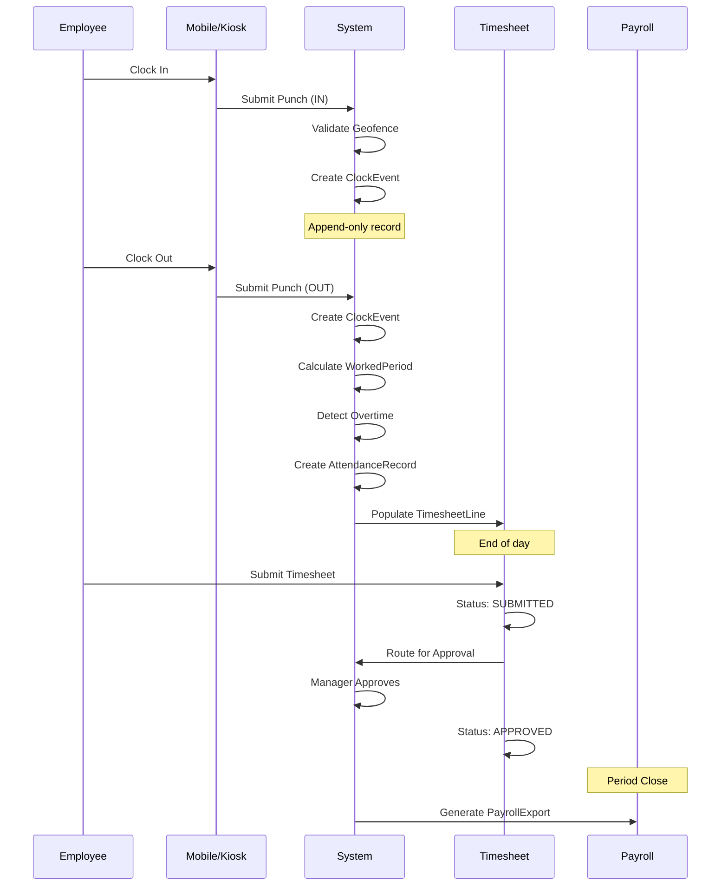
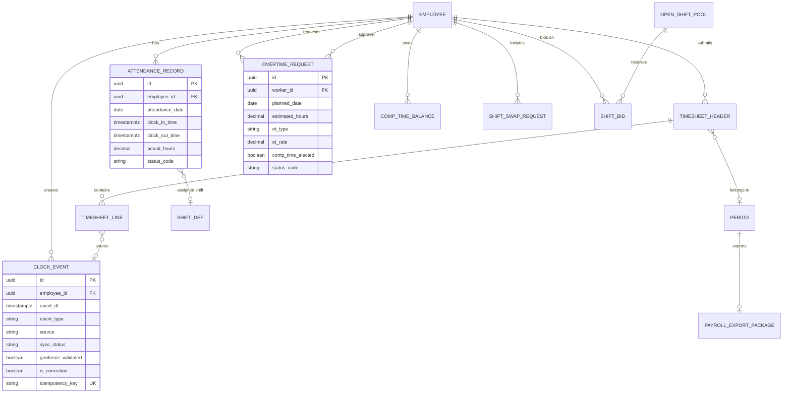
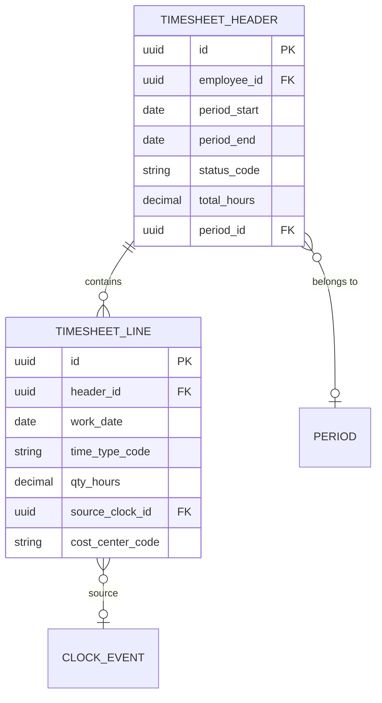
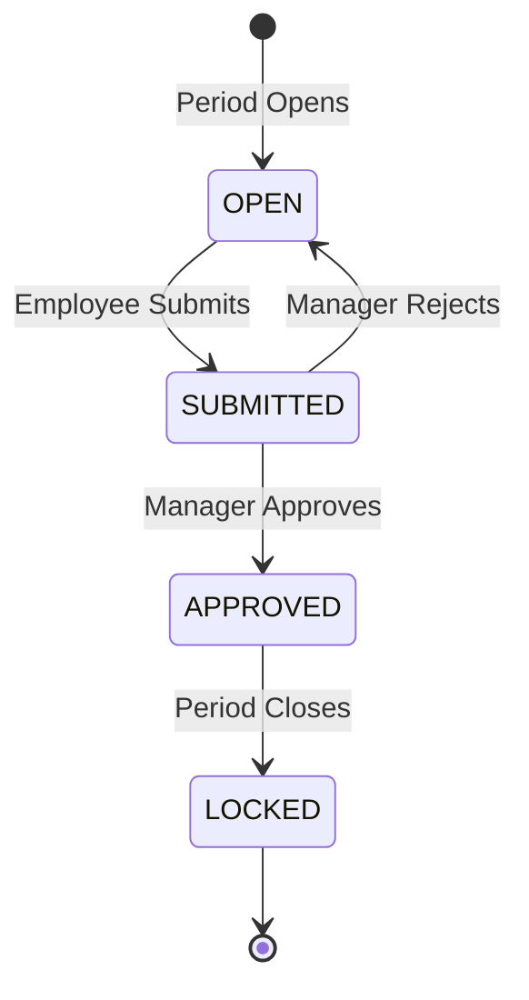
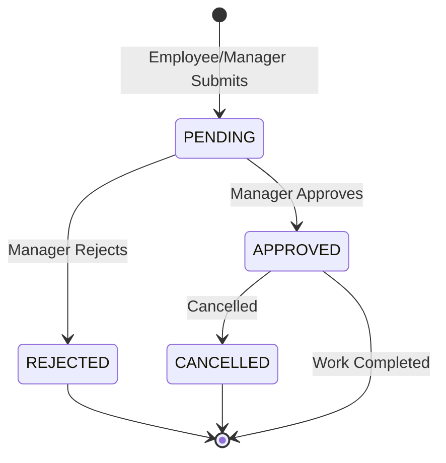
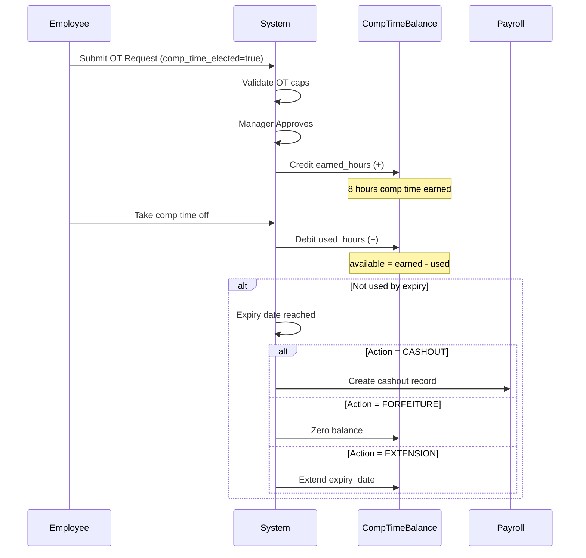
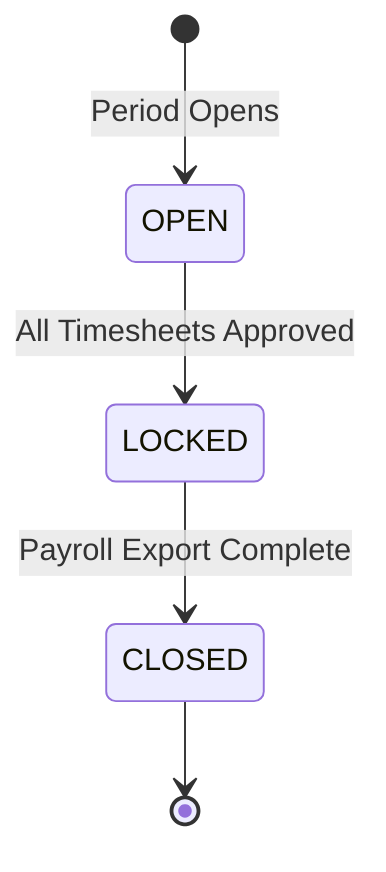

# Attendance Model - Punch, Timesheet & Overtime

**Bounded Context:** `ta.attendance`  
**Tables:** 11  
**Last Updated:** 2026-04-01

---

## Overview

Attendance model quản lý toàn bộ flow từ chấm công (punch) đến timesheet, bao gồm:
- **Clock Events**: Raw punch data (append-only)
- **Attendance Records**: Processed attendance with calculated hours
- **Timesheets**: Period-level aggregation requiring approval
- **Overtime**: Pre-approval workflow with VLC cap enforcement
- **Comp Time**: Compensatory time tracking and expiry

---

## Key Concepts

### Immutable Punch (ADR-TA-001)

Punch records là **append-only** - không UPDATE, không DELETE:
- Corrections tạo compensating records
- Full audit trail preserved
- Source of truth for attendance

### No Raw Biometric (ADR-TA-004)

System chỉ lưu **token reference** từ biometric provider:
- Không lưu fingerprint, facial scan, hay biometric template
- Compliance với GDPR Article 9, Vietnam Decree 13/2023

### Vietnam Labor Code Compliance

Built-in enforcement:
- **OT Caps (Art. 107)**: Daily 4h, Monthly 40h, Annual 200-300h
- **OT Rates (Art. 98)**: Weekday 150%, Weekend 200%, Holiday 300%
- **Rest Period (Art. 109)**: Minimum 8 hours between shifts

---

## Core Flow



---

## Entity Relationship Diagram



---

## 1. Clock Event (Raw Punch Data)

### Business Purpose

**ClockEvent** là raw record của mỗi lần clock in/out. Đây là nguồn dữ liệu gốc cho mọi attendance calculation.

### Entity Details

| Field | Type | Purpose | Notes |
|-------|------|---------|-------|
| `event_dt` | timestamptz | Event timestamp | UTC, with timezone |
| `event_type` | varchar | IN, OUT, BREAK_IN, BREAK_OUT | Punch direction |
| `source` | varchar | MOBILE, KIOSK, WEB, API | Input channel |
| `sync_status` | varchar | PENDING, SYNCED, CONFLICT | Offline-first support |
| `geofence_validated` | boolean | Location validated | Geofencing check |
| `is_correction` | boolean | Is correction punch | Corrections via flag |
| `corrects_event_id` | uuid | Self-reference | Original event being corrected |
| `idempotency_key` | varchar | Deduplication key | Prevent duplicate syncs |

### Sample Data

**Regular Clock In:**
```json
{
  "id": "550e8400-e29b-41d4-a716-446655440001",
  "employee_id": "EMP001",
  "event_dt": "2026-04-07T01:02:00Z",
  "event_type": "IN",
  "source": "MOBILE",
  "device_id": "mobile-iphone-123",
  "geo_lat": 10.7769,
  "geo_long": 106.7009,
  "sync_status": "SYNCED",
  "geofence_validated": true,
  "is_correction": false,
  "idempotency_key": "emp001-20260407-in-mobile"
}
```

**Offline Punch (Synced Later):**
```json
{
  "id": "550e8400-e29b-41d4-a716-446655440002",
  "employee_id": "EMP002",
  "event_dt": "2026-04-07T00:58:00Z",
  "event_type": "IN",
  "source": "MOBILE",
  "sync_status": "PENDING",
  "synced_at": null,
  "geofence_validated": true,
  "is_correction": false,
  "idempotency_key": "emp002-20260407-in-mobile-offline"
}
```

**Correction Punch:**
```json
{
  "id": "550e8400-e29b-41d4-a716-446655440003",
  "employee_id": "EMP001",
  "event_dt": "2026-04-07T06:30:00Z",
  "event_type": "OUT",
  "source": "WEB",
  "sync_status": "SYNCED",
  "is_correction": true,
  "corrects_event_id": "550e8400-e29b-41d4-a716-446655440004"
}
```

**Geofence Violation:**
```json
{
  "id": "550e8400-e29b-41d4-a716-446655440005",
  "employee_id": "EMP003",
  "event_dt": "2026-04-07T01:05:00Z",
  "event_type": "IN",
  "source": "MOBILE",
  "geo_lat": 10.7800,
  "geo_long": 106.7100,
  "geofence_validated": false,
  "sync_status": "SYNCED"
}
```

---

## 2. Attendance Record (Processed Daily Attendance)

### Business Purpose

**AttendanceRecord** là bản ghi chấm công đã xử lý cho mỗi ngày, bao gồm giờ vào/ra thực tế, giờ làm việc đã tính, và status.

### Entity Details

| Field | Type | Purpose |
|-------|------|---------|
| `attendance_date` | date | Ngày chấm công |
| `clock_in_time` | timestamptz | Giờ vào thực tế |
| `clock_out_time` | timestamptz | Giờ ra thực tế |
| `scheduled_start_time` | time | Giờ bắt đầu theo shift |
| `scheduled_end_time` | time | Giờ kết thúc theo shift |
| `actual_hours` | decimal | Giờ làm việc thực tế (calculated) |
| `scheduled_hours` | decimal | Giờ theo lịch |
| `status_code` | varchar | PRESENT, ABSENT, LATE, EARLY_DEPARTURE, HALF_DAY, ON_LEAVE |
| `late_minutes` | int | Số phút đi muộn |
| `early_departure_minutes` | int | Số phút về sớm |

### Attendance Status

| Status | Description | Trigger |
|--------|-------------|---------|
| `PRESENT` | Đi làm đúng giờ | Clock in/out within shift + grace |
| `ABSENT` | Vắng mặt | No clock event, no approved leave |
| `LATE` | Đi muộn | Clock in > shift start + grace |
| `EARLY_DEPARTURE` | Về sớm | Clock out < shift end - grace |
| `HALF_DAY` | Làm nửa ngày | Approved half-day leave |
| `ON_LEAVE` | Nghỉ phép | Approved leave request |

### Sample Data

**Present - Full Day:**
```json
{
  "id": "550e8400-e29b-41d4-a716-446655440010",
  "employee_id": "EMP001",
  "shift_id": "DAY_SHIFT_ID",
  "attendance_date": "2026-04-07",
  "clock_in_time": "2026-04-07T01:02:00Z",
  "clock_out_time": "2026-04-07T10:05:00Z",
  "scheduled_start_time": "01:00:00",
  "scheduled_end_time": "10:00:00",
  "actual_hours": 8.05,
  "scheduled_hours": 8.00,
  "status_code": "PRESENT",
  "late_minutes": 0,
  "early_departure_minutes": 0,
  "is_approved": true
}
```

**Late Arrival:**
```json
{
  "id": "550e8400-e29b-41d4-a716-446655440011",
  "employee_id": "EMP002",
  "shift_id": "DAY_SHIFT_ID",
  "attendance_date": "2026-04-07",
  "clock_in_time": "2026-04-07T01:18:00Z",
  "clock_out_time": "2026-04-07T10:00:00Z",
  "scheduled_start_time": "01:00:00",
  "scheduled_end_time": "10:00:00",
  "actual_hours": 7.70,
  "scheduled_hours": 8.00,
  "status_code": "LATE",
  "late_minutes": 18,
  "early_departure_minutes": 0,
  "notes": "Traffic jam"
}
```

**Absent:**
```json
{
  "id": "550e8400-e29b-41d4-a716-446655440012",
  "employee_id": "EMP003",
  "shift_id": "DAY_SHIFT_ID",
  "attendance_date": "2026-04-07",
  "clock_in_time": null,
  "clock_out_time": null,
  "scheduled_start_time": "01:00:00",
  "scheduled_end_time": "10:00:00",
  "actual_hours": null,
  "scheduled_hours": 8.00,
  "status_code": "ABSENT",
  "notes": "No show - no approved leave"
}
```

---

## 3. Timesheet (Period-Level Summary)

### Business Purpose

**Timesheet** tổng hợp attendance data cho một payroll period, yêu cầu employee review và manager approval.

### Entity Relationship



### Timesheet States



| State | Description | Who Can Act |
|-------|-------------|-------------|
| `OPEN` | Period active, employee can review | Employee |
| `SUBMITTED` | Awaiting manager approval | Manager |
| `APPROVED` | Approved, ready for payroll | HR (corrections only) |
| `LOCKED` | Period closed, frozen | No changes |

### Timesheet Header Sample

```json
{
  "id": "550e8400-e29b-41d4-a716-446655440020",
  "employee_id": "EMP001",
  "period_start": "2026-04-01",
  "period_end": "2026-04-30",
  "status_code": "SUBMITTED",
  "total_hours": 184.00,
  "period_id": "PERIOD_202604"
}
```

### Timesheet Line Sample

```json
{
  "id": "550e8400-e29b-41d4-a716-446655440021",
  "header_id": "550e8400-e29b-41d4-a716-446655440020",
  "work_date": "2026-04-07",
  "time_type_code": "REG",
  "qty_hours": 8.00,
  "source_clock_id": "CLOCK_EVENT_ID",
  "cost_center_code": "CC001"
}
```

```json
{
  "id": "550e8400-e29b-41d4-a716-446655440022",
  "header_id": "550e8400-e29b-41d4-a716-446655440020",
  "work_date": "2026-04-07",
  "time_type_code": "OT1.5",
  "qty_hours": 2.00,
  "source_clock_id": null
}
```

### Time Type Element Map

Maps `time_type_code` to payroll `pay_element_code`:

```json
{
  "id": "550e8400-e29b-41d4-a716-446655440030",
  "time_type_code": "REG",
  "pay_element_code": "REGULAR_HOURS",
  "rate_source_code": "EMPLOYEE_SNAPSHOT",
  "rate_unit": "PER_HOUR"
}
```

```json
{
  "id": "550e8400-e29b-41d4-a716-446655440031",
  "time_type_code": "OT1.5",
  "pay_element_code": "OVERTIME_150",
  "rate_source_code": "FIXED",
  "default_rate": 1.5,
  "rate_unit": "MULTIPLIER"
}
```

---

## 4. Overtime Request (Pre-Approval Workflow)

### Business Purpose

**OvertimeRequest** quản lý workflow approve OT trước khi làm, với enforcement của VLC caps.

### Entity Details

| Field | Type | Purpose | VLC Reference |
|-------|------|---------|---------------|
| `ot_type` | varchar | WEEKDAY, WEEKEND, PUBLIC_HOLIDAY | Art. 98 |
| `ot_rate` | decimal | 1.5, 2.0, 3.0 | Art. 98 |
| `daily_ot_cap_hours` | decimal | Max OT per day (default: 4) | Art. 107 |
| `monthly_ot_cap_hours` | decimal | Max OT per month (default: 40) | Art. 107 |
| `annual_ot_cap_hours` | decimal | Max OT per year (default: 200-300) | Art. 107 |
| `comp_time_elected` | boolean | Take comp time instead of OT pay | - |

### OT Types & Rates

| OT Type | Rate | Scenario | VLC Article |
|---------|------|----------|-------------|
| `WEEKDAY` | 150% | Normal working day OT | Art. 98 |
| `WEEKEND` | 200% | Saturday/Sunday OT | Art. 98 |
| `PUBLIC_HOLIDAY` | 300% | Public holiday OT | Art. 98 |

### OT Request States



### Sample Data

**Weekday OT Request:**
```json
{
  "id": "550e8400-e29b-41d4-a716-446655440040",
  "worker_id": "EMP001",
  "request_date": "2026-04-06T15:00:00Z",
  "planned_date": "2026-04-07",
  "estimated_hours": 2.00,
  "reason": "Urgent project deadline",
  "project_id": "PROJ001",
  "ot_type": "WEEKDAY",
  "ot_rate": 1.50,
  "comp_time_elected": false,
  "daily_ot_cap_hours": 4.00,
  "monthly_ot_cap_hours": 40.00,
  "annual_ot_cap_hours": 200.00,
  "status_code": "APPROVED",
  "approved_by": "MGR001",
  "approved_at": "2026-04-06T16:00:00Z",
  "actual_hours": 2.50
}
```

**Weekend OT with Comp Time:**
```json
{
  "id": "550e8400-e29b-41d4-a716-446655440041",
  "worker_id": "EMP002",
  "request_date": "2026-04-10T10:00:00Z",
  "planned_date": "2026-04-12",
  "estimated_hours": 4.00,
  "reason": "System maintenance window",
  "ot_type": "WEEKEND",
  "ot_rate": 2.00,
  "comp_time_elected": true,
  "status_code": "APPROVED",
  "approved_by": "MGR002"
}
```

### OT Cap Enforcement

System checks caps at approval:

```sql
-- Example validation
SELECT 
  SUM(estimated_hours) as monthly_ot
FROM ta.overtime_request
WHERE worker_id = 'EMP001'
  AND EXTRACT(MONTH FROM planned_date) = 4
  AND EXTRACT(YEAR FROM planned_date) = 2026
  AND status_code IN ('APPROVED', 'PENDING');

-- If monthly_ot + new_request > 40h → warn or block
```

---

## 5. Comp Time Balance

### Business Purpose

**CompTimeBalance** tracks compensatory time earned in lieu of OT pay.

### Entity Details

| Field | Type | Purpose |
|-------|------|---------|
| `earned_hours` | decimal | Total comp hours earned from approved OT |
| `used_hours` | decimal | Total comp hours used (taken as leave) |
| `available_hours` | decimal | earned - used |
| `expiry_date` | date | When unused comp-time expires |
| `expiry_action` | varchar | EXTENSION, CASHOUT, FORFEITURE |

### Expiry Actions

| Action | Description | VLC Reference |
|--------|-------------|---------------|
| `EXTENSION` | Manager-approved extension | - |
| `CASHOUT` | Auto cash-out to payroll | Art. 98 (comp-time in lieu) |
| `FORFEITURE` | Balance zeroed, logged | - |

### Sample Data

```json
{
  "id": "550e8400-e29b-41d4-a716-446655440050",
  "employee_id": "EMP002",
  "earned_hours": 12.00,
  "used_hours": 4.00,
  "available_hours": 8.00,
  "expiry_date": "2026-06-30",
  "expiry_action": "CASHOUT"
}
```

### Comp Time Flow



---

## 6. Period Management

### Business Purpose

**Period** quản lý payroll period lifecycle: OPEN → LOCKED → CLOSED.

### Period States



| State | Description | Actions Allowed |
|-------|-------------|-----------------|
| `OPEN` | Active period | Timesheet submission/approval |
| `LOCKED` | Frozen for payroll | Payroll export only |
| `CLOSED` | Finalized | No changes |

### Sample Data

```json
{
  "id": "550e8400-e29b-41d4-a716-446655440060",
  "code": "2026-04",
  "name": "April 2026",
  "period_type": "MONTHLY",
  "start_date": "2026-04-01",
  "end_date": "2026-04-30",
  "status_code": "OPEN",
  "locked_at": null,
  "locked_by": null
}
```

---

## 7. Payroll Export Package

### Business Purpose

**PayrollExportPackage** đóng gói data gửi sang Payroll module tại period close.

### Entity Details

| Field | Type | Purpose |
|-------|------|---------|
| `period_id` | uuid | Period being closed |
| `employee_count` | int | Number of employees |
| `total_regular_hours` | decimal | Sum of regular hours |
| `total_ot_hours` | decimal | Sum of OT hours |
| `total_leave_days` | decimal | Sum of leave days |
| `total_comp_time_hours` | decimal | Comp time cashouts |
| `checksum` | varchar | SHA-256 for integrity |
| `dispatch_status` | varchar | PENDING, DISPATCHED, ACKNOWLEDGED, FAILED |

### Dispatch Lifecycle

```
PENDING → DISPATCHED → ACKNOWLEDGED
                    ↘ FAILED (retry)
```

### Sample Data

```json
{
  "id": "550e8400-e29b-41d4-a716-446655440070",
  "period_id": "PERIOD_202604",
  "generated_at": "2026-05-01T02:00:00Z",
  "generated_by": "HR_ADMIN",
  "employee_count": 500,
  "total_regular_hours": 88000.00,
  "total_ot_hours": 1200.00,
  "total_leave_days": 450.00,
  "total_comp_time_hours": 80.00,
  "export_format": "JSON",
  "checksum": "a1b2c3d4e5f6...",
  "dispatch_status": "ACKNOWLEDGED",
  "dispatched_at": "2026-05-01T02:05:00Z",
  "payroll_system_ref": "PAYROLL-202604-001"
}
```

---

## 8. Shift Operations

### Shift Swap Request

Employee-to-employee shift swap:

```json
{
  "id": "550e8400-e29b-41d4-a716-446655440080",
  "requestor_id": "EMP001",
  "target_worker_id": "EMP002",
  "requestor_shift_id": "SHIFT_APR07_E1",
  "target_shift_id": "SHIFT_APR07_E2",
  "request_date": "2026-04-05T10:00:00Z",
  "reason": "Personal appointment",
  "status_code": "APPROVED",
  "target_response": "ACCEPTED",
  "manager_approval": "APPROVED"
}
```

### Shift Bid

Employee bids for open shift:

```json
{
  "id": "550e8400-e29b-41d4-a716-446655440081",
  "worker_id": "EMP003",
  "open_shift_id": "OPEN_SHIFT_001",
  "bid_date": "2026-04-05T14:00:00Z",
  "priority": 1,
  "reason": "Want extra hours",
  "status_code": "ACCEPTED",
  "assigned_at": "2026-04-05T16:00:00Z"
}
```

### Open Shift Pool

Unfilled shifts for bidding:

```json
{
  "id": "550e8400-e29b-41d4-a716-446655440082",
  "work_date": "2026-04-10",
  "shift_id": "DAY_SHIFT_ID",
  "qty_needed": 2,
  "qty_claimed": 1,
  "status_code": "PARTIAL"
}
```

---

## 9. Time Exceptions

### Business Purpose

**TimeException** tracks attendance violations for manager review.

### Sample Data

**Late Arrival:**
```json
{
  "id": "550e8400-e29b-41d4-a716-446655440090",
  "employee_id": "EMP001",
  "work_date": "2026-04-07",
  "exception_code": "LATE",
  "status_code": "RESOLVED",
  "reason": "Employee called - traffic accident",
  "resolved_by": "MGR001",
  "resolved_at": "2026-04-07T03:00:00Z"
}
```

**Missing Punch:**
```json
{
  "id": "550e8400-e29b-41d4-a716-446655440091",
  "employee_id": "EMP002",
  "work_date": "2026-04-07",
  "exception_code": "MISS_PUNCH",
  "status_code": "OPEN",
  "reason": null
}
```

---

## Worked Period Calculation

### Algorithm

```
1. Pair Clock IN and Clock OUT events
2. Calculate raw duration:
   worked_minutes = clock_out_time - clock_in_time
3. Apply break deductions from assigned shift:
   worked_minutes -= total_break_minutes
4. Calculate overtime:
   if worked_minutes > scheduled_minutes:
     ot_minutes = worked_minutes - scheduled_minutes
5. Create AttendanceRecord:
   - actual_hours = worked_minutes / 60
   - status_code = determine_status(late_minutes, early_departure_minutes)
```

### Example

```
Employee: EMP001
Date: 2026-04-07
Shift: Day Shift 08:00-17:00 (8h work + 1h break)

Clock In:  08:02 (2 min late, within 10min grace)
Clock Out: 18:05

Raw duration: 18:05 - 08:02 = 10h 03min = 603 min
Break deduction: -60 min
Worked minutes: 543 min = 9.05 hours

Scheduled: 8 hours
Overtime: 9.05 - 8 = 1.05 hours

Status: PRESENT (late 2min < grace)
Actual hours: 9.05
OT hours: 1.05 (rate: WEEKDAY 150%)
```

---

## Summary

| Entity | Purpose | Key Features |
|--------|---------|--------------|
| **ClockEvent** | Raw punch data | Append-only, offline-first, geofencing |
| **AttendanceRecord** | Daily attendance | Calculated hours, status tracking |
| **Timesheet** | Period summary | Approval workflow, payroll integration |
| **OvertimeRequest** | OT pre-approval | VLC cap enforcement, comp time election |
| **CompTimeBalance** | Comp time tracking | Expiry management, multiple actions |
| **Period** | Payroll period | OPEN/LOCKED/CLOSED lifecycle |
| **PayrollExportPackage** | Payroll integration | Idempotent, checksum verification |

---

*Next: [03-absence-model.md](./03-absence-model.md) - Leave Management*