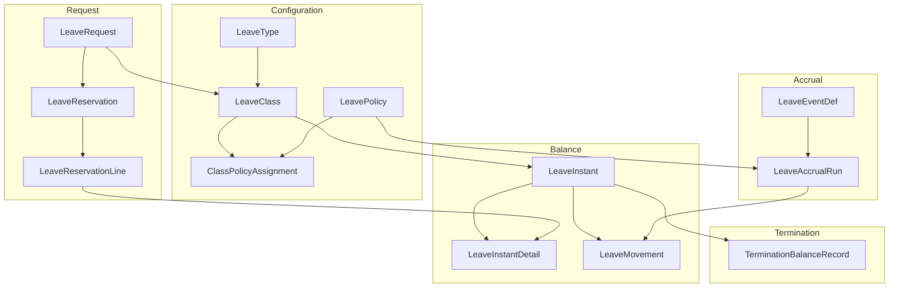
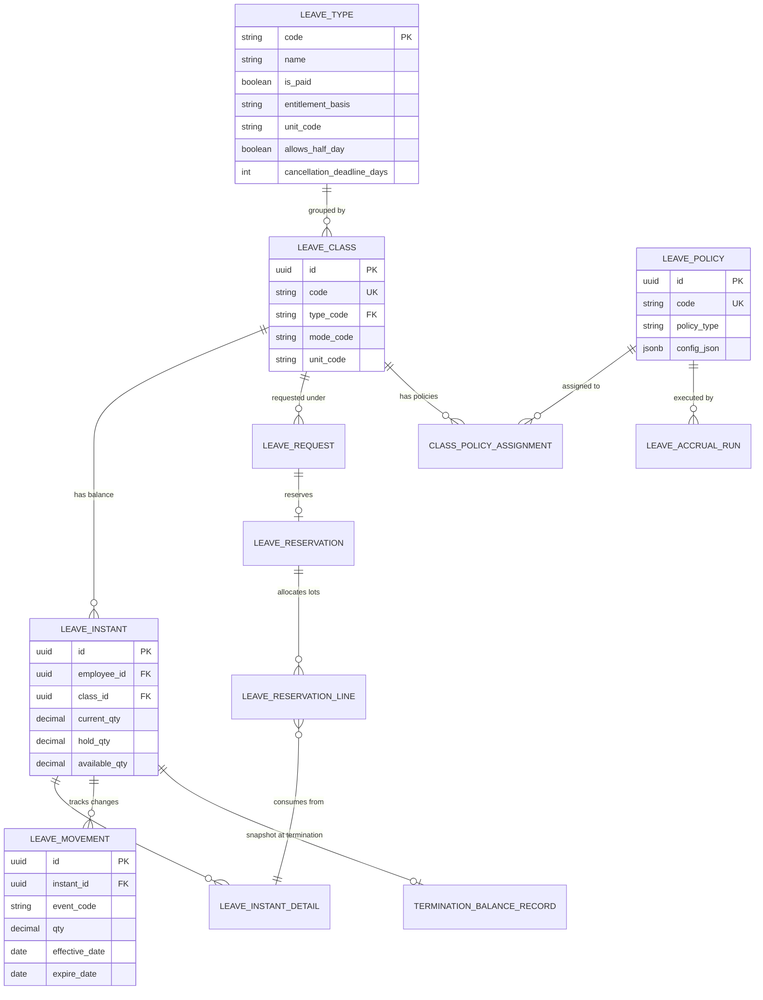
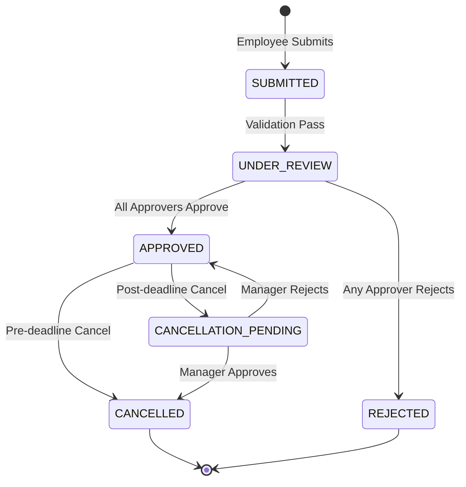
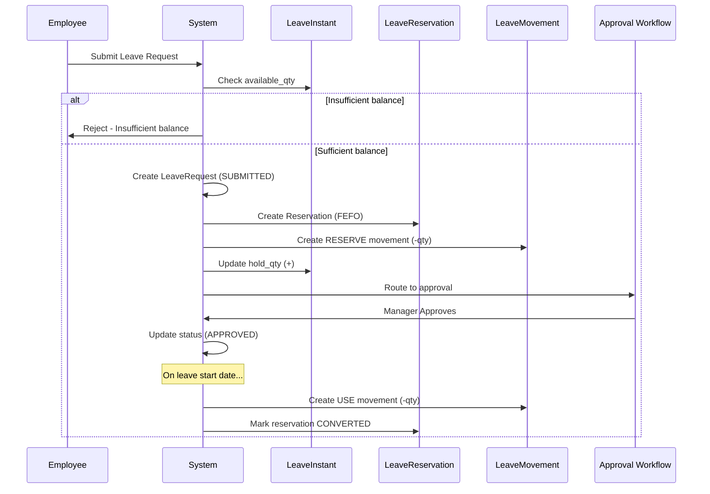
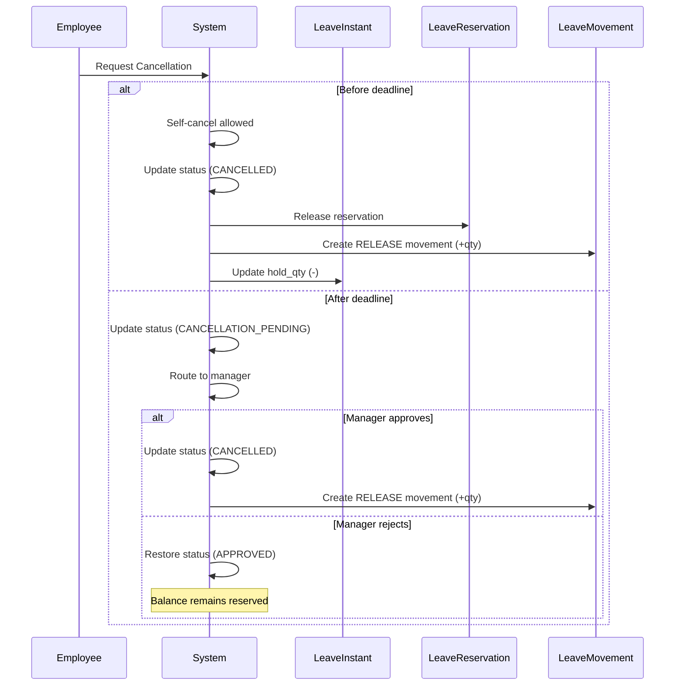
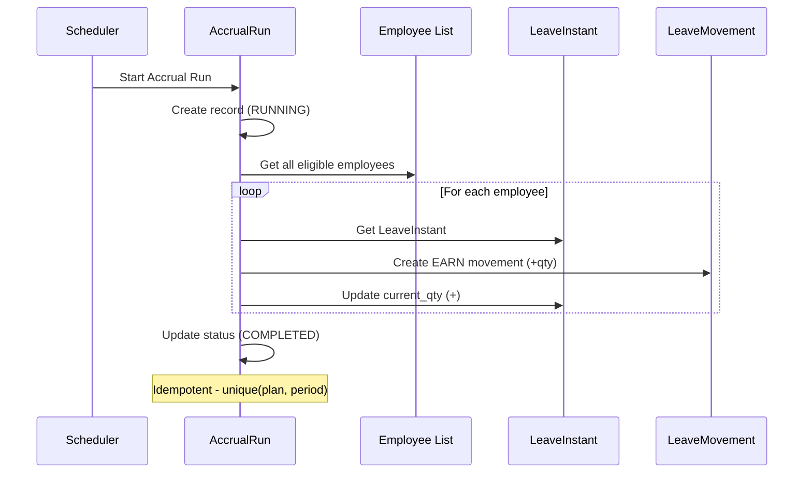

# Absence Model - Leave Management & Balance Tracking

**Bounded Context:** `ta.absence`  
**Tables:** 18  
**Source:** TA-database-design-v5.dbml (v5.3)  
**Last Updated:** 2026-04-01

---

## Overview

Absence model quản lý toàn bộ lifecycle của leave (nghỉ phép), bao gồm:
- **Leave Configuration**: Types, Classes, Policies
- **Leave Balance**: Immutable ledger tracking với FEFO
- **Leave Request**: Workflow từ submit đến approve/reject
- **Event Processing**: Generalized batch event execution
- **Period Hierarchy**: YEAR → QUARTER → MONTH structure
- **Staffing Rules**: Team leave limits

---

## Key Concepts

### Immutable Ledger (ADR-TA-001)

**LeaveMovement** là append-only ledger:
- Mọi balance change được ghi nhận
- Balance computed từ event stream, không stored
- Full audit trail

### FEFO Reservation (First-Expired-First-Out)

Leave balance consumed theo expiry date:
- Carried-over leave consumed first
- Prevents expiry loss
- `LeaveReservationLine` tracks lot consumption

### Cancellation Policy (H-P0-001 Resolved)

| Scenario | Rule |
|----------|------|
| Before deadline | Self-cancel without approval |
| After deadline | Manager approval required |
| Deadline | Configurable (default: 1 business day before start) |

### Vietnam Labor Code Compliance

- **Art. 113**: Annual leave minimum 14 days (< 5 years)
- **Art. 114**: Sick leave - doctor certificate after 2 consecutive days
- **Art. 139**: Maternity leave 6 months
- **Art. 21**: Payroll deduction requires written consent

---

## Architecture Overview



---

## Entity Relationship Diagram



---

## 1. Leave Type (Configuration Root)

### Business Purpose

**LeaveType** là configuration root định nghĩa từng loại nghỉ phép: Annual, Sick, Maternity, Unpaid, etc.

### Entity Details (Important)

| Field | Type | Purpose | VLC Reference |
|-------|------|---------|---------------|
| `code` | varchar(50) | Unique identifier | - |
| `entitlement_basis` | enum | FIXED, ACCRUAL, UNLIMITED | - |
| `unit_code` | varchar | DAY, HOUR | - |
| `allows_half_day` | boolean | Allow 0.5-day requests | - |
| `cancellation_deadline_days` | int | Days before start for self-cancel | H-P0-001 |

### Vietnam Standard Leave Types

| Code | VN Name | Entitlement | VLC Article |
|------|---------|-------------|-------------|
| `ANNUAL` | Nghỉ phép năm | 12+ days by seniority | Art. 113 |
| `SICK` | Nghỉ ốm đau | 30-180 days by condition | Art. 114 |
| `MATERNITY` | Nghỉ thai sản | 6 months | Art. 139 |
| `PATERNITY` | Nghỉ paternal | 5 days | Law on Social Insurance |
| `UNPAID` | Nghỉ không lương | By agreement | Art. 115 |

### Sample Data

**Annual Leave:**
```json
{
  "code": "ANNUAL",
  "name": "Nghỉ phép năm",
  "is_paid": true,
  "is_quota_based": true,
  "requires_approval": true,
  "unit_code": "DAY",
  "core_min_unit": 0.50,
  "allows_half_day": true,
  "holiday_handling": "EXCLUDE_HOLIDAYS",
  "overlap_policy": "DENY",
  "support_scope": "VN:LE",
  "cancellation_deadline_days": 1,
  "country_code": "VN",
  "is_active": true
}
```

**Sick Leave:**
```json
{
  "code": "SICK",
  "name": "Nghỉ ốm đau",
  "is_paid": true,
  "is_quota_based": true,
  "requires_approval": true,
  "unit_code": "DAY",
  "core_min_unit": 1.00,
  "allows_half_day": false,
  "holiday_handling": "INCLUDE_HOLIDAYS",
  "country_code": "VN",
  "cancellation_deadline_days": 0
}
```

**Unpaid Leave:**
```json
{
  "code": "UNPAID",
  "name": "Nghỉ không lương",
  "is_paid": false,
  "is_quota_based": false,
  "requires_approval": true,
  "unit_code": "DAY",
  "entitlement_basis": "UNLIMITED",
  "allows_half_day": true,
  "country_code": "VN"
}
```

---

## 2. Leave Class (Grouping for Policies)

### Business Purpose

**LeaveClass** groups LeaveTypes for shared policy rules, đặc biệt là deduction priority khi có nhiều balance.

### Entity Details

| Field | Type | Purpose |
|-------|------|---------|
| `type_code` | varchar | FK to LeaveType |
| `mode_code` | varchar | ACCOUNT, LIMIT, UNPAID |
| `unit_code` | varchar | DAY, HOUR |
| `default_eligibility_profile_id` | uuid | WHO is eligible |

### Sample Data

**Standard Annual Leave Class:**
```json
{
  "id": "550e8400-e29b-41d4-a716-446655440101",
  "type_code": "ANNUAL",
  "code": "ANNUAL_STANDARD",
  "name": "Annual Leave - Standard",
  "status_code": "ACTIVE",
  "scope_owner": "EMP",
  "mode_code": "ACCOUNT",
  "unit_code": "DAY",
  "period_profile": {
    "type": "CALENDAR_YEAR",
    "start_month": 1
  },
  "default_eligibility_profile_id": "ELIG_ALL_EMPLOYEES"
}
```

**Medical Leave Class (Sick + Unpaid priority):**
```json
{
  "id": "550e8400-e29b-41d4-a716-446655440102",
  "type_code": "SICK",
  "code": "MEDICAL_LEAVE",
  "name": "Medical Leave Class",
  "status_code": "ACTIVE",
  "mode_code": "ACCOUNT",
  "unit_code": "DAY",
  "rules_json": {
    "deduction_priority": [
      {"type_code": "SICK", "priority": 1},
      {"type_code": "UNPAID", "priority": 2}
    ]
  }
}
```

---

## 3. Leave Policy (Rules Engine)

### Business Purpose

**LeavePolicy** định nghĩa rules cho accrual, carryover, limits, validation, proration, seniority.

### Policy Types

| Policy Type | Purpose | Config Schema |
|-------------|---------|---------------|
| `ACCRUAL` | How leave is earned | `{method, amount_per_period, frequency, max_balance}` |
| `CARRY` | Year-end carryover | `{allow_carry, max_carry_qty, expiry_months}` |
| `LIMIT` | Usage limits | `{max_per_request, max_per_month, max_per_year}` |
| `VALIDATION` | Custom validation rules | `{rules[{type, params}]}` |
| `PRORATION` | Pro-rata for partial year | `{method, basis}` |
| `ROUNDING` | Balance rounding | `{method, precision}` |
| `SENIORITY` | Tenure-based entitlement | `{tiers[{min_years, max_years, days}]}` |

### Sample Data

**Accrual Policy (Monthly):**
```json
{
  "id": "550e8400-e29b-41d4-a716-446655440111",
  "type_code": "ANNUAL",
  "code": "ACCRUAL_MONTHLY_14D",
  "name": "Monthly Accrual - 14 Days/Year",
  "policy_type": "ACCRUAL",
  "config_json": {
    "method": "MONTHLY_PRO_RATA",
    "amount_per_period": 1.167,
    "frequency": "MONTHLY",
    "unit": "DAY",
    "max_balance": 30.0,
    "tenure_tiers": []
  },
  "effective_start": "2025-01-01"
}
```

**Seniority Policy (VLC Art. 113):**
```json
{
  "id": "550e8400-e29b-41d4-a716-446655440112",
  "type_code": "ANNUAL",
  "code": "SENIORITY_VLC113",
  "name": "Seniority-Based Annual Leave",
  "policy_type": "SENIORITY",
  "config_json": {
    "vlc_reference": "Vietnam Labor Code 2019, Article 113",
    "tiers": [
      {"min_years": 0, "max_years": 5, "entitlement_days": 14},
      {"min_years": 5, "max_years": 10, "entitlement_days": 15},
      {"min_years": 10, "max_years": 15, "entitlement_days": 16},
      {"min_years": 15, "max_years": 999, "entitlement_days": 17, "note": "+1 day per 5 years above 15"}
    ]
  }
}
```

**Carryover Policy:**
```json
{
  "id": "550e8400-e29b-41d4-a716-446655440113",
  "type_code": "ANNUAL",
  "code": "CARRY_5DAYS_MAR31",
  "name": "Carryover - Max 5 Days, Expiry Mar 31",
  "policy_type": "CARRY",
  "config_json": {
    "allow_carry": true,
    "max_carry_qty": 5.0,
    "carry_unit": "DAY",
    "expiry_months_after_year_end": 3,
    "expiry_action": "FORFEITURE"
  }
}
```

### Class Policy Assignment

Maps LeaveClass to LeavePolicies:

```json
{
  "id": "550e8400-e29b-41d4-a716-446655440121",
  "class_id": "550e8400-e29b-41d4-a716-446655440101",
  "policy_id": "550e8400-e29b-41d4-a716-446655440111",
  "priority": 10,
  "is_override": false,
  "effective_start": "2025-01-01",
  "is_current_flag": true
}
```

---

## 4. Leave Instant (Balance Snapshot)

### Business Purpose

**LeaveInstant** là point-in-time balance state cho mỗi employee × leave class.

### Balance Formula

```
available_qty = current_qty - hold_qty

where:
  current_qty = earned - used
  hold_qty = reserved (pending requests)
```

### Entity Details

| Field | Type | Purpose |
|-------|------|---------|
| `current_qty` | decimal | Earned - Used |
| `hold_qty` | decimal | Reserved for pending requests |
| `available_qty` | decimal | Current usable balance |
| `limit_yearly` | decimal | Annual usage limit |
| `used_ytd` | decimal | Used this year |

### Sample Data

```json
{
  "id": "550e8400-e29b-41d4-a716-446655440131",
  "employee_id": "EMP001",
  "class_id": "550e8400-e29b-41d4-a716-446655440101",
  "state_code": "ACTIVE",
  "current_qty": 14.00,
  "hold_qty": 2.00,
  "available_qty": 12.00,
  "limit_yearly": 15.00,
  "used_ytd": 0.00,
  "used_mtd": 0.00
}
```

---

## 5. Leave Instant Detail (FEFO Lots)

### Business Purpose

**LeaveInstantDetail** tracks individual lots/grants với expiry dates - foundation cho FEFO consumption.

### Lot Types

| Lot Kind | Description | Typical Expiry |
|----------|-------------|----------------|
| `GRANT` | Initial entitlement | Year-end |
| `CARRY` | Carried over from prior year | Mar 31 (typically) |
| `BONUS` | Bonus leave granted | Configurable |
| `TRANSFER` | Transferred from another type | Configurable |
| `OTHER` | Other sources | Configurable |

### Sample Data

**Current Year Grant:**
```json
{
  "id": "550e8400-e29b-41d4-a716-446655440141",
  "instant_id": "550e8400-e29b-41d4-a716-446655440131",
  "lot_kind": "GRANT",
  "eff_date": "2026-01-01",
  "expire_date": "2026-12-31",
  "lot_qty": 14.00,
  "used_qty": 0.00,
  "priority": 100,
  "tag": "2026_ENTITLEMENT"
}
```

**Carryover Lot (expiring soon):**
```json
{
  "id": "550e8400-e29b-41d4-a716-446655440142",
  "instant_id": "550e8400-e29b-41d4-a716-446655440131",
  "lot_kind": "CARRY",
  "eff_date": "2026-01-01",
  "expire_date": "2026-03-31",
  "lot_qty": 3.00,
  "used_qty": 0.00,
  "priority": 50,
  "tag": "2025_CARRYOVER"
}
```

---

## 6. Leave Movement (Immutable Ledger)

### Business Purpose

**LeaveMovement** là append-only ledger ghi nhận mọi balance change event.

### Movement Types

| Type | Effect | Description |
|------|--------|-------------|
| `EARN` | +credit | Accrual, grant, carryover |
| `USE` | -debit | Leave taken (approved) |
| `RESERVE` | -debit | Pending request hold |
| `RELEASE` | +credit | Reservation released (rejection) |
| `EXPIRE` | -debit | Balance expired |
| `ADJUST` | ±credit/debit | Manual HR adjustment |
| `CASHOUT` | -debit | Encashment to payroll |

### Sample Data

**EARN Movement (Accrual):**
```json
{
  "id": "550e8400-e29b-41d4-a716-446655440151",
  "instant_id": "550e8400-e29b-41d4-a716-446655440131",
  "class_id": "550e8400-e29b-41d4-a716-446655440101",
  "event_code": "ACCRUAL_MONTHLY",
  "qty": 1.17,
  "unit_code": "DAY",
  "period_id": "PERIOD_202601",
  "effective_date": "2026-01-31",
  "expire_date": "2026-12-31",
  "run_id": "ACCRUAL_RUN_202601",
  "idempotency_key": "ACC-EMP001-202601"
}
```

**RESERVE Movement (Request Submitted):**
```json
{
  "id": "550e8400-e29b-41d4-a716-446655440152",
  "instant_id": "550e8400-e29b-41d4-a716-446655440131",
  "class_id": "550e8400-e29b-41d4-a716-446655440101",
  "event_code": "REQUEST_RESERVE",
  "qty": -3.00,
  "unit_code": "DAY",
  "request_id": "LR001",
  "effective_date": "2026-04-07",
  "expire_date": null
}
```

**USE Movement (Leave Taken):**
```json
{
  "id": "550e8400-e29b-41d4-a716-446655440153",
  "instant_id": "550e8400-e29b-41d4-a716-446655440131",
  "class_id": "550e8400-e29b-41d4-a716-446655440101",
  "event_code": "LEAVE_TAKEN",
  "qty": -3.00,
  "unit_code": "DAY",
  "request_id": "LR001",
  "effective_date": "2026-04-07",
  "lot_id": "550e8400-e29b-41d4-a716-446655440142"
}
```

**RELEASE Movement (Request Rejected):**
```json
{
  "id": "550e8400-e29b-41d4-a716-446655440154",
  "instant_id": "550e8400-e29b-41d4-a716-446655440131",
  "class_id": "550e8400-e29b-41d4-a716-446655440101",
  "event_code": "RESERVATION_RELEASED",
  "qty": 3.00,
  "unit_code": "DAY",
  "request_id": "LR002",
  "effective_date": "2026-04-10"
}
```

---

## 7. Leave Request (Workflow)

### Business Purpose

**LeaveRequest** là employee request cho time off, đi qua full approval workflow.

### Request States



| State | Balance Effect |
|-------|----------------|
| `SUBMITTED` | Reservation placed |
| `UNDER_REVIEW` | Reservation maintained |
| `APPROVED` | Reservation → USE on leave start |
| `REJECTED` | Reservation released |
| `CANCELLATION_PENDING` | Reservation maintained |
| `CANCELLED` | Balance restored |

### Sample Data

**New Request:**
```json
{
  "id": "550e8400-e29b-41d4-a716-446655440161",
  "employee_id": "EMP001",
  "class_id": "550e8400-e29b-41d4-a716-446655440101",
  "start_dt": "2026-04-07T00:00:00Z",
  "end_dt": "2026-04-09T23:59:59Z",
  "total_days": 3.00,
  "is_half_day": false,
  "qty_hours_req": null,
  "status_code": "SUBMITTED",
  "reason": "Family vacation",
  "instant_id": "550e8400-e29b-41d4-a716-446655440131",
  "submitted_at": "2026-04-01T10:00:00Z"
}
```

**Approved Request:**
```json
{
  "id": "550e8400-e29b-41d4-a716-446655440161",
  "status_code": "APPROVED",
  "approved_by": "MGR001",
  "approved_at": "2026-04-01T14:00:00Z"
}
```

**Cancellation Request (Post-deadline):**
```json
{
  "id": "550e8400-e29b-41d4-a716-446655440162",
  "status_code": "CANCELLATION_PENDING",
  "reason": "Emergency - need to cancel"
}
```

---

## 8. Leave Reservation (Balance Hold)

### Business Purpose

**LeaveReservation** holds balance pending request outcome, prevents overbooking.

### Sample Data

```json
{
  "request_id": "550e8400-e29b-41d4-a716-446655440161",
  "instant_id": "550e8400-e29b-41d4-a716-446655440131",
  "reserved_qty": 3.00,
  "expires_at": null,
  "created_at": "2026-04-01T10:00:00Z"
}
```

### Leave Reservation Line (FEFO Tracking)

Maps reservation to specific lots:

```json
{
  "id": "550e8400-e29b-41d4-a716-446655440171",
  "reservation_id": "550e8400-e29b-41d4-a716-446655440161",
  "source_lot_id": "550e8400-e29b-41d4-a716-446655440142",
  "reserved_amount": 3.00,
  "expiry_date": "2026-03-31",
  "created_at": "2026-04-01T10:00:00Z"
}
```

**FEFO Example:**
```
Employee has:
  Lot A: 3 days, expires 2026-03-31 (carryover)
  Lot B: 14 days, expires 2026-12-31 (current)

Request for 4 days:
  Reservation Line 1: 3 days from Lot A
  Reservation Line 2: 1 day from Lot B
```

---

## 9. Event-Driven Batch Processing

### Leave Event Definition

**LeaveEventDef** defines event types that can trigger batch operations:

| Event Code | Trigger | Description |
|------------|---------|-------------|
| `ACCRUAL` | SCHEDULED | Monthly accrual batch |
| `CARRY` | SCHEDULED | Year-end carryover |
| `EXPIRE` | SCHEDULED | Balance expiry processing |
| `RESET_LIMIT` | SCHEDULED | Reset usage limits |
| `OT_EARN` | EVENT | OT converted to comp time |

```json
{
  "id": "550e8400-e29b-41d4-a716-446655440191",
  "code": "ACCRUAL_MONTHLY",
  "name": "Monthly Accrual",
  "trigger_kind": "SCHEDULED",
  "schedule_expr": "0 0 28 * *",
  "policy_refs": ["ACCRUAL_MONTHLY_14D"],
  "is_active": true
}
```

### Leave Event Run (Generalized Batch Tracking)

**LeaveEventRun** tracks all batch event executions (ACCRUAL, CARRY, EXPIRE, etc.):

**Run Status:**

| Status | Description |
|--------|-------------|
| `RUNNING` | Batch in progress |
| `COMPLETED` | Successfully completed |
| `FAILED` | Execution failed |
| `SKIPPED` | Skipped (no eligible employees) |
| `CANCELED` | Manually canceled |

**Sample Data - Monthly Accrual Run:**
```json
{
  "id": "550e8400-e29b-41d4-a716-446655440181",
  "event_def_id": "EVENT_DEF_ACCRUAL",
  "class_id": "CLASS_ANNUAL_STD",
  "period_id": "PERIOD_202604",
  "schedule_key": "CLASS_ANNUAL_STD-202604",
  "idempotency_key": null,
  "run_status": "COMPLETED",
  "started_at": "2026-04-30T23:00:00Z",
  "completed_at": "2026-04-30T23:05:00Z",
  "failed_at": null,
  "failure_reason": null,
  "employee_count": 500,
  "movements_created": 500,
  "employees_skipped": 25,
  "stats_json": {
    "processed": 525,
    "posted": 500,
    "skipped": 25,
    "errors": 0
  },
  "created_by": null
}
```

**Sample Data - Year-End Carryover Run:**
```json
{
  "id": "550e8400-e29b-41d4-a716-446655440182",
  "event_def_id": "EVENT_DEF_CARRY",
  "class_id": null,
  "period_id": "PERIOD_FY2025",
  "run_status": "COMPLETED",
  "employee_count": 450,
  "movements_created": 680,
  "employees_skipped": 50
}
```

### Leave Class Event Mapping

**LeaveClassEvent** defines N:N mapping between leave classes and event definitions:

```json
{
  "class_id": "CLASS_ANNUAL_STD",
  "event_def_id": "EVENT_DEF_ACCRUAL",
  "qty_formula": "+seniority_calc",
  "target_override": "INSTANT",
  "idempotent": true
}
```

**Qty Formula Examples:**

| Formula | Description | Use Case |
|---------|-------------|----------|
| `+fixedRate` | Add fixed amount | Monthly accrual |
| `-request_days` | Deduct request days | Leave taken |
| `+seniority_calc` | Add seniority-based amount | Tenure-based entitlement |
| `+min(carry_cap, available)` | Add up to carry cap | Year-end carryover |

**Sample Data:**
```json
{
  "class_id": "CLASS_ANNUAL_STD",
  "event_def_id": "EVENT_DEF_CARRY",
  "qty_formula": "+min(5.0, available)",
  "idempotent": true
}
```

---

## 10. Period Hierarchy

### Leave Period

**LeavePeriod** defines period hierarchy (YEAR → QUARTER → MONTH):

| Level | Description | Example |
|-------|-------------|---------|
| `YEAR` | Fiscal/Calendar year | FY2026 |
| `QUARTER` | 3-month period | FY2026Q2 |
| `MONTH` | Single month | FY2026M04 |
| `CUSTOM` | Custom date range | Project period |

**Period Status:**

| Status | Description |
|--------|-------------|
| `OPEN` | Active, accepting movements |
| `CLOSED` | Period finalized |
| `LOCKED` | Frozen for audit |

**Sample Data:**
```json
{
  "id": "PERIOD_FY2026",
  "code": "FY2026",
  "parent_id": null,
  "level_code": "YEAR",
  "start_date": "2026-01-01",
  "end_date": "2026-12-31",
  "status_code": "OPEN",
  "calendar_code": null
}
```

```json
{
  "id": "PERIOD_FY2026Q2",
  "code": "FY2026Q2",
  "parent_id": "PERIOD_FY2026",
  "level_code": "QUARTER",
  "start_date": "2026-04-01",
  "end_date": "2026-06-30",
  "status_code": "OPEN"
}
```

```json
{
  "id": "PERIOD_FY2026M04",
  "code": "FY2026M04",
  "parent_id": "PERIOD_FY2026Q2",
  "level_code": "MONTH",
  "start_date": "2026-04-01",
  "end_date": "2026-04-30",
  "status_code": "OPEN"
}
```

---

## 11. Team Leave Limit (Staffing Rules)

### Business Purpose

**TeamLeaveLimit** restricts how many employees can be absent simultaneously in an org unit.

### Limit Types

| Type | Description | Example |
|------|-------------|---------|
| `limit_pct` | Percentage of headcount | 20% can be on leave |
| `limit_abs_cnt` | Fixed count | Max 3 people on leave |

### Sample Data

**Percentage-based limit:**
```json
{
  "id": "550e8400-e29b-41d4-a716-446655440301",
  "org_unit_id": "TEAM_ENGINEERING",
  "leave_type_code": "ANNUAL",
  "limit_pct": 20.00,
  "limit_abs_cnt": null,
  "escalation_level": 2,
  "is_active": true,
  "effective_start": "2025-01-01"
}
```

**Fixed count limit:**
```json
{
  "id": "550e8400-e29b-41d4-a716-446655440302",
  "org_unit_id": "TEAM_PRODUCTION",
  "leave_type_code": "ANNUAL",
  "limit_pct": null,
  "limit_abs_cnt": 5,
  "escalation_level": 1,
  "is_active": true,
  "effective_start": "2025-01-01"
}
```

**Validation Example:**
```
Team Engineering: 25 employees
Limit: 20% on leave = 5 employees max

Current on leave: 4 employees
New request: 1 employee
Result: APPROVED (within limit)

Current on leave: 5 employees  
New request: 1 employee
Result: ESCALATED (exceeds limit, requires Level 2 approval)
```

---

## 10. Termination Balance Record

### Business Purpose

**TerminationBalanceRecord** snapshots all leave balances at employee termination, determines disposition action.

### Actions

| Action | Description | VLC Reference |
|--------|-------------|---------------|
| `AUTO_DEDUCT` | Deduct from final pay | Art. 21 (requires consent) |
| `HR_REVIEW` | Manual HR review (default) | - |
| `WRITE_OFF` | Forgive balance | - |
| `RULE_BASED` | Threshold-based rule | - |

### Sample Data

```json
{
  "id": "550e8400-e29b-41d4-a716-446655440201",
  "employee_id": "EMP001",
  "termination_date": "2026-04-30",
  "balance_snapshots": [
    {
      "leave_type_code": "ANNUAL",
      "earned": 14.00,
      "used": 3.00,
      "reserved": 2.00,
      "available": 9.00
    },
    {
      "leave_type_code": "SICK",
      "earned": 30.00,
      "used": 5.00,
      "reserved": 0.00,
      "available": 25.00
    }
  ],
  "balance_action": "HR_REVIEW",
  "employee_consent_obtained": false,
  "hr_reviewer_id": "HR001",
  "hr_review_notes": "Employee took advance leave. Review needed for -3 days annual leave.",
  "reviewed_at": "2026-05-02T10:00:00Z"
}
```

---

## 11. Holiday Calendar

### Business Purpose

**HolidayCalendar** defines public holidays for leave duration calculation and OT rate determination.

### Sample Data

**Vietnam 2026 Holiday Calendar:**
```json
{
  "id": "550e8400-e29b-41d4-a716-446655440211",
  "code": "VN_2026",
  "name": "Vietnam Public Holidays 2026",
  "region_code": "VN",
  "deduct_flag": false
}
```

**Holiday Dates:**
```json
{
  "calendar_id": "550e8400-e29b-41d4-a716-446655440211",
  "holiday_date": "2026-04-30",
  "name": "Liberation Day",
  "is_half_day": false
}
```

```json
{
  "calendar_id": "550e8400-e29b-41d4-a716-446655440211",
  "holiday_date": "2026-05-01",
  "name": "International Labor Day",
  "is_half_day": false
}
```

---

## Core Workflows

### Workflow 1: Leave Request Submission



### Workflow 2: Leave Cancellation



### Workflow 3: Monthly Accrual



---

## FEFO Algorithm

### Reservation (Priority-based Consumption)

```
1. Get all LeaveInstantDetail lots for employee/class
2. Sort by:
   - priority ASC (lower = higher priority)
   - expire_date ASC (earliest first)
3. For requested_qty:
   - Consume from first lot until depleted
   - Move to next lot
   - Create LeaveReservationLine for each lot consumed
```

### Example

```
Employee has:
  Lot A: 3 days, priority=50, expires 2026-03-31
  Lot B: 7 days, priority=100, expires 2026-12-31

Request for 4 days:
  Line 1: 3 days from Lot A (priority 50, expiring soon)
  Line 2: 1 day from Lot B (priority 100)

Result: Carried-over leave consumed first ✓
```

---

## Summary

| Entity Category | Entities | Purpose |
|----------------|----------|---------|
| **Configuration** | LeaveType, LeaveClass, LeavePolicy | Define leave rules |
| **Balance** | LeaveInstant, LeaveInstantDetail, LeaveMovement | Track balance with immutable ledger |
| **Request** | LeaveRequest, LeaveReservation, LeaveReservationLine | Request workflow with FEFO |
| **Event Processing** | LeaveEventDef, LeaveEventRun, LeaveClassEvent | Batch event processing |
| **Period Hierarchy** | LeavePeriod | YEAR → QUARTER → MONTH structure |
| **Staffing Rules** | TeamLeaveLimit | Concurrent absence limits |
| **Termination** | TerminationBalanceRecord | Exit balance handling |
| **Shared** | HolidayCalendar, HolidayDate | Public holidays |

### Deprecated Entities

| Entity | Status | Replacement |
|--------|--------|-------------|
| `LeaveAccrualRun` | ❌ DEPRECATED | `LeaveEventRun` (generalized) |
| `AbsenceRule` | ❌ DEPRECATED | `LeavePolicy.config_json` |
| `PolicyAssignment` | ❌ DEPRECATED | Core eligibility engine |

### Key Principles

✅ **Immutable Ledger** - Full audit trail via LeaveMovement  
✅ **FEFO Reservation** - Optimize balance consumption via LeaveReservationLine  
✅ **Idempotent Events** - Safe batch re-runs via LeaveEventRun  
✅ **VLC Compliance** - Built-in Vietnam Labor Code enforcement  
✅ **Flexible Policies** - Configurable accrual, carryover, limits  
✅ **Period Hierarchy** - YEAR → QUARTER → MONTH for financial reporting  
✅ **Staffing Protection** - TeamLeaveLimit prevents understaffing

---

*Next: [04-shared-model.md](./04-shared-model.md) - Shared Services*