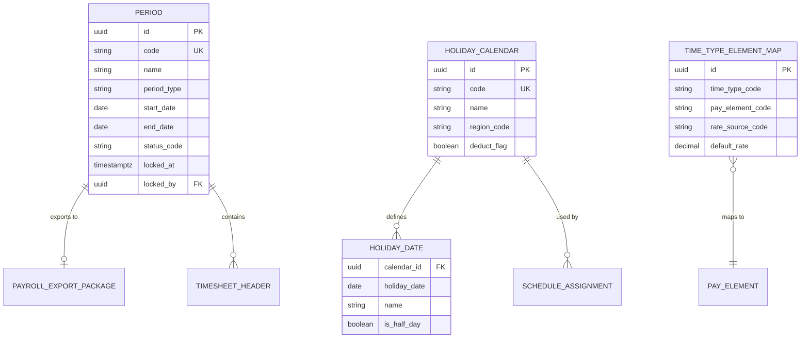
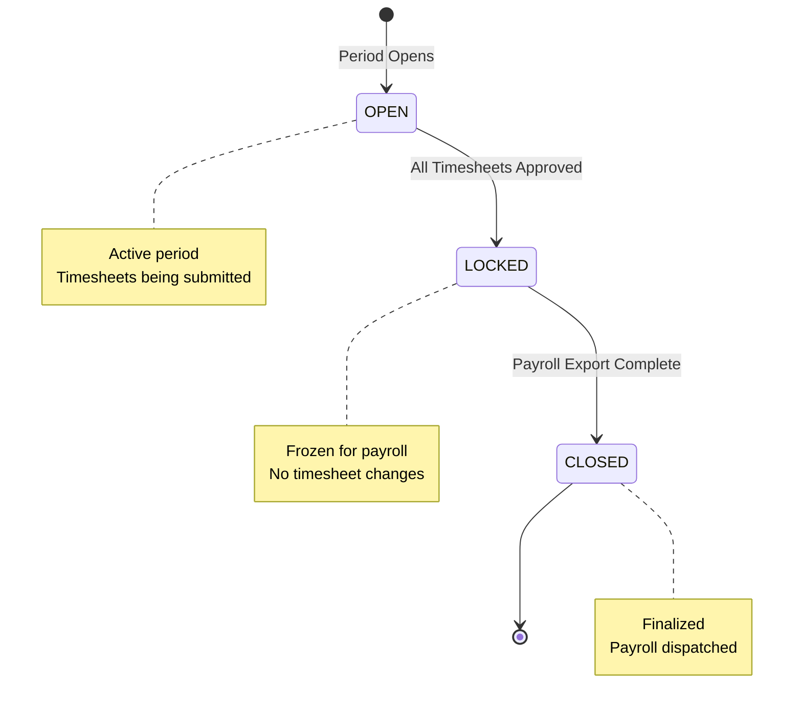
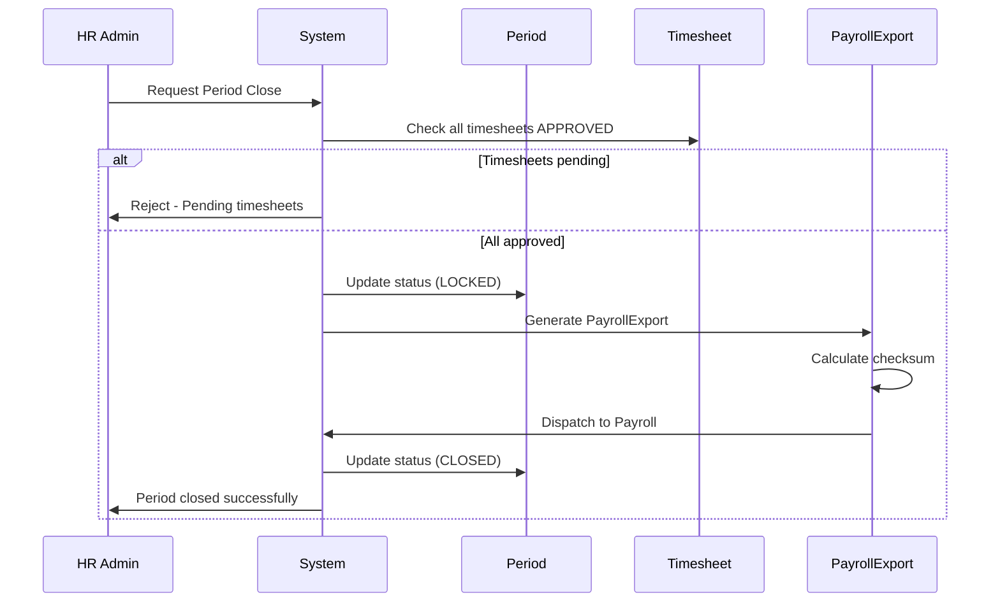
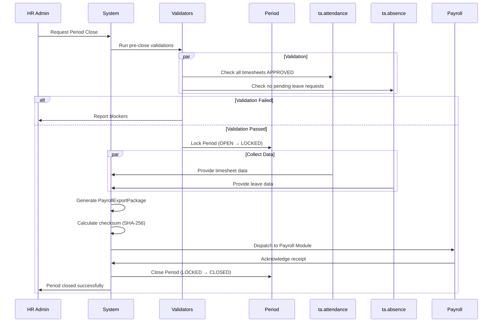

# Shared Model - Period, Calendar & Approval Services

**Bounded Context:** `ta.shared`  
**Tables:** 4  
**Last Updated:** 2026-04-01

---

## Overview

Shared model cung cấp services dùng chung cho cả Scheduling, Attendance và Absence:
- **Period Management**: Payroll period lifecycle
- **Holiday Calendar**: Public holidays tracking
- **Time Type Mapping**: Time types to payroll elements
- **Shared Services**: Schedule, Holiday base entities

---

## Key Concepts

### Shared Kernel

Các entities này được sử dụng read-only bởi các bounded contexts khác:
- `Period` - Used by Attendance (timesheet lifecycle)
- `HolidayCalendar` - Used by Absence (leave duration) and Attendance (OT rates)
- `TimeTypeElementMap` - Used by Payroll integration

### Cross-Context Integration

```
ta.shared
  ├── Period → ta.attendance (Timesheet lock)
  ├── HolidayCalendar → ta.absence (Leave calculation)
  ├── HolidayCalendar → ta.attendance (OT rate)
  └── TimeTypeElementMap → Payroll (Pay element mapping)
```

---

## Entity Relationship Diagram



---

## 1. Period Management

### Business Purpose

**Period** quản lý payroll period lifecycle - time window cho timesheet collection và payroll processing.

### Period States



| State | Description | Allowed Actions |
|-------|-------------|-----------------|
| `OPEN` | Period active | Timesheet submit/approve |
| `LOCKED` | Frozen for payroll | Payroll export only |
| `CLOSED` | Finalized | No changes |

### Period Types

| Type | Description | Typical Use |
|------|-------------|-------------|
| `MONTHLY` | Standard monthly payroll | Most companies |
| `CUSTOM` | Non-standard date range | Contract workers, projects |

### Business Rules

- Only one OPEN period per tenant at any time
- Period can only LOCK when all timesheets are APPROVED
- Period can only CLOSE when payroll export is complete
- State transitions are irreversible

### Sample Data

**Open Period:**
```json
{
  "id": "550e8400-e29b-41d4-a716-446655440301",
  "code": "2026-04",
  "name": "April 2026",
  "period_type": "MONTHLY",
  "start_date": "2026-04-01",
  "end_date": "2026-04-30",
  "status_code": "OPEN",
  "locked_at": null,
  "locked_by": null,
  "metadata": {}
}
```

**Locked Period:**
```json
{
  "id": "550e8400-e29b-41d4-a716-446655440302",
  "code": "2026-03",
  "name": "March 2026",
  "period_type": "MONTHLY",
  "start_date": "2026-03-01",
  "end_date": "2026-03-31",
  "status_code": "LOCKED",
  "locked_at": "2026-04-01T00:00:00Z",
  "locked_by": "HR_ADMIN_001"
}
```

**Closed Period:**
```json
{
  "id": "550e8400-e29b-41d4-a716-446655440303",
  "code": "2026-02",
  "name": "February 2026",
  "period_type": "MONTHLY",
  "start_date": "2026-02-01",
  "end_date": "2026-02-28",
  "status_code": "CLOSED",
  "locked_at": "2026-03-01T00:00:00Z",
  "locked_by": "HR_ADMIN_001"
}
```

### Period Close Flow



---

## 2. Holiday Calendar

### Business Purpose

**HolidayCalendar** defines public holidays for:
- Leave duration calculation (exclude holidays)
- OT rate determination (holiday OT = 300%)
- Schedule generation (override to OFF)

### Vietnam Statutory Holidays (VLC 2019, Article 112)

| Holiday | Date | Days |
|---------|------|------|
| New Year's Day | Jan 1 | 1 |
| Lunar New Year (Tet) | Variable | 5 |
| Hung Kings Day | Apr 14 (lunar) | 1 |
| Liberation Day | Apr 30 | 1 |
| Labor Day | May 1 | 1 |
| National Day | Sep 2 | 1 |
| **Total** | | **11 days** |

### Sample Data

**Holiday Calendar:**
```json
{
  "id": "550e8400-e29b-41d4-a716-446655440311",
  "code": "VN_2026",
  "name": "Vietnam Public Holidays 2026",
  "region_code": "VN",
  "deduct_flag": false,
  "metadata": {}
}
```

**Holiday Dates:**

```json
{
  "calendar_id": "550e8400-e29b-41d4-a716-446655440311",
  "holiday_date": "2026-01-01",
  "name": "New Year's Day",
  "is_half_day": false
}
```

```json
{
  "calendar_id": "550e8400-e29b-41d4-a716-446655440311",
  "holiday_date": "2026-01-28",
  "name": "Lunar New Year Eve",
  "is_half_day": false
}
```

```json
{
  "calendar_id": "550e8400-e29b-41d4-a716-446655440311",
  "holiday_date": "2026-01-29",
  "name": "Lunar New Year Day 1",
  "is_half_day": false
}
```

```json
{
  "calendar_id": "550e8400-e29b-41d4-a716-446655440311",
  "holiday_date": "2026-04-30",
  "name": "Liberation Day",
  "is_half_day": false
}
```

```json
{
  "calendar_id": "550e8400-e29b-41d4-a716-446655440311",
  "holiday_date": "2026-05-01",
  "name": "International Labor Day",
  "is_half_day": false
}
```

```json
{
  "calendar_id": "550e8400-e29b-41d4-a716-446655440311",
  "holiday_date": "2026-09-02",
  "name": "National Day",
  "is_half_day": false
}
```

### Usage Examples

**Leave Duration Calculation:**
```
Employee requests leave: 2026-04-28 (Tue) to 2026-05-04 (Mon)

Calendar days: 7 days
Holidays in range:
  - 2026-04-30: Liberation Day
  - 2026-05-01: Labor Day

Working days: 7 - 2 = 5 days (deduct from balance)
```

**OT Rate Determination:**
```
Employee works OT on 2026-04-30

Check HolidayCalendar:
  - 2026-04-30 is a public holiday

OT rate: 300% (PUBLIC_HOLIDAY rate per VLC Art. 98)
```

---

## 3. Time Type Element Map

### Business Purpose

**TimeTypeElementMap** maps time types (REG, OT1.5, ANL, etc.) to payroll pay elements, with rate source configuration.

### Rate Sources

| Source | Description | Use Case |
|--------|-------------|----------|
| `COMPONENT_DEF` | Use pay_component_def.formula_json | Global rate |
| `EMPLOYEE_SNAPSHOT` | Use employee_comp_snapshot | Personalized rate |
| `FIXED` | Use default_rate on record | Simple fixed rate |
| `FORMULA` | Use pay_element.formula_json | Dynamic calculation |

### Sample Data

**Regular Hours:**
```json
{
  "id": "550e8400-e29b-41d4-a716-446655440321",
  "time_type_code": "REG",
  "pay_element_code": "REGULAR_HOURS",
  "rate_source_code": "EMPLOYEE_SNAPSHOT",
  "default_rate": null,
  "rate_currency": null,
  "rate_unit": "PER_HOUR",
  "description": "Regular working hours",
  "is_active": true,
  "effective_start": "2025-01-01"
}
```

**Overtime 150%:**
```json
{
  "id": "550e8400-e29b-41d4-a716-446655440322",
  "time_type_code": "OT1.5",
  "pay_element_code": "OVERTIME_150",
  "rate_source_code": "FORMULA",
  "default_rate": 1.50,
  "rate_currency": null,
  "rate_unit": "MULTIPLIER",
  "description": "Weekday overtime - 150% per VLC Art. 98",
  "is_active": true,
  "effective_start": "2025-01-01"
}
```

**Overtime 200%:**
```json
{
  "id": "550e8400-e29b-41d4-a716-446655440323",
  "time_type_code": "OT2.0",
  "pay_element_code": "OVERTIME_200",
  "rate_source_code": "FORMULA",
  "default_rate": 2.00,
  "rate_unit": "MULTIPLIER",
  "description": "Weekend overtime - 200% per VLC Art. 98",
  "is_active": true
}
```

**Overtime 300%:**
```json
{
  "id": "550e8400-e29b-41d4-a716-446655440324",
  "time_type_code": "OT3.0",
  "pay_element_code": "OVERTIME_300",
  "rate_source_code": "FORMULA",
  "default_rate": 3.00,
  "rate_unit": "MULTIPLIER",
  "description": "Public holiday overtime - 300% per VLC Art. 98",
  "is_active": true
}
```

**Annual Leave:**
```json
{
  "id": "550e8400-e29b-41d4-a716-446655440325",
  "time_type_code": "ANL",
  "pay_element_code": "ANNUAL_LEAVE_PAID",
  "rate_source_code": "EMPLOYEE_SNAPSHOT",
  "rate_unit": "PER_DAY",
  "description": "Annual leave paid days",
  "is_active": true
}
```

**Night Differential:**
```json
{
  "id": "550e8400-e29b-41d4-a716-446655440326",
  "time_type_code": "NIGHT_PREM",
  "pay_element_code": "NIGHT_DIFFERENTIAL",
  "rate_source_code": "FIXED",
  "default_rate": 0.30,
  "rate_unit": "MULTIPLIER",
  "description": "Night shift premium - 30% additional",
  "is_active": true
}
```

---

## 4. Shared Schedule

### Business Purpose

**Schedule** defines working schedule configuration shared across contexts.

### Sample Data

```json
{
  "id": "550e8400-e29b-41d4-a716-446655440331",
  "code": "STANDARD_40H",
  "name": "Standard 40-hour Week",
  "working_days": ["MON", "TUE", "WED", "THU", "FRI"],
  "hours_per_day": 8.0,
  "is_active": true,
  "effective_start": "2025-01-01"
}
```

---

## 5. Shared Period Profile

### Business Purpose

**PeriodProfile** defines period types for accrual, carryover calculations.

### Period Types

| Type | Description | Use Case |
|------|-------------|----------|
| `CALENDAR_YEAR` | Jan 1 - Dec 31 | Annual leave year |
| `FISCAL_YEAR` | Custom fiscal year | Financial reporting |
| `HIRE_ANNIVERSARY` | Based on hire date | Seniority calculations |

### Sample Data

```json
{
  "id": "550e8400-e29b-41d4-a716-446655440341",
  "code": "CALENDAR_YEAR",
  "name": "Calendar Year",
  "period_type": "CALENDAR_YEAR",
  "start_month": null,
  "start_day": null,
  "is_active": true
}
```

```json
{
  "id": "550e8400-e29b-41d4-a716-446655440342",
  "code": "FISCAL_YEAR_JUL",
  "name": "Fiscal Year (July Start)",
  "period_type": "FISCAL_YEAR",
  "start_month": 7,
  "start_day": 1,
  "is_active": true
}
```

---

## Integration Patterns

### Upstream Dependencies

| Source | Event | Data Consumed |
|--------|-------|---------------|
| Employee Central | EmployeeHired | Employee start date, org unit |
| Employee Central | EmployeeTerminated | Termination date |
| Employee Central | EmployeeTransferred | Org changes |

### Downstream Dependencies

| Target | Event | Data Provided |
|--------|-------|---------------|
| ta.attendance | PeriodClosed | Timesheet lock trigger |
| ta.absence | HolidayCalendarPublished | Leave duration calculation |
| ta.attendance | HolidayCalendarPublished | OT rate determination |
| Payroll Module | PayrollExportGenerated | Period export |

---

## Workflow: Period Close

### Pre-conditions

1. All timesheets in period are APPROVED
2. No pending leave requests with dates in period
3. No unresolved attendance exceptions

### Process



---

## Business Rules Summary

### Period Management

| Rule | Description |
|------|-------------|
| Single Open Period | Only one OPEN period per tenant |
| Timesheet Requirement | All timesheets must be APPROVED before lock |
| Irreversible Transitions | OPEN → LOCKED → CLOSED (no rollback) |
| Idempotent Export | Re-running export produces identical result |

### Holiday Calendar

| Rule | Description |
|------|-------------|
| Unique per Date | One holiday per calendar per date |
| Region Code Required | VN-N, VN-S, US, etc. |
| Half-day Support | is_half_day flag for partial holidays |

### Time Type Mapping

| Rule | Description |
|------|-------------|
| Unique Mapping | One time_type_code per pay_element_code |
| Effective Dating | Valid during effective_start/end range |
| Rate Source Required | COMPONENT_DEF, EMPLOYEE_SNAPSHOT, FIXED, or FORMULA |

---

## Summary

| Entity | Purpose | Key Features |
|--------|---------|--------------|
| **Period** | Payroll period lifecycle | OPEN/LOCKED/CLOSED states |
| **HolidayCalendar** | Public holidays | Region-specific, 11 days for VN |
| **HolidayDate** | Individual holidays | Date + name + half-day flag |
| **TimeTypeElementMap** | TA → Payroll mapping | Rate source configuration |
| **Schedule** | Working schedule config | Working days, hours per day |
| **PeriodProfile** | Period types | Calendar/Fiscal/Hire anniversary |

---

*Next: [05-entity-reference.md](./05-entity-reference.md) - Technical Entity Reference*