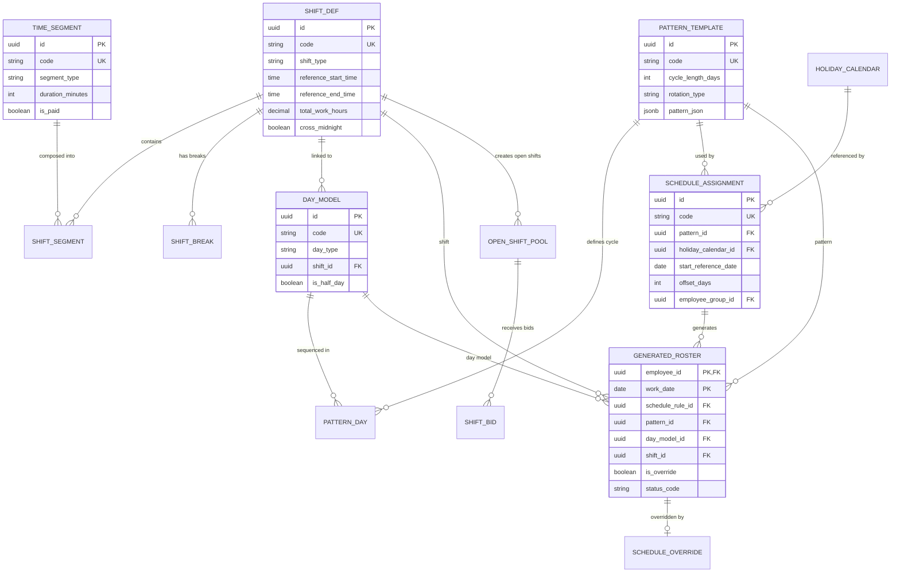
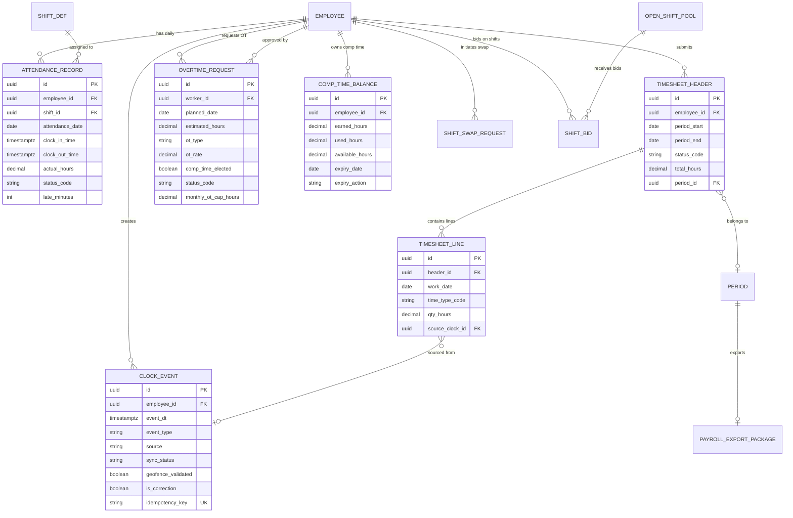
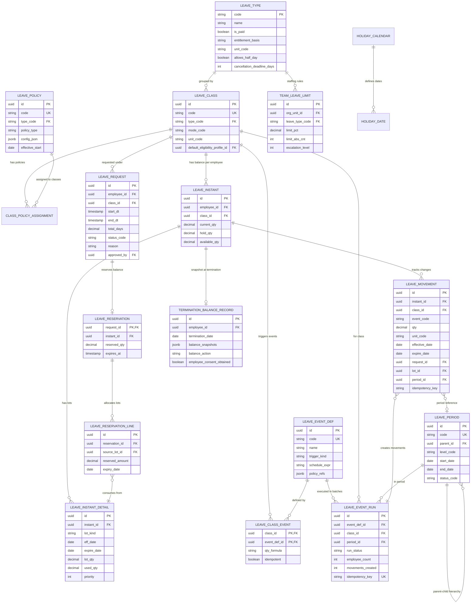
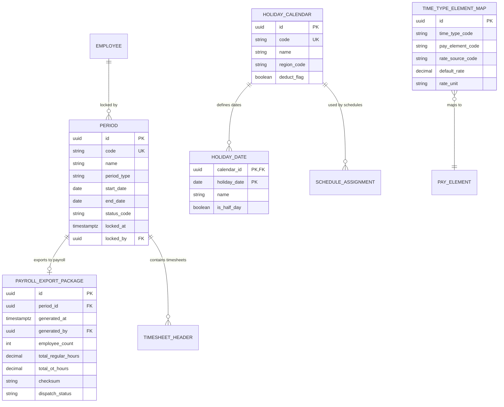
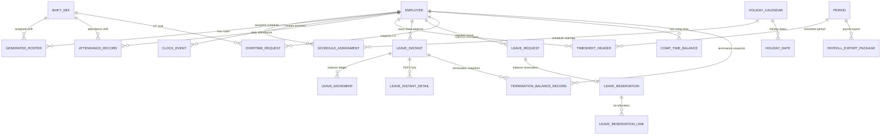
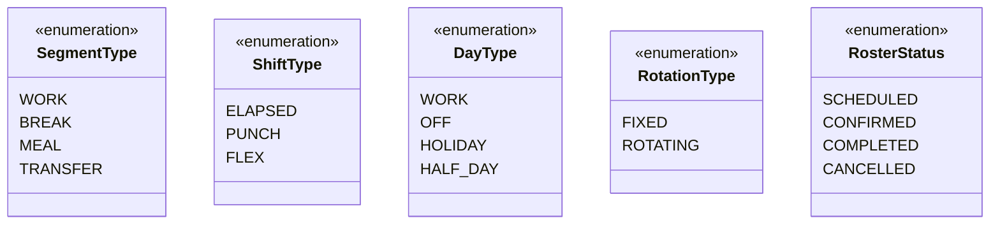
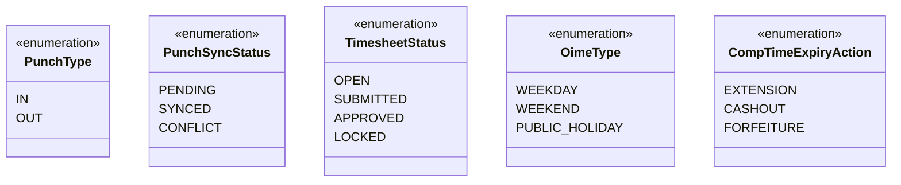
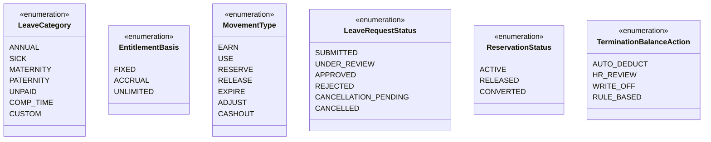
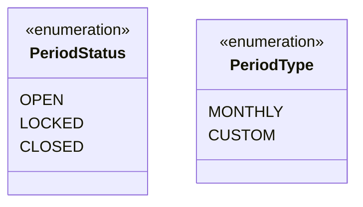

# ERD Diagrams - Complete Collection

**Purpose:** Visual relationship diagrams cho từng bounded context  
**Last Updated:** 2026-04-01

---

## How to Read These Diagrams

**Mermaid ERD Notation:**
- `||--o{` : One-to-Many
- `||--||` : One-to-One
- `}o--||` : Many-to-One (FK)
- `||--o{` : One-to-Many with ownership

**Legend:**
- **Bold entities** = Critical tables
- *Italic fields* = Primary Key
- Regular fields = Important columns only

---

## 1. Scheduling ERD (6-Level Hierarchy)



### Scheduling Data Flow

```
Level 1: TIME_SEGMENT (atomic unit)
         ↓ compose
Level 2: SHIFT_DEF (combination of segments)
         ↓ link
Level 3: DAY_MODEL (what happens on 1 day)
         ↓ sequence
Level 4: PATTERN_TEMPLATE (repeating cycle)
         ↓ configure
Level 5: SCHEDULE_ASSIGNMENT (WHO gets WHICH pattern)
         ↓ generate
Level 6: GENERATED_ROSTER (1 row per employee per day)
```

---

## 2. Attendance ERD (Punch → Timesheet)



### Attendance States

**ClockEvent Sync Status:**
```
PENDING → SYNCED
        ↘ CONFLICT (requires resolution)
```

**Timesheet Status:**
```
OPEN → SUBMITTED → APPROVED → LOCKED
                    ↓
                 REJECTED
```

**OvertimeRequest Status:**
```
PENDING → APPROVED → (Work Completed)
        ↘ REJECTED
```

---

## 3. Absence ERD (Leave Management)



### Absence Balance Flow

```
LeaveInstant (Balance Snapshot)
    ├── current_qty = SUM(EARN movements) - SUM(USE movements)
    ├── hold_qty = SUM(RESERVE movements) - SUM(RELEASE movements)
    └── available_qty = current_qty - hold_qty

LeaveInstantDetail (FEFO Lots)
    ├── Lot A: 3 days, expires 2026-03-31, priority=50
    └── Lot B: 14 days, expires 2026-12-31, priority=100

Reservation (FEFO Consumption)
    ├── Line 1: 3 days from Lot A (earliest expiry)
    └── Line 2: 1 day from Lot B
```

### Event Processing Flow

```
LeaveEventDef (Event Type)
    └── LeaveClassEvent (Class-Event Mapping + Formula)
        └── LeaveEventRun (Batch Execution)
            └── LeaveMovement (Balance Change)
                └── LeaveInstant (Updated Balance)
```

---

## 4. Shared ERD (Period, Calendar, Mapping)



### Period Lifecycle

```
OPEN (Active)
  ↓ All timesheets APPROVED
LOCKED (Frozen for payroll)
  ↓ Payroll export complete
CLOSED (Finalized)
```

---

## 5. Cross-Context Integration



---

## 6. Enums Reference

### Scheduling Enums



### Attendance Enums



### Absence Enums



### Shared Enums



---

## 7. Key Relationships Summary

| From | To | Relationship | Business Meaning |
|------|----|--------------|--------------------|
| ShiftDef | TimeSegment | 1:N (via ShiftSegment) | Shift composed of segments |
| DayModel | ShiftDef | N:1 | Day model links to shift |
| PatternTemplate | DayModel | 1:N (via PatternDay) | Pattern sequences day models |
| ScheduleAssignment | PatternTemplate | N:1 | Rule uses pattern |
| GeneratedRoster | ScheduleAssignment | N:1 | Roster generated from rule |
| ClockEvent | Employee | N:1 | Employee creates punches |
| TimesheetHeader | Period | N:1 | Timesheet belongs to period |
| LeaveRequest | LeaveClass | N:1 | Request under leave class |
| LeaveMovement | LeaveInstant | N:1 | Movement tracks balance |
| LeaveReservation | LeaveInstantDetail | N:M (via Line) | Reservation consumes lots |

---

## 8. Index Strategy

### High-Performance Queries

**ClockEvent:**
- `(employee_id, event_dt)` - Query punches by employee over time
- `(idempotency_key)` UK - Prevent duplicate syncs
- `(employee_id, sync_status)` - Query pending syncs

**GeneratedRoster:**
- `(employee_id, work_date)` UK - One roster per employee per day
- `(schedule_rule_id, work_date)` - Query by rule
- `(work_date)` - Query all rosters for a date

**LeaveMovement:**
- `(instant_id, effective_date)` - Query movements by instant over time
- `(class_id, event_code, effective_date)` - Query by event type
- `(request_id)` - Query movements for a request
- `(idempotency_key)` - Idempotent accrual

**TimesheetHeader:**
- `(employee_id, period_start)` - Query timesheet by employee
- `(period_id)` - Query all timesheets in period

---

*Next: [07-workflow-diagrams.md](./07-workflow-diagrams.md) - State Machines & Workflows*