# Workflow Diagrams - State Machines & Process Flows

**Purpose:** Visual workflows và state machines cho TA module  
**Last Updated:** 2026-04-01

---

## 1. Roster Generation Flow

### Process Flow

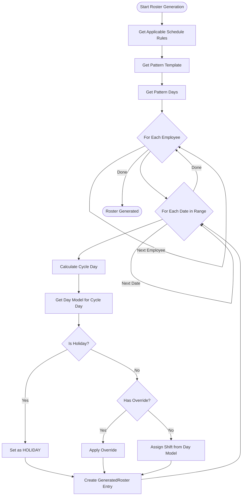
```mermaid
flowchart TD
    Start([Start Roster Generation]) --> GetRules[Get Applicable Schedule Rules]
    GetRules --> GetPattern[Get Pattern Template]
    GetPattern --> GetDays[Get Pattern Days]
    
    GetDays --> LoopEmployees{For Each Employee}
    LoopEmployees --> LoopDates{For Each Date in Range}
    
    LoopDates --> CalcCycleDay[Calculate Cycle Day]
    CalcCycleDay --> GetDayModel[Get Day Model for Cycle Day]
    GetDayModel --> CheckHoliday{Is Holiday?}
    
    CheckHoliday -->|Yes| SetHoliday[Set as HOLIDAY]
    CheckHoliday -->|No| CheckOverride{Has Override?}
    
    CheckOverride -->|Yes| ApplyOverride[Apply Override]
    CheckOverride -->|No| AssignShift[Assign Shift from Day Model]
    
    SetHoliday --> CreateRoster[Create GeneratedRoster Entry]
    ApplyOverride --> CreateRoster
    AssignShift --> CreateRoster
    
    CreateRoster --> LoopDates
    LoopDates -->|Next Date| LoopDates
    LoopDates -->|Done| LoopEmployees
    LoopEmployees -->|Next Employee| LoopEmployees
    LoopEmployees -->|Done| End([Roster Generated])
```

### Rotation Offset Calculation

```
cycleDay = (date - startReferenceDate + offsetDays) % cycleLengthDays

Example:
  Pattern: 21-day cycle
  startReferenceDate: 2025-01-01 (Wednesday)
  offsetDays: 7 (Crew B)
  queryDate: 2025-01-08 (Wednesday)

  daysDiff = 2025-01-08 - 2025-01-01 = 7 days
  cycleDay = (7 + 7) % 21 = 14

  Pattern Day 14 = Day Model for that position
```

---

## 2. Punch → Timesheet Flow

### Clock Event Processing

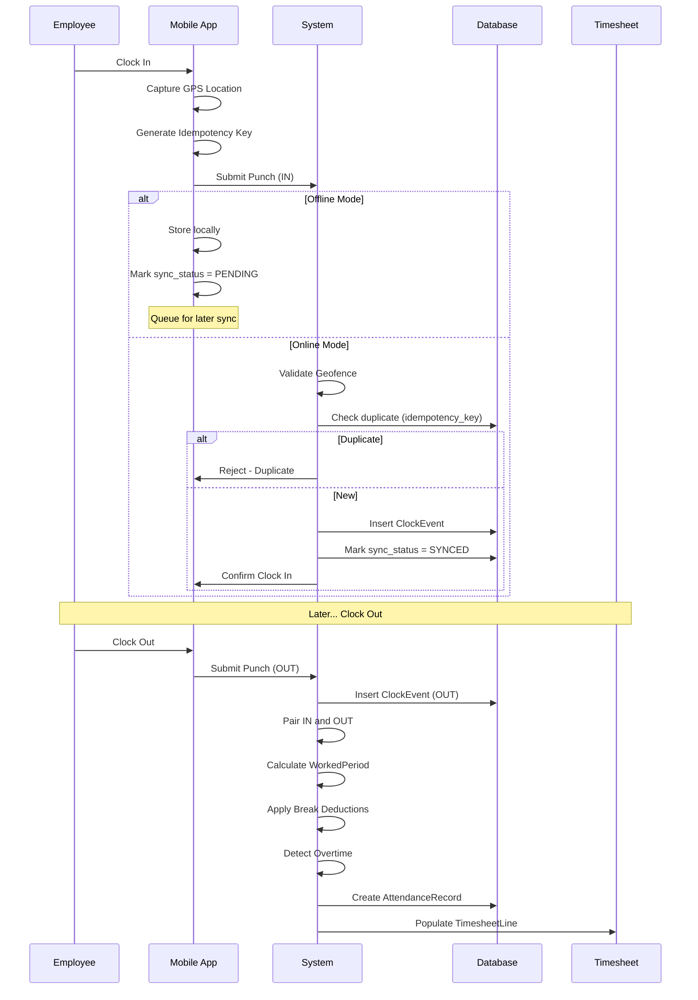
```mermaid
sequenceDiagram
    participant E as Employee
    participant M as Mobile App
    participant S as System
    participant DB as Database
    participant T as Timesheet
    
    E->>M: Clock In
    M->>M: Capture GPS Location
    M->>M: Generate Idempotency Key
    M->>S: Submit Punch (IN)
    
    alt Offline Mode
        M->>M: Store locally
        M->>M: Mark sync_status = PENDING
        Note over M: Queue for later sync
    else Online Mode
        S->>S: Validate Geofence
        S->>DB: Check duplicate (idempotency_key)
        alt Duplicate
            S->>M: Reject - Duplicate
        else New
            S->>DB: Insert ClockEvent
            S->>DB: Mark sync_status = SYNCED
            S->>M: Confirm Clock In
        end
    end
    
    Note over E,T: Later... Clock Out
    
    E->>M: Clock Out
    M->>S: Submit Punch (OUT)
    S->>DB: Insert ClockEvent (OUT)
    S->>S: Pair IN and OUT
    S->>S: Calculate WorkedPeriod
    S->>S: Apply Break Deductions
    S->>S: Detect Overtime
    S->>DB: Create AttendanceRecord
    S->>T: Populate TimesheetLine
```

### Worked Period Calculation

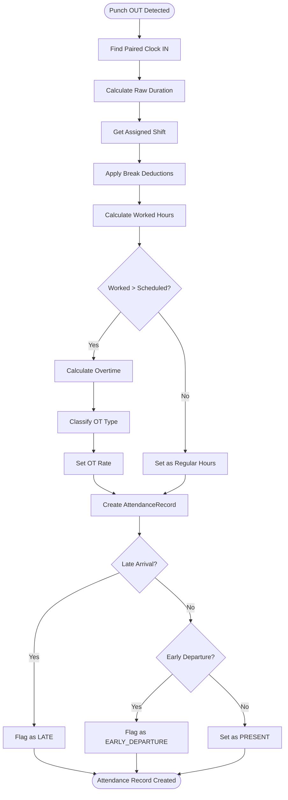
```mermaid
flowchart TD
    Start([Punch OUT Detected]) --> GetPair[Find Paired Clock IN]
    GetPair --> CalcRaw[Calculate Raw Duration]
    CalcRaw --> GetShift[Get Assigned Shift]
    GetShift --> ApplyBreak[Apply Break Deductions]
    ApplyBreak --> CalcWorked[Calculate Worked Hours]
    
    CalcWorked --> CheckOT{Worked > Scheduled?}
    CheckOT -->|Yes| CalcOT[Calculate Overtime]
    CheckOT -->|No| SetRegular[Set as Regular Hours]
    
    CalcOT --> ClassifyOT[Classify OT Type]
    ClassifyOT --> SetOTRate[Set OT Rate]
    SetOTRate --> CreateRecord[Create AttendanceRecord]
    SetRegular --> CreateRecord
    
    CreateRecord --> CheckLate{Late Arrival?}
    CheckLate -->|Yes| FlagLate[Flag as LATE]
    CheckLate -->|No| CheckEarly{Early Departure?}
    
    CheckEarly -->|Yes| FlagEarly[Flag as EARLY_DEPARTURE]
    CheckEarly -->|No| SetPresent[Set as PRESENT]
    
    FlagLate --> End([Attendance Record Created])
    FlagEarly --> End
    SetPresent --> End
```

### Overtime Rate Classification

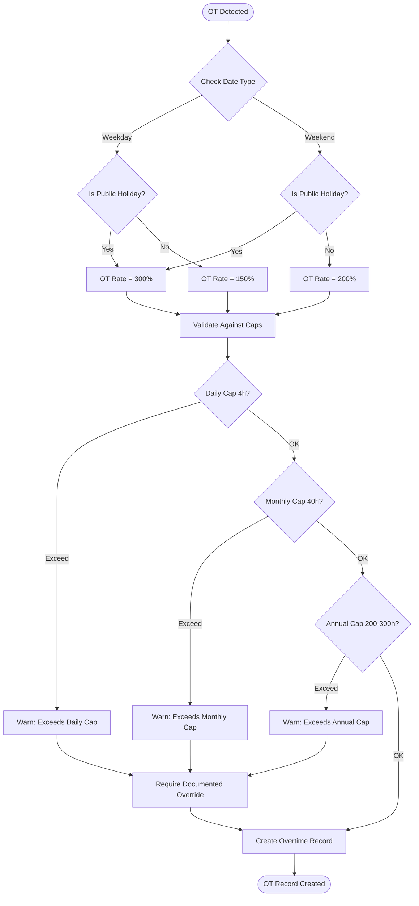
```mermaid
flowchart TD
    Start([OT Detected]) --> CheckDate{Check Date Type}
    
    CheckDate -->|Weekday| CheckHoliday1{Is Public Holiday?}
    CheckDate -->|Weekend| CheckHoliday2{Is Public Holiday?}
    
    CheckHoliday1 -->|Yes| SetRate300[OT Rate = 300%]
    CheckHoliday1 -->|No| SetRate150[OT Rate = 150%]
    
    CheckHoliday2 -->|Yes| SetRate300
    CheckHoliday2 -->|No| SetRate200[OT Rate = 200%]
    
    SetRate150 --> ValidateCap[Validate Against Caps]
    SetRate200 --> ValidateCap
    SetRate300 --> ValidateCap
    
    ValidateCap --> CheckDaily{Daily Cap 4h?}
    CheckDaily -->|Exceed| WarnDaily[Warn: Exceeds Daily Cap]
    CheckDaily -->|OK| CheckMonthly{Monthly Cap 40h?}
    
    CheckMonthly -->|Exceed| WarnMonthly[Warn: Exceeds Monthly Cap]
    CheckMonthly -->|OK| CheckAnnual{Annual Cap 200-300h?}
    
    CheckAnnual -->|Exceed| WarnAnnual[Warn: Exceeds Annual Cap]
    CheckAnnual -->|OK| CreateOT[Create Overtime Record]
    
    WarnDaily --> RequireOverride[Require Documented Override]
    WarnMonthly --> RequireOverride
    WarnAnnual --> RequireOverride
    RequireOverride --> CreateOT
    
    CreateOT --> End([OT Record Created])
```

---

## 3. Leave Request Workflow

### Request Lifecycle State Machine

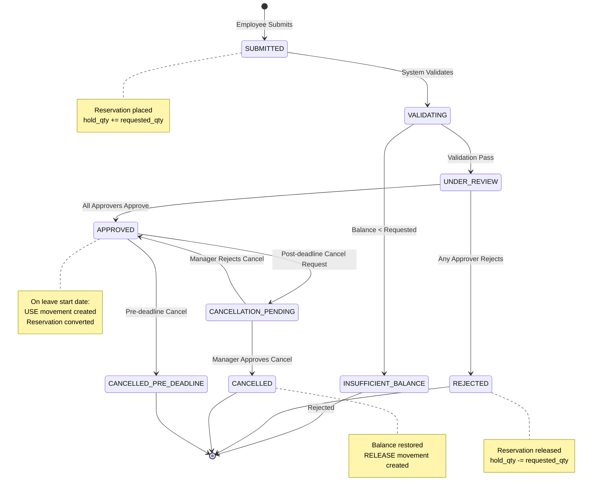
```mermaid
stateDiagram-v2
    [*] --> SUBMITTED : Employee Submits
    
    SUBMITTED --> VALIDATING : System Validates
    
    VALIDATING --> INSUFFICIENT_BALANCE : Balance < Requested
    VALIDATING --> UNDER_REVIEW : Validation Pass
    
    INSUFFICIENT_BALANCE --> [*] : Rejected
    
    UNDER_REVIEW --> APPROVED : All Approvers Approve
    UNDER_REVIEW --> REJECTED : Any Approver Rejects
    
    APPROVED --> CANCELLATION_PENDING : Post-deadline Cancel Request
    APPROVED --> CANCELLED_PRE_DEADLINE : Pre-deadline Cancel
    
    CANCELLATION_PENDING --> CANCELLED : Manager Approves Cancel
    CANCELLATION_PENDING --> APPROVED : Manager Rejects Cancel
    
    REJECTED --> [*]
    CANCELLED --> [*]
    CANCELLED_PRE_DEADLINE --> [*]
    
    note right of SUBMITTED
        Reservation placed
        hold_qty += requested_qty
    end note
    
    note right of APPROVED
        On leave start date:
        USE movement created
        Reservation converted
    end note
    
    note right of REJECTED
        Reservation released
        hold_qty -= requested_qty
    end note
    
    note right of CANCELLED
        Balance restored
        RELEASE movement created
    end note
```

### Balance Reservation Flow

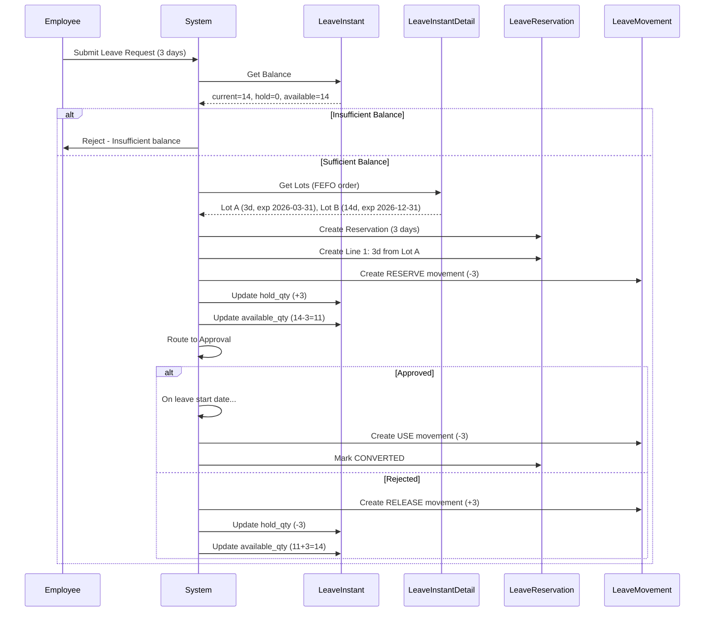
```mermaid
sequenceDiagram
    participant E as Employee
    participant S as System
    participant LI as LeaveInstant
    participant LID as LeaveInstantDetail
    participant LR as LeaveReservation
    participant LM as LeaveMovement
    
    E->>S: Submit Leave Request (3 days)
    S->>LI: Get Balance
    LI-->>S: current=14, hold=0, available=14
    
    alt Insufficient Balance
        S->>E: Reject - Insufficient balance
    else Sufficient Balance
        S->>LID: Get Lots (FEFO order)
        LID-->>S: Lot A (3d, exp 2026-03-31), Lot B (14d, exp 2026-12-31)
        
        S->>LR: Create Reservation (3 days)
        S->>LR: Create Line 1: 3d from Lot A
        
        S->>LM: Create RESERVE movement (-3)
        S->>LI: Update hold_qty (+3)
        S->>LI: Update available_qty (14-3=11)
        
        S->>S: Route to Approval
        
        alt Approved
            S->>S: On leave start date...
            S->>LM: Create USE movement (-3)
            S->>LR: Mark CONVERTED
        else Rejected
            S->>LM: Create RELEASE movement (+3)
            S->>LI: Update hold_qty (-3)
            S->>LI: Update available_qty (11+3=14)
        end
    end
```

### Cancellation Flow

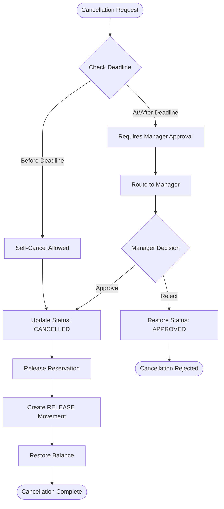
```mermaid
flowchart TD
    Start([Cancellation Request]) --> CheckDeadline{Check Deadline}
    
    CheckDeadline -->|Before Deadline| SelfCancel[Self-Cancel Allowed]
    CheckDeadline -->|At/After Deadline| ManagerApproval[Requires Manager Approval]
    
    SelfCancel --> UpdateStatus1[Update Status: CANCELLED]
    ManagerApproval --> RouteManager[Route to Manager]
    
    RouteManager --> ManagerDecision{Manager Decision}
    ManagerDecision -->|Approve| UpdateStatus1
    ManagerDecision -->|Reject| RestoreStatus[Restore Status: APPROVED]
    
    UpdateStatus1 --> ReleaseReservation[Release Reservation]
    ReleaseReservation --> CreateMovement[Create RELEASE Movement]
    CreateMovement --> RestoreBalance[Restore Balance]
    RestoreBalance --> End([Cancellation Complete])
    
    RestoreStatus --> End2([Cancellation Rejected])
```

---

## 4. Event-Driven Batch Processing

### Leave Event Run Flow

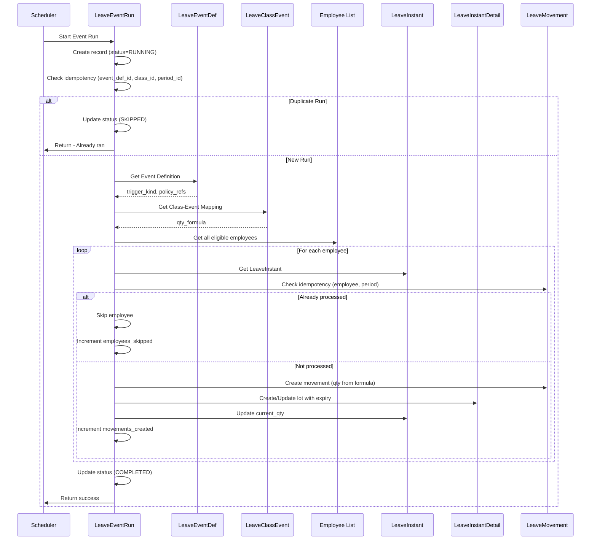
```mermaid
sequenceDiagram
    participant S as Scheduler
    participant ER as LeaveEventRun
    participant ED as LeaveEventDef
    participant CE as LeaveClassEvent
    participant E as Employee List
    participant LI as LeaveInstant
    participant LID as LeaveInstantDetail
    participant LM as LeaveMovement
    
    S->>ER: Start Event Run
    ER->>ER: Create record (status=RUNNING)
    ER->>ER: Check idempotency (event_def_id, class_id, period_id)
    
    alt Duplicate Run
        ER->>ER: Update status (SKIPPED)
        ER->>S: Return - Already ran
    else New Run
        ER->>ED: Get Event Definition
        ED-->>ER: trigger_kind, policy_refs
        
        ER->>CE: Get Class-Event Mapping
        CE-->>ER: qty_formula
        
        ER->>E: Get all eligible employees
        
        loop For each employee
            ER->>LI: Get LeaveInstant
            ER->>LM: Check idempotency (employee, period)
            
            alt Already processed
                ER->>ER: Skip employee
                ER->>ER: Increment employees_skipped
            else Not processed
                ER->>LM: Create movement (qty from formula)
                ER->>LID: Create/Update lot with expiry
                ER->>LI: Update current_qty
                ER->>ER: Increment movements_created
            end
        end
        
        ER->>ER: Update status (COMPLETED)
        ER->>S: Return success
    end
```

### Event Types

| Event Code | Trigger | Description |
|------------|---------|-------------|
| `ACCRUAL` | SCHEDULED | Monthly accrual batch |
| `CARRY` | SCHEDULED | Year-end carryover |
| `EXPIRE` | SCHEDULED | Balance expiry processing |
| `RESET_LIMIT` | SCHEDULED | Reset usage limits |
| `OT_EARN` | EVENT | OT converted to comp time |

### Accrual Calculation Methods

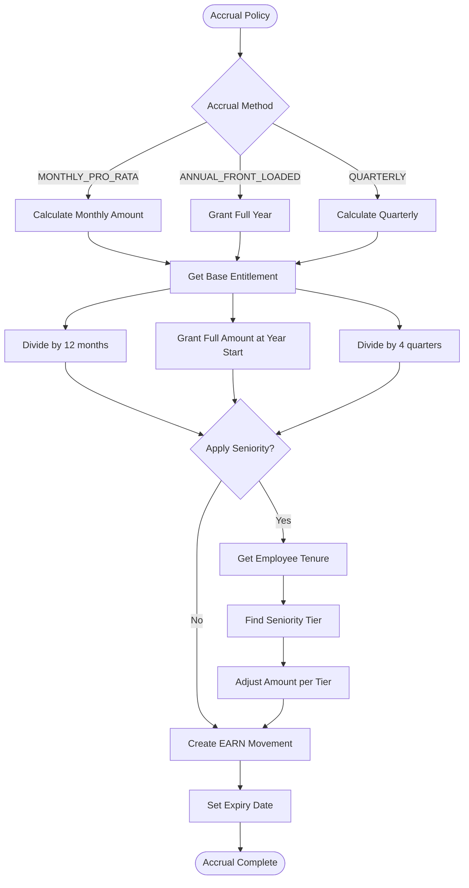
```mermaid
flowchart TD
    Start([Accrual Policy]) --> CheckMethod{Accrual Method}
    
    CheckMethod -->|MONTHLY_PRO_RATA| CalcMonthly[Calculate Monthly Amount]
    CheckMethod -->|ANNUAL_FRONT_LOADED| CalcAnnual[Grant Full Year]
    CheckMethod -->|QUARTERLY| CalcQuarterly[Calculate Quarterly]
    
    CalcMonthly --> GetBase[Get Base Entitlement]
    GetBase --> Divide[Divide by 12 months]
    Divide --> ApplySeniority{Apply Seniority?}
    
    CalcAnnual --> GetBase
    GetBase --> GrantFull[Grant Full Amount at Year Start]
    GrantFull --> ApplySeniority
    
    CalcQuarterly --> GetBase
    GetBase --> DivideQ[Divide by 4 quarters]
    DivideQ --> ApplySeniority
    
    ApplySeniority -->|Yes| GetTenure[Get Employee Tenure]
    ApplySeniority -->|No| CreateMovement[Create EARN Movement]
    
    GetTenure --> FindTier[Find Seniority Tier]
    FindTier --> AdjustAmount[Adjust Amount per Tier]
    AdjustAmount --> CreateMovement
    
    CreateMovement --> SetExpiry[Set Expiry Date]
    SetExpiry --> End([Accrual Complete])
```

---

## 5. Period Close Flow

### Period Lifecycle

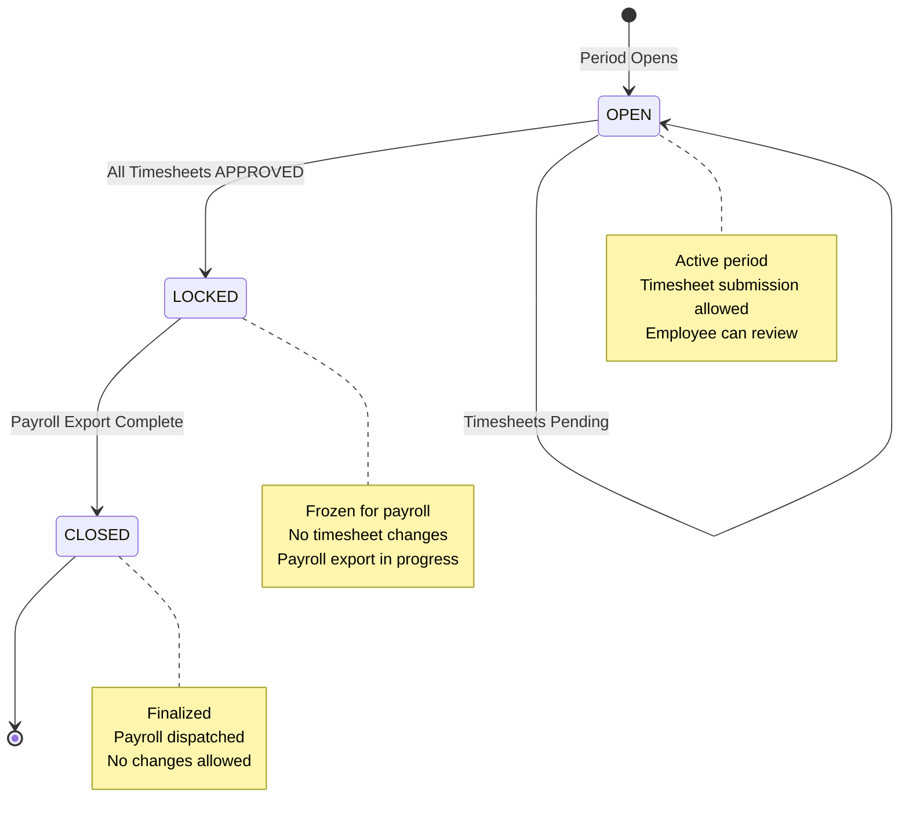
```mermaid
stateDiagram-v2
    [*] --> OPEN : Period Opens
    
    OPEN --> LOCKED : All Timesheets APPROVED
    OPEN --> OPEN : Timesheets Pending
    
    LOCKED --> CLOSED : Payroll Export Complete
    
    CLOSED --> [*]
    
    note right of OPEN
        Active period
        Timesheet submission allowed
        Employee can review
    end note
    
    note right of LOCKED
        Frozen for payroll
        No timesheet changes
        Payroll export in progress
    end note
    
    note right of CLOSED
        Finalized
        Payroll dispatched
        No changes allowed
    end note
```

### Period Close Process

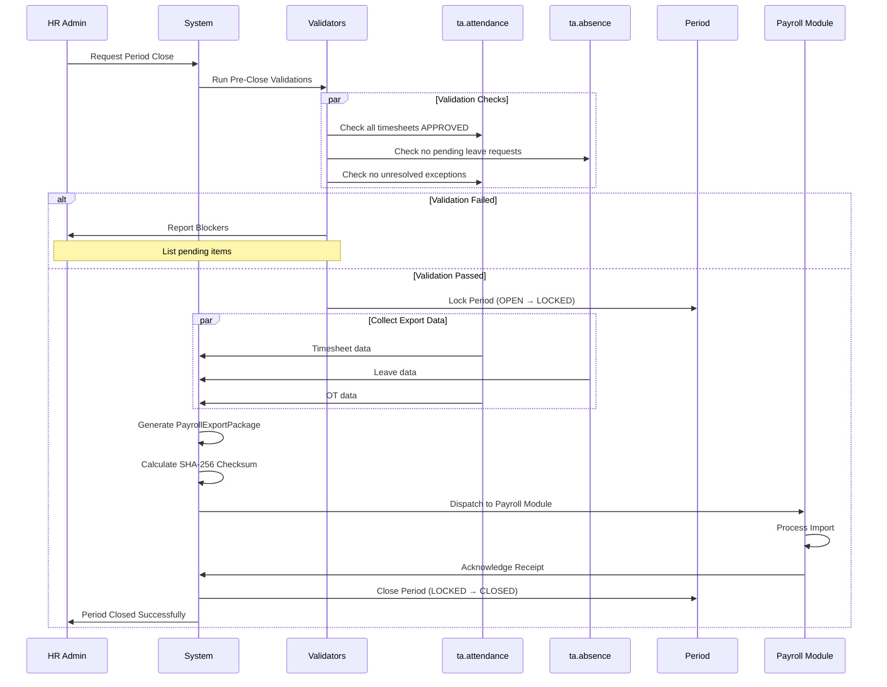
```mermaid
sequenceDiagram
    participant HR as HR Admin
    participant S as System
    participant V as Validators
    participant ATT as ta.attendance
    participant ABS as ta.absence
    participant P as Period
    participant PAY as Payroll Module
    
    HR->>S: Request Period Close
    S->>V: Run Pre-Close Validations
    
    par Validation Checks
        V->>ATT: Check all timesheets APPROVED
        V->>ABS: Check no pending leave requests
        V->>ATT: Check no unresolved exceptions
    end
    
    alt Validation Failed
        V->>HR: Report Blockers
        Note over V,HR: List pending items
    else Validation Passed
        V->>P: Lock Period (OPEN → LOCKED)
        
        par Collect Export Data
            ATT->>S: Timesheet data
            ABS->>S: Leave data
            ATT->>S: OT data
        end
        
        S->>S: Generate PayrollExportPackage
        S->>S: Calculate SHA-256 Checksum
        
        S->>PAY: Dispatch to Payroll Module
        PAY->>PAY: Process Import
        PAY->>S: Acknowledge Receipt
        
        S->>P: Close Period (LOCKED → CLOSED)
        S->>HR: Period Closed Successfully
    end
```

---

## 6. Comp Time Lifecycle

### Comp Time Accrual & Expiry

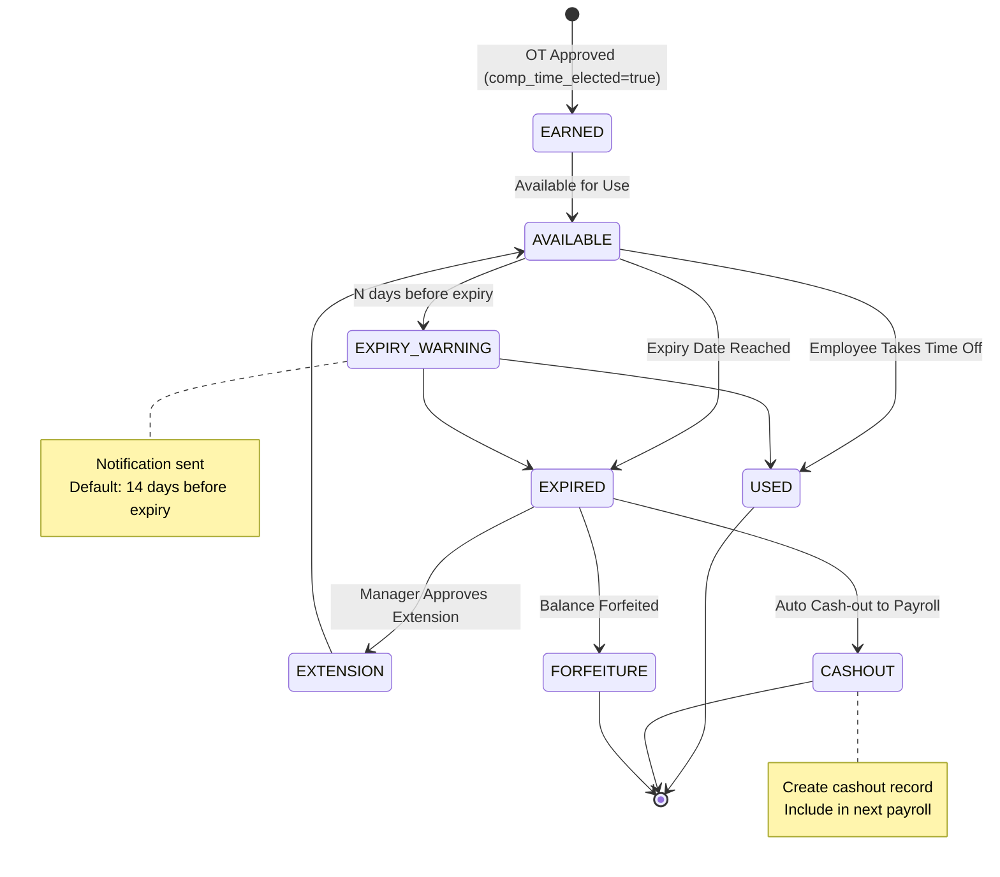
```mermaid
stateDiagram-v2
    [*] --> EARNED : OT Approved (comp_time_elected=true)
    
    EARNED --> AVAILABLE : Available for Use
    
    AVAILABLE --> USED : Employee Takes Time Off
    AVAILABLE --> EXPIRY_WARNING : N days before expiry
    AVAILABLE --> EXPIRED : Expiry Date Reached
    
    USED --> [*]
    
    EXPIRY_WARNING --> USED
    EXPIRY_WARNING --> EXPIRED
    
    EXPIRED --> EXTENSION : Manager Approves Extension
    EXPIRED --> CASHOUT : Auto Cash-out to Payroll
    EXPIRED --> FORFEITURE : Balance Forfeited
    
    EXTENSION --> AVAILABLE
    CASHOUT --> [*]
    FORFEITURE --> [*]
    
    note right of EXPIRY_WARNING
        Notification sent
        Default: 14 days before expiry
    end note
    
    note right of CASHOUT
        Create cashout record
        Include in next payroll
    end note
```

---

## 7. Shift Swap Workflow

### Swap Request Flow

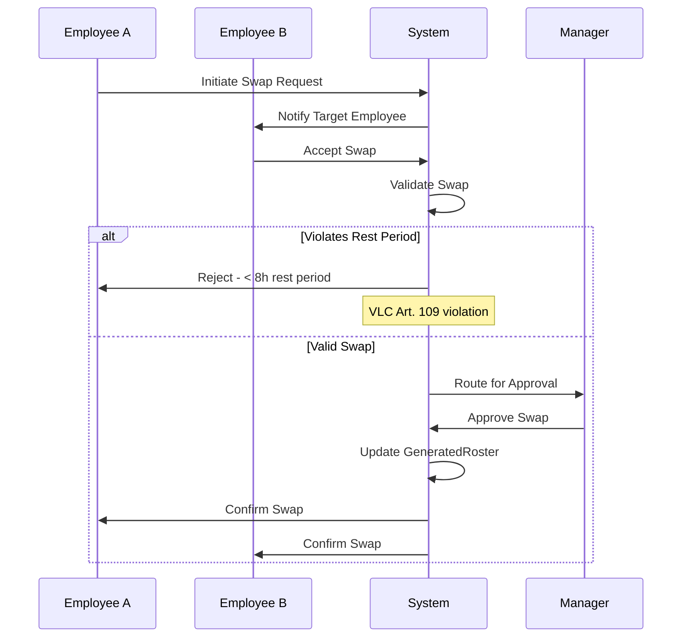
```mermaid
sequenceDiagram
    participant E1 as Employee A
    participant E2 as Employee B
    participant S as System
    participant M as Manager
    
    E1->>S: Initiate Swap Request
    S->>E2: Notify Target Employee
    
    E2->>S: Accept Swap
    S->>S: Validate Swap
    
    alt Violates Rest Period
        S->>E1: Reject - < 8h rest period
        Note over S: VLC Art. 109 violation
    else Valid Swap
        S->>M: Route for Approval
        M->>S: Approve Swap
        S->>S: Update GeneratedRoster
        S->>E1: Confirm Swap
        S->>E2: Confirm Swap
    end
```

### Swap Validation

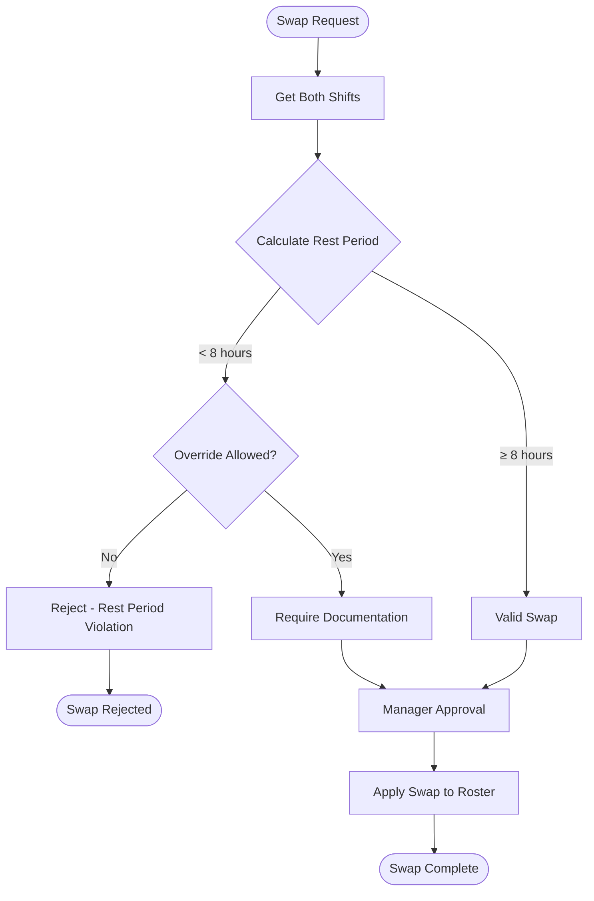
```mermaid
flowchart TD
    Start([Swap Request]) --> GetShifts[Get Both Shifts]
    GetShifts --> CalcRest{Calculate Rest Period}
    
    CalcRest -->|< 8 hours| CheckOverride{Override Allowed?}
    CalcRest -->|≥ 8 hours| ValidSwap[Valid Swap]
    
    CheckOverride -->|No| RejectSwap[Reject - Rest Period Violation]
    CheckOverride -->|Yes| RequireDoc[Require Documentation]
    RequireDoc --> ManagerApproval[Manager Approval]
    
    ValidSwap --> ManagerApproval
    ManagerApproval --> ApplySwap[Apply Swap to Roster]
    ApplySwap --> End([Swap Complete])
    
    RejectSwap --> End2([Swap Rejected])
```

---

## 8. Termination Balance Handling

### Termination Process

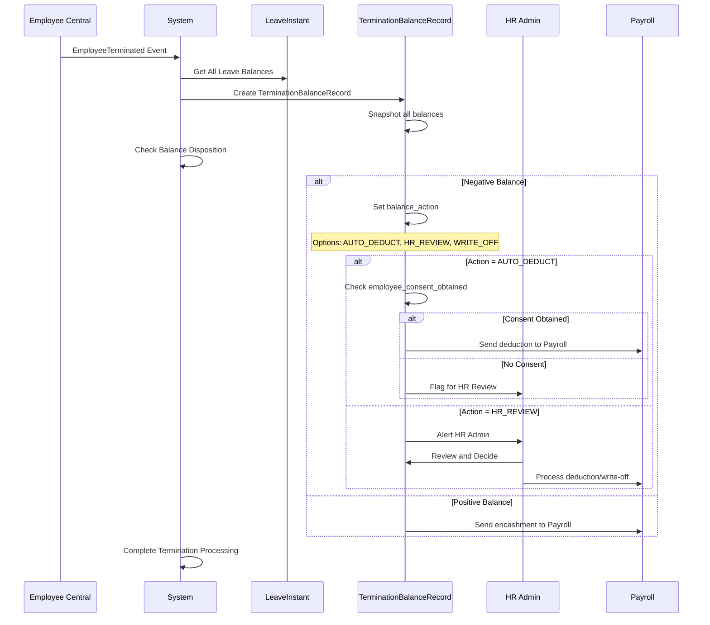
```mermaid
sequenceDiagram
    participant EC as Employee Central
    participant S as System
    participant LI as LeaveInstant
    participant TBR as TerminationBalanceRecord
    participant HR as HR Admin
    participant PAY as Payroll
    
    EC->>S: EmployeeTerminated Event
    S->>LI: Get All Leave Balances
    
    S->>TBR: Create TerminationBalanceRecord
    TBR->>TBR: Snapshot all balances
    
    S->>S: Check Balance Disposition
    
    alt Negative Balance
        TBR->>TBR: Set balance_action
        Note over TBR: Options: AUTO_DEDUCT, HR_REVIEW, WRITE_OFF
        
        alt Action = AUTO_DEDUCT
            TBR->>TBR: Check employee_consent_obtained
            alt Consent Obtained
                TBR->>PAY: Send deduction to Payroll
            else No Consent
                TBR->>HR: Flag for HR Review
            end
        else Action = HR_REVIEW
            TBR->>HR: Alert HR Admin
            HR->>TBR: Review and Decide
            HR->>PAY: Process deduction/write-off
        end
    else Positive Balance
        TBR->>PAY: Send encashment to Payroll
    end
    
    S->>S: Complete Termination Processing
```

### Termination Actions

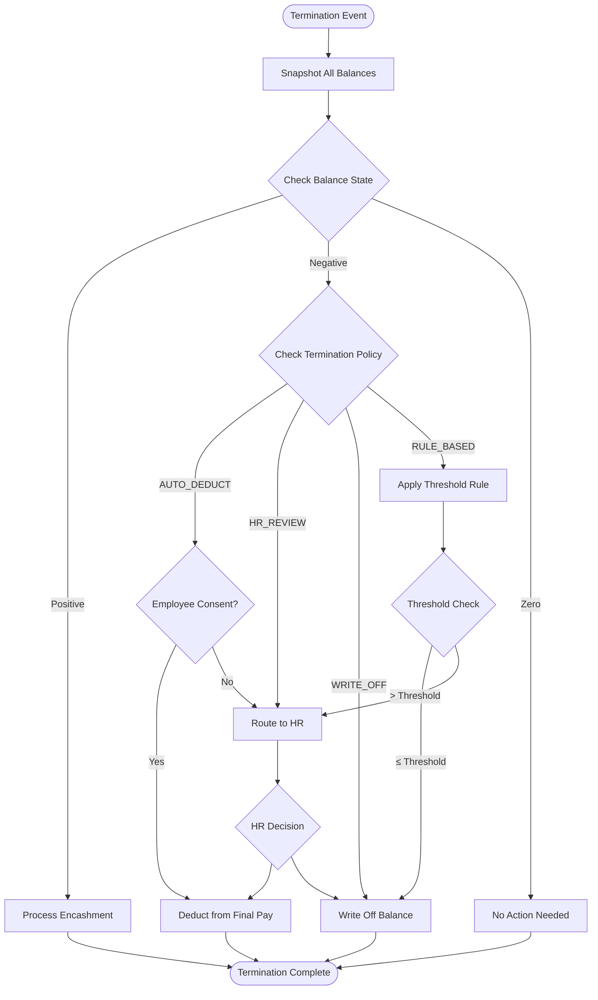
```mermaid
flowchart TD
    Start([Termination Event]) --> Snapshot[Snapshot All Balances]
    Snapshot --> CheckBalance{Check Balance State}
    
    CheckBalance -->|Positive| Encashment[Process Encashment]
    CheckBalance -->|Negative| CheckPolicy{Check Termination Policy}
    CheckBalance -->|Zero| NoAction[No Action Needed]
    
    CheckPolicy -->|AUTO_DEDUCT| CheckConsent{Employee Consent?}
    CheckPolicy -->|HR_REVIEW| RouteHR[Route to HR]
    CheckPolicy -->|WRITE_OFF| WriteOff[Write Off Balance]
    CheckPolicy -->|RULE_BASED| ApplyRule[Apply Threshold Rule]
    
    CheckConsent -->|Yes| DeductPayroll[Deduct from Final Pay]
    CheckConsent -->|No| RouteHR
    
    RouteHR --> HRDecision{HR Decision}
    HRDecision --> DeductPayroll
    HRDecision --> WriteOff
    
    ApplyRule --> CheckThreshold{Threshold Check}
    CheckThreshold -->|≤ Threshold| WriteOff
    CheckThreshold -->|> Threshold| RouteHR
    
    Encashment --> End([Termination Complete])
    NoAction --> End
    DeductPayroll --> End
    WriteOff --> End
```

---

## Summary: Workflow Categories

| Category | Workflows | Key States |
|----------|-----------|------------|
| **Scheduling** | Roster generation, Override, Shift swap | SCHEDULED, CONFIRMED, COMPLETED, CANCELLED |
| **Attendance** | Punch processing, OT calculation, Timesheet approval | OPEN, SUBMITTED, APPROVED, LOCKED |
| **Absence** | Leave request, Balance reservation, Accrual, Termination | SUBMITTED, UNDER_REVIEW, APPROVED, REJECTED, CANCELLED |
| **Shared** | Period close, Payroll export | OPEN, LOCKED, CLOSED |

---

*Next: [08-data-examples.md](./08-data-examples.md) - Complete Data Scenarios*