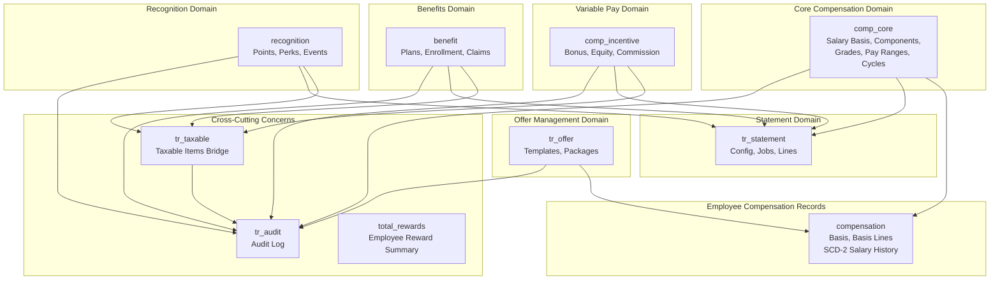
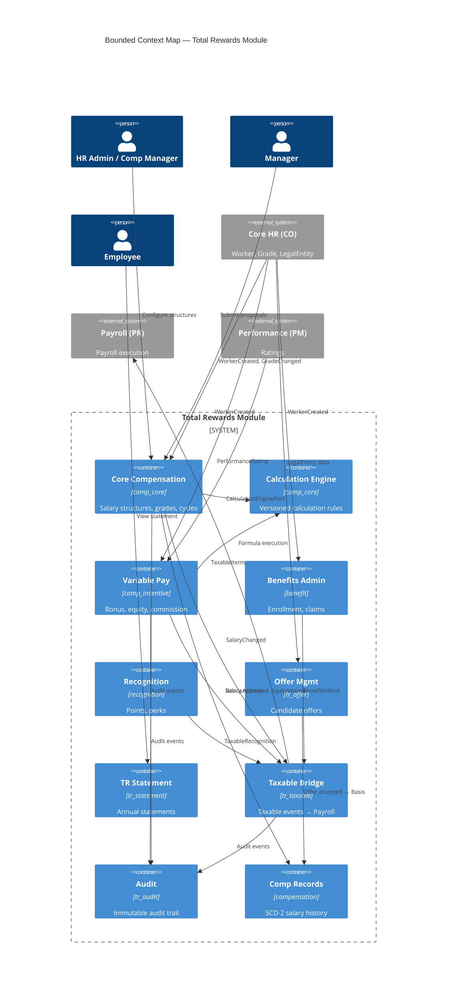
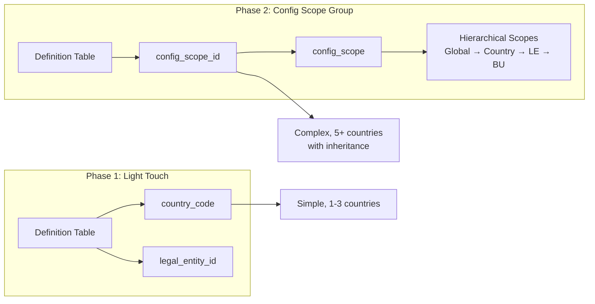
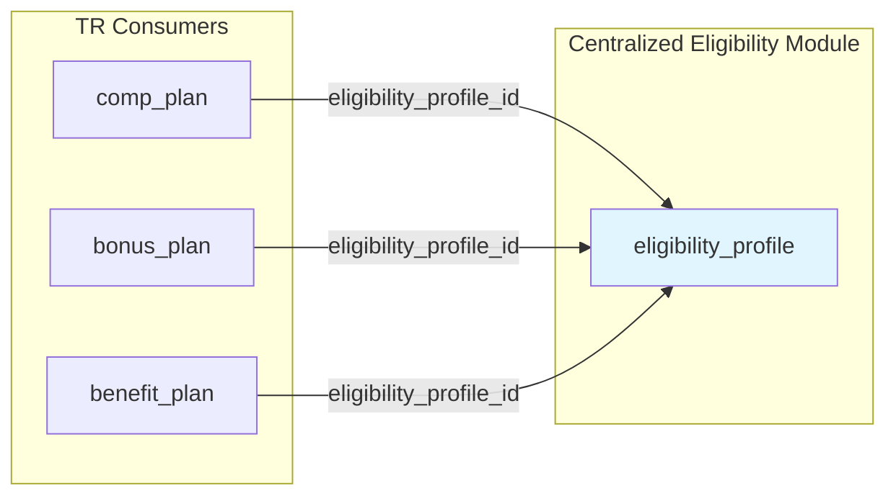
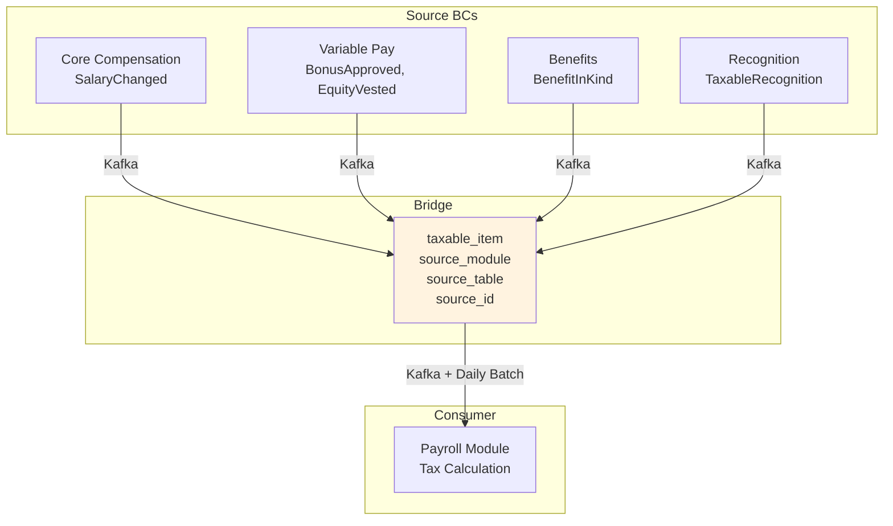
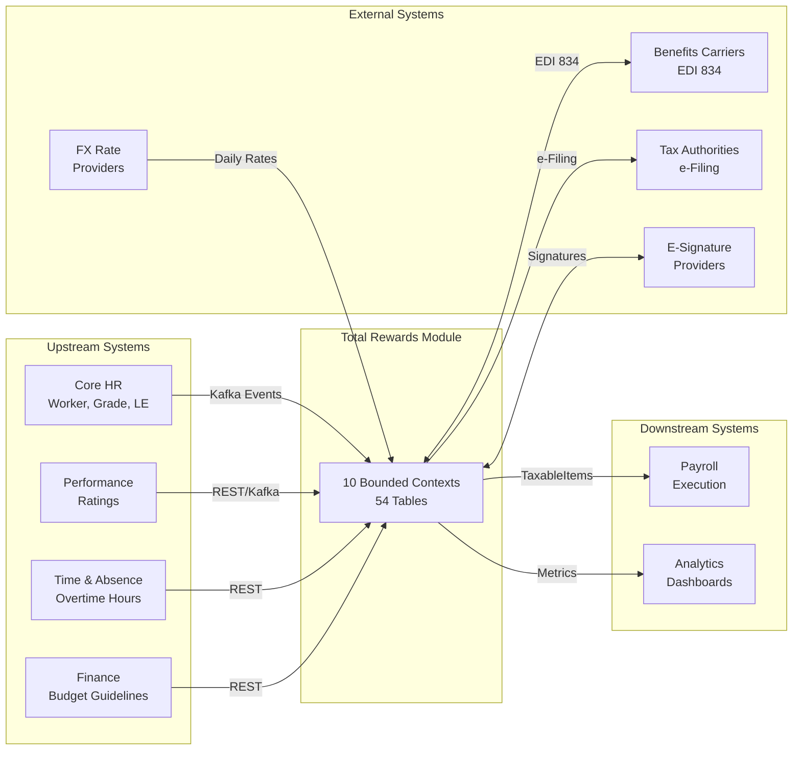

# Total Rewards Module — Model Overview

**Version**: 5.0  
**Last Updated**: 2026-03-30  
**Source**: `4.TotalReward.V5.dbml`  
**Scope**: Multi-country (VN, TH, ID, SG, MY, PH)

---

## Executive Summary

**Total Rewards (TR)** là module quản lý toàn bộ các hình thức bù đắp mà doanh nghiệp trao cho nhân viên — bao gồm lương cơ bản, thưởng, cổ phiếu (equity), phúc lợi, ghi nhận (recognition) và các ưu đãi (perks).

TR được thiết kế theo mô hình **WorldatWork 5-Pillar Total Rewards Framework**:

```
┌─────────────────────────────────────────────────────────────────┐
│                    TOTAL REWARDS FRAMEWORK                       │
├─────────────┬─────────────┬─────────────┬─────────────┬─────────┤
│ Compensation│   Benefits  │  Work-Life  │ Performance │ Career  │
│   (Fixed +  │  (Insurance │   & Flex    │ & Recognition│Development│
│  Variable)  │  + Wellness)│             │             │         │
└─────────────┴─────────────┴─────────────┴─────────────┴─────────┘
```

---

## 7 Core Capabilities

| # | Capability | Mô tả | Schema |
|---|------------|-------|--------|
| **1** | Component-Based Compensation | Lương được xây dựng từ Pay Components tái sử dụng với tax treatment, proration method riêng | `comp_core` |
| **2** | Grade & Career Ladder with Multi-Level Pay Ranges | Grade SCD-2, Pay Range ở 4 cấp (Global → LE → BU → Position) | `comp_core` |
| **3** | Structured Compensation Cycle | Merit/Promotion/Market Adjustment với budget tracking real-time | `comp_core` |
| **4** | Variable Pay: Bonus + Equity + Commission | STI/LTI/Commission với formula engine, vesting schedules | `comp_incentive` |
| **5** | Dynamic Benefits Administration | Enrollment portal, carrier integration (EDI 834), eligibility engine | `benefit` |
| **6** | Recognition → Perks → Taxable Bridge | Points-based recognition, FIFO expiration, auto-taxable bridge | `recognition` |
| **7** | Total Rewards Statement & Offer Management | Consolidated TR statement, offer lifecycle với e-signature | `tr_offer`, `tr_statement` |

---

## Schema Organization

TR Module được tổ chức thành **10 schemas** (database namespaces), mỗi schema đại diện cho một **Bounded Context** theo DDD:



### Schema Summary

| Schema | Bounded Context | Entity Count | Primary Purpose |
|--------|-----------------|--------------|-----------------|
| `comp_core` | Core Compensation | 15 | Salary structures, pay components, grades, pay ranges, comp cycles, budget |
| `comp_incentive` | Variable Pay | 7 | Bonus plans/cycles/pools, equity grants, vesting events |
| `benefit` | Benefits Administration | 10 | Benefit plans, options, enrollment, claims, reimbursement |
| `recognition` | Recognition & Perks | 8 | Recognition events, point accounts, perks catalog, redemption |
| `tr_offer` | Offer Management | 5 | Offer templates, packages, events, acceptance |
| `tr_statement` | Total Rewards Statement | 4 | Statement config, jobs, sections, lines |
| `tr_taxable` | Taxable Bridge | 1 | Cross-BC taxable item aggregation for Payroll |
| `tr_audit` | Audit & Compliance | 1 | Immutable audit trail (7-year retention) |
| `total_rewards` | Employee Reward Summary | 1 | Aggregated view of all rewards per employee |
| `compensation` | Employee Compensation Records | 2 | SCD-2 salary basis with flexible component lines |

---

## Bounded Context Map (DDD Level 2)



---

## Key Design Decisions

### 1. Multi-Country / Multi-Legal Entity Scoping

**Problem**: Cấu hình compensation/benefits cần phân biệt theo quốc gia và pháp nhân.

**Solution**: Dual-mode scoping mechanism:



**Resolution Order** (most specific wins):
1. `config_scope_id` (if populated) → resolved scope
2. Inline `country_code` + `legal_entity_id` (if populated)
3. NULL = global (applies everywhere)

**Example Hierarchy**:
```
GLOBAL (priority=0)
 └─ VN_DEFAULT (priority=10, country_code=VN)
     └─ VN_ENTITY_A (priority=20, legal_entity_id=xxx)
         └─ VN_TECH_BU (priority=30, business_unit_id=yyy)
```

---

### 2. SCD Type 2 Versioning

**Problem**: Cần lưu lịch sử thay đổi để audit, analysis và compliance.

**Solution**: Slowly Changing Dimension Type 2 pattern:

| Entity | SCD-2 Fields |
|--------|--------------|
| `grade_v` | `effective_start`, `effective_end`, `version_number`, `previous_version_id`, `is_current_version` |
| `calculation_rule_def` | Same as above |
| `compensation.basis` | `effective_start_date`, `effective_end_date`, `is_current_flag`, `previous_basis_id` |
| `pay_range` | `effective_start`, `effective_end` (no version chain) |
| `employee_comp_snapshot` | `effective_start`, `effective_end` |

**Pattern**:
```sql
-- When updating, never modify existing record
-- Instead: close old record, create new record
UPDATE grade_v 
SET effective_end = CURRENT_DATE, is_current_version = false
WHERE id = old_id;

INSERT INTO grade_v (grade_code, name, ..., effective_start, previous_version_id, is_current_version)
VALUES (code, name, ..., CURRENT_DATE, old_id, true);
```

---

### 3. Domain Boundary: TR vs PR (Gross vs Net)

**Critical Design Decision** (ADR 27Mar2026 Option D):

```
┌─────────────────────────────────────────────────────────────────┐
│                    DOMAIN BOUNDARY                               │
├─────────────────────────────────────────────────────────────────┤
│  TR DOMAIN (Total Rewards)          │  PR DOMAIN (Payroll)      │
│  "What to pay" (Decision Layer)     │  "How to pay" (Execution) │
├─────────────────────────────────────┼───────────────────────────┤
│  ✓ Projected/Gross calculations     │  ✓ Net calculations       │
│  ✓ HR-policy rules                  │  ✓ Statutory rules        │
│  ✓ Proration, FX, Annualization     │  ✓ TAX, SI, OT calculation│
│  ✓ Compensation policy rules        │  ✓ Gross → Net engine     │
│                                     │                           │
│  calculation_rule_def:              │  pay_master.statutory_rule│
│  - PRORATION                        │  - VN_PIT_2025            │
│  - ROUNDING                         │  - VN_SI_2025             │
│  - FOREX                            │  - VN_OT_MULT_2019        │
│  - ANNUALIZATION                    │  - SG_CPF_2025            │
│  - COMPENSATION_POLICY              │                           │
└─────────────────────────────────────┴───────────────────────────┘
```

**Data Flow**:
```
TR (Gross) ──TaxableItems──► PR (Net Calculation)
                         ──► Payroll Execution
```

---

### 4. Centralized Eligibility Pattern

**Problem**: Eligibility rules bị duplicate across Compensation Plans, Bonus Plans, Benefit Plans.

**Solution**: Centralized `eligibility.eligibility_profile` (G6 change 26Mar2026):



**Migration Path**:
- `comp_plan.eligibility_rule` → DEPRECATED → use `eligibility_profile_id`
- `bonus_plan.eligibility_rule` → DEPRECATED → use `eligibility_profile_id`
- `benefit_plan.eligibility_rule_json` → DEPRECATED → use `eligibility_profile_id`
- `benefit.eligibility_profile` → DEPRECATED v6.0 → migrate to centralized

---

### 5. Dual Pay Scale Mode (Vietnam Coefficient System)

**Problem**: Vietnam statutory salary uses coefficient-based calculation:
```
salary = coefficient × VN_LUONG_CO_SO (statutory base)
```

**Solution**: Dual mode in `grade_ladder_step`:

| Field | TABLE_LOOKUP Mode | COEFFICIENT_FORMULA Mode |
|-------|-------------------|--------------------------|
| `step_amount` | Direct salary value | NULL or reference |
| `coefficient` | NULL | e.g., 2.34, 3.66, 6.20 |

**Example**:
```
Ngạch Chuyên viên, Bậc 1:
  coefficient = 2.34
  VN_LUONG_CO_SO = 2,340,000 VND (2025)
  salary = 2.34 × 2,340,000 = 5,475,600 VND
```

**Domain Split**:
- `coefficient` + `step_amount` = TR domain (projected/Gross)
- `VN_LUONG_CO_SO` = PR domain (statutory_rule) — TR reads via data contract

---

### 6. Taxable Bridge Pattern (Cross-BC Integration)

**Problem**: Taxable events arise from multiple bounded contexts (Salary, Bonus, Equity, Benefits, Recognition).

**Solution**: `tr_taxable.taxable_item` as **Anti-Corruption Layer**:



**Idempotency**: `(source_module, source_table, source_id)` ensures exactly-once processing.

---

## Entity Count by Schema

| Schema | Tables | Key Entities |
|--------|--------|--------------|
| `comp_core` | 15 | `salary_basis`, `pay_component_def`, `grade_v`, `grade_ladder`, `pay_range`, `comp_plan`, `comp_cycle`, `comp_adjustment`, `budget_allocation`, `calculation_rule_def`, `config_scope`, `country_config` |
| `comp_incentive` | 7 | `bonus_plan`, `bonus_cycle`, `bonus_pool`, `bonus_allocation`, `equity_grant`, `equity_vesting_event`, `equity_txn` |
| `benefit` | 10 | `benefit_plan`, `benefit_option`, `enrollment`, `reimbursement_request`, `healthcare_claim_header` |
| `recognition` | 8 | `recognition_event`, `point_account`, `perk_catalog`, `perk_redeem`, `reward_point_txn` |
| `tr_offer` | 5 | `offer_template`, `offer_package`, `offer_event`, `offer_acceptance` |
| `tr_statement` | 4 | `statement_config`, `statement_job`, `statement_line`, `statement_section` |
| `tr_taxable` | 1 | `taxable_item` |
| `tr_audit` | 1 | `audit_log` |
| `total_rewards` | 1 | `employee_reward_summary` |
| `compensation` | 2 | `basis`, `basis_line` |

**Total**: ~54 tables across 10 schemas

---

## Integration Architecture



---

## Related Documents

| Document | Purpose |
|----------|---------|
| [01-CORE-COMPENSATION.md](./01-CORE-COMPENSATION.md) | Detailed design of Core Compensation BC |
| [02-VARIABLE-PAY.md](./02-VARIABLE-PAY.md) | Detailed design of Variable Pay BC |
| [03-BENEFITS.md](./03-BENEFITS.md) | Detailed design of Benefits Administration BC |
| [04-RECOGNITION-OFFER.md](./04-RECOGNITION-OFFER.md) | Detailed design of Recognition & Offer BCs |
| [05-CALCULATION-COMPLIANCE.md](./05-CALCULATION-COMPLIANCE.md) | Detailed design of Calculation Rules & Compliance |
| [06-EMPLOYEE-COMPENSATION.md](./06-EMPLOYEE-COMPENSATION.md) | Detailed design of Employee Compensation Records |

---

## Change Log

| Date | Version | Changes |
|------|---------|---------|
| 2026-03-30 | 1.0 | Initial overview document |
| 2026-03-27 | V5 | Added dual pay scale mode, domain boundary TR/PR |
| 2026-03-26 | V5 | Added config_scope multi-country/LE scoping |
| 2025-11-25 | V4 | Added calculation_rules module |
| 2025-11-21 | V4 | Enhanced audit trail, precision changes |

---

*Document generated from `4.TotalReward.V5.dbml`*