# Core Compensation — Model Design

**Bounded Context**: `comp_core`  
**Schema**: `comp_core`  
**Entity Count**: 15 tables  
**Purpose**: Manage salary structures, pay components, grades, pay ranges, compensation cycles, and budgets

---

## Overview

Core Compensation là **bounded context trung tâm** của Total Rewards, chịu trách nhiệm:

- Định nghĩa cấu trúc lương (Salary Basis)
- Quản lý các thành phần lương (Pay Components)
- Xây dựng hệ thống cấp bậc (Grades & Ladders)
- Thiết lập khung lương (Pay Ranges)
- Quản lý chu kỳ điều chỉnh lương (Compensation Cycles)
- Phân bổ và theo dõi ngân sách (Budget Management)
- Quy tắc tính toán (Calculation Rules)

---

## Conceptual Model

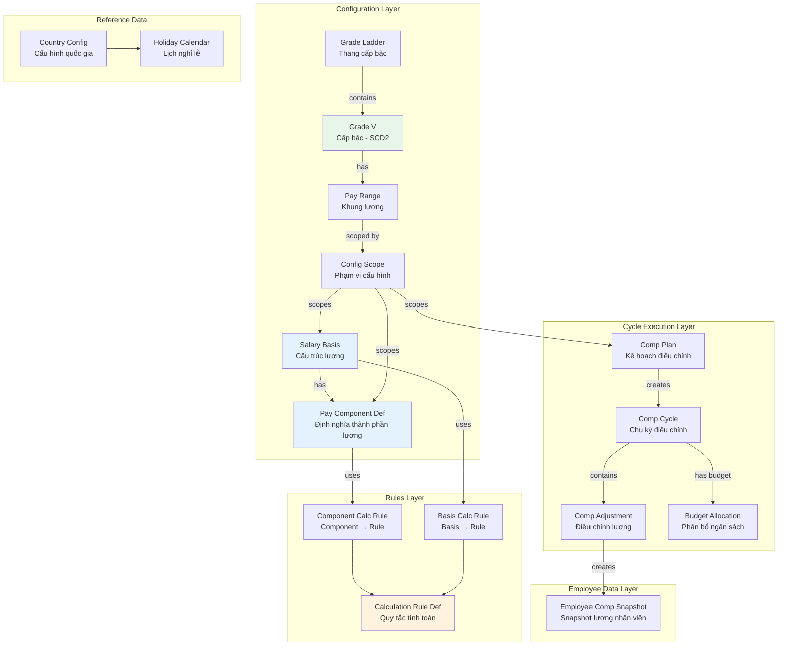

---

## Entity Relationship Diagram

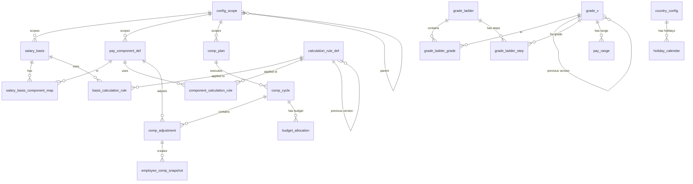

---

## 1. Salary Basis

### Purpose

**Salary Basis** định nghĩa cấu trúc lương cho một nhóm nhân viên, bao gồm:
- Tần suất trả lương (Monthly, Hourly, Annual)
- Tiền tệ mặc định
- Tập hợp các Pay Components được phép sử dụng

### Table: `salary_basis`

| Field | Type | Description |
|-------|------|-------------|
| `id` | uuid | Primary key |
| `code` | varchar(50) | Unique code (e.g., `MONTHLY_VN`, `HOURLY_US`) |
| `name` | varchar(200) | Display name |
| `frequency` | varchar(20) | `HOURLY` \| `MONTHLY` \| `ANNUAL` |
| `currency` | char(3) | ISO 4217 currency code |
| `allow_components` | boolean | Allow additional components? |
| `country_code` | char(2) | ISO country code (NULL = global) |
| `legal_entity_id` | uuid | Specific legal entity (NULL = all) |
| `config_scope_id` | uuid | Advanced scope reference |
| `effective_start` | date | Start of validity |
| `effective_end` | date | End of validity (NULL = current) |

### Multi-Country Scoping

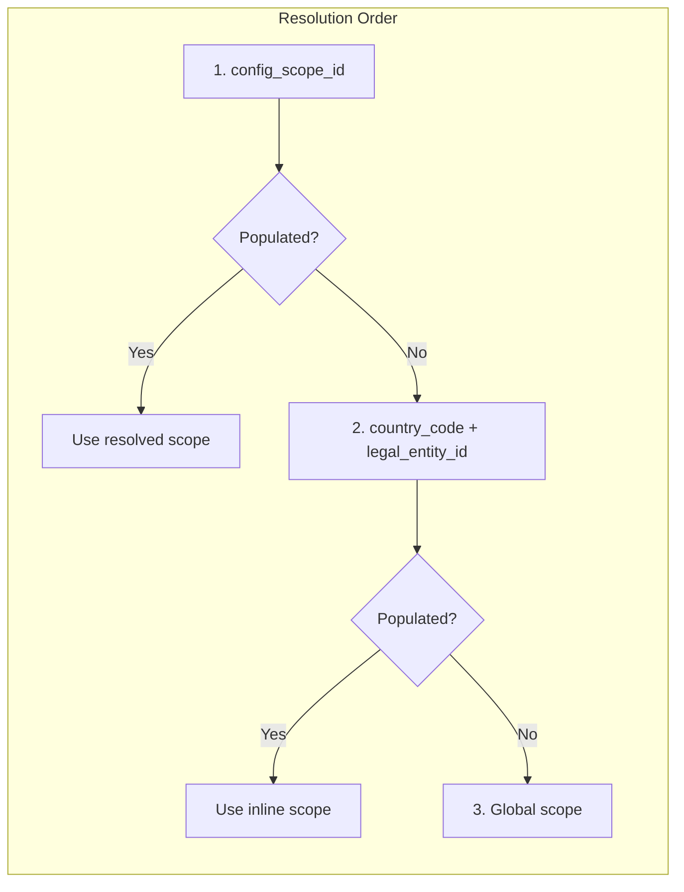

### Example Data

| code | name | frequency | currency | country_code | legal_entity_id |
|------|------|-----------|----------|--------------|-----------------|
| `MONTHLY_VN` | Monthly Vietnam | MONTHLY | VND | VN | NULL |
| `HOURLY_US` | Hourly US | HOURLY | USD | US | NULL |
| `MONTHLY_SG_TECH` | Monthly Singapore Tech | MONTHLY | SGD | SG | uuid-tech-le |

---

## 2. Pay Components

### Purpose

**Pay Component Definition** định nghĩa các thành phần lương có thể sử dụng trong Salary Basis:
- Base Salary (Lương cơ bản)
- Allowances (Phụ cấp: lunch, housing, transportation...)
- Bonus (Thưởng)
- Deductions (Khấu trừ)
- Overtime (Làm thêm giờ)

### Table: `pay_component_def`

| Field | Type | Description |
|-------|------|-------------|
| `id` | uuid | Primary key |
| `code` | varchar(50) | Unique code |
| `name` | varchar(200) | Display name |
| `component_type` | varchar(30) | `BASE` \| `ALLOWANCE` \| `BONUS` \| `EQUITY` \| `DEDUCTION` \| `OVERTIME` |
| `frequency` | varchar(20) | Payment frequency |
| `taxable` | boolean | Is taxable? |
| `prorated` | boolean | Can be prorated? |
| `calculation_method` | varchar(50) | `FIXED` \| `FORMULA` \| `PERCENTAGE` \| `HOURLY` \| `DAILY` |
| `proration_method` | varchar(30) | `CALENDAR_DAYS` \| `WORKING_DAYS` \| `NONE` |
| `tax_treatment` | varchar(30) | `FULLY_TAXABLE` \| `TAX_EXEMPT` \| `PARTIALLY_EXEMPT` |
| `tax_exempt_threshold` | decimal(18,4) | Threshold for partial exemption |
| `is_subject_to_si` | boolean | Subject to social insurance? |
| `si_calculation_basis` | varchar(30) | `FULL_AMOUNT` \| `CAPPED` \| `EXCLUDED` |
| `country_code` | char(2) | Country-specific (NULL = global) |

### Component Types

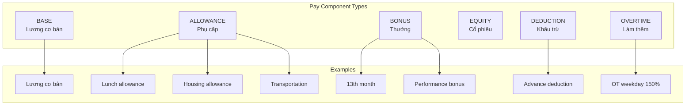

### Tax Treatment Examples

| Component | taxable | tax_treatment | tax_exempt_threshold | VN Example |
|-----------|---------|---------------|---------------------|------------|
| Base Salary | true | FULLY_TAXABLE | - | Lương cơ bản |
| Lunch Allowance | true | PARTIALLY_EXEMPT | 730,000 VND | Trên 730K mới tính thuế |
| Phone Allowance | false | TAX_EXEMPT | - | Không tính thuế |
| Overtime | true | FULLY_TAXABLE | - | OT luôn tính thuế |

### Bridge to Calculation Rules

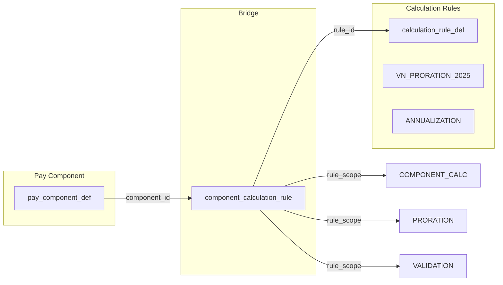

---

## 3. Grade & Career Ladder

### Purpose

**Grade Ladder** định nghĩa lộ trình thăng tiến nghề nghiệp, bao gồm:
- Các cấp bậc (Grades) từ entry-level đến executive
- Các bước (Steps) trong mỗi grade (VN statutory system)
- Khung lương (Pay Range) cho mỗi grade

### Tables

#### `grade_ladder` — Thang cấp bậc

| Field | Type | Description |
|-------|------|-------------|
| `id` | uuid | Primary key |
| `code` | varchar(50) | Unique code |
| `name` | varchar(200) | Display name |
| `ladder_type` | varchar(50) | `MANAGEMENT` \| `TECHNICAL` \| `SPECIALIST` |
| `effective_start` | date | Start of validity |
| `effective_end` | date | End of validity |

#### `grade_v` — Cấp bậc (SCD Type 2)

| Field | Type | Description |
|-------|------|-------------|
| `id` | uuid | Primary key |
| `grade_code` | varchar(20) | Grade code |
| `name` | varchar(100) | Display name |
| `job_level` | int | Hierarchy level |
| `effective_start` | date | Version start |
| `effective_end` | date | Version end |
| `version_number` | int | Version sequence |
| `previous_version_id` | uuid | Link to previous version |
| `is_current_version` | boolean | Is this current? |

#### `grade_ladder_step` — Bước trong grade (Vietnam Coefficient System)

| Field | Type | Description |
|-------|------|-------------|
| `id` | uuid | Primary key |
| `ladder_id` | uuid | Parent ladder |
| `grade_v_id` | uuid | Parent grade |
| `step_number` | int | Step sequence |
| `step_name` | varchar(100) | Step name |
| `step_amount` | decimal(18,4) | Direct salary (TABLE_LOOKUP mode) |
| `coefficient` | decimal(8,4) | Coefficient (COEFFICIENT_FORMULA mode) |
| `months_to_next_step` | smallint | Months before auto-advance |
| `auto_advance` | boolean | Auto advance to next step? |

### SCD Type 2 Versioning

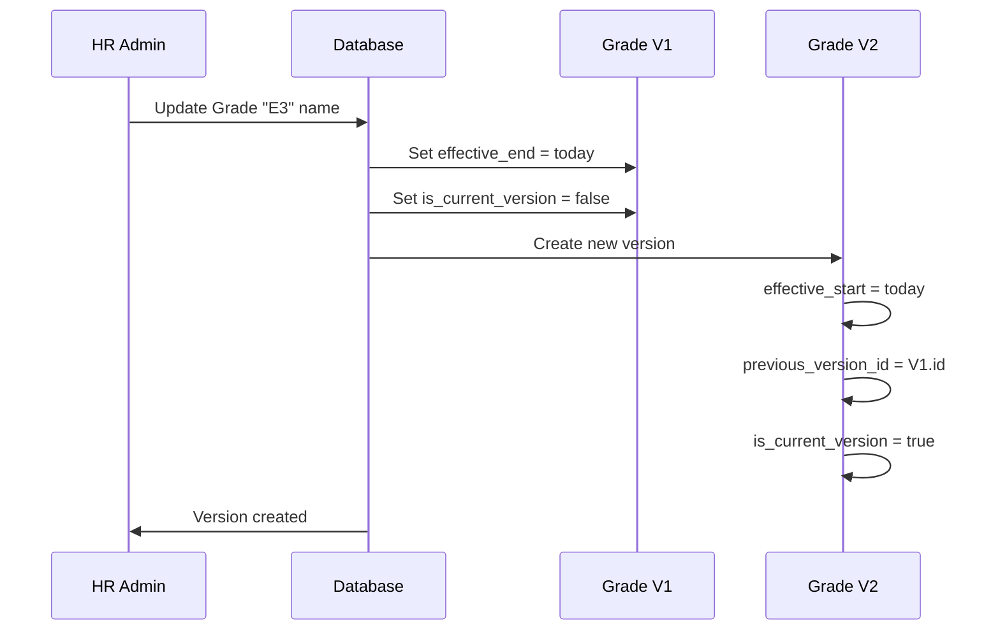

### Dual Pay Scale Mode (Vietnam)

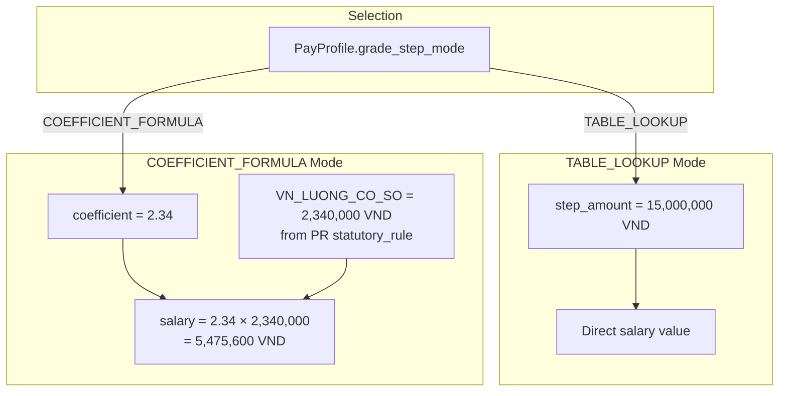

**Domain Boundary**:
- `coefficient` + `step_amount` = TR domain (projected/Gross)
- `VN_LUONG_CO_SO` = PR domain (statutory_rule) — TR reads via data contract

### Step Progression Example

| Ladder | Grade | Step | coefficient | months_to_next_step | auto_advance |
|--------|-------|------|-------------|---------------------|--------------|
| Technical | E3 | 1 | 2.34 | 36 | true |
| Technical | E3 | 2 | 2.67 | 36 | true |
| Technical | E3 | 3 | 3.00 | NULL | false |
| Technical | E4 | 1 | 3.66 | 48 | true |

*Step 1 → Step 2: Tự động sau 3 năm (36 tháng)*

---

## 4. Pay Range

### Purpose

**Pay Range** định nghĩa khung lương (min-mid-max) cho mỗi Grade, có thể phân cấp theo:
- Global (toàn công ty)
- Legal Entity (pháp nhân)
- Business Unit (đơn vị kinh doanh)
- Position (vị trí cụ thể)

### Table: `pay_range`

| Field | Type | Description |
|-------|------|-------------|
| `id` | uuid | Primary key |
| `grade_v_id` | uuid | Grade reference |
| `scope_type` | varchar(20) | `GLOBAL` \| `LEGAL_ENTITY` \| `BUSINESS_UNIT` \| `POSITION` |
| `scope_uuid` | uuid | Dynamic FK to scope entity |
| `currency` | char(3) | Currency code |
| `min_amount` | decimal(18,4) | Minimum salary |
| `mid_amount` | decimal(18,4) | Midpoint salary |
| `max_amount` | decimal(18,4) | Maximum salary |
| `range_spread_pct` | decimal(5,2) | Calculated: (max-min)/mid*100 |
| `effective_start` | date | Start of validity |
| `effective_end` | date | End of validity |

### Multi-Level Scope Resolution

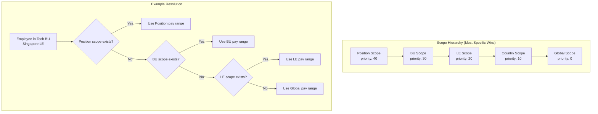

### Compa-Ratio Calculation

```
Compa-Ratio = (Current Salary / Pay Range Midpoint) × 100

Example:
  Current Salary: 45,000,000 VND
  Midpoint: 50,000,000 VND
  Compa-Ratio = (45M / 50M) × 100 = 90%
  
Interpretation:
  < 90%  = Below range (underpaid)
  90-110% = In range (market-aligned)
  > 110% = Above range (overpaid)
```

---

## 5. Compensation Cycle

### Purpose

**Compensation Cycle** quản lý quy trình điều chỉnh lương định kỳ:
- Merit (Tăng lương định kỳ)
- Promotion (Thăng chức)
- Market Adjustment (Điều chỉnh theo thị trường)
- Equity Correction (Sửa chữa bất công lương)

### Tables

#### `comp_plan` — Kế hoạch điều chỉnh

| Field | Type | Description |
|-------|------|-------------|
| `id` | uuid | Primary key |
| `code` | varchar(50) | Unique code |
| `name` | varchar(200) | Display name |
| `plan_type` | varchar(30) | `MERIT` \| `PROMOTION` \| `MARKET_ADJUSTMENT` \| `NEW_HIRE` \| `EQUITY_CORRECTION` \| `AD_HOC` |
| `eligibility_profile_id` | uuid | Centralized eligibility (G6) |
| `guideline_json` | jsonb | Merit matrix, approval thresholds |
| `country_code` | char(2) | Country scope |
| `legal_entity_id` | uuid | LE scope |

#### `comp_cycle` — Chu kỳ điều chỉnh

| Field | Type | Description |
|-------|------|-------------|
| `id` | uuid | Primary key |
| `plan_id` | uuid | Parent plan |
| `code` | varchar(50) | Cycle code |
| `name` | varchar(200) | Display name |
| `period_start` | date | Cycle period start |
| `period_end` | date | Cycle period end |
| `effective_date` | date | When adjustments take effect |
| `budget_amount` | decimal(18,4) | Total budget |
| `budget_currency` | char(3) | Budget currency |
| `status` | varchar(20) | `DRAFT` \| `OPEN` \| `IN_REVIEW` \| `APPROVED` \| `CLOSED` \| `CANCELLED` |

#### `comp_adjustment` — Điều chỉnh lương

| Field | Type | Description |
|-------|------|-------------|
| `id` | uuid | Primary key |
| `cycle_id` | uuid | Parent cycle |
| `employee_id` | uuid | Employee reference |
| `assignment_id` | uuid | Assignment reference |
| `component_id` | uuid | Pay component being adjusted |
| `current_amount` | decimal(18,4) | Current salary |
| `proposed_amount` | decimal(18,4) | Proposed salary |
| `increase_amount` | decimal(18,4) | Difference |
| `increase_pct` | decimal(7,4) | Percentage increase |
| `rationale_code` | varchar(50) | Reason code |
| `rationale_text` | text | Detailed rationale |
| `approval_status` | varchar(20) | `DRAFT` \| `PENDING` \| `APPROVED` \| `REJECTED` \| `WITHDRAWN` |

### Cycle State Machine

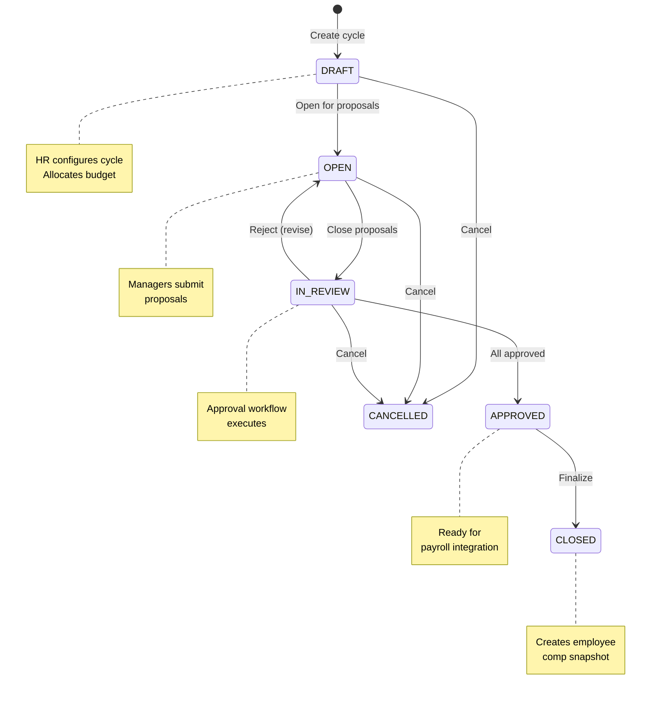

### Approval Thresholds (Example)

| Increase % | Required Approver |
|------------|-------------------|
| 0-5% | Director |
| 5-10% | VP |
| 10-20% | SVP |
| >20% | CFO |

### Data Flow

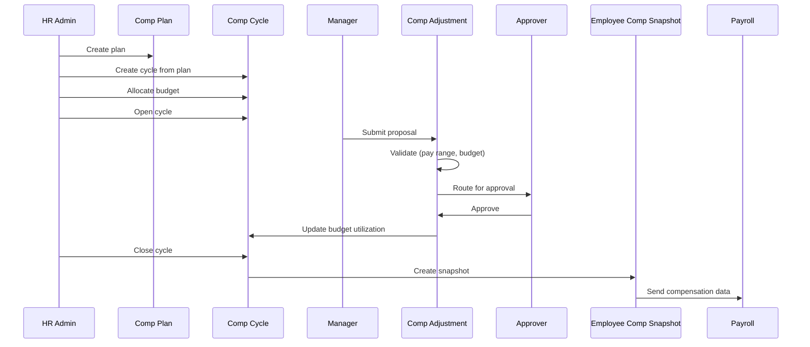

---

## 6. Budget Management

### Purpose

**Budget Allocation** quản lý ngân sách cho Compensation Cycle:
- Phân bổ ngân sách theo tổ chức (LE, BU, Department, Team)
- Theo dõi sử dụng real-time
- Cảnh báo khi vượt ngân sách

### Table: `budget_allocation`

| Field | Type | Description |
|-------|------|-------------|
| `id` | uuid | Primary key |
| `cycle_id` | uuid | Parent cycle |
| `scope_type` | varchar(30) | `GLOBAL` \| `LEGAL_ENTITY` \| `BUSINESS_UNIT` \| `DEPARTMENT` \| `TEAM` |
| `scope_uuid` | uuid | Scope entity reference |
| `allocated_amount` | decimal(18,4) | Budget allocated |
| `utilized_amount` | decimal(18,4) | Budget used |
| `utilization_pct` | decimal(5,2) | Utilization percentage |
| `currency` | char(3) | Currency |

### Budget Tracking Example

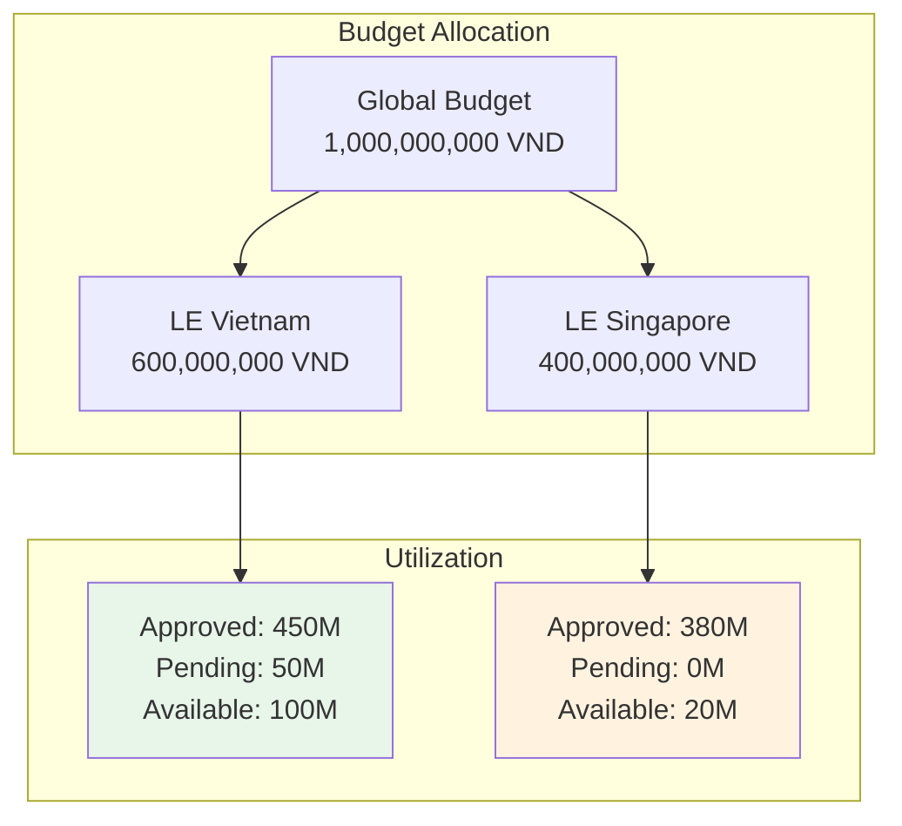

---

## 7. Calculation Rules

### Purpose

**Calculation Rules** định nghĩa các quy tắc tính toán lương:
- Proration (Tính lương theo tỷ lệ)
- Rounding (Làm tròn)
- FX Conversion (Chuyển đổi tiền tệ)
- Annualization (Quy đổi theo năm)

**Important**: TR chỉ sở hữu HR-policy rules (tính đến Gross). Statutory rules (TAX, SI, OT) thuộc PR domain.

### Table: `calculation_rule_def`

| Field | Type | Description |
|-------|------|-------------|
| `id` | uuid | Primary key |
| `code` | varchar(50) | Unique code |
| `name` | varchar(200) | Display name |
| `rule_category` | varchar(30) | `PRORATION` \| `ROUNDING` \| `FOREX` \| `ANNUALIZATION` \| `COMPENSATION_POLICY` |
| `rule_type` | varchar(30) | `FORMULA` \| `LOOKUP_TABLE` \| `CONDITIONAL` \| `RATE_TABLE` \| `PROGRESSIVE` |
| `country_code` | char(2) | Country-specific (NULL = global) |
| `formula_json` | jsonb | Calculation logic |
| `legal_reference` | text | Legal citation |
| `effective_start` | date | Start of validity |
| `effective_end` | date | End of validity |
| `version_number` | int | Version sequence |
| `previous_version_id` | uuid | Previous version link |
| `is_current_version` | boolean | Is current? |

### Rule Categories (TR Domain Only)

| Category | Purpose | Example |
|----------|---------|---------|
| `PRORATION` | Calculate salary for partial periods | New hire, termination mid-month |
| `ROUNDING` | Rounding rules for currency | Round to nearest 1,000 VND |
| `FOREX` | Currency conversion rates | VND ↔ USD for expats |
| `ANNUALIZATION` | Convert monthly ↔ annual | Monthly to annual for comp planning |
| `COMPENSATION_POLICY` | Company-specific rules | Merit matrix formula |

**Migrated to PR Domain** (statutory rules):
- `VN_PIT_2025` → `pay_master.statutory_rule` (PR)
- `VN_SI_2025` → `pay_master.statutory_rule` (PR)
- `VN_OT_MULT_2019` → `pay_master.statutory_rule` (PR)
- `SG_CPF_2025` → `pay_master.statutory_rule` (PR)

### Bridge Tables

#### `component_calculation_rule` — Component → Rule

Links pay components to calculation rules with scope-specific application.

| Field | Type | Description |
|-------|------|-------------|
| `component_id` | uuid | Pay component |
| `rule_id` | uuid | Calculation rule |
| `rule_scope` | varchar(30) | `COMPONENT_CALC` \| `PRORATION` \| `VALIDATION` \| `ANNUALIZATION` |
| `execution_order` | int | Calculation sequence |

#### `basis_calculation_rule` — Salary Basis → Rule

Links salary basis to calculation rules for entire basis.

| Field | Type | Description |
|-------|------|-------------|
| `salary_basis_id` | uuid | Salary basis |
| `rule_id` | uuid | Calculation rule |
| `rule_scope` | varchar(30) | `PRORATION` \| `ROUNDING` \| `ANNUALIZATION` |
| `execution_order` | int | Calculation sequence |

### Calculation Flow

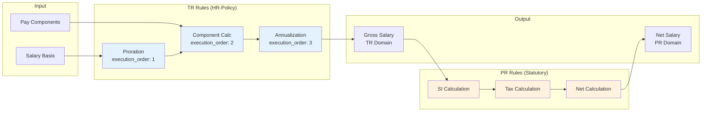

---

## 8. Configuration Scope (Multi-Country/LE)

### Purpose

**Config Scope** hỗ trợ cấu hình phức tạp cho multi-country/multi-LE deployment:
- Group country + LE + BU into named scopes
- Hierarchical scope with inheritance
- Priority-based resolution

### Tables

#### `config_scope` — Scope Group

| Field | Type | Description |
|-------|------|-------------|
| `id` | uuid | Primary key |
| `scope_code` | varchar(50) | Unique code |
| `scope_name` | varchar(200) | Display name |
| `scope_type` | varchar(20) | `COUNTRY` \| `LEGAL_ENTITY` \| `BUSINESS_UNIT` \| `HYBRID` |
| `country_code` | char(2) | Country (NULL = multi-country) |
| `legal_entity_id` | uuid | LE (NULL = all LEs) |
| `business_unit_id` | uuid | BU (NULL = all BUs) |
| `priority` | int | Higher = more specific |
| `parent_scope_id` | uuid | Parent scope (inheritance) |
| `inherit_flag` | boolean | Inherit from parent? |

#### `config_scope_member` — Scope Members (for HYBRID)

| Field | Type | Description |
|-------|------|-------------|
| `id` | uuid | Primary key |
| `scope_id` | uuid | Parent scope |
| `member_type` | varchar(20) | `COUNTRY` \| `LEGAL_ENTITY` \| `BUSINESS_UNIT` |
| `country_code` | char(2) | Country member |
| `legal_entity_id` | uuid | LE member |
| `business_unit_id` | uuid | BU member |

### Scope Hierarchy Example

```
GLOBAL (priority=0, scope_code='GLOBAL')
 │
 ├─ VN_DEFAULT (priority=10, country_code='VN')
 │   │
 │   ├─ VN_ENTITY_A (priority=20, legal_entity_id='uuid-a')
 │   │   │
 │   │   └─ VN_TECH_BU (priority=30, business_unit_id='uuid-tech')
 │   │
 │   └─ VN_ENTITY_B (priority=20, legal_entity_id='uuid-b')
 │
 ├─ SG_DEFAULT (priority=10, country_code='SG')
 │   │
 │   └─ SG_FINANCE (priority=20, legal_entity_id='uuid-fin')
 │
 └─ APAC (priority=5, scope_type='HYBRID')
     │
     ├─ member: VN
     ├─ member: SG
     └─ member: TH
```

---

## 9. Country Configuration

### Purpose

**Country Configuration** lưu các thiết lập theo quốc gia:
- Giờ làm việc tiêu chuẩn
- Ngày làm việc tiêu chuẩn
- Lịch nghỉ lễ

### Tables

#### `country_config` — Cấu hình quốc gia

| Field | Type | Description |
|-------|------|-------------|
| `id` | uuid | Primary key |
| `country_code` | char(2) | ISO country code |
| `country_name` | varchar(100) | Country name |
| `currency_code` | char(3) | ISO currency code |
| `tax_system` | varchar(30) | `PROGRESSIVE` \| `FLAT` \| `DUAL` |
| `si_system` | varchar(30) | `MANDATORY` \| `OPTIONAL` \| `HYBRID` |
| `standard_working_hours_per_day` | int | Standard hours |
| `standard_working_days_per_week` | int | Standard days/week |
| `standard_working_days_per_month` | int | Standard days/month |

#### `holiday_calendar` — Lịch nghỉ lễ

| Field | Type | Description |
|-------|------|-------------|
| `id` | uuid | Primary key |
| `country_code` | char(2) | Country code |
| `jurisdiction` | varchar(50) | State/Province |
| `year` | int | Year |
| `holiday_date` | date | Holiday date |
| `holiday_name` | varchar(200) | Holiday name |
| `holiday_type` | varchar(30) | `NATIONAL` \| `REGIONAL` \| `BANK` \| `OPTIONAL` |
| `is_paid` | boolean | Paid holiday? |
| `ot_multiplier` | decimal(4,2) | OT multiplier if working |

### Example: Vietnam Holidays 2025

| holiday_date | holiday_name | holiday_type | ot_multiplier |
|--------------|--------------|--------------|---------------|
| 2025-01-01 | Tết Dương lịch | NATIONAL | 3.0 |
| 2025-01-29 | Tết Nguyên Đán (Day 1) | NATIONAL | 3.0 |
| 2025-04-30 | Ngày Giải phóng | NATIONAL | 3.0 |
| 2025-05-01 | Ngày Quốc tế Lao động | NATIONAL | 3.0 |
| 2025-09-02 | Ngày Quốc khánh | NATIONAL | 3.0 |

---

## Summary

### Key Design Patterns

| Pattern | Application |
|---------|-------------|
| **SCD Type 2** | `grade_v`, `calculation_rule_def` - Full version history |
| **Multi-Level Scope** | `pay_range`, `config_scope` - Resolution by specificity |
| **Dual Mode** | `grade_ladder_step` - TABLE_LOOKUP vs COEFFICIENT_FORMULA |
| **Domain Boundary** | `calculation_rule_def` - TR (HR-policy) vs PR (Statutory) |
| **Centralized Eligibility** | `comp_plan`, `bonus_plan` → `eligibility.eligibility_profile` |

### Critical Relationships

```
Salary Basis ──uses──► Calculation Rules (TR domain)
     │
     └──has──► Pay Components
                   │
                   └──uses──► Calculation Rules

Grade ──has──► Pay Range ──scoped by──► Config Scope
  │
  └──in──► Grade Ladder ──has steps──► Step (with coefficient)

Comp Plan ──creates──► Comp Cycle
                          │
                          ├──has──► Budget Allocation
                          └──contains──► Comp Adjustment
                                             │
                                             └──creates──► Employee Comp Snapshot
```

---

## Related Documents

- [00-OVERVIEW.md](./00-OVERVIEW.md) — Module overview
- [05-CALCULATION-COMPLIANCE.md](./05-CALCULATION-COMPLIANCE.md) — Calculation rules detail
- [06-EMPLOYEE-COMPENSATION.md](./06-EMPLOYEE-COMPENSATION.md) — Employee compensation records

---

*Document generated from `4.TotalReward.V5.dbml`*