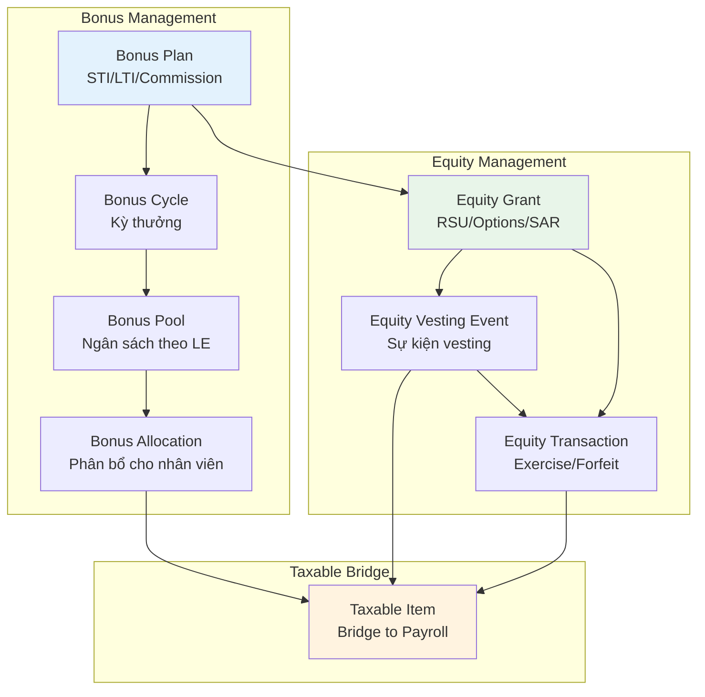
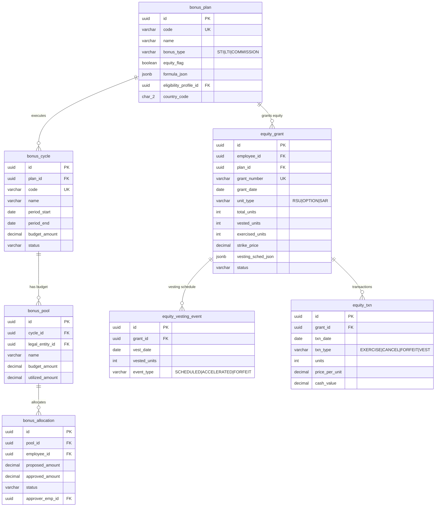
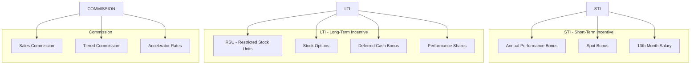
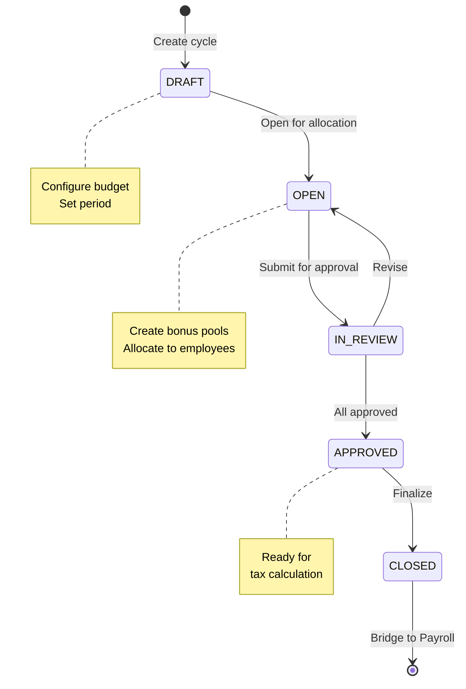
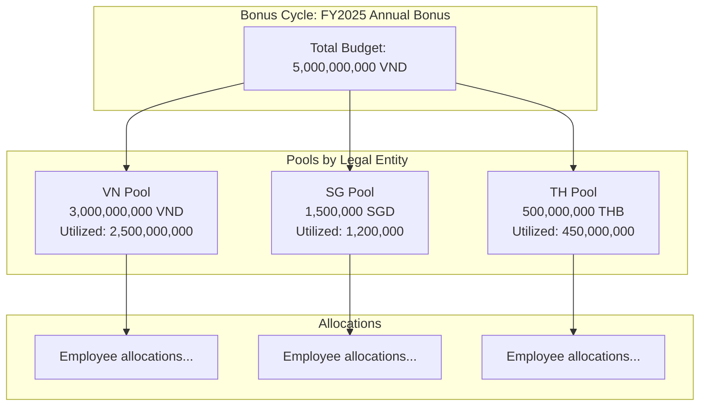
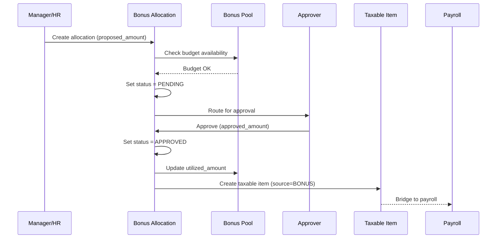
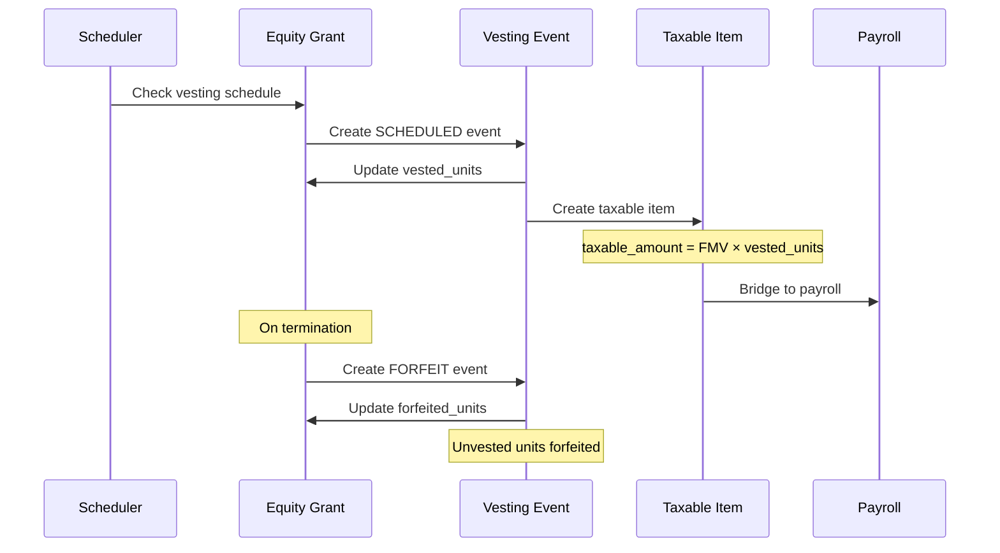
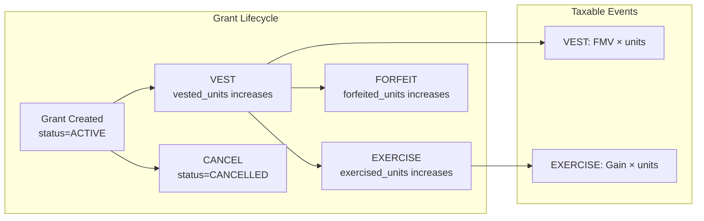
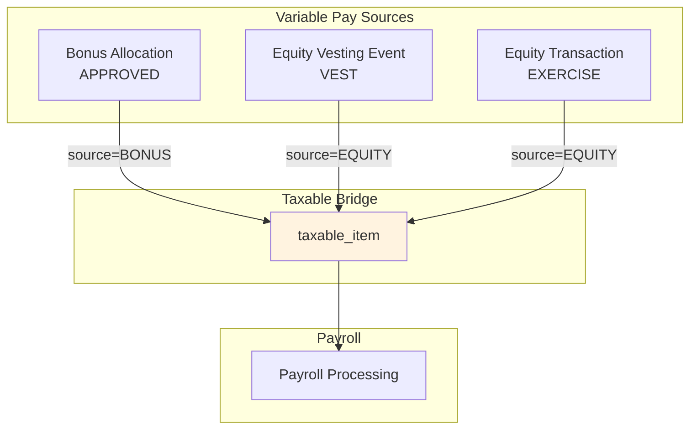
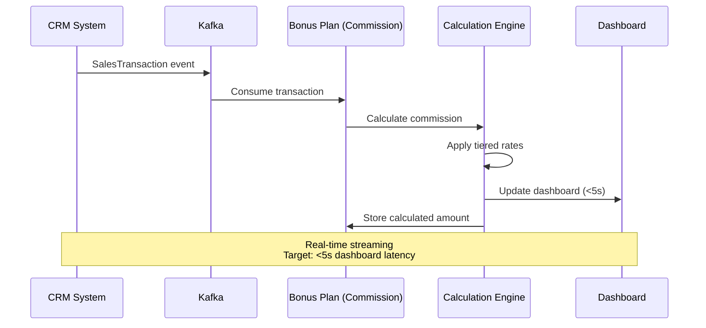

# Variable Pay — Model Design

**Bounded Context**: `comp_incentive`  
**Schema**: `comp_incentive`  
**Entity Count**: 7 tables  
**Purpose**: Manage bonus plans, equity grants, commission calculation, and vesting schedules

---

## Overview

Variable Pay quản lý các hình thức lương biến động:
- **Bonus**: STI (Short-Term Incentive), LTI (Long-Term Incentive), Commission
- **Equity**: RSU (Restricted Stock Units), Stock Options, SAR (Stock Appreciation Rights)
- **Vesting**: Lịch trình vesting, equity transactions

---

## Conceptual Model



---

## Entity Relationship Diagram



---

## 1. Bonus Plans

### Purpose

**Bonus Plan** định nghĩa các chương trình thưởng:
- **STI (Short-Term Incentive)**: Thưởng hàng năm dựa trên performance
- **LTI (Long-Term Incentive)**: Thưởng dài hạn (equity, deferred cash)
- **Commission**: Thưởng hoa hồng cho sales

### Table: `bonus_plan`

| Field | Type | Description |
|-------|------|-------------|
| `id` | uuid | Primary key |
| `code` | varchar(50) | Unique code |
| `name` | varchar(200) | Display name |
| `bonus_type` | varchar(30) | `STI` \| `LTI` \| `COMMISSION` |
| `equity_flag` | boolean | Is this equity-based? |
| `formula_json` | jsonb | Calculation formula |
| `eligibility_profile_id` | uuid | Centralized eligibility (G6) |
| `country_code` | char(2) | Country scope |
| `legal_entity_id` | uuid | LE scope |
| `config_scope_id` | uuid | Advanced scope reference |
| `effective_start` | date | Start of validity |
| `effective_end` | date | End of validity |

### Bonus Types



### Formula Examples

**Performance Bonus Formula**:
```json
{
  "formula": "annual_salary * target_pct * performance_factor * company_factor",
  "variables": {
    "target_pct": {
      "type": "lookup",
      "source": "grade_bonus_target",
      "field": "target_percentage"
    },
    "performance_factor": {
      "type": "lookup",
      "source": "performance_rating",
      "mapping": {
        "5": 1.5,
        "4": 1.2,
        "3": 1.0,
        "2": 0.5,
        "1": 0
      }
    },
    "company_factor": {
      "type": "input",
      "default": 1.0
    }
  }
}
```

**Commission Formula**:
```json
{
  "formula": "SUM(sales_transactions.amount) * commission_rate",
  "variables": {
    "commission_rate": {
      "type": "tiered",
      "tiers": [
        {"min": 0, "max": 100000000, "rate": 0.05},
        {"min": 100000001, "max": 500000000, "rate": 0.07},
        {"min": 500000001, "max": null, "rate": 0.10}
      ]
    }
  }
}
```

---

## 2. Bonus Cycle

### Purpose

**Bonus Cycle** quản lý một kỳ thưởng cụ thể:
- Thiết lập ngân sách tổng
- Theo dõi trạng thái (Draft → Open → Closed)
- Quản lý thời gian hiệu lực

### Table: `bonus_cycle`

| Field | Type | Description |
|-------|------|-------------|
| `id` | uuid | Primary key |
| `plan_id` | uuid | Parent bonus plan |
| `code` | varchar(50) | Unique cycle code |
| `name` | varchar(200) | Display name |
| `period_start` | date | Period start |
| `period_end` | date | Period end |
| `budget_amount` | decimal(18,4) | Total budget |
| `currency` | char(3) | Currency |
| `status` | varchar(20) | `DRAFT` \| `OPEN` \| `IN_REVIEW` \| `APPROVED` \| `CLOSED` |

### Cycle Flow



---

## 3. Bonus Pool

### Purpose

**Bonus Pool** phân chia ngân sách theo Legal Entity:
- Mỗi LE có pool riêng
- Track utilization per pool
- Support multi-currency

### Table: `bonus_pool`

| Field | Type | Description |
|-------|------|-------------|
| `id` | uuid | Primary key |
| `cycle_id` | uuid | Parent cycle |
| `legal_entity_id` | uuid | Legal entity |
| `name` | varchar(200) | Pool name |
| `budget_amount` | decimal(18,4) | Pool budget |
| `utilized_amount` | decimal(18,4) | Amount used |
| `currency` | char(3) | Currency |

### Pool Structure



---

## 4. Bonus Allocation

### Purpose

**Bonus Allocation** phân bổ thưởng cho từng nhân viên:
- Proposed amount (đề xuất)
- Approved amount (phê duyệt)
- Approval workflow

### Table: `bonus_allocation`

| Field | Type | Description |
|-------|------|-------------|
| `id` | uuid | Primary key |
| `pool_id` | uuid | Parent pool |
| `employee_id` | uuid | Employee |
| `proposed_amount` | decimal(18,4) | Proposed amount |
| `approved_amount` | decimal(18,4) | Approved amount |
| `currency` | char(3) | Currency |
| `status` | varchar(20) | `DRAFT` \| `PENDING` \| `APPROVED` \| `REJECTED` |
| `approver_emp_id` | uuid | Approver |
| `decision_date` | timestamp | Decision timestamp |
| `decision_note` | text | Approver notes |

### Allocation Workflow



---

## 5. Equity Grants

### Purpose

**Equity Grant** quản lý cổ phiếu/option trao cho nhân viên:
- RSU (Restricted Stock Units)
- Stock Options
- SAR (Stock Appreciation Rights)

### Table: `equity_grant`

| Field | Type | Description |
|-------|------|-------------|
| `id` | uuid | Primary key |
| `employee_id` | uuid | Employee |
| `plan_id` | uuid | Bonus plan (LTI) |
| `grant_number` | varchar(50) | Unique grant ID |
| `grant_date` | date | Grant date |
| `unit_type` | varchar(20) | `RSU` \| `OPTION` \| `SAR` |
| `total_units` | int | Total units granted |
| `vested_units` | int | Units vested so far |
| `exercised_units` | int | Units exercised |
| `forfeited_units` | int | Units forfeited |
| `strike_price` | decimal(18,6) | Strike price (for options) |
| `fair_market_value` | decimal(18,6) | FMV at grant date |
| `expiry_date` | date | Expiry date |
| `vesting_sched_json` | jsonb | Vesting schedule |
| `status` | varchar(20) | `ACTIVE` \| `FULLY_VESTED` \| `FORFEITED` \| `EXPIRED` \| `EXERCISED` |

### Unit Types Comparison

| Type | Description | Vesting | Taxable Event |
|------|-------------|---------|---------------|
| **RSU** | Restricted Stock Units | Vest over time | At vest (FMV × units) |
| **Option** | Stock Options | Vest over time | At exercise (Gain = FMV - Strike) |
| **SAR** | Stock Appreciation Rights | Vest over time | At exercise (FMV - Strike) |

### Vesting Schedule JSON

**Cliff Vesting** (100% after 4 years):
```json
{
  "type": "CLIFF",
  "cliff_months": 48,
  "vesting_percentage": 100
}
```

**Graded Vesting** (25% per year):
```json
{
  "type": "GRADED",
  "schedule": [
    {"year": 1, "percentage": 25},
    {"year": 2, "percentage": 25},
    {"year": 3, "percentage": 25},
    {"year": 4, "percentage": 25}
  ]
}
```

**Performance-Based Vesting**:
```json
{
  "type": "PERFORMANCE",
  "metrics": [
    {"metric": "REVENUE_GROWTH", "target": 0.15, "multiplier": 1.0},
    {"metric": "STOCK_PRICE", "target": 50.00, "multiplier": 1.5}
  ],
  "max_percentage": 200
}
```

---

## 6. Equity Vesting Events

### Purpose

**Equity Vesting Event** ghi nhận các sự kiện vesting:
- Scheduled vesting (theo lịch)
- Accelerated vesting (tăng tốc)
- Forfeiture (mất quyền)

### Table: `equity_vesting_event`

| Field | Type | Description |
|-------|------|-------------|
| `id` | uuid | Primary key |
| `grant_id` | uuid | Parent grant |
| `vest_date` | date | Vesting date |
| `vested_units` | int | Units vested |
| `event_type` | varchar(20) | `SCHEDULED` \| `ACCELERATED` \| `FORFEIT` |
| `payroll_batch_id` | uuid | Payroll batch reference |
| `metadata` | jsonb | Additional info |

### Vesting Flow



---

## 7. Equity Transactions

### Purpose

**Equity Transaction** ghi nhận các giao dịch equity:
- VEST: Units become vested
- EXERCISE: Employee exercises options
- FORFEIT: Units forfeited
- CANCEL: Grant cancelled

### Table: `equity_txn`

| Field | Type | Description |
|-------|------|-------------|
| `id` | uuid | Primary key |
| `grant_id` | uuid | Parent grant |
| `txn_date` | date | Transaction date |
| `txn_type` | varchar(20) | `EXERCISE` \| `CANCEL` \| `FORFEIT` \| `VEST` |
| `units` | int | Units involved |
| `price_per_unit` | decimal(18,6) | Price per unit |
| `cash_value` | decimal(18,4) | Cash value |
| `payroll_batch_id` | uuid | Payroll batch reference |

### Transaction Types



### Exercise Calculation (Options)

```
Example:
  Employee has 1,000 stock options
  Strike price: $10.00
  Current FMV at exercise: $25.00
  
  Gain per unit: $25.00 - $10.00 = $15.00
  Total gain: 1,000 × $15.00 = $15,000
  Taxable amount: $15,000 (capital gains)
```

---

## 8. Taxable Bridge Integration

### Purpose

Variable Pay events tạo **Taxable Items** để bridge sang Payroll:



### Taxable Item Creation

| Source Event | source_module | benefit_type | taxable_amount |
|--------------|---------------|--------------|----------------|
| Bonus Approved | `BENEFIT` | `CASH_BONUS` | approved_amount |
| RSU Vest | `EQUITY` | `EQUITY_VEST` | FMV × vested_units |
| Option Exercise | `EQUITY` | `EQUITY_GAIN` | gain × exercised_units |

---

## 9. Commission Calculation

### Purpose

Commission là loại bonus đặc biệt cho sales, cần:
- Real-time calculation (< 5s latency)
- Integration với CRM (Salesforce, HubSpot)
- Tiered rates và accelerators

### Data Flow



### Tiered Commission Example

| Sales Range | Rate | Example Calculation |
|-------------|------|---------------------|
| 0 - 100M VND | 5% | 100M × 5% = 5M |
| 100M - 500M VND | 7% | 400M × 7% = 28M |
| > 500M VND | 10% | 500M × 10% = 50M |

**Accelerator Example**:
```
Base rate: 5%
At 80% quota: +1% accelerator → 6%
At 100% quota: +2% accelerator → 7%
At 120% quota: +3% accelerator → 8%
```

---

## Summary

### Key Design Patterns

| Pattern | Application |
|---------|-------------|
| **Pool-based Budget** | `bonus_pool` per Legal Entity |
| **Vesting Schedule JSON** | Flexible vesting: cliff, graded, performance |
| **Taxable Bridge** | All variable pay events → `taxable_item` |
| **Real-time Calculation** | Commission via Kafka streaming |

### Entity Count

| Entity | Purpose |
|--------|---------|
| `bonus_plan` | Define bonus programs (STI/LTI/Commission) |
| `bonus_cycle` | Execute bonus period |
| `bonus_pool` | Budget per Legal Entity |
| `bonus_allocation` | Individual bonus allocation |
| `equity_grant` | Equity award (RSU/Option/SAR) |
| `equity_vesting_event` | Vesting schedule events |
| `equity_txn` | Equity transactions |

### Critical Relationships

```
Bonus Plan ──creates──► Bonus Cycle
                           │
                           └──has──► Bonus Pool (per LE)
                                         │
                                         └──allocates──► Bonus Allocation
                                                             │
                                                             └──bridges──► Taxable Item

Bonus Plan ──grants──► Equity Grant
                           │
                           ├──vests──► Vesting Event ──► Taxable Item
                           └──transacts──► Equity Transaction ──► Taxable Item
```

---

## Related Documents

- [00-OVERVIEW.md](./00-OVERVIEW.md) — Module overview
- [05-CALCULATION-COMPLIANCE.md](./05-CALCULATION-COMPLIANCE.md) — Taxable bridge detail
- [01-CORE-COMPENSATION.md](./01-CORE-COMPENSATION.md) — Compensation cycles

---

*Document generated from `4.TotalReward.V5.dbml`*