# Benefits Administration — Model Design

**Bounded Context**: `benefit`  
**Schema**: `benefit`  
**Entity Count**: 10 tables  
**Purpose**: Manage benefit plans, enrollment, healthcare claims, and reimbursement

---

## Overview

Benefits Administration quản lý các phúc lợi cho nhân viên:
- **Benefit Plans**: Medical, Dental, Vision, Life, Disability, Retirement
- **Enrollment**: Open enrollment, new hire, qualifying life events
- **Claims**: Healthcare claims processing
- **Reimbursement**: Expense reimbursement requests

---

## Conceptual Model

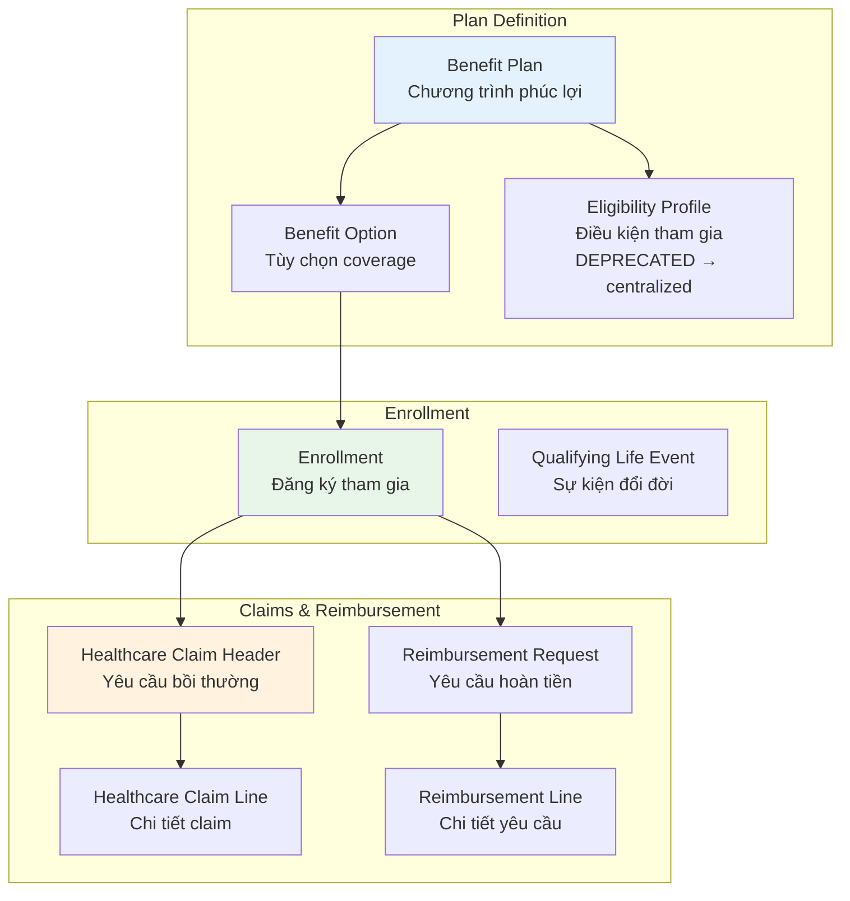

---

## Entity Relationship Diagram

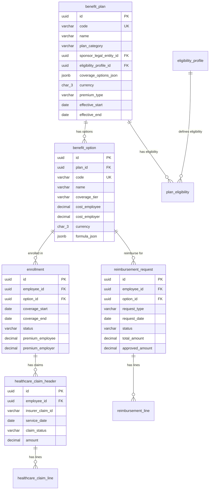

---

## 1. Benefit Plans

### Purpose

**Benefit Plan** định nghĩa các chương trình phúc lợi:
- Medical Insurance (Bảo hiểm y tế)
- Dental Insurance (Bảo hiểm nha khoa)
- Vision Insurance (Bảo hiểm mắt)
- Life Insurance (Bảo hiểm nhân thọ)
- Disability Insurance (Bảo hiểm thương tật)
- Retirement Plans (Hưu trí)
- Wellness Programs (Chương trình sức khỏe)
- Perks (Các ưu đãi khác)

### Table: `benefit_plan`

| Field | Type | Description |
|-------|------|-------------|
| `id` | uuid | Primary key |
| `code` | varchar(50) | Unique code |
| `name` | varchar(255) | Display name |
| `plan_category` | varchar(50) | Plan category (see below) |
| `provider_name` | varchar(255) | Insurance provider |
| `sponsor_legal_entity_id` | uuid | Sponsoring legal entity |
| `eligibility_profile_id` | uuid | Centralized eligibility (G5) |
| `coverage_options_json` | jsonb | Coverage configurations |
| `currency` | char(3) | Currency |
| `premium_type` | varchar(50) | `EMPLOYEE` \| `EMPLOYER` \| `SHARED` |
| `effective_start` | date | Start of validity |
| `effective_end` | date | End of validity |
| `is_active` | boolean | Is active? |

### Plan Categories

| Category | Description | Example |
|----------|-------------|---------|
| `MEDICAL` | Health insurance | PPO, HMO, EPO plans |
| `DENTAL` | Dental coverage | Preventive, Basic, Major |
| `VISION` | Vision care | Eye exams, glasses, contacts |
| `LIFE` | Life insurance | Term life, Whole life |
| `DISABILITY` | Disability coverage | Short-term, Long-term |
| `RETIREMENT` | Retirement plans | 401(k), Pension, Superannuation |
| `WELLNESS` | Wellness programs | Gym membership, Mental health |
| `PERK` | Additional perks | Employee discounts, Free meals |

### Premium Types

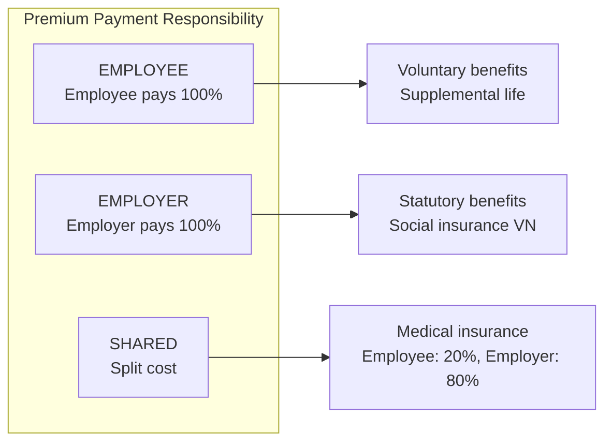

---

## 2. Benefit Options

### Purpose

**Benefit Option** định nghĩa các tùy chọn coverage trong một plan:
- Coverage tiers (Employee Only, Employee + Spouse, Family)
- Premium costs
- Benefit formulas

### Table: `benefit_option`

| Field | Type | Description |
|-------|------|-------------|
| `id` | uuid | Primary key |
| `plan_id` | uuid | Parent plan |
| `code` | varchar(50) | Unique code |
| `name` | varchar(200) | Display name |
| `coverage_tier` | varchar(30) | `EMPLOYEE_ONLY` \| `EMPLOYEE_SPOUSE` \| `EMPLOYEE_FAMILY` |
| `cost_employee` | decimal(18,4) | Employee premium cost |
| `cost_employer` | decimal(18,4) | Employer premium cost |
| `currency` | char(3) | Currency |
| `formula_json` | jsonb | Benefit calculation formula |
| `effective_start` | date | Start of validity |
| `effective_end` | date | End of validity |

### Coverage Tiers

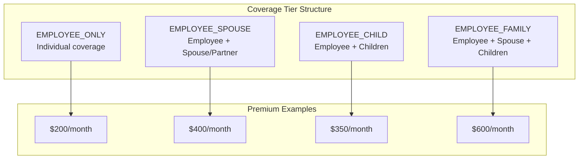

### Premium Calculation Example

| Coverage Tier | Total Premium | Employer Pays | Employee Pays |
|---------------|---------------|---------------|---------------|
| Employee Only | $500 | $400 (80%) | $100 (20%) |
| Employee + Spouse | $1,000 | $700 (70%) | $300 (30%) |
| Employee + Child(ren) | $900 | $650 (72%) | $250 (28%) |
| Family | $1,500 | $900 (60%) | $600 (40%) |

---

## 3. Eligibility (Migration to Centralized)

### Current State (DEPRECATED)

**Table: `benefit.eligibility_profile`** (deprecated, migrating to centralized)

| Field | Type | Description |
|-------|------|-------------|
| `id` | uuid | Primary key |
| `code` | varchar(50) | Unique code |
| `name` | varchar(200) | Display name |
| `rule_json` | jsonb | Eligibility rules |
| `effective_start` | date | Start of validity |

### Migration Path (G5)

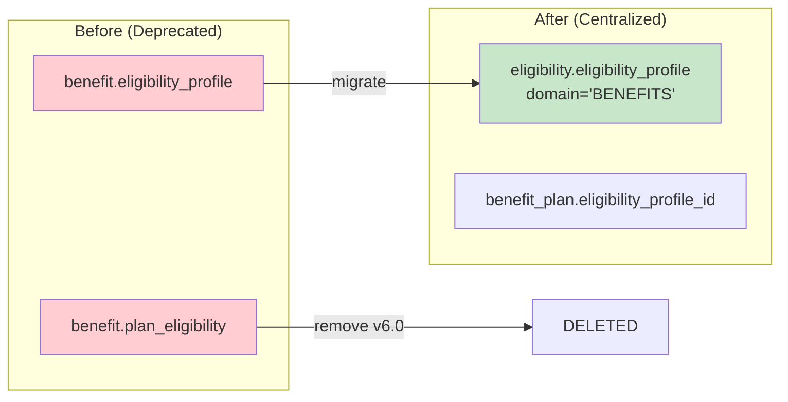

### Eligibility Rule JSON Example

```json
{
  "conditions": [
    {
      "field": "employment_type",
      "operator": "IN",
      "value": ["FULL_TIME", "PART_TIME"]
    },
    {
      "field": "tenure_months",
      "operator": ">=",
      "value": 3
    },
    {
      "field": "work_hours_per_week",
      "operator": ">=",
      "value": 30
    }
  ],
  "logic": "AND"
}
```

---

## 4. Enrollment

### Purpose

**Enrollment** quản lý việc nhân viên đăng ký tham gia benefit plan:
- Open Enrollment (Đăng ký hàng năm)
- New Hire Enrollment (Đăng ký mới)
- Qualifying Life Event (Đăng ký do sự kiện đổi đời)

### Table: `enrollment`

| Field | Type | Description |
|-------|------|-------------|
| `id` | uuid | Primary key |
| `employee_id` | uuid | Employee |
| `option_id` | uuid | Benefit option |
| `coverage_start` | date | Coverage start date |
| `coverage_end` | date | Coverage end date |
| `status` | varchar(20) | `ACTIVE` \| `WAIVED` \| `TERMINATED` \| `PENDING` |
| `premium_employee` | decimal(18,4) | Employee premium |
| `premium_employer` | decimal(18,4) | Employer premium |
| `currency` | char(3) | Currency |

### Enrollment Types

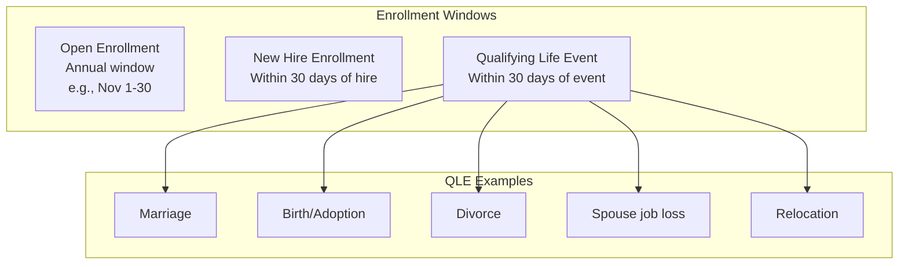

### Enrollment Status Flow

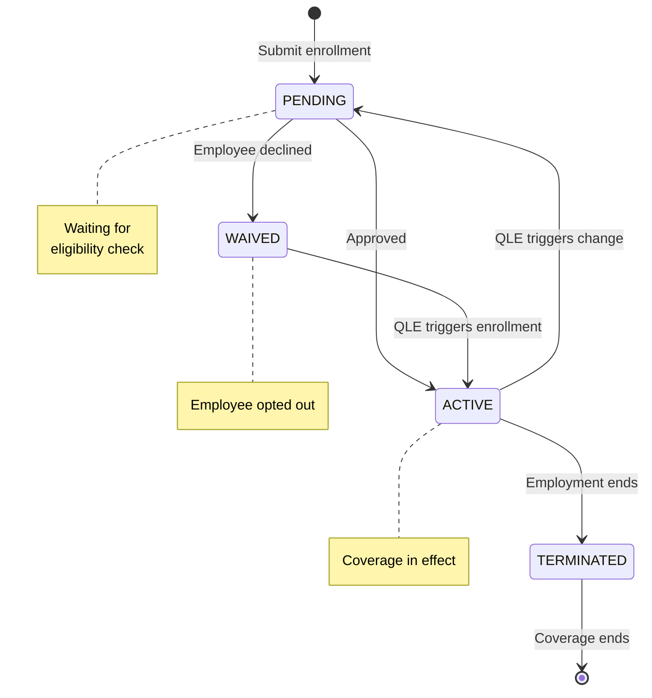

---

## 5. Healthcare Claims

### Purpose

**Healthcare Claims** quản lý các yêu cầu bồi thường y tế:
- Claims submission
- Claim lines (individual services)
- Status tracking

### Table: `healthcare_claim_header`

| Field | Type | Description |
|-------|------|-------------|
| `id` | uuid | Primary key |
| `employee_id` | uuid | Employee |
| `insurer_claim_id` | varchar(50) | Insurer's claim ID |
| `service_date` | date | Date of service |
| `claim_status` | varchar(20) | `SUBMITTED` \| `IN_REVIEW` \| `APPROVED` \| `REJECTED` \| `PAID` |
| `amount` | decimal(18,4) | Total claim amount |
| `currency` | char(3) | Currency |

### Table: `healthcare_claim_line`

| Field | Type | Description |
|-------|------|-------------|
| `id` | uuid | Primary key |
| `claim_header_id` | uuid | Parent claim |
| `procedure_code` | varchar(50) | Medical procedure code |
| `description` | text | Procedure description |
| `charge_amount` | decimal(18,4) | Amount charged |
| `allowed_amount` | decimal(18,4) | Amount allowed by plan |
| `currency` | char(3) | Currency |

### Claim Processing Flow

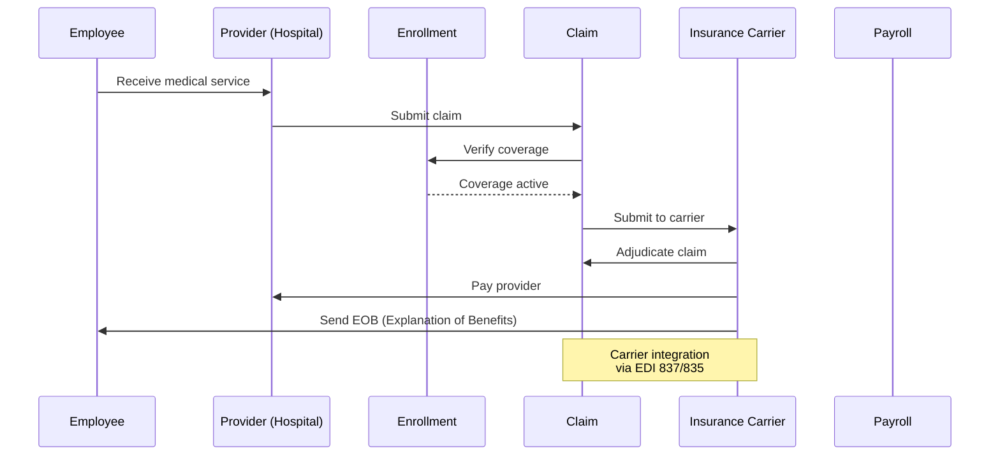

---

## 6. Reimbursement

### Purpose

**Reimbursement Request** quản lý các yêu cầu hoàn tiền:
- Medical expenses
- Wellness programs
- Education reimbursement

### Table: `reimbursement_request`

| Field | Type | Description |
|-------|------|-------------|
| `id` | uuid | Primary key |
| `employee_id` | uuid | Employee |
| `option_id` | uuid | Benefit option |
| `request_type` | varchar(30) | `EXPENSE` \| `MEDICAL` \| `WELLNESS` \| `EDUCATION` |
| `request_date` | date | Request date |
| `status` | varchar(20) | `DRAFT` \| `SUBMITTED` \| `APPROVED` \| `REJECTED` \| `PAID` |
| `total_amount` | decimal(18,4) | Total requested |
| `approved_amount` | decimal(18,4) | Amount approved |
| `currency` | char(3) | Currency |
| `approver_id` | uuid | Approver |
| `decision_date` | timestamp | Decision timestamp |
| `decision_note` | text | Approver notes |

### Table: `reimbursement_line`

| Field | Type | Description |
|-------|------|-------------|
| `id` | uuid | Primary key |
| `request_id` | uuid | Parent request |
| `line_number` | int | Line sequence |
| `description` | varchar(255) | Description |
| `amount` | decimal(18,4) | Line amount |
| `currency` | char(3) | Currency |

### Reimbursement Types

| Type | Description | Example Limits |
|------|-------------|----------------|
| `EXPENSE` | General expense reimbursement | Per company policy |
| `MEDICAL` | Medical expense reimbursement | Up to plan limits |
| `WELLNESS` | Wellness program expenses | $500/year |
| `EDUCATION` | Education/tuition reimbursement | $5,000/year |

### Reimbursement Flow

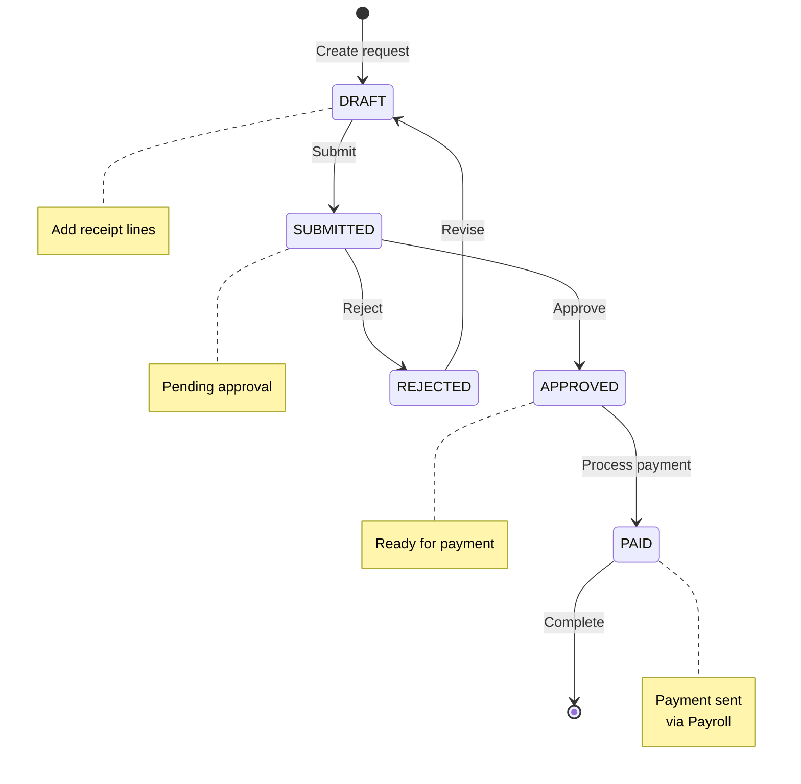

---

## 7. Carrier Integration (EDI 834)

### Purpose

Hệ thống tích hợp với insurance carriers qua **EDI 834** standard:
- Enrollment file transmission
- Webhook + polling fallback

### Integration Pattern

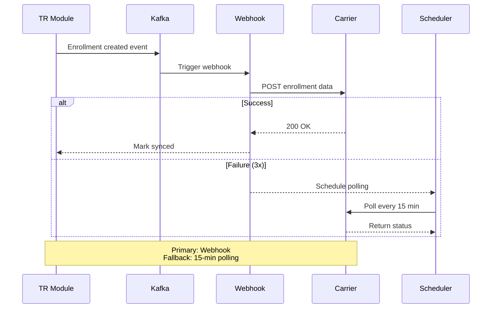

### EDI 834 Structure

```
ISA*00*          *00*          *ZZ*SENDERID       *ZZ*RECEIVERID     *20250401*1000*U*00501*000000001*0*P*:
GS*BE*SENDERID*RECEIVERID*20250401*1000*1*X*005010X220A1
ST*834*0001
BGN*00*ENR20250401*20250401*1000****2
N1*P5*COMPANY NAME*FI*123456789
INS*Y*18*021**AC***FT
NM1*IL*1*DOE*JOHN***MI*123456789
REF*0F*12345678901
DTP*348*D8*20250401
SE*8*0001
GE*1*1
IEA*1*000000001
```

---

## 8. Taxable Benefit Bridge

### Purpose

Một số benefits có giá trị taxable, cần bridge sang Payroll:
- Group Term Life Insurance (GTLI) over $50K
- Employer-paid education
- Taxable perks

### Bridge Flow

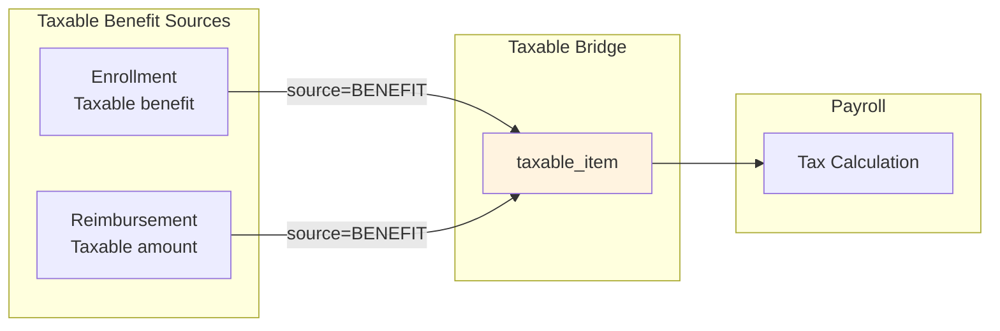

### Taxable Benefit Examples

| Benefit | Taxable Amount | VN Example |
|---------|----------------|------------|
| GTLI over threshold | Imputed income | N/A (VN uses SI) |
| Company car | Fringe benefit value | Car allowance over threshold |
| Education reimbursement | Amount over $5,250/year | Tuition over limit |
| Gym membership | Full amount | Taxable in VN |

---

## Summary

### Key Design Patterns

| Pattern | Application |
|---------|-------------|
| **Plan-Option Structure** | `benefit_plan` → `benefit_option` for flexibility |
| **Centralized Eligibility** | Migration to `eligibility.eligibility_profile` |
| **Coverage Tier** | Standard tiers: Employee, +Spouse, +Children, Family |
| **Taxable Bridge** | Benefits with taxable value → `taxable_item` |
| **Carrier Integration** | EDI 834 with webhook + polling fallback |

### Entity Count

| Entity | Purpose |
|--------|---------|
| `benefit_plan` | Benefit program definition |
| `benefit_option` | Coverage options within plan |
| `eligibility_profile` | Eligibility rules (DEPRECATED) |
| `plan_eligibility` | Plan-eligibility mapping (DEPRECATED) |
| `enrollment` | Employee enrollment |
| `healthcare_claim_header` | Claim header |
| `healthcare_claim_line` | Claim line items |
| `reimbursement_request` | Reimbursement request |
| `reimbursement_line` | Reimbursement line items |

### Critical Relationships

```
Benefit Plan ──has──► Benefit Options
      │                      │
      │                      └──enrolled in──► Enrollment
      │                                            │
      │                                            ├──has──► Healthcare Claims
      │                                            └──has──► Reimbursement Requests
      │
      └──eligibility──► Eligibility Profile (centralized)

Enrollment ──bridges──► Taxable Item (if taxable benefit)
```

---

## Related Documents

- [00-OVERVIEW.md](./00-OVERVIEW.md) — Module overview
- [05-CALCULATION-COMPLIANCE.md](./05-CALCULATION-COMPLIANCE.md) — Taxable bridge detail
- [04-RECOGNITION-OFFER.md](./04-RECOGNITION-OFFER.md) — Recognition & Perks

---

*Document generated from `4.TotalReward.V5.dbml`*