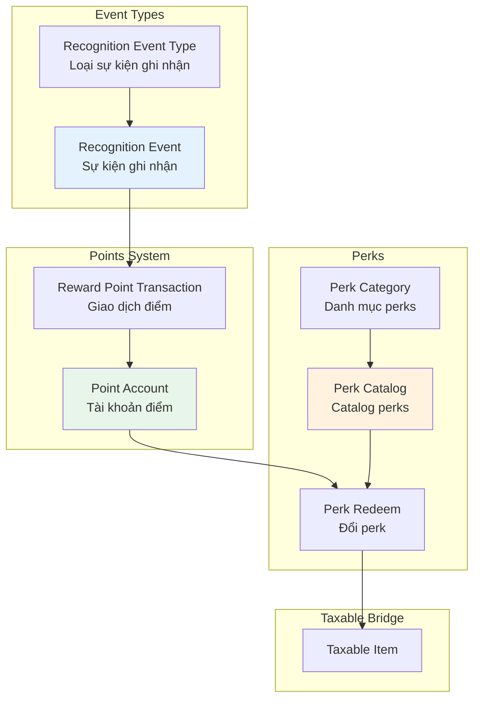
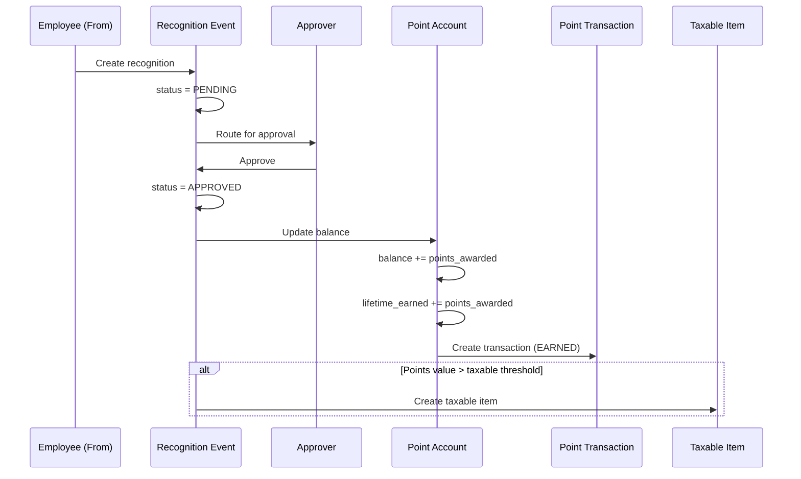
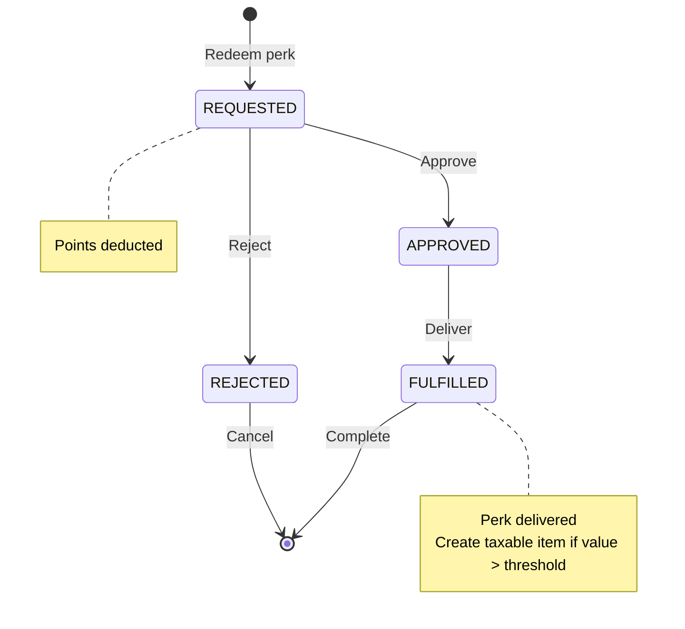
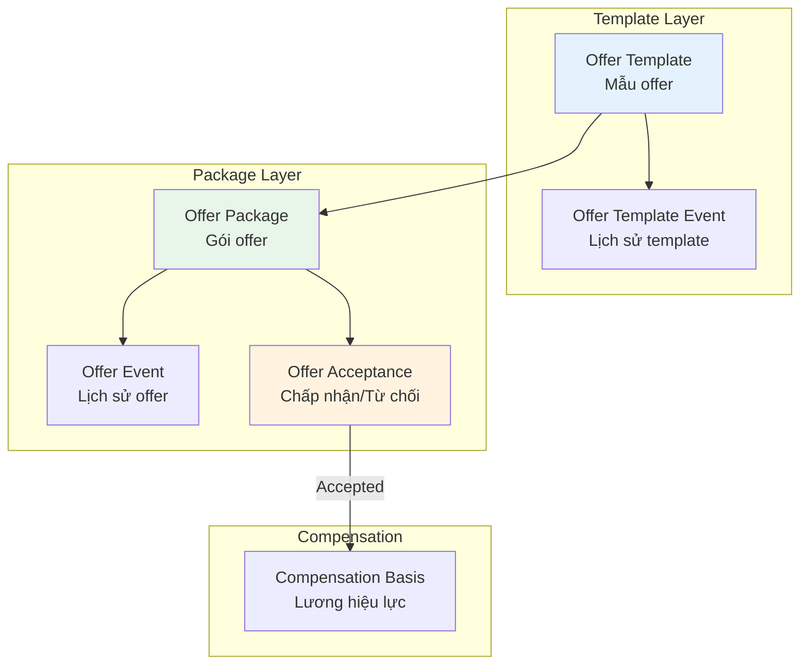
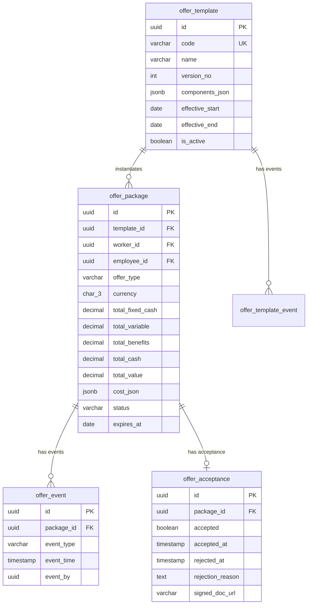
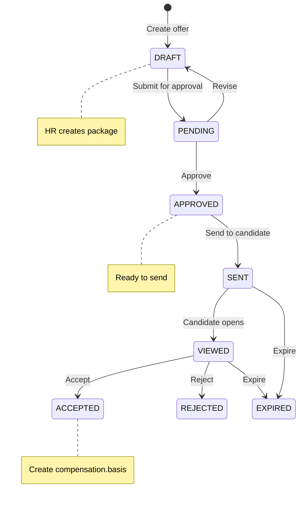
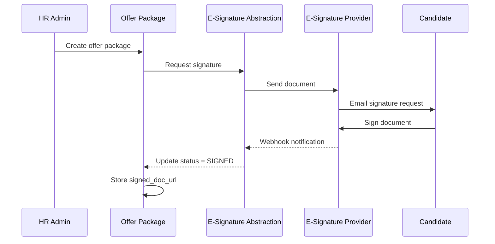
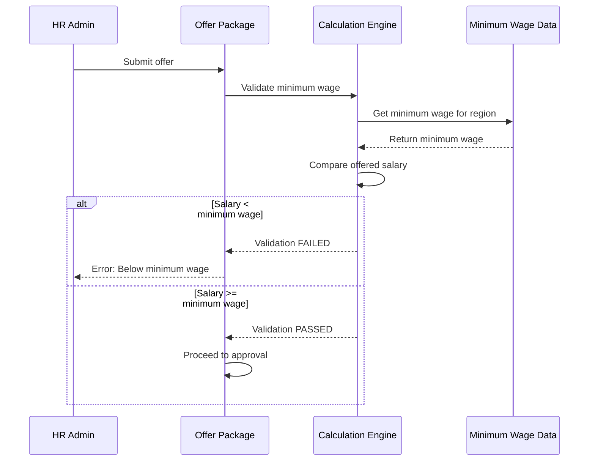
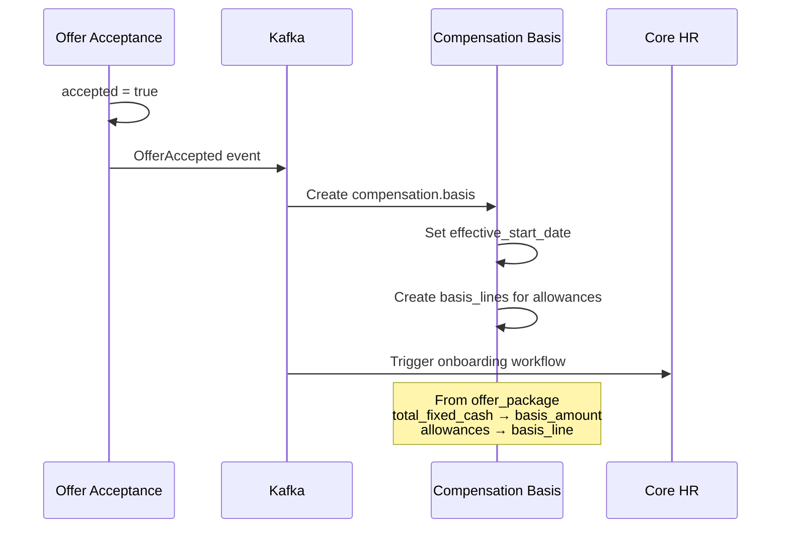

# Recognition & Offer Management — Model Design

**Bounded Contexts**: `recognition`, `tr_offer`  
**Schemas**: `recognition` (8 tables), `tr_offer` (5 tables)  
**Purpose**: Manage peer recognition, points/perks, and candidate offers

---

## Part 1: Recognition

### Overview

Recognition module quản lý hệ thống ghi nhận và phần thưởng:
- **Recognition Events**: Peer-to-peer, manager awards, milestones
- **Points System**: Earn, spend, FIFO expiration
- **Perks Catalog**: Rewards catalog, redemption
- **Social Feed**: Public recognition feed

---

### Conceptual Model



---

### Entity Relationship Diagram

```mermaid
erDiagram
    recognition_event_type ||--o{ recognition_event : "categorizes"
    
    employee ||--o| point_account : "has"
    point_account ||--o{ reward_point_txn : "records"
    
    recognition_event ||--o{ reward_point_txn : "earns"
    perk_redeem ||--o{ reward_point_txn : "spends"
    
    perk_category ||--o{ perk_catalog : "contains"
    perk_catalog ||--o{ perk_redeem : "redeemed"
    
    recognition_event_type {
        varchar code PK
        varchar name
        text description
        boolean is_active
    }
    
    recognition_event {
        uuid id PK
        uuid employee_from_id FK
        uuid employee_to_id FK
        varchar event_type_code FK
        int points_awarded
        varchar reason
        varchar status
        uuid approver_id FK
        text message
    }
    
    point_account {
        uuid employee_id PK FK
        int balance
        int lifetime_earned
        int lifetime_spent
        timestamp last_updated
    }
    
    reward_point_txn {
        uuid id PK
        uuid employee_id FK
        int points_delta
        int balance_after
        varchar txn_type
        varchar reference
        timestamp txn_date
    }
    
    perk_category {
        uuid id PK
        varchar code UK
        varchar name
        boolean is_active
    }
    
    perk_catalog {
        uuid id PK
        varchar code UK
        varchar name
        uuid category_id FK
        int points_cost
        int inventory
        int redeem_limit_per_employee
        varchar status
    }
    
    perk_redeem {
        uuid id PK
        uuid employee_id FK
        uuid perk_id FK
        int points_spent
        varchar status
        timestamp request_date
        timestamp fulfillment_date
        uuid fulfilled_by FK
    }
```

---

### 1. Recognition Event Types

#### Purpose

Định nghĩa các loại sự kiện ghi nhận với points khác nhau.

#### Table: `recognition_event_type`

| Field | Type | Description |
|-------|------|-------------|
| `code` | varchar(50) | Primary key |
| `name` | varchar(100) | Display name |
| `description` | text | Description |
| `is_active` | boolean | Is active? |

#### Event Type Examples

| code | name | Default Points |
|------|------|----------------|
| `THANK_YOU` | Thank You | 10 |
| `SPOT_AWARD` | Spot Award | 50 |
| `MILESTONE` | Service Milestone | 100 |
| `PERFORMANCE` | Performance Recognition | 200 |
| `TEAMWORK` | Teamwork Award | 30 |
| `INNOVATION` | Innovation Award | 100 |
| `VALUES` | Living Our Values | 50 |

---

### 2. Recognition Events

#### Purpose

Ghi nhận một sự kiện ghi nhận từ người này đến người khác.

#### Table: `recognition_event`

| Field | Type | Description |
|-------|------|-------------|
| `id` | uuid | Primary key |
| `employee_from_id` | uuid | Giver |
| `employee_to_id` | uuid | Receiver |
| `event_type_code` | varchar(50) | Event type |
| `points_awarded` | int | Points awarded |
| `reason` | varchar(30) | `PERFORMANCE` \| `TEAMWORK` \| `INNOVATION` \| `VALUES` |
| `status` | varchar(20) | `PENDING` \| `APPROVED` \| `REJECTED` |
| `approver_id` | uuid | Approver |
| `decision_date` | timestamp | Decision timestamp |
| `message` | text | Recognition message |

#### Recognition Flow



---

### 3. Point Account

#### Purpose

Lưu trữ số dư điểm của mỗi nhân viên.

#### Table: `point_account`

| Field | Type | Description |
|-------|------|-------------|
| `employee_id` | uuid | Primary key, FK to employee |
| `balance` | int | Current balance |
| `lifetime_earned` | int | Total earned all time |
| `lifetime_spent` | int | Total spent all time |
| `last_updated` | timestamp | Last update time |
| `created_date` | timestamp | Account creation date |

#### FIFO Expiration

```mermaid
graph LR
    subgraph "Point Batches (FIFO)"
        B1[Batch 1: Jan 15<br/>100 points<br/>Expires Dec 31]
        B2[Batch 2: Feb 20<br/>50 points<br/>Expires Dec 31]
        B3[Batch 3: Mar 10<br/>200 points<br/>Expires Dec 31]
    end
    
    subgraph "Spending"
        S1[Spend 120 points]
        S2[Uses: Batch 1 (100) + Batch 2 (20)]
    end
    
    B1 --> S1
    B2 --> S1
    
    style B1 fill:#ffcdd2
    style B2 fill:#ffe0b2
```

**FIFO Rule**: Points earned earlier are spent first. Expired points are automatically removed.

---

### 4. Reward Point Transactions

#### Purpose

Ghi nhận mọi giao dịch điểm (earn, spend, adjust, expire).

#### Table: `reward_point_txn`

| Field | Type | Description |
|-------|------|-------------|
| `id` | uuid | Primary key |
| `employee_id` | uuid | Employee |
| `points_delta` | int | Points change (+ or -) |
| `balance_after` | int | Balance after transaction |
| `txn_type` | varchar(30) | `EARNED` \| `SPENT` \| `ADJUSTED` \| `EXPIRED` |
| `reference` | varchar(50) | Reference ID (event_id, redeem_id) |
| `txn_date` | timestamp | Transaction timestamp |

#### Transaction Types

| Type | points_delta | Description |
|------|--------------|-------------|
| `EARNED` | +points | Received recognition |
| `SPENT` | -points | Redeemed perk |
| `ADJUSTED` | +/- points | Manual adjustment by HR |
| `EXPIRED` | -points | Points expired |

---

### 5. Perks Catalog

#### Purpose

Catalog các phần thưởng có thể đổi bằng points.

#### Table: `perk_category`

| Field | Type | Description |
|-------|------|-------------|
| `id` | uuid | Primary key |
| `code` | varchar(50) | Unique code |
| `name` | varchar(100) | Display name |
| `is_active` | boolean | Is active? |

#### Table: `perk_catalog`

| Field | Type | Description |
|-------|------|-------------|
| `id` | uuid | Primary key |
| `code` | varchar(50) | Unique code |
| `name` | varchar(200) | Display name |
| `category_id` | uuid | Category |
| `points_cost` | int | Points required |
| `inventory` | int | Available inventory |
| `redeem_limit_per_employee` | int | Limit per employee |
| `status` | varchar(20) | `ACTIVE` \| `OUT_OF_STOCK` \| `DISCONTINUED` |
| `effective_start` | date | Start of availability |
| `effective_end` | date | End of availability |

#### Perk Categories

| Category | Examples |
|----------|----------|
| Gift Cards | Amazon, Starbucks, Grab |
| Experiences | Spa, Movie tickets, Dining |
| Merchandise | Company swag, Electronics |
| Charitable | Donate to charity |
| Time Off | Extra vacation day |

---

### 6. Perk Redemption

#### Purpose

Quản lý việc nhân viên đổi points lấy perks.

#### Table: `perk_redeem`

| Field | Type | Description |
|-------|------|-------------|
| `id` | uuid | Primary key |
| `employee_id` | uuid | Employee |
| `perk_id` | uuid | Perk |
| `points_spent` | int | Points spent |
| `status` | varchar(20) | `REQUESTED` \| `APPROVED` \| `REJECTED` \| `FULFILLED` |
| `request_date` | timestamp | Request date |
| `fulfillment_date` | timestamp | Fulfillment date |
| `fulfilled_by` | uuid | Who fulfilled |

#### Redemption Flow



---

### 7. Taxable Bridge

#### Purpose

Perks có giá trị tiền tệ phải tạo taxable item.

#### Threshold Rule

| Scenario | Taxable? |
|----------|----------|
| Points earned | No (points not taxable) |
| Perk redeemed (value < $100) | No |
| Perk redeemed (value >= $100) | Yes |

#### Example

```
Employee redeems: $150 Amazon Gift Card
Points spent: 1,500 points (assuming $0.10/point)

Taxable Item created:
  source_module: 'RECOGNITION'
  source_table: 'perk_redeem'
  source_id: [perk_redeem.id]
  benefit_type: 'GIFT_CARD'
  taxable_amount: 150.00
  currency: 'USD'
```

---

## Part 2: Offer Management

### Overview

Offer Management quản lý quy trình tạo và theo dõi offer cho ứng viên:
- **Offer Templates**: Mẫu offer tái sử dụng
- **Offer Packages**: Gói offer cụ thể cho từng ứng viên
- **E-Signature Integration**: Ký số offer letter
- **Counter-Offer Handling**: Xử lý counter-offer

---

### Conceptual Model



---

### Entity Relationship Diagram



---

### 1. Offer Templates

#### Purpose

Mẫu offer letter tái sử dụng cho các vị trí tương tự.

#### Table: `offer_template`

| Field | Type | Description |
|-------|------|-------------|
| `id` | uuid | Primary key |
| `code` | varchar(50) | Unique code |
| `name` | varchar(200) | Display name |
| `version_no` | int | Version number |
| `components_json` | jsonb | Offer components definition |
| `effective_start` | date | Start of validity |
| `effective_end` | date | End of validity |
| `is_active` | boolean | Is active? |

#### Components JSON Example

```json
{
  "components": [
    {
      "type": "BASE_SALARY",
      "name": "Base Salary",
      "required": true,
      "validation": {
        "min": 50000000,
        "max": 200000000,
        "currency": "VND"
      }
    },
    {
      "type": "ALLOWANCE",
      "name": "Lunch Allowance",
      "default_value": 730000,
      "frequency": "MONTHLY"
    },
    {
      "type": "BONUS",
      "name": "Performance Bonus",
      "target_pct": 15,
      "description": "15% of annual salary"
    },
    {
      "type": "EQUITY",
      "name": "RSU Grant",
      "default_units": 1000,
      "vesting_schedule": "4_YEAR_GRADED"
    }
  ],
  "template_sections": [
    {
      "section": "COMPENSATION",
      "order": 1,
      "content": "Your total compensation includes..."
    },
    {
      "section": "BENEFITS",
      "order": 2,
      "content": "You will be eligible for..."
    }
  ]
}
```

---

### 2. Offer Packages

#### Purpose

Gói offer cụ thể cho từng ứng viên.

#### Table: `offer_package`

| Field | Type | Description |
|-------|------|-------------|
| `id` | uuid | Primary key |
| `template_id` | uuid | Template reference |
| `worker_id` | uuid | Candidate (person.worker) |
| `employee_id` | uuid | Existing employee (if internal) |
| `offer_type` | varchar(30) | `NEW_HIRE` \| `PROMOTION` \| `RETENTION` \| `COUNTER_OFFER` |
| `currency` | char(3) | Currency |
| `total_fixed_cash` | decimal(18,4) | Total fixed compensation |
| `total_variable` | decimal(18,4) | Variable compensation |
| `total_benefits` | decimal(18,4) | Benefits value |
| `total_cash` | decimal(18,4) | Fixed + Variable |
| `total_value` | decimal(18,4) | Everything |
| `cost_json` | jsonb | Detailed cost breakdown |
| `status` | varchar(20) | Offer status |
| `approved_by` | uuid | Approver |
| `approved_at` | timestamp | Approval timestamp |
| `sent_date` | date | When sent to candidate |
| `expires_at` | date | Expiration date |

#### Offer Types

| Type | Description |
|------|-------------|
| `NEW_HIRE` | External candidate |
| `PROMOTION` | Internal promotion |
| `RETENTION` | Retention package for key employee |
| `COUNTER_OFFER` | Response to competing offer |

#### Offer Status Flow



---

### 3. Offer Events

#### Purpose

Theo dõi mọi sự kiện trong vòng đời offer.

#### Table: `offer_event`

| Field | Type | Description |
|-------|------|-------------|
| `id` | uuid | Primary key |
| `package_id` | uuid | Parent package |
| `event_type` | varchar(50) | Event type |
| `event_time` | timestamp | Event timestamp |
| `event_by` | uuid | Who/what triggered |

#### Event Types

| Event | Description |
|-------|-------------|
| `CREATED` | Offer created |
| `UPDATED` | Offer updated |
| `SUBMITTED` | Submitted for approval |
| `APPROVED` | Approved |
| `SENT` | Sent to candidate |
| `VIEWED` | Candidate viewed |
| `REMINDER` | Reminder sent |
| `ACCEPTED` | Accepted |
| `REJECTED` | Rejected |
| `EXPIRED` | Expired |
| `WITHDRAWN` | Withdrawn by company |

---

### 4. Offer Acceptance

#### Purpose

Ghi nhận quyết định của ứng viên.

#### Table: `offer_acceptance`

| Field | Type | Description |
|-------|------|-------------|
| `id` | uuid | Primary key |
| `package_id` | uuid | Parent package |
| `accepted` | boolean | Accepted or rejected |
| `accepted_at` | timestamp | Acceptance timestamp |
| `rejected_at` | timestamp | Rejection timestamp |
| `rejection_reason` | text | Reason for rejection |
| `signed_doc_url` | varchar(255) | Signed offer letter URL |

---

### 5. E-Signature Integration

#### Purpose

Tích hợp với e-signature providers (DocuSign, HelloSign) để ký offer letter.

#### Multi-Provider Abstraction

```mermaid
graph LR
    subgraph "TR Offer Module"
        OP[Offer Package]
    end
    
    subgraph "E-Signature Abstraction"
        ABS[Provider Abstraction Layer]
    end
    
    subgraph "Providers"
        DS[DocuSign]
        HS[HelloSign]
        AD[Adobe Sign]
    end
    
    OP --> ABS
    ABS --> DS
    ABS --> HS
    ABS --> AD
    
    Note over ABS: Primary: Webhook<br/>Fallback: 15-min polling
```

#### Integration Flow



---

### 6. Minimum Wage Validation

#### Purpose

Validate offer salary meets minimum wage requirements.

#### Validation Flow



---

### 7. Post-Acceptance: Create Compensation Basis

#### Purpose

Khi offer được chấp nhận, tạo compensation.basis cho nhân viên.

#### Flow



---

## Summary

### Recognition Summary

| Entity | Purpose |
|--------|---------|
| `recognition_event_type` | Define recognition categories |
| `recognition_event` | Record recognition events |
| `point_account` | Employee point balance |
| `reward_point_txn` | Point transactions |
| `perk_category` | Perk categories |
| `perk_catalog` | Available perks |
| `perk_redeem` | Redemption records |

### Offer Management Summary

| Entity | Purpose |
|--------|---------|
| `offer_template` | Reusable offer templates |
| `offer_template_event` | Template change history |
| `offer_package` | Candidate-specific offer |
| `offer_event` | Offer lifecycle events |
| `offer_acceptance` | Acceptance/rejection record |

### Key Design Patterns

| Pattern | Application |
|---------|-------------|
| **FIFO Points** | Points expire oldest first |
| **Template Instantiation** | `offer_template` → `offer_package` |
| **E-Signature Abstraction** | Multi-provider support |
| **Post-Acceptance Trigger** | Create `compensation.basis` on accept |
| **Taxable Bridge** | Perks with value → `taxable_item` |

---

## Related Documents

- [00-OVERVIEW.md](./00-OVERVIEW.md) — Module overview
- [06-EMPLOYEE-COMPENSATION.md](./06-EMPLOYEE-COMPENSATION.md) — Compensation basis
- [03-BENEFITS.md](./03-BENEFITS.md) — Benefits enrollment

---

*Document generated from `4.TotalReward.V5.dbml`*