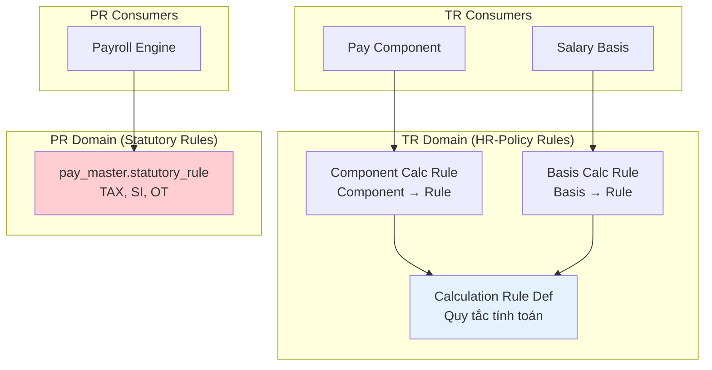
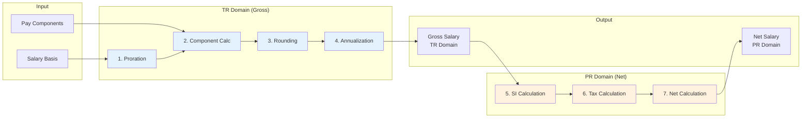
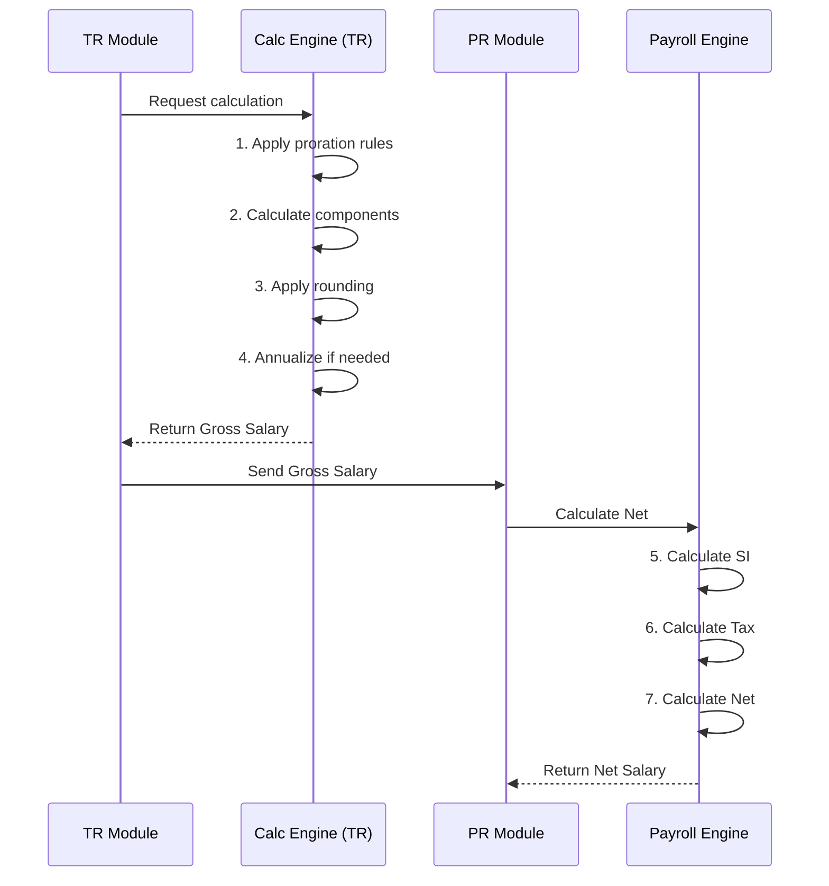
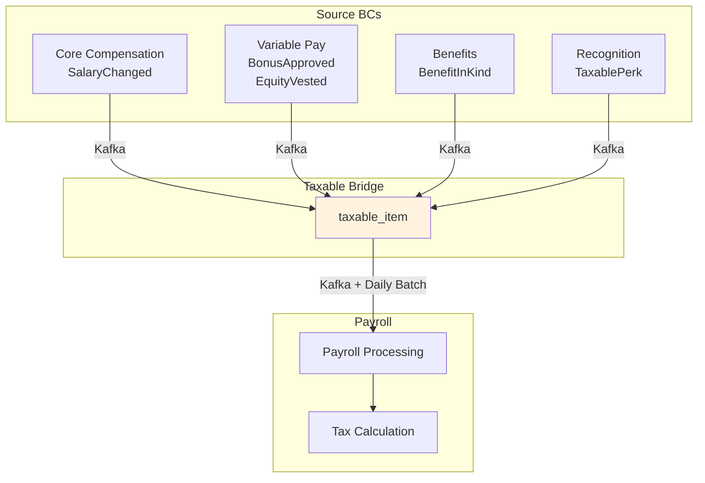
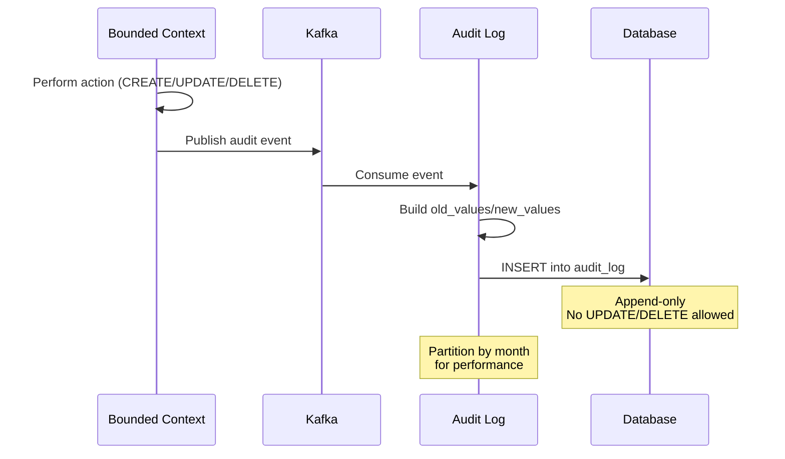

# Calculation Rules & Compliance — Model Design

**Bounded Contexts**: `comp_core` (rules), `tr_taxable`, `tr_audit`  
**Schemas**: `comp_core` (rules), `tr_taxable` (1 table), `tr_audit` (1 table)  
**Purpose**: Manage calculation rules, taxable item bridge, and audit trail

---

## Part 1: Calculation Rules

### Overview

Calculation Rules định nghĩa các quy tắc tính toán:
- **HR-Policy Rules** (TR Domain): Proration, Rounding, FX, Annualization
- **Statutory Rules** (PR Domain): TAX, SI, OT — moved to `pay_master.statutory_rule`

**Critical**: TR chỉ sở hữu HR-policy rules (tính đến Gross). Statutory rules thuộc PR domain.

---

### Conceptual Model



---

### 1. Calculation Rule Definition

#### Purpose

Định nghĩa các quy tắc tính toán (HR-policy scope only).

#### Table: `calculation_rule_def`

| Field | Type | Description |
|-------|------|-------------|
| `id` | uuid | Primary key |
| `code` | varchar(50) | Unique code |
| `name` | varchar(200) | Display name |
| `rule_category` | varchar(30) | `PRORATION` \| `ROUNDING` \| `FOREX` \| `ANNUALIZATION` \| `COMPENSATION_POLICY` |
| `rule_type` | varchar(30) | `FORMULA` \| `LOOKUP_TABLE` \| `CONDITIONAL` \| `RATE_TABLE` \| `PROGRESSIVE` |
| `country_code` | char(2) | Country-specific (NULL = global) |
| `jurisdiction` | varchar(50) | State/Province |
| `formula_json` | jsonb | Calculation logic |
| `description` | text | Description |
| `legal_reference` | text | Legal citation |
| `effective_start` | date | Start of validity |
| `effective_end` | date | End of validity |
| `version_number` | int | Version sequence |
| `previous_version_id` | uuid | Previous version link |
| `is_current_version` | boolean | Is current? |

#### Rule Categories (TR Domain Only)

| Category | Purpose | Example |
|----------|---------|---------|
| `PRORATION` | Calculate partial period | New hire, termination mid-month |
| `ROUNDING` | Rounding rules | Round to nearest 1,000 VND |
| `FOREX` | Currency conversion | VND ↔ USD for expats |
| `ANNUALIZATION` | Convert frequency | Monthly → Annual |
| `COMPENSATION_POLICY` | Company-specific rules | Merit matrix formula |

**Migrated to PR Domain** (statutory rules):
| Rule | Now in PR |
|------|-----------|
| `VN_PIT_2025` | `pay_master.statutory_rule` |
| `VN_SI_2025` | `pay_master.statutory_rule` |
| `VN_OT_MULT_2019` | `pay_master.statutory_rule` |
| `SG_CPF_2025` | `pay_master.statutory_rule` |

#### Rule Types

| Type | Description | Use Case |
|------|-------------|----------|
| `FORMULA` | Mathematical formula | `salary * 0.08` for 8% |
| `LOOKUP_TABLE` | Table lookup | Tax brackets |
| `CONDITIONAL` | IF-THEN-ELSE logic | Country-specific rules |
| `RATE_TABLE` | Exchange rates | FX conversion |
| `PROGRESSIVE` | Progressive calculation | Tiered commission |

---

### 2. Formula JSON Structure

#### Purpose

Định nghĩa logic tính toán trong `formula_json`.

#### Proration Rule Example

```json
{
  "rule_type": "CALENDAR_DAYS",
  "formula": "(monthly_salary / days_in_month) * days_worked",
  "variables": {
    "monthly_salary": {
      "type": "input",
      "source": "salary_basis.amount"
    },
    "days_in_month": {
      "type": "function",
      "function": "DAYS_IN_MONTH",
      "args": ["period_date"]
    },
    "days_worked": {
      "type": "function",
      "function": "DAYS_BETWEEN",
      "args": ["employment_start", "period_end"]
    }
  }
}
```

#### FX Conversion Rule Example

```json
{
  "rule_type": "RATE_TABLE",
  "source_currency": "USD",
  "target_currency": "VND",
  "rate_source": "DAILY",
  "providers": ["OANDA", "VIETCOMBANK"],
  "fallback_rate": 24000,
  "formula": "amount * rate"
}
```

#### Annualization Rule Example

```json
{
  "rule_type": "FORMULA",
  "formula": "monthly_amount * 12",
  "variables": {
    "monthly_amount": {
      "type": "input",
      "source": "salary_basis.amount"
    }
  },
  "reverse_formula": "annual_amount / 12"
}
```

---

### 3. Component Calculation Rule

#### Purpose

Liên kết Pay Component với Calculation Rules.

#### Table: `component_calculation_rule`

| Field | Type | Description |
|-------|------|-------------|
| `id` | uuid | Primary key |
| `component_id` | uuid | Pay component |
| `rule_id` | uuid | Calculation rule |
| `rule_scope` | varchar(30) | `COMPONENT_CALC` \| `PRORATION` \| `VALIDATION` \| `ANNUALIZATION` |
| `execution_order` | int | Calculation sequence |
| `override_params` | jsonb | Component-specific overrides |
| `effective_start` | date | Start of validity |
| `effective_end` | date | End of validity |

#### Rule Scopes

| Scope | Purpose |
|-------|---------|
| `COMPONENT_CALC` | How to calculate this component |
| `PRORATION` | How to prorate this component |
| `VALIDATION` | Validation rules for component |
| `ANNUALIZATION` | How to annualize component |

#### Example

```
Component: Lunch Allowance
Rule: VN_PRORATION_2025
Scope: PRORATION
Execution Order: 1
Override Params: {
  "proration_method": "WORKING_DAYS",
  "exclude_holidays": true
}
```

---

### 4. Basis Calculation Rule

#### Purpose

Liên kết Salary Basis với Calculation Rules.

#### Table: `basis_calculation_rule`

| Field | Type | Description |
|-------|------|-------------|
| `id` | uuid | Primary key |
| `salary_basis_id` | uuid | Salary basis |
| `rule_id` | uuid | Calculation rule |
| `rule_scope` | varchar(30) | `PRORATION` \| `ROUNDING` \| `ANNUALIZATION` |
| `execution_order` | int | Calculation sequence |
| `override_params` | jsonb | Basis-specific overrides |
| `effective_start` | date | Start of validity |
| `effective_end` | date | End of validity |

#### Execution Order

```
1. PRORATION (TR) - Prorate salary for partial period
2. COMPONENT_CALC (TR) - Calculate each component
3. ROUNDING (TR) - Round amounts
4. ANNUALIZATION (TR) - Convert to annual if needed
5. SI_CALCULATION (PR) - Calculate social insurance
6. TAX (PR) - Calculate income tax
7. NET (PR) - Calculate net salary
```

---

### 5. Calculation Flow

#### TR vs PR Domain Boundary



#### Detailed Flow



---

### 6. Country Configuration

#### Purpose

Lưu cấu hình theo quốc gia.

#### Table: `country_config`

| Field | Type | Description |
|-------|------|-------------|
| `id` | uuid | Primary key |
| `country_code` | char(2) | ISO country code |
| `country_name` | varchar(100) | Country name |
| `currency_code` | char(3) | ISO currency code |
| `tax_system` | varchar(30) | `PROGRESSIVE` \| `FLAT` \| `DUAL` |
| `si_system` | varchar(30) | `MANDATORY` \| `OPTIONAL` \| `HYBRID` |
| `standard_working_hours_per_day` | int | Standard hours |
| `standard_working_days_per_week` | int | Standard days/week |
| `standard_working_days_per_month` | int | Standard days/month |
| `config_json` | jsonb | Country-specific config |

#### Example: Vietnam

| Field | Value |
|-------|-------|
| `country_code` | VN |
| `country_name` | Vietnam |
| `currency_code` | VND |
| `tax_system` | PROGRESSIVE |
| `si_system` | MANDATORY |
| `standard_working_hours_per_day` | 8 |
| `standard_working_days_per_week` | 5 |
| `standard_working_days_per_month` | 22 |

---

### 7. Holiday Calendar

#### Purpose

Lịch nghỉ lễ theo quốc gia, dùng cho OT calculation và proration.

#### Table: `holiday_calendar`

| Field | Type | Description |
|-------|------|-------------|
| `id` | uuid | Primary key |
| `country_code` | char(2) | Country code |
| `jurisdiction` | varchar(50) | State/Province |
| `year` | int | Year |
| `holiday_date` | date | Holiday date |
| `holiday_name` | varchar(200) | Holiday name |
| `holiday_type` | varchar(30) | `NATIONAL` \| `REGIONAL` \| `BANK` \| `OPTIONAL` |
| `is_paid` | boolean | Paid holiday? |
| `ot_multiplier` | decimal(4,2) | OT multiplier if working |

#### Vietnam Holidays 2025 Example

| holiday_date | holiday_name | holiday_type | ot_multiplier |
|--------------|--------------|--------------|---------------|
| 2025-01-01 | Tết Dương lịch | NATIONAL | 3.0 |
| 2025-01-29 | Tết Nguyên Đán (Day 1) | NATIONAL | 3.0 |
| 2025-01-30 | Tết Nguyên Đán (Day 2) | NATIONAL | 3.0 |
| 2025-01-31 | Tết Nguyên Đán (Day 3) | NATIONAL | 3.0 |
| 2025-04-30 | Ngày Giải phóng | NATIONAL | 3.0 |
| 2025-05-01 | Quốc tế Lao động | NATIONAL | 3.0 |
| 2025-09-02 | Quốc khánh | NATIONAL | 3.0 |

---

## Part 2: Taxable Bridge

### Overview

**Taxable Bridge** (`tr_taxable`) là **Anti-Corruption Layer** thu thập các taxable events từ tất cả BCs và bridge sang Payroll.

### Table: `taxable_item`

| Field | Type | Description |
|-------|------|-------------|
| `id` | uuid | Primary key |
| `source_module` | varchar(30) | `BENEFIT` \| `EQUITY` \| `PERK` \| `RECOGNITION` |
| `source_table` | varchar(50) | Source table name |
| `source_id` | uuid | Source record ID |
| `employee_id` | uuid | Employee |
| `benefit_type` | varchar(50) | Type of taxable benefit |
| `taxable_amount` | decimal(18,4) | Taxable amount |
| `currency` | char(3) | Currency |
| `tax_year` | smallint | Tax year |
| `payroll_batch_id` | uuid | Payroll batch reference |
| `processed_flag` | boolean | Processed by Payroll? |
| `processed_at` | timestamp | Processing timestamp |

### Source Modules

| source_module | source_table | benefit_type | Example |
|---------------|--------------|--------------|---------|
| `BENEFIT` | `bonus_allocation` | `CASH_BONUS` | Performance bonus |
| `EQUITY` | `equity_vesting_event` | `EQUITY_VEST` | RSU vest |
| `EQUITY` | `equity_txn` | `EQUITY_GAIN` | Option exercise |
| `PERK` | `perk_redeem` | `GIFT_CARD` | Amazon gift card |
| `RECOGNITION` | `recognition_event` | `CASH_AWARD` | Spot award |

### Bridge Flow



### Idempotency

**Key**: `(source_module, source_table, source_id)` ensures exactly-once processing.

```
Example:
  source_module = 'EQUITY'
  source_table = 'equity_vesting_event'
  source_id = [vesting_event.uuid]
  
  If same event processed twice:
    - First: Creates taxable_item
    - Second: Unique constraint violation → skipped
```

---

## Part 3: Audit Trail

### Overview

**Audit Trail** (`tr_audit`) ghi nhận mọi thay đổi trong TR module:
- Immutable append-only storage
- 7-year retention
- Tamper-proof

### Table: `audit_log`

| Field | Type | Description |
|-------|------|-------------|
| `id` | uuid | Primary key |
| `event_type` | varchar(50) | `COMP_CHANGED` \| `BONUS_APPROVED` \| `EQUITY_VESTED` ... |
| `entity_type` | varchar(50) | Table name |
| `entity_id` | uuid | Record ID |
| `action` | varchar(20) | `CREATE` \| `UPDATE` \| `DELETE` \| `APPROVE` \| `REJECT` \| `VIEW` |
| `user_id` | uuid | Who performed action |
| `user_role` | varchar(50) | User's role |
| `ip_address` | inet | IP address |
| `user_agent` | text | Browser/client info |
| `request_id` | uuid | Request correlation ID |
| `old_values` | jsonb | Previous state |
| `new_values` | jsonb | New state |
| `change_summary` | text | Human-readable summary |
| `reason` | text | Why change was made |
| `timestamp` | timestamp | When change occurred |

### Event Types

| event_type | Description |
|------------|-------------|
| `COMP_CHANGED` | Compensation changed |
| `COMP_CYCLE_OPENED` | Compensation cycle opened |
| `COMP_CYCLE_CLOSED` | Compensation cycle closed |
| `BONUS_APPROVED` | Bonus approved |
| `EQUITY_VESTED` | Equity vested |
| `ENROLLMENT_CREATED` | Benefit enrollment created |
| `OFFER_ACCEPTED` | Offer accepted |
| `TAXABLE_ITEM_CREATED` | Taxable item created |

### Actions

| action | Description |
|--------|-------------|
| `CREATE` | New record created |
| `UPDATE` | Record updated |
| `DELETE` | Record deleted |
| `APPROVE` | Record approved |
| `REJECT` | Record rejected |
| `VIEW` | Record viewed (for sensitive data) |

### Audit Flow



### Partitioning Strategy

```sql
-- Partition audit_log by month
CREATE TABLE tr_audit.audit_log_2025_01 
  PARTITION OF tr_audit.audit_log
  FOR VALUES FROM ('2025-01-01') TO ('2025-02-01');

CREATE TABLE tr_audit.audit_log_2025_02 
  PARTITION OF tr_audit.audit_log
  FOR VALUES FROM ('2025-02-01') TO ('2025-03-01');
```

### Retention Policy

| Period | Action |
|--------|--------|
| 0-2 years | Hot storage (SSD) |
| 2-7 years | Archive storage |
| 7+ years | Purge or external archive |

---

## Part 4: Employee Reward Summary

### Purpose

Aggregated view của tất cả rewards cho một employee.

### Table: `employee_reward_summary`

| Field | Type | Description |
|-------|------|-------------|
| `id` | uuid | Primary key |
| `employee_id` | uuid | Employee |
| `eligibility_profile_id` | uuid | Eligibility that granted this |
| `reward_type` | varchar(30) | `LEAVE` \| `BENEFIT` \| `COMP_PLAN` \| `BONUS` \| `PAYROLL_ELEMENT` \| `PERK` |
| `reward_source` | varchar(50) | Source table |
| `reward_entity_id` | uuid | Source entity ID |
| `reward_entity_code` | varchar(50) | Human-readable code |
| `reward_entity_name` | varchar(255) | Display name |
| `status` | varchar(20) | `ACTIVE` \| `FUTURE` \| `EXPIRED` \| `WAIVED` |
| `effective_start` | date | Start date |
| `effective_end` | date | End date |
| `calculated_value` | decimal(18,4) | Monetary value |
| `currency` | char(3) | Currency |
| `last_evaluated_at` | timestamp | Last evaluation |

### Reward Types

| reward_type | reward_source | Example |
|-------------|---------------|---------|
| `LEAVE` | `absence.leave_type` | Annual leave 12 days |
| `BENEFIT` | `benefit.benefit_plan` | Medical insurance |
| `COMP_PLAN` | `comp_core.comp_plan` | Merit plan 2025 |
| `BONUS` | `comp_incentive.bonus_plan` | Performance bonus |
| `PAYROLL_ELEMENT` | `payroll.element` | Lunch allowance |
| `PERK` | `recognition.perk_catalog` | Gym membership |

### Use Case

```sql
-- Query: What rewards does employee X have?
SELECT reward_type, reward_entity_name, calculated_value, currency
FROM total_rewards.employee_reward_summary
WHERE employee_id = 'uuid-xxx'
  AND status = 'ACTIVE';
```

---

## Summary

### Calculation Rules Summary

| Entity | Purpose |
|--------|---------|
| `calculation_rule_def` | Define HR-policy calculation rules |
| `component_calculation_rule` | Link component to rules |
| `basis_calculation_rule` | Link salary basis to rules |
| `country_config` | Country-specific settings |
| `holiday_calendar` | Holiday dates for OT/proration |

### Cross-Cutting Summary

| Entity | Purpose |
|--------|---------|
| `taxable_item` | Bridge taxable events to Payroll |
| `audit_log` | Immutable audit trail |
| `employee_reward_summary` | Aggregated rewards view |

### Key Design Patterns

| Pattern | Application |
|---------|-------------|
| **Domain Boundary** | TR (HR-policy) vs PR (Statutory) |
| **SCD Type 2** | `calculation_rule_def` versioning |
| **Anti-Corruption Layer** | `taxable_item` as bridge |
| **Immutable Audit** | Append-only `audit_log` |
| **Idempotency** | Unique constraint on `(source_module, source_table, source_id)` |

---

## Related Documents

- [00-OVERVIEW.md](./00-OVERVIEW.md) — Module overview
- [01-CORE-COMPENSATION.md](./01-CORE-COMPENSATION.md) — Core compensation rules
- [02-VARIABLE-PAY.md](./02-VARIABLE-PAY.md) — Equity taxable events

---

*Document generated from `4.TotalReward.V5.dbml`*