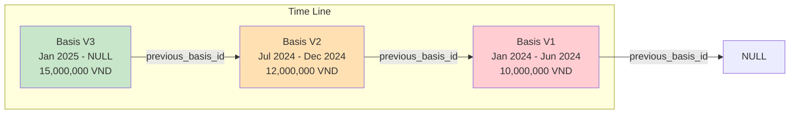
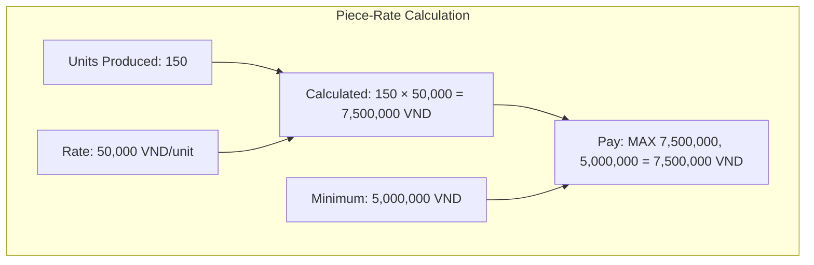
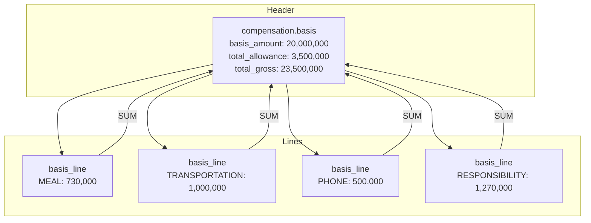
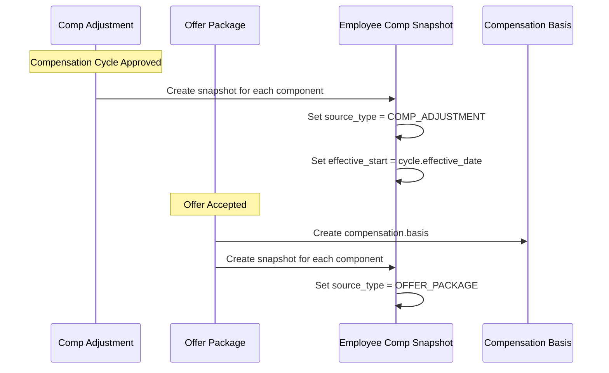
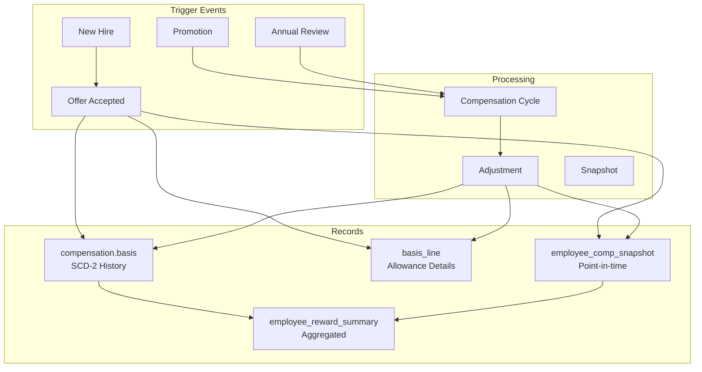
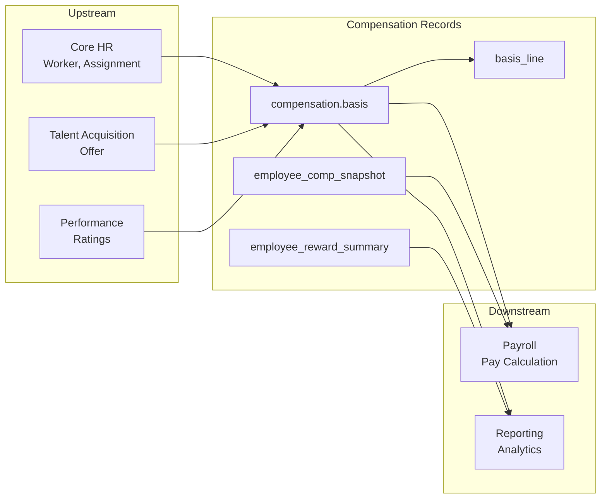

# Employee Compensation Records — Model Design

**Bounded Contexts**: `compensation`, `comp_core` (snapshot)  
**Schemas**: `compensation` (2 tables), `comp_core` (snapshot), `total_rewards` (summary)  
**Purpose**: Store employee compensation records with SCD Type 2, flexible component lines, and reward summary

---

## Overview

Employee Compensation Records lưu trữ:
- **compensation.basis**: Lương hiệu lực (SCD Type 2)
- **compensation.basis_line**: Chi tiết phụ cấp linh hoạt
- **comp_core.employee_comp_snapshot**: Snapshot lương tại thời điểm
- **total_rewards.employee_reward_summary**: Tổng hợp rewards

---

## Part 1: Compensation Basis (SCD Type 2)

### Purpose

**Compensation Basis** là entity trung tâm lưu lịch sử lương của nhân viên:
- Lương cơ bản (operational base)
- Phụ cấp cố định (flexible lines)
- Lịch sử thay đổi (SCD Type 2)
- Hỗ trợ piece-rate/output-based pay

### Table: `compensation.basis`

| Field | Type | Description |
|-------|------|-------------|
| `id` | uuid | Primary key |
| `work_relationship_id` | uuid | FK to employment.work_relationship |
| `assignment_id` | uuid | FK to employment.assignment (nullable for multi-assignment) |
| `effective_start_date` | date | Start of validity |
| `effective_end_date` | date | End of validity (NULL = current) |
| `is_current_flag` | boolean | Is current record? |
| `basis_amount` | decimal(15,2) | Base salary (operational) |
| `currency_code` | char(3) | ISO currency |
| `frequency_code` | varchar(20) | `MONTHLY` \| `HOURLY` \| `ANNUALLY` \| `DAILY` \| `PER_UNIT` |
| `annualization_factor` | decimal(6,2) | Factor to annualize |
| `annual_equivalent` | decimal(15,2) | Annualized salary |
| `output_unit_code` | varchar(30) | Output unit for piece-rate |
| `unit_rate_amount` | decimal(15,4) | Rate per unit |
| `guaranteed_minimum` | decimal(15,2) | Minimum guaranteed pay |
| `basis_type_code` | varchar(30) | `LEGAL_BASE` \| `OPERATIONAL_BASE` \| `MARKET_ADJUSTED` |
| `source_code` | varchar(30) | `CONTRACT` \| `MANUAL_ADJUST` \| `PROMOTION` \| `COMP_CYCLE` |
| `reason_code` | varchar(30) | `HIRE` \| `PROBATION_END` \| `ANNUAL_REVIEW` \| `PROMOTION` |
| `adjustment_amount` | decimal(15,2) | Delta from previous |
| `adjustment_percentage` | decimal(5,2) | % change |
| `previous_basis_id` | uuid | Link to previous record |
| `contract_id` | uuid | FK to employment.contract |
| `salary_basis_id` | uuid | FK to comp_core.salary_basis |
| `approval_status` | varchar(20) | `PENDING` \| `APPROVED` \| `REJECTED` |
| `approved_by` | uuid | Approver |
| `approval_date` | timestamp | Approval timestamp |
| `next_review_date` | date | Next salary review |
| `social_insurance_basis` | decimal(15,2) | SI contribution base |
| `regional_min_wage_zone` | varchar(10) | `ZONE_I` \| `ZONE_II` \| `ZONE_III` \| `ZONE_IV` |
| `has_component_lines` | boolean | Has detail lines? |
| `total_allowance_amount` | decimal(15,2) | Sum of allowances |
| `total_gross_amount` | decimal(15,2) | basis_amount + allowances |
| `component_line_count` | int | Number of allowance lines |
| `notes` | text | Notes |
| `status_code` | varchar(30) | `DRAFT` \| `PENDING_APPROVAL` \| `ACTIVE` \| `FUTURE` \| `SUPERSEDED` \| `CANCELLED` |

---

### SCD Type 2 Pattern



### Version Chain Example

```
Basis V3 (current):
  id: uuid-3
  effective_start_date: 2025-01-01
  effective_end_date: NULL
  is_current_flag: true
  basis_amount: 15,000,000
  previous_basis_id: uuid-2
  adjustment_amount: 3,000,000 (from V2)
  adjustment_percentage: 25%

Basis V2:
  id: uuid-2
  effective_start_date: 2024-07-01
  effective_end_date: 2024-12-31
  is_current_flag: false
  basis_amount: 12,000,000
  previous_basis_id: uuid-1
  adjustment_amount: 2,000,000 (from V1)
  adjustment_percentage: 20%

Basis V1:
  id: uuid-1
  effective_start_date: 2024-01-01
  effective_end_date: 2024-06-30
  is_current_flag: false
  basis_amount: 10,000,000
  previous_basis_id: NULL
```

---

### Piece-Rate / Output-Based Pay Support

#### Purpose

Hỗ trợ lương theo sản phẩm (piece-rate) cho công nhân, giáo viên, etc.

#### Fields

| Field | Description | Example |
|-------|-------------|---------|
| `frequency_code` | `PER_UNIT` for piece-rate | PER_UNIT |
| `output_unit_code` | Unit of output | PIECE, ARTICLE, TEACHING_HOUR, GARMENT |
| `unit_rate_amount` | Rate per unit | 50,000 VND/piece |
| `guaranteed_minimum` | Minimum guaranteed | 5,000,000 VND/month |

#### Calculation



#### Example Use Cases

| Use Case | output_unit_code | unit_rate_amount | guaranteed_minimum |
|----------|------------------|------------------|-------------------|
| Garment worker | GARMENT | 30,000 VND | 4,680,000 VND |
| Teacher (hourly) | TEACHING_HOUR | 200,000 VND | 8,000,000 VND |
| Freelancer | ARTICLE | 500,000 VND | - |

---

### Basis Type Classification

| basis_type_code | Description | Example |
|------------------|-------------|---------|
| `LEGAL_BASE` | Base per labor contract | Contract salary |
| `OPERATIONAL_BASE` | Actual operational pay | Salary after adjustments |
| `MARKET_ADJUSTED` | Adjusted for market | Market correction |

### Source Classification

| source_code | Description | Example |
|-------------|-------------|---------|
| `CONTRACT` | Initial contract | New hire offer |
| `MANUAL_ADJUST` | Manual adjustment | Off-cycle raise |
| `PROMOTION` | Due to promotion | Grade change |
| `COMP_CYCLE` | Annual review | Merit increase |

### Reason Codes

| reason_code | Description |
|-------------|-------------|
| `HIRE` | New hire |
| `PROBATION_END` | End of probation |
| `ANNUAL_REVIEW` | Annual salary review |
| `PROMOTION` | Promotion |
| `TRANSFER` | Internal transfer |
| `MARKET_ADJUST` | Market adjustment |
| `EQUITY_CORRECTION` | Pay equity correction |

---

## Part 2: Compensation Basis Lines

### Purpose

**Basis Lines** lưu chi tiết các phụ cấp cố định linh hoạt:
- Meal allowance
- Housing allowance
- Transportation allowance
- Responsibility allowance
- Seniority allowance
- etc.

### Table: `compensation.basis_line`

| Field | Type | Description |
|-------|------|-------------|
| `id` | uuid | Primary key |
| `basis_id` | uuid | FK to compensation.basis |
| `component_type_code` | varchar(50) | Component type |
| `component_name` | varchar(100) | Component name (if OTHER) |
| `amount` | decimal(15,2) | Allowance amount |
| `currency_code` | char(3) | Currency |
| `source_code` | varchar(30) | `FIXED` \| `OVERRIDE` |
| `reason_code` | varchar(50) | Reason for allowance |
| `effective_start_date` | date | Start of validity |
| `effective_end_date` | date | End of validity |
| `is_current_flag` | boolean | Is current? |
| `reference_id` | uuid | Optional reference |
| `reference_type` | varchar(30) | `JOB` \| `POSITION` \| `LOCATION` |
| `notes` | text | Notes |
| `metadata` | jsonb | Additional info |

### Component Types

| component_type_code | Description | VN Example |
|---------------------|-------------|------------|
| `MEAL` | Meal allowance | Cơm trưa |
| `HOUSING` | Housing allowance | Phụ cấp nhà ở |
| `TRANSPORTATION` | Transportation | Phụ cấp đi lại |
| `RESPONSIBILITY` | Responsibility | Phụ cấp trách nhiệm |
| `SENIORITY` | Seniority | Phụ cấp thâm niên |
| `TOXICITY` | Toxic environment | Phụ cấp độc hại |
| `PHONE` | Phone allowance | Phụ cấp điện thoại |
| `OTHER` | Other allowances | Khác |

### Source Codes

| source_code | Description |
|-------------|-------------|
| `FIXED` | Fixed allowance, standalone |
| `OVERRIDE` | Override from compensation plan |

**Note**: Allowances calculated from compensation plan are NOT stored here. They're handled by Comp Cycle.

---

### Example Basis with Lines

```
Basis (Header):
  id: uuid-123
  basis_amount: 20,000,000 VND
  has_component_lines: true
  total_allowance_amount: 3,500,000 VND
  total_gross_amount: 23,500,000 VND
  component_line_count: 4

Basis Lines:
  1. MEAL: 730,000 VND
  2. TRANSPORTATION: 1,000,000 VND
  3. PHONE: 500,000 VND
  4. RESPONSIBILITY: 1,270,000 VND
  
Total: 730K + 1M + 500K + 1.27M = 3,500,000 VND
Gross: 20M + 3.5M = 23,500,000 VND
```

---

### Relationship with Header



---

## Part 3: Employee Compensation Snapshot

### Purpose

**Employee Compensation Snapshot** lưu snapshot lương tại một thời điểm:
- Được tạo từ Comp Adjustment
- Được tạo từ Offer Package
- Point-in-time compensation state

### Table: `comp_core.employee_comp_snapshot`

| Field | Type | Description |
|-------|------|-------------|
| `id` | uuid | Primary key |
| `employee_id` | uuid | FK to employment.employee |
| `assignment_id` | uuid | FK to employment.assignment |
| `component_id` | uuid | FK to pay_component_def |
| `amount` | decimal(18,4) | Amount |
| `currency` | char(3) | Currency |
| `frequency` | varchar(20) | Payment frequency |
| `status` | varchar(20) | `PLANNED` \| `ACTIVE` \| `EXPIRED` |
| `source_type` | varchar(30) | `COMP_ADJUSTMENT` \| `OFFER_PACKAGE` \| `MASS_UPLOAD` \| `MANUAL` |
| `source_ref` | varchar(100) | Source reference |
| `effective_start` | date | Start of validity |
| `effective_end` | date | End of validity |
| `metadata` | jsonb | Additional info |

### Source Types

| source_type | Description | source_ref Example |
|-------------|-------------|-------------------|
| `COMP_ADJUSTMENT` | From compensation cycle | comp_adjustment.uuid |
| `OFFER_PACKAGE` | From accepted offer | offer_package.uuid |
| `MASS_UPLOAD` | Mass upload import | batch_20250101 |
| `MANUAL` | Manual entry | manual_entry |

### Snapshot Flow



---

## Part 4: Employee Reward Summary

### Purpose

**Employee Reward Summary** là aggregated view của tất cả rewards cho một employee.

### Table: `total_rewards.employee_reward_summary`

| Field | Type | Description |
|-------|------|-------------|
| `id` | uuid | Primary key |
| `employee_id` | uuid | Employee |
| `eligibility_profile_id` | uuid | Eligibility that granted this |
| `reward_type` | varchar(30) | Reward category |
| `reward_source` | varchar(50) | Source table |
| `reward_entity_id` | uuid | Source entity ID |
| `reward_entity_code` | varchar(50) | Human-readable code |
| `reward_entity_name` | varchar(255) | Display name |
| `status` | varchar(20) | `ACTIVE` \| `FUTURE` \| `EXPIRED` \| `WAIVED` |
| `effective_start` | date | Start date |
| `effective_end` | date | End date |
| `calculated_value` | decimal(18,4) | Monetary value |
| `currency` | char(3) | Currency |
| `last_evaluated_at` | timestamp | Last evaluation |
| `metadata` | jsonb | Additional info |

### Reward Types

| reward_type | reward_source | Description |
|-------------|---------------|-------------|
| `LEAVE` | `absence.leave_type` | Leave entitlements |
| `BENEFIT` | `benefit.benefit_plan` | Benefit plans enrolled |
| `COMP_PLAN` | `comp_core.comp_plan` | Compensation plans eligible |
| `BONUS` | `comp_incentive.bonus_plan` | Bonus plans eligible |
| `PAYROLL_ELEMENT` | `payroll.element` | Recurring pay elements |
| `PERK` | `recognition.perk_catalog` | Perks available |

### Example Query

```sql
-- Get all active rewards for an employee
SELECT 
  reward_type,
  reward_entity_name,
  calculated_value,
  currency,
  effective_start,
  effective_end
FROM total_rewards.employee_reward_summary
WHERE employee_id = 'uuid-xxx'
  AND status = 'ACTIVE'
ORDER BY reward_type, effective_start;
```

### Example Results

| reward_type | reward_entity_name | calculated_value | currency |
|-------------|-------------------|------------------|----------|
| `LEAVE` | Annual Leave | 12 days | - |
| `BENEFIT` | Premium Health Insurance | 15,000,000 | VND |
| `BONUS` | Performance Bonus | 30,000,000 | VND |
| `PAYROLL_ELEMENT` | Lunch Allowance | 730,000 | VND |
| `PAYROLL_ELEMENT` | Transportation | 1,000,000 | VND |
| `PERK` | Gym Membership | 500,000 | VND |

---

## Part 5: Data Flow & Integration

### Compensation Lifecycle



### Integration with Other Modules



---

## Summary

### Entity Summary

| Schema | Entity | Purpose |
|--------|--------|---------|
| `compensation` | `basis` | Salary record (SCD-2) |
| `compensation` | `basis_line` | Allowance details |
| `comp_core` | `employee_comp_snapshot` | Point-in-time snapshot |
| `total_rewards` | `employee_reward_summary` | Aggregated rewards |

### Key Design Patterns

| Pattern | Application |
|---------|-------------|
| **SCD Type 2** | `compensation.basis` - Full version history |
| **Flexible Lines** | `basis_line` - Dynamic allowance structure |
| **Piece-Rate Support** | `frequency_code = PER_UNIT` with `unit_rate_amount` |
| **Multi-Assignment** | `assignment_id` nullable for employees with multiple jobs |
| **Aggregation** | `employee_reward_summary` - Single query point |

### Critical Relationships

```
Work Relationship ──has──► Compensation Basis (SCD-2)
                               │
                               └──has──► Basis Lines (Allowances)

Compensation Adjustment ──creates──► Employee Comp Snapshot

Offer Package ──creates──► Compensation Basis
                          ──creates──► Employee Comp Snapshot

All Compensation Data ──aggregates──► Employee Reward Summary
```

---

## Related Documents

- [00-OVERVIEW.md](./00-OVERVIEW.md) — Module overview
- [01-CORE-COMPENSATION.md](./01-CORE-COMPENSATION.md) — Compensation cycles
- [04-RECOGNITION-OFFER.md](./04-RECOGNITION-OFFER.md) — Offer to basis creation

---

*Document generated from `4.TotalReward.V5.dbml`*