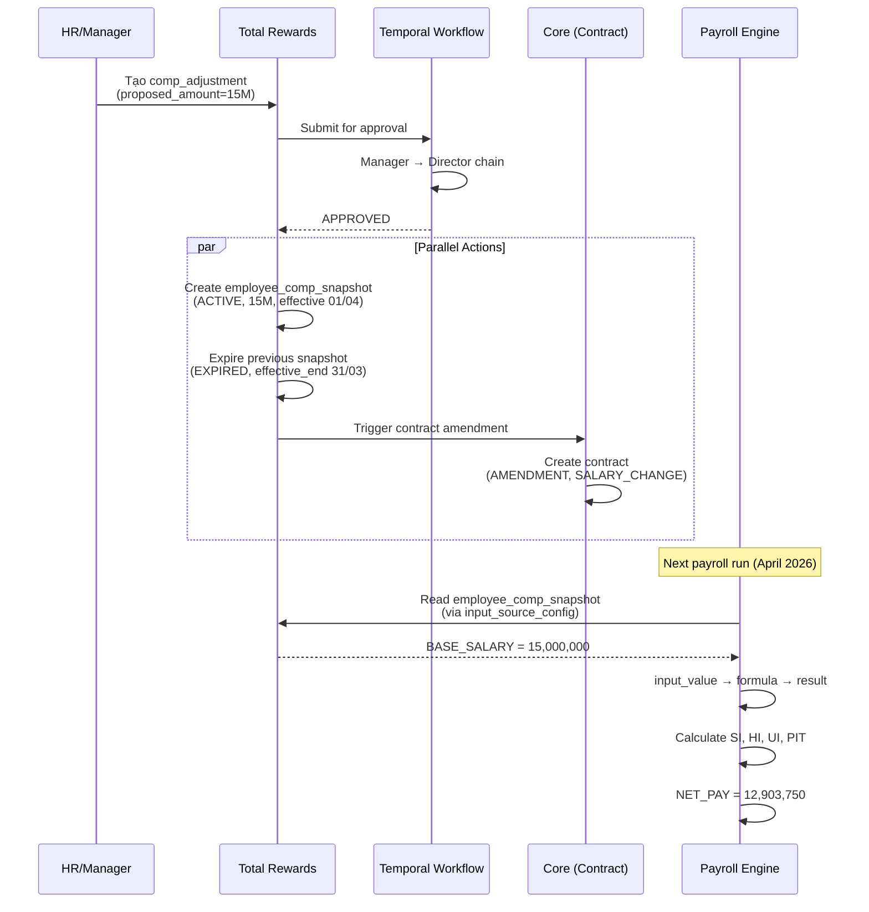

# Salary Adjustment Data Flow Guide

> **Scope**: Cross-module flow cho việc điều chỉnh lương (salary adjustment)  
> **Modules**: Core (CO) → Total Rewards (TR) → Payroll (PR)  
> **Last Updated**: 27Mar2026  
> **DBML Version**: Core V4, TotalReward V5, Payroll V4

---

## 1. Overview

Điều chỉnh lương là một cross-module transaction liên quan **cả 3 module**:

| Module | Vai trò | Domain Boundary |
|--------|---------|-----------------|
| **Core (CO)** | Legal container — phụ lục hợp đồng | Pháp lý, audit |
| **Total Rewards (TR)** | Decision + Approval + Projected Amount (Gross) | HR-policy, trước thuế |
| **Payroll (PR)** | Actual Net Calculation | Statutory, thực nhận sau thuế |

> [!IMPORTANT]
> Không thể chỉ thay đổi ở 1 module. CO giữ pháp lý, TR giữ decision + projected, PR giữ actual calculation.

---

## 2. Data Flow Diagram

```
┌─────────────────────────────────────────────────────────────────────────┐
│  TRIGGER: HR/Manager quyết định điều chỉnh lương cho nhân viên         │
│  (Ad-hoc hoặc qua Compensation Review Cycle)                           │
└──────────────────────┬──────────────────────────────────────────────────┘
                       │
                       ▼
┌─────────────────────────────────────────────────────────────────────────┐
│  STEP 1: TR — Tạo Compensation Adjustment                              │
│                                                                         │
│  Table: comp_core.comp_adjustment                                       │
│  ├── employee_id        → nhân viên được điều chỉnh                    │
│  ├── assignment_id      → assignment context (vị trí, đơn vị)          │
│  ├── component_id       → FK comp_core.pay_component_def               │
│  ├── current_amount     → lương hiện tại (e.g., 12,000,000 VND)       │
│  ├── proposed_amount    → lương đề xuất (e.g., 15,000,000 VND)        │
│  ├── increase_amount    → chênh lệch (3,000,000 VND)                  │
│  ├── increase_pct       → phần trăm tăng (25%)                        │
│  ├── rationale_code     → PROMOTION | MERIT | MARKET | RETENTION       │
│  ├── approval_status    → DRAFT → PENDING → APPROVED                  │
│  └── cycle_id           → NULL (ad-hoc) hoặc FK comp_cycle (mass)      │
│                                                                         │
│  Approval: Temporal Workflow (manager/director chain)                   │
└──────────────────────┬──────────────────────────────────────────────────┘
                       │ approval_status = APPROVED
                       ▼
┌─────────────────────────────────────────────────────────────────────────┐
│  STEP 2: TR — Tạo Compensation Snapshot (Source of Truth)               │
│                                                                         │
│  Table: comp_core.employee_comp_snapshot                                │
│  ├── employee_id        → nhân viên                                    │
│  ├── assignment_id      → assignment context                           │
│  ├── component_id       → FK pay_component_def (BASE_SALARY)           │
│  ├── amount             → 15,000,000 VND (new amount)                  │
│  ├── currency           → VND                                          │
│  ├── frequency          → MONTHLY                                      │
│  ├── status             → ACTIVE (replaces previous ACTIVE → EXPIRED) │
│  ├── source_type        → COMP_ADJUSTMENT                              │
│  ├── source_ref         → comp_adjustment.id                           │
│  ├── effective_start    → 01/04/2026 (ngày hiệu lực mới)              │
│  └── effective_end      → NULL (open-ended)                            │
│                                                                         │
│  Action: Previous ACTIVE snapshot → status = EXPIRED,                   │
│          effective_end = 31/03/2026                                      │
└──────────────────────┬──────────────────────────────────────────────────┘
                       │ Parallel action
                       ├──────────────────────────────┐
                       ▼                              ▼
┌──────────────────────────────────┐  ┌──────────────────────────────────┐
│  STEP 3a: CO — Phụ lục HĐ       │  │  STEP 3b: PR — Engine Pickup     │
│                                  │  │                                  │
│  Table: employment.contract      │  │  Table: pay_engine.              │
│  ├── parent_contract_id → HĐ gốc│  │         input_source_config      │
│  ├── parent_relationship_type    │  │  ├── source_module =             │
│  │   = AMENDMENT                 │  │  │   COMPENSATION                │
│  ├── amendment_type_code         │  │  ├── source_type =               │
│  │   = SALARY_CHANGE             │  │  │   COMP_BASIS_CHANGE           │
│  ├── start_date                  │  │  └── target_element_id =         │
│  │   = 01/04/2026                │  │      BASE_SALARY element         │
│  └── metadata (new salary info)  │  │                                  │
│                                  │  │  Next payroll run:               │
│  Role: Legal audit trail         │  │  Engine reads new snapshot →     │
│                                  │  │  input_value (BASE_SALARY =      │
│                                  │  │  15,000,000)                     │
└──────────────────────────────────┘  └──────────────────┬───────────────┘
                                                         │
                                                         ▼
┌─────────────────────────────────────────────────────────────────────────┐
│  STEP 4: PR — Payroll Engine Calculates Net Pay                         │
│                                                                         │
│  Table: pay_engine.input_value                                          │
│  ├── input_code = AMOUNT                                               │
│  ├── input_value = 15,000,000                                          │
│  ├── source_type = Compensation                                         │
│  └── source_ref = employee_comp_snapshot.id                             │
│                                                                         │
│  Table: pay_engine.result (output)                                      │
│  ├── GROSS_PAY = 15,000,000                                            │
│  ├── SI_EMPLOYEE = -1,200,000 (8% × 15M)                              │
│  ├── HI_EMPLOYEE = -225,000 (1.5% × 15M)                              │
│  ├── UI_EMPLOYEE = -150,000 (1% × 15M)                                │
│  ├── TAXABLE_INCOME = 15M - 1.575M - 11M (giảm trừ) = 2,425,000      │
│  ├── PIT = -121,250 (5% × 2.425M)                                     │
│  └── NET_PAY = 12,903,750                                             │
│                                                                         │
│  If mid-period: PRORATION                                               │
│    old_days × old_rate + new_days × new_rate                           │
│  If retro: RETRO batch → delta = new_amount - old_amount × old_periods │
└─────────────────────────────────────────────────────────────────────────┘
```

---

## 3. Sequence Diagram



---

## 4. Tables & Fields Reference

### 4.1 Core Module (CO)

| Table | Field | Type | Purpose |
|-------|-------|------|---------|
| `employment.contract` | `id` | uuid | PK |
| | `employee_id` | uuid | FK → employee |
| | `parent_contract_id` | uuid | FK → HĐ gốc |
| | `parent_relationship_type` | varchar(50) | `AMENDMENT` |
| | `amendment_type_code` | varchar(50) | `SALARY_CHANGE` |
| | `start_date` | date | Ngày hiệu lực mới |
| | `metadata` | jsonb | Chi tiết thay đổi |

**DBML File**: `CO/1.Core.V4.dbml` — schema `employment`

### 4.2 Total Rewards Module (TR)

#### comp_adjustment (Decision)

| Table | Field | Type | Purpose |
|-------|-------|------|---------|
| `comp_core.comp_adjustment` | `id` | uuid | PK |
| | `cycle_id` | uuid | FK → comp_cycle (NULL = ad-hoc) |
| | `employee_id` | uuid | FK → employee |
| | `assignment_id` | uuid | FK → assignment |
| | `component_id` | uuid | FK → pay_component_def |
| | `current_amount` | decimal(18,4) | Lương hiện tại |
| | `proposed_amount` | decimal(18,4) | Lương đề xuất |
| | `increase_amount` | decimal(18,4) | Chênh lệch |
| | `increase_pct` | decimal(7,4) | % tăng |
| | `rationale_code` | varchar(50) | PROMOTION / MERIT / MARKET / RETENTION |
| | `approval_status` | varchar(20) | DRAFT → PENDING → APPROVED |
| | `approver_emp_id` | uuid | Người duyệt |
| | `decision_date` | timestamp | Ngày duyệt |

#### employee_comp_snapshot (Source of Truth)

| Table | Field | Type | Purpose |
|-------|-------|------|---------|
| `comp_core.employee_comp_snapshot` | `id` | uuid | PK |
| | `employee_id` | uuid | FK → employee |
| | `assignment_id` | uuid | FK → assignment |
| | `component_id` | uuid | FK → pay_component_def |
| | `amount` | decimal(18,4) | **Số tiền hiệu lực** |
| | `currency` | char(3) | VND |
| | `frequency` | varchar(20) | MONTHLY / HOURLY / ANNUAL |
| | `status` | varchar(20) | **ACTIVE** / EXPIRED / PLANNED |
| | `source_type` | varchar(30) | COMP_ADJUSTMENT |
| | `source_ref` | varchar(100) | comp_adjustment.id |
| | `effective_start` | date | Ngày bắt đầu hiệu lực |
| | `effective_end` | date | NULL = open-ended |

**DBML File**: `TR/4.TotalReward.V5.dbml` — schema `comp_core`

### 4.3 Payroll Module (PR)

#### input_source_config (Auto-collection)

| Table | Field | Type | Purpose |
|-------|-------|------|---------|
| `pay_engine.input_source_config` | `source_module` | varchar(30) | `COMPENSATION` |
| | `source_type` | varchar(50) | `COMP_BASIS_CHANGE` |
| | `target_element_id` | uuid | FK → pay_element (BASE_SALARY) |
| | `mapping_json` | jsonb | Field mapping rules |

#### input_value (Engine Input)

| Table | Field | Type | Purpose |
|-------|-------|------|---------|
| `pay_engine.input_value` | `emp_run_id` | uuid | FK → run_employee |
| | `element_id` | uuid | FK → pay_element (BASE_SALARY) |
| | `input_code` | varchar(50) | `AMOUNT` |
| | `input_value` | numeric(18,2) | 15,000,000 |
| | `source_type` | varchar(30) | `Compensation` |
| | `source_ref` | varchar(50) | snapshot.id |

#### result (Engine Output)

| Table | Field | Type | Purpose |
|-------|-------|------|---------|
| `pay_engine.result` | `emp_run_id` | uuid | FK → run_employee |
| | `element_id` | uuid | FK → pay_element |
| | `amount` | decimal(18,2) | Calculated amount |
| | `classification` | varchar(30) | EARNING / DEDUCTION / TAX |

**DBML File**: `PR/5.Payroll.V4.dbml` — schemas `pay_engine`, `pay_master`

---

## 5. Scenarios

### 5.1 Standard Salary Increase (Tăng lương định kỳ)

```
Trigger:     Compensation Review Cycle (annual)
comp_adjustment:
  cycle_id     = "COMP_CYCLE_2026"
  current      = 12,000,000
  proposed     = 15,000,000
  rationale    = MERIT
  effective    = 01/04/2026

employee_comp_snapshot:
  OLD: (BASE_SALARY, 12M, ACTIVE, eff 01/01/2025) → EXPIRED, end 31/03/2026
  NEW: (BASE_SALARY, 15M, ACTIVE, eff 01/04/2026) → open-ended

contract:
  parent_contract_id = original_contract
  type = AMENDMENT / SALARY_CHANGE
  start_date = 01/04/2026

Payroll (April 2026):
  input_value: BASE_SALARY = 15,000,000
  result: GROSS=15M, SI=-1.2M, HI=-225K, UI=-150K, PIT=-121.25K, NET=12,903,750
```

### 5.2 Mid-Period Adjustment (Điều chỉnh giữa kỳ)

```
Trigger:     Promotion effective 15/04/2026
Proration:   pay_profile.proration_method = WORK_DAYS

April 2026 (22 working days):
  Days at old rate: 10 days (01-14/04)
  Days at new rate: 12 days (15-30/04)

  OLD_BASE = 12,000,000 × (10/22) = 5,454,545
  NEW_BASE = 15,000,000 × (12/22) = 8,181,818
  GROSS = 13,636,363

Engine handles via proration logic in pay_formula:
  IF effective_start BETWEEN period_start AND period_end:
    prorate(old_amount, old_days) + prorate(new_amount, new_days)
```

### 5.3 Retroactive Adjustment (Điều chỉnh hồi tố)

```
Trigger:     Approval ngày 20/04 nhưng effective_start = 01/03/2026
             → March already paid at old rate

Engine creates RETRO batch:
  pay_mgmt.batch.batch_type = RETRO
  pay_mgmt.batch.original_run_id = march_batch_id

  pay_engine.retro_delta:
    period = March 2026
    element = BASE_SALARY
    old_amount = 12,000,000
    new_amount = 15,000,000
    delta = +3,000,000

  Recalculate March with new amount → new SI, PIT
  Delta NET = new_net - old_net → pay as supplemental in April
```

### 5.4 Grade/Step Advancement (Nâng bậc lương)

```
Trigger:     TR auto_advance = true, months_to_next_step = 36
             Worker at Grade "Chuyên viên", Step 2 for 36 months

TR scheduled job:
  1. Check grade_ladder_step.months_to_next_step
  2. Compare with worker's time-at-step
  3. If met → create comp_adjustment (source_type = STEP_ADVANCEMENT)

If grade_step_mode = TABLE_LOOKUP:
  new_amount = grade_ladder_step.step_amount (Step 3)

If grade_step_mode = COEFFICIENT_FORMULA:
  new_amount = grade_ladder_step.coefficient (Step 3) × VN_LUONG_CO_SO
  e.g., 3.33 × 2,340,000 = 7,792,200 VND
```

---

## 6. Edge Cases & Business Rules

| Case | Handling | Module |
|------|----------|--------|
| **Approve rồi reject** | `comp_adjustment.approval_status = WITHDRAWN`; snapshot không tạo | TR |
| **Multiple components** | Mỗi component = 1 `comp_adjustment` row (BASE + ALLOWANCE) | TR |
| **Currency change** | New snapshot with different `currency`; PR converts via forex rate | TR + PR |
| **Probation end → salary change** | `amendment_type_code = PROBATION_END`; automatic via contract end_date trigger | CO + TR |
| **Mass salary adjustment** | Via `comp_cycle` → batch `comp_adjustment` rows | TR |
| **Salary decrease** | Same flow; `increase_amount` negative; requires higher approval level | TR |
| **Transfer between legal entities** | New contract + new snapshot; old snapshot EXPIRED | CO + TR |

---

## 7. Domain Boundary Summary

```
┌──────────────────────────────────────────────────────────────────┐
│                     SALARY ADJUSTMENT                            │
│                                                                  │
│  ┌──────────┐    ┌──────────────┐    ┌──────────────┐           │
│  │   CORE   │    │  TR (Gross)  │    │  PR (Net)    │           │
│  │          │    │              │    │              │           │
│  │ contract │◄───│ comp_adjust  │───►│ input_value  │           │
│  │ (legal)  │    │ snapshot     │    │ result       │           │
│  │          │    │ (projected)  │    │ (actual)     │           │
│  └──────────┘    └──────────────┘    └──────────────┘           │
│                                                                  │
│  ADR Boundary:                                                   │
│  ● CO = Legal record (audit, compliance)                         │
│  ● TR = Projected salary (up to Gross, pre-tax)                 │
│  ● PR = Actual calculation (Gross-to-Net, statutory)            │
│                                                                  │
│  Data Contract:                                                  │
│  ● TR → PR: employee_comp_snapshot (via input_source_config)    │
│  ● TR → CO: trigger contract amendment (via event/API)          │
│  ● PR reads TR snapshot at payroll run time                      │
└──────────────────────────────────────────────────────────────────┘
```

---

## 8. Sample SQL — Ad-hoc Salary Increase

```sql
-- ================================================
-- STEP 1: TR — Create Compensation Adjustment
-- ================================================
INSERT INTO comp_core.comp_adjustment (
  id, cycle_id, employee_id, assignment_id, component_id,
  current_amount, proposed_amount, increase_amount, increase_pct,
  currency, rationale_code, rationale_text, approval_status,
  created_date, created_by
) VALUES (
  gen_random_uuid(),
  NULL,                                    -- ad-hoc, no cycle
  'emp-001',                               -- employee UUID
  'asg-001',                               -- assignment UUID
  'comp-base-salary',                      -- pay_component_def UUID
  12000000.0000,                           -- current: 12M VND
  15000000.0000,                           -- proposed: 15M VND
  3000000.0000,                            -- increase: +3M
  25.0000,                                 -- +25%
  'VND',
  'PROMOTION',
  'Promoted to Senior Developer',
  'PENDING',                               -- → Temporal workflow
  now(), 'hr-user-001'
);

-- ================================================
-- STEP 2: After Approval → TR creates new snapshot
-- ================================================

-- 2a. Expire old snapshot
UPDATE comp_core.employee_comp_snapshot
SET status = 'EXPIRED',
    effective_end = '2026-03-31',
    updated_date = now(),
    updated_by = 'system'
WHERE employee_id = 'emp-001'
  AND component_id = 'comp-base-salary'
  AND status = 'ACTIVE';

-- 2b. Create new ACTIVE snapshot
INSERT INTO comp_core.employee_comp_snapshot (
  id, employee_id, assignment_id, component_id,
  amount, currency, frequency, status,
  source_type, source_ref,
  effective_start, effective_end,
  created_date, created_by
) VALUES (
  gen_random_uuid(),
  'emp-001', 'asg-001', 'comp-base-salary',
  15000000.0000, 'VND', 'MONTHLY', 'ACTIVE',
  'COMP_ADJUSTMENT', 'comp-adj-001',         -- link back
  '2026-04-01', NULL,                         -- open-ended
  now(), 'system'
);

-- ================================================
-- STEP 3: CO — Create contract amendment
-- ================================================
INSERT INTO employment.contract (
  id, employee_id,
  contract_type_code, parent_contract_id,
  parent_relationship_type, amendment_type_code,
  contract_number, start_date, metadata,
  created_at
) VALUES (
  gen_random_uuid(), 'emp-001',
  'INDEFINITE', 'original-contract-001',
  'AMENDMENT', 'SALARY_CHANGE',
  'HD-001-PL03', '2026-04-01',
  '{"old_salary": 12000000, "new_salary": 15000000, "reason": "PROMOTION"}',
  now()
);

-- ================================================
-- STEP 4: PR — Engine picks up at next payroll run
-- ================================================
-- (Automatic via input_source_config)
-- Engine reads: employee_comp_snapshot WHERE status='ACTIVE' AND employee_id='emp-001'
-- Creates input_value: BASE_SALARY = 15,000,000
-- Runs formula → SI, HI, UI, PIT → NET_PAY
```

---

*Tài liệu này là một phần của bộ Database Design Documentation. Xem thêm: `CHANGELOG.md`, `review-03-payroll-engine-separation.md`.*
