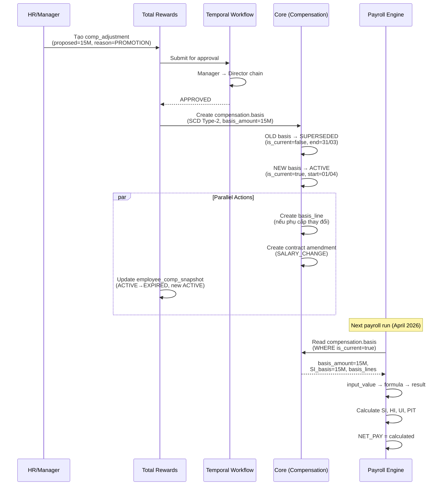

# Salary Adjustment Data Flow Guide

> **Scope**: Cross-module flow cho việc điều chỉnh lương (salary adjustment)  
> **Modules**: Core (CO) ↔ Total Rewards (TR) ↔ Payroll (PR)  
> **Last Updated**: 27Mar2026  
> **DBML Version**: Core V4, TotalReward V5, Payroll V4

---

## 1. Overview

Điều chỉnh lương là một cross-module transaction liên quan **cả 3 module**:

| Module | Vai trò | Domain Boundary | Key Table |
|--------|---------|-----------------|-----------|
| **Core (CO)** | Operational salary record (SCD-2) + Legal contract | Source of Truth cho mức lương hiệu lực | `compensation.basis` + `basis_line` |
| **Total Rewards (TR)** | Decision + Approval + Projected Amount (Gross) | HR-policy, planning, compensation cycle | `comp_core.comp_adjustment` + `employee_comp_snapshot` |
| **Payroll (PR)** | Actual Net Calculation (Gross-to-Net) | Statutory deductions, tax, net pay | `pay_engine.input_value` → `result` |

> [!IMPORTANT]
> **`compensation.basis` (CO)** là operational source of truth cho mức lương hiệu lực của nhân viên.
> TR quyết định điều chỉnh → CO ghi nhận mức lương mới (SCD-2) → PR tính thực nhận.

---

## 2. Data Flow Diagram

```
┌─────────────────────────────────────────────────────────────────────────┐
│  TRIGGER: HR/Manager quyết định điều chỉnh lương cho nhân viên         │
│  (Ad-hoc hoặc qua Compensation Review Cycle)                           │
└──────────────────────┬──────────────────────────────────────────────────┘
                       │
                       ▼
┌─────────────────────────────────────────────────────────────────────────┐
│  STEP 1: TR — Tạo Compensation Adjustment (Decision)                   │
│                                                                         │
│  Table: comp_core.comp_adjustment                                       │
│  ├── employee_id, assignment_id                                         │
│  ├── current_amount = 12,000,000                                       │
│  ├── proposed_amount = 15,000,000                                      │
│  ├── increase_amount = 3,000,000 (+25%)                                │
│  ├── rationale_code = PROMOTION                                        │
│  └── approval_status = DRAFT → PENDING → APPROVED                     │
│                                                                         │
│  Approval: Temporal Workflow (manager/director chain)                   │
└──────────────────────┬──────────────────────────────────────────────────┘
                       │ approval_status = APPROVED
                       ▼
┌─────────────────────────────────────────────────────────────────────────┐
│  STEP 2: CO — Tạo Compensation Basis Record (SCD Type-2)               │
│                                                                         │
│  Table: compensation.basis (NEW record)                                 │
│  ├── work_relationship_id, assignment_id                                │
│  ├── basis_amount        = 15,000,000 (NEW operational salary)         │
│  ├── source_code         = COMP_CYCLE (or PROMOTION / MANUAL_ADJUST)   │
│  ├── reason_code         = ANNUAL_REVIEW (or PROMOTION / PROBATION_END)│
│  ├── adjustment_amount   = +3,000,000 (delta)                          │
│  ├── adjustment_percentage = 25.00%                                    │
│  ├── previous_basis_id   = old_basis_id (SCD chain)                    │
│  ├── effective_start_date = 01/04/2026                                 │
│  ├── is_current_flag     = TRUE                                        │
│  ├── social_insurance_basis = 15,000,000 (or custom)                   │
│  ├── approval_status     = APPROVED                                    │
│  └── status_code         = ACTIVE                                      │
│                                                                         │
│  SCD Action: OLD basis → is_current_flag = FALSE,                       │
│              effective_end_date = 31/03/2026, status = SUPERSEDED       │
│                                                                         │
│  Table: compensation.basis_line (nếu phụ cấp thay đổi)                 │
│  ├── component_type_code = RESPONSIBILITY                              │
│  ├── amount = 2,000,000 (phụ cấp trách nhiệm mới)                     │
│  └── source_code = FIXED                                               │
└──────────────────────┬──────────────────────────────────────────────────┘
                       │
                       ├──────────────────────────────┐
                       ▼                              ▼
┌──────────────────────────────────┐  ┌──────────────────────────────────┐
│  STEP 3a: CO — Phụ lục HĐ       │  │  STEP 3b: TR — Update Snapshot   │
│                                  │  │                                  │
│  Table: employment.contract      │  │  Table: comp_core.               │
│  ├── parent_contract_id → HĐ gốc│  │         employee_comp_snapshot   │
│  ├── parent_relationship_type    │  │  ├── amount = 15,000,000        │
│  │   = AMENDMENT                 │  │  ├── status = ACTIVE            │
│  ├── amendment_type_code         │  │  ├── source_type =              │
│  │   = SALARY_CHANGE             │  │  │   COMP_ADJUSTMENT            │
│  ├── start_date = 01/04/2026    │  │  └── effective_start =          │
│  └── metadata (salary info)      │  │      01/04/2026                 │
│                                  │  │                                  │
│  Role: Legal audit trail         │  │  OLD snapshot → EXPIRED         │
└──────────────────────────────────┘  └──────────────────┬───────────────┘
                                                         │
                                                         ▼
┌─────────────────────────────────────────────────────────────────────────┐
│  STEP 4: PR — Payroll Engine Calculates Net Pay                         │
│                                                                         │
│  Data Source: CO compensation.basis (via input_source_config)            │
│  ├── source_module = COMPENSATION                                       │
│  ├── source_type = COMP_BASIS_CHANGE                                    │
│  └── Engine reads basis_amount + basis_line amounts                     │
│                                                                         │
│  Table: pay_engine.input_value                                          │
│  ├── (BASE_SALARY, 15,000,000, source=CompensationBasis)               │
│  ├── (RESPONSIBILITY_ALLOWANCE, 2,000,000, source=CompensationBasis)   │
│  └── ... (other fixed allowances from basis_line)                       │
│                                                                         │
│  Table: pay_engine.result (output)                                      │
│  ├── GROSS_PAY = 17,000,000 (basis + allowances)                       │
│  ├── SI_EMPLOYEE = -1,200,000 (8% × SI basis)                         │
│  ├── HI_EMPLOYEE = -225,000 (1.5% × SI basis)                         │
│  ├── UI_EMPLOYEE = -150,000 (1% × SI basis)                           │
│  ├── PIT = calculated from taxable amount                               │
│  └── NET_PAY = Gross - deductions - tax                                │
│                                                                         │
│  Special: social_insurance_basis từ CO nếu khác basis_amount           │
└─────────────────────────────────────────────────────────────────────────┘
```

---

## 3. Sequence Diagram



---

## 4. Tables & Fields Reference

### 4.1 Core Module (CO) — Operational Source of Truth

#### `compensation.basis` — Mức lương hiệu lực (Header, SCD Type-2)

| Field | Type | Purpose |
|-------|------|---------|
| `id` | uuid | PK |
| `work_relationship_id` | uuid | FK → employment.work_relationship |
| `assignment_id` | uuid | FK → employment.assignment (nullable) |
| `effective_start_date` | date | Ngày bắt đầu hiệu lực |
| `effective_end_date` | date | Ngày kết thúc (NULL = current) |
| `is_current_flag` | boolean | Cờ bản ghi hiện tại |
| **`basis_amount`** | decimal(15,2) | **Lương cơ bản operational** |
| `currency_code` | char(3) | VND |
| `frequency_code` | varchar(20) | MONTHLY / HOURLY / ANNUALLY / PER_UNIT |
| `output_unit_code` | varchar(30) | Cho piece-rate: PIECE, GARMENT... |
| `unit_rate_amount` | decimal(15,4) | Rate per unit (piece-rate) |
| `guaranteed_minimum` | decimal(15,2) | Lương tối thiểu đảm bảo |
| `basis_type_code` | varchar(30) | LEGAL_BASE / OPERATIONAL_BASE / MARKET_ADJUSTED |
| `source_code` | varchar(30) | CONTRACT / MANUAL_ADJUST / PROMOTION / COMP_CYCLE |
| `reason_code` | varchar(30) | HIRE / PROBATION_END / ANNUAL_REVIEW / PROMOTION |
| `adjustment_amount` | decimal(15,2) | Delta từ record trước (+3,000,000) |
| `adjustment_percentage` | decimal(5,2) | % thay đổi (25.00) |
| `previous_basis_id` | uuid | FK → self (SCD chain) |
| `contract_id` | uuid | FK → employment.contract |
| `salary_basis_id` | uuid | Link to TR config |
| `approval_status` | varchar(20) | PENDING / APPROVED / REJECTED |
| **`social_insurance_basis`** | decimal(15,2) | **Mức đóng BHXH** (nếu khác basis_amount) |
| `regional_min_wage_zone` | varchar(10) | ZONE_I / II / III / IV |
| `total_allowance_amount` | decimal(15,2) | SUM of basis_line amounts |
| `total_gross_amount` | decimal(15,2) | basis_amount + total_allowance |
| `status_code` | varchar(30) | DRAFT / ACTIVE / SUPERSEDED / CANCELLED |

#### `compensation.basis_line` — Phụ cấp cố định (Detail Lines)

| Field | Type | Purpose |
|-------|------|---------|
| `basis_id` | uuid | FK → compensation.basis |
| `component_type_code` | varchar(50) | MEAL / HOUSING / TRANSPORTATION / RESPONSIBILITY / SENIORITY |
| `amount` | decimal(15,2) | Số tiền phụ cấp |
| `source_code` | varchar(30) | FIXED (chốt cứng) / OVERRIDE (override từ plan) |
| `effective_start_date` | date | Ngày hiệu lực |
| `is_current_flag` | boolean | Bản ghi hiện tại |

#### `employment.contract` — Phụ lục hợp đồng (Legal)

| Field | Type | Purpose |
|-------|------|---------|
| `parent_contract_id` | uuid | FK → HĐ gốc |
| `parent_relationship_type` | varchar(50) | `AMENDMENT` |
| `amendment_type_code` | varchar(50) | `SALARY_CHANGE` |
| `start_date` | date | Ngày hiệu lực mới |

**DBML File**: `CO/1.Core.V4.dbml` — schemas `compensation`, `employment`

### 4.2 Total Rewards Module (TR) — Decision & Planning

#### `comp_core.comp_adjustment` — Decision Record

| Field | Type | Purpose |
|-------|------|---------|
| `cycle_id` | uuid | FK → comp_cycle (NULL = ad-hoc) |
| `employee_id` | uuid | FK → employee |
| `assignment_id` | uuid | FK → assignment |
| `component_id` | uuid | FK → pay_component_def |
| `current_amount` | decimal(18,4) | Lương hiện tại |
| `proposed_amount` | decimal(18,4) | Lương đề xuất |
| `increase_amount` | decimal(18,4) | Chênh lệch |
| `increase_pct` | decimal(7,4) | % tăng |
| `rationale_code` | varchar(50) | PROMOTION / MERIT / MARKET / RETENTION |
| `approval_status` | varchar(20) | DRAFT → PENDING → APPROVED |

#### `comp_core.employee_comp_snapshot` — Projected Snapshot

| Field | Type | Purpose |
|-------|------|---------|
| `amount` | decimal(18,4) | Projected salary |
| `status` | varchar(20) | ACTIVE / EXPIRED / PLANNED |
| `source_type` | varchar(30) | COMP_ADJUSTMENT |
| `effective_start` | date | Ngày hiệu lực |

**DBML File**: `TR/4.TotalReward.V5.dbml` — schema `comp_core`

### 4.3 Payroll Module (PR) — Actual Calculation

#### `pay_engine.input_source_config` — Auto-collection

| Field | Value |
|-------|-------|
| `source_module` | `COMPENSATION` |
| `source_type` | `COMP_BASIS_CHANGE` |
| `target_element_id` | FK → pay_element (BASE_SALARY) |

#### `pay_engine.input_value` — Engine Input

| Field | Value |
|-------|-------|
| `input_code` | `AMOUNT` |
| `input_value` | 15,000,000 |
| `source_type` | `CompensationBasis` |
| `source_ref` | compensation.basis.id |

**DBML File**: `PR/5.Payroll.V4.dbml` — schemas `pay_engine`, `pay_master`

---

## 5. CO vs TR — Ai là Source of Truth?

> [!IMPORTANT]
> Đây là câu hỏi quan trọng nhất trong flow.

| Aspect | CO `compensation.basis` | TR `employee_comp_snapshot` |
|--------|------------------------|---------------------------|
| **Purpose** | Operational salary record | Planning/projected snapshot |
| **Granularity** | basis_amount + basis_line (allowances) | Per-component amount |
| **SCD** | Full SCD Type-2 (chain, effective dates) | Simple ACTIVE/EXPIRED |
| **VN-specific** | `social_insurance_basis`, `regional_min_wage_zone` | No |
| **Piece-rate** | `output_unit_code`, `unit_rate_amount` | No |
| **Who reads** | **PR reads CO** for actual payroll | TR reads for reporting/planning |

**Kết luận**:
- **CO `compensation.basis`** = Operational Source of Truth (PR reads this)
- **TR `employee_comp_snapshot`** = Planning mirror (for comp cycle analytics, budgeting)
- Cả hai được tạo khi salary adjustment approved, nhưng **PR ưu tiên đọc CO**

---

## 6. Scenarios

### 6.1 Standard Salary Increase (Tăng lương định kỳ)

```
TR: comp_adjustment (COMP_CYCLE, current=12M, proposed=15M, APPROVED)

CO: compensation.basis (NEW)
  basis_amount = 15,000,000
  source_code = COMP_CYCLE
  adjustment_amount = +3,000,000
  previous_basis_id → old record (SUPERSEDED)
  social_insurance_basis = 15,000,000

CO: employment.contract (AMENDMENT, SALARY_CHANGE, start=01/04)
TR: employee_comp_snapshot (ACTIVE, 15M)
PR: input_value → GROSS=15M → SI/HI/UI/PIT → NET
```

### 6.2 Mid-Period Adjustment (Điều chỉnh giữa kỳ)

```
Effective 15/04/2026, pay_profile.proration_method = WORK_DAYS

CO: compensation.basis
  NEW basis effective_start = 15/04/2026
  OLD basis effective_end = 14/04/2026

PR: Engine proration logic:
  OLD_BASE = 12M × (10 working days / 22) = 5,454,545
  NEW_BASE = 15M × (12 working days / 22) = 8,181,818
  GROSS = 13,636,363
```

### 6.3 Retroactive Adjustment (Điều chỉnh hồi tố)

```
Approval ngày 20/04 nhưng effective_start = 01/03/2026
→ March already paid at old rate

CO: compensation.basis
  effective_start = 01/03/2026
  (system back-dates the record)

PR: pay_mgmt.batch (batch_type = RETRO)
  pay_engine.retro_delta:
    period = March 2026
    delta = new_amount - old_amount = +3,000,000
    Recalculate SI/PIT → pay delta in April
```

### 6.4 Grade/Step Advancement (Nâng bậc lương)

```
TR: grade_ladder_step (auto_advance=true, months_to_next_step=36)
→ create comp_adjustment (source_type = STEP_ADVANCEMENT)

If grade_step_mode = TABLE_LOOKUP:
  new_amount = grade_ladder_step.step_amount (Step 3)
If grade_step_mode = COEFFICIENT_FORMULA:
  new_amount = coefficient × VN_LUONG_CO_SO
  e.g., 3.33 × 2,340,000 = 7,792,200 VND

CO: compensation.basis (basis_amount = new_amount, reason_code = STEP_ADVANCEMENT)
```

### 6.5 Phụ cấp thay đổi (Allowance Change)

```
CO: compensation.basis (NEW, basis_amount unchanged)
CO: compensation.basis_line
  ├── (RESPONSIBILITY, 2,000,000, FIXED) ← new/updated
  ├── (SENIORITY, 500,000, FIXED) ← unchanged, carried over

CO: basis.total_allowance_amount = 2,500,000
CO: basis.total_gross_amount = basis_amount + 2,500,000

PR: Engine reads basis + basis_lines → input_value per element
```

---

## 7. Edge Cases & Business Rules

| Case | Handling | Module |
|------|----------|--------|
| **SI basis ≠ lương cơ bản** | `compensation.basis.social_insurance_basis` override | CO |
| **Approve rồi reject** | `comp_adjustment.approval_status = WITHDRAWN`; no basis created | TR |
| **Multiple components** | basis_amount (header) + basis_line per component | CO |
| **Piece-rate worker** | `frequency_code = PER_UNIT`, `output_unit_code`, `unit_rate_amount` | CO |
| **Probation end → salary change** | `reason_code = PROBATION_END`; auto on contract end_date | CO + TR |
| **Mass salary adjustment** | `comp_cycle` → batch `comp_adjustment` → batch `compensation.basis` | TR + CO |
| **Salary decrease** | Same flow; `adjustment_amount` negative; higher approval | TR + CO |
| **Transfer between LE** | New work_relationship → new compensation.basis chain | CO |
| **Min wage zone change** | Update `regional_min_wage_zone` on new basis | CO |

---

## 8. Domain Boundary Summary

```
┌──────────────────────────────────────────────────────────────────────┐
│                     SALARY ADJUSTMENT FLOW                           │
│                                                                      │
│  ┌──────────────┐  ┌──────────────────┐  ┌──────────────────┐       │
│  │     TR        │  │       CO         │  │       PR         │       │
│  │  (Decision)   │  │  (Operational)   │  │  (Actual)        │       │
│  │              │  │                  │  │                  │       │
│  │ comp_adjust  │─►│ compensation     │─►│ input_value      │       │
│  │ comp_snapshot│  │  .basis          │  │ result           │       │
│  │ (projected)  │  │  .basis_line     │  │ (net pay)        │       │
│  │              │  │ contract         │  │                  │       │
│  └──────────────┘  └──────────────────┘  └──────────────────┘       │
│                                                                      │
│  Data Flow:                                                          │
│  TR decides → CO records operational salary (SCD-2) → PR calculates │
│                                                                      │
│  Source of Truth:                                                     │
│  ● CO compensation.basis = operational salary (basis, SI, allowances)│
│  ● TR employee_comp_snapshot = planning mirror (budgeting, analytics)│
│  ● PR reads CO for actual payroll calculation                        │
│                                                                      │
│  Key CO fields for PR:                                               │
│  ● basis_amount → BASE_SALARY input                                 │
│  ● social_insurance_basis → SI calculation base                      │
│  ● basis_line amounts → individual allowance inputs                  │
│  ● regional_min_wage_zone → min wage floor check                     │
│  ● frequency_code → determines proration method                      │
└──────────────────────────────────────────────────────────────────────┘
```

---

## 9. Sample SQL — Complete Salary Increase Flow

```sql
-- ================================================
-- STEP 1: TR — Create Compensation Adjustment
-- ================================================
INSERT INTO comp_core.comp_adjustment (
  id, cycle_id, employee_id, assignment_id, component_id,
  current_amount, proposed_amount, increase_amount, increase_pct,
  currency, rationale_code, rationale_text, approval_status,
  created_date, created_by
) VALUES (
  'adj-001', NULL, 'emp-001', 'asg-001', 'comp-base-salary',
  12000000.0000, 15000000.0000, 3000000.0000, 25.0000,
  'VND', 'PROMOTION', 'Promoted to Senior Developer', 'PENDING',
  now(), 'hr-user-001'
);
-- → Temporal workflow → APPROVED

-- ================================================
-- STEP 2: CO — Create new compensation.basis (SCD Type-2)
-- ================================================

-- 2a. Supersede old basis
UPDATE compensation.basis
SET is_current_flag = false,
    effective_end_date = '2026-03-31',
    status_code = 'SUPERSEDED',
    updated_at = now()
WHERE work_relationship_id = 'wr-001'
  AND is_current_flag = true;

-- 2b. Create NEW basis record
INSERT INTO compensation.basis (
  id, work_relationship_id, assignment_id,
  effective_start_date, effective_end_date, is_current_flag,
  basis_amount, currency_code, frequency_code,
  basis_type_code, source_code, reason_code,
  adjustment_amount, adjustment_percentage, previous_basis_id,
  contract_id, salary_basis_id,
  approval_status, approved_by, approval_date,
  social_insurance_basis, regional_min_wage_zone,
  has_component_lines, total_allowance_amount, total_gross_amount,
  status_code, created_at, created_by
) VALUES (
  'basis-002', 'wr-001', 'asg-001',
  '2026-04-01', NULL, true,
  15000000.00, 'VND', 'MONTHLY',
  'OPERATIONAL_BASE', 'COMP_CYCLE', 'PROMOTION',
  3000000.00, 25.00, 'basis-001',               -- SCD chain → old record
  'contract-amendment-001', 'salary-basis-vn',
  'APPROVED', 'manager-001', now(),
  15000000.00, 'ZONE_I',                         -- SI basis = same as salary
  true, 2000000.00, 17000000.00,                 -- has allowance lines
  'ACTIVE', now(), 'system'
);

-- 2c. Create basis_line (allowance)
INSERT INTO compensation.basis_line (
  id, basis_id, component_type_code, amount, currency_code,
  source_code, reason_code,
  effective_start_date, is_current_flag, created_at, created_by
) VALUES (
  'line-001', 'basis-002', 'RESPONSIBILITY', 2000000.00, 'VND',
  'FIXED', 'PROMOTION',
  '2026-04-01', true, now(), 'system'
);

-- ================================================
-- STEP 3a: CO — Contract Amendment
-- ================================================
INSERT INTO employment.contract (
  id, employee_id, contract_type_code,
  parent_contract_id, parent_relationship_type, amendment_type_code,
  contract_number, start_date, metadata, created_at
) VALUES (
  'contract-amendment-001', 'emp-001', 'INDEFINITE',
  'original-contract-001', 'AMENDMENT', 'SALARY_CHANGE',
  'HD-001-PL03', '2026-04-01',
  '{"old_salary": 12000000, "new_salary": 15000000, 
    "old_allowance": 0, "new_allowance": 2000000, "reason": "PROMOTION"}',
  now()
);

-- ================================================
-- STEP 3b: TR — Update Snapshot
-- ================================================
UPDATE comp_core.employee_comp_snapshot
SET status = 'EXPIRED', effective_end = '2026-03-31'
WHERE employee_id = 'emp-001'
  AND component_id = 'comp-base-salary' AND status = 'ACTIVE';

INSERT INTO comp_core.employee_comp_snapshot (
  id, employee_id, assignment_id, component_id,
  amount, currency, frequency, status,
  source_type, source_ref, effective_start, effective_end,
  created_date, created_by
) VALUES (
  gen_random_uuid(), 'emp-001', 'asg-001', 'comp-base-salary',
  15000000.0000, 'VND', 'MONTHLY', 'ACTIVE',
  'COMP_ADJUSTMENT', 'adj-001', '2026-04-01', NULL,
  now(), 'system'
);

-- ================================================
-- STEP 4: PR — Engine Auto-Pickup (next payroll run)
-- ================================================
-- Engine reads compensation.basis WHERE is_current_flag = true
-- Creates input_value records:
--   BASE_SALARY = 15,000,000 (from basis_amount)
--   RESPONSIBILITY_ALLOWANCE = 2,000,000 (from basis_line)
--   SI_BASIS = 15,000,000 (from social_insurance_basis)
-- Runs formula → SI, HI, UI, PIT → NET_PAY
```

---

*Tài liệu này là một phần của bộ Database Design Documentation.  
Xem thêm: `CHANGELOG.md`, `review-03-payroll-engine-separation.md`.*
