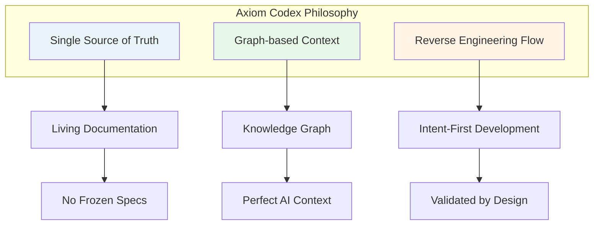
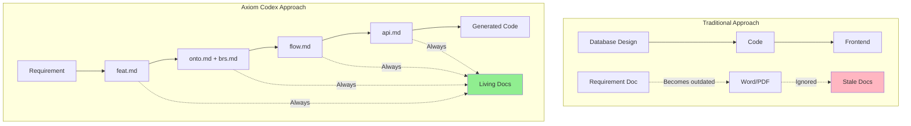
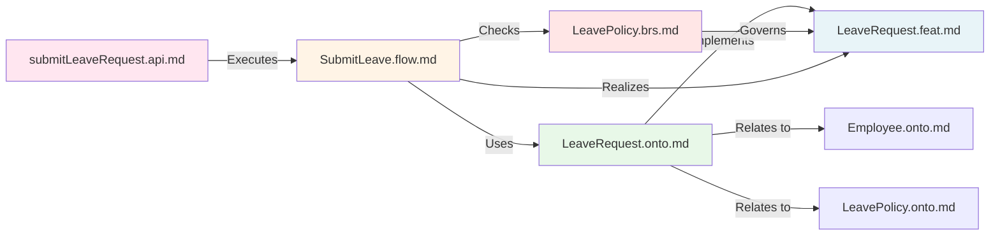
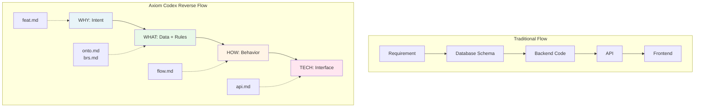

# 01. Core Philosophy

> [!NOTE]
> **Purpose**: Understand the foundational principles that drive Axiom Codex and how they solve traditional software development pain points.

Axiom Codex views software systems as **interconnected knowledge** rather than **isolated code**. This paradigm shift addresses fundamental challenges in modern software development, especially in the AI era.

---

## The Three Pillars of Axiom Codex Philosophy

---

## Principle 1: Single Source of Truth

### The Problem

Traditional development suffers from **documentation drift**:
- Specifications are written in Word/PDF and stored separately from code
- When code changes, documentation is rarely updated
- Within weeks, documentation becomes **frozen specs** - outdated and untrusted
- Teams abandon documentation and rely on tribal knowledge
- New team members struggle; knowledge loss when people leave (Bus Factor)

### The Axiom Codex Solution

> **"Documentation is Code. Code is merely the manifestation of Documentation."**

In Axiom Codex:
- All specifications live as **Markdown files** in the **same repository** as the code
- Documentation participates in **version control** (Git)
- Changes to logic require updating the specification file **first**
- CI/CD pipelines **validate** that code matches specifications
- Documentation is **never optional** - it's the source from which code is derived

### Visual Comparison

### Impact

✅ **No drift** - Code and docs are synchronized  
✅ **Single location** - All knowledge in the repository  
✅ **Version controlled** - Track why decisions were made  
✅ **CI/CD validated** - Automation prevents inconsistency  

---

## Principle 2: Graph-based Context

### The Problem

Traditional codebases are organized as **file hierarchies**:
- Related concepts are scattered across different files/folders
- Business rules are buried in code, not documented
- Developers must mentally reconstruct relationships between entities
- AI assistants lack context - they hallucinate business logic
- Onboarding new developers is slow and painful

### The Axiom Codex Solution

> **"Systems are Knowledge Graphs, not File Trees."**

Axiom Codex organizes knowledge as an **interconnected graph**:
- Each document explicitly declares its **relationships** to other documents
- **Ontology files** define entities and their connections
- **Policy files** define rules that govern behaviors
- **Flow files** reference entities and policies they operate on
- The entire system forms a **semantic network** readable by both humans and AI

### Knowledge Graph Structure

### Impact

✅ **Explicit relationships** - No hidden dependencies  
✅ **AI-readable context** - Agents understand the full picture  
✅ **Fast onboarding** - New developers navigate via graph  
✅ **Change impact analysis** - Know what's affected by changes  

---

## Principle 3: Reverse Engineering Flow

### The Problem

Traditional development starts with **technology** and works backward:
- "Let's design the database schema first"
- "What API endpoints do we need?"
- The **intent** (why are we building this?) gets lost
- Business logic is scattered across implementation details
- Requirements are interpreted differently by each developer

### The Axiom Codex Solution

> **"Define Intent before Data. Define Data before Behavior. Define Behavior before Technology."**

Axiom Codex enforces a **reverse waterfall** approach:

**The Pipeline:**

1. **Intent Layer** (`feat.md`) - Define the business goal and user needs
2. **Data Layer** (`onto.md` + `brs.md`) - Model entities and establish constraints
3. **Behavior Layer** (`flow.md`) - Orchestrate atomic APIs into workflows
4. **Execution Layer** (`api.md`) - Define atomic functions

Each layer **validates against** the previous layer - ensuring alignment from intent to implementation.

### Impact

✅ **Intent preserved** - Why we're building never gets lost  
✅ **Validated design** - Each layer checks against previous  
✅ **Fail fast** - Catch logic errors before writing code  
✅ **Consistent understanding** - Everyone reads the same specs  

---

## The Paradigm Shift

| Aspect | Traditional Development | Axiom Codex |
|--------|------------------------|-------------|
| **Starting Point** | Database design or UI mockups | Business intent and goals |
| **Documentation** | Optional, afterthought | Required, source of truth |
| **Organization** | File hierarchy | Knowledge graph |
| **Validation** | Manual code review | Automated + AI review |
| **AI Role** | Code generator (with hallucinations) | Context-aware partner |
| **Knowledge** | In people's heads | In the repository |

---

## How This Solves Real Problems

### Problem: "Frozen Specs"
**Solution**: Specs live in Git, participate in CI/CD, must be updated for code to compile

### Problem: "AI Hallucination"
**Solution**: AI reads the ontology and policy graph - guardrails prevent fabrication

### Problem: "Inconsistent Naming"
**Solution**: Ontology defines canonical names; deviations are caught by validation

### Problem: "Bus Factor"
**Solution**: All knowledge is documented in the graph; no single person owns critical understanding

### Problem: "Slow Onboarding"
**Solution**: New developers traverse the knowledge graph to understand the system

---

## Conclusion

Axiom Codex is not about inventing new technology - it's about **disciplining the development process**:

> **Think before you Code. Document as you Think. Validate before you Build.**

This philosophy transforms software development from a craft (dependent on individual expertise) into an **engineering discipline** (based on verifiable specifications and automated validation).

---

## Next Steps

- Understand the 5 document types: [The 5 Pillars →](02-five-pillars.md)
- Learn the development workflow: [The Pipeline →](03-pipeline.md)
- Explore quality assurance: [Validation Methodology →](04-validation.md)
