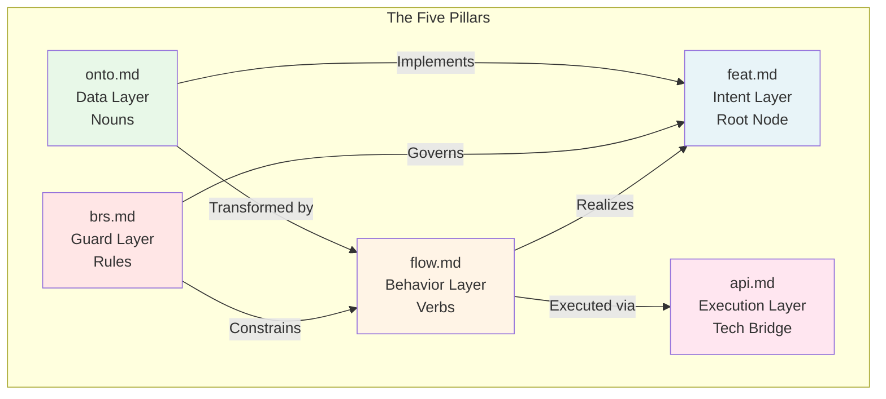
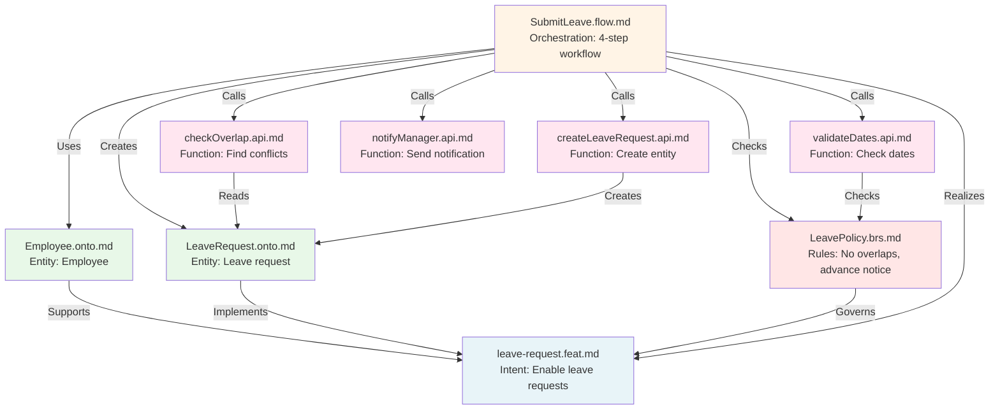
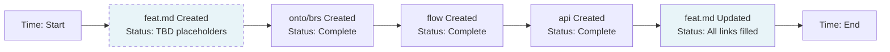

# 02. The Five Pillars

> [!NOTE]
> **Purpose**: Understand the 5 document types that form the Axiom Codex knowledge graph and how they interconnect.

Axiom Codex organizes system knowledge into **5 file types**, each serving a distinct role in the knowledge graph. Together, they form a complete picture of **intent**, **data**, **rules**, **behavior**, and **technology**.

---

## Overview: The 5 Pillars Architecture



---

## Pillar 1: Feature Specification (`*.feat.md`)

### Role: Intent Layer - The Root Node & Living Dashboard

Feature Specifications define **WHY** we're building something and **WHAT** it should accomplish.

**Key Characteristics:**
- Acts as the **entry point** and **dashboard** for a capability
- **Created first, completed last** - evolves through the development lifecycle
- A **Living Document** that updates as the feature progresses
- Written by: Product Managers (initially), then updated by Architects, Designers, Developers
- Read by: All team members, AI agents

**Purpose:**
- Capture business goals and success metrics
- Define user stories and acceptance criteria
- Track technical implementation status
- Serve as a single-page overview linking to all related documents

### The Living Document: 3 Evolution Stages

> [!IMPORTANT]
> **feat.md is NOT write-once!** It evolves through 3 stages as the feature develops:

#### Stage 1: Inception (by Product Manager)
**When:** Beginning of feature planning  
**Status:** Many sections marked `TBD` (To Be Determined)

```markdown
# Feature: Leave Request System

## Context & Goal
Enable employees to request time off digitally...

## User Stories
- As an employee, I want to submit leave requests...

## Technical Implementation
- Ontologies: TBD
- Policies: TBD  
- Flows: TBD
- APIs: TBD
```

#### Stage 2: Design & Analysis (by Architect/Designer)
**When:** After requirements analysis  
**Status:** Technical planning filled in

```markdown
## Technical Implementation
- Ontologies: Will use Employee.onto, create new LeaveRequest.onto
- Policies: Create LeavePolicy.brs for validation rules
- Flows: Create SubmitLeave.flow, ApproveLeave.flow
- APIs: TBD (waiting for flow completion)

## Design
- Figma: [link to mockups]
```

#### Stage 3: Implementation (by Developer/AI Agent)
**When:** As files are created  
**Status:** All links populated

```markdown
## Technical Implementation
- Ontologies: 
  - Employee.onto.md ✅
  - LeaveRequest.onto.md ✅
- Policies: LeavePolicy.brs.md ✅
- Flows:
  - SubmitLeave.flow.md ✅
  - ApproveLeave.flow.md ✅
- APIs:
  - submitLeaveRequest.api.md ✅
  - approveLeaveRequest.api.md ✅
```

> [!NOTE]
> **Linking Direction:** feat.md starts WITHOUT links (they don't exist yet). As onto/brs/flow/api files are created, they link back to feat.md, and feat.md gets updated to link forward to them. AI agents can automate this bidirectional linking.

**Required Sections:**
- **Context & Goal:** Business objectives and success criteria
- **User Stories:** Who needs what
- **Acceptance Criteria:** Definition of done
- **Technical Implementation:** Links to onto/brs/flow/api (filled in over time)

**Optional Sections:**
- Design references (Figma, wireframes)
- Success metrics and KPIs
- Performance requirements
- Analytics tracking


---

## Pillar 2: Ontology Model (`*.onto.md`)

### Role: Data Layer - The Nouns

Ontology Models define **entities** and their **relationships** - the building blocks of the system.

**Key Characteristics:**
- Defines what exists in the system
- Written by: System Architects, Data Engineers
- Read by: Developers, AI agents, Code generators

**Purpose:**
- Define entity structure (attributes, data types)
- Establish relationships between entities
- Model lifecycles via state machines
- Serve as source of truth for schemas

**Required Sections:**
1. **YAML Frontmatter:**
   - `id`: Unique entity identifier
   - `feature`: Reference to the feature this entity supports (if applicable)
   - `relations`: Links to other entities
   - `states`: Valid status values (for entities with lifecycles)

2. **Markdown Body:**
   - Overview and business context
   - Attribute definitions (with data types, constraints)
   - State machine diagram (Mermaid)
   - Relationship explanations

**Example Scenario:**
```
LeaveRequest.onto.md
YAML Frontmatter:
  feature: leave-request.feat.md  ← Links back to feature

├─ Attributes: startDate, endDate, reason, status
├─ Relationships: requester → Employee, approver → Manager
├─ States: DRAFT → SUBMITTED → APPROVED/REJECTED
└─ Business Context: Represents an employee's request for time off
```

**Impact:**
- Database schemas are generated from ontologies
- Type definitions for frontend/backend are derived from attributes
- AI agents understand entity structure and constraints

---

## Pillar 3: Business Policy (`*.brs.md`)

### Role: Guard Layer - The Rules

Business Policies define **invariants**, **permissions**, and **validation logic** that protect system integrity.

**Key Characteristics:**
- Defines what is allowed and what is forbidden
- Written by: Business Analysts, Logic Architects
- Read by: Developers, QA, AI validators

**Purpose:**
- Establish business rules and constraints
- Define access control (RBAC) policies
- Specify validation logic
- Document compliance requirements

**Required Sections:**
- **Invariants:** Conditions that must always be true
- **Permissions:** Who can perform what actions
- **Validation Rules:** Complex business logic for accepting/rejecting operations

**Optional Sections:**
- Compliance notes (GDPR, SOC2, etc.)
- Exception handling rules
- Audit requirements

**Example Scenario:**
```
LeavePolicy.brs.md
YAML Frontmatter:
  feature: leave-request.feat.md  ← Links back to feature
  
├─ Invariants:
│  └─ "Employee cannot have overlapping leave periods"
├─ Permissions:
│  ├─ Employee: Can submit leave for self
│  └─ Manager: Can approve/reject team leaves
└─ Validation:
   └─ "Leave request must be submitted at least 2 days in advance"
```

**Impact:**
- Flows must check policies before executing actions
- API validators are generated from business rules
- AI agents use policies as guardrails against hallucinations

---

## Pillar 4: Controller Flow (`*.flow.md`)

### Role: Behavior Layer - The Orchestration Script

Controller Flows define **business workflows** - the orchestration of atomic functions to achieve business goals.

> [!NOTE]
> **flow.md is the "recipe" or "instruction manual"** - it doesn't do the work itself, it coordinates atomic APIs (`api.md`) to accomplish business objectives.

**Key Characteristics:**
- Defines **how to orchestrate** atomic capabilities into workflows
- Acts as the **"Lego instruction manual"** (APIs are the Lego blocks)
- Written by: Solution Architects, Business Analysts
- Read by: Developers, AI agents, QA teams

**Purpose:**
- Document step-by-step business workflows
- Define which APIs to call and in what order
- Specify state transitions (referencing ontology state machines)
- Connect business rules (policies) with execution (APIs)
- Provide context for composite API design OR client-side orchestration

**Exposure Options:**

Developers have **2 choices** for how to expose a flow:

| Option | Description | When to Use |
|--------|-------------|-------------|
| **Composite API** | Wrap the entire flow in one API endpoint | Simple flows, better UX, atomic transactions needed |
| **Client-Side Orchestration** | Frontend calls APIs step-by-step following the flow | Complex UI interactions, partial completion allowed, offline support |

**Required Sections:**
- **Goal:** What business outcome does this flow achieve?
- **Trigger:** Event that initiates the flow
- **Orchestration Steps:** Sequence of API calls with business logic
- **State Transitions:** How entity states change (must align with ontology)
- **Decision Points:** Conditional logic based on business rules

**Optional Sections:**
- Error handling and compensation logic
- Retry strategies
- Performance considerations
- Rollback procedures

**Example Scenario:**
```markdown
# Flow: Submit Leave Request

YAML Frontmatter:
  feature: leave-request.feat.md
  uses_apis: [validateDates.api.md, checkOverlap.api.md, createLeaveRequest.api.md, notifyManager.api.md]
  uses_entities: [LeaveRequest.onto.md, Employee.onto.md]
  checks_policies: [LeavePolicy.brs.md]

## Goal
Enable employee to submit a leave request with validation and approval routing.

## Trigger
User clicks "Submit Leave Request" button

## Orchestration Steps

**Step 1: Validate Request Dates**
- **API Call:** `validateDates.api.md`
- **Input:** `{ startDate, endDate, employeeId }`
- **Business Rule:** Check LeavePolicy.brs.md "advance notice" rule
- **On Failure:** Return error to user, stop flow

**Step 2: Check for Overlaps**
- **API Call:** `checkOverlap.api.md`  
- **Input:** `{ employeeId, startDate, endDate }`
- **Business Rule:** Check LeavePolicy.brs.md "no overlap" invariant
- **On Conflict:** Return conflicting leave IDs, stop flow

**Step 3: Create Leave Request**
- **API Call:** `createLeaveRequest.api.md`
- **Input:** `{ employeeId, startDate, endDate, reason }`
- **State Transition:** null → DRAFT (per LeaveRequest.onto.md)

**Step 4: Notify Approver**
- **API Call:** `notifyManager.api.md`
- **Input:** `{ leaveRequestId, managerId }`
- **Side Effect:** Email notification sent

## Exposure Decision

**Option A (Recommended):** Create composite API
- Endpoint: `POST /api/leave-requests` 
- Wraps all 4 steps in one transaction
- Better UX: single network call
- Easier error handling

**Option B:** Client-side orchestration  
- Frontend calls APIs sequentially
- Allows partial saves (e.g., save draft before validation)
- More complex error handling
```

**Impact:**
- Developers understand the **business logic** before coding
- Can be implemented as composite API OR client-side orchestration
- AI agents can execute flows by calling APIs in sequence
- QA can generate test scenarios for each path through the flow

---

## Pillar 5: Interface Specification (`*.api.md`)

### Role: Execution Layer - Atomic Functions / Micro-Units

Interface Specifications define **atomic capabilities** - individual functions that the system can perform.

> [!IMPORTANT]
> **api.md represents a SINGLE function/micro-unit** (like a Lego block), NOT a composite API for an entire flow. Flows orchestrate multiple APIs.

**Key Characteristics:**
- Defines **one atomic capability** (single-purpose function)
- Acts as the **"toolbox"** - individual tools that can be composed
- Written BEFORE implementation - not auto-generated
- Written by: Backend Developers, API Architects  
- Read by: Frontend teams, AI agents, other services

**Purpose:**
- Document what ONE specific function does
- Define inputs/outputs for that function
- Specify behavior, errors, and constraints
- Enable composition into larger workflows (via flows)

**The "Lego Architecture":**

| Concept | What It Is | Example |
|---------|------------|---------|
| **`api.md`** | Lego block (atomic tool) | `calculateTax.api.md`, `sendEmail.api.md` |
| **`flow.md`** | Lego instruction (orchestration) | Uses 5 different apis to complete checkout |
| **Composite API** | Pre-built Lego set (optional) | Wraps entire flow in one endpoint |

**Required Sections:**
- **Function ID:** Unique identifier for this capability
- **Purpose:** What does this ONE function do?
- **Interface:** Endpoint, method, authentication
- **Input Contract:** Required and optional parameters
- **Output Contract:** Success response structure
- **Error Scenarios:** Failure cases and error codes
- **Side Effects:** What changes in the system (if any)

**Optional Sections:**
- Performance characteristics (SLA, timeout)
- Caching behavior
- Idempotency guarantees
- Rate limiting

**Example:**
```markdown
# API: Calculate Tax (Atomic Function)

**Function ID:** `func_calculate_tax_v1`

## Purpose
Calculate tax amount for a given price and region. Read-only operation.

## Interface
- **Endpoint:** `POST /internal/tax/calculate`
- **Auth:** Internal service token required
- **Method:** POST (despite being read-only, uses POST for request body)

## Input Contract
```json
{
  "amount": 1000.00,      // Required: Base amount
  "region": "VN",         // Required: Tax region code
  "category": "goods"     // Optional: Product category
}
```

## Output Contract
```json
{
  "tax_amount": 100.00,
  "tax_rate": 0.10,
  "total": 1100.00
}
```

## Business Logic
- VN region: Apply 10% VAT
- US region: Apply 0% (handled by state-specific rules)
- Reads from TaxRate.onto.md entity

## Error Scenarios
1. Invalid region → 400 `INVALID_REGION`
2. Negative amount → 400 `INVALID_AMOUNT`
3. Tax rate not configured → 500 `TAX_CONFIG_MISSING`

## Side Effects
None (read-only calculation)

## Performance
- SLA: < 50ms
- Cacheable: Yes (by region + category, TTL 1hr)
```

**Example: How APIs Compose into Flows**

A flow like `checkout.flow.md` might orchestrate 5 atomic APIs:
1. `validateStock.api.md` - Check inventory
2. `calculateTax.api.md` - Calculate tax
3. `calculateShipping.api.md` - Calculate shipping
4. `chargePayment.api.md` - Process payment
5. `createOrder.api.md` - Create order record

Each API is **independently testable** and **reusable** in other flows.

**Impact:**
- Creates a **repository of atomic capabilities**
- Enables **composability** - mix and match APIs in different flows
- AI agents can discover and call individual functions
- Developers can expose flows as composite APIs OR let clients orchestrate
- Microservices architecture: each API could be a separate service


---

## How the Pillars Work Together

### Example: Leave Request Feature



**The Flow:**
1. **Product defines intent** (`feat.md`) - "Why do we need leave requests?" [Created FIRST]
2. **Architect models data** (`onto.md`) - "What is a LeaveRequest? What are its states?" [Links back to feat]
3. **Business defines rules** (`brs.md`) - "What constraints govern leave requests?" [Links back to feat]
4. **Engineer designs workflow** (`flow.md`) - "How to orchestrate APIs to submit a request?" [Links to onto, brs, feat, and APIs]
5. **Developer creates atomic APIs** (`api.md` × 4) - "What atomic functions are needed?" [Each API does ONE thing]

**Key Insight:** The flow orchestrates 4 atomic APIs to achieve the business goal. Developers can then:
- **Option A:** Expose flow as composite API (`POST /api/leave-requests`)
- **Option B:** Let frontend call APIs step-by-step

---

## The Lifecycle Metaphor: "Created First, Completed Last"

Understanding **when** each document is created vs **when** it's completed is crucial:



**Kitchen Metaphor:**

| Document | Metaphor | Created When | Completed When |
|----------|----------|--------------|----------------|
| `feat.md` | **The Menu** | Start (with TBD items) | End (with all dish links) |
| `onto.md` | **The Ingredients** | After menu planning | When ingredients defined |
| `brs.md` | **Food Safety Rules** | After ingredients chosen | When rules documented |
| `flow.md` | **The Recipe** | After ingredients + rules | When steps written |
| `api.md` | **Kitchen Tools** | During recipe design | When each tool documented |

> [!IMPORTANT]
> **feat.md is hierarchically first but chronologically last to complete.**  
> It starts as the "goal statement" and becomes the "table of contents" linking to all implementation.

----

## Roles and Responsibilities

| Pillar | Primary Author | Reviewer | Consumer |
|--------|----------------|----------|----------|
| `feat.md` | Product Manager | All teams | Developers, AI |
| `onto.md` | System Architect | Data Engineers | Code generators, AI |
| `brs.md` | Business Analyst | Compliance, Legal | Validators, AI |
| `flow.md` | Solution Architect | Engineers | Backend devs, AI |
| `api.md` | Developer | Frontend/Mobile teams | API consumers, AI |

---

## Validation Across Pillars

Each pillar validates against others:

✅ **Flow → Ontology:** Does the flow reference valid states from onto?  
✅ **Flow → Policy:** Does the flow check all required business rules?  
✅ **API → Flow:** Does the API provide all inputs needed by the flow?  
✅ **Feat → All:** Are all entities/rules/flows mentioned in feat actually defined?  

This cross-validation is automated via [Graph-Grounded Agentic Review](04-validation.md).

---

## Conclusion

The 5 Pillars transform software specifications from **linear documents** into a **knowledge graph**:

- Each pillar has a **clear, distinct purpose**
- Pillars **reference each other** explicitly
- The graph is **validated automatically**
- AI agents can **traverse the graph** to understand context

This structure enables both **human understanding** and **machine processing** - the foundation of Human-AI Symbiosis.

---

## Next Steps

- Learn the development workflow: [The Pipeline →](03-pipeline.md)
- Understand quality assurance: [Validation Methodology →](04-validation.md)
- Explore AI integration: [AI Strategy →](05-ai-integration.md)
