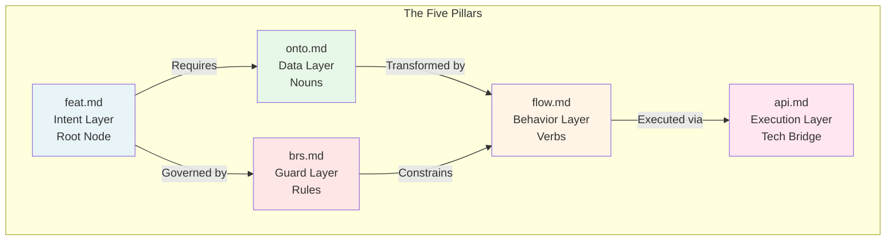
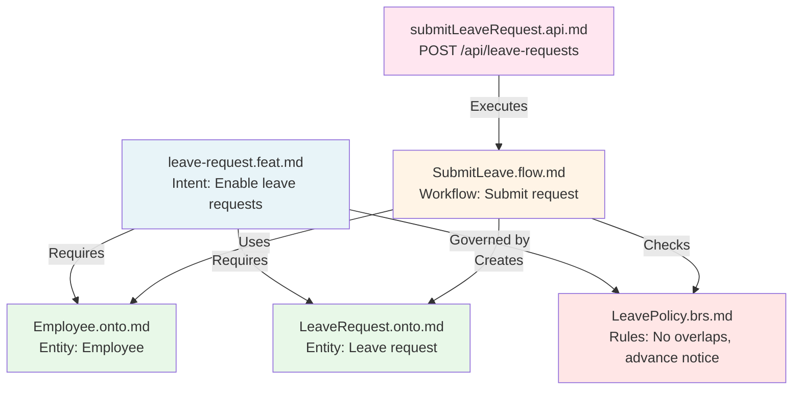

# 02. The Five Pillars

> [!NOTE]
> **Purpose**: Understand the 5 document types that form the Axiom Codex knowledge graph and how they interconnect.

Axiom Codex organizes system knowledge into **5 file types**, each serving a distinct role in the knowledge graph. Together, they form a complete picture of **intent**, **data**, **rules**, **behavior**, and **technology**.

---

## Overview: The 5 Pillars Architecture



---

## Pillar 1: Feature Specification (`*.feat.md`)

### Role: Intent Layer - The Root Node

Feature Specifications define **WHY** we're building something and **WHAT** it should accomplish.

**Key Characteristics:**
- Acts as the **entry point** for understanding a capability
- Written by: Product Managers, Business Analysts
- Read by: All team members, AI agents

**Purpose:**
- Capture business goals and success metrics
- Define user stories and acceptance criteria
- Map to required ontologies, policies, and flows
- Provide context for AI agents

**Required Sections:**
- Context & Goal
- User Stories
- Experience (UX flow, UI behavior)
- Ontology Mapping (links to related `onto`, `brs`, `flow` files)

**Optional Sections:**
- Design mockups or references
- Performance requirements
- Analytics tracking

**Example Scenario:**
```
leave-request.feat.md
├─ Goal: Enable employees to request time off
├─ User Story: "As an employee, I want to request leave..."
├─ Maps to: Employee.onto.md, LeaveRequest.onto.md
├─ Governed by: LeavePolicy.brs.md
└─ Implemented in: SubmitLeave.flow.md
```

---

## Pillar 2: Ontology Model (`*.onto.md`)

### Role: Data Layer - The Nouns

Ontology Models define **entities** and their **relationships** - the building blocks of the system.

**Key Characteristics:**
- Defines what exists in the system
- Written by: System Architects, Data Engineers
- Read by: Developers, AI agents, Code generators

**Purpose:**
- Define entity structure (attributes, data types)
- Establish relationships between entities
- Model lifecycles via state machines
- Serve as source of truth for schemas

**Required Sections:**
1. **YAML Frontmatter:**
   - `id`: Unique entity identifier
   - `relations`: Links to other entities
   - `states`: Valid status values (for entities with lifecycles)

2. **Markdown Body:**
   - Overview and business context
   - Attribute definitions (with data types, constraints)
   - State machine diagram (Mermaid)
   - Relationship explanations

**Example Scenario:**
```
LeaveRequest.onto.md
├─ Attributes: startDate, endDate, reason, status
├─ Relationships: requester → Employee, approver → Manager
├─ States: DRAFT → SUBMITTED → APPROVED/REJECTED
└─ Rules: Cannot overlap with existing approved leaves
```

**Impact:**
- Database schemas are generated from ontologies
- Type definitions for frontend/backend are derived from attributes
- AI agents understand entity structure and constraints

---

## Pillar 3: Business Policy (`*.brs.md`)

### Role: Guard Layer - The Rules

Business Policies define **invariants**, **permissions**, and **validation logic** that protect system integrity.

**Key Characteristics:**
- Defines what is allowed and what is forbidden
- Written by: Business Analysts, Logic Architects
- Read by: Developers, QA, AI validators

**Purpose:**
- Establish business rules and constraints
- Define access control (RBAC) policies
- Specify validation logic
- Document compliance requirements

**Required Sections:**
- **Invariants:** Conditions that must always be true
- **Permissions:** Who can perform what actions
- **Validation Rules:** Complex business logic for accepting/rejecting operations

**Optional Sections:**
- Compliance notes (GDPR, SOC2, etc.)
- Exception handling rules
- Audit requirements

**Example Scenario:**
```
LeavePolicy.brs.md
├─ Invariants:
│  └─ "Employee cannot have overlapping leave periods"
├─ Permissions:
│  ├─ Employee: Can submit leave for self
│  └─ Manager: Can approve/reject team leaves
└─ Validation:
   └─ "Leave request must be submitted at least 2 days in advance"
```

**Impact:**
- Flows must check policies before executing actions
- API validators are generated from business rules
- AI agents use policies as guardrails against hallucinations

---

## Pillar 4: Controller Flow (`*.flow.md`)

### Role: Behavior Layer - The Verbs

Controller Flows define **workflows** and **state transitions** - how the system behaves.

**Key Characteristics:**
- Defines how entities change over time
- Written by: Solution Architects, Backend Leads
- Read by: Developers, AI agents

**Purpose:**
- Document step-by-step workflows
- Define state transitions (referencing ontology state machines)
- Specify side effects (notifications, logs, integrations)
- Connect data (ontologies) with rules (policies)

**Required Sections:**
- **Trigger:** Event that initiates the flow
- **Steps:** Sequence of logic operations
- **Transitions:** State changes (must align with ontology state diagrams)
- **Side Effects:** External actions (emails, webhooks, logs)

**Optional Sections:**
- Error handling branches
- Retry logic
- Performance considerations

**Example Scenario:**
```
SubmitLeave.flow.md
├─ Trigger: User clicks "Submit Leave Request"
├─ Steps:
│  1. Validate dates (check LeavePolicy.brs.md)
│  2. Check for overlaps (query existing leaves)
│  3. Create LeaveRequest entity
│  4. Transition: DRAFT → SUBMITTED
│  5. Notify manager
└─ Side Effects: Email to manager, calendar hold
```

**Impact:**
- Backend logic is scaffolded from flow definitions
- AI agents can trace decision paths
- QA can validate all branches are tested

---

## Pillar 5: Interface Specification (`*.api.md`)

### Role: Execution Layer - The Tech Bridge

Interface Specifications define **API contracts** - how external systems interact with flows.

**Key Characteristics:**
- Defines the technical execution layer
- Written by: Developers
- Read by: Frontend developers, API consumers, AI agents

**Purpose:**
- Document API endpoints (RESTful, GraphQL, gRPC, etc.)
- Map endpoints to flows
- Define request/response schemas
- Specify error codes and handling

**Required Sections:**
- **Endpoint Definition:** URL, HTTP method, authentication
- **Flow Mapping:** Which flow this API executes (via `x-flow-ref`)
- **Request Schema:** Input parameters
- **Response Schema:** Output structure
- **Error Codes:** Possible failures

**Optional Sections:**
- Rate limiting
- Caching strategy
- Deprecation notices

**Example Scenario:**
```
submitLeaveRequest.api.md
├─ Endpoint: POST /api/leave-requests
├─ Flow Ref: SubmitLeave.flow.md
├─ Request:
│  └─ { startDate, endDate, reason }
├─ Response:
│  └─ { leaveRequestId, status }
└─ Errors: 400 (invalid dates), 409 (overlap detected)
```

**Impact:**
- Frontend teams know exact contract
- API documentation is auto-generated
- AI agents know which API to call for specific actions

---

## How the Pillars Work Together

### Example: Leave Request Feature



**The Flow:**
1. **Product defines intent** (`feat.md`) - "Why do we need leave requests?"
2. **Architect models data** (`onto.md`) - "What is a LeaveRequest? What are its states?"
3. **Business defines rules** (`brs.md`) - "What constraints govern leave requests?"
4. **Engineer designs workflow** (`flow.md`) - "How does a leave request get submitted?"
5. **Developer creates API** (`api.md`) - "How do clients trigger this workflow?"

---

## Roles and Responsibilities

| Pillar | Primary Author | Reviewer | Consumer |
|--------|----------------|----------|----------|
| `feat.md` | Product Manager | All teams | Developers, AI |
| `onto.md` | System Architect | Data Engineers | Code generators, AI |
| `brs.md` | Business Analyst | Compliance, Legal | Validators, AI |
| `flow.md` | Solution Architect | Engineers | Backend devs, AI |
| `api.md` | Developer | Frontend/Mobile teams | API consumers, AI |

---

## Validation Across Pillars

Each pillar validates against others:

✅ **Flow → Ontology:** Does the flow reference valid states from onto?  
✅ **Flow → Policy:** Does the flow check all required business rules?  
✅ **API → Flow:** Does the API provide all inputs needed by the flow?  
✅ **Feat → All:** Are all entities/rules/flows mentioned in feat actually defined?  

This cross-validation is automated via [Graph-Grounded Agentic Review](04-validation.md).

---

## Conclusion

The 5 Pillars transform software specifications from **linear documents** into a **knowledge graph**:

- Each pillar has a **clear, distinct purpose**
- Pillars **reference each other** explicitly
- The graph is **validated automatically**
- AI agents can **traverse the graph** to understand context

This structure enables both **human understanding** and **machine processing** - the foundation of Human-AI Symbiosis.

---

## Next Steps

- Learn the development workflow: [The Pipeline →](03-pipeline.md)
- Understand quality assurance: [Validation Methodology →](04-validation.md)
- Explore AI integration: [AI Strategy →](05-ai-integration.md)
