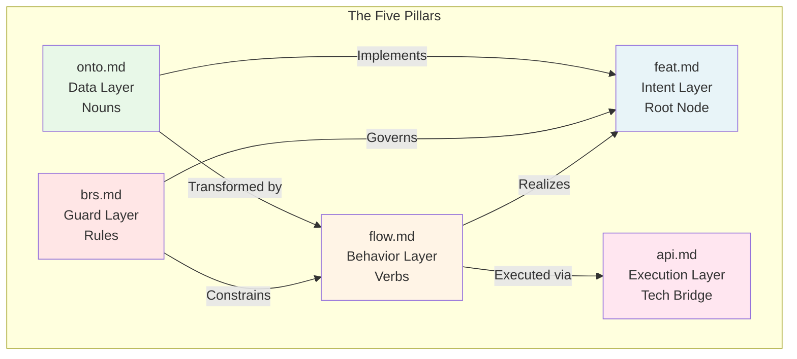
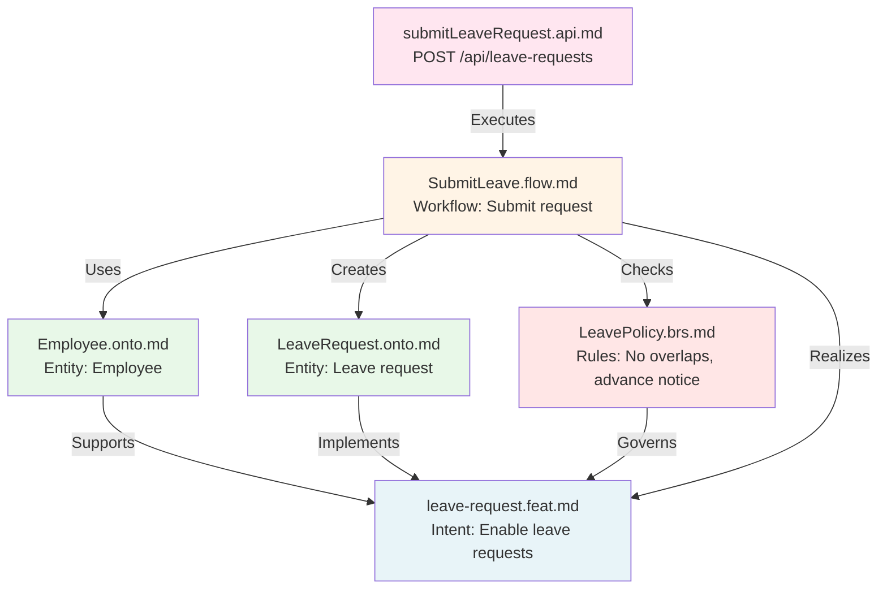
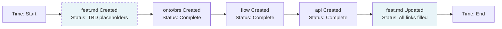

# 02. The Five Pillars

> [!NOTE]
> **Purpose**: Understand the 5 document types that form the Axiom Codex knowledge graph and how they interconnect.

Axiom Codex organizes system knowledge into **5 file types**, each serving a distinct role in the knowledge graph. Together, they form a complete picture of **intent**, **data**, **rules**, **behavior**, and **technology**.

---

## Overview: The 5 Pillars Architecture



---

## Pillar 1: Feature Specification (`*.feat.md`)

### Role: Intent Layer - The Root Node & Living Dashboard

Feature Specifications define **WHY** we're building something and **WHAT** it should accomplish.

**Key Characteristics:**
- Acts as the **entry point** and **dashboard** for a capability
- **Created first, completed last** - evolves through the development lifecycle
- A **Living Document** that updates as the feature progresses
- Written by: Product Managers (initially), then updated by Architects, Designers, Developers
- Read by: All team members, AI agents

**Purpose:**
- Capture business goals and success metrics
- Define user stories and acceptance criteria
- Track technical implementation status
- Serve as a single-page overview linking to all related documents

### The Living Document: 3 Evolution Stages

> [!IMPORTANT]
> **feat.md is NOT write-once!** It evolves through 3 stages as the feature develops:

#### Stage 1: Inception (by Product Manager)
**When:** Beginning of feature planning  
**Status:** Many sections marked `TBD` (To Be Determined)

```markdown
# Feature: Leave Request System

## Context & Goal
Enable employees to request time off digitally...

## User Stories
- As an employee, I want to submit leave requests...

## Technical Implementation
- Ontologies: TBD
- Policies: TBD  
- Flows: TBD
- APIs: TBD
```

#### Stage 2: Design & Analysis (by Architect/Designer)
**When:** After requirements analysis  
**Status:** Technical planning filled in

```markdown
## Technical Implementation
- Ontologies: Will use Employee.onto, create new LeaveRequest.onto
- Policies: Create LeavePolicy.brs for validation rules
- Flows: Create SubmitLeave.flow, ApproveLeave.flow
- APIs: TBD (waiting for flow completion)

## Design
- Figma: [link to mockups]
```

#### Stage 3: Implementation (by Developer/AI Agent)
**When:** As files are created  
**Status:** All links populated

```markdown
## Technical Implementation
- Ontologies: 
  - Employee.onto.md ✅
  - LeaveRequest.onto.md ✅
- Policies: LeavePolicy.brs.md ✅
- Flows:
  - SubmitLeave.flow.md ✅
  - ApproveLeave.flow.md ✅
- APIs:
  - submitLeaveRequest.api.md ✅
  - approveLeaveRequest.api.md ✅
```

> [!NOTE]
> **Linking Direction:** feat.md starts WITHOUT links (they don't exist yet). As onto/brs/flow/api files are created, they link back to feat.md, and feat.md gets updated to link forward to them. AI agents can automate this bidirectional linking.

**Required Sections:**
- **Context & Goal:** Business objectives and success criteria
- **User Stories:** Who needs what
- **Acceptance Criteria:** Definition of done
- **Technical Implementation:** Links to onto/brs/flow/api (filled in over time)

**Optional Sections:**
- Design references (Figma, wireframes)
- Success metrics and KPIs
- Performance requirements
- Analytics tracking


---

## Pillar 2: Ontology Model (`*.onto.md`)

### Role: Data Layer - The Nouns

Ontology Models define **entities** and their **relationships** - the building blocks of the system.

**Key Characteristics:**
- Defines what exists in the system
- Written by: System Architects, Data Engineers
- Read by: Developers, AI agents, Code generators

**Purpose:**
- Define entity structure (attributes, data types)
- Establish relationships between entities
- Model lifecycles via state machines
- Serve as source of truth for schemas

**Required Sections:**
1. **YAML Frontmatter:**
   - `id`: Unique entity identifier
   - `feature`: Reference to the feature this entity supports (if applicable)
   - `relations`: Links to other entities
   - `states`: Valid status values (for entities with lifecycles)

2. **Markdown Body:**
   - Overview and business context
   - Attribute definitions (with data types, constraints)
   - State machine diagram (Mermaid)
   - Relationship explanations

**Example Scenario:**
```
LeaveRequest.onto.md
YAML Frontmatter:
  feature: leave-request.feat.md  ← Links back to feature

├─ Attributes: startDate, endDate, reason, status
├─ Relationships: requester → Employee, approver → Manager
├─ States: DRAFT → SUBMITTED → APPROVED/REJECTED
└─ Business Context: Represents an employee's request for time off
```

**Impact:**
- Database schemas are generated from ontologies
- Type definitions for frontend/backend are derived from attributes
- AI agents understand entity structure and constraints

---

## Pillar 3: Business Policy (`*.brs.md`)

### Role: Guard Layer - The Rules

Business Policies define **invariants**, **permissions**, and **validation logic** that protect system integrity.

**Key Characteristics:**
- Defines what is allowed and what is forbidden
- Written by: Business Analysts, Logic Architects
- Read by: Developers, QA, AI validators

**Purpose:**
- Establish business rules and constraints
- Define access control (RBAC) policies
- Specify validation logic
- Document compliance requirements

**Required Sections:**
- **Invariants:** Conditions that must always be true
- **Permissions:** Who can perform what actions
- **Validation Rules:** Complex business logic for accepting/rejecting operations

**Optional Sections:**
- Compliance notes (GDPR, SOC2, etc.)
- Exception handling rules
- Audit requirements

**Example Scenario:**
```
LeavePolicy.brs.md
YAML Frontmatter:
  feature: leave-request.feat.md  ← Links back to feature
  
├─ Invariants:
│  └─ "Employee cannot have overlapping leave periods"
├─ Permissions:
│  ├─ Employee: Can submit leave for self
│  └─ Manager: Can approve/reject team leaves
└─ Validation:
   └─ "Leave request must be submitted at least 2 days in advance"
```

**Impact:**
- Flows must check policies before executing actions
- API validators are generated from business rules
- AI agents use policies as guardrails against hallucinations

---

## Pillar 4: Controller Flow (`*.flow.md`)

### Role: Behavior Layer - The Verbs

Controller Flows define **workflows** and **state transitions** - how the system behaves.

**Key Characteristics:**
- Defines how entities change over time
- Written by: Solution Architects, Backend Leads
- Read by: Developers, AI agents

**Purpose:**
- Document step-by-step workflows
- Define state transitions (referencing ontology state machines)
- Specify side effects (notifications, logs, integrations)
- Connect data (ontologies) with rules (policies)

**Required Sections:**
- **Trigger:** Event that initiates the flow
- **Steps:** Sequence of logic operations
- **Transitions:** State changes (must align with ontology state diagrams)
- **Side Effects:** External actions (emails, webhooks, logs)

**Optional Sections:**
- Error handling branches
- Retry logic
- Performance considerations

**Example Scenario:**
```
SubmitLeave.flow.md
YAML Frontmatter:
  feature: leave-request.feat.md  ← Links back to feature
  uses: [LeaveRequest.onto.md, Employee.onto.md]
  checks: [LeavePolicy.brs.md]
  
├─ Trigger: User clicks "Submit Leave Request"
├─ Steps:
│  1. Validate dates (check LeavePolicy.brs.md)
│  2. Check for overlaps (query existing leaves)
│  3. Create LeaveRequest entity
│  4. Transition: DRAFT → SUBMITTED
│  5. Notify manager
└─ Side Effects: Email to manager, calendar hold
```

**Impact:**
- Backend logic is scaffolded from flow definitions
- AI agents can trace decision paths
- QA can validate all branches are tested

---

## Pillar 5: Interface Specification (`*.api.md`)

### Role: Execution Layer - Interface Requirements (Not Generated Spec)

Interface Specifications define **interface requirements** - the contract that APIs must fulfill to execute flows.

> [!IMPORTANT]
> **api.md is NOT the OpenAPI/Swagger JSON/YAML file!**  
> It is a **requirements document** written BEFORE code, defining what the interface needs to do.

**Key Characteristics:**
- Defines the **semantic requirements** for interfaces
- Written **before implementation** - not auto-generated after
- Written by: Solution Architects, Backend Leads
- Read by: Developers, Frontend teams, AI code generators

**Purpose:**
- Define what interfaces are needed to execute flows
- Specify non-functional requirements (performance, security, idempotency)
- Map interface inputs/outputs to ontology entities
- Document expected behaviors and error scenarios

**The Distinction:**

| `*.api.md` (This file) | OpenAPI Spec (Generated) |
|------------------------|--------------------------|
| Interface **requirements** | Technical **implementation** |
| Written **before** code | Generated **from** code |
| Focuses on **semantics** | Focuses on **syntax** |
| "What must this API do?" | "How does this API work?" |

**Required Sections:**
- **Purpose:** Which flow step does this interface execute?
- **Data Mapping:** What ontology entities are inputs/outputs?
- **Method:** HTTP verb (POST/GET/PUT/DELETE) and why
- **Success Scenarios:** What constitutes a successful execution
- **Error Scenarios:** What can go wrong and how to handle it
- **Non-Functional Requirements:** Performance, security, idempotency

**Optional Sections:**
- Rate limiting requirements
- Caching strategy
- Versioning approach
- Deprecation timeline

**Example:**
```markdown
# API: Submit Leave Request

## Purpose
Executes Step 3 of SubmitLeave.flow.md: "Create leave request entity"

## Data Mapping
- **Input:** LeaveRequest entity (startDate, endDate, reason)
  - Maps to: LeaveRequest.onto.md attributes
  - Requester: Employee entity (from auth token)
  
- **Output:** LeaveRequest ID + status
  - Initial status: DRAFT (per LeaveRequest.onto.md state machine)

## Method
POST (creates new resource, changes system state)

## Non-Functional Requirements
- **Performance:** Response within 200ms
- **Security:** Requires JWT token, validate requester = authenticated user
- **Idempotency:** Duplicate requests within 5min return same LeaveRequest ID

## Success Scenarios
1. Valid dates, no overlaps → 201 Created
2. Returns: { leaveRequestId: "uuid", status: "DRAFT" }

## Error Scenarios
1. StartDate < Today → 400 Bad Request
   - Error code: INVALID_DATE_RANGE
2. Overlap detected → 409 Conflict
   - Error code: LEAVE_OVERLAP
   - Include conflicting leave ID in response
3. Insufficient balance → 400 Bad Request
   - Error code: INSUFFICIENT_BALANCE

## Validation Checklist
- [ ] Validates dates per LeavePolicy.brs.md
- [ ] Checks overlaps per LeavePolicy.brs.md
- [ ] Uses correct initial state from LeaveRequest.onto.md
- [ ] Returns error codes (not generic 500)
```

**Impact:**
- Developers know WHAT to build before writing code
- Frontend teams know exact contract before backend is ready
- AI code generators have clear requirements
- Generated OpenAPI spec (from code) can be validated against this


---

## How the Pillars Work Together

### Example: Leave Request Feature



**The Flow:**
1. **Product defines intent** (`feat.md`) - "Why do we need leave requests?" [Created FIRST]
2. **Architect models data** (`onto.md`) - "What is a LeaveRequest? What are its states?" [Links back to feat]
3. **Business defines rules** (`brs.md`) - "What constraints govern leave requests?" [Links back to feat]
4. **Engineer designs workflow** (`flow.md`) - "How does a leave request get submitted?" [Links to onto, brs, and feat]
5. **Developer creates API** (`api.md`) - "How do clients trigger this workflow?" [Links to flow]

---

## The Lifecycle Metaphor: "Created First, Completed Last"

Understanding **when** each document is created vs **when** it's completed is crucial:



**Kitchen Metaphor:**

| Document | Metaphor | Created When | Completed When |
|----------|----------|--------------|----------------|
| `feat.md` | **The Menu** | Start (with TBD items) | End (with all dish links) |
| `onto.md` | **The Ingredients** | After menu planning | When ingredients defined |
| `brs.md` | **Food Safety Rules** | After ingredients chosen | When rules documented |
| `flow.md` | **The Recipe** | After ingredients + rules | When steps written |
| `api.md` | **Cooking Instructions** | After recipe designed | When instructions written |

> [!IMPORTANT]
> **feat.md is hierarchically first but chronologically last to complete.**  
> It starts as the "goal statement" and becomes the "table of contents" linking to all implementation.

----

## Roles and Responsibilities

| Pillar | Primary Author | Reviewer | Consumer |
|--------|----------------|----------|----------|
| `feat.md` | Product Manager | All teams | Developers, AI |
| `onto.md` | System Architect | Data Engineers | Code generators, AI |
| `brs.md` | Business Analyst | Compliance, Legal | Validators, AI |
| `flow.md` | Solution Architect | Engineers | Backend devs, AI |
| `api.md` | Developer | Frontend/Mobile teams | API consumers, AI |

---

## Validation Across Pillars

Each pillar validates against others:

✅ **Flow → Ontology:** Does the flow reference valid states from onto?  
✅ **Flow → Policy:** Does the flow check all required business rules?  
✅ **API → Flow:** Does the API provide all inputs needed by the flow?  
✅ **Feat → All:** Are all entities/rules/flows mentioned in feat actually defined?  

This cross-validation is automated via [Graph-Grounded Agentic Review](04-validation.md).

---

## Conclusion

The 5 Pillars transform software specifications from **linear documents** into a **knowledge graph**:

- Each pillar has a **clear, distinct purpose**
- Pillars **reference each other** explicitly
- The graph is **validated automatically**
- AI agents can **traverse the graph** to understand context

This structure enables both **human understanding** and **machine processing** - the foundation of Human-AI Symbiosis.

---

## Next Steps

- Learn the development workflow: [The Pipeline →](03-pipeline.md)
- Understand quality assurance: [Validation Methodology →](04-validation.md)
- Explore AI integration: [AI Strategy →](05-ai-integration.md)
