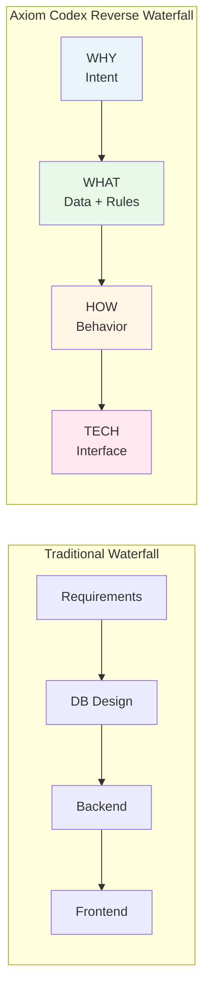
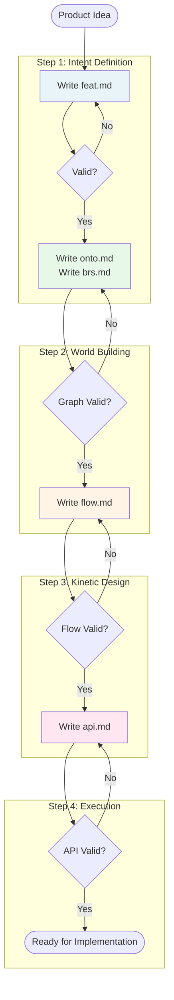
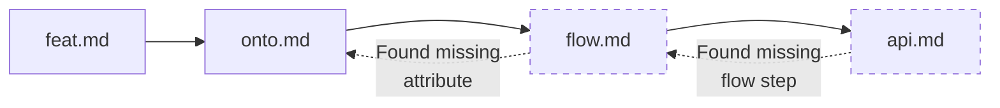

# 03. The Pipeline

> [!NOTE]
> **Purpose**: Understand the Axiom Codex development workflow - a "Reverse Waterfall" approach that builds from intent to implementation.

The Axiom Codex pipeline reverses traditional development flow. Instead of starting with technical decisions (database schemas, API designs), we start with **business intent** and work methodically toward technology.

---

## The Reverse Waterfall Approach



**Why "Reverse"?**
- Traditional development jumps to **technical solutions** too quickly
- Axiom Codex forces teams to **define requirements clearly** before touching technology
- Each step validates against the previous, catching errors early

---

## The Four Steps

| Step | Document(s) | Layer | Key Question |
|------|-------------|-------|--------------|
| **1. Intent Definition** | `*.feat.md` | Intent | WHY are we building this? |
| **2. World Building** | `*.onto.md` + `*.brs.md` | Data + Guard | WHAT entities and rules exist? |
| **3. Kinetic Design** | `*.flow.md` | Behavior | HOW does the system behave? |
| **4. Execution Implementation** | `*.api.md` | Tech | WHAT interfaces expose this? |

---

## Step 1: Intent Definition

### Goal
Define the **business purpose** and **user needs** before creating any technical artifacts.

### Input
- Product requirements
- User stories
- Business goals

### Process
Create a **Feature Specification** (`*.feat.md`) that captures:
- **Context & Goal**: Why does this feature exist?
- **User Stories**: Who benefits and how?
- **Success Metrics**: How do we measure success?
- **Ontology Mapping**: What entities and rules are involved?

### Output
- `*.feat.md` file approved by product and engineering teams

### AI Assistance
AI can:
- Analyze requirements and identify missing user stories
- Suggest relevant ontologies from existing system
- Flag potential conflicts with other features

### Checkpoint Criteria
✅ Business goal is clear and measurable  
✅ User stories cover all personas  
✅ Required entities are identified (even if not yet defined)  
✅ Success metrics are defined  

**Example:**
```
leave-request.feat.md
├─ Goal: Enable employees to request time off digitally
├─ User Story: "As an employee, I want to submit leave requests..."
├─ Metrics: 90% adoption within 3 months
└─ Requires: Employee.onto, LeaveRequest.onto, LeavePolicy.brs
```

---

## Step 2: World Building

### Goal
Model the **data structures** and **business rules** that exist in the problem domain.

### Input
- Approved `*.feat.md` from Step 1
- Existing ontologies and policies
- Domain knowledge

### Process
Create or update:

**A. Ontology Models** (`*.onto.md`):
- Define entity structure (attributes, types)
- Establish relationships between entities
- Model state machines (for entities with lifecycles)

**B. Business Policies** (`*.brs.md`):
- Define invariants (rules that must always be true)
- Specify permissions (RBAC)
- Document validation logic

### Output
- Complete graph of entities and their relationships
- Validated business rules

### AI Assistance
AI can:
- Generate initial ontology drafts from feature requirements
- Identify missing relationships
- Detect rule conflicts or gaps
- Suggest state transitions based on similar entities

### Checkpoint Criteria
✅ All entities mentioned in `feat.md` are defined  
✅ State machines have no unreachable states  
✅ Business rules cover all edge cases  
✅ Relationships are bidirectional and validated  

**Example:**
```
LeaveRequest.onto.md
├─ Attributes: startDate, endDate, reason
├─ Relationships: requester → Employee
├─ States: DRAFT → SUBMITTED → APPROVED/REJECTED

LeavePolicy.brs.md
├─ Invariant: "No overlapping approved leaves"
├─ Validation: "Must be submitted 2+ days in advance"
└─ Permission: "Only employee or manager can view"
```

---

## Step 3: Kinetic Design

### Goal
Define **how the system behaves** - the workflows and state transitions.

### Input
- Approved ontologies (`*.onto.md`)
- Approved policies (`*.brs.md`)
- Feature requirements (`*.feat.md`)

### Process
Create **Controller Flows** (`*.flow.md`) that:
- Define triggers (what starts the workflow)
- Specify steps (sequential logic)
- Reference state transitions from ontologies
- Check business rules from policies
- Document side effects (emails, notifications, integrations)

### Output
- Complete workflow definitions
- State transition diagrams

### AI Assistance
AI can:
- Validate that state transitions match ontology state machines
- Check that all business rules are enforced
- Identify missing error handling branches
- Suggest optimization opportunities

### Checkpoint Criteria
✅ Flow references valid states from ontology  
✅ All business rules are checked  
✅ Error cases are handled  
✅ Side effects are documented  
✅ No infinite loops or dead ends  

**Example:**
```
SubmitLeave.flow.md
├─ Trigger: User clicks "Submit"
├─ Steps:
│  1. Validate dates (LeavePolicy.brs)
│  2. Check for overlaps
│  3. Create LeaveRequest (state: DRAFT → SUBMITTED)
│  4. Notify manager
└─ Side Effects: Email notification, calendar block
```

---

## Step 4: Execution Implementation

### Goal
Create **technical interfaces** that enable the workflows to be executed.

### Input
- Approved flows (`*.flow.md`)
- Ontology schemas (`*.onto.md`)
- System architecture requirements

### Process
Create **API Specifications** (`*.api.md`) that:
- Define endpoints (REST, GraphQL, gRPC)
- Map to specific flows (via `x-flow-ref`)
- Specify request/response schemas
- Document error codes

### Output
- Complete API contracts
- Implementation-ready specifications

### AI Assistance
AI can:
- Generate API specs from flow definitions
- Ensure request schemas include all required flow inputs
- Validate response schemas match flow outputs
- Generate OpenAPI documentation

### Checkpoint Criteria
✅ API provides all inputs required by flow  
✅ Response schema matches flow output  
✅ Error codes are defined for all failure cases  
✅ Authentication/authorization is specified  

**Example:**
```
submitLeaveRequest.api.md
├─ Endpoint: POST /api/leave-requests
├─ Flow: SubmitLeave.flow.md
├─ Request: { startDate, endDate, reason }
├─ Response: { leaveRequestId, status }
└─ Errors: 400 (invalid), 409 (overlap)
```

---

## The Complete Pipeline Flow



---

## Validation Gates

At each step, validation occurs at **two levels**:

### Level 1: Graph Validation (Automated)
- Structural integrity checks
- Referential integrity (all links exist)
- Schema compliance

### Level 2: AI Agent Review
- Semantic correctness
- Completeness
- Best practice adherence

See [Validation Methodology](04-validation.md) for details.

---

## Working Backward (When Necessary)

Sometimes, work in a later step reveals issues in earlier steps:



**This is normal and expected.** The pipeline is iterative:
- If flow design reveals missing entity attributes → update ontology
- If API design reveals missing flow steps → update flow
- **Always update the source document**, never patch in code

---

## Workflow Examples

### Example 1: New Feature from Scratch
1. Write `leave-request.feat.md` → approved
2. Create `LeaveRequest.onto.md` and `LeavePolicy.brs.md` → validated
3. Design `SubmitLeave.flow.md` → checks pass
4. Define `submitLeaveRequest.api.md` → ready for dev

### Example 2: Extending Existing Feature
1. Update `leave-request.feat.md` with new requirement
2. Realize `LeaveRequest.onto` needs new attribute → add it
3. Update `SubmitLeave.flow.md` to use new attribute
4. Update `submitLeaveRequest.api.md` request schema

### Example 3: Bug Fix in Production
1. Trace bug to missing validation in `LeavePolicy.brs.md`
2. Add validation rule to policy
3. Update `SubmitLeave.flow.md` to check new rule
4. Re-validate `api.md` (no changes needed)
5. Automated tests generated from flow catch the bug

---

## Benefits of This Pipeline

| Benefit | How It Helps |
|---------|--------------|
| **Early Error Detection** | Issues caught in design phase, not implementation |
| **Consistent Understanding** | All teams work from same specifications |
| **Traceable Decisions** | Every implementation choice links back to requirements |
| **AI-Friendly** | Clear structure enables AI assistance at each step |
| **Test-Driven Documentation** | Specs are validated before code is written |

---

## Conclusion

The Axiom Codex pipeline reverses the traditional flow:

> **Instead of: Requirement → Code → Documentation (maybe)**  
> **We have: Requirement → Documentation (validated) → Code (generated)**

This ensures that:
- Intent is never lost
- Design is validated before implementation
- Documentation is always current
- AI has perfect context at every step

---

## Next Steps

- Understand quality assurance: [Validation Methodology →](04-validation.md)
- Learn about AI integration: [AI Strategy →](05-ai-integration.md)
- Return to overview: [Five Pillars →](02-five-pillars.md)
