# 03. The Pipeline

> [!NOTE]
> **Purpose**: Understand the Axiom Codex development workflow - a "Reverse Waterfall" approach that builds from intent to implementation.

The Axiom Codex pipeline reverses traditional development flow. Instead of starting with technical decisions (database schemas, API designs), we start with **business intent** and work methodically toward technology.

---

## The Reverse Waterfall Approach

```mermaid
graph TB
    subgraph "Traditional Waterfall"
        T1[Requirements<br/>📄 Word/PDF]
        T2[Database Design<br/>🗄️ Schema First]
        T3[Backend Code<br/>⚙️ Implementation]
        T4[API/Frontend<br/>🌐 Last]
        
        T1 --> T2
        T2 --> T3
        T3 --> T4
    end
    
    subgraph "Axiom Codex Reverse Waterfall"
        A1[WHY: Intent<br/>🎯 feat.md]
        A2[WHAT: Data + Rules<br/>📊 onto.md + brs.md]
        A3[HOW: Behavior<br/>🔄 flow.md]
        A4[TECH: Interface<br/>🔌 api.md]
        
        A1 --> A2
        A2 --> A3
        A3 --> A4
    end
    
    T1 -.->|vs| A1
    T2 -.->|vs| A2
    T3 -.->|vs| A3
    T4 -.->|vs| A4
    
    style T1 fill:#FFE6E6
    style T2 fill:#FFE6E6
    style T3 fill:#FFE6E6
    style T4 fill:#FFE6E6
    
    style A1 fill:#E8F4F8
    style A2 fill:#E8F8E8
    style A3 fill:#FFF4E6
    style A4 fill:#FFE6F0
```



**Key Differences:**

| Stage | Traditional | Axiom Codex | Why Reverse? |
|-------|-------------|-------------|--------------|
| **1** | Requirements (informal) | Intent Definition (formal, validated) | Start with WHY instead of jumping to HOW |
| **2** | Database Design (tech-first) | Data + Rules (semantic-first) | Define meaning before structure |
| **3** | Backend Code (implementation) | Behavior (design, validated) | Design workflows before coding |
| **4** | API/Frontend (afterthought) | Interface Requirements (contract) | Define contracts before implementation |

**Why "Reverse"?**
- Traditional development jumps to **technical solutions** too quickly
- Axiom Codex forces teams to **define requirements clearly** before touching technology
- Each step validates against the previous, catching errors early

---

## The Four Steps

| Step | Document(s) | Layer | Key Question |
|------|-------------|-------|--------------|
| **1. Intent Definition** | `*.feat.md` | Intent | WHY are we building this? |
| **2. World Building** | `*.onto.md` + `*.brs.md` | Data + Guard | WHAT entities and rules exist? |
| **3. Kinetic Design** | `*.flow.md` | Behavior | HOW does the system behave? |
| **4. Execution Implementation** | `*.api.md` | Tech | WHAT interfaces expose this? |

---

## Step 1: Intent Definition

### Goal
Define the **business purpose** and **user needs** before creating any technical artifacts.

### Input
- Product requirements
- User stories
- Business goals

### Process
Create a **Feature Specification** (`*.feat.md`) that captures:
- **Context & Goal**: Why does this feature exist?
- **User Stories**: Who benefits and how?
- **Success Metrics**: How do we measure success?
- **Scope**: What entities and capabilities will be needed? (conceptual, marked TBD initially)

> [!NOTE]
> At this stage, feat.md lists required entities **conceptually** (they don't exist yet). Links to onto/brs/flow files will be added later as files are created.

### Output
- `*.feat.md` file approved by product and engineering teams (with TBD placeholders for technical implementation)

### AI Assistance
AI can:
- Analyze requirements and identify missing user stories
- Suggest relevant ontologies from existing system
- Flag potential conflicts with other features

### Checkpoint Criteria
✅ Business goal is clear and measurable  
✅ User stories cover all personas  
✅ Required entities are identified conceptually (even if not yet defined)  
✅ Success metrics are defined  

**Example:**
```
leave-request.feat.md (Initial version - Stage 1)
├─ Goal: Enable employees to request time off digitally
├─ User Story: "As an employee, I want to submit leave requests..."
├─ Metrics: 90% adoption within 3 months
└─ Scope (TBD): Will need entities for Employee, Leave Request, Leave Policy
```

---

## Step 2: World Building

### Goal
Model the **data structures** and **business rules** that exist in the problem domain.

### Input
- Approved `*.feat.md` from Step 1
- Existing ontologies and policies
- Domain knowledge

### Process
Create or update:

**A. Ontology Models** (`*.onto.md`):
- Define entity structure (attributes, types)
- Establish relationships between entities
- Model state machines (for entities with lifecycles)

**B. Business Policies** (`*.brs.md`):
- Define invariants (rules that must always be true)
- Specify permissions (RBAC)
- Document validation logic

### Output
- Complete graph of entities and their relationships
- Validated business rules

### AI Assistance
AI can:
- Generate initial ontology drafts from feature requirements
- Identify missing relationships
- Detect rule conflicts or gaps
- Suggest state transitions based on similar entities

### Checkpoint Criteria
✅ All entities mentioned in `feat.md` are defined  
✅ State machines have no unreachable states  
✅ Business rules cover all edge cases  
✅ Relationships are bidirectional and validated  

**Example:**
```
LeaveRequest.onto.md
├─ Attributes: startDate, endDate, reason
├─ Relationships: requester → Employee
├─ States: DRAFT → SUBMITTED → APPROVED/REJECTED

LeavePolicy.brs.md
├─ Invariant: "No overlapping approved leaves"
├─ Validation: "Must be submitted 2+ days in advance"
└─ Permission: "Only employee or manager can view"
```

---

## Step 3: Kinetic Design

### Goal
Design **business workflows** by orchestrating atomic APIs to achieve business objectives.

### Input
- Approved ontologies (`*.onto.md`)
- Approved policies (`*.brs.md`)
- Feature requirements (`*.feat.md`)

### Process
Create **Controller Flows** (`*.flow.md`) that:
- Define business goal and trigger
- Identify which atomic APIs are needed
- Specify orchestration logic (which API to call when)
- Map state transitions from ontologies
- Check business rules from policies
- Document decision points and error handling

> [!NOTE]
> At this stage, you're designing the **"recipe"** - not the individual ingredients (APIs). You're defining WHAT needs to happen and in WHAT order.

### Output
- Complete orchestration definitions
- List of required atomic APIs (may not exist yet)
- Decision tree for conditional logic

### AI Assistance
AI can:
- Suggest which atomic APIs to create
- Validate that state transitions match ontology state machines
- Check that all business rules are enforced
- Identify reusable APIs from other flows
- Generate API requirement stubs

### Checkpoint Criteria
✅ Flow has clear business goal  
✅ All required APIs are identified  
✅ State transitions reference valid ontology states  
✅ All business rules are checked at appropriate steps  
✅ Error paths are handled  
✅ No infinite loops or unreachable states  

**Example:**
```markdown
SubmitLeave.flow.md
├─ Goal: Submit leave request with validation
├─ Trigger: User clicks "Submit Leave Request"
├─ Required APIs:
│  • validateDates.api.md (may need to create)
│  • checkOverlap.api.md (may need to create)
│  • createLeaveRequest.api.md (may need to create)
│  • notifyManager.api.md (reuse existing)
├─ Orchestration:
│  Step 1: Call validateDates → Check LeavePolicy.brs
│  Step 2: Call checkOverlap → Query existing leaves
│  Step 3: Call createLeaveRequest → Transition to SUBMITTED
│  Step 4: Call notifyManager → Send email
└─ Exposure: Recommend composite API
```

---

## Step 4: Execution Implementation

### Goal
Define **atomic functions** identified by flows - the individual capabilities the system must provide.

### Input
- Approved flows (`*.flow.md`) - shows which APIs are needed
- Ontology schemas (`*.onto.md`)
- Business policies (`*.brs.md`)

### Process
Create **API Specifications** (`*.api.md`) for each atomic function:
- One `api.md` per function (single responsibility)
- Define what ONE thing this function does
- Specify inputs, outputs, errors
- Document side effects and constraints
- May be internal-only or publicly exposed

> [!IMPORTANT]
> Each API should be **atomic and reusable**. Don't create composite APIs that wrap entire flows - that's a deployment decision, not a design decision.

### Output
- Set of atomic API specifications
- Each API is independently implementable and testable

### AI Assistance
AI can:
- Generate API stubs from flow requirements
- Ensure inputs align with ontology schemas
- Suggest appropriate error codes
- Identify opportunities to reuse existing APIs
- Validate that APIs compose correctly

### Checkpoint Criteria
✅ Each API does ONE thing well  
✅ Input/output schemas reference ontology entities  
✅ Error codes cover all failure scenarios from policies  
✅ Side effects are documented  
✅ APIs can be composed to fulfill flows  

**Example:**
```markdown
# Created 4 atomic APIs for SubmitLeave.flow.md:

validateDates.api.md
├─ Function: Check if dates are valid per policy
├─ Input: { startDate, endDate, employeeId }
├─ Output: { valid: boolean, errors: [] }
└─ Checks: LeavePolicy.brs "advance notice" rule

checkOverlap.api.md
├─ Function: Find conflicting leave requests
├─ Input: { employeeId, startDate, endDate }
├─ Output: { hasOverlap: boolean, conflicts: [] }
└─ Reads: LeaveRequest.onto.md

createLeaveRequest.api.md
├─ Function: Create new leave request entity
├─ Input: { employeeId, startDate, endDate, reason }
├─ Output: { leaveRequestId, status: "SUBMITTED" }
└─ Creates: LeaveRequest.onto.md entity

notifyManager.api.md (existing - reused)
├─ Function: Send notification to approver
├─ Input: { leaveRequestId, managerId }
└─ Side Effect: Email sent
```

---

## The Complete Pipeline Flow

```mermaid
graph TD


    Start([Product Idea])
    
    Start --> Step1
    
    subgraph Step1["🎯 Step 1: Intent Definition"]
        direction LR
        S1[Write feat.md] --> V1{Valid?}
        V1 -->|No| S1
        V1 -->|Yes| Next1[✓]
    end
    
    Step1 --> Step2
    
    subgraph Step2["📊 Step 2: World Building"]
        direction LR
        S2[Write onto.md + brs.md] --> V2{Graph Valid?}
        V2 -->|No| S2
        V2 -->|Yes| Next2[✓]
    end
    
    Step2 --> Step3
    
    subgraph Step3["🔄 Step 3: Kinetic Design"]
        direction LR
        S3[Write flow.md] --> V3{Flow Valid?}
        V3 -->|No| S3
        V3 -->|Yes| Next3[✓]
    end
    
    Step3 --> Step4
    
    subgraph Step4["🔌 Step 4: Execution"]
        direction LR
        S4[Write api.md] --> V4{API Valid?}
        V4 -->|No| S4
        V4 -->|Yes| Next4[✓]
    end
    
    Step4 --> Done([✅ Ready for Implementation])
    
    style S1 fill:#E8F4F8
    style S2 fill:#E8F8E8
    style S3 fill:#FFF4E6
    style S4 fill:#FFE6F0
    style Start fill:#E0E0E0
    style Done fill:#90EE90
    style Next1 fill:#90EE90
    style Next2 fill:#90EE90
    style Next3 fill:#90EE90
    style Next4 fill:#90EE90
```



---

## Validation Gates

At each step, validation occurs at **two levels**:

### Level 1: Graph Validation (Automated)
- Structural integrity checks
- Referential integrity (all links exist)
- Schema compliance

### Level 2: AI Agent Review
- Semantic correctness
- Completeness
- Best practice adherence

See [Validation Methodology](04-validation.md) for details.

---

## Working Backward (When Necessary)

Sometimes, work in a later step reveals issues in earlier steps:


**This is normal and expected.** The pipeline is iterative:
- If flow design reveals missing entity attributes → update ontology
- If API design reveals missing flow steps → update flow
- **Always update the source document**, never patch in code

---

## Workflow Examples

### Example 1: New Feature from Scratch
1. Write `leave-request.feat.md` → approved
2. Create `LeaveRequest.onto.md` and `LeavePolicy.brs.md` → validated
3. Design `SubmitLeave.flow.md` → identifies 4 required APIs
4. Create 4 atomic APIs:
   - `validateDates.api.md`
   - `checkOverlap.api.md`
   - `createLeaveRequest.api.md`
   - `notifyManager.api.md` (reused existing)
5. **Deployment decision:** Wrap flow in composite API or let frontend orchestrate

### Example 2: Extending Existing Feature
1. Update `leave-request.feat.md` with new requirement (cancellation)
2. Realize `LeaveRequest.onto` needs new state `CANCELLED` → add it
3. Design new `CancelLeave.flow.md` → identifies 3 APIs needed
4. Reuse existing APIs + create 1 new:
   - Reuse: `validateCancellation.api.md` (create new)
   - Reuse: `updateLeaveStatus.api.md` (create new)
   - Reuse: `notifyManager.api.md` (existing)

### Example 3: Bug Fix in Production
1. Trace bug to missing validation in `LeavePolicy.brs.md`
2. Add validation rule to policy  
3. Update `SubmitLeave.flow.md` to call validation API at step 1
4. Create new atomic API: `validateAdvanceNotice.api.md`
5. Update composite API (if using) to call new function

---

## Benefits of This Pipeline

| Benefit | How It Helps |
|---------|--------------|
| **Early Error Detection** | Issues caught in design phase, not implementation |
| **Consistent Understanding** | All teams work from same specifications |
| **Traceable Decisions** | Every implementation choice links back to requirements |
| **AI-Friendly** | Clear structure enables AI assistance at each step |
| **Test-Driven Documentation** | Specs are validated before code is written |

---

## Conclusion

The Axiom Codex pipeline reverses the traditional flow:

> **Instead of: Requirement → Code → Documentation (maybe)**  
> **We have: Requirement → Documentation (validated) → Code (generated)**

This ensures that:
- Intent is never lost
- Design is validated before implementation
- Documentation is always current
- AI has perfect context at every step

---

## Next Steps

- Understand quality assurance: [Validation Methodology →](04-validation.md)
- Learn about AI integration: [AI Strategy →](05-ai-integration.md)
- Return to overview: [Five Pillars →](02-five-pillars.md)
