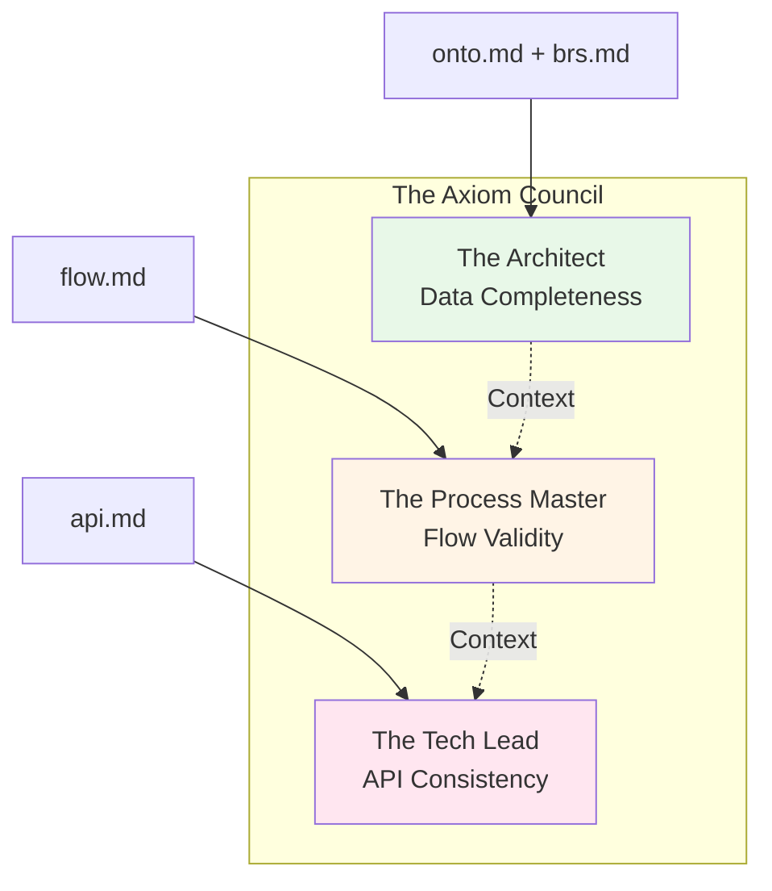

# 04. Validation Methodology

> [!NOTE]
> **Purpose**: Understand the Graph-Grounded Agentic Review system - a two-tier validation approach combining automated graph checks with AI-powered semantic review.

Traditional code review catches implementation bugs. Axiom Codex catches **design bugs** before any code is written. This is achieved through a **dual-validation system** that combines the precision of graph logic with the reasoning power of AI agents.

---

## The Two-Tier Validation Model

```mermaid
graph TB
    Doc[New/Updated Document]
    
    subgraph "Tier 1: Structural Integrity"
        G1[Parse to Graph]
        G2[Referential Integrity Check]
        G3[Coverage Check]
        G4[Cycle Detection]
    end
    
    subgraph "Tier 2: Semantic Review"
        A1[The Architect]
        A2[The Process Master]
        A3[The Tech Lead]
    end
    
    Doc --> G1
    G1 --> G2
    G2 --> G3
    G3 --> G4
    
    G4 -->|Pass| A1
    G4 -->|Fail| Reject[❌ Block CI/CD]
    
    A1 --> A2
    A2 --> A3
    A3 --> Result{Review Result}
    
    Result -->|Issues Found| Feedback[💬 Return Comments]
    Result -->|Approved| Approve[✅ Merge Allowed]
    
    style G2 fill:#E8F4F8
    style G3 fill:#E8F4F8
    style G4 fill:#E8F4F8
    style A1 fill:#FFE6E6
    style A2 fill:#FFF4E6
    style A3 fill:#FFE6F0
```



---

## Tier 1: Structural Integrity (Graph Validation)

### Philosophy
> **"The graph is the map of truth. If links are broken, the map is useless."**

Before AI agents review content, automated scripts validate the **structural correctness** of the knowledge graph.

### Validation Checks

#### 1. Referential Integrity

**Purpose:** Ensure all references point to valid targets.

**Examples:**
✅ **Pass:** `SubmitLeave.flow.md` references `LeaveRequest.onto.md` (file exists)  
❌ **Fail:** `SubmitLeave.flow.md` references `LeaveRequst.onto.md` (typo in filename)  

✅ **Pass:** Flow transitions `DRAFT → SUBMITTED` (both states exist in onto)  
❌ **Fail:** Flow transitions `DRAFT → SUBMITED` (state doesn't exist in ontology)  

**Implementation:**
```
For each document:
  - Extract all references (wiki-links, YAML frontmatter)
  - Check if target files exist
  - Validate state names against ontology state machines
  - Report broken links with suggestions
```

#### 2. Coverage Check

**Purpose:** Ensure all required entities and rules are defined.

**Examples:**
✅ **Pass:** `leave-request.feat.md` mentions 3 entities; all 3 onto files exist  
❌ **Fail:** `leave-request.feat.md` mentions `LeaveBalance.onto.md` but file is missing  

✅ **Pass:** `flow.md` checks `LeavePolicy.brs.md` rule; rule exists in brs file  
❌ **Fail:** `flow.md` checks "advance notice rule" but it's not in any brs file  

**Implementation:**
```
For each feat.md:
  - Extract required ontologies from YAML frontmatter
  - Check all referenced onto files exist
  - Extract required policies
  - Verify policies are defined in brs files
```

#### 3. Cycle Detection

**Purpose:** Prevent infinite loops in relationships and flows.

**Examples:**
✅ **Pass:** `Employee → Department → Organization` (linear hierarchy)  
❌ **Fail:** `A.onto → B.onto → C.onto → A.onto` (circular dependency)  

✅ **Pass:** Flow has terminating states  
❌ **Fail:** Flow has state transitions forming an infinite loop  

**Implementation:**
```
Build directed graph from all relationships:
  - Detect cycles using depth-first search
  - Report circular dependencies
  - Suggest refactoring (e.g., break cycle with junction entity)
```

### Error Output Example

When Tier 1 fails, the system provides actionable feedback:

```
❌ Validation Failed: Referential Integrity

File: SubmitLeave.flow.md
Line: 23
Error: State transition references invalid state

  Expected: One of [DRAFT, SUBMITTED, APPROVED, REJECTED]
  Found: "SUBMITED"
  
Suggestion: Did you mean "SUBMITTED"?

Referenced from: LeaveRequest.onto.md (line 15)
```

---

## Tier 2: Semantic Review (AI Agents)

### Philosophy
> **"Graph validation catches syntax errors. AI agents catch logic errors."**

After passing structural checks, documents are reviewed by specialized AI agents - **The Axiom Council**.

---

## The Axiom Council

Three specialized agents review documents to ensure **semantic correctness** and **completeness**.



---

### Agent 1: The Architect

**Role:** Reviews **Ontology Models** and **Business Policies**

**Responsibilities:**
- Ensure ontologies capture all data needed for the feature
- Detect conflicting business rules
- Identify missing attributes or relationships
- Validate that policies cover all edge cases

**Review Questions:**
1. Does the ontology define all attributes needed by the feature?
2. Are data types appropriate for the use case?
3. Do business rules contradict each other?
4. Are there security vulnerabilities (e.g., missing access controls)?

**Example Review:**

```
📝 Review: LeaveRequest.onto.md + LeavePolicy.brs.md

✅ Attributes look complete
⚠️  WARNING: Feature mentions "leave balance" but ontology lacks balance tracking
   Suggestion: Add relationship to LeaveBalance entity

✅ State machine is valid
✅ Business rules are consistent

❌ ERROR: Policy says "2 days advance notice" but doesn't specify
   how to handle emergency leave (medical, family emergency)
   Suggestion: Add exception handling rule to LeavePolicy.brs.md
```

---

### Agent 2: The Process Master

**Role:** Reviews **Controller Flows**

**Responsibilities:**
- Validate that flows follow ontology state machines
- Ensure all business rules are checked at appropriate steps
- Identify missing error handling
- Detect dead-end states or unreachable branches

**Review Questions:**
1. Does each state transition match the ontology state diagram?
2. Are all business rules from policies enforced?
3. Are error cases handled gracefully?
4. Are side effects clearly documented?

**Example Review:**

```
📝 Review: SubmitLeave.flow.md

✅ State transitions match LeaveRequest.onto.md state diagram
✅ All steps from LeavePolicy.brs.md are checked

⚠️  WARNING: Flow checks for overlaps AFTER creating the record
   Suggestion: Move overlap check to BEFORE record creation (step 2)

❌ ERROR: Flow transitions DRAFT → SUBMITTED but LeaveRequest.onto.md
   shows transition must check approval status first
   Suggestion: Add approval check step before state change

✅ Side effects (email, calendar) are documented
```

---

### Agent 3: The Tech Lead

**Role:** Reviews **API Specifications**

**Responsibilities:**
- Validate API contracts against flow requirements
- Ensure naming consistency with ontology
- Check error codes cover all failure scenarios
- Verify authentication/authorization is specified

**Review Questions:**
1. Does the API provide all inputs needed by the flow?
2. Do field names match the ontology exactly?
3. Are error codes defined for all failure paths?
4. Is authentication/authorization properly specified?

**Example Review:**

```
📝 Review: submitLeaveRequest.api.md

⚠️  WARNING: Naming inconsistency detected
   Ontology uses: startDate, endDate
   API uses: start_date, end_date
   Suggestion: Use camelCase to match ontology

❌ ERROR: Flow requires "reason" field but API schema marks it optional
   Flow step: Validate reason length (LeavePolicy.brs)
   Suggestion: Make "reason" required in API schema

✅ Error codes cover all scenarios
⚠️  Missing error code for "insufficient leave balance" (mentioned in feat.md)
   Suggestion: Add 409 error with code "INSUFFICIENT_BALANCE"
```

---

## The Review Workflow

```mermaid
sequenceDiagram
    participant Dev as Developer
    participant Git as Git/CI
    participant T1 as Tier 1: Graph
    participant T2 as Tier 2: AI Council
    participant Team as Review Team
    
    Dev->>Git: Commit document change
    Git->>T1: Trigger validation
    
    T1->>T1: Parse to graph
    T1->>T1: Check integrity
    
    alt Graph Invalid
        T1->>Dev: ❌ FAIL: Broken links
        Dev->>Git: Fix and recommit
    else Graph Valid
        T1->>T2: ✅ PASS: Send to AI review
        
        T2->>T2: The Architect reviews
        T2->>T2: The Process Master reviews
        T2->>T2: The Tech Lead reviews
        
        alt Issues Found
            T2->>Dev: 💬 Review comments
            Dev->>Git: Address feedback
        else Approved
            T2->>Team: ✅ APPROVED
            Team->>Git: Merge allowed
        end
    end
```



---

## Test-Driven Documentation

This validation system creates a **Test-Driven Documentation** workflow:

### Traditional TDD (Code)
```
Write Test → Write Code → Run Test → Pass ✅
```

### Axiom Codex TDD (Docs)
```
Write Spec → Validate Graph → AI Review → Pass ✅ → Generate Code
```

**Benefits:**
- Catch design errors before writing any code
- Ensure consistency across all documents
- Validate business logic before implementation
- AI agents provide expert review 24/7

---

## Integration with CI/CD

```mermaid
graph LR
    PR[Pull Request] --> T1[Tier 1 Check]
    T1 -->|Fail| Block[❌ Block Merge]
    T1 -->|Pass| T2[Tier 2 Review]
    T2 -->|Issues| Comment[💬 Add Review Comments]
    T2 -->|Approved| Allow[✅ Allow Merge]
    
    style Block fill:#FFB6C1
    style Allow fill:#90EE90
```



**Tier 1 (Graph) = Blocking**
- If graph validation fails, PR cannot be merged
- Hard requirement - must fix broken links, cycles, etc.

**Tier 2 (AI) = Advisory**
- AI review provides comments like human reviewers
- Teams can choose to address or defer based on severity
- Optional: Configure as blocking for critical documents

---

## Configuration Examples

### Strict Mode (Both Tiers Blocking)
```yaml
validation:
  tier1: BLOCK_ON_FAIL
  tier2: BLOCK_ON_FAIL
  agents:
    - architect
    - process_master
    - tech_lead
```

### Balanced Mode (Graph Blocking, AI Advisory)
```yaml
validation:
  tier1: BLOCK_ON_FAIL
  tier2: COMMENT_ONLY
  agents:
    - architect
    - process_master
```

### Lenient Mode (Both Advisory)
```yaml
validation:
  tier1: WARN_ONLY
  tier2: COMMENT_ONLY
```

---

## Benefits Summary

| Validation Type | Catches | Prevention |
|-----------------|---------|------------|
| **Tier 1: Graph** | Syntax errors, broken links, cycles | Structural integrity issues |
| **Tier 2: AI Review** | Logic errors, missing edge cases | Semantic correctness issues |

**Together they create:**
- ✅ **Automated precision** from graph validation
- ✅ **Human-like reasoning** from AI agents
- ✅ **24/7 expert review** without human bottlenecks
- ✅ **Early error detection** before code is written

---

## Conclusion

Graph-Grounded Agentic Review transforms documentation from a **passive artifact** into an **active quality gate**:

> **"If the documentation is wrong, the system won't build."**

This ensures that specifications are:
- **Structurally sound** (validated by graph)
- **Semantically correct** (validated by AI)
- **Implementation-ready** (no ambiguity for developers or AI code generators)

---

## Next Steps

- Learn about AI integration: [AI Strategy →](05-ai-integration.md)
- Return to pipeline: [The Pipeline →](03-pipeline.md)
- Review document types: [Five Pillars →](02-five-pillars.md)
