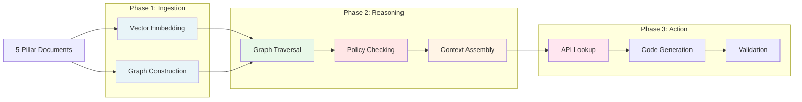
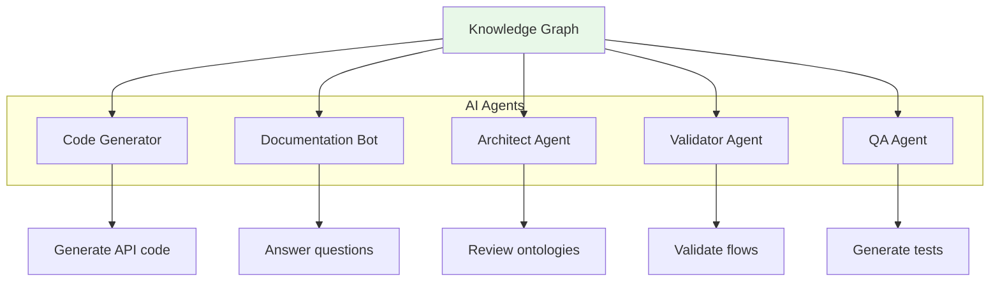

# 05. AI Integration Strategy

> [!NOTE]
> **Purpose**: Understand how Axiom Codex transforms documentation into perfect context for AI agents, enabling true Human-AI Symbiosis.

Axiom Codex is designed from the ground up for **Human-AI Symbiosis**. The 5 Pillars provide structured knowledge that AI can ingest, reason over, and act upon - transforming AI from a "code generator" into a "context-aware development partner."

---

## The Three Phases of AI Integration



---

## Phase 1: Ingestion

### Goal
Transform Axiom Codex documents into formats that AI can process efficiently.

### Two Parallel Tracks

#### Track 1: Vector Embedding (Semantic Search)

**Purpose:** Enable AI to find relevant context through natural language queries.

**Process:**
1. Parse all `*.feat.md`, `*.onto.md`, `*.brs.md`, `*.flow.md`, `*.api.md` files
2. Extract text content (excluding YAML frontmatter initially)
3. Generate embeddings using a model like OpenAI `text-embedding-3-large`
4. Store vectors in a vector database (e.g., Pinecone, Weaviate, Qdrant)

**Use Case:**
```
User Query: "How do I handle leave overlaps?"

AI Search:
  - Vector search finds: LeavePolicy.brs.md (overlap validation rule)
  - Retrieves context: "No overlapping approved leaves allowed"
  - Finds related: SubmitLeave.flow.md (overlap check logic)
```

#### Track 2: Graph Construction (Structural Navigation)

**Purpose:** Enable AI to navigate relationships and understand dependencies.

**Process:**
1. Parse YAML frontmatter from all documents
2. Extract relationships:
   - `onto.md`, `brs.md`, `flow.md` → supports/implements → `feat.md`
   - `onto.md` → links to → other `onto.md` entities  
   - `flow.md` → uses → `onto.md`, checks → `brs.md`, realizes → `feat.md`
   - `api.md` → executes → `flow.md`
3. Build a knowledge graph (e.g., Neo4j, NetworkX)
4. Store as RDF triples or property graph

**Graph Structure:**
```
(LeaveRequest.onto.md)-[:IMPLEMENTS]->(LeaveRequest.feat.md)
(LeavePolicy.brs.md)-[:GOVERNS]->(LeaveRequest.feat.md)
(SubmitLeave.flow.md)-[:USES]->(LeaveRequest.onto.md)
(SubmitLeave.flow.md)-[:CHECKS]->(LeavePolicy.brs.md)
(SubmitLeave.flow.md)-[:REALIZES]->(LeaveRequest.feat.md)
(submitLeaveRequest.api.md)-[:EXECUTES]->(SubmitLeave.flow.md)
```

---

## Phase 2: Reasoning

### Goal
Enable AI to understand context by traversing the knowledge graph and applying business rules.

### Reasoning Steps

```mermaid
graph TD
    Q[User Question:<br/>"Can I submit<br/>same-day leave?"]
    
    S1[Vector Search:<br/>Find relevant docs]
    S2[Graph Traversal:<br/>Find related entities]
    S3[Policy Check:<br/>Apply business rules]
    S4[Assemble Context:<br/>Build complete picture]
    
    Q --> S1
    S1 --> S2
    S2 --> S3
    S3 --> S4
    
    S4 --> Answer[Answer:<br/>"No, LeavePolicy.brs<br/>requires 2-day advance"]
    
    style S1 fill:#E8F4F8
    style S2 fill:#E8F8E8
    style S3 fill:#FFE6E6
    style S4 fill:#FFF4E6
```

#### Step 1: Graph Traversal

When AI receives a query about "submitting leave," it:

1. **Finds entry point:**
   - Vector search → `LeaveRequest.feat.md`

2. **Traverses graph:**
   - `LeaveRequest.onto.md` → implements → `feat.md`
   - `LeavePolicy.brs.md` → governs → `feat.md`
   - `SubmitLeave.flow.md` → realizes → `feat.md` (via backlinks)
   - Follows links → connected entities

3. **Builds context:**
   - Ontology: What is a LeaveRequest (structure, states)
   - Policy: What rules govern it (advance notice, overlaps)
   - Flow: How it gets processed (steps, validations)

#### Step 2: Policy Checking (Guardrails)

Before answering or generating code, AI **checks business rules**:

**Traditional AI (No Guardrails):**
```python
# AI might hallucinate:
def submit_leave(start, end):
    leave = LeaveRequest(start=start, end=end, status="APPROVED")  # ❌ Wrong!
    return leave
```

**Axiom Codex AI (With Guardrails):**
```python
# AI reads LeavePolicy.brs.md and LeaveRequest.onto.md:
def submit_leave(start, end):
    # Policy: Must be 2+ days in advance
    if (start - today).days < 2:
        raise ValueError("Must submit 2 days in advance")
    
    # Policy: Check for overlaps
    if has_overlap(start, end):
        raise ValueError("Overlapping leave exists")
    
    # Ontology: Initial state is DRAFT, not APPROVED
    leave = LeaveRequest(start=start, end=end, status="DRAFT")
    return leave
```

#### Step 3: Context Assembly

AI assembles a **complete context** by combining:
- **Intent:** Why this feature exists (`feat.md`)
- **Data:** What entities are involved (`onto.md`)
- **Rules:** What constraints apply (`brs.md`)
- **Behavior:** How it flows (`flow.md`)
- **Interface:** How to execute (`api.md`)

This provides **perfect context** for answering questions or generating code.

---

## Phase 3: Action

### Goal
Enable AI to execute tasks by looking up correct APIs and generating validated code.

### Action Types

#### Action 1: API Lookup

**Scenario:** User asks "How do I submit a leave request programmatically?"

**AI Process:**
1. Traverse graph: `LeaveRequest.feat.md` → `SubmitLeave.flow.md` → `submitLeaveRequest.api.md`
2. Read `api.md`: Endpoint is `POST /api/leave-requests`
3. Read schema: Requires `{ startDate, endDate, reason }`
4. Provide exact answer (no hallucination)

**AI Response:**
```
To submit a leave request:

Endpoint: POST /api/leave-requests
Headers: { "Authorization": "Bearer <token>" }
Body: {
  "startDate": "2026-02-01",
  "endDate": "2026-02-05",
  "reason": "Vacation"
}

Response: 
- 200: { "leaveRequestId": "uuid", "status": "SUBMITTED" }
- 400: Invalid dates
- 409: Overlapping leave exists
```

#### Action 2: Code Generation

**Scenario:** User asks "Generate a function to check for leave overlaps."

**AI Process:**
1. Read `LeavePolicy.brs.md` (business rules)
2. Read `LeaveRequest.onto.md` (entity structure)
3. Read `SubmitLeave.flow.md` (logic flow)
4. Generate code that follows all constraints

**AI-Generated Code:**
```typescript
// Generated from LeavePolicy.brs.md and LeaveRequest.onto.md
async function checkLeaveOverlap(
  employeeId: string,
  startDate: Date,
  endDate: Date
): Promise<boolean> {
  // Query existing approved leaves
  const existingLeaves = await db.leaveRequest.findMany({
    where: {
      requesterId: employeeId,
      status: 'APPROVED',  // Only check approved (from onto states)
      OR: [
        { startDate: { lte: endDate }, endDate: { gte: startDate } }
      ]
    }
  });
  
  return existingLeaves.length > 0;
}
```

**Why this is better:**
- Uses correct entity name (`leaveRequest` from onto)
- Uses correct state (`APPROVED` from onto state machine)
- Implements correct overlap logic (from brs)
- No hallucination - all logic is grounded in docs

#### Action 3: Validation

AI can validate newly written code against the knowledge graph:

**User submits code:**
```typescript
leave.status = "FINALIZED";  // Is this correct?
```

**AI validation:**
1. Check `LeaveRequest.onto.md` state machine
2. Find valid states: `[DRAFT, SUBMITTED, APPROVED, REJECTED]`
3. `FINALIZED` is not in the list
4. Return error: "Invalid state. Did you mean APPROVED?"

---

## The AI Agent Ecosystem

Different AI agents leverage the knowledge graph for different purposes:



| Agent | Input from Graph | Output |
|-------|------------------|--------|
| **Code Generator** | onto + flow + api | TypeScript/Python code |
| **Documentation Bot** | All 5 pillars | Answers to developer questions |
| **Architect Agent** | feat + onto + brs | Design review feedback |
| **Validator Agent** | onto + brs + flow | Validation errors/warnings |
| **QA Agent** | flow + brs | Test cases and scenarios |

---

## Benefits of This Approach

### 1. No Hallucination
AI cannot fabricate business logic because it's **grounded in the graph**.

**Without Axiom Codex:**
```
User: "What states can a leave request have?"
AI: "It can be PENDING, APPROVED, or DENIED."  ❌ Hallucination!
```

**With Axiom Codex:**
```
User: "What states can a leave request have?"
AI reads LeaveRequest.onto.md:
  states: [DRAFT, SUBMITTED, APPROVED, REJECTED]
AI: "According to LeaveRequest.onto.md, valid states are:
     DRAFT, SUBMITTED, APPROVED, REJECTED."  ✅ Grounded!
```

### 2. Perfect Context
AI has **complete understanding** before generating code.

**Without Axiom Codex:**
- AI guesses field names, state transitions, validation rules

**With Axiom Codex:**
- AI reads exact specifications from ontology, policy, and flow documents

### 3. Consistent Naming
AI uses **canonical names** from ontologies.

**Without Axiom Codex:**
- AI might use `empId`, `employee_id`, `userId` inconsistently

**With Axiom Codex:**
- AI reads ontology: `workerId` → uses it everywhere

### 4. Traceable Reasoning
AI can **explain its decisions** by citing documents.

```
AI: "I set the initial state to DRAFT because:
     - LeaveRequest.onto.md defines states: [DRAFT, SUBMITTED, ...]
     - SubmitLeave.flow.md shows transition: Create → DRAFT
     - LeavePolicy.brs.md requires manager approval before APPROVED"
```

---

## Implementation Considerations

### Vector Database Options
- **Pinecone:** Managed, scalable
- **Weaviate:** Open source, rich querying
- **Qdrant:** Fast, efficient
- **ChromaDB:** Lightweight, embeddable

### Graph Database Options
- **Neo4j:** Mature, powerful querying (Cypher)
- **NetworkX:** Python library, good for small graphs
- **RDF Triplestore:** Standards-based (SPARQL)

### LLM Options
- **OpenAI GPT-4:** Strong reasoning, API-based
- **Anthropic Claude:** Long context, nuanced understanding
- **Open Source (Llama, Mistral):** Self-hosted, customizable

---

## Conclusion

Axiom Codex transforms AI from a **black box code generator** into a **transparent reasoning partner**:

> **"AI doesn't guess. AI reads the documentation and follows the rules."**

The knowledge graph provides:
- ✅ **Grounding** - No hallucinations
- ✅ **Context** - Complete understanding
- ✅ **Traceability** - Explainable decisions
- ✅ **Consistency** - Canonical naming and logic

This is the foundation of **true Human-AI Symbiosis** in software development.

---

## Next Steps

- Return to overview: [Methodology README →](README.md)
- Review validation: [Validation Methodology →](04-validation.md)
- Explore the pipeline: [The Pipeline →](03-pipeline.md)
