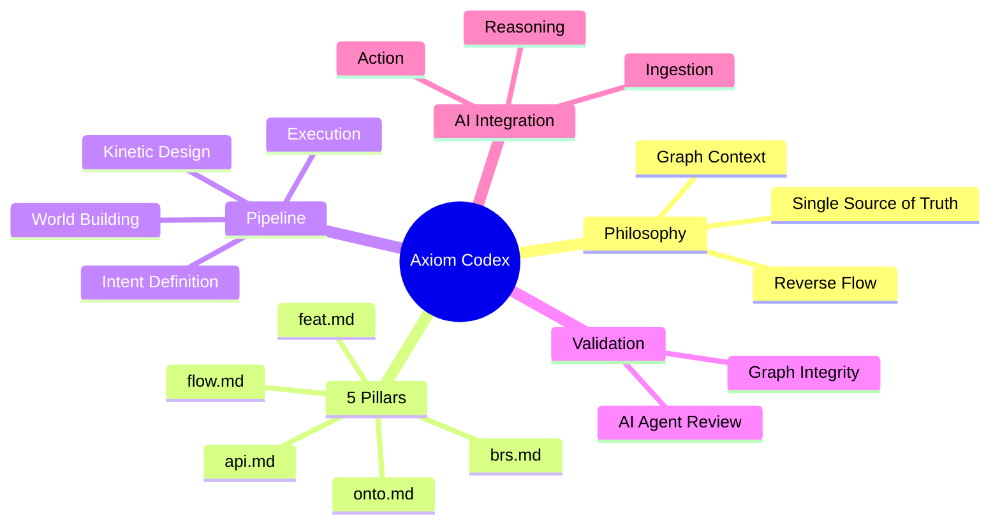
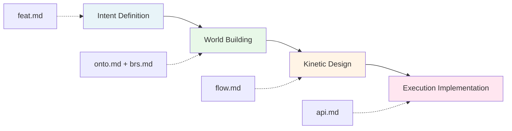

# Axiom Codex: Methodology Overview

> **Ontology-Driven Development Methodology**  
> *Optimized for Human-AI Symbiosis*

## What is Axiom Codex?

**Axiom Codex** is a software development methodology where systems are built as interconnected knowledge graphs rather than isolated code files. Every feature is grounded in a shared understanding of **data** (Ontology) and **rules** (Policy) before defining **behavior** (Flow) and **technology** (API).

> *"Documentation is Code. Code is merely the manifestation of Documentation."*

---

## Core Philosophy

Axiom Codex is built on three foundational principles:

1. **Single Source of Truth** - Documentation and code are unified; specifications live in the repository
2. **Graph-based Context** - Documents are interconnected nodes forming a knowledge graph
3. **Reverse Engineering Flow** - Build from intent → data → behavior → technology

**Learn more**: [Core Philosophy →](01-philosophy.md)

---

## Framework Components

---

## The 5 Pillars

Axiom Codex organizes system knowledge into **5 file types**, each serving a distinct role:

| Pillar | File Type | Layer | Purpose |
|--------|-----------|-------|---------|
| **Feature Specification** | `*.feat.md` | Intent | Defines WHY and WHAT |
| **Ontology Model** | `*.onto.md` | Data | Entities and relationships |
| **Business Policy** | `*.brs.md` | Guard | Rules and constraints |
| **Controller Flow** | `*.flow.md` | Behavior | Orchestrates atomic APIs |
| **Interface Specification** | `*.api.md` | Execution | Atomic functions/micro-units |

**Learn more**: [The 5 Pillars →](02-five-pillars.md)

---

## The Development Pipeline

Axiom Codex follows a **Reverse Waterfall** approach:

1. **Intent Definition** - Define the purpose and goals
2. **World Building** - Model the data and rules
3. **Kinetic Design** - Design the behavior
4. **Execution Implementation** - Create technical interfaces

**Learn more**: [The Pipeline →](03-pipeline.md)

---

## Quality Assurance: Graph-Grounded Agentic Review

Axiom Codex employs a **two-tier validation system** combining machine precision with AI reasoning:

### Tier 1: Graph Validation
Automated structural integrity checks:
- Referential integrity (all links are valid)
- Coverage completeness (all required entities exist)
- Cycle detection (no infinite loops)

### Tier 2: AI Agent Review
**The Axiom Council** - specialized AI agents that review:
- **The Architect** - Reviews ontology and business rules
- **The Process Master** - Validates flows and state transitions
- **The Tech Lead** - Checks API contracts and naming consistency

**Learn more**: [Validation Methodology →](04-validation.md)

---

## AI Integration Strategy

Axiom Codex transforms documents into perfect context for AI:

1. **Ingestion** - Documents are vectorized and graphed
2. **Reasoning** - AI traverses the knowledge graph to understand context
3. **Action** - AI executes through validated API contracts

**Learn more**: [AI Integration →](05-ai-integration.md)

---

## Quick Reference: File Types

| When you need to... | Create this file | Link to guide |
|---------------------|------------------|---------------|
| Define a new feature | `*.feat.md` | [Feature Spec](02-five-pillars.md#feature-specification) |
| Model an entity | `*.onto.md` | [Ontology Model](02-five-pillars.md#ontology-model) |
| Add business rules | `*.brs.md` | [Business Policy](02-five-pillars.md#business-policy) |
| Design a workflow | `*.flow.md` | [Controller Flow](02-five-pillars.md#controller-flow) |
| Define an API | `*.api.md` | [Interface Spec](02-five-pillars.md#interface-specification) |

---

## Document Map

| Document | Focus | Audience |
|----------|-------|----------|
| [01-philosophy.md](01-philosophy.md) | Core principles and paradigm shift | All team members |
| [02-five-pillars.md](02-five-pillars.md) | Document types and their relationships | Product, Engineering |
| [03-pipeline.md](03-pipeline.md) | Development workflow | Engineering, PM |
| [04-validation.md](04-validation.md) | Quality assurance approach | Engineering, QA |
| [05-ai-integration.md](05-ai-integration.md) | AI strategy and context | Engineering, AI teams |

---

## Key Takeaways

✅ **Documentation = Code** - Specs are not separate artifacts; they ARE the system  
✅ **Graph > Files** - Think in relationships, not isolated documents  
✅ **Validate Early** - Automated + AI review catches issues before implementation  
✅ **AI-First** - Perfect context enables AI to become a true development partner  

---

*Axiom Codex represents a paradigm shift from project-based workflows to knowledge-driven development, optimized for the AI era.*
