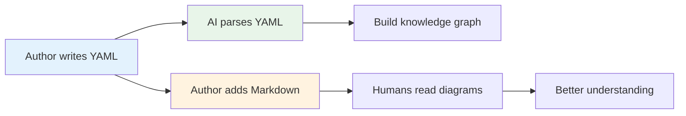
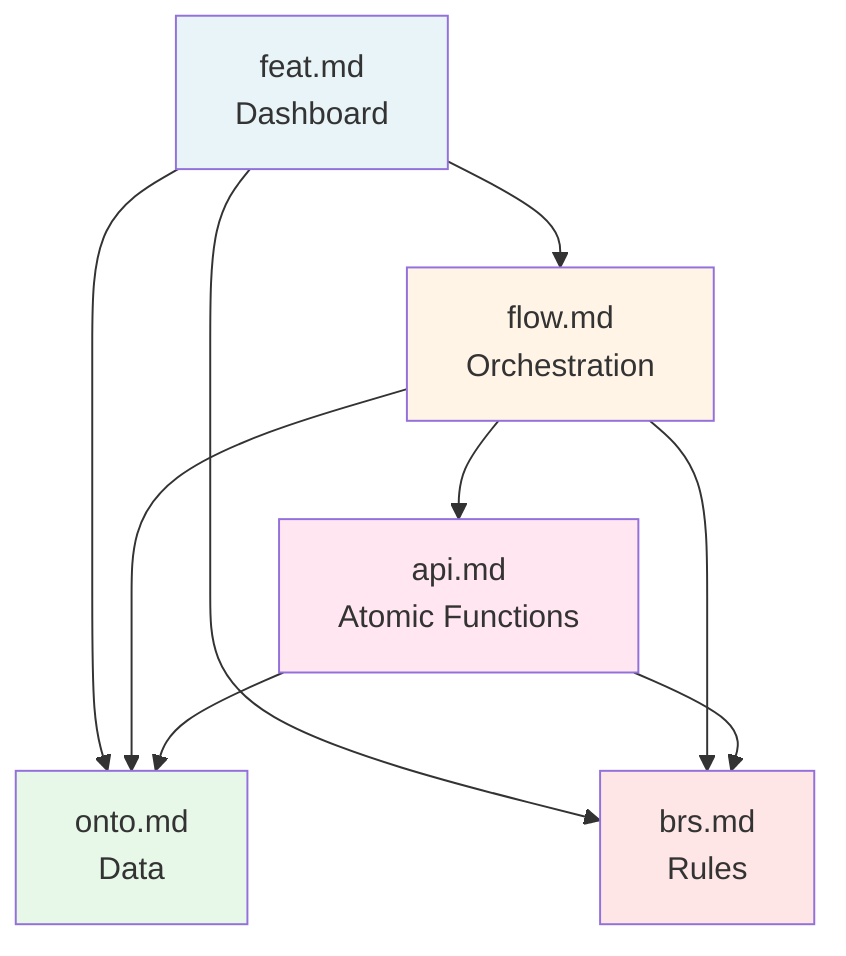
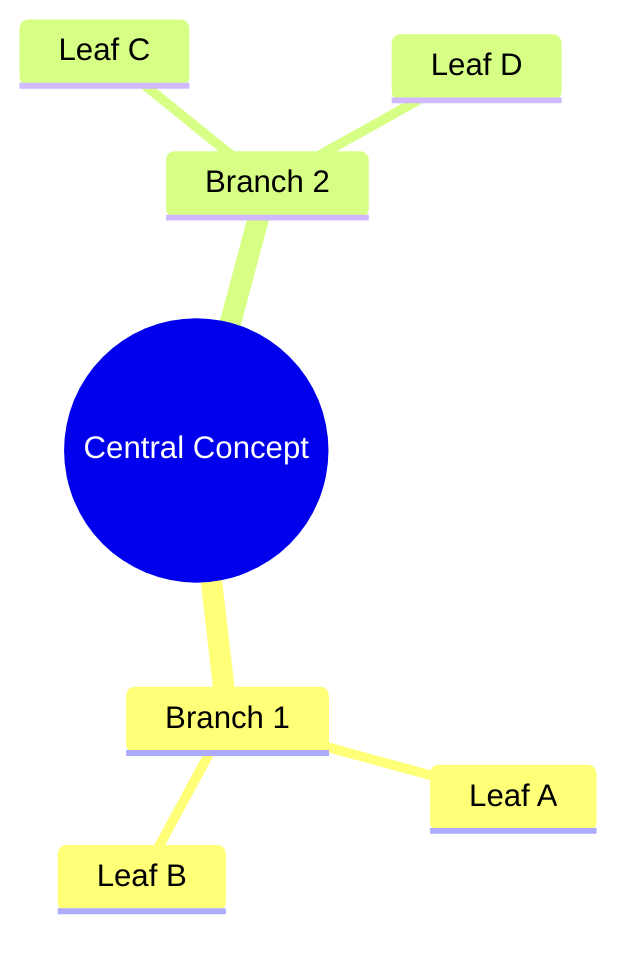
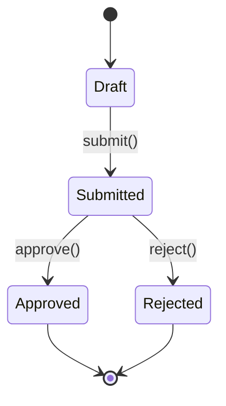
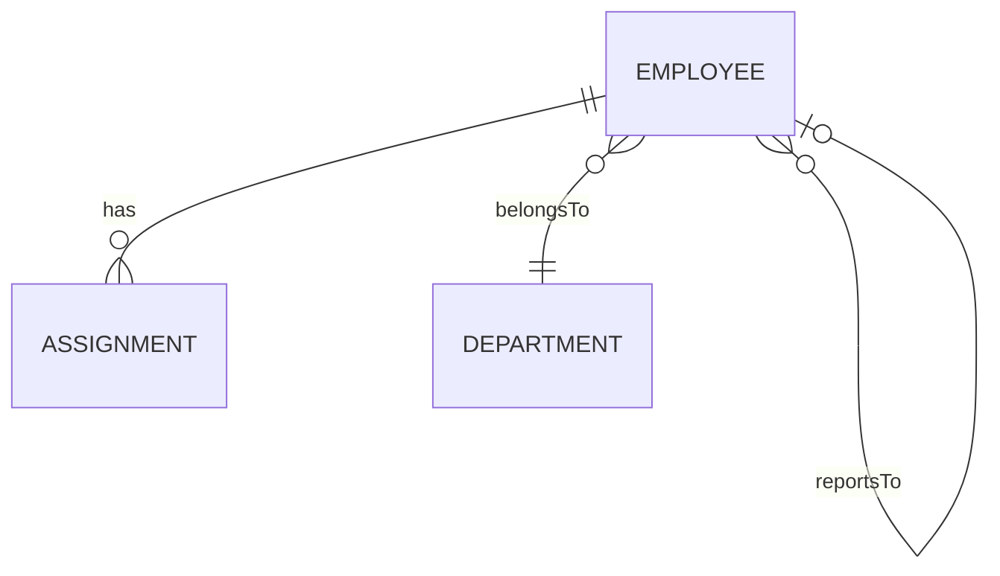
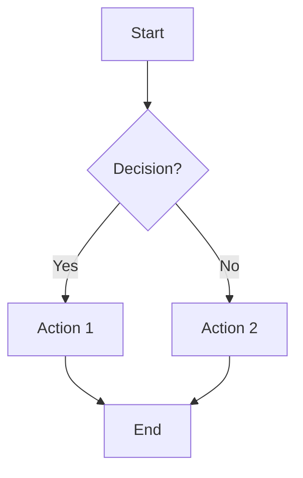
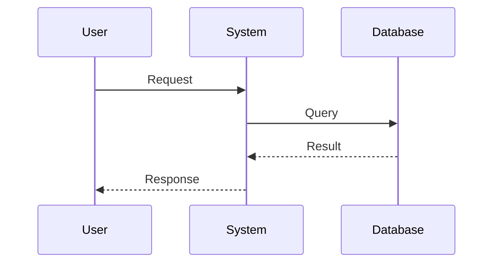
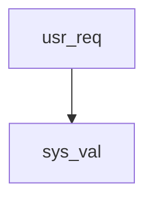
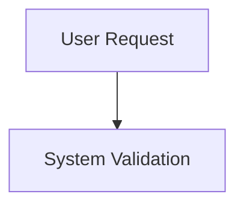
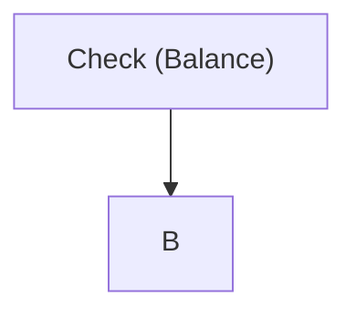

# Axiom Codex: Technical Standards

> **Technical Specification for the 5 Document Types**  
> *Machine-Readable & Human-Readable Documentation Standards*

## Purpose

This document defines the **technical specifications** for all 5 document types in the Axiom Codex system. These standards ensure:

1. **Consistency**: All team members write documents following the same structure
2. **Machine-Readability**: AI agents can parse documents to build knowledge graphs and generate code
3. **Traceability**: Documents reference each other to form an interconnected knowledge graph

---

## Design Philosophy

> **YAML = Data | Markdown = Visualization**

### Core Principles

1. **YAML Frontmatter is the Single Source of Truth**
   - All business data, relationships, rules, and metadata live in YAML
   - YAML must be complete and self-contained
   - AI agents parse YAML only; Markdown is optional enhancement

2. **Markdown Body is Pure Visualization**
   - Explains YAML content in human-readable terms
   - Uses Mermaid diagrams for visual understanding
   - Can be regenerated from YAML if needed

3. **Mermaid Diagrams are Required**
   - Every document type has specific diagram requirements
   - Diagrams make documentation scannable and engaging
   - Visual representations enhance understanding of relationships and flows

### Data Flow



**Why This Approach?**

- ✅ **Structured**: YAML is easy to parse and validate
- ✅ **Complete**: No critical data scattered in prose
- ✅ **Queryable**: Can build indexes and search efficiently
- ✅ **Version-controllable**: Diff-friendly format
- ✅ **Regenerable**: Markdown can be auto-generated from YAML
- ✅ **Visual**: Mermaid diagrams make complex concepts clear

---

## Document Type Index

| Type | Extension | Layer | Role |
|------|-----------|-------|------|
| [Feature Specification](#1-feature-specification-featmd) | `*.feat.md` | Intent | Root node & dashboard |
| [Ontology Model](#2-ontology-model-ontomd) | `*.onto.md` | Data | Entities & knowledge graph |
| [Business Policy](#3-business-policy-brsmd) | `*.brs.md` | Guard | Rules & constraints |
| [Controller Flow](#4-controller-flow-flowmd) | `*.flow.md` | Behavior | Orchestration scripts |
| [Interface Unit](#5-interface-unit-apimd) | `*.api.md` | Execution | Atomic functions |

---

## 1. Feature Specification (`*.feat.md`)

### Role
**Root Node** - Manages expectations and scope. Entry point for understanding a feature.

### File Naming
```
<feature-name>.feat.md
```
Examples: `leave-request.feat.md`, `payroll-calculation.feat.md`

### Required Sections

| Section | Content | AI/Automation Purpose |
|---------|---------|----------------------|
| **YAML Header** | `id`, `title`, `type: feature`, `status` (draft/active/deprecated), `owner`, `version`, `created`, `updated` | Project lifecycle management and ownership tracking |
| **1. Intent & Goals** | **User Story**: Who wants to do what, to achieve what?<br>**Business Metrics**: KPIs to measure success | AI understands context to suggest optimal solutions (e.g., performance vs security trade-offs) |
| **2. UX/UI Scope** | **Design Links**: Figma/Wireframe URLs<br>**Interaction**: UI behavior (Loading, Error states, Success feedback) | Links logic backend with frontend display |
| **3. Ontology Map** | **Entities**: List of `*.onto.md` files involved<br>**Roles**: Users/Actors participating (Admin, Employee, Manager) | Helps AI narrow down data context window during retrieval |
| **4. Process Map** | **Main Flows**: List of `*.flow.md` files<br>**Sub Flows**: Reusable/shared flows | Creates navigation map |
| **5. Policy Map** | **Key Rules**: List of `*.brs.md` files that govern this feature | Ensures feature complies with business rules |

```yaml
---
# === METADATA ===
id: FEAT-TA-001                        # Unique identifier (module prefix)
type: FEATURE                          # Always 'FEATURE'
module: TIME_ATTENDANCE                # Module name
title: "Submit Leave Request"          # Human-readable name
version: "1.0.0"                       # Semantic versioning
status: DRAFT                          # DRAFT | REVIEW | APPROVED | IMPLEMENTED
owner: "HR Product Team"               # Responsible team/person
created: "2026-01-01"                  # Creation date
updated: "2026-01-15"                  # Last update date
tags:                                  # Optional classification
  - time-off
  - leave-management
  - approval-workflow

# === ACTORS & CONTEXT ===
actors:                                # Who interacts with this feature
  - Employee
  - Manager
triggers:                              # What initiates this feature
  - "User clicks 'New Leave Request'"
preconditions:                        # Prerequisites before feature can execute
  - "User is authenticated"
  - "User has active employment contract"
postconditions:                       # Expected state after feature completes
  - "Leave request status = SUBMITTED"
  - "Approval workflow initiated"

# === USER STORY (Feature-specific) ===
user_story:
  as: "Employee"
  i_want: "submit a leave request online"
  so_that: "I can plan my time off without manual paperwork"

# === ACCEPTANCE CRITERIA (Feature-specific, Gherkin) ===
acceptance_criteria:
  - scenario: "Probation employee cannot take annual leave"
    given: "User is on Probation"
    when: "they submit Annual Leave request"
    then: "validation error 'PROBATION_NOT_ELIGIBLE' is shown"
  
  - scenario: "Successful leave submission"
    given: "User is a confirmed employee AND has 10 days balance"
    when: "they submit 3 days Annual Leave with 7+ days notice"
    then: "request status is 'SUBMITTED' AND manager is notified"

# === DATA CONTRACT (Feature-specific) ===
data_contract:
  input:
    userId: "string"
    leaveTypeId: "string"
    startDate: "date"                 # ISO 8601 format
    endDate: "date"
    reason: "string?"                  # Optional field
  output:
    requestId: "string"
    status: "SUBMITTED | PENDING | REJECTED"
    trackingNumber: "string"
    createdAt: "datetime"

# === REFERENCES TO EXTERNAL DOCS ===
requirements:                          # FRs this feature implements
  - "[[FR-TA-001]]"
  - "[[FR-TA-002]]"
  - "[[FR-TA-003]]"

business_rules:                        # BRs this feature enforces
  - "[[BR-TA-001]]"
  - "[[BR-TA-002]]"
  - "[[BR-TA-003]]"

related_ontology:                      # Entities this feature uses
  - "[[LeaveRequest]]"
  - "[[Employee]]"
  - "[[LeaveBalance]]"

related_features:                      # Other features connected to this one
  - "[[FEAT-TA-002]]"                 # Approve Leave Request
---
```

> **Important**: YAML frontmatter contains ALL feature data. Markdown body below is for visualization only.

### Markdown Body Template

> **Remember**: Markdown is for visualization only. All data is in YAML above.

```markdown
# Feature: [Feature Name]

## Overview (mindmap) - REQUIRED

Show relationships between this feature and external docs:

\`\`\`mermaid
mindmap
  root((Submit Leave Request))
    Implements FRs
      FR-TA-001 Select Type
      FR-TA-002 Validate Balance
    Enforces BRs
      BR-TA-001 Probation Check
      BR-TA-002 Notice Period
    Uses Entities
      LeaveRequest
      LeaveBalance
      Employee
    Related Features
      FEAT-TA-002 Approve
\`\`\`

## User Story - REQUIRED

**As an** Employee  
**I want to** submit a leave request online  
**So that** I can plan my time off without manual paperwork

## Acceptance Criteria (Gherkin) - REQUIRED

### Scenario: Probation employee cannot take annual leave
**Given** User is on Probation  
**When** they submit Annual Leave request  
**Then** validation error "PROBATION_NOT_ELIGIBLE" is shown

### Scenario: Successful leave submission
**Given** User is a confirmed employee AND has 10 days balance  
**When** they submit 3 days Annual Leave with 7+ days notice  
**Then** request status is "SUBMITTED" AND manager is notified

## Data Contract (JSON5) - REQUIRED

**Input**:
\`\`\`json5
{
  userId: "string",
  leaveTypeId: "string",
  startDate: "date",               // ISO 8601 format
  endDate: "date",
  reason: "string?",               // Optional
}
\`\`\`

**Output**:
\`\`\`json5
{
  requestId: "string",
  status: "SUBMITTED | PENDING | REJECTED",
  trackingNumber: "string",
  createdAt: "datetime",
}
\`\`\`

## User Flow (sequenceDiagram) - OPTIONAL

\`\`\`mermaid
sequenceDiagram
    actor User
    participant System
    participant Manager
    
    User->>System: Fill leave form
    System->>System: Validate [[BR-TA-001]]
    System->>System: Check balance [[BR-TA-002]]
    alt Valid
        System->>System: Create request (SUBMITTED)
        System->>Manager: Send notification
        System-->>User: Success + Tracking ID
    else Invalid
        System-->>User: Show error
    end
\`\`\`

## UI Wireframe - OPTIONAL

**Text Wireframe**:
\`\`\`
┌─────────────────────────────────────────┐
│  [ Leave Request Form ]                 │
├─────────────────────────────────────────┤
│  Leave Type:  [Dropdown ▼]              │
│  Start Date:  [Date Picker] 📅          │
│  End Date:    [Date Picker] 📅          │
│  Reason:      [________________]        │
├─────────────────────────────────────────┤
│  Balance: 12 days remaining             │
├─────────────────────────────────────────┤
│  [Cancel]              [Submit Request] │
└─────────────────────────────────────────┘
\`\`\`

**Mockup Links** (if available):
> **📎 External Designs:**
> - [Figma: Leave Request Form](<<figma-link>>)


```

---

## 2. Ontology Model (`*.onto.md`)

### Role
**Data Layer** - Defines entities, their structure, relationships, and lifecycles. Forms the knowledge graph.

### File Naming
```
<EntityName>.onto.md
```
Examples: `Employee.onto.md`, `LeaveRequest.onto.md`, `PayrollRun.onto.md` (Use kebab-case for multi-word: `leave-request.onto.md`)

### Markdown Visualization Requirements

| Diagram Type | Section | Purpose | Required |
|--------------|---------|---------|----------|
| `mindmap` | Overview | Entity concept breakdown | ✅ Yes |
| `stateDiagram-v2` | Lifecycle & Workflows | State transitions | ✅ Yes |
| `erDiagram` | Relationships Explained | Entity connections | ✅ Yes |
| `flowchart` | Actions & Operations | Process flows | Optional |
| `sequenceDiagram` | Lifecycle & Workflows | Interaction flows | Optional |

| Section | Content | AI/Automation Purpose |
|---------|---------|----------------------|
| **YAML Header** | `id`, `type: entity`, `feature` (parent feature), `relations` (list of connections), `states` (valid status values) | **Core**: Used to build Graph Database (nodes & edges) and validate state transitions |
| **1. Description** | What this entity represents in the real world | Enables semantic search and AI understanding |
| **2. Schema** | Attribute table: `Name`, `Type`, `Required`, `PII`, `Description` | Generate database schemas and DTOs |
| **3. Relationships** | Detailed relationship descriptions with cardinality (1-1, 1-n, n-n) and cascade rules | AI uses this to traverse graph and find related data |
| **4. Lifecycle** | **Mermaid State Diagram**: State transition diagram<br>**Transition Rules**: Conditions for state changes | Validate logic in flows and prevent invalid state updates |

### YAML Frontmatter Schema

```yaml
---
# === HEADER ===
entity: LeaveRequest                   # PascalCase entity name
domain: time-management                # Domain area
version: "1.0.0"                       # Semantic version
status: approved                       # draft | review | approved
owner: "HR Product Team"               # Team/person responsible
tags:
  - time-off
  - absence-management

# === ATTRIBUTES ===
attributes:
  - name: id
    type: string                       # UUID
    required: true
    unique: true
    description: "Unique identifier for the leave request"
  
  - name: employeeId
    type: string                       # UUID reference
    required: true
    description: "Reference to the requesting employee"
  
  - name: startDate
    type: date
    required: true
    description: "Leave start date (inclusive)"
  
  - name: endDate
    type: date
    required: true
    description: "Leave end date (inclusive)"
  
  - name: leaveType
    type: enum
    required: true
    values: [annual, sick, personal, parental, unpaid]
    description: "Type of leave being requested"
  
  - name: reason
    type: string
    required: false
    description: "Optional reason for leave"
    constraints:
      max: 500
  
  - name: status
    type: enum
    required: true
    values: [DRAFT, SUBMITTED, APPROVED, REJECTED, CANCELLED]
    description: "Current status in lifecycle"
  
  - name: approverId
    type: string                       # UUID reference
    required: false
    description: "Manager who can approve this request"
  
  - name: createdAt
    type: datetime
    required: true
    description: "Timestamp when request was created"
  
  - name: updatedAt
    type: datetime
    required: true
    description: "Timestamp of last update"

# === RELATIONSHIPS ===
relationships:
  - name: requester
    target: Employee
    cardinality: many-to-one
    required: true
    inverse: leaveRequests
    description: "The employee who submitted this leave request"
  
  - name: approver
    target: Employee
    cardinality: many-to-one
    required: false
    description: "The manager who approves/rejects this request"
  
  - name: affectsBalance
    target: LeaveBalance
    cardinality: many-to-one
    required: true
    description: "The leave balance that will be deducted"

# === LIFECYCLE ===
lifecycle:
  states: [DRAFT, SUBMITTED, APPROVED, REJECTED, CANCELLED]
  initial: DRAFT
  terminal: [APPROVED, REJECTED, CANCELLED]
  transitions:
    - from: DRAFT
      to: SUBMITTED
      trigger: submit
      guard: "All required fields filled"
    
    - from: DRAFT
      to: CANCELLED
      trigger: cancel
    
    - from: SUBMITTED
      to: APPROVED
      trigger: approve
      guard: "Approver has permission"
    
    - from: SUBMITTED
      to: REJECTED
      trigger: reject
      guard: "Approver has permission"
    
    - from: SUBMITTED
      to: CANCELLED
      trigger: cancel
      guard: "Before approval"

# === ACTIONS ===
actions:
  - name: submit
    description: "Submit leave request for approval"
    requiredFields: [employeeId, startDate, endDate, leaveType]
    affectsAttributes: [status, updatedAt]
    triggersTransition: "DRAFT -> SUBMITTED"
  
  - name: approve
    description: "Approve the leave request"
    requiredFields: [approverId]
    affectsAttributes: [status, updatedAt]
    affectsRelationships: [affectsBalance]
    triggersTransition: "SUBMITTED -> APPROVED"
  
  - name: reject
    description: "Reject the leave request"
    requiredFields: [approverId]
    affectsAttributes: [status, updatedAt]
    triggersTransition: "SUBMITTED -> REJECTED"
  
  - name: cancel
    description: "Cancel the leave request"
    affectsAttributes: [status, updatedAt]
    triggersTransition: "DRAFT|SUBMITTED -> CANCELLED"

# === POLICIES ===
policies:
  - name: uniqueLeaveRequest
    type: validation
    rule: "No overlapping leave periods for same employee"
    expression: "SELECT COUNT(*) FROM LeaveRequest WHERE employeeId = :employeeId AND status IN ('SUBMITTED','APPROVED') AND (startDate BETWEEN :startDate AND :endDate OR endDate BETWEEN :startDate AND :endDate) = 0"
  
  - name: sufficientBalance
    type: business
    rule: "Employee must have sufficient leave balance"
  
  - name: dataRetention
    type: retention
    rule: "Retain approved/rejected requests for 7 years"
  
  - name: approvalAccess
    type: access
    rule: "Only direct manager or HR can approve"
---
```

> **Important**: YAML frontmatter contains ALL entity data. Markdown body explains this data in human terms.

### Markdown Body Template

```markdown
# Entity: [EntityName]

## 1. Overview

### Business Context
[What this entity represents in the business domain]

### Purpose
[Why this entity exists and what problems it solves]

## 2. Attributes

| Attribute | Type | Required | PII | Description |
|-----------|------|----------|-----|-------------|
| id | UUID | Yes | No | Unique identifier |
| employee_id | UUID | Yes | Yes | Foreign key to Employee |
| start_date | Date | Yes | No | Leave start date |
| end_date | Date | Yes | No | Leave end date |
| reason | String(500) | No | No | Reason for leave |
| status | Enum | Yes | No | Current status (see Lifecycle) |
| created_at | Timestamp | Yes | No | Record creation time |
| updated_at | Timestamp | Yes | No | Last update time |

### Attribute Notes
- **PII Classification**: Used for GDPR/privacy compliance
- **Type Definitions**: Follow standard data types (UUID, String, Int, Date, Timestamp, Enum, Boolean, JSON)

## 3. Relationships

### Requester (Employee)
- **Cardinality**: Many-to-One (n-1)
- **Description**: The employee who submitted the leave request
- **Cascade**: ON DELETE RESTRICT (cannot delete employee with active requests)
- **Navigation**: `LeaveRequest.requester -> Employee`

### Approver (Employee)
- **Cardinality**: Many-to-One (n-1)
- **Description**: The manager who can approve/reject
- **Cascade**: ON DELETE SET NULL
- **Navigation**: `LeaveRequest.approver -> Employee`

## 4. Lifecycle

### State Machine

\`\`\`mermaid
stateDiagram-v2
    [*] --> DRAFT
    DRAFT --> SUBMITTED: submit()
    DRAFT --> CANCELLED: cancel()
    SUBMITTED --> APPROVED: approve()
    SUBMITTED --> REJECTED: reject()
    SUBMITTED --> CANCELLED: cancel()
    APPROVED --> [*]
    REJECTED --> [*]
    CANCELLED --> [*]
\`\`\`

### Transition Rules

| From State | To State | Action | Condition | Triggered By |
|------------|----------|--------|-----------|--------------|
| DRAFT | SUBMITTED | `submit()` | All required fields filled | Employee |
| SUBMITTED | APPROVED | `approve()` | Approver has permission | Manager |
| SUBMITTED | REJECTED | `reject()` | Approver has permission | Manager |
| SUBMITTED | CANCELLED | `cancel()` | Before approval | Employee |

### State Invariants
- **DRAFT**: Can be edited freely
- **SUBMITTED**: Read-only, awaiting approval
- **APPROVED/REJECTED**: Immutable
- **CANCELLED**: Final state

## 5. Business Rules Reference

This entity is governed by:
- [LeavePolicy.brs.md](../policies/LeavePolicy.brs.md) - Validation rules
```

---

## 3. Business Policy (`*.brs.md`)

### Role
**Guard Layer** - Defines invariants, permissions, and validation logic that protect system integrity.

### File Naming
```
<PolicyArea>.brs.md
```
Examples: `LeavePolicy.brs.md`, `PayrollCalculation.brs.md`

### Required Sections

| Section | Content | AI/Automation Purpose |
|---------|---------|----------------------|
| **YAML Header** | `id`, `type: policy`, `applies_to` (list of entity/flow IDs), `severity` (critical/high/medium) | Defines scope and impact of rules |
| **1. Invariants** | Global rules that must NEVER be violated | Auto-generate `assert` statements and DB constraints |
| **2. Permissions** | RBAC matrix: Role-based access control rules | Generate authorization middleware |
| **3. Complex Logic** | Business formulas and conditional rules | Extract for unit testing and AI reference |
| **4. Error Specifications** | Error codes, messages, and HTTP status codes | Standardize API error responses |

```yaml
---
# === METADATA ===
id: BRS-TA-LEAVE
module: TIME_ATTENDANCE
sub_module: LEAVE_MANAGEMENT
title: "Leave Management Business Rules"
version: "1.0.0"
status: APPROVED                        # DRAFT | REVIEW | APPROVED
owner: "HR Product Team"
last_updated: "2026-01-15"
tags:
  - leave-policy
  - validation
  - compliance

# === BUSINESS RULES DATA ===
business_rules:
  - id: BR-TA-001
    title: "Probation Leave Restriction"
    description: "Employees on probation cannot apply for annual leave."
    category: Eligibility                # Eligibility | Validation | Calculation | Process | Approval
    severity: BLOCK                      # BLOCK | WARN | INFO
    priority: MUST                       # MUST | SHOULD | COULD
    status: ACTIVE                       # DRAFT | ACTIVE | DEPRECATED
    condition: "employee.status == 'PROBATION' AND leave_type == 'ANNUAL'"
    action: "Reject request with error PROBATION_NOT_ELIGIBLE"
    exception: "HR can override with approval"
    related_entities:
      - "[[Employee]]"
      - "[[LeaveRequest]]"
    enforced_by:
      - "[[FEAT-TA-001]]"

  - id: BR-TA-002
    title: "Notice Period Requirement"
    description: "Leave requests over 3 days require 7 days advance notice."
    category: Validation
    severity: BLOCK
    priority: MUST
    status: ACTIVE
    condition: "leave_duration > 3 AND days_until_start < 7"
    action: "Reject request with error INSUFFICIENT_NOTICE"
    exception: "Emergency leave exempt"
    related_entities:
      - "[[LeaveRequest]]"

  - id: BR-TA-003
    title: "Balance Sufficiency"
    description: "Leave requests cannot exceed available balance."
    category: Validation
    severity: BLOCK
    priority: MUST
    status: ACTIVE
    condition: "requested_days > available_balance"
    action: "Reject request with error INSUFFICIENT_BALANCE"
    related_entities:
      - "[[LeaveBalance]]"

# === RELATED ONTOLOGY ===
related_ontology:
  - "[[LeaveRequest]]"
  - "[[LeaveBalance]]"
  - "[[Employee]]"
  - "[[LeavePolicy]]"
---
```

> **Important**: YAML frontmatter contains ALL business rules. Markdown provides visualization with mindmap and decision flowcharts.

### Markdown Body Template

```markdown
# Business Policy: [Policy Name]

## 1. Invariants

> Global rules that must ALWAYS be true

### INV-001: No Overlapping Leaves
**Rule**: An employee cannot have overlapping leave periods.

**Formula**:
\`\`\`
∀ leave1, leave2 ∈ LeaveRequests where leave1.employee_id = leave2.employee_id:
  leave1.end_date < leave2.start_date OR leave2.end_date < leave1.start_date
\`\`\`

**Validation Point**: Before creating or approving leave request  
**Error Code**: `ERR_LEAVE_OVERLAP`

### INV-002: Minimum Advance Notice
**Rule**: Leave requests must be submitted at least 2 business days in advance.

**Formula**:
\`\`\`
LeaveRequest.start_date >= TODAY + 2 business days
\`\`\`

**Validation Point**: At submission time  
**Error Code**: `ERR_INSUFFICIENT_NOTICE`

### INV-003: Positive Leave Balance
**Rule**: Employee must have sufficient leave balance.

**Formula**:
\`\`\`
Employee.leave_balance >= (LeaveRequest.end_date - LeaveRequest.start_date + 1)
\`\`\`

**Validation Point**: Before approval  
**Error Code**: `ERR_INSUFFICIENT_BALANCE`

## 2. Permissions

### RBAC Matrix

| Resource | Action | Employee | Manager | HR Admin | System |
|----------|--------|----------|---------|----------|--------|
| Leave Request | Create (self) | ✅ | ✅ | ✅ | ❌ |
| Leave Request | Read (own) | ✅ | ❌ | ❌ | ❌ |
| Leave Request | Read (team) | ❌ | ✅ | ✅ | ❌ |
| Leave Request | Update (draft) | ✅ | ❌ | ✅ | ❌ |
| Leave Request | Submit | ✅ | ❌ | ❌ | ❌ |
| Leave Request | Approve | ❌ | ✅ | ✅ | ❌ |
| Leave Request | Reject | ❌ | ✅ | ✅ | ❌ |
| Leave Request | Cancel (own) | ✅ | ❌ | ✅ | ❌ |
| Leave Balance | View (own) | ✅ | ❌ | ❌ | ❌ |
| Leave Balance | Adjust | ❌ | ❌ | ✅ | ✅ |

### Permission Rules

**PERM-001: Self-Service Restriction**
- Employees can only create leave requests for themselves
- Exception: HR Admin can create on behalf of employees

**PERM-002: Approval Hierarchy**
- Managers can only approve requests from direct reports
- HR Admin can approve any request

**PERM-003: Cancellation Window**
- Employees can cancel DRAFT or SUBMITTED requests
- Cannot cancel APPROVED requests less than 1 day before start date

## 3. Complex Logic

### LOGIC-001: Leave Balance Calculation

**Purpose**: Calculate remaining leave balance after leave request

**Formula**:
\`\`\`python
def calculate_balance_after_leave(employee_id, start_date, end_date):
    # Get current balance
    current_balance = Employee.find(employee_id).leave_balance
    
    # Calculate working days (exclude weekends and holidays)
    working_days = count_working_days(start_date, end_date)
    
    # Deduct from balance
    new_balance = current_balance - working_days
    
    return new_balance
\`\`\`

**Validation**: `new_balance >= 0` (see INV-003)

### LOGIC-002: Approval Routing

**Purpose**: Determine who can approve a leave request

**Logic**:
\`\`\`python
def get_approver(employee_id):
    employee = Employee.find(employee_id)
    
    if employee.manager_id:
        return employee.manager_id
    else:
        # No direct manager -> route to HR
        return HR_DEPARTMENT_HEAD_ID
\`\`\`

## 4. Error Specifications

| Error Code | HTTP Status | Message | Resolution |
|------------|-------------|---------|------------|
| `ERR_LEAVE_OVERLAP` | 400 | "Leave period conflicts with existing request {id}" | Choose different dates |
| `ERR_INSUFFICIENT_NOTICE` | 400 | "Leave must be requested at least 2 days in advance" | Adjust start date |
| `ERR_INSUFFICIENT_BALANCE` | 400 | "Insufficient leave balance. Available: {balance} days" | Reduce leave duration or check balance |
| `ERR_INVALID_DATE_RANGE` | 400 | "End date must be after start date" | Correct date range |
| `ERR_UNAUTHORIZED_APPROVAL` | 403 | "You are not authorized to approve this request" | Contact appropriate manager |
| `ERR_POLICY_VIOLATION` | 422 | "Request violates business rule: {rule_id}" | Review policy requirements |

### Error Response Format
\`\`\`json
{
  "error": {
    "code": "ERR_LEAVE_OVERLAP",
    "message": "Leave period conflicts with existing request #1234",
    "details": {
      "conflicting_request_id": "1234",
      "conflict_period": "2026-01-20 to 2026-01-25"
    },
    "documentation": "/docs/policies/leave-policy#inv-001"
  }
}
\`\`\`

## Compliance Notes

- **Audit Trail**: All policy violations must be logged
- **Labor Law**: Minimum advance notice aligns with local labor regulations
- **Data Retention**: Policy violation logs retained for 7 years
```

---

## 4. Controller Flow (`*.flow.md`)

### Role
**Behavior Layer** - Defines orchestration of atomic APIs to achieve business workflows.

### File Naming
```
<WorkflowName>.flow.md
```
Examples: `SubmitLeaveRequest.flow.md`, `ProcessPayroll.flow.md`

### Required Sections

| Section | Content | AI/Automation Purpose |
|---------|---------|----------------------|
| **YAML Header** | `id`, `type: flow`, `trigger_type` (user/system/time), `input_entity`, `uses_apis` (list), `checks_policies` (list) | Defines trigger and dependencies |
| **1. Diagram** | **Mermaid Sequence/Flowchart**: Visual representation | Helps humans visualize, AI cross-references with steps |
| **2. Context** | Input data required (from forms, params, events) | Defines data payload initialization |
| **3. Orchestration** | **Step-by-Step**: Ordered list of API calls with mapping | **Core**: This is the "source code" for AI to understand execution flow |
| **4. Exception** | **Fallback Strategy**: Error handling (rollback, retry, compensation) | Ensures transaction integrity |

### YAML Frontmatter Schema

```yaml
---
# === METADATA ===
id: submit-leave-request-flow          # Unique flow identifier
type: flow                             # Always 'flow'
feature: leave-request.feat.md         # Parent feature
module: TIME_ATTENDANCE
title: "Submit Leave Request Flow"
version: "1.0.0"
status: APPROVED                        # DRAFT | REVIEW | APPROVED
owner: "HR Product Team"

# === TRIGGER & CONTEXT ===
trigger_type: user                     # user | system | time
trigger_event: "User clicks 'New Leave Request'"
preconditions:
  - "User is authenticated"
  - "User has active employment contract"
postconditions:
  - "Leave request status = SUBMITTED"
  - "Approval workflow initiated"

# === DATA & ENTITIES ===
input_entity: LeaveRequest             # Primary entity being processed
uses_entities:                         # Entities involved
  - LeaveRequest.onto.md
  - Employee.onto.md
  - LeaveBalance.onto.md
uses_apis:                             # APIs called in this flow
  - validateDates.api.md
  - checkOverlap.api.md
  - createLeaveRequest.api.md
  - notifyManager.api.md
checks_policies:                       # Policies enforced
  - LeavePolicy.brs.md

# === ORCHESTRATION STEPS ===
steps:
  - id: step-01
    name: "Validate Date Range"
    api_call: "validateDates.api.md"
    input_mapping:
      startDate: "context.startDate"
      endDate: "context.endDate"
      minimumNoticeDays: 2
    business_rule_check: "[[BR-TA-002]]"
    on_success: "step-02"
    on_failure: "return_error"
  
  - id: step-02
    name: "Check for Overlapping Leaves"
    api_call: "checkOverlap.api.md"
    input_mapping:
      employeeId: "context.employeeId"
      startDate: "context.startDate"
      endDate: "context.endDate"
    business_rule_check: "[[BR-TA-001]]"
    on_success: "step-03"
    on_failure: "return_error"
  
  - id: step-03
    name: "Create Leave Request Entity"
    api_call: "createLeaveRequest.api.md"
    input_mapping:
      employeeId: "context.employeeId"
      startDate: "context.startDate"
      endDate: "context.endDate"
      reason: "context.reason"
      leaveType: "context.leaveType"
      status: "DRAFT"
    state_transition: "null -> DRAFT"
    on_success: "step-04"
    on_failure: "return_error"
  
  - id: step-04
    name: "Notify Approver"
    api_call: "notifyManager.api.md"
    input_mapping:
      leaveRequestId: "step-03.output.requestId"
      approverId: "Employee.find(context.employeeId).managerId"
      notificationType: "email"
    on_success: "complete"
    on_failure: "log_warning"           # Non-blocking

# === TRANSACTION & PERFORMANCE ===
transaction_type: atomic               # atomic | long-running | saga
estimated_duration: "2s"               # Expected completion time
sla: "95% < 3s"                        # Service Level Agreement

# === EXCEPTION HANDLING ===
exception_handling:
  rollback_strategy: "Delete created leave request (compensating transaction)"
  retry_policy:
    step-01: "No retry"
    step-02: "No retry"
    step-03: "Retry once with 500ms backoff"
    step-04: "Async retry (3 attempts over 1 hour)"
---
```

> **Important**: YAML frontmatter contains complete flow orchestration. Markdown shows sequence diagrams and explains business logic.

### Markdown Body Template

```markdown
# Flow: [Workflow Name]

## 1. Goal

[What business outcome does this flow achieve?]

## 2. Trigger

**Event**: [What initiates this flow]  
**Source**: [User action / System event / Scheduled job]  
**Frequency**: [How often this occurs]

## 3. Process Diagram

\`\`\`mermaid
sequenceDiagram
    actor User
    participant UI
    participant API
    participant LeaveService
    participant EmployeeService
    participant NotificationService
    
    User->>UI: Fill leave form
    UI->>API: POST /leave-requests
    API->>LeaveService: validateDates()
    LeaveService-->>API: OK
    API->>LeaveService: checkOverlap()
    LeaveService-->>API: No conflicts
    API->>LeaveService: createLeaveRequest()
    LeaveService-->>API: Created (ID: 1234)
    API->>NotificationService: notifyManager()
    NotificationService-->>API: Notification sent
    API-->>UI: 201 Created
    UI-->>User: Success message
\`\`\`

## 4. Input Context

### Required Input
\`\`\`json
{
  "employee_id": "uuid",
  "start_date": "YYYY-MM-DD",
  "end_date": "YYYY-MM-DD",
  "reason": "string (optional)",
  "leave_type": "annual | sick | personal"
}
\`\`\`

### Data Sources
- **employee_id**: From authenticated session
- **dates & reason**: From user form submission

## 5. Orchestration Steps

### Step 1: Validate Date Range
**API**: [validateDates.api.md](../apis/validateDates.api.md)

**Input Mapping**:
\`\`\`json
{
  "start_date": context.start_date,
  "end_date": context.end_date,
  "minimum_notice_days": 2
}
\`\`\`

**Business Rule Check**: LeavePolicy.brs.md → INV-002 (Minimum Advance Notice)

**On Success**: Proceed to Step 2  
**On Failure**: 
- Return error to user
- Stop flow
- Error code: `ERR_INVALID_DATE_RANGE` or `ERR_INSUFFICIENT_NOTICE`

---

### Step 2: Check for Overlapping Leaves
**API**: [checkOverlap.api.md](../apis/checkOverlap.api.md)

**Input Mapping**:
\`\`\`json
{
  "employee_id": context.employee_id,
  "start_date": context.start_date,
  "end_date": context.end_date
}
\`\`\`

**Business Rule Check**: LeavePolicy.brs.md → INV-001 (No Overlapping Leaves)

**On Success**: Proceed to Step 3  
**On Failure**:
- Return conflicting leave request details
- Stop flow
- Error code: `ERR_LEAVE_OVERLAP`

---

### Step 3: Create Leave Request Entity
**API**: [createLeaveRequest.api.md](../apis/createLeaveRequest.api.md)

**Input Mapping**:
\`\`\`json
{
  "employee_id": context.employee_id,
  "start_date": context.start_date,
  "end_date": context.end_date,
  "reason": context.reason,
  "leave_type": context.leave_type,
  "status": "DRAFT"
}
\`\`\`

**State Transition**: `null → DRAFT` (per LeaveRequest.onto.md lifecycle)

**On Success**: 
- Store `leave_request_id` in context
- Proceed to Step 4

**On Failure**:
- Log error
- Stop flow
- Error code: `ERR_CREATE_FAILED`

---

### Step 4: Notify Approver
**API**: [notifyManager.api.md](../apis/notifyManager.api.md)

**Input Mapping**:
\`\`\`json
{
  "leave_request_id": context.leave_request_id,
  "approver_id": Employee.find(context.employee_id).manager_id,
  "notification_type": "email"
}
\`\`\`

**Side Effect**: Email sent to manager

**On Success**: 
- Update leave request status to `SUBMITTED`
- Return success to user

**On Failure** (non-blocking):
- Log warning
- Continue flow (notification can be retried asynchronously)

## 6. Exception Handling

### Rollback Strategy

If Step 3 or Step 4 fails after Step 3 completes:
1. Delete created leave request (compensating transaction)
2. Return error to user
3. Log transaction for audit

### Retry Policy

- **Step 1-2**: No retry (immediate failure)
- **Step 3**: Retry once with exponential backoff (500ms)
- **Step 4**: Async retry (3 attempts over 1 hour)

### Transaction Boundary

**Option A (Recommended)**: Atomic Transaction
- Wrap Steps 1-3 in single database transaction
- Step 4 runs asynchronously (eventual consistency)

**Option B**: Saga Pattern
- Each step is independent transaction
- Implement compensating actions for rollback

## 7. Exposure Decision

### Composite API Endpoint
Create unified API wrapping this entire flow:

\`\`\`
POST /api/leave-requests
Body: { employee_id, start_date, end_date, reason, leave_type }
Response: { leave_request_id, status, message }
\`\`\`

**Advantages**:
- Simpler client implementation
- Single network call
- Atomic transaction guarantees

**Disadvantages**:
- Less granular error handling
- Cannot save partial state (e.g., draft before submission)

### Client-Side Orchestration
Frontend calls APIs step-by-step:

**Advantages**:
- Allows partial saves (draft before final submit)
- More control over UI loading states
- Better offline support

**Disadvantages**:
- More complex frontend logic
- Multiple network calls (slower)
- Transaction boundaries harder to manage

## 8. Performance Considerations

- **Expected Duration**: < 2 seconds for happy path
- **SLA**: 95% of requests complete within 3 seconds
- **Timeout**: 10 seconds (then return 504 Gateway Timeout)

## 9. Audit & Logging

**Required Log Events**:
- Flow started (with input context)
- Each step completion (success/failure)
- Policy violations (with rule ID)
- Flow completed (with final state)

**Log Level**: INFO for success, WARN for retries, ERROR for failures
```

---

## 5. Interface Unit (`*.api.md`)

### Role
**Execution Layer** - Defines atomic functions (micro-units) that can be composed into workflows.

### File Naming
```
<function-name>.api.md
```
Examples: `validateDates.api.md`, `calculateTax.api.md`, `sendEmail.api.md` (Use kebab-case: `validate-dates.api.md`)

### Required Sections

| Section | Content | AI/Automation Purpose |
|---------|---------|----------------------|
| **YAML Header** | `id`, `type: api`, `method` (GET/POST/PUT/DELETE), `complexity` (low/medium/high), `idempotent` (yes/no) | Technical metadata for API catalog |
| **1. Capability** | What atomic task this function performs | AI uses for task-to-tool matching (ReAct pattern) |
| **2. Contract** | **Endpoint**, **Request Schema**, **Response Schema** | Generate OpenAPI specs and client SDKs |
| **3. Side Effects** | What data changes (Write vs Read), which entity fields affected | AI evaluates execution risk |
| **4. Internal Logic** | (Optional) Pseudo-code or algorithm description | Guides implementation |

### YAML Frontmatter Schema

```yaml
---
id: validate-leave-dates                # Unique API identifier
type: api                               # Always 'api'
feature: leave-request.feat.md          # Parent feature (if specific)
method: POST                            # HTTP method
endpoint: /internal/leave/validate-dates # API path
authentication: internal-service-token  # Auth requirement
complexity: low                         # low | medium | high
idempotent: yes                         # Can be called multiple times safely
version: "1.0.0"                        # API version
sla_ms: 50                              # Service Level Agreement (response time)
---
```

### Markdown Body Template

```markdown
# API: [Function Name]

## 1. Capability

**Atomic Task**: [Single-sentence description of what this function does]

**Purpose**: [Why this function exists]

**Operation Type**: [Read-only / Write / Delete]

## 2. Interface

### Endpoint
\`\`\`
{METHOD} {PATH}
\`\`\`

Example: `POST /internal/leave/validate-dates`

### Authentication
- **Type**: Internal service token / JWT / API Key
- **Scope**: `leave:validate` (if using OAuth scopes)

### Content Type
- **Request**: `application/json`
- **Response**: `application/json`

## 3. Request Contract

### Schema
\`\`\`json
{
  "start_date": "2026-01-20",          // Required: ISO 8601 date
  "end_date": "2026-01-25",            // Required: ISO 8601 date
  "minimum_notice_days": 2             // Optional: Override default policy
}
\`\`\`

### Parameter Definitions

| Parameter | Type | Required | Constraints | Description |
|-----------|------|----------|-------------|-------------|
| start_date | Date (ISO 8601) | Yes | >= TODAY | Leave start date |
| end_date | Date (ISO 8601) | Yes | >= start_date | Leave end date |
| minimum_notice_days | Integer | No | >= 0 | Policy override (admin only) |

### Validation Rules
- `start_date` must not be in the past
- `end_date` must be >= `start_date`
- Date range cannot exceed 90 days (policy limit)

## 4. Response Contract

### Success Response (200 OK)
\`\`\`json
{
  "valid": true,
  "working_days": 5,
  "includes_weekend": true,
  "includes_holidays": false
}
\`\`\`

### Response Fields

| Field | Type | Description |
|-------|------|-------------|
| valid | Boolean | Whether dates pass validation |
| working_days | Integer | Number of business days in range |
| includes_weekend | Boolean | Whether range includes weekend |
| includes_holidays | Boolean | Whether range includes public holidays |

## 5. Error Scenarios

| Status Code | Error Code | Message | Cause |
|-------------|------------|---------|-------|
| 400 | `ERR_INVALID_DATE_RANGE` | "End date must be after start date" | Invalid date logic |
| 400 | `ERR_PAST_DATE` | "Start date cannot be in the past" | start_date < TODAY |
| 400 | `ERR_INSUFFICIENT_NOTICE` | "Leave must be requested at least {N} days in advance" | start_date < TODAY + minimum_notice_days |
| 400 | `ERR_EXCEEDS_MAX_DURATION` | "Leave duration cannot exceed 90 days" | Date range too long |
| 422 | `ERR_POLICY_VIOLATION` | "Request violates policy: {policy_id}" | Business rule violation |
| 500 | `ERR_INTERNAL_ERROR` | "Failed to validate dates" | Unexpected server error |

### Error Response Format
\`\`\`json
{
  "valid": false,
  "error": {
    "code": "ERR_INSUFFICIENT_NOTICE",
    "message": "Leave must be requested at least 2 days in advance",
    "details": {
      "start_date": "2026-01-16",
      "earliest_allowed": "2026-01-17",
      "minimum_notice_days": 2
    }
  }
}
\`\`\`

## 6. Business Logic

### Algorithm
\`\`\`python
def validate_leave_dates(start_date, end_date, minimum_notice_days=2):
    # Step 1: Validate date order
    if end_date < start_date:
        raise ERR_INVALID_DATE_RANGE
    
    # Step 2: Check past dates
    if start_date < TODAY:
        raise ERR_PAST_DATE
    
    # Step 3: Check advance notice
    if start_date < (TODAY + minimum_notice_days business days):
        raise ERR_INSUFFICIENT_NOTICE
    
    # Step 4: Check maximum duration
    duration_days = (end_date - start_date).days + 1
    if duration_days > 90:
        raise ERR_EXCEEDS_MAX_DURATION
    
    # Step 5: Calculate working days
    working_days = count_business_days(start_date, end_date)
    includes_weekend = has_weekend(start_date, end_date)
    includes_holidays = has_public_holidays(start_date, end_date)
    
    return {
        "valid": True,
        "working_days": working_days,
        "includes_weekend": includes_weekend,
        "includes_holidays": includes_holidays
    }
\`\`\`

### Dependencies
- **Holiday Calendar**: Reads from `PublicHoliday.onto.md` entity
- **Business Rule**: Enforces LeavePolicy.brs.md → INV-002

## 7. Side Effects

**Data Changes**: None (read-only validation)

**External Systems**: None

**Idempotency**: Yes - calling this API multiple times with same input produces same result

## 8. Performance Characteristics

- **SLA**: < 50ms response time (95th percentile)
- **Timeout**: 500ms
- **Rate Limit**: 1000 requests/minute per service
- **Caching**: Results cacheable by date range (TTL: 1 hour)

## 9. Testing

### Test Cases

**TC-1: Valid Date Range**
\`\`\`
Input: { start_date: "2026-01-20", end_date: "2026-01-25" }
Expected: { valid: true, working_days: 4 }
\`\`\`

**TC-2: Invalid Order**
\`\`\`
Input: { start_date: "2026-01-25", end_date: "2026-01-20" }
Expected: 400 ERR_INVALID_DATE_RANGE
\`\`\`

**TC-3: Insufficient Notice**
\`\`\`
Input: { start_date: "2026-01-16", end_date: "2026-01-20" }
Expected: 400 ERR_INSUFFICIENT_NOTICE
\`\`\`

## 10. Usage Example

### cURL
\`\`\`bash
curl -X POST https://api.example.com/internal/leave/validate-dates \\
  -H "Authorization: Bearer {token}" \\
  -H "Content-Type: application/json" \\
  -d '{
    "start_date": "2026-01-20",
    "end_date": "2026-01-25"
  }'
\`\`\`

### JavaScript
\`\`\`javascript
const response = await fetch('/internal/leave/validate-dates', {
  method: 'POST',
  headers: {
    'Authorization': `Bearer ${token}`,
    'Content-Type': 'application/json'
  },
  body: JSON.stringify({
    start_date: '2026-01-20',
    end_date: '2026-01-25'
  })
});

const result = await response.json();
if (result.valid) {
  console.log(`Working days: ${result.working_days}`);
}
\`\`\`
```

---

## Relationship Summary

### How the 5 Types Connect



### Document Lifecycle Summary

1. **`feat.md`** (Dashboard): *"I want feature A, using data `onto` B, following rules `brs` C."*
2. **`onto.md`** (Map): *"I am data B, with this structure and relationships."*
3. **`brs.md`** (Rule): *"I forbid action X on data B."*
4. **`flow.md`** (Script): *"To achieve feature A, Step 1 calls `api` X, Step 2 calls `api` Y."*
5. **`api.md`** (Tool): *"I am tool X, give me input A, I return output B."*

---

## Naming Conventions

### File Naming Standards

| Type | Pattern | Example |
|------|---------|---------|
| Feature | `<feature-name>.feat.md` | `leave-request.feat.md` |
| Ontology | `<EntityName>.onto.md` | `LeaveRequest.onto.md` |
| Policy | `<PolicyArea>.brs.md` | `LeavePolicy.brs.md` |
| Flow | `<WorkflowName>.flow.md` | `SubmitLeaveRequest.flow.md` |
| API | `<functionName>.api.md` | `validateDates.api.md` |

### ID Convention

All YAML `id` fields should use:
- **Lowercase** with **hyphens**
- **No spaces or special characters**
- **Descriptive but concise**

Examples: `leave-request-feature`, `employee-entity`, `payroll-calculation-policy`

---

## Mermaid Diagram Standards

### Diagram Requirements by Document Type

| Document Type | Required Diagrams | Optional Diagrams |
|---------------|------------------|-------------------|
| `*.feat.md` | `mindmap` (feature relationships) | `sequenceDiagram` (user flow) |
| `*.onto.md` | `mindmap` (concept breakdown)<br>`stateDiagram-v2` (lifecycle)<br>`erDiagram` (relationships) | `flowchart` (processes)<br>`sequenceDiagram` (workflows) |
| `*.brs.md` | `mindmap` (rule scope) | `flowchart` (decision logic) |
| `*.flow.md` | `sequenceDiagram` OR `flowchart` (step flow) | `flowchart` (exception handling) |
| `*.api.md` | None (JSON schemas sufficient) | `flowchart` (complex algorithms) |

### Diagram Best Practices

1. **Keep diagrams simple**: Max 10-15 nodes per diagram
2. **Use business language**: Not technical IDs or abbreviations
3. **Quote special characters**: Use `["Label (with parens)"]` not `[Label (with parens)]`
4. **Add context**: Brief explanation before/after diagram
5. **Use default styling**: Avoid custom colors unless necessary for clarity

### Mermaid Syntax Reference

#### Mindmap - Concept Visualization



**Use for**:
- Entity concept breakdown (Ontology)
- Feature relationship mapping (Feature)
- Rule categorization (Business Rules)

#### State Diagram - Lifecycle Transitions



**Use for**:
- Entity lifecycle states (Ontology)
- Workflow states

#### ER Diagram - Entity Relationships



**Cardinality notation**:
- `||` = exactly one
- `o|` = zero or one
- `}o` = zero or many
- `|{` = one or many

**Use for**:
- Entity relationship visualization (Ontology)

#### Flowchart - Process & Decision Flow



**Use for**:
- Business process flows (Ontology Actions)
- Decision logic (Business Rules)
- Exception handling (Controller Flow)

#### Sequence Diagram - Interactions



**Use for**:
- User interaction flows (Feature)
- API orchestration (Controller Flow)
- Workflow interactions (Ontology)

### Common Mistakes to Avoid

❌ **Don't**: Use technical IDs


✅ **Do**: Use business language


---

❌ **Don't**: Forget quotes for special chars
```mermaid
flowchart TD
    A[Check (Balance)] --> B
```

✅ **Do**: Quote labels with special characters


---

## Validation Checklist

### Cross-Document Validation

All documents must pass these checks:

✅ **YAML Completeness** (NEW)
- All required YAML fields are present
- No critical business data exists only in Markdown
- YAML follows the defined schema for each document type

✅ **Referential Integrity**
- All linked files exist (no broken references)
- YAML `id` fields are unique across same type
- Wiki-style `[[Entity]]` links point to valid entities

✅ **Coverage Completeness**
- `feat.md` references all related onto/brs/flow/api files
- `flow.md` references all APIs it orchestrates
- `api.md` references affected ontologies and business rules

✅ **State Consistency**
- Flow state transitions match ontology lifecycle diagrams
- API side effects align with ontology attribute definitions

✅ **Policy Compliance**
- Flows check all applicable business rules
- APIs validate inputs per policy specifications

✅ **Diagram Presence** (NEW)
- Required Mermaid diagrams exist for each document type
- Diagrams are syntactically correct and render properly

---

## AI Agent Integration

### AI Agent Processing Order

AI agents process documents in this order:

1. **Parse YAML frontmatter** - Extract all structured data
2. **Build knowledge graph** - Create nodes and edges from YAML relationships
3. **Validate constraints** - Check YAML against schemas
4. **Optionally read Markdown** - For additional context (not required)

> **Critical**: AI agents rely ONLY on YAML. Markdown is purely for human understanding.

### Why YAML-First?

- ✅ **Structured**: Easy to parse and validate programmatically
- ✅ **Complete**: No missing data scattered in prose
- ✅ **Queryable**: Can build indexes and search efficiently
- ✅ **Version-controllable**: Diff-friendly format
- ✅ **Regenerable**: Markdown can be auto-generated from YAML if needed

### Machine-Readable Elements

Each document type provides structured data for AI agents:

| Document | AI Use Case |
|----------|-------------|
| `feat.md` | Entry point for context retrieval, scope understanding, acceptance criteria extraction |
| `onto.md` | Schema generation, relationship traversal, state validation, action triggering |
| `brs.md` | Guardrail enforcement, error generation, validation logic, compliance checking |
| `flow.md` | Workflow execution, API orchestration, transaction design, step-by-step processing |
| `api.md` | Tool selection (ReAct), code generation, testing, contract validation |

### Graph Database Integration

YAML frontmatter enables automated graph construction:

```python
# Example: Build knowledge graph from YAML
from pathlib import Path
import yaml

def build_graph(docs_dir):
    graph = {}
    
    for file in Path(docs_dir).rglob("*.md"):
        with open(file) as f:
            content = f.read()
            if content.startswith("---"):
                # Parse YAML frontmatter
                frontmatter = yaml.safe_load(content.split("---")[1])
                graph[frontmatter['id']] = {
                    'type': frontmatter['type'],
                    'file': str(file),
                    'relations': frontmatter.get('relations', []),
                    'uses_apis': frontmatter.get('uses_apis', []),
                    'checks_policies': frontmatter.get('checks_policies', [])
                }
    
    return graph
```

---

## Conclusion

These technical standards ensure:

1. **Human Readability**: Markdown format with clear sections
2. **Machine Parseability**: YAML frontmatter for graph construction
3. **Consistency**: All documents follow same structure
4. **Traceability**: Explicit references create knowledge graph
5. **Automation**: AI agents can generate code, validate rules, execute workflows

By following these standards, Axiom Codex transforms documentation into executable knowledge.
