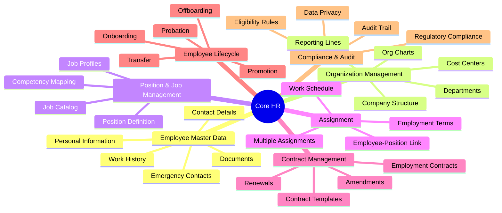
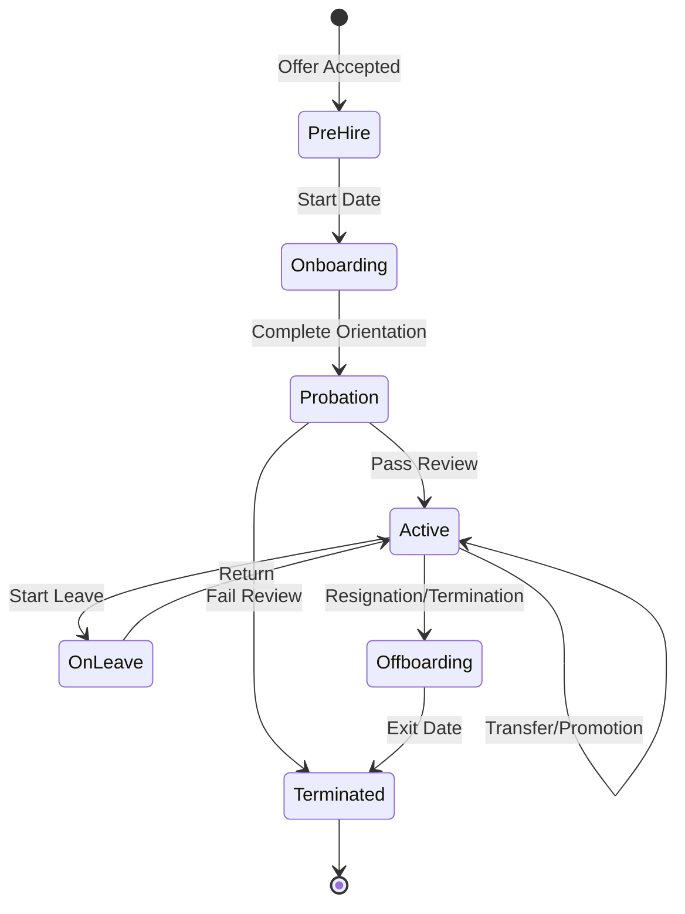

# Domain Research: Core HR

## 1. Executive Summary

Core HR (Core Human Resources) is the foundational module of any HCM system, managing essential employee information, organizational structure, and daily HR operations. It serves as the **backbone** of human resource management, centralizing employee data, streamlining administrative tasks, and ensuring compliance with labor laws.

**Key Competitors Analyzed**: Workday, SAP SuccessFactors, Oracle HCM Cloud, ADP

### Business Value

- **Single source of truth** for employee data across all HCM modules
- **Operational efficiency** through automation of routine HR tasks
- **Compliance assurance** with labor laws and regulations
- **Foundation** for downstream processes (Payroll, Time, Benefits, Talent)

### Strategic Positioning

| Competitor | Key Strength | Unique Approach |
|------------|--------------|-----------------|
| **Workday** | User experience, unified platform | Cloud-native, HCM + Financials |
| **SAP SuccessFactors** | Talent management, global reach | 50+ countries payroll, Employee Central |
| **Oracle HCM Cloud** | Enterprise integration, analytics | Deep Oracle ERP integration |
| **ADP** | Payroll expertise, compliance | Strong SMB focus, regulatory updates |

---

## 2. Domain Map

---

## 3. Sub-Module Breakdown

### 3.1 Employee Master Data

**Purpose**: Central repository for all critical employee information.

| Component | Description | Data Type |
|-----------|-------------|-----------|
| Personal Info | Name, DOB, Gender, Nationality | Master |
| Contact Details | Address, Phone, Email | Master |
| Identity Documents | ID Card, Passport, Tax ID | Master |
| Work History | Previous employers, Education | Master |
| Bank Details | Account for salary payment | Master |
| Emergency Contacts | Next of kin information | Master |

**Competitor Insights**:
- **Workday**: "Worker" concept with comprehensive 360° view
- **SAP**: Employee Central as central hub
- **Oracle**: HCM Core with robust analytics

### 3.2 Organization Management

**Purpose**: Define and maintain organizational hierarchy and structure.

| Component | Description |
|-----------|-------------|
| Legal Entity | Company legal structure |
| Business Unit | Logical grouping for reporting |
| Department | Functional units |
| Cost Center | Financial tracking unit |
| Location | Physical work locations |
| Reporting Lines | Manager-subordinate relationships |

**Best Practices**:
- Support multiple hierarchies (functional, matrix)
- Enable interactive org charts
- Track historical changes

### 3.3 Position & Job Management

**Purpose**: Define roles independent of individuals filling them.

| Concept | Definition |
|---------|------------|
| **Job** | Generic role definition (e.g., "Software Engineer") |
| **Position** | Specific seat in organization (e.g., "Position #12345") |
| **Job Profile** | Required skills, competencies, qualifications |

**Why Position Management?**
- Better workforce planning and budgeting
- Track filled vs. vacant positions
- Position persists when employee leaves
- Enables headcount control

### 3.4 Assignment

**Purpose**: Link employees to positions with work conditions.

| Attribute | Description |
|-----------|-------------|
| Primary Assignment | Main position held |
| Secondary Assignment | Additional roles (concurrent) |
| Assignment Type | Regular, Temporary, Contract |
| Work Schedule | Full-time, Part-time, Flexible |
| Probation Period | Trial period configuration |

### 3.5 Contract Management

**Purpose**: Create, manage, and track employment agreements.

| Contract Type | Description |
|---------------|-------------|
| Permanent | Indefinite employment |
| Fixed-Term | Time-limited contract |
| Temporary | Short-term engagement |
| Internship | Training/learning role |
| Contractor | External workforce |

**Key Features**:
- Template management
- Amendment tracking
- E-signature integration
- Expiry notifications
- Renewal workflows

### 3.6 Employee Lifecycle

**Purpose**: Manage employee journey from hire to exit.

---

## 4. Strategic Insights

### 4.1 Best Practices from Competitors

| Practice | Source | Recommendation |
|----------|--------|----------------|
| Self-service portal | All | Enable employees to update personal info |
| Position management | Workday | Track headcount with positions, not just employees |
| Global payroll integration | SAP | Design for multi-country compliance |
| Workflow automation | Oracle | Automate lifecycle events |
| Mobile-first | ADP | Support mobile access for field workers |

### 4.2 Vietnam-Specific Considerations

| Requirement | Description |
|-------------|-------------|
| Labor Law Compliance | Vietnam Labor Code 2019 |
| Contract Types | Definite vs Indefinite per law |
| Probation Rules | Max duration based on job type |
| Social Insurance | BHXH, BHYT, BHTN integration |
| Working Hours | 48 hours/week standard |
| Leave Entitlements | Annual leave, sick leave per law |

### 4.3 Gaps & Risks

| Gap/Risk | Impact | Mitigation |
|----------|--------|------------|
| Data privacy (PDPA) | Legal compliance | Implement field-level security |
| Historical tracking | Audit requirements | Effective dating all changes |
| Multiple assignments | Complex payroll | Clear assignment rules |
| Contract expiry | Compliance risk | Automated notifications |

### 4.4 Recommendations

1. **Implement Position Management**: Track organizational structure at position level, not just employee level
2. **Effective Dating**: All changes should have start/end dates for historical tracking
3. **Workflow Engine**: Automate lifecycle events (onboarding, transfer, termination)
4. **Self-Service**: Reduce HR workload with employee/manager self-service
5. **Integration Ready**: Design for downstream modules (Payroll, Time, Benefits)

---

## 5. Required Axiom Codex Documents

Based on this research, the following documents are needed for Core HR module:

### 5.1 Ontology Files (`*.onto.md`)

| File | Entity | Type | Priority |
|------|--------|------|----------|
| `employee.onto.md` | Employee | AGGREGATE_ROOT | MUST |
| `person.onto.md` | Person | ENTITY | MUST |
| `organization.onto.md` | Organization | AGGREGATE_ROOT | MUST |
| `department.onto.md` | Department | ENTITY | MUST |
| `position.onto.md` | Position | AGGREGATE_ROOT | MUST |
| `job.onto.md` | Job | ENTITY | MUST |
| `job-profile.onto.md` | JobProfile | ENTITY | SHOULD |
| `assignment.onto.md` | Assignment | ENTITY | MUST |
| `contract.onto.md` | Contract | AGGREGATE_ROOT | MUST |
| `contract-template.onto.md` | ContractTemplate | ENTITY | SHOULD |
| `location.onto.md` | Location | REFERENCE_DATA | MUST |
| `cost-center.onto.md` | CostCenter | REFERENCE_DATA | SHOULD |
| `employment-type.onto.md` | EmploymentType | REFERENCE_DATA | MUST |

### 5.2 Business Rules (`*.brs.md`)

| File | Area | Priority |
|------|------|----------|
| `employee-lifecycle.brs.md` | Lifecycle transitions | MUST |
| `contract-rules.brs.md` | Contract validation | MUST |
| `assignment-rules.brs.md` | Assignment constraints | MUST |
| `eligibility.brs.md` | Eligibility criteria | SHOULD |
| `data-privacy.brs.md` | PII handling | MUST |

### 5.3 Feature Specifications (`*.feat.md`)

| File | Feature | Priority |
|------|---------|----------|
| `onboard-employee.feat.md` | Employee onboarding | MUST |
| `manage-employee.feat.md` | Employee CRUD | MUST |
| `manage-organization.feat.md` | Org structure | MUST |
| `manage-position.feat.md` | Position management | MUST |
| `manage-contract.feat.md` | Contract management | MUST |
| `employee-transfer.feat.md` | Internal transfer | SHOULD |
| `employee-promotion.feat.md` | Promotion process | SHOULD |
| `offboard-employee.feat.md` | Termination/Resignation | MUST |

### 5.4 Controller Flows (`*.flow.md`)

| File | Workflow | Priority |
|------|----------|----------|
| `onboarding-flow.flow.md` | New hire process | MUST |
| `transfer-flow.flow.md` | Internal transfer | SHOULD |
| `promotion-flow.flow.md` | Promotion process | SHOULD |
| `offboarding-flow.flow.md` | Exit process | MUST |
| `contract-renewal-flow.flow.md` | Contract renewal | SHOULD |

### 5.5 Interface Units (`*.api.md`)

| File | Function | Priority |
|------|----------|----------|
| `create-employee.api.md` | Create employee | MUST |
| `update-employee.api.md` | Update employee | MUST |
| `get-employee.api.md` | Retrieve employee | MUST |
| `search-employees.api.md` | Search employees | MUST |
| `create-assignment.api.md` | Create assignment | MUST |
| `validate-contract.api.md` | Contract validation | MUST |

---

## 6. Document Summary

| Document Type | Count | Listed In |
|---------------|-------|-----------|
| Ontology (`*.onto.md`) | 13 | entity-catalog.md |
| Business Rules (`*.brs.md`) | 5 | feature-catalog.md |
| Features (`*.feat.md`) | 8 | feature-catalog.md |
| Flows (`*.flow.md`) | 5 | feature-catalog.md |
| APIs (`*.api.md`) | 6 | feature-catalog.md |

**Total Documents Required**: ~37 files

See detailed breakdowns in:
- [entity-catalog.md](entity-catalog.md) - Entity definitions
- [feature-catalog.md](feature-catalog.md) - Feature specifications
