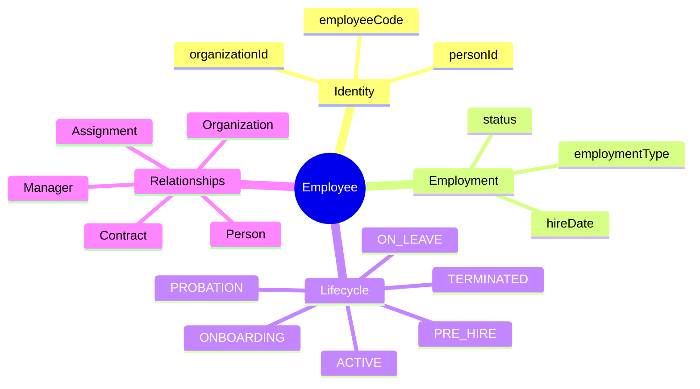
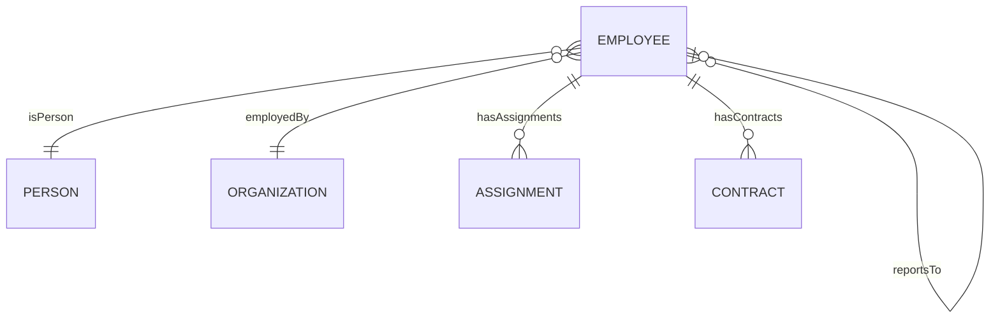
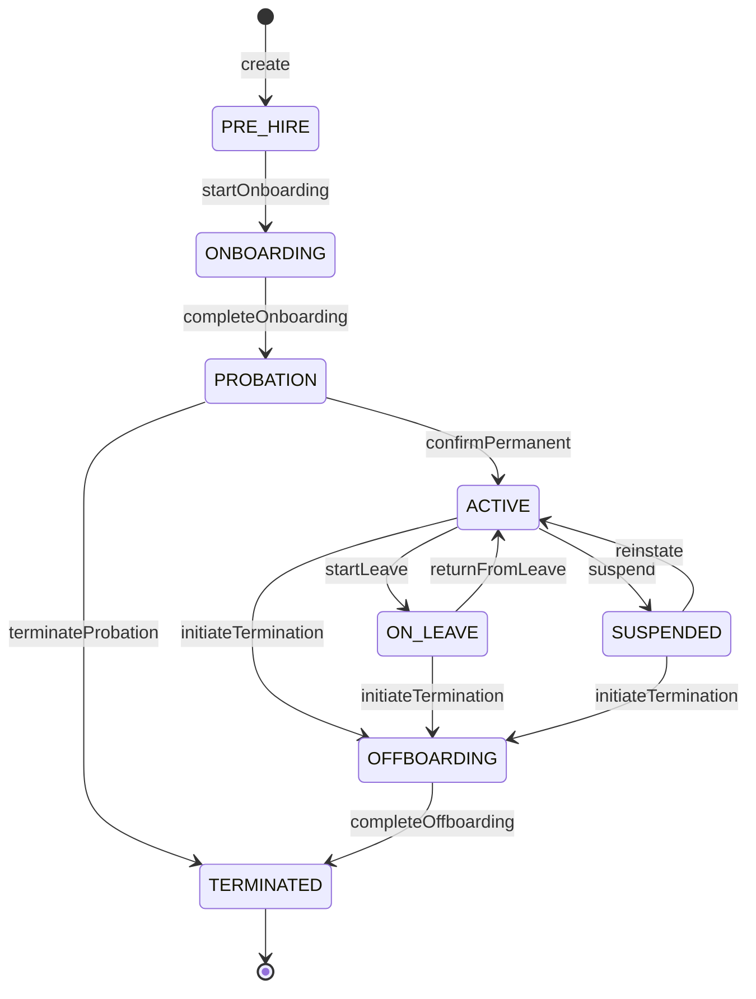

# Entity: Employee

## 1. Overview

### Business Context

An **Employee** represents a person who has an employment relationship with the organization. This entity is the **core of HR operations** - from hiring and payroll to performance management and offboarding. 

The Employee entity links personal data ([[Person]]) to organizational placement ([[Assignment]], [[Position]]), forming the foundation for all HR processes.

### Purpose

- Central source of truth for "who works here"
- Enables accurate headcount, labor cost, and compliance reporting
- Drives access control, payroll processing, and benefits eligibility



## 2. Attributes

| Attribute | Type | Required | PII | Description |
|-----------|------|----------|-----|-------------|
| id | UUID | Yes | No | System-generated unique identifier |
| employeeCode | String | Yes | No | Public identifier (EMP-XXXX) |
| personId | UUID | Yes | Yes | Link to Person for personal data |
| organizationId | UUID | Yes | No | Employing legal entity |
| hireDate | Date | Yes | No | Start of employment |
| terminationDate | Date | No | No | End of employment |
| originalHireDate | Date | No | No | First hire (for rehires) |
| seniority | Date | No | No | Tenure calculation date |
| employmentTypeCode | String | Yes | No | Full-time, Part-time, etc. |
| employeeStatusCode | Enum | Yes | No | Current lifecycle status |
| probationEndDate | Date | No | No | Probation end date |
| terminationReasonCode | String | No | No | Reason for exit |
| terminationType | Enum | No | No | Voluntary/Involuntary category |
| rehireEligibility | Enum | No | No | Future rehire eligibility |
| noticeStartDate | Date | No | No | Notice period start |
| lastWorkingDate | Date | No | No | Last day of work |
| createdAt | Datetime | Yes | No | Record creation time |
| updatedAt | Datetime | Yes | No | Last update time |

### Attribute Notes

- **PII Classification**: `personId` links to Person entity containing all PII data
- **employeeCode**: Public identifier, never changes even after termination
- **Status values**: See Lifecycle section for state machine

## 3. Relationships



### Related Entities

| Entity | Relationship | Cardinality | Description |
|--------|--------------|-------------|-------------|
| [[Person]] | isPerson | n-1 | Personal data (name, DOB, contacts) |
| [[Organization]] | employedBy | n-1 | Employing legal entity |
| [[Assignment]] | hasAssignments | 1-n | Position placements |
| [[Contract]] | hasContracts | 1-n | Employment agreements |
| [[Employee]] | reportsTo | n-1 | Direct supervisor |

### Relationship Details

#### isPerson → [[Person]]
- **Purpose**: Separates personal data from employment data
- **Why**: Same Person can have multiple Employee records (different organizations, rehires)
- **Navigation**: `Employee.isPerson -> Person`
- **Cascade**: ON DELETE RESTRICT

#### employedBy → [[Organization]]
- **Purpose**: Links to employing legal entity
- **Why**: Determines tax jurisdiction, labor law, payroll processing
- **Navigation**: `Employee.employedBy -> Organization`

#### hasAssignments → [[Assignment]]
- **Purpose**: Links to position/job assignments
- **Why**: Employee may have multiple assignments (primary + secondary)
- **Navigation**: `Employee.hasAssignments -> Assignment[]`

#### reportsTo → [[Employee]]
- **Purpose**: Defines management hierarchy
- **Why**: Drives approval workflows, org chart, span of control
- **Self-reference**: CEO/Founders have null supervisor

## 4. Lifecycle

### State Machine



### State Definitions

| State | Business Meaning | System Impact |
|-------|------------------|---------------|
| **PRE_HIRE** | Accepted offer, not yet started | No system access, not in headcount |
| **ONBOARDING** | First days, completing setup | Limited access, training tasks |
| **PROBATION** | Trial period (60 days Vietnam) | Full access, interim review required |
| **ACTIVE** | Normal working status | Full access, included in all reports |
| **ON_LEAVE** | Approved temporary absence | Access may suspend, excluded from assignments |
| **SUSPENDED** | Disciplinary/investigation | Access suspended, payroll may pause |
| **OFFBOARDING** | Separation in progress | Access being revoked, exit tasks |
| **TERMINATED** | Employment ended | No access, retained for compliance |

### Transition Rules

| From | To | Trigger | Guard | Actor |
|------|-----|---------|-------|-------|
| PRE_HIRE | ONBOARDING | startOnboarding | All documents collected | HR |
| ONBOARDING | PROBATION | completeOnboarding | Onboarding tasks done | HR |
| PROBATION | ACTIVE | confirmPermanent | Probation passed | HR+Manager |
| PROBATION | TERMINATED | terminateProbation | Probation failed | HR |
| ACTIVE | ON_LEAVE | startLeave | Leave approved | System |
| ON_LEAVE | ACTIVE | returnFromLeave | Leave ended | System |
| ACTIVE | OFFBOARDING | initiateTermination | Termination approved | HR |
| OFFBOARDING | TERMINATED | completeOffboarding | Exit tasks done | HR |

## 5. Business Rules Reference

This entity is governed by:

| Rule ID | Policy | Description |
|---------|--------|-------------|
| BR-CO-001 | [[employee-lifecycle.brs.md]] | Employee status transition rules |
| BR-CO-002 | [[probation-rules.brs.md]] | Probation period requirements (60 days Vietnam) |
| BR-CO-003 | [[termination-rules.brs.md]] | Termination notice, reasons, eligibility |
| BR-CO-010 | [[data-retention.brs.md]] | 10-year retention for terminated records |

### Key Validation Rules

- **uniqueEmployeeCode**: Employee code unique within organization
- **hireDateNotFuture**: Cannot hire with future date
- **terminationRequiresReason**: Must specify reason code when terminating
- **probationPeriod**: Default 60 days per Vietnam Labor Code

---

## Examples

### Example 1: Standard Full-Time Employee

```yaml
employeeCode: EMP-0042
personId: "uuid-person-123"
organizationId: "uuid-vng-corp"
hireDate: "2023-01-15"
employmentTypeCode: "FULL_TIME"
employeeStatusCode: "ACTIVE"
probationEndDate: "2023-03-15"  # hireDate + 60 days
```

### Example 2: Employee on Maternity Leave

```yaml
employeeCode: EMP-0108
employeeStatusCode: "ON_LEAVE"
hireDate: "2020-06-01"
# Leave type tracked in TimeOff module, not Employee entity
```

### Example 3: Terminated Employee

```yaml
employeeCode: EMP-0033
employeeStatusCode: "TERMINATED"
hireDate: "2018-03-01"
terminationDate: "2024-12-31"
terminationReasonCode: "RESIGNATION"
terminationType: "VOLUNTARY"
rehireEligibility: "ELIGIBLE"
lastWorkingDate: "2024-12-31"
```

---

## Edge Cases & Exceptions

### Rehires

When a terminated employee is rehired:
- Create **new** Employee record with new employeeCode
- Set `originalHireDate` to first employment date
- Use `seniority` date per policy (may bridge service)
- Link via Person entity (same personId)

### Concurrent Employment

Same person working for multiple legal entities:
- Each entity has separate Employee record
- Same `personId`, different `organizationId`
- Different `employeeCode` per organization

### Transfer Between Entities

When employee transfers to different legal entity:
1. Terminate current Employee record (TRANSFERRED reason)
2. Create new Employee in target entity
3. May preserve `seniority` date if same company group
