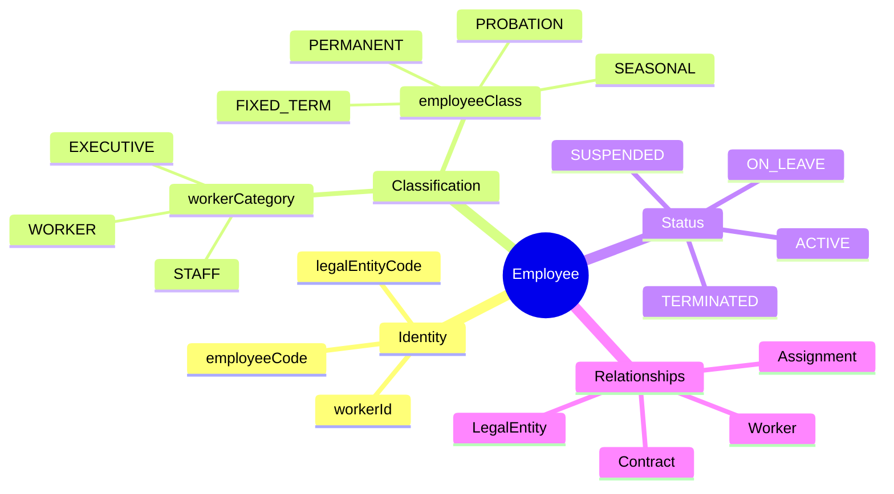
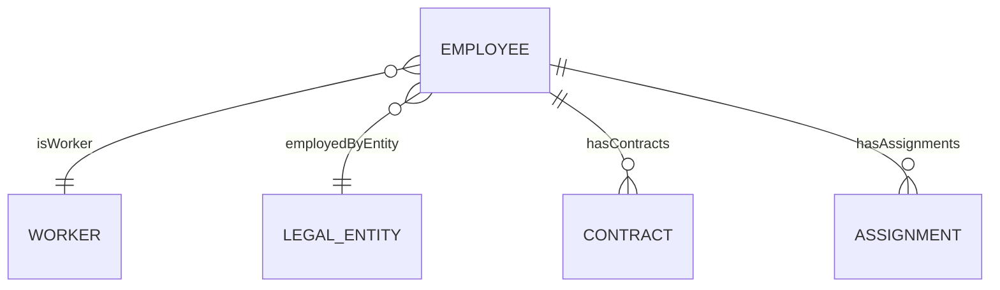
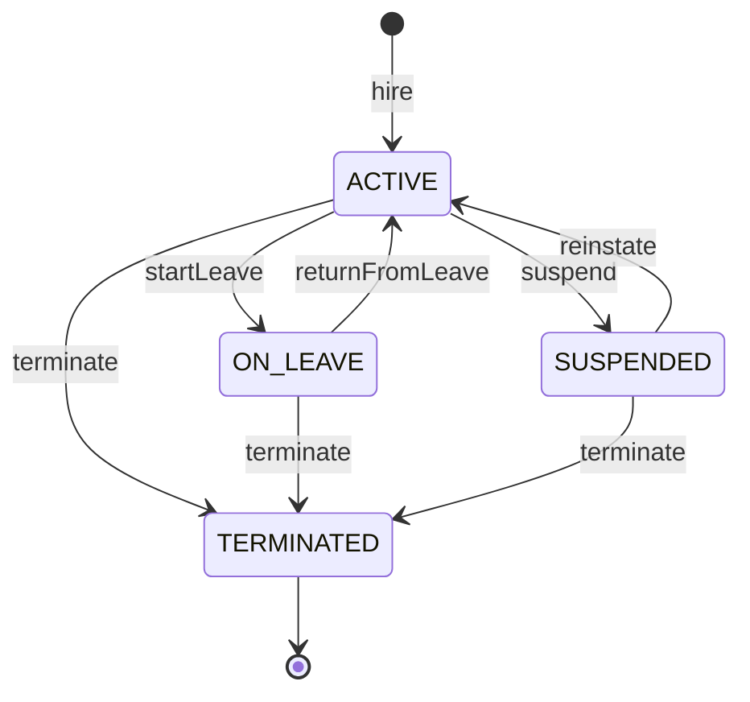

# Entity: Employee

## 1. Overview

### Business Context

An **Employee** represents a person who has an employment relationship with a specific [[LegalEntity]]. This entity is the core of HR operations - from hiring and payroll to performance management and offboarding.

**Key Design Decision**: One [[Worker]] can have multiple Employee records across different Legal Entities (concurrent employment in group) or over time (rehires).

### Purpose

- Central source of truth for employment within a specific legal entity
- Links person identity ([[Worker]]) to organizational placement ([[Assignment]])
- Drives payroll, benefits, access control, and compliance reporting



## 2. Attributes

| Attribute | Type | Required | PII | Description |
|-----------|------|----------|-----|-------------|
| id | UUID | Yes | No | System-generated unique identifier |
| workerId | UUID | Yes | Yes | FK to Worker for person identity |
| legalEntityCode | String | Yes | No | Employing legal entity |
| employeeCode | String | Yes | No | Public identifier (EMP-XXXX), unique per LE |
| workerCategoryCode | Enum | No | No | EXECUTIVE, STAFF, WORKER |
| employeeClassCode | Enum | Yes | No | PERMANENT, PROBATION, FIXED_TERM, etc. |
| statusCode | Enum | Yes | No | Current lifecycle status |
| hireDate | Date | Yes | No | Start of employment |
| terminationDate | Date | No | No | End of employment |
| terminationReasonCode | String | No | No | Reason for exit |
| originalHireDate | Date | No | No | First hire (for rehires) |
| seniorityDate | Date | No | No | Tenure calculation date |
| probationEndDate | Date | No | No | Probation end (hireDate + 60 days) |

### Attribute Notes

#### Classification Hierarchy

| workerCategoryCode | employeeClassCode | Description | BHXH | Vietnam Example |
|--------------------|-------------------|-------------|------|-----------------|
| EXECUTIVE | PERMANENT | Senior leadership | ✅ | CEO, CFO |
| STAFF | PERMANENT | Chính thức - full benefits | ✅ | NV văn phòng |
| STAFF | PROBATION | Thử việc - 60 ngày | ✅ | NV mới |
| STAFF | FIXED_TERM | Có thời hạn 12-36 tháng | ✅ | HĐ xác định |
| WORKER | SEASONAL | Thời vụ < 12 tháng | ✅ | Công nhân vụ mùa |
| STAFF | PART_TIME | < 8h/ngày hoặc < 40h/tuần | ✅ | Part-timer |
| STAFF | INTERN | Thực tập có lương | ✅ | Có HĐTT |

## 3. Relationships



### Related Entities

| Entity | Relationship | Cardinality | Description |
|--------|--------------|-------------|-------------|
| [[Worker]] | isWorker | n-1 | Person identity (name, DOB, nationality) |
| [[LegalEntity]] | employedByEntity | n-1 | Employing company |
| [[Contract]] | hasContracts | 1-n | Employment contracts/amendments |
| [[Assignment]] | hasAssignments | 1-n | Position assignments |

### Relationship Details

#### isWorker → [[Worker]]
- **Purpose**: Links to person identity (lifetime data)
- **Why**: Separates person data from employment data. Same person can have multiple Employee records.
- **Navigation**: `Employee.isWorker -> Worker`
- **Cascade**: ON DELETE RESTRICT (cannot delete worker with active employment)

#### employedByEntity → [[LegalEntity]]
- **Purpose**: The company that employs this person
- **Why**: Determines tax jurisdiction, labor law, payroll processing
- **Navigation**: `Employee.employedByEntity -> LegalEntity`
- **Note**: Transfer between entities creates NEW Employee record

#### hasContracts → [[Contract]]
- **Purpose**: Employment contracts linked to this employee
- **Why**: Track HĐLĐ, HĐTT, amendments, renewals
- **Navigation**: `Employee.hasContracts -> Contract[]`
- **Business Rule**: Employee should have at least one active contract

#### hasAssignments → [[Assignment]]
- **Purpose**: Position placements
- **Why**: Employee can have multiple assignments (1 primary + secondary/project)
- **Navigation**: `Employee.hasAssignments -> Assignment[]`
- **Business Rule**: Active employee should have primary assignment

## 4. Lifecycle

### State Machine



### State Definitions

| State | Business Meaning | System Impact |
|-------|------------------|---------------|
| **ACTIVE** | Currently employed and working | Full access, included in headcount, payroll active |
| **ON_LEAVE** | Approved temporary absence (LOA, maternity) | Access may suspend, excluded from assignments |
| **SUSPENDED** | Disciplinary or investigation | Access suspended, payroll may pause |
| **TERMINATED** | Employment ended | No access, final pay processed, archived |

### Transition Rules

| From State | To State | Trigger | Guard | Actor |
|------------|----------|---------|-------|-------|
| ACTIVE | ON_LEAVE | startLeave | Leave approved | System/HR |
| ON_LEAVE | ACTIVE | returnFromLeave | Leave ended | System/HR |
| ACTIVE | SUSPENDED | suspend | Disciplinary action | HR |
| SUSPENDED | ACTIVE | reinstate | Investigation complete | HR |
| * | TERMINATED | terminate | Termination approved | HR |

### Mapping to WorkRelationship

Employee status maps to [[WorkRelationship]] status:

| Employee Status | WorkRelationship Status | Notes |
|-----------------|------------------------|-------|
| ACTIVE | ACTIVE | Normal working |
| ON_LEAVE | ACTIVE | Still has relationship, just on leave |
| SUSPENDED | SUSPENDED | Relationship suspended |
| TERMINATED | TERMINATED | Relationship ended |

## 5. Business Rules Reference

This entity is governed by:

| Rule Area | Reference | Description |
|-----------|-----------|-------------|
| Validation | [[employee-validation.brs.md]] | Code uniqueness, date validation |
| Vietnam Labor Code | [[vietnam-labor.brs.md]] | Probation 60 days, contract types |
| Termination | [[termination-rules.brs.md]] | Notice period, reasons, rehire eligibility |
| Data Retention | [[data-retention.brs.md]] | 7 years for terminated records |

### Key Validation Rules

#### uniqueCodePerEntity
**Rule**: Employee code must be unique within Legal Entity.
**Reason**: Prevents confusion in payroll, reporting, integrations.
**Violation**: System prevents save; HR must choose different code.

#### hireDateNotFuture
**Rule**: Hire date cannot be in the future.
**Reason**: Prevents premature access. Future hires stay in recruiting system.
**Violation**: System prevents save.

#### probationPeriod
**Rule**: Probation max 60 days for senior roles per Vietnam Labor Code.
**Implementation**: `probationEndDate = hireDate + 60 days` (or less based on contract type).

---

## Examples

### Example 1: Standard Full-Time Employee

```yaml
id: "emp-uuid-001"
workerId: "wrk-00042"
legalEntityCode: "VNG_CORP"
employeeCode: "EMP-0042"
workerCategoryCode: "STAFF"
employeeClassCode: "PERMANENT"
statusCode: "ACTIVE"
hireDate: "2023-01-15"
terminationDate: null
probationEndDate: "2023-03-15"
```

### Example 2: Employee on Maternity Leave

```yaml
employeeCode: "EMP-0108"
statusCode: "ON_LEAVE"
employeeClassCode: "PERMANENT"
hireDate: "2020-06-01"
# Leave details tracked in TimeOff module, not Employee entity
```

### Example 3: Probation Employee

```yaml
employeeCode: "EMP-0200"
employeeClassCode: "PROBATION"
statusCode: "ACTIVE"
hireDate: "2024-06-01"
probationEndDate: "2024-08-01"  # hireDate + 60 days
```

---

## Edge Cases & Exceptions

### Rehires

When a terminated employee is rehired:
- Create **NEW** Employee record with new employeeCode
- Set `originalHireDate` to first employment date
- Use `seniorityDate` per company policy (may bridge service)
- Link via same Worker (same workerId)

### Concurrent Employment

Same person working for multiple legal entities in group:
- Same `workerId`, different `legalEntityCode`
- Each entity has separate Employee record
- Different `employeeCode` per entity

### Transfer Between Entities

When employee transfers to different Legal Entity:
1. Terminate current Employee record (terminationReasonCode = TRANSFER)
2. Create new Employee in target entity
3. May preserve `seniorityDate` if same company group
