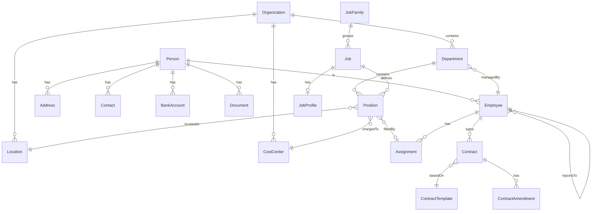

# Entity Catalog: Core HR

> **Note**: YAML above is for AI processing. Tables below for human reading.

## Entity Relationship Diagram

---

## A. Core Master Data - People & Workforce

| ID | Entity | Type | Definition |
|----|--------|------|------------|
| E-CO-001 | **[[Employee]]** | AGGREGATE_ROOT | Person with employment relationship. Central entity linking person to organization via assignments. |
| E-CO-002 | **[[Person]]** | ENTITY | Natural person with personal details. Supports pre-hire, contractor, dependent. |
| E-CO-003 | **[[Address]]** | VALUE_OBJECT | Physical or mailing address. |
| E-CO-004 | **[[Contact]]** | VALUE_OBJECT | Phone, email contact information. |
| E-CO-005 | **[[EmergencyContact]]** | VALUE_OBJECT | Emergency contact for employee. |
| E-CO-006 | **[[BankAccount]]** | VALUE_OBJECT | Bank details for salary payment. |
| E-CO-007 | **[[Document]]** | ENTITY | Identity documents, certifications attached to person. |

---

## B. Organization Structure

| ID | Entity | Type | Definition |
|----|--------|------|------------|
| E-CO-010 | **[[Organization]]** | AGGREGATE_ROOT | Legal entity or business unit. Root of org hierarchy. |
| E-CO-011 | **[[Department]]** | ENTITY | Functional unit within organization. |
| E-CO-012 | **[[Location]]** | REFERENCE_DATA | Physical work site. |
| E-CO-013 | **[[CostCenter]]** | REFERENCE_DATA | Accounting unit for cost tracking. |

---

## C. Position & Job Management

| ID | Entity | Type | Definition |
|----|--------|------|------------|
| E-CO-020 | **[[Job]]** | ENTITY | Generic role definition (e.g., "Software Engineer"). |
| E-CO-021 | **[[Position]]** | AGGREGATE_ROOT | Specific seat in organization. Exists independently of incumbent. |
| E-CO-022 | **[[JobFamily]]** | REFERENCE_DATA | Grouping of similar jobs. |
| E-CO-023 | **[[JobProfile]]** | ENTITY | Required skills/competencies for a job. |

---

## D. Assignment

| ID | Entity | Lifecycle | Definition |
|----|--------|-----------|------------|
| E-CO-030 | **[[Assignment]]** | Pending → Active → OnHold → Ended | Links employee to position with work conditions. |
| E-CO-031 | **[[WorkSchedule]]** | - | Working hours and patterns. |

---

## E. Contract Management

| ID | Entity | Lifecycle | Definition |
|----|--------|-----------|------------|
| E-CO-040 | **[[Contract]]** | Draft → PendingSignature → Active → Expiring → Expired → Terminated | Employment agreement. |
| E-CO-041 | **[[ContractTemplate]]** | - | Reusable contract template. |
| E-CO-042 | **[[ContractAmendment]]** | - | Modification to existing contract. |

---

## F. Reference/Config Data

| ID | Entity | Type | Definition |
|----|--------|------|------------|
| E-CO-050 | **[[EmploymentType]]** | REFERENCE_DATA | Full-time, Part-time, Contractor classification. |
| E-CO-051 | **[[EmployeeStatus]]** | REFERENCE_DATA | Lifecycle status values. |
| E-CO-052 | **[[ContractType]]** | REFERENCE_DATA | Types of employment contracts. |
| E-CO-053 | **[[TerminationReason]]** | REFERENCE_DATA | Reasons for employee exit. |

---

## Summary Statistics

| Category | Count |
|----------|-------|
| AGGREGATE_ROOT | 5 |
| ENTITY | 10 |
| VALUE_OBJECT | 4 |
| REFERENCE_DATA | 7 |
| **Total Entities** | **26** |
