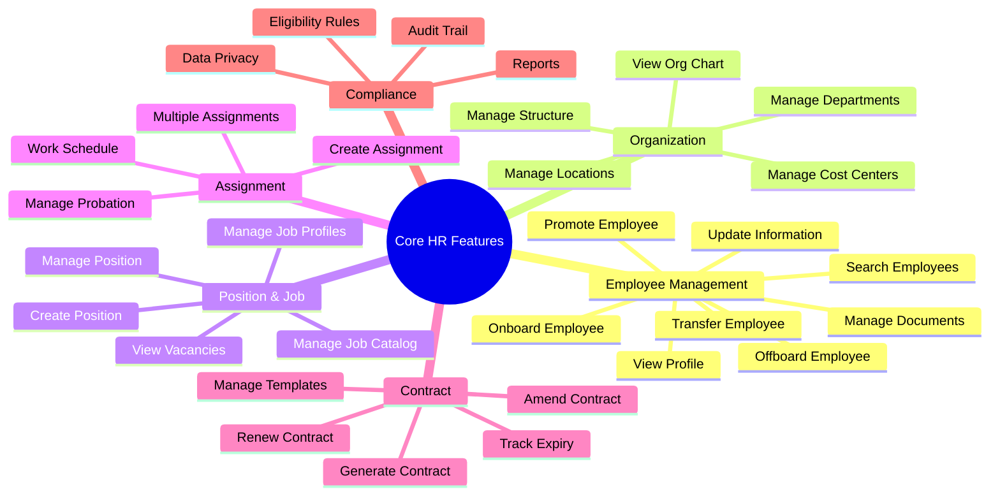

# Feature Catalog: Core HR

> **Note**: YAML above is for AI processing. Tables below for human reading.

## Feature Overview Mindmap

---

## Capability: Employee Management

| ID | Feature | Description | Priority | Type |
|----|---------|-------------|----------|------|
| FR-CO-001 | **Onboard New Employee** | As an HR Admin, I want to onboard a new employee... | MUST | Workflow |
| FR-CO-002 | **View Employee Profile** | As a Manager, I want to view an employee's complete profile... | MUST | Functional |
| FR-CO-003 | **Update Employee Information** | As an Employee, I want to update my personal information... | MUST | Functional |
| FR-CO-004 | **Search Employees** | As an HR Admin, I want to search for employees... | MUST | Functional |
| FR-CO-005 | **Manage Employee Documents** | As an HR Admin, I want to manage employee documents... | SHOULD | Functional |
| FR-CO-006 | **Transfer Employee** | As an HR Admin, I want to transfer an employee... | SHOULD | Workflow |
| FR-CO-007 | **Promote Employee** | As a Manager, I want to promote an employee... | SHOULD | Workflow |
| FR-CO-008 | **Offboard Employee** | As an HR Admin, I want to offboard an employee... | MUST | Workflow |

---

## Capability: Organization Management

| ID | Feature | Description | Priority | Type |
|----|---------|-------------|----------|------|
| FR-CO-010 | **Manage Organization Structure** | As an HR Admin, I want to define org structure... | MUST | Functional |
| FR-CO-011 | **Manage Departments** | As an HR Admin, I want to manage departments... | MUST | Functional |
| FR-CO-012 | **View Organization Chart** | As an Employee, I want to view the org chart... | SHOULD | Functional |
| FR-CO-013 | **Manage Locations** | As an HR Admin, I want to manage work locations... | MUST | Functional |
| FR-CO-014 | **Manage Cost Centers** | As a Finance Admin, I want to manage cost centers... | SHOULD | Functional |

---

## Capability: Position & Job Management

| ID | Feature | Description | Priority | Type |
|----|---------|-------------|----------|------|
| FR-CO-020 | **Manage Job Catalog** | As an HR Admin, I want to manage the job catalog... | MUST | Functional |
| FR-CO-021 | **Create Position** | As an HR Admin, I want to create a new position... | MUST | Functional |
| FR-CO-022 | **Manage Position** | As an HR Admin, I want to update position details... | MUST | Functional |
| FR-CO-023 | **View Position Vacancies** | As a Manager, I want to view vacant positions... | SHOULD | Functional |
| FR-CO-024 | **Manage Job Profiles** | As an HR Admin, I want to define job profiles... | SHOULD | Functional |

---

## Capability: Assignment Management

| ID | Feature | Description | Priority | Type |
|----|---------|-------------|----------|------|
| FR-CO-030 | **Create Assignment** | As an HR Admin, I want to assign an employee to a position... | MUST | Functional |
| FR-CO-031 | **Manage Multiple Assignments** | As an HR Admin, I want to manage concurrent assignments... | SHOULD | Functional |
| FR-CO-032 | **Manage Probation** | As a Manager, I want to manage employee probation... | MUST | Workflow |
| FR-CO-033 | **Manage Work Schedule** | As an HR Admin, I want to manage work schedules... | SHOULD | Functional |

---

## Capability: Contract Management

| ID | Feature | Description | Priority | Type |
|----|---------|-------------|----------|------|
| FR-CO-040 | **Generate Employment Contract** | As an HR Admin, I want to generate a contract from template... | MUST | Functional |
| FR-CO-041 | **Manage Contract Templates** | As an HR Admin, I want to manage contract templates... | SHOULD | Functional |
| FR-CO-042 | **Track Contract Expiry** | As an HR Admin, I want to be notified of expiring contracts... | MUST | Workflow |
| FR-CO-043 | **Amend Contract** | As an HR Admin, I want to amend an existing contract... | SHOULD | Functional |
| FR-CO-044 | **Renew Contract** | As an HR Admin, I want to renew an expiring contract... | MUST | Workflow |

---

## Capability: Compliance & Reporting

| ID | Feature | Description | Priority | Type |
|----|---------|-------------|----------|------|
| FR-CO-050 | **Manage Eligibility Rules** | As an HR Admin, I want to define eligibility rules... | SHOULD | Functional |
| FR-CO-051 | **Data Privacy Management** | As an HR Admin, I want to manage data privacy... | MUST | Functional |
| FR-CO-052 | **View Audit Trail** | As an Auditor, I want to view audit trail... | MUST | Functional |
| FR-CO-053 | **Generate Headcount Report** | As a Manager, I want to generate headcount reports... | SHOULD | Reporting |
| FR-CO-054 | **Generate Employee Directory** | As an Employee, I want to access the directory... | SHOULD | Functional |

---

## Business Rules Summary

| ID | Rule | Category | Severity |
|----|------|----------|----------|
| BR-CO-001 | Employee code must be unique | Validation | BLOCK |
| BR-CO-002 | Hire date cannot be future beyond 60 days | Validation | BLOCK |
| BR-CO-003 | New positions require budget approval | Approval | WARN |
| BR-CO-004 | Probation period max per Vietnam law | Compliance | BLOCK |
| BR-CO-005 | Contract end date validation | Validation | BLOCK |
| BR-CO-006 | Only one primary assignment allowed | Validation | BLOCK |
| BR-CO-007 | Manager cannot self-approve | Approval | BLOCK |
| BR-CO-008 | Notice period enforcement | Compliance | WARN |
| BR-CO-009 | PII data access control | Security | BLOCK |
| BR-CO-010 | All changes must be effective-dated | Audit | BLOCK |

---

## Summary Statistics

| Category | Count |
|----------|-------|
| Capabilities | 6 |
| Features | 27 |
| Business Rules | 10 |
| Priority MUST | 17 |
| Priority SHOULD | 10 |

---

## Required Document Mapping

### Features → feat.md Files

| Feature | Axiom File | Priority |
|---------|-----------|----------|
| Onboard Employee (FR-CO-001) | `onboard-employee.feat.md` | MUST |
| Manage Employee (FR-CO-002,003,004,005) | `manage-employee.feat.md` | MUST |
| Transfer Employee (FR-CO-006) | `transfer-employee.feat.md` | SHOULD |
| Promote Employee (FR-CO-007) | `promote-employee.feat.md` | SHOULD |
| Offboard Employee (FR-CO-008) | `offboard-employee.feat.md` | MUST |
| Manage Organization (FR-CO-010,011,013,014) | `manage-organization.feat.md` | MUST |
| View Org Chart (FR-CO-012) | `view-org-chart.feat.md` | SHOULD |
| Manage Jobs & Positions (FR-CO-020-024) | `manage-position.feat.md` | MUST |
| Manage Assignment (FR-CO-030-033) | `manage-assignment.feat.md` | MUST |
| Manage Contract (FR-CO-040-044) | `manage-contract.feat.md` | MUST |
| Compliance & Reports (FR-CO-050-054) | `compliance-reports.feat.md` | SHOULD |

### Business Rules → brs.md Files

| Area | Axiom File | Priority |
|------|-----------|----------|
| Employee Lifecycle | `employee-lifecycle.brs.md` | MUST |
| Assignment Rules | `assignment-rules.brs.md` | MUST |
| Contract Rules | `contract-rules.brs.md` | MUST |
| Eligibility | `eligibility.brs.md` | SHOULD |
| Data Privacy | `data-privacy.brs.md` | MUST |

### Workflows → flow.md Files

| Workflow | Axiom File | Priority |
|----------|-----------|----------|
| Onboarding | `onboarding-flow.flow.md` | MUST |
| Transfer | `transfer-flow.flow.md` | SHOULD |
| Promotion | `promotion-flow.flow.md` | SHOULD |
| Offboarding | `offboarding-flow.flow.md` | MUST |
| Contract Renewal | `contract-renewal-flow.flow.md` | SHOULD |
| Probation Review | `probation-review-flow.flow.md` | MUST |
