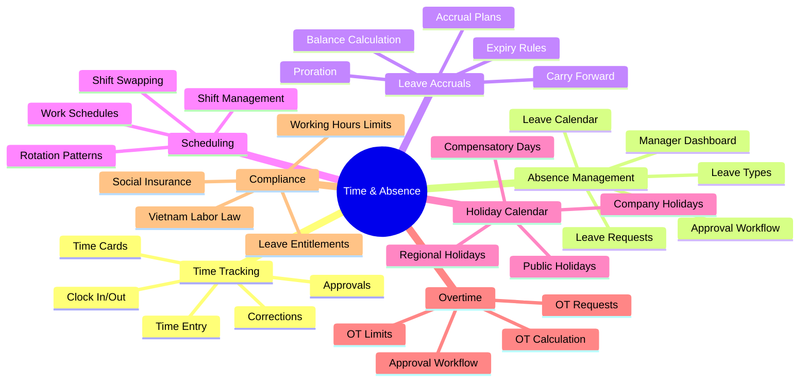

# Domain Research: Time & Absence

## 1. Executive Summary

Time & Absence (T&A) is a critical HCM module that manages employee time tracking, attendance, leave requests, and absence management. It serves as the **bridge between workforce scheduling and payroll processing**, ensuring accurate compensation and labor law compliance.

**Key Competitors Analyzed**: Workday, SAP SuccessFactors, Oracle HCM Cloud, ADP

### Business Value

- **Labor cost control** through accurate time tracking
- **Compliance assurance** with labor law regulations (overtime, leave entitlements)
- **Operational efficiency** via automated leave workflows
- **Payroll accuracy** with seamless time-to-pay integration
- **Employee experience** through self-service leave management

### Strategic Positioning

| Competitor | Key Strength | Unique Approach |
|------------|--------------|-----------------|
| **Workday** | Unified HCM platform | Time Off vs Leave of Absence distinction |
| **SAP SuccessFactors** | Global capabilities | WorkForce Software integration |
| **Oracle HCM Cloud** | Enterprise integration | Global absence policy engine |
| **ADP** | Payroll expertise | Real-time compliance updates |

---

## 2. Domain Map

---

## 3. Sub-Module Breakdown

### 3.1 Time Tracking

**Purpose**: Capture employee working hours for payroll and attendance.

| Component | Description |
|-----------|-------------|
| Clock In/Out | Physical/digital time punch |
| Time Entry | Manual timesheet entry |
| Time Cards | Weekly/monthly time summaries |
| Approvals | Manager review and approval |
| Corrections | Amendments to time records |

**Competitor Insights**:
- **Workday**: Centralized time tracking with absence calendar integration
- **SAP**: Digital punch clock with external terminal support
- **Oracle**: Mobile app and biometric device integration

### 3.2 Absence Management

**Purpose**: Handle all types of employee time-off requests and approvals.

| Leave Category | Examples |
|---------------|----------|
| **Paid Leave** | Annual, Sick, Personal |
| **Unpaid Leave** | Personal reasons, Extended leave |
| **Statutory Leave** | Maternity, Paternity, Bereavement |
| **Special Leave** | Marriage, Study, Jury duty |
| **Leave of Absence** | Extended medical, Sabbatical |

**Key Features**:
- Self-service request submission
- Multi-level approval workflows
- Team absence calendar view
- Conflict detection (overlapping leaves)
- Substitute/delegation assignment

### 3.3 Leave Accruals

**Purpose**: Calculate and manage leave entitlements and balances.

| Concept | Description |
|---------|-------------|
| **Accrual Plan** | Rules for earning leave (monthly, yearly) |
| **Balance** | Current available days |
| **Carry Forward** | Rules for unused leave transfer |
| **Proration** | Calculation for partial periods |
| **Expiry** | Date when leave expires if unused |

**Vietnam Labor Law Specifics**:
| Rule | Regulation |
|------|------------|
| Base Entitlement | 12 days/year (normal conditions) |
| Seniority Bonus | +1 day per 5 years of service |
| Hazardous Work | 14-16 days/year |
| Carry Forward | Up to 3 days to Q1 next year |
| Sick Leave | 30-60 days based on SI contribution years |

### 3.4 Scheduling

**Purpose**: Define work patterns and manage shift assignments.

| Component | Description |
|-----------|-------------|
| Work Schedule | Standard hours pattern |
| Shift | Specific work period (morning, night) |
| Rotation | Automatic shift cycling |
| Availability | Employee availability preferences |
| Shift Swap | Employee-initiated exchanges |

### 3.5 Holiday Calendar

**Purpose**: Manage public and company holidays affecting work schedules.

**Vietnam Public Holidays (10-11 days)**:
| Holiday | Duration |
|---------|----------|
| New Year | 1 day |
| Tet (Lunar New Year) | 5 days |
| Hung Kings | 1 day |
| Liberation Day | 1 day |
| Labor Day | 1 day |
| National Day | 2 days |

**Key Features**:
- Regional holiday calendars
- Weekend compensation rules
- Holiday work tracking
- Holiday pay calculation

### 3.6 Overtime Management

**Purpose**: Track and control overtime work.

| Component | Description |
|-----------|-------------|
| OT Request | Pre-approval for overtime |
| OT Entry | Recording actual overtime worked |
| OT Limits | Maximum hours per period |
| OT Rates | Multipliers (1.5x, 2x, 3x) |
| OT Approval | Manager authorization |

**Vietnam Overtime Rules**:
| Rule | Limit |
|------|-------|
| Daily Maximum | 4 hours |
| Monthly Maximum | 40 hours |
| Yearly Maximum | 200 hours (300 for special cases) |

---

## 4. Strategic Insights

### 4.1 Best Practices from Competitors

| Practice | Source | Recommendation |
|----------|--------|----------------|
| Time Off vs Leave of Absence | Workday | Distinguish short-term vs extended absences |
| Real-time Balance Display | All | Show live accrual balance in self-service |
| Team Calendar View | SAP, Oracle | Enable managers to see team absences |
| Mobile Time Entry | All | Support clock-in from mobile devices |
| Automated Accrual Calculation | All | No manual intervention for standard cases |

### 4.2 Vietnam-Specific Considerations

| Requirement | Description |
|-------------|-------------|
| Labor Code 2019 | Governs all leave entitlements |
| Social Insurance | Sick leave paid by SI fund (75% salary) |
| Working Hours | 48 hours/week standard |
| Overtime Limits | Strictly regulated with caps |
| Tet Holiday | 5-day extended holiday (flexible dates) |
| Probation Leave | Special rules during probation |

### 4.3 Gaps & Risks

| Gap/Risk | Impact | Mitigation |
|----------|--------|------------|
| Complex accrual rules | Calculation errors | Robust accrual engine |
| Overtime compliance | Legal violations | Hard caps with alerts |
| Leave balance accuracy | Payroll disputes | Real-time integration |
| Regional holiday variations | Incorrect scheduling | Multi-calendar support |

### 4.4 Recommendations

1. **Unified Time & Absence**: Single platform for time and leave
2. **Self-Service First**: Mobile-friendly employee experience
3. **Accrual Engine**: Configurable rules for complex scenarios
4. **Payroll Integration**: Seamless time-to-pay data flow
5. **Compliance Dashboard**: Real-time monitoring of limits

---

## 5. Required Axiom Codex Documents

Based on this research, the following documents are needed for Time & Absence module:

### 5.1 Ontology Files (`*.onto.md`)

| File | Entity | Type | Priority |
|------|--------|------|----------|
| `leave-request.onto.md` | LeaveRequest | AGGREGATE_ROOT | MUST |
| `leave-balance.onto.md` | LeaveBalance | ENTITY | MUST |
| `accrual-plan.onto.md` | AccrualPlan | AGGREGATE_ROOT | MUST |
| `accrual-entry.onto.md` | AccrualEntry | ENTITY | MUST |
| `time-entry.onto.md` | TimeEntry | AGGREGATE_ROOT | MUST |
| `time-card.onto.md` | TimeCard | ENTITY | MUST |
| `work-schedule.onto.md` | WorkSchedule | ENTITY | MUST |
| `shift.onto.md` | Shift | ENTITY | SHOULD |
| `holiday-calendar.onto.md` | HolidayCalendar | AGGREGATE_ROOT | MUST |
| `holiday.onto.md` | Holiday | ENTITY | MUST |
| `overtime-request.onto.md` | OvertimeRequest | AGGREGATE_ROOT | SHOULD |
| `leave-type.onto.md` | LeaveType | REFERENCE_DATA | MUST |
| `accrual-rule.onto.md` | AccrualRule | REFERENCE_DATA | MUST |
| `time-entry-type.onto.md` | TimeEntryType | REFERENCE_DATA | MUST |

### 5.2 Business Rules (`*.brs.md`)

| File | Area | Priority |
|------|------|----------|
| `leave-policy.brs.md` | Leave request rules | MUST |
| `accrual-rules.brs.md` | Accrual calculation | MUST |
| `overtime-rules.brs.md` | OT limits & rates | MUST |
| `time-tracking-rules.brs.md` | Time entry validation | SHOULD |
| `schedule-rules.brs.md` | Scheduling constraints | SHOULD |

### 5.3 Feature Specifications (`*.feat.md`)

| File | Feature | Priority |
|------|---------|----------|
| `submit-leave-request.feat.md` | Leave request submission | MUST |
| `approve-leave.feat.md` | Leave approval workflow | MUST |
| `view-leave-balance.feat.md` | Balance inquiry | MUST |
| `manage-accrual-plans.feat.md` | Accrual configuration | MUST |
| `clock-in-out.feat.md` | Time punch | MUST |
| `submit-timesheet.feat.md` | Time entry submission | MUST |
| `manage-schedules.feat.md` | Schedule management | SHOULD |
| `request-overtime.feat.md` | OT request | SHOULD |
| `manage-holidays.feat.md` | Holiday calendar | MUST |
| `team-absence-calendar.feat.md` | Team calendar view | SHOULD |

### 5.4 Controller Flows (`*.flow.md`)

| File | Workflow | Priority |
|------|----------|----------|
| `submit-leave-flow.flow.md` | Leave submission | MUST |
| `approve-leave-flow.flow.md` | Leave approval | MUST |
| `calculate-accrual-flow.flow.md` | Accrual calculation | MUST |
| `submit-time-flow.flow.md` | Time entry | MUST |
| `overtime-request-flow.flow.md` | OT approval | SHOULD |
| `leave-cancellation-flow.flow.md` | Cancel leave | SHOULD |

### 5.5 Interface Units (`*.api.md`)

| File | Function | Priority |
|------|----------|----------|
| `validate-leave-dates.api.md` | Date validation | MUST |
| `check-leave-overlap.api.md` | Conflict detection | MUST |
| `calculate-leave-days.api.md` | Working days calculation | MUST |
| `get-leave-balance.api.md` | Balance retrieval | MUST |
| `create-leave-request.api.md` | Request creation | MUST |
| `calculate-accrual.api.md` | Accrual engine | MUST |
| `create-time-entry.api.md` | Time entry creation | MUST |
| `validate-overtime.api.md` | OT limit check | SHOULD |

---

## 6. Document Summary

| Document Type | Count | Listed In |
|---------------|-------|-----------|
| Ontology (`*.onto.md`) | 14 | entity-catalog.md |
| Business Rules (`*.brs.md`) | 5 | feature-catalog.md |
| Features (`*.feat.md`) | 10 | feature-catalog.md |
| Flows (`*.flow.md`) | 6 | feature-catalog.md |
| APIs (`*.api.md`) | 8 | feature-catalog.md |

**Total Documents Required**: ~43 files

See detailed breakdowns in:
- [entity-catalog.md](entity-catalog.md) - Entity definitions
- [feature-catalog.md](feature-catalog.md) - Feature specifications
