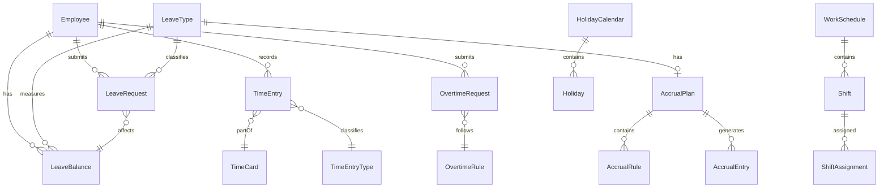

# Entity Catalog: Time & Absence

> **Note**: YAML above is for AI processing. Tables below for human reading.

## Entity Relationship Diagram

---

## A. Leave Management

| ID | Entity | Type | Definition |
|----|--------|------|------------|
| E-TA-001 | **[[LeaveRequest]]** | AGGREGATE_ROOT | Employee request for time off. Central transactional entity. |
| E-TA-002 | **[[LeaveBalance]]** | ENTITY | Current leave entitlement balance by type. |
| E-TA-003 | **[[LeaveType]]** | REFERENCE_DATA | Classification of leave (Annual, Sick, etc.). |
| E-TA-004 | **[[LeaveEntitlement]]** | ENTITY | Specific leave allocation to employee. |

---

## B. Accrual Management

| ID | Entity | Type | Definition |
|----|--------|------|------------|
| E-TA-010 | **[[AccrualPlan]]** | AGGREGATE_ROOT | Rules for how leave is earned over time. |
| E-TA-011 | **[[AccrualRule]]** | ENTITY | Specific rule within accrual plan (seniority tiers). |
| E-TA-012 | **[[AccrualEntry]]** | ENTITY | Single accrual transaction (credit/debit). |

---

## C. Time Tracking

| ID | Entity | Lifecycle | Definition |
|----|--------|-----------|------------|
| E-TA-020 | **[[TimeEntry]]** | Draft → Submitted → Approved → Processed | Record of time worked for specific date. |
| E-TA-021 | **[[TimeCard]]** | Open → Submitted → Approved → Locked | Periodic summary of time entries. |
| E-TA-022 | **[[TimeEntryType]]** | - | Classification of time (Regular, OT, On-call). |
| E-TA-023 | **[[ClockPunch]]** | - | Physical/digital clock in/out event. |

---

## D. Scheduling

| ID | Entity | Type | Definition |
|----|--------|------|------------|
| E-TA-030 | **[[WorkSchedule]]** | ENTITY | Defined pattern of working hours. |
| E-TA-031 | **[[Shift]]** | ENTITY | Specific work period within schedule. |
| E-TA-032 | **[[ShiftAssignment]]** | ENTITY | Assignment of shift to employee for date. |

---

## E. Holiday Management

| ID | Entity | Type | Definition |
|----|--------|------|------------|
| E-TA-040 | **[[HolidayCalendar]]** | AGGREGATE_ROOT | Calendar of holidays for region/org. |
| E-TA-041 | **[[Holiday]]** | ENTITY | Specific non-working day. |

---

## F. Overtime Management

| ID | Entity | Lifecycle | Definition |
|----|--------|-----------|------------|
| E-TA-050 | **[[OvertimeRequest]]** | Submitted → Approved → Completed → Processed | Request for pre-approved overtime. |
| E-TA-051 | **[[OvertimeRule]]** | - | Rules for OT calculation and limits. |

---

## G. Absence Tracking

| ID | Entity | Type | Definition |
|----|--------|------|------------|
| E-TA-060 | **[[AbsenceRecord]]** | ENTITY | Record of actual absence (planned/unplanned). |
| E-TA-061 | **[[AbsenceType]]** | REFERENCE_DATA | Types of absences for tracking. |

---

## Summary Statistics

| Category | Count |
|----------|-------|
| AGGREGATE_ROOT | 5 |
| ENTITY | 11 |
| REFERENCE_DATA | 5 |
| **Total Entities** | **21** |

---

## Domain Terminology

| Term | Definition |
|------|------------|
| **Accrual** | Process of earning leave over time |
| **Entitlement** | Total leave days an employee is entitled to |
| **Balance** | Available days = Entitled - Taken - Scheduled |
| **Carry Forward** | Unused leave transferred to next period |
| **Proration** | Partial calculation for incomplete periods |
| **Time Card** | Summary of time entries for a period |
| **Clock Punch** | Record of clock-in or clock-out event |
