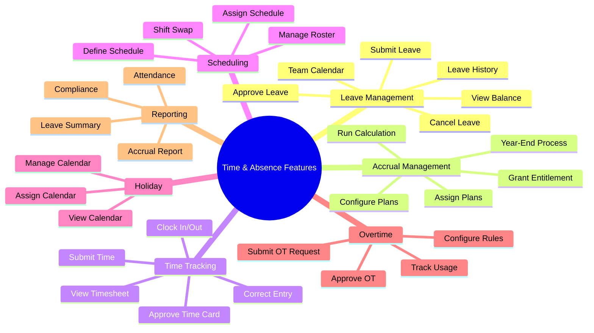

# Feature Catalog: Time & Absence

> **Note**: YAML above is for AI processing. Tables below for human reading.

## Feature Overview Mindmap

---

## Capability: Leave Management

| ID | Feature | Description | Priority | Type |
|----|---------|-------------|----------|------|
| FR-TA-001 | **Submit Leave Request** | As an Employee, I want to submit a leave request... | MUST | Workflow |
| FR-TA-002 | **Approve/Reject Leave** | As a Manager, I want to approve or reject leave... | MUST | Workflow |
| FR-TA-003 | **View Leave Balance** | As an Employee, I want to view my leave balance... | MUST | Functional |
| FR-TA-004 | **Cancel Leave Request** | As an Employee, I want to cancel submitted leave... | MUST | Workflow |
| FR-TA-005 | **View Team Absence Calendar** | As a Manager, I want to view team absences... | SHOULD | Functional |
| FR-TA-006 | **View Leave History** | As an Employee, I want to view my leave history... | SHOULD | Functional |
| FR-TA-007 | **Assign Substitute** | As an Employee, I want to assign a substitute... | COULD | Functional |

---

## Capability: Accrual Management

| ID | Feature | Description | Priority | Type |
|----|---------|-------------|----------|------|
| FR-TA-010 | **Configure Accrual Plan** | As an HR Admin, I want to configure accrual plans... | MUST | Functional |
| FR-TA-011 | **Assign Accrual Plan** | As an HR Admin, I want to assign plans to employees... | MUST | Functional |
| FR-TA-012 | **Run Accrual Calculation** | As an HR Admin, I want to run accrual calculation... | MUST | Workflow |
| FR-TA-013 | **Grant Manual Entitlement** | As an HR Admin, I want to manually grant leave... | SHOULD | Functional |
| FR-TA-014 | **Year-End Carry Forward** | As an HR Admin, I want to process year-end... | MUST | Workflow |

---

## Capability: Time Tracking

| ID | Feature | Description | Priority | Type |
|----|---------|-------------|----------|------|
| FR-TA-020 | **Clock In/Out** | As an Employee, I want to clock in/out... | MUST | Functional |
| FR-TA-021 | **Submit Time Entry** | As an Employee, I want to submit time entries... | MUST | Functional |
| FR-TA-022 | **Approve Time Card** | As a Manager, I want to approve time cards... | MUST | Workflow |
| FR-TA-023 | **View Timesheet** | As an Employee, I want to view my timesheet... | MUST | Functional |
| FR-TA-024 | **Correct Time Entry** | As a Manager, I want to correct time entries... | SHOULD | Functional |

---

## Capability: Scheduling

| ID | Feature | Description | Priority | Type |
|----|---------|-------------|----------|------|
| FR-TA-030 | **Define Work Schedule** | As an HR Admin, I want to define work schedules... | MUST | Functional |
| FR-TA-031 | **Assign Schedule** | As an HR Admin, I want to assign schedules... | MUST | Functional |
| FR-TA-032 | **Manage Shift Roster** | As a Manager, I want to manage shift roster... | SHOULD | Functional |
| FR-TA-033 | **Request Shift Swap** | As an Employee, I want to swap shifts... | COULD | Workflow |

---

## Capability: Holiday Management

| ID | Feature | Description | Priority | Type |
|----|---------|-------------|----------|------|
| FR-TA-040 | **Manage Holiday Calendar** | As an HR Admin, I want to manage holidays... | MUST | Functional |
| FR-TA-041 | **View Holiday Calendar** | As an Employee, I want to view holidays... | MUST | Functional |
| FR-TA-042 | **Assign Calendar** | As an HR Admin, I want to assign calendars... | SHOULD | Functional |

---

## Capability: Overtime Management

| ID | Feature | Description | Priority | Type |
|----|---------|-------------|----------|------|
| FR-TA-050 | **Submit Overtime Request** | As an Employee, I want to request overtime... | SHOULD | Workflow |
| FR-TA-051 | **Approve Overtime** | As a Manager, I want to approve overtime... | SHOULD | Workflow |
| FR-TA-052 | **Configure OT Rules** | As an HR Admin, I want to configure OT rules... | SHOULD | Functional |
| FR-TA-053 | **Track OT Usage** | As an HR Admin, I want to track overtime... | SHOULD | Reporting |

---

## Capability: Compliance & Reporting

| ID | Feature | Description | Priority | Type |
|----|---------|-------------|----------|------|
| FR-TA-060 | **Attendance Report** | As a Manager, I want attendance reports... | SHOULD | Reporting |
| FR-TA-061 | **Leave Summary Report** | As an HR Admin, I want leave reports... | SHOULD | Reporting |
| FR-TA-062 | **Accrual Report** | As an HR Admin, I want accrual reports... | SHOULD | Reporting |
| FR-TA-063 | **Compliance Dashboard** | As an HR Admin, I want compliance dashboard... | SHOULD | Functional |

---

## Business Rules Summary

| ID | Rule | Category | Severity |
|----|------|----------|----------|
| BR-TA-001 | No overlapping approved leaves | Validation | BLOCK |
| BR-TA-002 | Minimum notice period for leave | Validation | WARN |
| BR-TA-003 | Cannot exceed available balance | Validation | BLOCK |
| BR-TA-004 | Probation: no annual leave | Eligibility | BLOCK |
| BR-TA-005 | Manager cannot self-approve | Approval | BLOCK |
| BR-TA-006 | Carry forward max 3 days | Compliance | WARN |
| BR-TA-007 | Daily OT limit: 4 hours | Compliance | BLOCK |
| BR-TA-008 | Monthly OT limit: 40 hours | Compliance | BLOCK |
| BR-TA-009 | Sick leave >3 days needs certificate | Validation | WARN |
| BR-TA-010 | Time entry within 7 days | Validation | WARN |
| BR-TA-011 | Exclude holidays from leave calc | Calculation | BLOCK |
| BR-TA-012 | +1 day per 5 years seniority | Accrual | MUST |

---

## Summary Statistics

| Category | Count |
|----------|-------|
| Capabilities | 7 |
| Features | 30 |
| Business Rules | 12 |
| Priority MUST | 18 |
| Priority SHOULD | 10 |
| Priority COULD | 2 |

---

## Required Document Mapping

### Features → feat.md Files

| Feature | Axiom File | Priority |
|---------|-----------|----------|
| Submit Leave (FR-TA-001,002,004) | `submit-leave-request.feat.md` | MUST |
| View Balance (FR-TA-003,006) | `view-leave-balance.feat.md` | MUST |
| Team Calendar (FR-TA-005) | `team-absence-calendar.feat.md` | SHOULD |
| Accrual Config (FR-TA-010-014) | `manage-accrual-plans.feat.md` | MUST |
| Time Entry (FR-TA-020-024) | `time-tracking.feat.md` | MUST |
| Scheduling (FR-TA-030-033) | `manage-schedules.feat.md` | SHOULD |
| Holiday (FR-TA-040-042) | `manage-holidays.feat.md` | MUST |
| Overtime (FR-TA-050-053) | `overtime-management.feat.md` | SHOULD |
| Reports (FR-TA-060-063) | `ta-reports.feat.md` | SHOULD |

### Business Rules → brs.md Files

| Area | Axiom File | Priority |
|------|-----------|----------|
| Leave Policy | `leave-policy.brs.md` | MUST |
| Accrual Rules | `accrual-rules.brs.md` | MUST |
| Overtime Rules | `overtime-rules.brs.md` | MUST |
| Time Tracking | `time-tracking-rules.brs.md` | SHOULD |

### Workflows → flow.md Files

| Workflow | Axiom File | Priority |
|----------|-----------|----------|
| Leave Submission | `submit-leave-flow.flow.md` | MUST |
| Leave Approval | `approve-leave-flow.flow.md` | MUST |
| Accrual Calculation | `calculate-accrual-flow.flow.md` | MUST |
| Time Entry | `submit-time-flow.flow.md` | MUST |
| OT Request | `overtime-request-flow.flow.md` | SHOULD |
| Leave Cancellation | `cancel-leave-flow.flow.md` | SHOULD |
