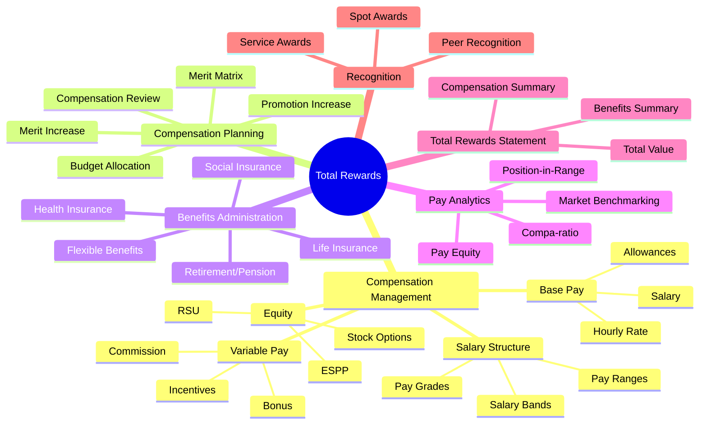

# Domain Research: Total Rewards

## 1. Executive Summary

Total Rewards is a comprehensive HCM module that manages all aspects of employee compensation and benefits. It encompasses base pay, variable pay (bonuses, commissions), equity/stock, benefits, and recognition programs. The module serves as the **economic engine** of the employee relationship, directly impacting attraction, retention, and motivation.

**Key Competitors Analyzed**: Workday, SAP SuccessFactors, Oracle HCM Cloud, ADP

### Business Value

- **Talent attraction** through competitive compensation packages
- **Retention improvement** via comprehensive benefits
- **Pay equity assurance** with analytics and benchmarking
- **Budget control** through compensation planning
- **Compliance** with labor laws and tax regulations

### Strategic Positioning

| Competitor | Key Strength | Unique Approach |
|------------|--------------|-----------------|
| **Workday** | Unified compensation plans | Real-time analytics, pay equity dashboard |
| **SAP SuccessFactors** | Pay-for-performance | Budget modeling, what-if scenarios |
| **Oracle HCM Cloud** | Global compensation | Individual Compensation Distribution (ICD) |
| **ADP** | Payroll integration | Strong compliance, market data |

---

## 2. Domain Map

---

## 3. Sub-Module Breakdown

### 3.1 Salary Structure

**Purpose**: Define the framework for how compensation is organized.

| Component | Description |
|-----------|-------------|
| **Pay Grade** | Classification level for jobs based on value |
| **Pay Range** | Min/Mid/Max salary for each grade |
| **Salary Band** | Grouping of grades (broader classification) |
| **Job Pricing** | Market value assignment to jobs |

**Key Concepts**:
- **Compa-ratio**: Employee salary ÷ Range midpoint × 100
- **Position-in-Range**: Where employee falls within range
- **Range Spread**: (Max - Min) ÷ Min × 100

### 3.2 Compensation Plans

**Purpose**: Define different types of pay elements.

| Plan Type | Description | Frequency |
|-----------|-------------|-----------|
| **Base Salary** | Fixed regular pay | Monthly |
| **Hourly** | Pay per hour worked | Based on time |
| **Allowance** | Fixed additional pay | Monthly |
| **Bonus** | Performance-based reward | Annual/Quarterly |
| **Commission** | Sales-based pay | Per transaction |
| **Merit Increase** | Annual salary increase | Annual |
| **Stock** | Equity compensation | Vesting |

### 3.3 Compensation Planning

**Purpose**: Annual process for budget allocation and salary adjustments.

| Component | Description |
|-----------|-------------|
| **Compensation Cycle** | Annual review period |
| **Budget Allocation** | Department budget distribution |
| **Merit Matrix** | Performance × Compa-ratio grid |
| **Manager Worksheet** | Interface for recommendations |
| **Approval Workflow** | Multi-level approval process |

**Competitor Insights**:
- **Workday**: Flexible merit process with lump sum options
- **SAP**: What-if scenario modeling
- **Oracle**: Top-down and bottom-up budgeting

### 3.4 Benefits Administration

**Purpose**: Manage employee benefit programs.

| Benefit Type | Examples |
|--------------|----------|
| **Health** | Medical, Dental, Vision |
| **Life** | Life insurance, AD&D |
| **Retirement** | Pension, 401k equivalent |
| **Wellness** | Gym, Health programs |
| **Flexible** | Flex credits, Cafeteria plan |

**Vietnam-Specific Benefits**:

| Type | Employer % | Employee % | Notes |
|------|------------|------------|-------|
| Social Insurance | 17.5% | 8% | Mandatory |
| Health Insurance | 3% | 1.5% | Mandatory |
| Unemployment Insurance | 1% | 1% | Mandatory |
| **Total** | **21.5%** | **10.5%** | Of gross salary |

### 3.5 Total Rewards Statement

**Purpose**: Communicate total value of employment to employees.

| Component | Description |
|-----------|-------------|
| Base Compensation | Salary, allowances |
| Variable Compensation | Bonuses, incentives |
| Benefits Value | Insurance, pension contributions |
| Time Off Value | Leave days monetary value |
| Total Value | Sum of all components |

---

## 4. Strategic Insights

### 4.1 Best Practices from Competitors

| Practice | Source | Recommendation |
|----------|--------|----------------|
| Pay Equity Dashboard | Workday | Proactive identification of pay gaps |
| Merit Matrix | All | Link increases to performance + position-in-range |
| Total Rewards Statement | All | Annual statement showing full value |
| Market Benchmarking | Oracle, ADP | Regular comparison to market data |
| Budget Modeling | SAP | What-if scenarios before final allocation |

### 4.2 Vietnam-Specific Considerations

| Requirement | Description |
|-------------|-------------|
| Minimum Wage | Regional minimums (I, II, III, IV) |
| 13th Month Salary | Common but not mandatory |
| Social Insurance | Mandatory contributions |
| Personal Income Tax | Progressive rates 5-35% |
| Overtime Rates | 1.5x (weekday), 2x (weekend), 3x (holiday) |
| Probation Salary | Minimum 85% of official salary |

### 4.3 Gaps & Risks

| Gap/Risk | Impact | Mitigation |
|----------|--------|------------|
| Pay equity issues | Legal/reputation risk | Regular equity analysis |
| Budget overrun | Financial impact | Real-time budget tracking |
| Benefit enrollment errors | Compliance issues | Automated eligibility |
| Market competitiveness | Retention issues | Regular benchmarking |

### 4.4 Recommendations

1. **Unified Compensation Model**: Single system for all pay types
2. **Pay Equity Analytics**: Built-in analysis tools
3. **Merit Matrix Integration**: Link performance to compensation
4. **Total Rewards Portal**: Employee self-service for full visibility
5. **Vietnam SI Integration**: Automated calculation and reporting

---

## 5. Required Axiom Codex Documents

Based on this research, the following documents are needed for Total Rewards module:

### 5.1 Ontology Files (`*.onto.md`)

| File | Entity | Type | Priority |
|------|--------|------|----------|
| `compensation-plan.onto.md` | CompensationPlan | AGGREGATE_ROOT | MUST |
| `compensation-element.onto.md` | CompensationElement | ENTITY | MUST |
| `pay-grade.onto.md` | PayGrade | ENTITY | MUST |
| `pay-range.onto.md` | PayRange | ENTITY | MUST |
| `salary-basis.onto.md` | SalaryBasis | ENTITY | MUST |
| `employee-compensation.onto.md` | EmployeeCompensation | AGGREGATE_ROOT | MUST |
| `compensation-change.onto.md` | CompensationChange | ENTITY | MUST |
| `merit-increase.onto.md` | MeritIncrease | ENTITY | SHOULD |
| `bonus.onto.md` | Bonus | ENTITY | SHOULD |
| `benefit-plan.onto.md` | BenefitPlan | AGGREGATE_ROOT | MUST |
| `benefit-enrollment.onto.md` | BenefitEnrollment | ENTITY | MUST |
| `dependent.onto.md` | Dependent | ENTITY | MUST |
| `total-rewards-statement.onto.md` | TotalRewardsStatement | ENTITY | SHOULD |
| `compensation-cycle.onto.md` | CompensationCycle | AGGREGATE_ROOT | MUST |
| `merit-matrix.onto.md` | MeritMatrix | ENTITY | SHOULD |
| `element-type.onto.md` | ElementType | REFERENCE_DATA | MUST |
| `benefit-type.onto.md` | BenefitType | REFERENCE_DATA | MUST |

### 5.2 Business Rules (`*.brs.md`)

| File | Area | Priority |
|------|------|----------|
| `compensation-rules.brs.md` | Salary calculation, min wage | MUST |
| `merit-rules.brs.md` | Merit increase guidelines | MUST |
| `benefit-eligibility.brs.md` | Benefit eligibility rules | MUST |
| `vietnam-si-rules.brs.md` | Social insurance rules | MUST |
| `pay-equity-rules.brs.md` | Pay equity constraints | SHOULD |

### 5.3 Feature Specifications (`*.feat.md`)

| File | Feature | Priority |
|------|---------|----------|
| `manage-salary-structure.feat.md` | Pay grades/ranges | MUST |
| `manage-compensation-plans.feat.md` | Plan configuration | MUST |
| `manage-employee-compensation.feat.md` | Individual compensation | MUST |
| `process-merit-increase.feat.md` | Annual merit cycle | MUST |
| `manage-benefits.feat.md` | Benefits admin | MUST |
| `enroll-benefits.feat.md` | Employee enrollment | MUST |
| `view-total-rewards.feat.md` | TRS for employees | SHOULD |
| `compensation-analytics.feat.md` | Pay equity, compa-ratio | SHOULD |

### 5.4 Controller Flows (`*.flow.md`)

| File | Workflow | Priority |
|------|----------|----------|
| `salary-change-flow.flow.md` | Process salary changes | MUST |
| `merit-cycle-flow.flow.md` | Annual merit process | MUST |
| `benefit-enrollment-flow.flow.md` | Open enrollment | MUST |
| `promotion-compensation-flow.flow.md` | Promotion with pay change | SHOULD |
| `generate-trs-flow.flow.md` | Generate statements | SHOULD |

### 5.5 Interface Units (`*.api.md`)

| File | Function | Priority |
|------|----------|----------|
| `calculate-compa-ratio.api.md` | Compa-ratio calculation | MUST |
| `get-employee-compensation.api.md` | Retrieve compensation | MUST |
| `update-salary.api.md` | Update base salary | MUST |
| `calculate-merit.api.md` | Merit from matrix | MUST |
| `check-benefit-eligibility.api.md` | Eligibility check | MUST |
| `calculate-si-contribution.api.md` | Vietnam SI calculation | MUST |
| `generate-trs.api.md` | Generate statement | SHOULD |

---

## 6. Document Summary

| Document Type | Count | Listed In |
|---------------|-------|-----------|
| Ontology (`*.onto.md`) | 17 | entity-catalog.md |
| Business Rules (`*.brs.md`) | 5 | feature-catalog.md |
| Features (`*.feat.md`) | 8 | feature-catalog.md |
| Flows (`*.flow.md`) | 5 | feature-catalog.md |
| APIs (`*.api.md`) | 7 | feature-catalog.md |

**Total Documents Required**: ~42 files

See detailed breakdowns in:
- [entity-catalog.md](entity-catalog.md) - Entity definitions
- [feature-catalog.md](feature-catalog.md) - Feature specifications
