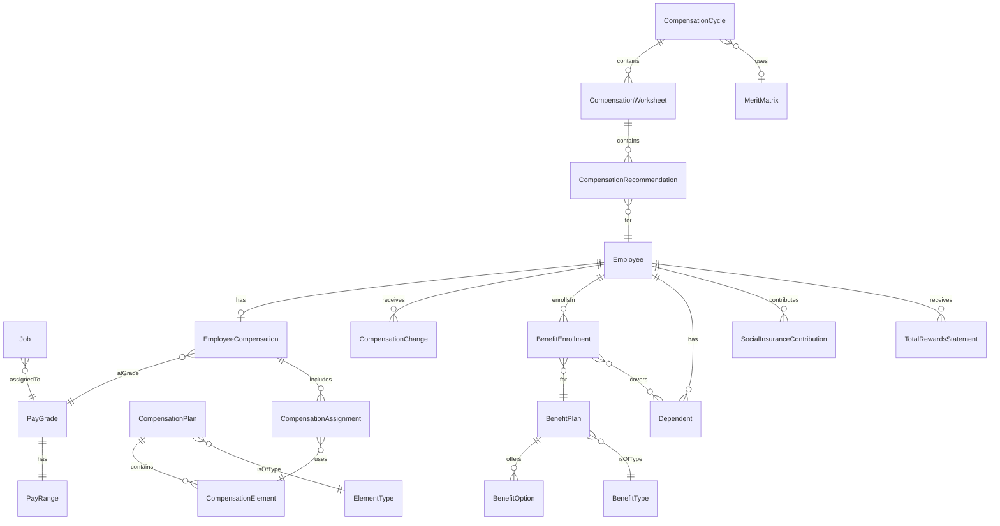

# Entity Catalog: Total Rewards

> **Note**: YAML above is for AI processing. Tables below for human reading.

## Entity Relationship Diagram

---

## A. Salary Structure

| ID | Entity | Type | Definition |
|----|--------|------|------------|
| E-TR-001 | **[[PayGrade]]** | ENTITY | Classification level grouping jobs of similar value. |
| E-TR-002 | **[[PayRange]]** | ENTITY | Min/Mid/Max salary values for a pay grade. |
| E-TR-003 | **[[SalaryBasis]]** | REFERENCE_DATA | How salary is measured (Annual, Monthly, Hourly). |

---

## B. Compensation Plans

| ID | Entity | Type | Definition |
|----|--------|------|------------|
| E-TR-010 | **[[CompensationPlan]]** | AGGREGATE_ROOT | Configuration defining a type of compensation. |
| E-TR-011 | **[[CompensationElement]]** | ENTITY | Specific pay component within a plan. |
| E-TR-012 | **[[ElementType]]** | REFERENCE_DATA | Classification (Salary, Bonus, Allowance, Deduction). |

---

## C. Employee Compensation

| ID | Entity | Lifecycle | Definition |
|----|--------|-----------|------------|
| E-TR-020 | **[[EmployeeCompensation]]** | - | Complete compensation package for an employee. |
| E-TR-021 | **[[CompensationAssignment]]** | - | Assignment of element to employee. |
| E-TR-022 | **[[CompensationChange]]** | Proposed → Approved → Effective → Completed | Record of compensation changes. |

---

## D. Compensation Planning

| ID | Entity | Lifecycle | Definition |
|----|--------|-----------|------------|
| E-TR-030 | **[[CompensationCycle]]** | Planning → Open → InReview → Approved → Processed → Closed | Annual/periodic review cycle. |
| E-TR-031 | **[[CompensationWorksheet]]** | Draft → Submitted → Approved → Processed | Manager's worksheet for recommendations. |
| E-TR-032 | **[[CompensationRecommendation]]** | - | Individual employee recommendation. |
| E-TR-033 | **[[MeritMatrix]]** | - | Performance × Compa-ratio grid. |
| E-TR-034 | **[[MeritMatrixCell]]** | - | Single cell with increase percentages. |

---

## E. Benefits Administration

| ID | Entity | Lifecycle | Definition |
|----|--------|-----------|------------|
| E-TR-040 | **[[BenefitPlan]]** | - | Benefit offering for eligible employees. |
| E-TR-041 | **[[BenefitType]]** | - | Classification (Health, Life, Retirement). |
| E-TR-042 | **[[BenefitOption]]** | - | Coverage options within a plan. |
| E-TR-043 | **[[BenefitEnrollment]]** | Pending → Active → OnHold → Terminated | Employee's enrollment in a plan. |
| E-TR-044 | **[[Dependent]]** | - | Family member covered by benefit. |
| E-TR-045 | **[[OpenEnrollment]]** | Pending → Open → Closed → Processed | Annual enrollment period. |

---

## F. Vietnam Social Insurance

| ID | Entity | Type | Definition |
|----|--------|------|------------|
| E-TR-050 | **[[SocialInsuranceContribution]]** | ENTITY | Monthly SI/HI/UI contribution record. |

---

## G. Total Rewards Statement

| ID | Entity | Type | Definition |
|----|--------|------|------------|
| E-TR-060 | **[[TotalRewardsStatement]]** | ENTITY | Annual statement of total value. |

---

## Summary Statistics

| Category | Count |
|----------|-------|
| AGGREGATE_ROOT | 4 |
| ENTITY | 16 |
| VALUE_OBJECT | 1 |
| REFERENCE_DATA | 3 |
| **Total Entities** | **24** |

---

## Domain Terminology

| Term | Definition |
|------|------------|
| **Compa-ratio** | Employee salary ÷ Range midpoint × 100 |
| **Position-in-Range** | Where salary falls within min-max range |
| **Range Spread** | (Max - Min) ÷ Min × 100 |
| **Merit Increase** | Annual salary increase based on performance |
| **Merit Matrix** | Grid mapping performance to increase % |
| **Total Rewards** | Sum of all compensation and benefits |
| **Social Insurance (SI)** | Vietnam mandatory contribution (17.5% + 8%) |
| **Health Insurance (HI)** | Vietnam mandatory (3% + 1.5%) |
| **Unemployment Insurance (UI)** | Vietnam mandatory (1% + 1%) |
