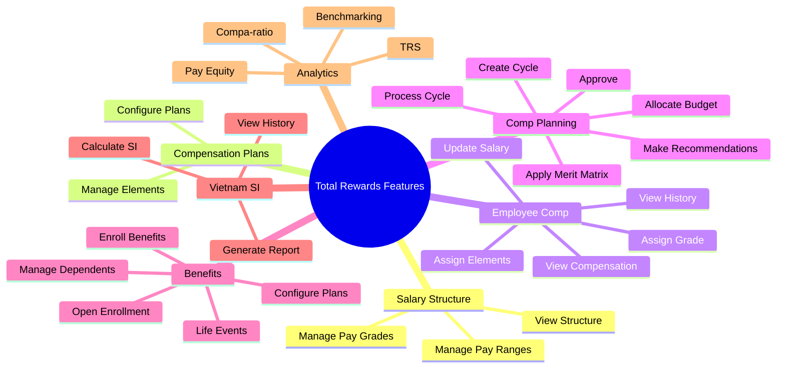

# Feature Catalog: Total Rewards

> **Note**: YAML above is for AI processing. Tables below for human reading.

## Feature Overview Mindmap

---

## Capability: Salary Structure Management

| ID | Feature | Description | Priority | Type |
|----|---------|-------------|----------|------|
| FR-TR-001 | **Manage Pay Grades** | As an HR Admin, I want to manage pay grades... | MUST | Functional |
| FR-TR-002 | **Manage Pay Ranges** | As an HR Admin, I want to define pay ranges... | MUST | Functional |
| FR-TR-003 | **View Salary Structure** | As a Manager, I want to view salary structure... | SHOULD | Functional |

---

## Capability: Compensation Plan Management

| ID | Feature | Description | Priority | Type |
|----|---------|-------------|----------|------|
| FR-TR-010 | **Configure Compensation Plans** | As an HR Admin, I want to configure plans... | MUST | Functional |
| FR-TR-011 | **Manage Compensation Elements** | As an HR Admin, I want to manage elements... | MUST | Functional |

---

## Capability: Employee Compensation

| ID | Feature | Description | Priority | Type |
|----|---------|-------------|----------|------|
| FR-TR-020 | **View Employee Compensation** | As a Manager, I want to view compensation... | MUST | Functional |
| FR-TR-021 | **Update Employee Salary** | As an HR Admin, I want to update salary... | MUST | Workflow |
| FR-TR-022 | **Assign Compensation Elements** | As an HR Admin, I want to assign elements... | MUST | Functional |
| FR-TR-023 | **Assign Pay Grade** | As an HR Admin, I want to assign pay grade... | MUST | Functional |
| FR-TR-024 | **View Compensation History** | As an Employee, I want to view history... | SHOULD | Functional |

---

## Capability: Compensation Planning

| ID | Feature | Description | Priority | Type |
|----|---------|-------------|----------|------|
| FR-TR-030 | **Create Compensation Cycle** | As an HR Admin, I want to create cycle... | MUST | Functional |
| FR-TR-031 | **Allocate Budget** | As an HR Admin, I want to allocate budget... | MUST | Functional |
| FR-TR-032 | **Make Recommendations** | As a Manager, I want to make recommendations... | MUST | Workflow |
| FR-TR-033 | **Apply Merit Matrix** | As a Manager, I want merit matrix applied... | SHOULD | Functional |
| FR-TR-034 | **Approve Recommendations** | As an HR Admin, I want to approve... | MUST | Workflow |
| FR-TR-035 | **Process Cycle** | As an HR Admin, I want to process cycle... | MUST | Workflow |

---

## Capability: Benefits Administration

| ID | Feature | Description | Priority | Type |
|----|---------|-------------|----------|------|
| FR-TR-040 | **Configure Benefit Plans** | As an HR Admin, I want to configure plans... | MUST | Functional |
| FR-TR-041 | **Manage Open Enrollment** | As an HR Admin, I want to manage enrollment... | SHOULD | Workflow |
| FR-TR-042 | **Enroll in Benefits** | As an Employee, I want to enroll... | MUST | Workflow |
| FR-TR-043 | **Manage Dependents** | As an Employee, I want to manage dependents... | MUST | Functional |
| FR-TR-044 | **View Benefit Enrollment** | As an Employee, I want to view enrollments... | MUST | Functional |
| FR-TR-045 | **Process Life Event** | As an HR Admin, I want to process life events... | SHOULD | Workflow |

---

## Capability: Vietnam Social Insurance

| ID | Feature | Description | Priority | Type |
|----|---------|-------------|----------|------|
| FR-TR-050 | **Calculate SI Contributions** | As an HR Admin, I want to calculate SI... | MUST | Functional |
| FR-TR-051 | **View SI History** | As an Employee, I want to view SI history... | SHOULD | Functional |
| FR-TR-052 | **Generate SI Report** | As an HR Admin, I want to generate SI report... | MUST | Reporting |

---

## Capability: Compensation Analytics

| ID | Feature | Description | Priority | Type |
|----|---------|-------------|----------|------|
| FR-TR-060 | **Calculate Compa-Ratio** | As an HR Admin, I want to calculate compa-ratio... | MUST | Functional |
| FR-TR-061 | **Analyze Pay Equity** | As an HR Admin, I want to analyze pay equity... | SHOULD | Reporting |
| FR-TR-062 | **Benchmark Salaries** | As an HR Admin, I want to benchmark salaries... | SHOULD | Functional |
| FR-TR-063 | **Generate TRS** | As an Employee, I want to receive TRS... | SHOULD | Workflow |

---

## Business Rules Summary

| ID | Rule | Category | Severity |
|----|------|----------|----------|
| BR-TR-001 | Salary must be within pay range | Validation | WARN |
| BR-TR-002 | Must meet minimum wage | Compliance | BLOCK |
| BR-TR-003 | Merit within matrix guidelines | Validation | WARN |
| BR-TR-004 | Cannot exceed budget | Validation | BLOCK |
| BR-TR-005 | Probation salary ≥ 85% | Compliance | BLOCK |
| BR-TR-006 | SI ceiling = 20x min wage | Compliance | BLOCK |
| BR-TR-007 | Dependent age limit | Eligibility | BLOCK |
| BR-TR-008 | Benefit eligibility check | Eligibility | BLOCK |
| BR-TR-009 | One active pay grade | Validation | BLOCK |
| BR-TR-010 | Manager cannot self-approve | Approval | BLOCK |

---

## Summary Statistics

| Category | Count |
|----------|-------|
| Capabilities | 7 |
| Features | 28 |
| Business Rules | 10 |
| Priority MUST | 21 |
| Priority SHOULD | 7 |

---

## Required Document Mapping

### Features → feat.md Files

| Feature | Axiom File | Priority |
|---------|-----------|----------|
| Salary Structure (FR-TR-001-003) | `manage-salary-structure.feat.md` | MUST |
| Compensation Plans (FR-TR-010-011) | `manage-compensation-plans.feat.md` | MUST |
| Employee Compensation (FR-TR-020-024) | `manage-employee-compensation.feat.md` | MUST |
| Compensation Planning (FR-TR-030-035) | `compensation-planning.feat.md` | MUST |
| Benefits (FR-TR-040-045) | `manage-benefits.feat.md` | MUST |
| Vietnam SI (FR-TR-050-052) | `vietnam-si.feat.md` | MUST |
| Analytics (FR-TR-060-063) | `compensation-analytics.feat.md` | SHOULD |

### Business Rules → brs.md Files

| Area | Axiom File | Priority |
|------|-----------|----------|
| Compensation Rules | `compensation-rules.brs.md` | MUST |
| Merit Rules | `merit-rules.brs.md` | MUST |
| Benefit Eligibility | `benefit-eligibility.brs.md` | MUST |
| Vietnam SI Rules | `vietnam-si-rules.brs.md` | MUST |

### Workflows → flow.md Files

| Workflow | Axiom File | Priority |
|----------|-----------|----------|
| Salary Change | `salary-change-flow.flow.md` | MUST |
| Merit Cycle | `merit-cycle-flow.flow.md` | MUST |
| Benefit Enrollment | `benefit-enrollment-flow.flow.md` | MUST |
| TRS Generation | `generate-trs-flow.flow.md` | SHOULD |
